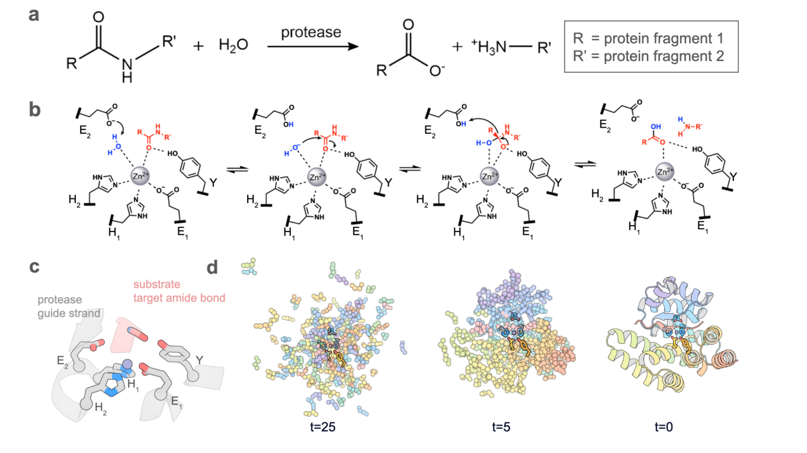
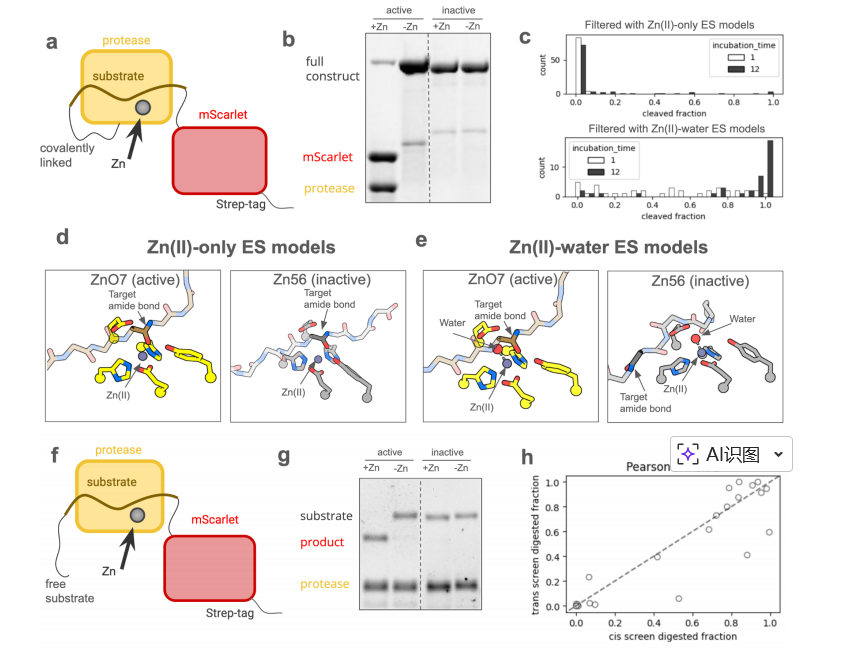
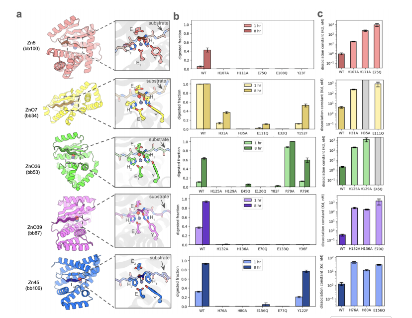
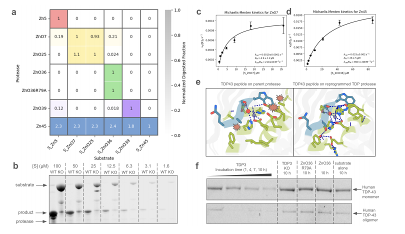

# Computational design of metalloproteases

### Link:[ full article](https://www.biorxiv.org/content/10.1101/2025.11.20.689622v1)

Arthur: Anqi Chen, ... , David Baker

November 21, 2025

---

## Part 1: Background and Scientific Challenges

### 1.1 The "Thermodynamic and Kinetic Barriers" of Peptide Bond Hydrolysis

Metalloproteases play essential roles in biological processes, including tissue remodeling, cell migration, and signaling. Beyond biology, they have widespread uses in industry and medicine. However, thus far, the computational design of de novo metallohydrolases has focused on small molecule ester substrates with activated leaving groups.

In contrast, achieving efficient amide bond (peptide bond) hydrolysis poses a far greater challenge:

* 
**Thermodynamic Stability:** Amides are much less reactive than esters due to resonance stabilization.

* 
**Kinetic Inertness:** The amine leaving group in proteins is intrinsically poor, with a  of >35 compared to <8 for typical activated esters.

* 
**Extremely Low Reaction Rate:** Consequently, spontaneous peptide hydrolysis under physiological conditions is exceedingly slow, with half-lives on the order of hundreds of years.

### 1.2 Core Design Difficulties

To overcome these barriers, artificially designed enzymes must possess extremely precise microstructures:

1. 
**Active Site Geometry:** Active sites must integrate precise metal coordination with strategically positioned general acid-base residues to facilitate transition state stabilization and proton transfer.

2. 
**Substrate Binding Interface:** The interface must be carefully designed to ensure both binding and accurate positioning of the target amide bond at the active site.

This study aims to use deep learning-based methods to address these challenges and enable the de novo design of metalloproteases that are both proficient and specific.

---

## Part 2: Methodology and Core Findings

To solve the aforementioned problems, the research team adopted a systematic strategy integrating **"active site construction," "deep learning scaffold generation," and "explicit water molecule screening."**

### 2.1 Biomimetic Strategy: Constructing an Ideal Active Site

The researchers began by constructing an ideal catalytic motif based on native enzyme structures:

* 
**Metal Binding Site:** Three zinc-coordinating residues () were extracted from the crystal structure of aminopeptidase N.

* 
**Catalytic Auxiliary Residues:** A general base () was introduced to activate the water molecule, along with a tyrosine (Y) acting as an oxyanion hole stabilizer for the transition state.

* 
**Substrate Positioning:** Modeled after astacin, the substrate was designed to bind in the protease cleft as an antiparallel beta strand to ensure precise spatial positioning.

### 2.2 Generative AI: RFD2-MI and Two-Sided Design

After establishing the core catalytic elements, the study utilized a fine-tuned diffusion model, **RFD2-MI**, to generate the supporting scaffolds.

* 
**Scaffold Generation:** Starting from random residue distributions, the model progressively denoised them to generate protein scaffolds that satisfied the geometric constraints of the active site.

* 
**Two-Sided Design:** The team performed a two-sided design of both the protease sequence and the substrate sequence. This approach ensured highly complementary interfaces where the substrate sequence is unique for each design.

### 2.3 The Breakthrough: Explicit Water Molecule Screening Mechanism

A methodological breakthrough in this study was discovering the decisive role of **explicit water molecules** in computational screening.

* 
**Initial Limitations:** Initially, when using AlphaFold3 (AF3) for modeling with only the zinc ion (), the success rate of the designs was low.

* 
**Mechanistic Insight:** The researchers recognized that the nucleophilic water molecule is critical for catalysis in zinc proteases.

* 
**Model Correction:** By explicitly including both the zinc ion and the coordinating water () in the model, they found that in inactive designs, the water sterically prevented productive substrate binding, displacing the target amide bond. In contrast, active designs properly positioned the scissile amide for nucleophilic attack.

* 
**Improved Results:** Incorporating this screening criterion significantly improved the success rate to **87.5%** for the designs assessed by this strategy.

### 2.4 Experimental Validation: Rate and Specificity

* 
**Catalytic Efficiency:** The most active design, ZnO7, accelerated peptide bond hydrolysis more than -fold compared to the uncatalyzed reaction.

* 
**Reprogramming Application:** By reprogramming the binding pocket, the researchers successfully engineered a variant (TDP3) capable of specifically cleaving the ALS-associated pathogenic protein TDP-43. Notably, this enzyme processed oligomers faster than monomers.

---

## Part 3: Key Figure Analysis

The following is a detailed interpretation of the four core figures in the paper to elucidate their scientific logic.

### Figure 1: Computational Design Workflow and Catalytic Principle

This figure illustrates the entire process from chemical principles to computational generation.

* 
**Figures a & b (Reaction Mechanism):** These illustrate the chemical equation for proteolytic hydrolysis and the reaction mechanism of zinc proteases: a zinc ion (grey sphere) coordinates residues, activates a water molecule (blue), and attacks the substrate carbonyl carbon with the aid of a glutamate () and tyrosine (Y).

* **Figure c (Input Conditions):** This defines the input motif for the AI. The catalytic residues (grey) and the substrate (pink) are strictly defined in terms of their spatial relationship.

* 
**Figure d (Generation Trajectory):** This shows how the RFD2-MI model progressively "denoises" a random distribution (t=25) to generate a structured protein scaffold (t=0) that accommodates the active site.

### Figure 2: Screening Strategy and the Discovery of the "Water" Mechanism

This figure reveals how the explicit water model differentiates between active and inactive designs.

* 
**Figures a & f (Screening Methods):** Two screening systems were established: a "cis" screen (protease covalently linked to substrate) for high-throughput initial screening , and a "trans" screen (separate chains) to verify activity under true catalytic conditions.

* **Figure d vs. e (Structural Comparison):** This is the key contrast.
* 
**Figure d (-only):** In models without the water molecule, the substrate binding modes of the active design (ZnO7) and the inactive design (Zn56) show no distinction.

* 
**Figure e (-water):** Upon introducing the explicit water molecule (red sphere), the inactive design (Zn56) shows a displaced substrate due to steric hindrance, preventing catalysis; the active design (ZnO7) maintains precise positioning. This finding established the structural basis for efficient screening.

### Figure 3: Activity Validation and Mechanistic Characterization

This figure provides molecular-level evidence that "function comes from design."

* 
**Figure a (Structural Diversity):** AF3 models of four active protease designs with different topologies (e.g., beta-sheet or alpha-helix dominated) are shown, demonstrating the versatility of the design strategy.

* **Figure b (Mutational Analysis):** Site-directed mutagenesis was used to knock out individual catalytic residues (e.g., mutating histidine to alanine). The results showed that removing any key residue reduced activity by at least sevenfold, confirming that the observed activity indeed arises from the designed active sites.

* **Figure c (Affinity Measurement):** The dissociation constants () for the protease and zinc ion were measured. The data indicate that the designed enzymes bind  tightly, with  values in the range between  and  M, demonstrating the structural stability of the active center.

### Figure 4: Specificity and Disease-Targeting Applications

This figure demonstrates the specificity of the designed enzymes and their reprogramming potential for therapeutic applications.

* 
**Figure a (Specificity Heatmap):** Cross-reactivity experiments show that designs exhibited preferential cleavage for their cognate designed substrates (darkest color on the diagonal), indicating that the two-sided design strategy successfully conferred high substrate specificity.

* **Figure e (Reprogramming Strategy):** This illustrates the redesign process for the new target TDP-43. The right panel shows that binding the TDP substrate to the parent protease results in clashes, while the left panel shows the reprogrammed protease forming a well-packed interface with the new substrate.

* 
**Figure f (Targeted Cleavage):** Experimental results confirm that the reprogrammed enzyme (TDP3) cleaved full-length human TDP-43 over time (1-10 hours), with faster processing observed for oligomeric forms compared to monomers.

## citation:
Chen, A., Wu, K., Choi, H., Venkatesh, P., Pellock, S. J., Hanikel, N., ... & Baker, D. (2025). Computational design of metalloproteases. bioRxiv, 2025-11.