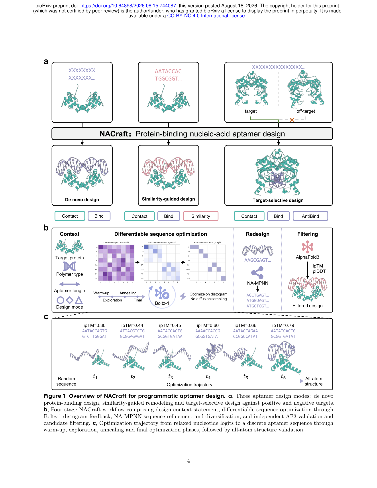
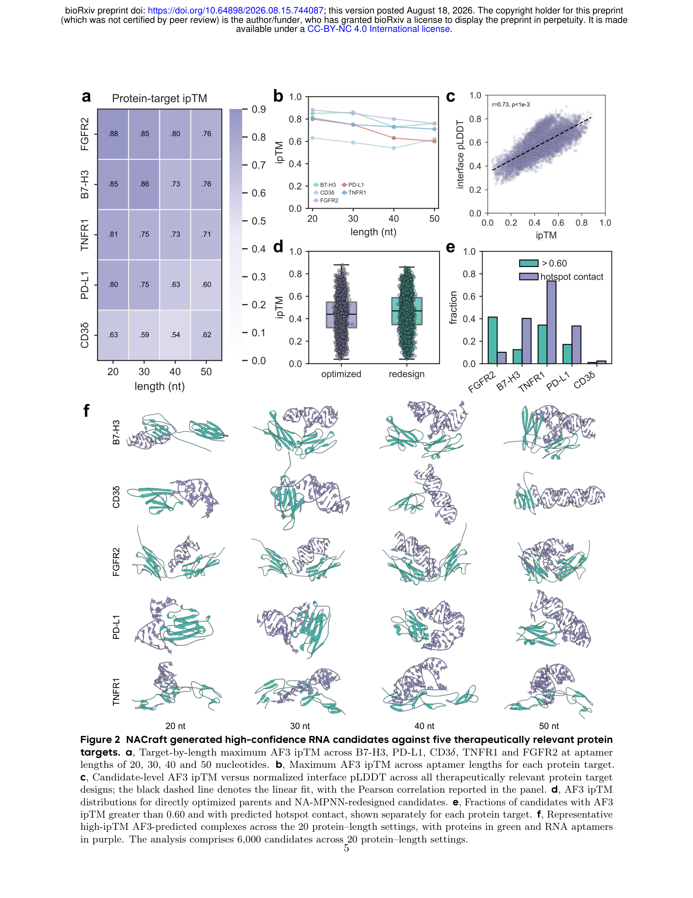

# NACraft: Programmatic nucleic-acid aptamer design via all-atom structure-model feedback

### Link: [full article](https://doi.org/10.64898/2026.08.15.744087)

Authors: Heqin Zhu, Jiaqi Wang, Weibo Zhao, ..., Odin Zhang

bioRxiv, August 2026

---
Designing nucleic-acid aptamers has always been hard: sequence, folded structure and target binding are tightly coupled, and the traditional route of SELEX screening has limited throughput.

This preprint from Valhalla Technology together with teams at CUHK and Peking University introduces **NACraft**, a framework for nucleic-acid aptamer design that requires no training. The core idea: **write the design goals as loss functions and optimize the sequence directly through feedback from a structure prediction model**. Designing an aptamer becomes something close to writing code.

## Part 1: Research Question

The paper tackles a classic but difficult **inverse design problem**: given the structure of a target protein, can we design from scratch an RNA or DNA sequence that has never existed before, such that it folds into a suitable three-dimensional structure and binds the target?

The difficulty is that aptamer function depends strongly on **three coupled factors**:

1\. **Sequence** determines folding

2\. **3D conformation** determines whether binding is possible

3\. **The binding interface** in turn constrains sequence and structure

This differs from designing RNA secondary structure alone, and also from protein binder design. In nucleic-acid systems, base pairing, tertiary structure and intermolecular binding are coupled, and both DNA and RNA have to be supported.

**The gap in existing methods**

Traditional nucleic-acid design methods mostly work from a **given secondary structure**; many data-driven methods do not explicitly use the **3D structure of the target**.

Generative approaches such as **ODesign** can do RNA/DNA design, but they lean toward de novo generation and offer weaker support for "remodeling an existing aptamer" and for explicitly optimizing selectivity and off-target avoidance.

Hence the authors' question: can the **structure hallucination / model inversion** idea from the protein field be genuinely extended to nucleic-acid aptamer design?

## Part 2: Methodology

NACraft has four steps:

**Step 1: define the design context**

Which target protein, whether to design RNA or DNA, how long the aptamer should be, and what to optimize (binding, avoiding binding, staying similar to a reference sequence, and so on).

**Step 2: differentiable sequence optimization**

The **Boltz-1** structure model provides the feedback. The loss is built directly from its **distogram** output: the model predicts the probability that the distance between any two tokens falls into each bin, and the loss is defined by summing over "contact probability". This makes the objective differentiable and efficient, and well suited to gradient optimization in sequence space.

The sequence is represented as a continuous logit tensor (L×8), and a **straight-through estimator** makes the discrete sequence differentiable. Annealing proceeds in stages: 30 warm-up steps → 100 exploration steps → 100 annealing steps → 10 final steps, searching broadly early and converging later.

**Step 3: NA-MPNN redesign and diversification**

Gradient optimization yields a good "parent sequence", which then goes through structure-driven refinement and diversification with NA-MPNN. Ablations show that maximum ipTM and pLDDT improve at this step for 12/12 targets, with 8SWC as a typical example: 0.66 → 0.93.

**Step 4: independent validation and filtering with AF3**

**AlphaFold3** independently predicts the complex, and candidates are scored with ipTM, pLDDT, iPAE and related metrics. The key design choice: **Boltz-1 supplies the gradients during optimization while AF3 provides independent validation at evaluation time**, which avoids letting one model vouch for itself.

**Boltz-guided search + MPNN redesign + AF3 validation** together form a complete multi-stage design system.

The word NACraft emphasizes most is **programmatic**: objective terms can be composed like building blocks:

| Loss function | Role | Used in which mode |
|---|---|---|
| **Binding loss** | Promotes contact between the aptamer and the target protein | All |
| **Anti-binding loss** | Suppresses binding to off-targets (the reverse of the binding term) | Target-selective |
| **Internal-contact** | Keeps the aptamer itself compactly folded (it cannot just plaster onto the protein) | All |
| **Similarity loss** | Keeps the sequence close to a reference (using a linear potential rather than cross-entropy, which is more permissive of mutations and interface remodeling) | Similarity-guided |

The three design modes are defined by which losses are combined:

**De novo**: binding + internal-contact + regularization, designing from scratch

**Similarity-guided**: adds the similarity loss, optimizing from an existing aptamer as the starting point

**Target-selective**: adds anti-binding, pursuing binding to the positive target while avoiding the negative target

## Part 3: Key Figure Analysis

### Figure 1: Overview of the NACraft framework

**What this figure asks:** What is the overall design workflow of NACraft?

{: width="1700" height="2200" loading="lazy" decoding="async"}

*Figure 1. (a) The three design modes: de novo, similarity-guided and target-selective. (b) The four-stage workflow. (c) Schematic of an optimization trajectory.*

**How to read this figure**

* **Panel a**: the three modes: designing from scratch (de novo), remodeling from a reference sequence (similarity-guided), and jointly optimizing selectivity for a positive over a negative target (target-selective).
* **Panel b**: the four-stage pipeline: define the design context → differentiable sequence optimization using Boltz-1's distogram → NA-MPNN redesign and diversification → independent scoring and validation with AlphaFold3.
* **Panel c**: the optimization trajectory: starting from a random sequence and converging step by step to a high-confidence structure through the warm-up, exploration, annealing and final stages.

**Takeaway:** the crucial feature of the pipeline is that optimization and validation use different models: Boltz-1 supplies the gradients and AF3 does the independent validation. This matters a lot for the chain of evidence, since it avoids optimizing with one model and then using that same model as proof.

### Figure 2: De novo design results

**What this figure asks:** Starting from scratch, how good are the aptamers NACraft can design?

{: width="1700" height="2200" loading="lazy" decoding="async"}

*Figure 2. De novo RNA aptamer design results for five therapeutically relevant protein targets (B7-H3, CD3δ, FGFR2, PD-L1, TNFR1).*

**How to read this figure**

* **Panel a** (heat map): best AF3 ipTM for 5 targets × 4 lengths (20/30/40/50 nt). FGFR2 is highest overall (0.88) and CD3δ lowest (0.63).
* **Panel b** (line plot): how ipTM varies with aptamer length. The optimal length differs from target to target.
* **Panel c** (scatter plot): the positive correlation between ipTM and interface pLDDT (Pearson r = 0.731), showing that high-ipTM candidates usually come with a more credible interface structure.
* **Panel d** (violin plot): the distributions of optimized versus redesigned (NA-MPNN stage) candidates.
* **Panel e** (bar chart): the fraction of candidates per target with ipTM > 0.60 and hotspot contact. FGFR2 succeeds at 41.5%, CD3δ at only 1.08%.

**Key data and interpretation**

For each of the 5 targets, RNA aptamers of 20/30/40/50 nt were designed, giving 6000 candidates in total. Best AF3 ipTM: **FGFR2 = 0.88**, B7-H3 = 0.85, TNFR1 = 0.81, PD-L1 = 0.80, CD3δ = 0.63.

Fraction of candidates with ipTM > 0.60: FGFR2 = 41.50%, TNFR1 = 34.42%, PD-L1 = 17.17%, B7-H3 = 12.50%, CD3δ = 1.08%. The average is about 20%.

**Takeaway:** fully de novo design across several protein targets can reach quite respectable AF3 confidence for the best samples. But targets differ a great deal: the success rate for CD3δ is clearly lower, which shows the method is sensitive to how designable the target surface is. And this is still structure-model confidence, which is not the same as an experimental KD.

## Part 4: Key Contributions

### Similarity-guided design

On the NA-12 benchmark (6 RNA + 6 DNA complexes): maximum ipTM reaches **0.93** for RNA and **0.91** for DNA, and the maximum ipTM for every target exceeds 0.75.

Compared with de novo, similarity-guided design is better overall: higher maximum ipTM, higher pLDDT and lower iPAE. **With a reference sequence as prior, the search space shrinks and high-quality solutions are easier to find.**

The best-of-N analysis is also practically useful:

| Sample count N | De novo ipTM | Sim-guided ipTM |
|---|---|---|
| 1 | 0.64 | 0.63 |
| 10 | 0.79 | 0.79 |
| 100 | 0.82 | 0.84 |
| 300 | 0.855 | 0.86 |

The first few dozen samples bring the largest gains, with diminishing returns afterwards. With a limited compute budget, sampling a few dozen to a hundred is the cost-effective choice.

### Target-selective design: EGFR vs HER2

The authors chose a very sensible hard case: **EGFR domain III as the positive target** and **HER2 domain III as the negative target**. Both belong to the ErbB family and are structurally similar, so the off-target risk is real.

Of 1800 candidates in total, **69.44%** had a higher ipTM for EGFR than for HER2. Split by nucleic acid type: 82.56% of RNA designs favored EGFR, versus 56.33% of DNA designs.

Under a stricter criterion (ipTM_EGFR > 0.50, ipTM_HER2 &lt; 0.50, margin > 0.10), the success rate is still 25-28%. This shows there is a set of candidates that simultaneously have higher confidence on the positive target, lower confidence on the negative target and a clear margin, which supports the authors' claim of "programmable negative design".

### Comparison with ODesign

The authors used **the same AF3 rescoring** for independent evaluation, which matters a great deal for a fair comparison.

|   | NACraft | ODesign |
|---|---|---|
| **Paradigm** | Test-time optimizer | Trained generative model (diffusion-based) |
| **Median ipTM, 5 targets** | 0.46 | 0.43 |
| **Wins across 20 settings** | 17/20 (P = 8.2×10⁻⁴) | 3/20 |
| **Wins across NA-12 targets** | 10/11 | 1/11 |

The authors stress in particular that NACraft's core advantage is that **the whole candidate distribution shifts to the right**. For experimental screening, a distribution that improves as a whole is usually worth more than a handful of lucky high-scoring outliers.

### Key findings from the ablations

**A larger similarity-loss weight is not always better**

A weight of 0.4 gives the highest maximum ipTM (0.94), while a weight of 1.0 gives the highest fraction of candidates with ipTM ≥ 0.80. This indicates that the sequence prior works by **redistributing where the high-quality candidates sit**, rather than monotonically improving performance. Too weak and the prior is underused; too strong and exploration is constrained.

**The point of minimum internal loss is not necessarily the best final sequence**

Sequences keep changing after the loss minimum, and AF3-assessed quality stays broadly stable: the later stages add sequence diversity without systematically sacrificing quality. In target-selective tasks, however, the minimum-loss checkpoint is sometimes better, so the effect is task-dependent.

### Innovations and limitations

**Six innovations**

1\. The first systematic extension of structure hallucination to nucleic-acid aptamer design

2\. Unified support for both RNA and DNA

3\. Programmatic objective composition: bind / anti-bind / contact / similarity combine like building blocks

4\. Similarity-guided design brings "keep improving an existing sequence" into the same optimization objective

5\. Target-selective / negative design, where in real applications selectivity is often more critical than affinity alone

6\. Training-free, with no need to retrain or fine-tune for each task

**The biggest limitation: no experimental validation**

At present the evidence is almost entirely in silico. AF3 and Boltz provide structural confidence as a proxy metric, which is still some distance from experimental binding affinity KD, real selectivity, biological activity, stability or synthetic feasibility.

Even though the optimization and validation models are separated, ultimate success still depends heavily on AF3. If AF3 has systematic biases for certain classes of protein-nucleic-acid interface, the results may be overestimated.

In addition, only standard RNA/DNA bases are supported for now. Many high-performance aptamers rely on modified bases (2'-F, 2'-OMe, LNA) and chemically modified backbones, which are not yet covered.

### Questions worth following up

1\. **How strongly does AF3 ipTM actually correlate with real affinity?** This sets the ceiling on NACraft's practical value.

2\. **How sensitive are the results to hotspot specification?** For a genuinely new target, the interface hotspots may not be known.

3\. **Can target-selective design generalize to more families of similar proteins?** (kinases, cytokine receptors, viral strain variants)

4\. **Can chemically modified nucleic acids be included?**

5\. **Can it be closed-looped with experimental SELEX?** The most promising route: NACraft generates a high-quality candidate library → experimental screening → feed the results back into similarity-guided redesign.

**In one sentence:** NACraft moves nucleic-acid aptamer design from "generation for a fixed task" to **"programmable objective-driven optimization"**. Its most valuable contribution is a **unified, composable interface for nucleic-acid design**: a programmable design engine in the real sense.

**Paper:** NACraft: Programmatic nucleic-acid aptamer design via all-atom structure-model feedback

**Authors:** Heqin Zhu, Jiaqi Wang, Weibo Zhao, ... Liqin Zhang, Odin Zhang

**Affiliations:** Valhalla Technology / The Chinese University of Hong Kong / Peking University / Zhejiang University

**DOI:** 10.64898/2026.08.15.744087

### Corresponding Authors

**Odin Zhang** is the founder and CEO of Valhalla Technology and is concurrently pursuing a PhD at The Chinese University of Hong Kong, jointly supervised by Pheng-Ann Heng (CUHK), David Baker (UW) and Gaurav Bhardwaj. He holds dual bachelor's degrees in physics and pharmacy from Zhejiang University, received the Chu Kochen Scholarship (the university's highest honor) during his master's studies at Zhejiang University, and then worked in the Baker Lab at the University of Washington, where he earned a master's degree in computer science. He founded Valhalla Technology in 2025, focusing on AI-driven all-modality molecular design, and developed ODesign, the first generative model to support de novo design of proteins, DNA, RNA and small molecules in a unified framework. His main research interests include AI for Science, biomolecular design and computer-aided drug design, with representative work published in Nature Computational Science, Nature Machine Intelligence, ICLR and Chemical Reviews. He has over 2400 Google Scholar citations and an h-index of 31.

**Liqin Zhang** is an assistant professor and independent PI in the Department of Pharmaceutical Analysis at the School of Pharmaceutical Sciences, Peking University. She completed her bachelor's and master's studies at the School of Pharmaceutical Sciences, Peking University (2005–2011), received her PhD from the Department of Chemistry at the University of Florida and the UF Health Cancer Center (2011–2016), then carried out postdoctoral research at Stanford University School of Medicine (2018–2019) and worked as a scientist at Thermo Fisher Scientific (2020–2021). Her research focuses on the construction and application of functional nucleic-acid probes, the modality design and development of nucleic-acid aptamers, and drug target discovery and drug development. In recent years she has published representative work in Nature Biomedical Engineering, JACS, Chem and Nano Letters. She has over 5700 Google Scholar citations and an h-index of 32.

## Citation

Zhu, H., Wang, J., Zhao, W., Xu, Y., Su, H., Wang, J., ... & Zhang, O. (2026). NACraft: Programmatic nucleic-acid aptamer design via all-atom structure-model feedback. bioRxiv. https://doi.org/10.64898/2026.08.15.744087
