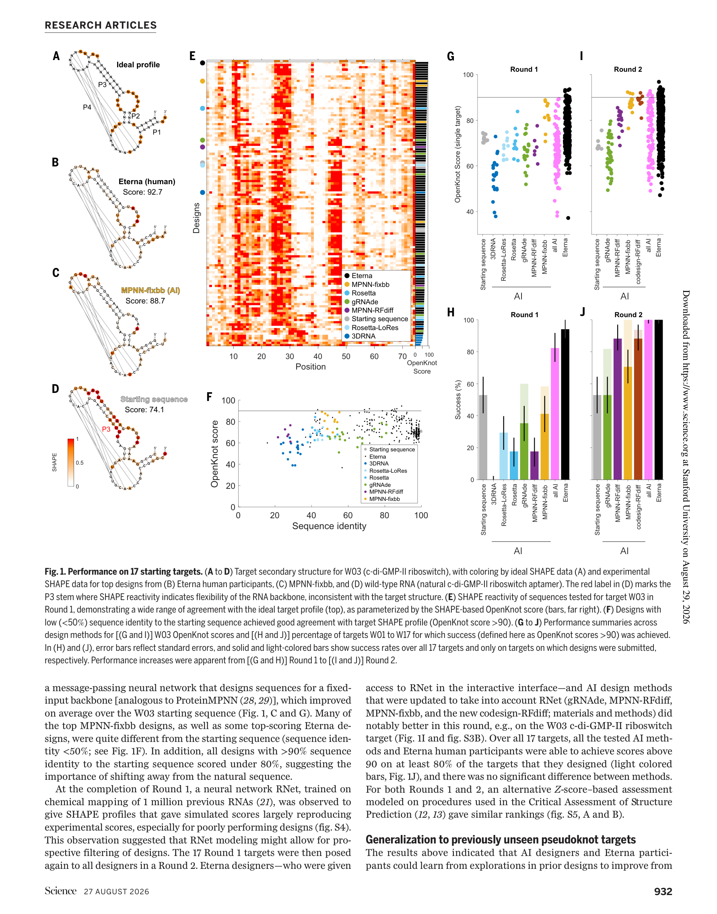
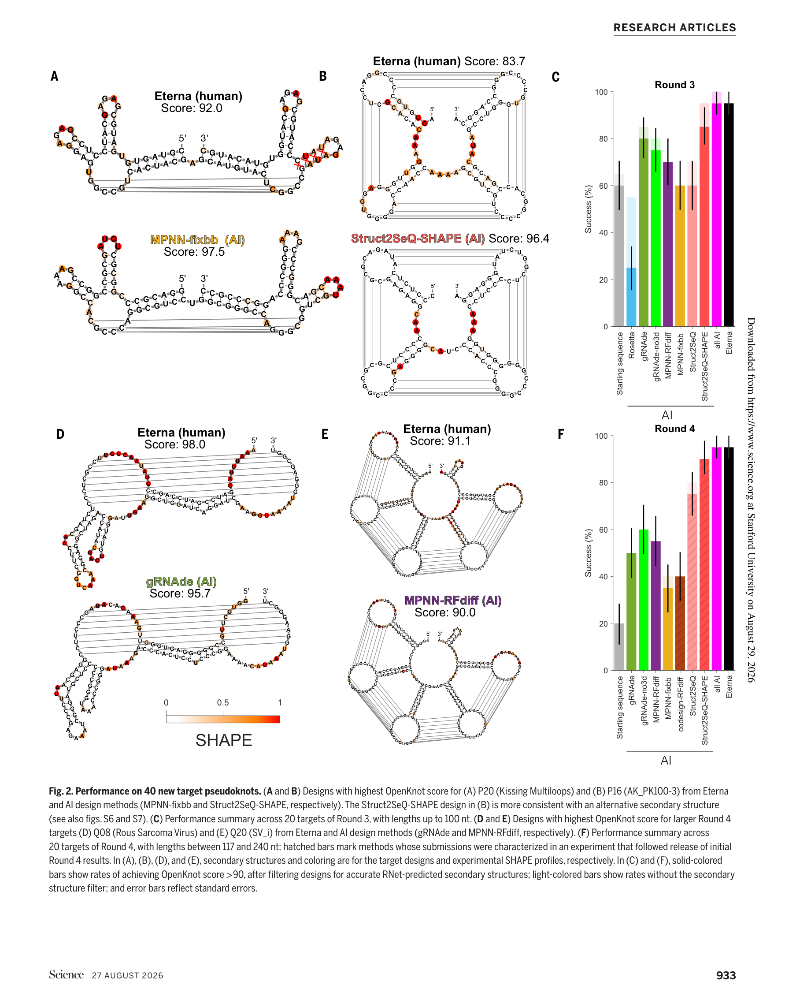
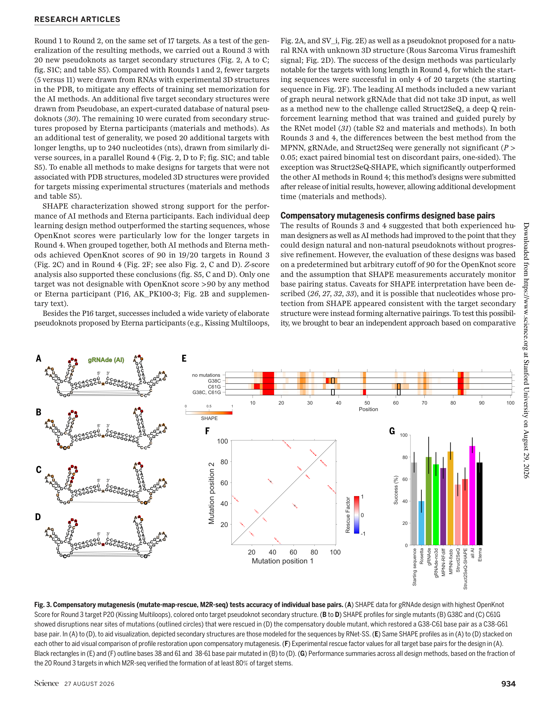
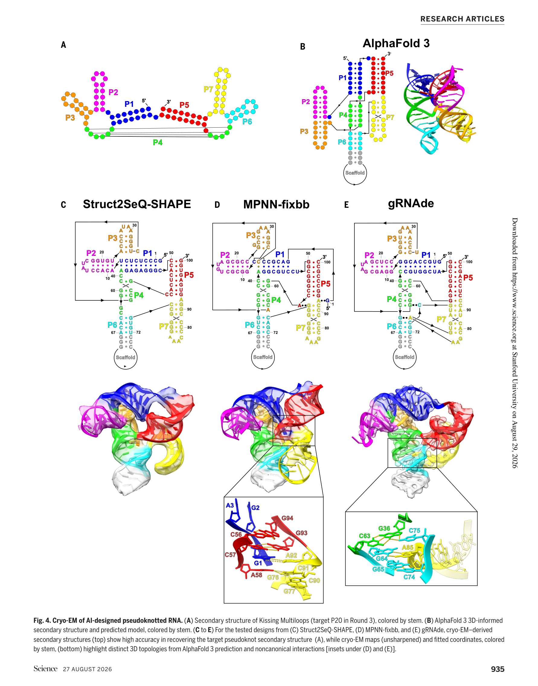

# De novo design of RNA pseudoknots with deep learning

### 原文链接：[全文](https://doi.org/10.1126/science.aeg6829)

作者：Jill Townley, Wipapat Kladwang, David Baker, ..., Rhiju Das

Science，2026 年 8 月 27 日

---
蛋白质设计已经进入"想设计什么结构就设计什么结构"的时代。RNA 呢？还停在重设计已知结构、拼装已有模块的阶段。尤其是假结（pseudoknot）——RNA 中最复杂、最重要的二级结构之一——从未被从头设计过。

这篇来自 Stanford Rhiju Das 实验室的 Science 论文，通过一场涉及 57 个假结、约 50,000 条序列的四轮盲测竞赛证明：**深度学习方法在从头设计 RNA 假结方面已追平经验丰富的人类设计者**。核心推动力是 RNet（RibonanzaNet）——一个用化学探测数据训练的基础模型。更令人兴奋的是，冷冻电镜显示 AI 设计的 RNA **自发形成了设计时未被编程的三级结构**。

## 一、研究问题

RNA 设计长期有个瓶颈：蛋白质这几年能做很多 de novo design，很大程度依赖高精度三维结构预测/生成。但 RNA 不一样——**三维结构预测还不够准**，尤其对人工合成、没有同源序列的 RNA 更难。所以大家过去更擅长设计简单二级结构，很难稳定设计复杂拓扑。

而 **pseudoknot（假结）**正是 RNA 里很典型、也很难的复杂结构——茎环的环区核苷酸与环外核苷酸形成碱基配对，产生"打结"的拓扑。天然假结在核酶、核糖开关、核糖体移码信号中广泛存在，功能极为关键，也是很多传统 RNA 二级结构算法的死角（标准动态规划无法处理）。

所以这篇论文问的是：

**核心问题**

**能不能不依赖高精度 RNA 3D 预测，仅靠深度学习和实验反馈，把从未见过的复杂 RNA pseudoknot 从头设计出来？如果能，AI 方法 vs 有经验的人类 RNA 设计者，谁更强？**

## 二、方法核心

这篇文章的方法不是"提出一个新模型"，而是**组织了一场大规模设计竞赛**，并通过三层递进式实验验证给出可靠结论。

**Eterna OpenKnot 竞赛：四轮盲测，57 个假结**

**Round 1**：17 个假结靶标（11 个来自 PDB、6 个合成设计），6 种 AI 方法 + Eterna 人类玩家同台竞技

**Round 2**：相同 17 个靶标，但所有方法整合 RNet 反馈后重新提交——测试"有了好的预筛工具后能提升多少"

**Round 3**：20 个全新靶标，减少 PDB 来源以避免记忆效应——测试泛化能力

**Round 4**：20 个更长靶标（最长 240 nt），来源更多样——测试对更大更复杂结构的处理能力

**RNet（RibonanzaNet）：全文转折点**

RNet 是一个 BERT 风格的深度网络（~1137 万参数），用 **约 100 万条 RNA 序列的化学探测数据**（SHAPE 反应性）训练。它不预测 3D 结构，而是预测每个核苷酸的化学反应性——单链核苷酸反应性高，碱基配对核苷酸反应性低。

它本质上是一个**学习了实验结构读出规律的 foundation model**，可以用来在实验前过滤掉不靠谱的设计。Round 1 结束后，作者发现 RNet 预测的 SHAPE 曲线与实验高度吻合，尤其擅长识别差的设计。

这件事的意义非常大：**RNA 设计突破的核心，可能不是先把 3D 预测做对，而是先有一个足够准的"实验驱动二级结构可形成性模型"作为过滤器。**

**三种领先的 AI 设计方法**

**MPNN-fixbb**：消息传递神经网络，类比蛋白质领域的 ProteinMPNN——输入固定 backbone/结构约束，输出序列。Round 1 表现最好的 AI 方法。

**gRNAde**：几何深度学习，用等变图神经网络做 3D RNA 反向设计。后来甚至有**不需要 3D 输入**的版本（gRNAde-no3d），说明并不一定非要高质量 3D 骨架才能设计。

**Struct2SeQ-SHAPE**：深度 Q 强化学习方法，训练和指导**几乎纯靠 RNet**。Round 4 中显著优于其他方法。

**三层递进验证——这篇文章说服力高的核心原因**

**第一层：SHAPE 化学探测**——单核苷酸分辨率评估。OpenKnot 评分 > 90 视为设计成功。总计测试 ~50,000 条序列。

**第二层：M2R-seq 补偿性突变**——对每个碱基对做单突变破坏 + 双突变"翻转"恢复，直接验证碱基配对是否真实存在，排除"SHAPE 假阳性/替代结构"的可能。

**第三层：冷冻电镜**——原子级 3D 结构验证。将设计嵌入环化排列的 II 型内含子支架中成像，分辨率达 2.9–5.2 Å。

这种从 **化学映射 → 补偿突变 → 结构成像** 的递进式验证，在 RNA 设计论文里是非常强的配置。

## 三、看图说话

### Figure 1 · 先看老目标：比较 AI 和人类，引出 RNet 转折点

**这张图想回答：**在已有的一批 pseudoknot 目标上，AI 和人类谁更强？引入 RNet 后性能会不会变好？

{: width="1782" height="2268" loading="lazy" decoding="async"}

*Figure 1. (A-D) c-di-GMP-II 核糖开关靶标 W03 的 SHAPE 数据对比。(E) 多方法 SHAPE 轮廓总览。(F) 序列同一性 vs OpenKnot 分数。(G-J) Round 1 → Round 2 各方法成功率变化。*

**怎么读这张图**

* **Panel A-D**：以 c-di-GMP-II 核糖开关（W03）为例。理想 SHAPE 曲线（A）、Eterna 人类设计（B，得分 92.7）、MPNN-fixbb AI 设计（C，得分 88.7）、天然序列（D，得分 74.1）。天然序列得分最低——因为天然 riboswitch 在体内依赖配体稳定，脱离配体后难以独立折叠。所以挑战不是"把天然序列复现出来"，而是**重新设计一个新序列，让它在没有配体帮助时也能稳定形成目标假结**。
* **Panel F**（关键）：序列同一性 vs OpenKnot 得分的散点图。很多高分设计与天然序列同一性 &lt; 50%，而所有与起始序列 >90% 相似的设计分数都 &lt; 80。说明 **de novo design 的关键是大胆进入新的序列空间，而不是做小修小补**。
* **Panel G-J**：Round 1（G, H）→ Round 2（I, J）的变化。Round 1 中人类设计者明显优于大多数 AI 方法（MPNN-fixbb 除外）。**整合 RNet 后（Round 2），所有 AI 方法性能大幅跃升，在 17 个目标上与人类设计者之间不再有统计学显著差异。**

**读图结论：**RNet 是全文的第一个转折点。Round 1 时 AI 整体落后于人类；有了 RNet 引导后，差距在一轮之内消失。这说明对 RNA 设计来说，**拥有一个好的前瞻性筛选器（能在实验前判断设计是否可行）比设计方法本身更关键**。

### Figure 2 · 泛化能力：40 个全新假结，AI 还行不行？

**这张图想回答：**这些方法能不能泛化到之前没见过的新目标？这是全文中"最决定性"的 benchmark 图。

{: width="1782" height="2268" loading="lazy" decoding="async"}

*Figure 2. (A-B) Round 3 中最高/最低分设计示例。(C) Round 3 各方法成功率。(D-E) Round 4 最高分设计。(F) Round 4 各方法成功率。*

**怎么读这张图**

* **Panel A**：Round 3 中 "Kissing Multiloops"（P20）——一个前所未有的复杂假结拓扑。Eterna 人类设计者与 MPNN-fixbb、Struct2SeQ-SHAPE 等 AI 方法得分接近，AI 在这个难题上并未明显超越人类（具体得分见图 2）。
* **Panel B**：P16（AK_PK100-3）——**所有方法都难搞的目标**。某些高分设计更符合一个替代二级结构，说明 SHAPE/OpenKnot score 虽强但不是绝对完美，也是后面引入 M2R-seq 的动机。
* **Panel C**：Round 3（20 个靶标）成功率汇总。深浅柱状图对比"有无 RNet 结构筛选"——经 RNet 筛选后成功率普遍提升。**AI 汇总和 Eterna 人类均达到 19/20 成功。**
* **Panel D-F**：Round 4 用更长序列（117–240 nt）测试。起始序列成功率仅约 20%，AI 方法 40–60%。**Struct2SeQ-SHAPE 在 Round 4 中显著领先**——纯粹由 RNet 引导的强化学习方法在长序列上尤其有效。AI 和人类汇总后仍达到 19/20。

**读图结论：**面对全新靶标，AI 没有掉链子。这 40 个目标来源多样（天然已知 + Pseudobase + Eterna 玩家提出的新结构 + 更长 RNA），所以这**不是记忆训练集，而是真正意义上的泛化**。唯一系统性失败的 P16 提示仍有设计边界存在。

### Figure 3 · 补偿突变验证：这些碱基对真的是目标里的那一对吗？

**这张图想回答：**高 OpenKnot score 会不会只是 SHAPE 假象？会不会某些"高分设计"其实折成了别的替代结构，只是 SHAPE 看起来差不多？

{: width="1782" height="2268" loading="lazy" decoding="async"}

*Figure 3. (A-D) gRNAde 设计的 P20 靶标：原始、单突变、双突变恢复的 SHAPE 对比。(E) 四条 SHAPE 轮廓叠加。(F) 全部目标碱基对的 rescue factor。(G) Round 3 全部 20 个目标的 M2R-seq 总结。*

**怎么读这张图**

* **Panel A-D**（M2R 逻辑演示）：拿碱基对 G38-C61 举例。G38C 单突变（B）破坏该碱基对、局部 SHAPE 变化；C61G 单突变（C）同理。G38C + C61G 双突变（D）把配对"翻转"成新组合——SHAPE 图谱恢复。这直接证明**这两个位点确实在原设计中彼此配对**，不是随便哪个替代结构都能解释的。
* **Panel F**：不再只举一个例子，而是系统评估整条 RNA 所有目标碱基对的 rescue factor（双突变恢复程度）。大多数目标 stem 都得到强支持。
* **Panel G**（核心总图）：Round 3 全部 20 个目标，对各方法最佳设计做了大规模 M2R-seq（涉及超过 10,000 条单/双突变序列）。成功标准：至少 80% 的目标 stems 被验证。**19/20 个目标至少有一个 AI 或 Eterna 设计达标。AI 方法整体成功率 90%，Eterna 人类 75%。**深度学习方法显著优于 Rosetta（P &lt; 0.05）。

**读图结论：**Fig. 1 和 Fig. 2 基于 SHAPE 的结论，在这里得到了更严谨的独立支持。高 OpenKnot score 通常确实对应目标 stems 的真实形成，而**不是大规模的"伪阳性替代结构"**。这是整个证据链的第二层。

### Figure 4 · 冷冻电镜：AI 设计的 RNA 形成了全新的三维折叠

**这张图想回答：**这些设计不只是"二级结构对"，会不会真的形成有序、稳定、真实存在的三维结构？

{: width="1782" height="2268" loading="lazy" decoding="async"}

*Figure 4. (A) Kissing Multiloops 靶标 P20 的二级结构。(B) AlphaFold 3 预测的 3D 结构。(C-E) 三个 AI 设计的冷冻电镜密度图与模型拟合，及发现的非经典三级相互作用。*

**怎么读这张图**

* **Panel A**：P20（Kissing Multiloops）的二级结构——7 个茎（P1-P7），Eterna 参与者提出的前所未有的复杂假结拓扑。
* **Panel B**（重要对照）：AlphaFold 3 预测的 3D 结构。但后面实验会显示，**实际 cryo-EM 结构并不匹配这个预测**——说明 RNA 设计成功并不是因为我们已经能准确预测 RNA 3D，真正带路的是二级结构设计 + RNet 筛选。
* **Panel C-E**：三个 AI 设计（Struct2SeQ-SHAPE、MPNN-fixbb、gRNAde）分别以 **5.2 Å、4.8 Å、3.6 Å**（sharpened 后 4.8、4.0、2.9 Å）的分辨率被解析。所有 7 个目标茎的碱基配对均被确认（F₁ = 0.89, 0.95, 0.95）。三个折叠体不与已知 RNA 结构同源——这是全新的 3D fold。
* **Panel D-E 放大插图**：最高分辨率的两个设计中，发现了**额外的非经典碱基对、碱基三联体和三级相互作用**——这些在设计过程中完全没有被显式建模。AI 没有要求这些，但只要整体二级骨架被稳定下来，RNA 就会"自己找"到这些三级 contacts 来稳定折叠。

**读图结论：**这是整篇文章最令人兴奋的发现。AI 设计的 RNA 自发形成了设计者没有要求的复杂三级结构。这暗示：**先把全局约束（二级结构）布好，局部高级几何可以自然涌现**。对未来设计大型 RNA 机器、aptamer、ribozyme 都很鼓舞。注意：第 4 个设计（MPNN-RFdiff）形成了二聚体而非预期单体，说明"二级结构对"是基础，但不是所有 3D 细节都自动完美。

## 四、核心贡献总结

### 四张图对应四层 claim

1\. **Fig. 1**：能设计出来（RNet 是性能跃迁的关键）

2\. **Fig. 2**：能泛化到新题（40 个全新目标，AI 和人类都做到 19/20）

3\. **Fig. 3**：碱基对确实成立（M2R-seq 独立验证，排除假阳性）

4\. **Fig. 4**：三维结构也真实成立（cryo-EM 看到全新 3D fold + 涌现的三级相互作用）

### 核心科学含义

**它提出了一条不同于蛋白设计的路线**

蛋白设计的成功路径是：高精度 3D 预测/生成 → 结构约束下反向设计。而这篇论文给 RNA 的路线是：**先把"会不会形成正确二级结构"做到足够准 → 用实验训练的大模型做筛选 → 让 RNA 自己形成稳定 3D**。RNA 设计未必要复制蛋白设计路线——这是最值得记住的思想。

**AI 方法最好组合使用**

作者没法在统计上严格证明哪一个 AI 框架"绝对最好"。序列空间分析显示，不同 AI 方法找到的是**互相比较分离的序列区域**，说明这些方法有互补性。实践上最好的策略可能是：多个模型并行出设计，再用 RNet 和实验筛。

### 创新与局限

**6 个核心创新**

1\. **首次系统证明复杂 pseudoknot 可 de novo 设计**——不是个别分子，而是大规模、跨 57 个目标

2\. **AI 在一年内追平资深人类设计者**——在真实实验评估下，不是纯计算 benchmark

3\. **RNet 作为"实验驱动 foundation model"成为关键**——它不是传统能量函数，也不是 3D 预测器，而是从大量 SHAPE 数据中学得结构可形成性

4\. **成功不依赖高精度 RNA 3D 预测**——这在 RNA 领域是路线级创新

5\. **设计出的 RNA 形成全新 3D fold**——不是简单模仿已知天然结构

6\. **非经典三级相互作用会在设计后自发涌现**——说明二级结构正确设计已足以支撑更高层级折叠涌现

**主要局限**

**主要解决的是"结构设计"，不是"功能设计"**：证明了能设计出正确假结和稳定 3D 折叠，但还没证明这些 RNA 能否实现复杂功能（高效催化、高亲和结合、精准调控）。先把 RNA"折起来"这一步解决了，离"按功能设计 RNA 机器"还差一段。

**对三级结构的可控性仍有限**：cryo-EM 看到的非经典相互作用更多是"出现了"，不是"被精确编程了"。当前水平能设计到稳定折叠，但还不能精细指定原子级相互作用网络。

**某些目标仍然失败**：P16 是各方法都搞不定的目标，可能是目标本身存在竞争折叠或几何矛盾，也可能暴露了当前模型的盲区。

**对 RNet 依赖很重**：很多成功都与 RNet 的过滤/指导强相关。如果目标超出 RNet 训练分布很多，或未来任务不再是"二级结构驱动"的，泛化性能是否还能保持？

### 值得后续关注的问题

1\. **能不能从"结构对"走向"功能对"？**设计有催化活性的 ribozyme、高特异性 aptamer、可编程 frameshift 元件、细胞内可工作的调控 RNA——这是下一步真正的大关。

2\. **RNet 学到的到底是什么？**只是学习了"局部配对可行性"，还是隐式学习了全局拓扑约束、折叠竞争、某些三级稳定化规律？如果能解释清楚，对模型升级很关键。

3\. **为什么 P16 不可设计？**这是非常宝贵的"反例"——可能揭示 pseudoknot 的可设计性边界，也可能暴露现有深度学习模型的盲区。

4\. **三级相互作用能否被显式设计？**现在是"自然涌现"，未来能否做到指定特定 base triple、pocket 几何、配体结合位点、催化中心构象？

5\. **体内是否还能成立？**体外条件下折得对，不等于在细胞里也能工作——离子环境变化、蛋白结合、转录共折叠、降解等因素都需要考虑。

**一句话总结：**即使 RNA 三维结构预测还不够准，也可以先靠深度学习把复杂的 pseudoknot 设计对。一旦二级结构被稳定设计出来，**RNA 往往会自己长出正确且有序的三维折叠，甚至出现设计时没有显式指定的非经典三级相互作用**。RNA de novo design 不一定要等到"RNA 版 AlphaFold"完全成熟才开始突破。

**论文：**De novo design of RNA pseudoknots with deep learning

**作者：**Jill Townley, Wipapat Kladwang, David Baker, ... Rhiju Das

**机构：**Stanford University / University of Washington / HHMI / University of Cambridge

**DOI：**10.1126/science.aeg6829

### 通讯作者

**Rhiju Das**，斯坦福大学医学院生物化学系教授、霍华德·休斯医学研究所（HHMI）研究员。本科毕业于哈佛大学物理系（1998 年，最高荣誉），此后作为 Marshall 学者赴英国剑桥大学攻读物理学硕士（射电天文学方向）和伦敦大学学院生物复杂性研究硕士，后在斯坦福大学获得物理学博士学位（2005 年，导师 Sebastian Doniach 和 Daniel Herschlag），并在华盛顿大学 David Baker 实验室完成博士后训练。2009 年加入斯坦福大学生物化学系，2016 年获终身教职，2021 年入选 HHMI 研究员。他的实验室致力于 RNA 分子和 RNA-蛋白质复合物的计算模拟与设计，开发高分辨率 RNA 结构预测算法。他还创建了 Eterna 平台——一个将 RNA 设计问题众包给超过 25 万名在线玩家的开放科学平台，并于 2021 年联合创办了 RNA 设计公司 Inceptive。主要荣誉包括国际物理奥林匹克金牌（1995 年）、Burroughs Wellcome 职业奖（2008 年）和 W.M. Keck 基金会医学研究资助（2012 年）等。研究方向涵盖 RNA 结构预测、RNA 设计、计算生物物理和众包科学。

## 引用

Townley, J., Kladwang, W., Baker, D., Blair, H. M., Choe, C. A., El Nesr, G., ... & Das, R. (2026). De novo design of RNA pseudoknots with deep learning. Science, 393(6814), 931-937. https://doi.org/10.1126/science.aeg6829
