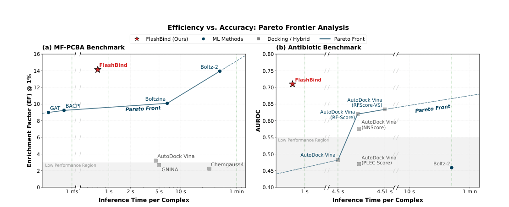
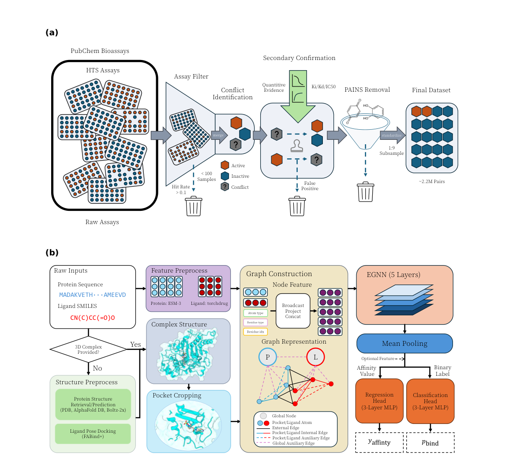
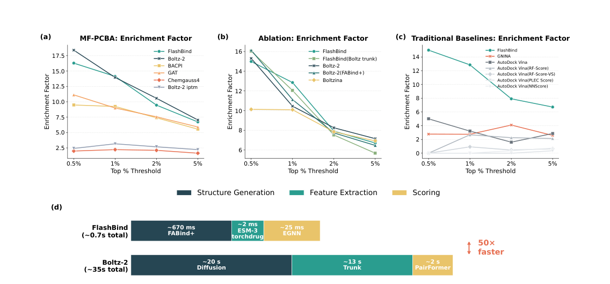
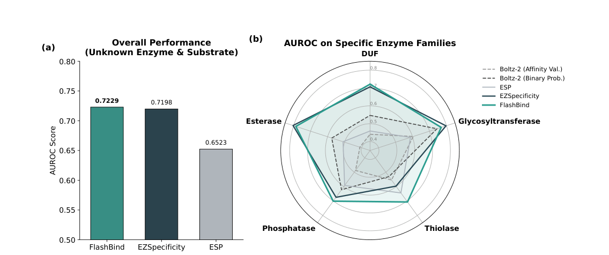
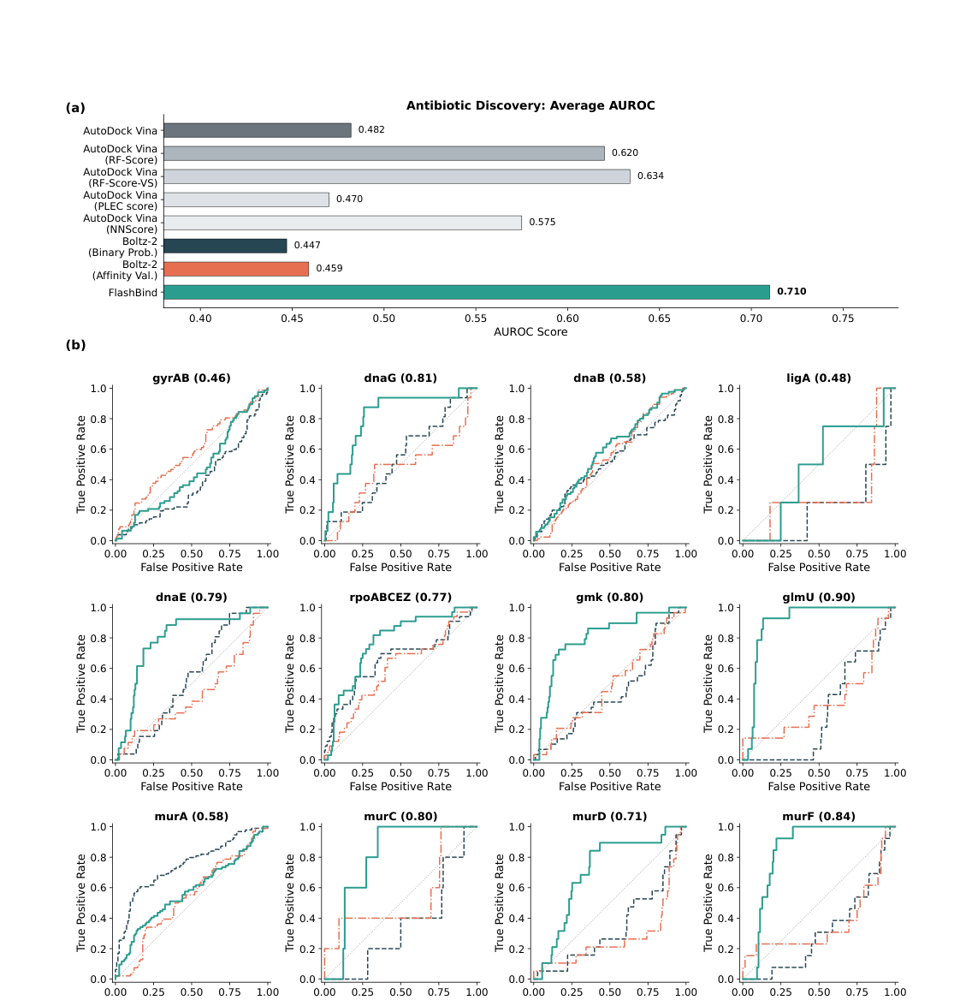
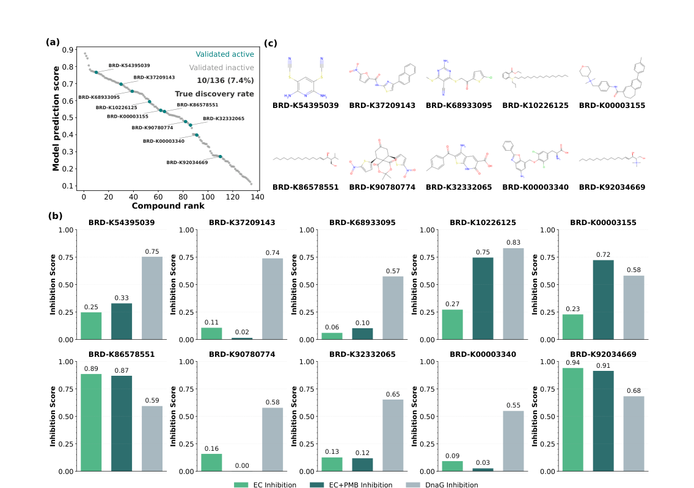

# FlashBind: Towards Accurate and Efficient Structure-based Virtual Screening

### 原文链接：[全文](https://doi.org/10.64898/2025.12.22.695983)

作者：Songlin Jiang, Yifan Chen, Aarti Krishnan, Yu Zhang, Wengong Jin

bioRxiv，2026 年 4 月 8 日

---
Boltz-2 等基础模型在蛋白-配体结合预测上精度很高，但处理一个复合物需要约 **35 秒**——面对百万甚至十亿级化合物库的工业级虚拟筛选，这个速度完全不可用。

Northeastern University 的 Wengong Jin 团队提出了 **FlashBind**：用快速对接模型 FABind+ 替代昂贵的扩散采样，用轻量 E(3) 等变图神经网络（EGNN）替代 PairFormer，**将推理速度提升 50 倍（0.7s/复合物）**，同时在标准虚拟筛选 benchmark 上达到与 Boltz-2 接近的早期富集能力。更重要的是，他们用这个模型做了一轮真实的抗生素前瞻性筛选，**湿实验验证了 10 个活性分子**。

## 一、研究问题

结构基础虚拟筛选（SBVS）的核心任务是：给定蛋白靶标和化合物库，预测哪些小分子能结合靶标，从而从海量候选中优先找出真正的 hits。这个领域存在一个**经典矛盾**：

**传统对接方法：快但不够准**

AutoDock Vina、GNINA、Glide 等方法有物理解释、结构驱动，但打分函数精度有限，跨靶标泛化能力不足。在化学空间超过 1060 个药样分子的现实面前，它们的筛选效率也仍然不够。

**基础模型：准但太慢**

Boltz-2 在结合亲和力预测上达到了新的精度标杆，但它依赖昂贵的扩散采样（~20s）、深层 PairFormer 表征（~13s）和最终打分（~2s），**处理一个复合物约需 35 秒**。筛选一个百万级化合物库需要数百个 GPU-天，十亿级库更是天文数字。

作者提出的核心问题：**能否在保留基础模型预测精度的同时，将推理速度提升到工业级大规模筛选可用的水平？**

## 二、方法核心

FlashBind 的核心策略很直接：**把 Boltz-2 中每个昂贵的模块都替换成更轻量的对应物**，同时保持预测质量。具体来说，它将虚拟筛选流程解耦为两个阶段：

**Stage 1：快速结构生成（~670ms）**

用 **FABind+**（基于回归的快速对接模型）替代 Boltz-2 中耗时 20 秒的扩散采样。FABind+ 直接预测配体在口袋中的 3D 坐标，生成一个**「足够合理」的结构先验**。

蛋白结构来源按优先级排列：PDB 实验结构 → AlphaFold DB 预测结构 → Boltz-2x 从头预测。作者发现 60% 以上的靶标可以直接从前两个来源获取结构。

**Stage 2：轻量几何打分（~25ms）**

用 **5 层 EGNN（E(3) 等变图神经网络）**替代 Boltz-2 中耗时 15 秒的 trunk + PairFormer 模块。EGNN 直接处理 3D 几何结构，天然满足旋转和平移不变性，专注捕捉结合口袋内的局部物理相互作用。

对接结构先经过**口袋裁剪**（配体周围 20 Å、最多 2048 个原子 / 512 个残基），再构建多关系几何图：内部边（共价键、顺序连接）、外部边（蛋白-配体接触 &lt;10 Å）、辅助边（全局虚拟节点），最后通过 mean pooling + MLP 输出结合概率。

**数据清洗：比盲目堆量更重要**

作者从 PubChem BioAssays 的高通量筛选数据出发，设计了严格的多阶段过滤流程：assay 一致性检查（>100 compounds, hit rate &lt;10%）→ 按 UniProt ID 合并去冗余 → **二次确认机制**（仅保留有 Ki/Kd/IC50 定量证据支持的 active 标签）→ PAINS 化合物移除 → 1:9 正负样本平衡。

最终训练集包含 **约 220 万**个蛋白-配体对，覆盖 451 个蛋白靶标和 368,812 个配体。

总结来说，FlashBind 的公式是：**快速 docking 提供结构先验 → 轻量 EGNN 做几何打分 → 严格数据清洗保证训练质量**。

## 三、看图说话

### Figure 1 · 效率-精度 Pareto 前沿

**这张图想回答：**FlashBind 在效率和精度之间处于什么位置？

{: width="1110" height="452" loading="lazy" decoding="async"}

*Figure 1. (a) MF-PCBA 虚拟筛选 benchmark 上的效率-精度散点图。(b) 抗生素筛选 benchmark 上的效率-精度散点图。星形标记为 FlashBind。*

**怎么读这张图**

* **Panel a**（MF-PCBA）：横轴是推理时间（对数尺度），纵轴是 EF@1%（前 1% 的富集因子）。FlashBind（星号）位于 **Pareto 前沿的最优区域**——以 0.7 秒的速度达到 EF@1% = 14.13，几乎追平 Boltz-2 的 13.95，但快了 50 倍。传统方法（Vina、GNINA、Chemgauss4）聚集在右下角低性能区域。
* **Panel b**（抗生素 benchmark）：FlashBind 不仅速度快，AUROC 也远超所有基线。值得注意的是 Boltz-2 在这个任务上掉到了 0.45 左右（接近随机），FlashBind 达到了 **0.710**。

**读图结论：**FlashBind 是目前唯一一个**同时超越 Pareto 前沿**的方法——在两个 benchmark 上都实现了比所有基线更快、更准的组合。

### Figure 2 · FlashBind 框架总览

**这张图想回答：**FlashBind 的数据管线和模型架构是什么样的？

{: width="1154" height="1036" loading="lazy" decoding="async"}

*Figure 2. (a) 训练数据清洗管线：从 PubChem HTS 数据出发，经过 assay 筛选、二次确认、PAINS 移除，最终得到约 220 万对高质量蛋白-配体训练数据。(b) 模型架构：输入经结构预处理 → 口袋裁剪 → 多关系图构建 → 5 层 EGNN → 任务特定预测头。*

**怎么读这张图**

* **Panel a**（数据清洗）：从左到右展示了完整的数据过滤流程。注意中间的「Secondary Confirmation」步骤——它要求 active 标签必须有定量证据（Ki/Kd/IC50）支持，**冲突但无量化支持的数据直接丢弃**。最终正负样本比为 1:9，约 220 万对。
* **Panel b**（模型架构）：左侧是输入处理——如果没有现成复合物结构，用 FABind+ 生成对接构象。中间是图构建——蛋白特征来自 ESM-3 语言模型，配体特征来自 torchdrug/RDKit，再加上多种类型的边（内部/外部/辅助）。右侧是核心编码器——5 层 EGNN，hidden dim 192，经 mean pooling 后分别送入分类头（二分类）或回归头（亲和力预测）。

**读图结论：**FlashBind 的设计哲学是**「数据质量 + 结构解耦 + 轻量编码」**。它不追求端到端建模的极致精度，而是通过严格的数据清洗确保训练信号可靠，通过快速对接 + 轻量打分的解耦设计确保推理效率，通过 E(3) 等变性确保物理合理性。

### Figure 3 · 虚拟筛选性能与推理时间拆解

**这张图想回答：**FlashBind 的筛选精度有多好？每个设计决策贡献了多少？速度提升从哪里来？

{: width="1136" height="530" loading="lazy" decoding="async"}

*Figure 3. (a) MF-PCBA 全集上的 EF 曲线。(b) 消融实验。(c) 与传统对接方法比较。(d) 推理时间逐模块拆解。*

**怎么读这张图**

* **Panel a**（主结果）：FlashBind 在 EF@0.5%~5% 全范围内与 Boltz-2 高度接近，显著优于 BACPI、GAT、Chemgauss4 和 Boltz-2 iptm。在最关键的 **EF@1% = 14.13**，略超 Boltz-2 的 13.95。
* **Panel b**（消融实验）：三个关键发现——(1) 把 Boltz-2 的扩散采样换成 FABind+ 结构，性能几乎不降（EF@1%: 11.12 vs 10.45），说明**高精度构象采样对 hit identification 并非必要**；(2) 用 EGNN 替代 PairFormer 性能不降反升（12.05 vs 11.12）；(3) 用通用 ESM-3 特征替代 Boltz-2 trunk 表征，性能进一步提升（12.85 vs 12.05），**彻底摆脱对基础模型的依赖**。
* **Panel d**（时间拆解）：Boltz-2 的 35 秒被三块占据——扩散 20s、trunk 13s、PairFormer 2s。FlashBind 用 FABind+（670ms）替代扩散，ESM-3/torchdrug（~2ms）替代 trunk，EGNN（25ms）替代 PairFormer，**总耗时约 0.7 秒，50 倍加速**。如果 pose 已有，纯打分仅需 25ms，每 GPU 小时可评估 14 万+ 复合物。

**读图结论：**消融实验是这篇文章最有说服力的部分。它系统证明了作者的核心论点——**对于虚拟筛选的早期 hit identification，昂贵的扩散结构生成和重型注意力模块都不是必要的**。一个设计合理的轻量 EGNN 配合快速对接先验就足够了。

### Figure 4 · 酶-底物特异性预测

**这张图想回答：**FlashBind 学到的几何表示能否泛化到虚拟筛选以外的任务？

{: width="1136" height="476" loading="lazy" decoding="async"}

*Figure 4. (a) ESIBank「未知酶+未知底物」设定下的总体 AUROC。(b) 不同酶家族上的表现（雷达图）。*

**怎么读这张图**

* **Panel a**：在最难的「unknown enzyme & substrate」设定下（4-fold CV），FlashBind 达到 **AUROC = 0.7229**，基本追平了专门为该任务设计的 SOTA 模型 EZSpecificity（0.7198），显著超过序列基线 ESP（0.6523）。
* **Panel b**（雷达图）：在 DUF（未知功能域）、Glycosyltransferase、Thiolase、Phosphatase、Esterase 五个酶家族上，FlashBind 全面超过 Boltz-2，与 EZSpecificity 持平。尤其在 **数据稀缺的 DUF 家族**上表现突出，说明几何特征对从未见过的酶有更好的迁移性。

**读图结论：**一个通用的几何编码器，在酶-底物特异性这个精细功能预测任务上，追平了专门设计的架构——这说明 FlashBind 学到的几何表示**具有跨任务迁移性**。需要注意的是，作者在这个任务上额外融合了 UniMol embeddings 和 Morgan fingerprints，并非完全原生框架。

### Figure 5 · 抗生素发现 benchmark

**这张图想回答：**FlashBind 在真实的抗生素靶标筛选任务上表现如何？

{: width="1136" height="1168" loading="lazy" decoding="async"}

*Figure 5. (a) 12 个大肠杆菌必需靶标上的平均 AUROC。(b) 每个靶标的 ROC 曲线，括号内为 FlashBind 的 AUROC。*

**怎么读这张图**

* **Panel a**（总体 AUROC）：**FlashBind 以 0.710 大幅领先所有方法**。最亮眼的对比是——Boltz-2 在这个 benchmark 上仅有 0.45~0.46（接近随机猜测），AutoDock Vina 也只有 0.48。传统 rescoring 方法（Vina + RF-Score/RF-Score-VS）达到 0.62~0.63，但仍远低于 FlashBind。
* **Panel b**（逐靶标 ROC）：FlashBind 在 12 个靶标中有 11 个的 ROC 曲线显著高于 Boltz-2 和随机基线。表现最好的靶标包括 **glmU（0.90）**、murF（0.84）、dnaG（0.81）、gmk（0.80）。gyrAB 是唯一一个表现较弱的靶标（0.46），可能与该靶标的结合机制特殊有关。

**读图结论：**这组结果揭示了基础模型的一个盲区——**Boltz-2 可能存在 negative transfer**：它的训练分布偏向常见靶标和稳定复合物，迁移到细菌靶标时反而不如从局部几何约束出发的轻量模型。FlashBind 依赖普适的物理几何特征，在分布外靶标上反而更稳健。

### Figure 6 · 前瞻性湿实验验证

**这张图想回答：**FlashBind 的预测在真实实验中能不能找到活性分子？

{: width="1136" height="800" loading="lazy" decoding="async"}

*Figure 6. (a) 136 个候选化合物的 FlashBind 预测分数排序与实验验证结果。(b) 10 个 confirmed hits 的抑制活性详情。(c) 10 个 hits 的化学结构。*

**怎么读这张图**

* **Panel a**（筛选排名图）：作者对 Broad Institute 化合物库中 9,289 个分子做 FlashBind 打分，去除 PAINS 和冗余骨架后选出 136 个多样性候选（Tanimoto similarity &lt;0.5）。100 μM 测两次独立重复，>50% DnaG 抑制视为 active。绿色点标记了 **10 个 confirmed hits**，命中率 7.4%——这些 hits 明显集中在高排名区域，说明 FlashBind 提供了有效的富集。
* **Panel b**（活性详情）：10 个 hits 分别展示了 EC inhibition（单独处理）、EC+PMB inhibition（加膜通透剂）和 DnaG inhibition 三个指标。其中 **4 个化合物在 whole-cell assay 中也展示了较强的抑菌活性**（EC+PMB inhibition ≥ 50%），说明它们能穿透细胞膜并抑制大肠杆菌生长。
* **Panel c**（化学结构）：10 个 hits 跨越不同化学骨架——有杂环类、芳香胺类、酰胺类等多种结构，说明 FlashBind 捕捉的是真正的结合信号，**没有过拟合到某一类特定骨架**。

**读图结论：**这是全文最有分量的证据。很多虚拟筛选论文只到 benchmark 打分就停了，FlashBind 做到了**完整的前瞻性实验闭环**——从计算筛选到靶标抑制到 whole-cell 抑菌。7.4% 的命中率在前瞻性筛选中属于不错的水平，4 个有全细胞活性的分子更说明模型确实学到了有药物发现价值的信号。

## 四、核心贡献总结

### 跨任务 Benchmark 汇总

| 任务 | 指标 | FlashBind | Boltz-2 | 速度 |
|---|---|---|---|---|
| 虚拟筛选（MF-PCBA） | EF@1% | **14.13** | 13.95 | **50x 加速** |
| 虚拟筛选（MF-PCBA） | AUROC | 0.7826 | 0.8056 | - |
| 酶-底物特异性（ESIBank） | AUROC | **0.7229** | ~0.69\* | - |
| 抗生素筛选（E. coli） | 平均 AUROC | **0.710** | 0.45 | - |
| 亲和力预测（CASP16） | Kendall τ | **0.51** | 0.45 | - |
| 前瞻性验证（DnaG） | 命中率 | **10/136 (7.4%)** | - | - |

*\* Boltz-2 在 ESIBank 上的具体数值从雷达图目测估计。*

### 最值得关注的发现

**1\. 高精度构象采样对 hit identification 并非必要**

消融实验表明，用 FABind+ 快速对接替代 Boltz-2 的扩散采样，虚拟筛选性能几乎不降。Boltzina（用 Vina 替代扩散）也得出类似结论。**这挑战了「必须有精确复合物结构才能做好虚拟筛选」的主流假设**——足够合理的对接先验就够了。

**2\. 轻量等变网络可替代重型注意力模块**

5 层 EGNN 在同等输入条件下不逊于 PairFormer，同时推理时间从秒级降到毫秒级。这说明**对于结合口袋内的局部物理相互作用，等变几何约束比全局注意力更高效**。

**3\. 基础模型在分布外靶标上可能存在 negative transfer**

在抗生素 benchmark 上，Boltz-2 几乎等于随机猜测（AUROC 0.45），FlashBind 达到 0.710。可能的解释是基础模型的训练分布偏向常见真核生物靶标，**面对细菌靶标时学到的统计规律反而成了干扰**。FlashBind 依赖的局部几何约束更具普适性。

**4\. 数据清洗是模型成功的核心前提**

作者反复强调：HTS 数据中假阳性泛滥，PAINS 化合物和 assay artifact 会严重误导模型。**二次确认机制（要求定量证据支持 active 标签）**是 FlashBind 数据策略中最关键的步骤——它实质上是在让数据质量而非数据规模来驱动模型学习。

### 创新与局限

**创新点**

1\. 提出**「快速对接 + 轻量几何打分」**的两阶段解耦范式，是 workflow-level 的创新

2\. 系统证明**高精度构象采样并非虚拟筛选的必要条件**，有方法论意义

3\. 在效率-精度 Pareto 前沿占据最优位置，**50 倍加速无明显精度代价**

4\. 跨三个任务验证泛化能力：虚拟筛选、酶特异性、抗生素发现

5\. 有完整的前瞻性湿实验闭环——**从 benchmark 到靶标抑制到 whole-cell 抑菌**

**局限**

**局限 1：**系统的性能上限受**上游对接质量的约束**。FABind+ 给出错误 pose 时（如 induced fit、cryptic pocket、金属离子参与的结合），后端 EGNN 无法弥补。

**局限 2：**MF-PCBA 全局 AUROC（0.7826）仍**略低于 Boltz-2（0.8056）**。FlashBind 更像是优秀的 early ranker，适合前端粗筛，对需要全域精确打分的场景仍有差距。

**局限 3：**抗生素 benchmark 规模有限（218 active / 100 inactive / 12 靶标），**作为 proof-of-concept 足够，作为通用结论仍需更大规模验证**。

**局限 4：**与 Boltz-2 的性能对比可能受**训练数据差异**的影响——Boltz-2 使用了更大规模的私有数据集，「架构胜负」和「数据胜负」未完全分离。

### 值得后续关注的问题

1\. **对 pose 质量到底多敏感？**如果 FABind+ 的对接精度变差（如面对柔性靶标、诱导契合），FlashBind 性能会掉多少？

2\. **能否整合轻量柔性对接？**在保持高速的前提下加入 backbone flexibility，可能进一步扩大适用范围。

3\. **十亿级化合物库的真实吞吐量？**论文展示了单复合物速度，但大规模分布式部署的 wall-clock 性能仍需实测。

4\. **能否拓展到多肽筛选？**FlashBind 的「解耦 + 轻量几何打分」思路理论上可以迁移到短多肽场景，但需要适配 pose generation 和图表示。

**一句话总结：**FlashBind 的核心洞察是——做虚拟筛选的早期 hit identification，**「足够好的对接先验 + 轻量几何打分」就足够了**，昂贵的端到端基础模型并非必要。这个看似简单的思路在 MF-PCBA 上追平 Boltz-2、在抗生素任务上大幅超越、在 DnaG 上通过湿实验验证——它为学术实验室和中小型药企「以有限算力做高质量虚拟筛选」提供了一条切实可行的路线。

**论文：**FlashBind: Towards Accurate and Efficient Structure-based Virtual Screening

**作者：**Songlin Jiang, Yifan Chen, Aarti Krishnan, Yu Zhang, Wengong Jin

**机构：**Northeastern University, Broad Institute of MIT and Harvard, MIT, Wyss Institute, Whitehead Institute

**DOI：**10.64898/2025.12.22.695983

### 通讯作者

**Wengong Jin（金文弓）**，Northeastern University Khoury 计算机科学学院助理教授，同时担任 Broad Institute of MIT and Harvard 的 Eric and Wendy Schmidt Center 访问研究员。他在上海交通大学获得工学学士学位（2016），随后在 MIT CSAIL 获得计算机科学硕士（2018）和博士学位，师从 Regina Barzilay 教授和 Tommi Jaakkola 教授，博士论文聚焦小分子和蛋白质的深度生成模型，获得 MIT EECS Outstanding Thesis Award。博士毕业后在 Broad Institute 做博士后研究，期间开创性地发展了分子和蛋白质设计的几何与生成式 AI 方法，获 BroadIgnite Award 和 Dimitris N. Chorafas Prize。他的研究横跨 AI 与生命科学，涵盖 AI 驱动的药物发现、蛋白质折叠与设计、科学发现 AI Agent 和分子生成模型等方向，成果发表于 Nature、Science、Cell、ICML、NeurIPS、ICLR 等顶级期刊和会议。

## 引用

Jiang, S., Chen, Y., Krishnan, A., Zhang, Y., & Jin, W. (2026). FlashBind: Towards Accurate and Efficient Structure-based Virtual Screening. bioRxiv. https://doi.org/10.64898/2025.12.22.695983
