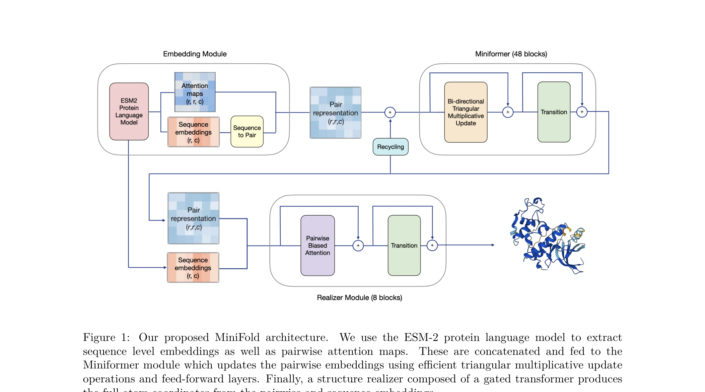
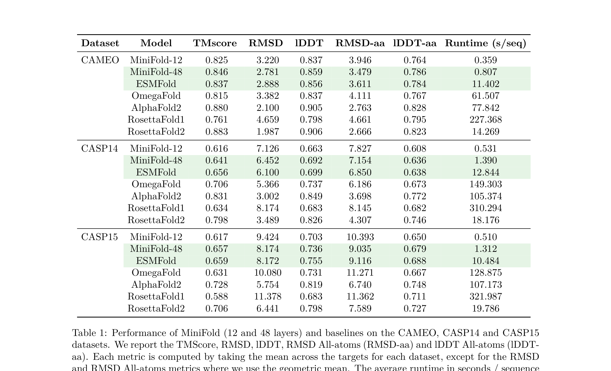
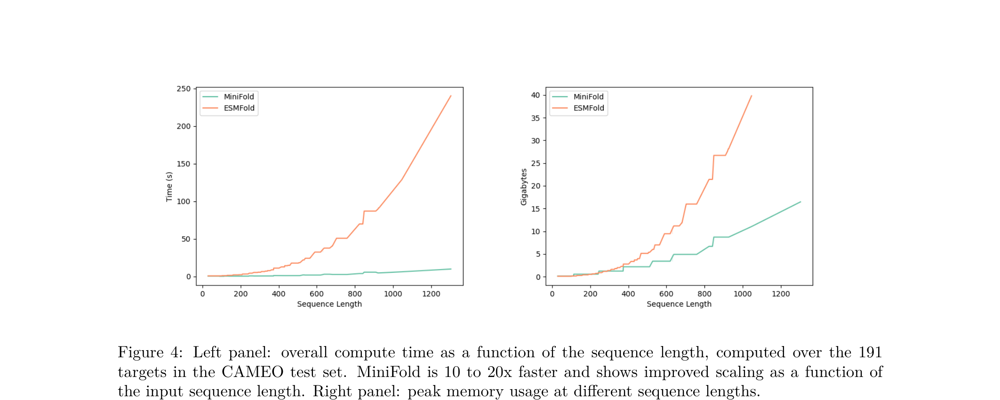
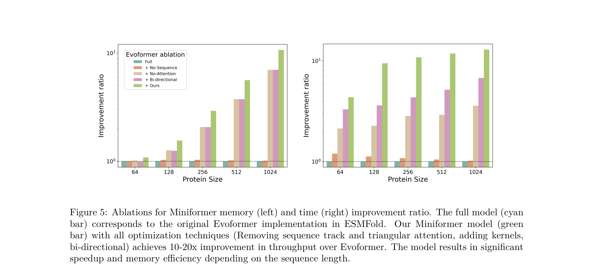

# MiniFold: Simple, Fast, and Accurate Protein Structure Prediction

### 原文链接：[全文](https://openreview.net/forum?id=1p9hQTbjgo)

作者：Jeremy Wohlwend, Mateo Reveiz, Matt McPartlon, Axel Feldmann, Wengong Jin, Regina Barzilay

Transactions on Machine Learning Research，2025 年 2 月 2 日

---
AlphaFold2 以来，蛋白结构预测已经非常好用。但"好用"和"用得起"之间还有巨大鸿沟：扫描 1000 万条抗体序列，哪怕每条只要几秒钟，也要消耗接近 **1 个 GPU 年**。

MIT 的 Regina Barzilay 团队在 TMLR 上发表了 **MiniFold**——一个大幅精简的蛋白结构预测架构。核心发现：ESMFold 继承自 AlphaFold2 的 Evoformer 和 IPA 结构模块占据了 95% 以上的推理时间，但其中**大量组件并非必须**。砍掉它们之后，同样的 ESM-2 语言模型下，MiniFold 在 CAMEO/CASP 上精度基本持平，**速度提升 10-20 倍，显存大幅下降**。

## 一、研究问题

蛋白结构预测的应用场景正在快速扩大：大规模虚拟筛选、抗体库扫描、突变效应评估、de novo 设计候选过滤、下游微调训练。这些场景都要求**高通量**，而当前模型（AlphaFold2、ESMFold）的计算成本严重限制了规模化部署。

ESMFold 等 PLM-based 模型用蛋白语言模型（ESM-2）替掉了 AlphaFold2 昂贵的 MSA 搜索步骤，推理速度从分钟级缩短到秒级。但作者指出，**真正的瓶颈并不在语言模型本身**：

**ESMFold 推理时间的分布**

ESM-2 蛋白语言模型：**&lt; 5%**

Evoformer（含 triangular operations）：**~80%**

Structure module（IPA）：**~15%**

也就是说，ESMFold 已经把 MSA 搜索省掉了，但后面从 AlphaFold2 继承的重型 folding trunk 几乎原封不动。作者的核心问题是：

**当输入从 MSA 换成了蛋白语言模型的 embedding，后端的 folding architecture 是否也该重新设计？**

## 二、方法核心

MiniFold 保持三段式架构（embedding → folding trunk → structure module），但对后两段做了大幅简化。

**Miniformer：从 Evoformer 精简而来**

**删除 sequence track**：ESMFold 的 Evoformer 含 sequence track 和 pairwise track 两条通路，其中 sequence track 占了 **600M+ 参数**。MiniFold 直接删掉它，只保留 pairwise track。删除后 Evoformer 部分仅剩不到 25M 参数，精度几乎不受影响——说明 Evoformer 的推理能力主要由 pairwise 操作本身决定，与参数规模关系不大。

**删除 triangular attention**：AlphaFold 系架构里有 triangular attention 和 triangular multiplicative update 两种操作。作者发现，**triangular attention 内存消耗大，但贡献有限**；真正关键的是 triangular multiplicative update。因此完全去掉 triangular attention。

**重设计 triangular multiplicative update**：将原来分开的 incoming/outgoing 两个模块融合成一个 **bi-directional triangular update**。具体做法：将 pair embedding 通道分成 4 块，分别沿两个方向做矩阵乘法，再拼接输出。这种设计更简洁，同时更适合 GPU kernel 融合。

最终，**一个 Miniformer block 只有两个子层**：bi-directional triangular update + 两层 FFN。

**Structure Realizer：重新定义结构模块的角色**

作者提出了一个很有启发性的假设：**主要的结构信息已经由 pairwise distogram 模块编码完成，后面的 structure module 更像是一个"坐标实现器（realizer）"**。

为验证这一假设，作者做了一个很巧妙的对照实验：用完全**不含可学习参数的 MDS（多维缩放）**方法，直接从 distogram 恢复 Cα 坐标。结果这种非参数方法在恢复 Cα trace 上竟然和轻量 transformer realizer 差不多。

基于此，MiniFold 用一个 **8 层带 pair bias 的 gated transformer** 替代了 AlphaFold2 的重型 IPA 模块。它不再像 IPA 那样每层迭代更新坐标，而是最终一次性预测 N、Cα、C 原子坐标，再通过 Gram-Schmidt 构造局部坐标框架。

**GPU Kernel 优化：减少内存搬运**

MiniFold 的速度提升不只靠架构简化，还靠两个**用 Triton 编写的定制 GPU kernel**：

1\. **Self-gating kernel**：将 triangular update 中的线性投影、sigmoid、逐元素乘法融合成一个 kernel，减少 HBM 读写。

2\. **Feed-forward kernel**：FFN 中间层维度是输入的 4 倍，若显式 materialize 会非常占显存。新 kernel 分块扫描权重矩阵，避免将大中间激活写回 HBM。

思路和 FlashAttention 一致：**减少的不是 FLOPs，而是昂贵的显存搬运**。两个 kernel 在大序列上额外提供 2-3 倍加速。

## 三、看图说话

### Figure 1 · MiniFold 架构总览

**这张图想回答：**MiniFold 的整体架构长什么样？

{: width="2125" height="1182" loading="lazy" decoding="async"}

*Figure 1. MiniFold 架构：ESM-2 提取 sequence embedding 和 pairwise attention maps → Miniformer（48 个 block）更新 pairwise representation → Structure Realizer（8 层 gated transformer）预测全原子坐标。*

**怎么读这张图**

**上半部分**：Embedding Module 用 ESM-2（30 亿参数）提取 sequence embedding 和 pairwise attention maps，拼接成初始 pair representation。

**右上**：Miniformer Module 由 48 个极简 block 组成，每个 block 只有 bi-directional triangular multiplicative update + transition（FFN）。注意 recycling 只作用在 pairwise block 上。

**下半部分**：Realizer Module 用 8 层带 pair bias 的 gated transformer，一次性输出 backbone frames 和 torsion angles。

**读图结论：**和 ESMFold 对比，MiniFold 砍掉了 Evoformer 中的 sequence track 和 triangular attention，用轻量 transformer 替代 IPA。整体流程保持三段式，但每一段都做了系统性精简。

### Table 1: 精度对比

**这张表想回答：**简化这么多，精度到底掉了多少？

**这张图想回答：**MiniFold 在不同标准基准上的预测精度与完整 AlphaFold2 相比差多少？

{: width="2125" height="1292" loading="lazy" decoding="async"}

*Table 1. MiniFold（12/48 层）与 ESMFold、OmegaFold、AlphaFold2、RosettaFold 在 CAMEO、CASP14、CASP15 上的对比。*

**关键数字**

**CAMEO**：MiniFold-48 TM-score **0.846**，ESMFold 0.837。MiniFold 反而**略优于 ESMFold**，同时 runtime 从 11.4 s/seq 降到 0.8 s/seq——快 **14 倍**。

**CASP14**：MiniFold-48 TM-score 0.641，ESMFold 0.656。略弱，差距不大，速度快约 9 倍。

**CASP15**：MiniFold-48 TM-score 0.657，ESMFold 0.659。基本持平，速度快约 8 倍。

**12 层版本**：MiniFold-12 在 CAMEO 上 runtime 仅 **0.36 s/seq**，是 ESMFold 的 1/32，精度仍在可接受范围。

**读表结论：**MiniFold 和 ESMFold 在同一个 PLM（ESM-2）下比较非常公平。结论明确：**PLM-based 结构预测模型的 folding trunk 可以大幅简化**。但和 AlphaFold2 等 MSA-based 模型相比仍有差距，这个差距主要来自 PLM vs MSA 的输入差异。

### Figure 4 · 速度与显存对比

**这张图想回答：**加速效果随序列长度怎么变化？

{: width="2125" height="852" loading="lazy" decoding="async"}

*Figure 4. 左：推理时间随序列长度的变化（CAMEO 191 个目标）。右：峰值显存随序列长度的变化。*

**怎么读这张图**

**左图（推理时间）**：绿色 MiniFold，红色 ESMFold。两条曲线的差距随序列变长而**急剧拉大**——长度 400 蛋白上约快 10 倍，长度 1000 蛋白上约快 20 倍。

**右图（峰值显存）**：MiniFold 的显存增长更平缓。在长序列上，显存可降低**近 10 倍**。这对实际部署意义重大——意味着同一张 GPU 可以处理更长的蛋白。

**读图结论：**MiniFold 的优势在长序列上更明显，因为删掉的 triangular attention 的复杂度随长度增长更快。这说明架构简化和 kernel 优化带来的不只是常数倍加速，还改善了 scaling behavior。

### Figure 5 · 消融实验

**这张图想回答：**每一步简化分别带来多少收益？

{: width="2125" height="990" loading="lazy" decoding="async"}

*Figure 5. 从 ESMFold Evoformer 到 Miniformer 的逐步消融。左：显存改善比。右：速度改善比。青色 = 原始 Evoformer，绿色 = 最终 Miniformer。*

**每一步的贡献**

**去掉 sequence track**：参数量大降（600M → 25M），但推理速度提升不明显。说明 sequence track 的参数更多是"冗余"。

**去掉 triangular attention**：速度和显存都显著提升，这是最大的单步改进。

**Bi-directional 融合 + down-projection**：进一步提速。

**定制 GPU kernels**：额外 2-3 倍加速。在蛋白长度 1024 时，整体速度改善达 **10-20 倍**。

**读图结论：**效率提升是**架构简化 + kernel 融合的叠加结果**，每一步都有明确贡献。这说明加速来源是系统性的，有可复现的工程路径。

## 四、核心贡献总结

### MDS 对照实验：distogram 已包含主要结构信息

作者用 MDS（多维缩放）做了一组非参数的 structure realization 对照。MDS 完全没有可学习参数，只从 distogram 预测的距离矩阵出发，通过最短路补全、特征分解和 LBFGS 精修来恢复 Cα 坐标。

| Dataset | MiniFold-48 (Transformer) | MiniFold-48 (MDS) |
|---|---|---|
| CAMEO Cα lDDT | 0.90 | 0.90 |
| CASP14 Cα lDDT | 0.78 | 0.78 |
| CASP15 Cα lDDT | 0.84 | 0.84 |

Cα trace 恢复精度几乎完全一致。这是全文最有启发性的实验之一，因为它说明：**Miniformer 的 pairwise distogram 已经包含了绝大部分结构信息，后面的 structure module 只是在"实现"坐标**。这为 structure module 的大幅简化提供了概念层面的支撑。

### 不确定性估计

MiniFold 同时训练了一个 pLDDT 预测器，在 CAMEO 上与真实 lDDT 的 Pearson 相关系数为 0.76，CASP14 上为 0.90。作者还发现 **distogram 熵**也可以作为不确定性指标：低熵预测往往对应更准确的结构，CASP14 上的相关系数达到 0.90。

### 训练效率

MiniFold 在单节点 **8 × A100 GPU** 上训练约 250K steps（两阶段：先训 distogram → 再加 structure realizer 和 recycling）。由于架构更轻、显存更低，训练速度也有显著提升，可以用**更大的 batch size**。

### 创新与局限

**4 个核心创新点**

1\. 证明 PLM-based folding trunk 不必照搬 AlphaFold2 架构

2\. 提出 Miniformer：极简的 pairwise folding trunk（无 sequence track、无 triangular attention）

3\. 将 structure module 重新定义为"坐标实现器"，用 MDS 实验在概念层面验证

4\. 定制蛋白结构模型专用的 GPU kernel，针对 self-gating 和 FFN 的 IO 瓶颈做 fusion

**主要局限**

**仍弱于 MSA-based 强模型**：在 CASP14/15 上，MiniFold 和 ESMFold 一样，整体落后于 AlphaFold2 和 RosettaFold2。这个差距更多来自 PLM 单序列输入 vs MSA 多序列对齐的信息量差异。

**结论不一定迁移到 MSA-based 模型**：作者自己也强调，这些观察未必适用于 AlphaFold2 这类 MSA 模型。MSA 场景中 sequence/pair 交互可能更重要。

**聚焦单链蛋白**：目前主要验证了单链结构预测，对多链复合物、蛋白-核酸/小分子复合物还没有系统验证。

### 值得后续关注的问题

1\. **Miniformer 的设计思路能否迁移到 AlphaFold2/Pairformer？**如果 MSA-based 模型也能做类似精简，影响将非常大。

2\. **MiniFold 作为生成模型的快速结构过滤器**：用 MiniFold-12 对 de novo 设计候选做大规模粗筛，再用 AlphaFold2 精评——这可能是最有实际价值的应用模式。

3\. **能否扩展到多链和复合物？**如果 pairwise-only reasoning 足够强，对复合物预测可能同样有效。

4\. **能否用更小的 PLM 进一步压缩？**既然 PLM 只占 5% 推理时间，换一个蒸馏后的小 PLM 也许能进一步降低部署门槛。

**一句话总结：**MiniFold 证明了**蛋白折叠模型里很多继承自 AlphaFold2 的昂贵组件并非必须**。它的贡献在于重新审视了"哪些组件真正重要"这个问题——答案是 **pairwise triangular multiplicative reasoning**，一切都可以围绕它精简。

**论文：**MiniFold: Simple, Fast, and Accurate Protein Structure Prediction

**作者：**Jeremy Wohlwend\*, Mateo Reveiz\*, Matt McPartlon, Axel Feldmann, Wengong Jin, Regina Barzilay

**机构：**MIT CSAIL / University of Chicago / Broad Institute of MIT and Harvard

**发表：**Transactions on Machine Learning Research (TMLR), 04/2025

### 资深作者

论文未标注通讯作者，资深作者为 **Regina Barzilay**，麻省理工学院（MIT）电气工程与计算机科学系 School of Engineering Distinguished Professor of AI & Health，同时担任 MIT Jameel Clinic AI Faculty Lead 和 CSAIL 成员。她本科和硕士毕业于以色列本-古里安大学（Ben-Gurion University of the Negev），博士毕业于哥伦比亚大学计算机科学系，后于康奈尔大学完成博士后研究。她的研究横跨自然语言处理和 AI for Science 两大领域，近年来聚焦于将深度学习应用于药物发现和临床 AI。代表性成果包括通过深度学习发现新型抗生素 halicin（发表于 Cell，2020），以及一系列乳腺癌早期检测的 AI 模型。2017 年获 MacArthur Fellowship（"天才奖"），2022 年获 AAAI Squirrel AI Award for AI for the Benefit of Humanity，2025 年入选 TIME100 AI 榜单。Google Scholar 引用 50,000+，h-index 超过 100。在蛋白结构预测领域，她的团队同时也是 Boltz-1（biomolecular interaction modeling 模型）的主要开发者。

## 引用

Wohlwend, J., Reveiz, M., McPartlon, M., Feldmann, A., Jin, W., & Barzilay, R. (2025). MiniFold: Simple, Fast, and Accurate Protein Structure Prediction. Transactions on Machine Learning Research. https://openreview.net/forum?id=1p9hQTbjgo
