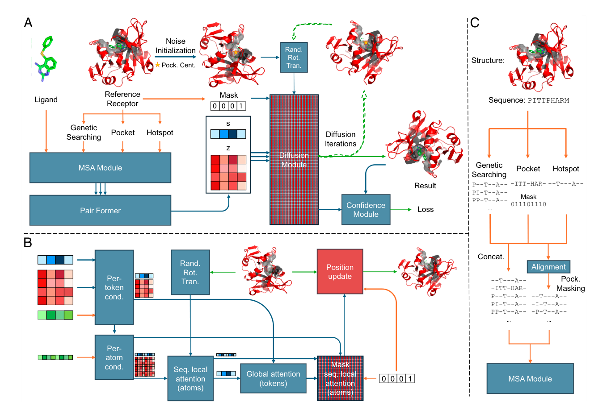
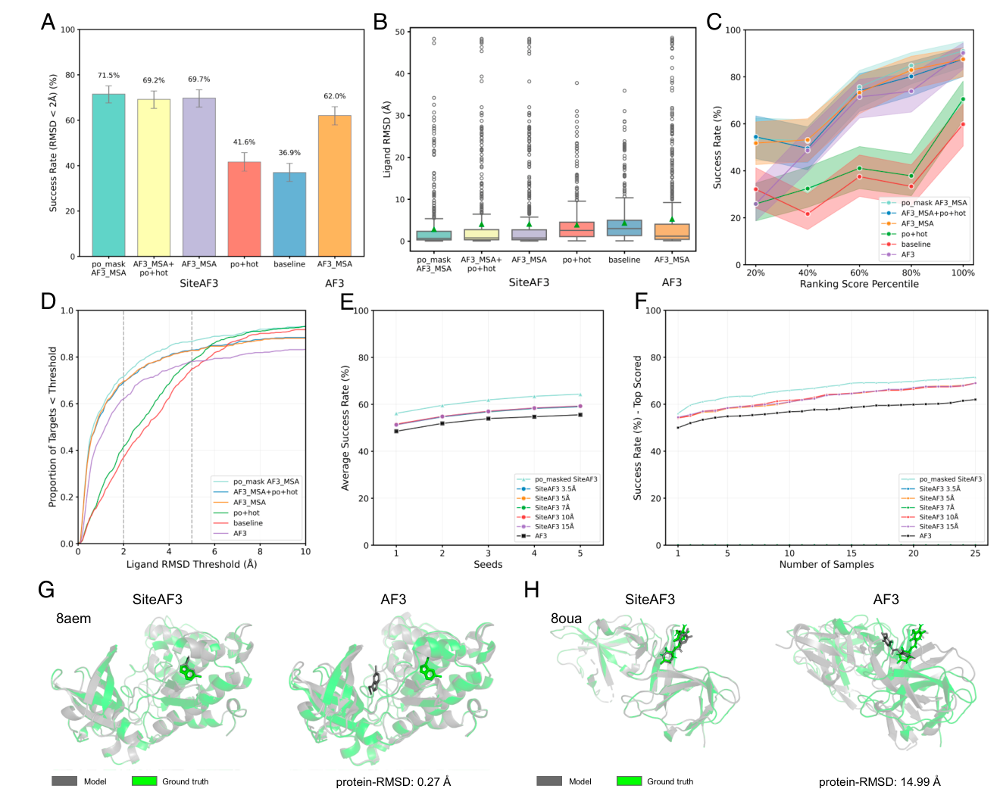
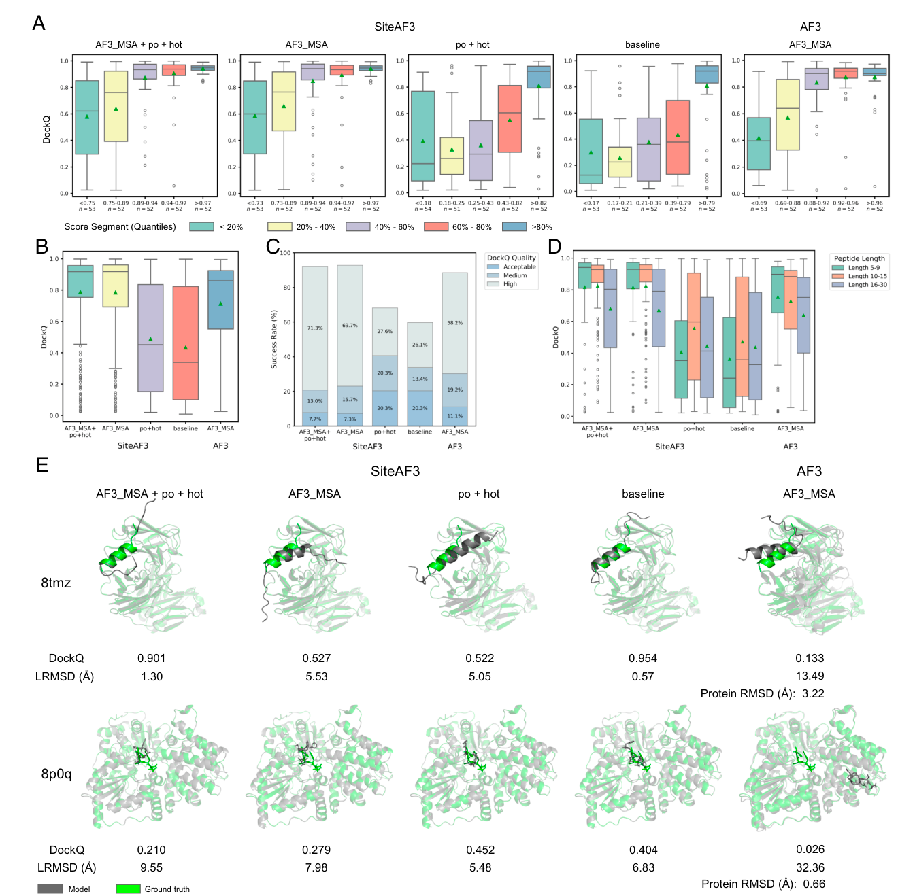
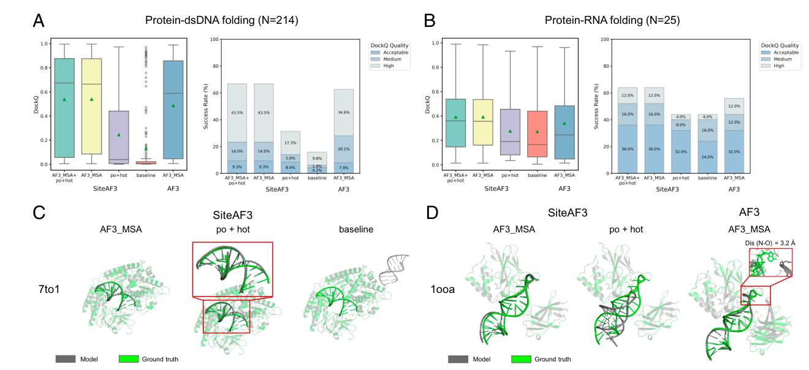

# Accurate site-specific folding via conditional diffusion based on AlphaFold3

### Link: [full article](https://doi.org/10.1073/pnas.2521048122)

Authors: Haocheng Tang, Junmei Wang

Proceedings of the National Academy of Sciences, November 4, 2025

---
AlphaFold3 can predict the structures of complexes between proteins and almost any biomolecule, but it has one notable weakness: **its prediction accuracy at specific binding sites is not good enough**. For orphan proteins (with little MSA information) and allosteric ligands (whose binding sites lie far from the orthosteric pocket) in particular, AF3 often places the ligand in the wrong position.

Building on AF3, Junmei Wang's team at the University of Pittsburgh proposed **SiteAF3**. The core idea is simple: **fix the receptor structure, run conditional diffusion of the ligand only around a specified binding pocket, and inject pocket and hotspot residue information through the MSA module**. Without retraining the whole model, and by fine-tuning only the diffusion module, AF3's prediction accuracy improves across the board.

## Part 1: Research Question

AF3 has made enormous progress in predicting the structures of biomolecular complexes, but it still has **three core limitations**:

**Limitation 1: strong dependence on MSA quality**

AF3's performance depends heavily on the quality of the multiple sequence alignment (MSA). For **orphan proteins** (few homologs, sparse MSA) or **noisy MSAs**, prediction accuracy drops markedly.

**Limitation 2: difficulty predicting allosteric binding sites**

AF3's cofolding mode performs poorly when predicting where **allosteric ligands** bind. The model tends to place ligands near the orthosteric pocket and struggles to correctly identify distal allosteric sites.

**Limitation 3: binding-interface accuracy and computational cost**

Even when the protein as a whole is folded correctly, **atomic-level accuracy at the binding interface still has room for improvement**. AF3 also consumes a lot of GPU memory on large complexes, and its conformational sampling is not efficient enough, which limits its use in high-throughput virtual screening.

The core question the authors therefore pose is: **without changing AF3's overall architecture, can modifying the diffusion process and the way information is injected substantially improve prediction accuracy at specific binding sites?**

## Part 2: Methodology

SiteAF3 makes **two key changes** to AF3 and adds a 'position update' module:

**Change 1: Conditional Diffusion**

AF3's diffusion module adds noise to all atoms simultaneously and then denoises them. SiteAF3 takes a different approach: **the receptor structure is fixed and only the ligand atoms are diffused**.

In practice, the initial coordinates of the ligand atoms are Gaussian-initialized around the **pocket center**, while the receptor atom coordinates are held fixed. Noise is added only to the ligand, and denoising updates only the ligand. A small perturbation (within a sphere of 2 Å radius) is also applied to the pocket center to increase sampling diversity. The initial point cloud additionally undergoes random rotation and translation to make the output robust.

The benefit is a **drastically reduced search space**: the model only needs to explore ligand conformations within a specific pocket of the receptor, while the receptor provides a stable structural context.

**Change 2: Injecting pocket information through the MSA**

AF3's MSA module uses genetic search to find full-length homologs as templates. SiteAF3 additionally introduces **pocket masking and hotspot residue annotation**.

How does the pocket information enter the model? The authors' approach is clever: the pocket sequence and the hotspot sequence are **appended after the MSA templates obtained from genetic search** and aligned by AF3's built-in Pair Former. In this way the MSA module learns 'which residues make up the binding pocket' and 'which residues are key hotspots'.

The authors tested five configuration modes: complete (AF3 MSA + pocket + hotspot), AF3 MSA only, pocket + hotspot only, baseline only, and original AF3. Across different datasets, pocket masked AF3 MSA and AF3 MSA + pocket + hotspot alternately achieved the best results.

**Auxiliary module: Position Update**

Because SiteAF3 updates only the ligand coordinates, a module is needed to **seamlessly stitch** the fixed receptor structure and the updated ligand structure into a complete complex. A mask introduced after the second sequence local attention module ensures that matrix multiplication acts only on the ligand's two-pair embedding, **substantially reducing GPU memory usage**.

The whole pipeline can be summed up in one sentence: **given a known receptor structure and a specified pocket location, let AF3's diffusion module focus on 'drawing' the correct ligand conformation inside that pocket**.

## Part 3: Key Figure Analysis

### Figure 1: SiteAF3 architecture

**What this figure asks:** What does SiteAF3 change relative to AF3?

{: width="1320" height="910" loading="lazy" decoding="async"}

*Figure 1. (A) Overview of the SiteAF3 inference pipeline; red modules are new additions. (B) Details of the conditional diffusion module. (C) MSA input preparation: how the pocket and hotspot sequences are appended.*

**How to read this figure**

* **Panel A** (overall pipeline): the green point cloud represents ligand atoms, Gaussian-initialized around the pocket center (yellow star). The 'Diffusion Module' and 'Confidence Module' outlined in red are the fine-tuned modules, while the blue boxes are modules inherited from AF3. After multiple rounds of diffusion, the ligand's predicted conformation is output and then scored for confidence by the Confidence Module.
* **Panel B** (inside the diffusion module): note the **mask** in the middle. After the second sequence local attention module, the mask lets only the ligand tokens take part in the matrix update. This keeps the receptor structure fixed and also reduces the computational load.
* **Panel C** (MSA preparation): the left half shows how the pocket and hotspot sequences are appended after the genetic-search templates. The right half shows how the pocket mask is encoded (0/1 marks which residues belong to the pocket).

**Takeaway:** The core design idea of SiteAF3 is **'known receptor + specified pocket → conditional diffusion of the ligand'**. This is a docking-style problem setting, but it uses a cofolding model architecture. Without changing AF3's main network, three steps (modifying the diffusion initialization, adding a mask, and injecting pocket information) turn a 'global cofolding' problem into a 'local site-specific folding' problem.

### Figure 2: Protein-small molecule prediction results

**What this figure asks:** How much better than AF3 is SiteAF3 at predicting small-molecule binding poses?

{: width="1320" height="1050" loading="lazy" decoding="async"}

*Figure 2. Prediction results on the FoldBench protein-small molecule dataset (N=558).*

**How to read this figure**

* **Panel A** (bar chart): success rate (LRMSD &lt; 2 Å) of the different modes. SiteAF3's best mode, **pocket masked AF3 MSA**, reaches **71.6%**, versus 62.0% for AF3.
* **Panel B** (box plot): the LRMSD distributions of all SiteAF3 modes are clearly lower than AF3's.
* **Panel C** (ranking-success rate curve): cumulative success rate after sorting by ranking score. In predictions with lower rankings (lower confidence), SiteAF3's advantage is more pronounced—**the largest improvement in success rate is for the bottom 20% of low-confidence structures, comparable to AF3 for high-confidence structures**.
* **Panel D** (CDF plot): cumulative distribution of LRMSD from 0 to 10 Å; SiteAF3 outperforms AF3 across the full range.
* **Panel E-F**: effect of different seeds and numbers of samples on the success rate. Increasing the number of samples keeps improving performance.
* **Panel G-H**: two case studies. **8aem** (CK2alpha + LVF): AF3 correctly generated the protein structure but placed the ligand at the orthosteric site, while SiteAF3 accurately predicted the allosteric binding site. **8oua** (cereblon isoform 4 + 11F peptide): AF3 failed to correctly generate the receptor protein structure (protein-RMSD 14.99 Å), while SiteAF3 successfully docked it (protein-RMSD 0.27 Å).

**Takeaway:** SiteAF3 is most valuable in the two scenarios where AF3 fails most easily: **allosteric ligands and orphan proteins**. Case 8aem shows that pocket information can directly guide the ligand to the correct allosteric site; case 8oua shows that fixing a known receptor structure can bypass AF3's failures at the protein-folding stage.

### Figure 3: Protein-peptide prediction results

**What this figure asks:** How well does SiteAF3 work for more flexible peptide ligands?

{: width="1320" height="1318" loading="lazy" decoding="async"}

*Figure 3. DockQ results on the PepPCBench protein-peptide dataset (N=261).*

**How to read this figure**

* **Panel A** (box plot): DockQ distributions binned by confidence. SiteAF3 scores higher than AF3 in every bin, and the improvement is especially large for **low-confidence predictions (bottom 40%)**.
* **Panel B** (overall DockQ): SiteAF3's best mode has a mean DockQ of **0.79** versus 0.71 for AF3 (an 11.2% improvement), and a median DockQ of **0.92** vs 0.86.
* **Panel C** (DockQ quality classes): **69.7%** of SiteAF3's predictions are 'High' quality (AF3_MSA+po+hot mode), significantly more than AF3.
* **Panel D**: grouped by peptide length. Short peptides (5-9 residues) improve the most, and long peptides (16-30 residues) differ the least. This matches intuition: short peptides have more concentrated conformational distributions, so initialization centered on the pocket center works better.
* **Panel E** (cases): top row, 8tmz (MERS-CoV spike + antibody CHM-27): SiteAF3 docks successfully while AF3 generates an incorrect antibody structure; bottom row, 8p0q (AaNGT + peptide): SiteAF3 docks correctly, while AF3 folds the protein correctly but finds the wrong binding site.

**Takeaway:** SiteAF3 gives the largest improvement for short peptides. This also hints at a limitation: **when the spatial extent of the ligand greatly exceeds the pocket radius, noise initialization centered on the pocket center is no longer ideal**.

### Figure 4: Protein-nucleic acid prediction results

**What this figure asks:** How well does SiteAF3 predict nucleic acid complexes?

{: width="1320" height="605" loading="lazy" decoding="async"}

*Figure 4. DockQ results on the protein-dsDNA (N=214) and protein-RNA (N=25) datasets.*

**How to read this figure**

* **Panel A** (protein-dsDNA): the SiteAF3 AF3_MSA mode improves mean DockQ by 10.2% and median DockQ by 13.6%. The success rate (High DockQ) rises from 7.9% for AF3 to **16.8%**. Adding pocket and hotspot information also helps place the dsDNA at the correct binding site.
* **Panel B** (protein-RNA): the sample size is small (N=25). The SiteAF3 AF3_MSA mode improves mean DockQ by 14.7% and median DockQ by 44.0%. However, the absolute values remain low (mean DockQ ~0.39), showing that protein-RNA complexes are still a challenge.
* **Panel C** (case 7to1): RIG-I + p3SLR30 dsDNA. The SiteAF3 AF3_MSA mode succeeds; the po+hot and baseline modes place the dsDNA at the correct binding site but with shifted base pairing. Only the AF3_MSA mode, which fully exploits the genetic-search template information, can accurately predict the fine structure of the nucleic acid.
* **Panel D** (case 1ooa): NF-κB p50/2 + RNA aptamer. SiteAF3 AF3_MSA docks successfully, but note one detail: **the orientation of one base in the RNA (N-O distance 3.2 Å)** differs subtly from the experimental structure. The po+hot mode finds the correct site, but one region of the protein undergoes an incorrect conformational change.

**Takeaway:** Nucleic acid complexes are where SiteAF3 gains the least. The authors themselves acknowledge that **nucleic acid molecules are large and not well suited to noise initialization centered on the pocket center**. Nucleic acid binding interfaces are usually extended surface contacts, and Gaussian initialization centered on a single point struggles to cover the whole interface.

## Part 4: Key Contributions

### Cross-modality benchmark summary

| Task | Dataset | Metric | SiteAF3 best | AF3 |
|---|---|---|---|---|
| Protein-small molecule | PoseBustersV2 (N=308) | % RMSD ≤ 2 Å | **81.2%** | 73.1% |
| Protein-small molecule | FoldBench (N=558) | % RMSD &lt; 2 Å | **71.6%** | 62.0% |
| Protein-peptide | PepPCBench (N=261) | mean / median DockQ | **0.79 / 0.92** | 0.71 / 0.86 |
| Protein-dsDNA | FoldBench (N=214) | mean / median DockQ | **0.55 / 0.71** | 0.49 / 0.59 |
| Protein-RNA | AF3 dataset (N=25) | mean / median DockQ | **0.39 / 0.36** | 0.34 / 0.25 |

### Most noteworthy findings

**1\. The advantage is greatest for allosteric binders and cofactors**

The authors specifically evaluated 14 allosteric ligand complexes (5 in the AF3 training set and 9 unseen). In the pocket-masked AF3 MSA mode, SiteAF3's **mean RMSD is only about one-third of AF3's, and its median RMSD only one-fifth**. It also shows a consistent advantage on 10 cofactor complexes. This indicates that pocket guidance is particularly valuable for proteins with multiple binding sites.

**2\. Improvement is larger for low-confidence predictions**

On FoldBench, SiteAF3 significantly improves predictions in **the bottom 40% by ranking score**, while for the top 20% the gap to AF3 is small. This means SiteAF3's core value lies in **'rescuing' difficult cases that AF3 would otherwise get wrong**, with limited help for targets that are already easy.

**3\. Substantially lower computational cost**

The authors trained and tested on an RTX 6000 Ada (48 GB). AF3 is prone to running out of memory on large systems (more than about 3500 tokens). Through its mask mechanism, SiteAF3 **updates only the ligand-related embeddings**, substantially reducing memory requirements. The mode that skips genetic search (po+hot) can also bypass the time-consuming MSA construction step for further speedup.

**4\. MSA templates can sometimes be misleading**

A counterintuitive finding: on FoldBench (data not in the AF3 training set), **the pocket masked AF3 MSA mode performs best**, whereas on PoseBustersV2 (data in the AF3 training set), AF3_MSA + po + hot does better. This suggests that on unseen data AF3's genetic search may **overfit to template information from the training set**, and that using pocket masking to filter out noise in the full-length MSA unrelated to the binding site actually works better.

### Innovations and limitations

**5 innovations**

1\. The first to perform **conditional diffusion** at AF3 inference time: fixing the receptor and diffusing only the ligand

2\. **Seamlessly injecting** pocket and hotspot information into AF3's representation learning by appending it to the MSA

3\. A **lightweight plug-in** for AF3 that is easy to install and highly compatible

4\. Cross-modality unification: **one framework handles four ligand types: small molecules, peptides, DNA and RNA**

5\. Substantially lower GPU memory requirements, paving the way for high-throughput virtual screening

**4 limitations**

**Limitation 1:** The noise initialization strategy uses a Gaussian distribution centered on the pocket center, which is **not ideal for macromolecules with extended interfaces (nucleic acids, large peptides)**. The authors suggest developing adaptive initialization strategies in the future.

**Limitation 2:** **Covalent docking is not currently supported**. Handling covalent inhibitors requires modeling covalent bond formation, which would need an extension of the model architecture.

**Limitation 3:** The receptor structure is treated as completely **rigid and fixed**. During actual binding, residues near the pocket (key residues, loop regions) often undergo conformational adjustments. A local flexibility module could be introduced in the future.

**Limitation 4:** SiteAF3 depends on the AF3 framework, and **AF3 itself is not fully open source**. How its pocket-guidance feature relates to AF3's internal, not-yet-released pocket-guided prediction feature is unclear, and the performance difference between the two deserves attention.

### Open questions worth following

1\. **Can the conditional diffusion idea transfer to other cofolding models?** Open-source models such as Boltz, Chai and Protenix have similar diffusion modules, so SiteAF3's pocket-navigation idea should in principle be general.

2\. **What initialization strategy do nucleic acid complexes need?** The current point-centered Gaussian initialization has limited effect on extended nucleic acid interfaces; an initialization distributed along the interface surface may be needed.

3\. **Can receptor flexibility be modeled by combining with molecular dynamics?** The assumption of a fully rigid receptor is a clear limitation in drug design settings.

4\. **How does it perform in real high-throughput virtual screening?** The paper demonstrates lower computational cost but has not yet carried out end-to-end validation in large-scale virtual screening.

**In one sentence:** SiteAF3's core contribution is to upgrade AF3 from 'give me a sequence and I'll guess the structure' to **'give me a receptor + binding pocket and I'll accurately predict the ligand conformation'**. The idea is simple and effective (fix what is known, focus on what is unknown, inject prior knowledge) and offers a clear route to making cofolding models more practical.

**Paper:** Accurate site-specific folding via conditional diffusion based on AlphaFold3

**Authors:** Haocheng Tang and Junmei Wang

**Affiliation:** University of Pittsburgh, School of Pharmacy

**DOI:** 10.1073/pnas.2521048122

### About the Corresponding Author

**Junmei Wang** is an Associate Professor in the Department of Pharmaceutical Sciences at the University of Pittsburgh School of Pharmacy and a researcher at the university's Computational Chemical Genomics Screening Center (CCGS). He received his PhD from Peking University and then did postdoctoral research in Peter Kollman's lab at the University of California, San Francisco (UCSF). Before joining the University of Pittsburgh, he was an Associate Professor at the University of Texas Southwestern Medical Center. Professor Wang is a long-standing core developer of the AMBER molecular force fields and helped develop widely used force fields such as FF99 and GAFF/GAFF2, as well as the Antechamber module. In recent years his research has expanded to AI-driven drug design, and he leads NIH R01-funded projects to develop the next-generation GAFF3 force field and to carry out AI-assisted biased ligand design. His research spans computational chemistry and biophysics, drug discovery and development, and systems pharmacology. He has more than 36,000 citations on Google Scholar and an h-index of 66.

## Citation

Tang, H., & Wang, J. (2025). Accurate site-specific folding via conditional diffusion based on AlphaFold3. Proceedings of the National Academy of Sciences, 122(44), e2521048122. https://doi.org/10.1073/pnas.2521048122
