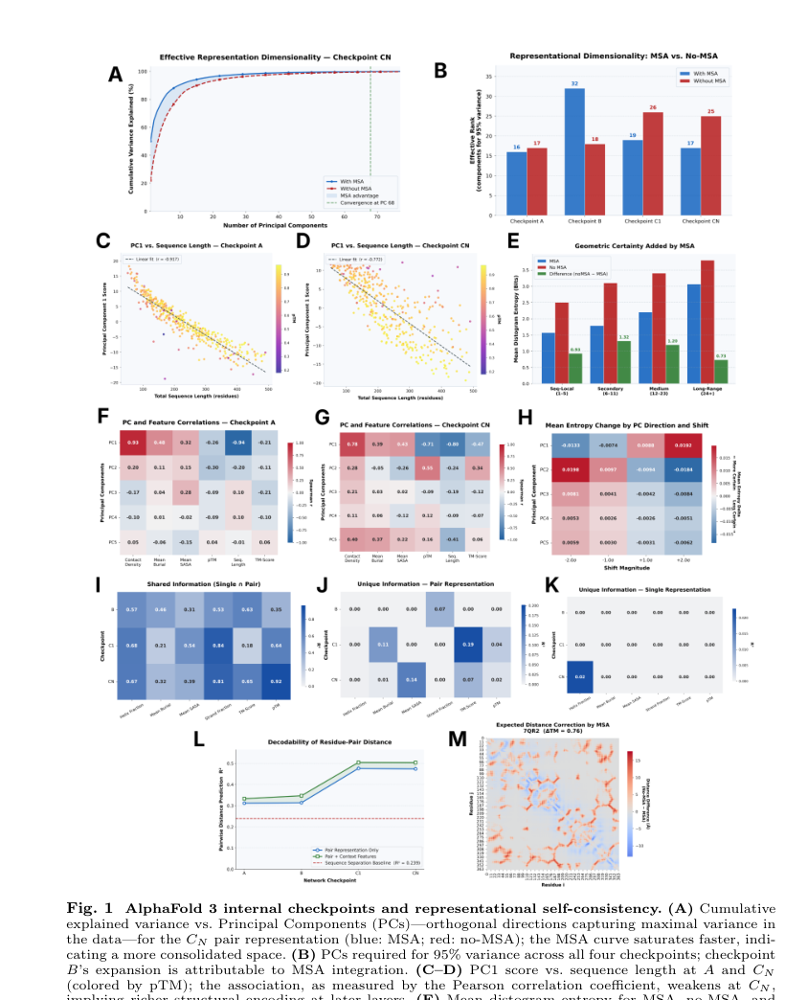
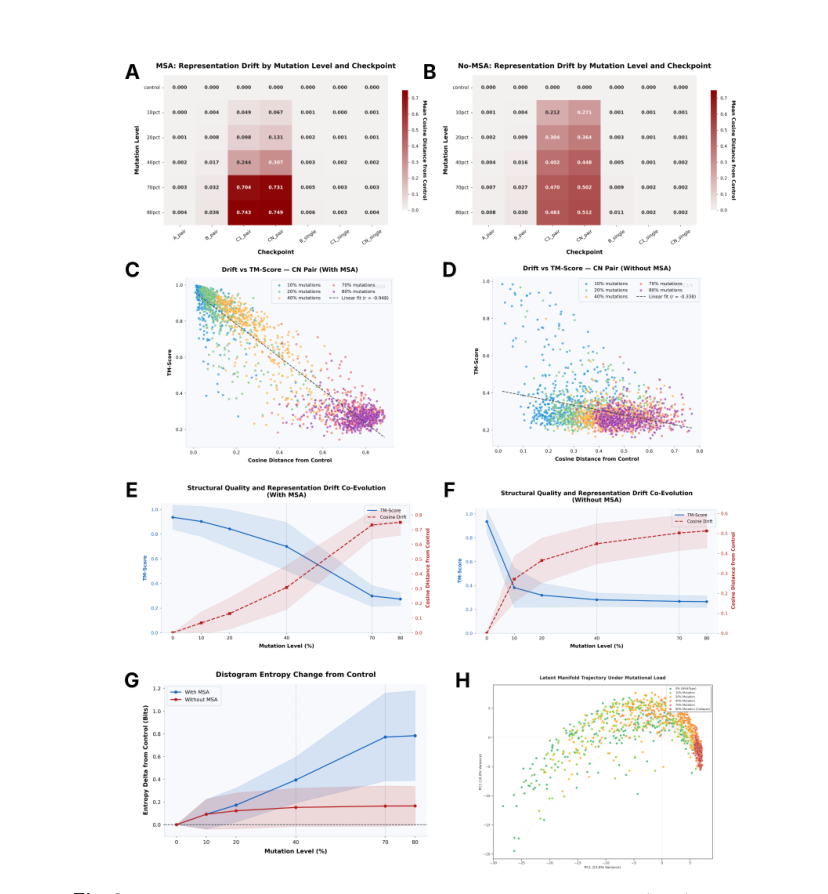
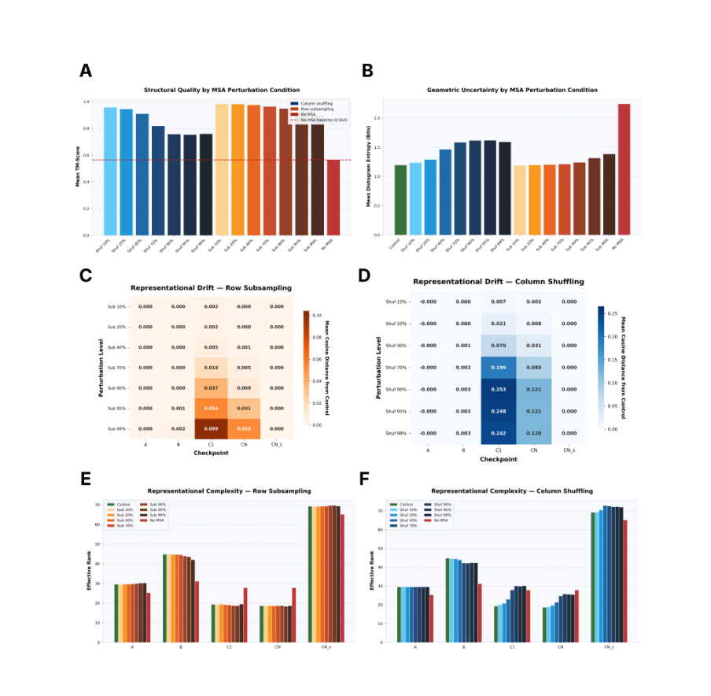
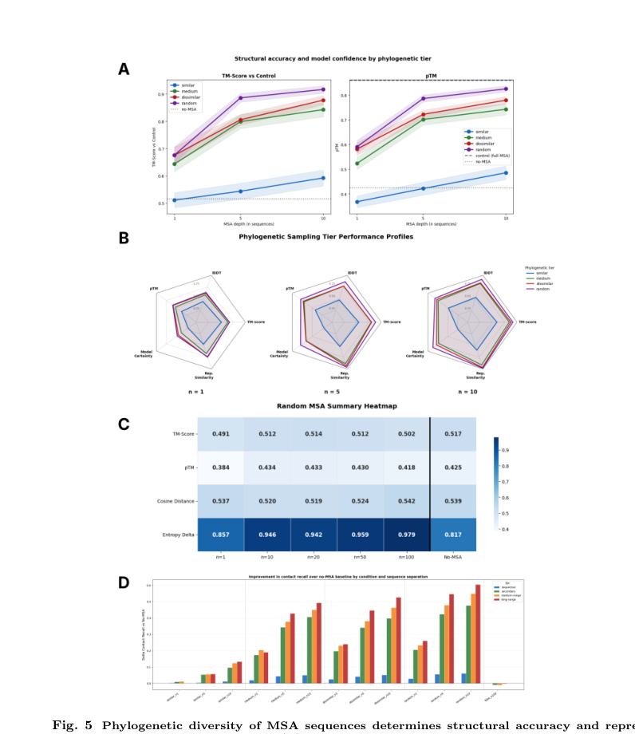

# AlphaInterp: Mechanistic Interpretability of AlphaFold 3 Reveals How Evolutionary Information Shapes Protein Structure Prediction

### Link: [full article](https://doi.org/10.64898/2026.04.22.720175)

Authors: Jonathan Feldman, Jeffrey Skolnick

bioRxiv, May 29, 2026

---
**'Opening the Black Box of Protein-Folding AI' series #1**

AlphaFold 3 predicts protein structures with remarkable accuracy, but what has it actually learned inside? Has it truly mastered the physical rules that map sequence to structure, or does it rely on a more specific input signal?

Feldman and Skolnick at Georgia Tech used a three-pronged toolkit of **linear probing, activation patching and MSA ablation** to carry out a systematic mechanistic interpretability analysis of four internal checkpoints in AF3. The core finding: **AF3's structural reasoning depends heavily on the evolutionary scaffold provided by the MSA**. The Pairformer compresses scattered coevolutionary signals into a compact structural latent space; remove the MSA and this space collapses and prediction accuracy plummets. Even more importantly, **what really matters is the phylogenetic diversity of the homologs: 5-10 appropriately diverged sequences recover most of the performance**.

## Part 1: Research Question

AlphaFold 3 has achieved breakthrough success in protein structure prediction, but the authors pursue a deeper set of questions:

**What exactly does AF3 encode internally?**

At which layer does structural information begin to appear? Which matters more: the single representation (one vector per residue) or the pair representation (one vector per residue pair)?

**What role does the MSA play in forming the internal representations?**

Does the multiple sequence alignment (MSA) merely add a small accuracy boost, or does it determine whether the structural latent space can exist at all?

**Where does mutational invariance come from?**

For many clearly destructive mutations, the structure AF3 predicts barely changes. Is this a problem of the output module, or are the internal representations themselves 'locked in'?

**Has AF3 really learned general physical rules?**

If it truly grasped the physical causality from sequence to structure, it should be equally robust on novel proteins, heavy mutations and fold-switching proteins. If it relies mainly on template-like evolutionary cues, it should break down whenever evolutionary support is missing.

## Part 2: Methodology: Four Checkpoints + Three Sets of Experiments

The AlphaInterp framework can be summarized as follows: **at four key internal nodes of AF3, three complementary experimental approaches are used to dissect the flow of information**.

### 2.1 Four Internal Checkpoints

The authors extracted representations at four key positions in AF3's forward pass:

**Checkpoint A**: after the initial sequence representation is built, before MSA information has been deeply integrated

**Checkpoint B**: after the MSA module, before the Pairformer

**Checkpoint C1**: after the first Pairformer pass

**Checkpoint CN**: after the last recycling iteration, before the diffusion module

At each checkpoint, two kinds of representation are extracted: the **single representation** (one vector per residue) and the **pair representation** (one vector per residue pair). The pair representation carries geometric relationships more directly and is the main focus of the analysis.

### 2.2 Experiment 1: Linear Probing (What is stored in this layer?)

**Linear predictors** are trained on the single/pair representations at each checkpoint to predict a range of biophysical features:

* **Global metrics**: pTM (the model's own confidence) and TM-score (agreement with the true structure)
* **Residue-level features**: secondary structure, solvent-accessible surface area (SASA), burial depth
* **Residue-pair features**: contact map, residue-pair distance (Cα-Cα distance)

The logic is straightforward: if a biophysical feature can be read out of a layer by a **linear** predictor, the feature is already encoded fairly 'explicitly' at that layer. Tracking this from A to CN traces how information is progressively enriched layer by layer inside AF3.

### 2.3 Experiment 2: Activation Patching (Does this information causally take part in the computation?)

Linear probing answers whether information is present, but being present and being actively used by the model are two different things. Activation patching performs **causal inference**:

**Directional steering (PCA shifts)**

PCA is performed on the CN pair representation to identify the principal component directions that capture the most variance. The embedding is then pushed along a given principal direction to see whether the downstream distogram entropy (a measure of geometric uncertainty) systematically rises or falls. If a principal direction can systematically change geometric certainty, the latent space really does contain **an axis that controls 'structural confidence'**.

**Cross-protein transplantation**

A more aggressive test: fragments of the CN pair representation from a protein that was predicted extremely well are transplanted into a completely unrelated, poorly predicted protein. If the downstream distogram uncertainty drops sharply as a result, then this encoding of 'structural certainty' is **transferable across proteins**: it is an abstract geometric language, not a memory of a specific sequence.

### 2.4 Experiment 3: MSA Ablation (How important is evolutionary information?)

This is the central set of experiments in the paper. The authors designed multiple levels of MSA perturbation to finely dissect which components of the MSA matter most to AF3:

* **Removing the MSA entirely**: keeping only the single query sequence
* **Row subsampling**: keeping the MSA structure but randomly removing some sequences (reducing depth)
* **Column shuffling**: preserving each column's marginal distribution but destroying inter-column coevolution statistics
* **Phylogenetic stratification**: keeping only close (>80%), intermediate (50-70%) or distant (&lt;30%) homologs
* **Fake MSA injection**: replacing the real MSA with sequences from completely unrelated proteins (negative control)

The elegance of this design lies in its step-by-step progression: removing the MSA entirely asks 'does it matter?', row subsampling asks 'how deep does it need to be?', column shuffling asks 'are exact covariation statistics needed?', phylogenetic stratification asks 'which kind of homolog is most useful?', and the fake MSA asks 'does the model only look at the format, or does it really read evolutionary information?'

### 2.5 Benchmark Datasets

* **Main dataset of 400 monomeric proteins**: Novel 200 (&lt;30% homology to the training set) + Similar 200 (no homology restriction), all published after the AF3 training cutoff
* **SABmark**: proteins with highly divergent sequences but similar structures, testing fold recognition ability
* **Fold-switching proteins**: proteins with similar sequences that can adopt different folds experimentally

## Part 3: Key Figure Analysis

### Figure 1: Self-consistency and information structure of AF3's internal representations

**What this figure asks:** From input to output, how is structural information progressively built up inside AF3? What role does the MSA play in this process?

{: width="820" height="1044" loading="lazy" decoding="async"}

*Figure 1. (A) Cumulative explained variance versus number of principal components for the CN checkpoint pair representation. (B) Number of principal components needed to reach 95% explained variance at each checkpoint. (C-D) Change in the correlation between PC1 and sequence length at A and CN. (E) Geometric certainty added by the MSA at different sequence separations. (F-G) Correlation matrices between PCA components and structural features. (H) Effect of activation patching along PCA directions on distogram entropy. (I-K) Shared and unique information in the single/pair representations. (L) Linear decodability of residue-pair distances increasing layer by layer. (M) Case visualization of distance correction.*

**How to read this figure**

* **Panel A-B** reveal how the MSA affects the dimensionality of the latent space. With the MSA (blue line), the variance of the pair representation saturates over fewer principal components (more compact); without the MSA (red line), the variance is more spread out. Specifically, reaching 95% variance at Checkpoint B requires **32 principal components (with MSA) vs 18 (without MSA)**: the space first expands once the MSA is injected, and by CN the Pairformer compresses the signal back into a more compact structural manifold.
* **Panel C-D** show an interesting shift: at Checkpoint A, PC1 is highly correlated with sequence length (r = 0.917); by CN, this correlation weakens considerably (r = 0.773), and when the point cloud is colored by pTM a clear quality gradient emerges. This indicates that the Pairformer transforms the latent space from 'encoding basic sequence properties' into **'encoding structural quality'**.
* **Panel E** quantifies the geometric certainty added by the MSA: the MSA lowers distogram entropy (geometric uncertainty) at every sequence separation, with **the largest effect at medium range (13-23 residues) and long range (24 and above)**. This means the MSA's key contribution is to help the model establish medium- and long-range spatial constraints.
* **Panel F-G** compare the correlation matrices between PCA components and structural features. At Checkpoint A, PC1 correlates mainly with contact density and mean burial (basic topological properties); by CN, PC1 reaches **a correlation of 0.78 with pTM** and 0.89 with contact density. The latent space has become highly organized into a geometric space directly tied to structural quality.
* **Panel H** shows the activation patching result: pushing the embedding in the positive PC2 direction **systematically increases distogram entropy** (red positive values), proving that the latent space really contains a steerable dimension of 'geometric certainty/uncertainty'.
* **Panel I-K** analyze how information is split between the single and pair representations. The key finding: **nearly all structural information resides in the pair representation**. Among the pair-unique information, contact density, mean burial, pTM and others are all high (Panel J), whereas the unique information in the single representation is almost zero (Panel K).
* **Panel L** tracks the linear decodability of Cα-Cα distances: R2 rises steadily from **0.311 at A to 0.474 at CN** (0.504 with local context added). This steadily rising curve vividly shows how the Pairformer progressively integrates scattered evolutionary cues into decodable geometric relationships.

### Figure 3: Mutational invariance: internal representation or output artifact?

**What this figure asks:** When AF3 'turns a blind eye' to strongly destructive mutations, does the root cause lie in the internal representations or in the final output? Does the MSA help maintain this stability?

{: width="828" height="894" loading="lazy" decoding="async"}

*Figure 3. (A-B) Heatmaps of representational drift at each checkpoint with/without the MSA. (C-D) Scatter plots of CN pair representation drift versus TM-score. (E-F) Co-evolution of mutation level with structural quality/representational drift. (G) Distogram entropy as a function of mutation level. (H) PCA visualization of mutational trajectories in the latent space.*

**How to read this figure**

* **Panel A-B** are two heatmaps; the x-axis is the checkpoint (A through CN), the y-axis is the mutation level (10%-80%), and color indicates cosine distance from the unmutated control. **Key contrast**: with the MSA (Panel A), representational drift is concentrated at the C1/CN stages and becomes significant only at 70-80% mutation (deep red, with a cosine distance of 0.749 at the CN pair); without the MSA (Panel B), 10% mutation already causes clear drift in the C1 pair (0.364), after which it plateaus.
* **Panel C-D** are the most intuitive scatter plots. With the MSA (Panel C), the negative correlation between CN pair drift and TM-score is extremely tight, **Pearson r = -0.948**, an almost linear relationship. This number means that the structure stays unchanged precisely because the internal pair representation itself barely changes. Without the MSA (Panel D), the correlation is still there (r = -0.338) but far weaker than with the MSA, and overall TM-scores are already very low.
* **Panel E-F** track two curves as mutation level increases: TM-score in blue and cosine drift in red. With the MSA (Panel E), TM-score stays fairly high up to 40% mutation and then collapses at an accelerating rate, while cosine drift rises in step; the two are almost mirror images. Without the MSA (Panel F), TM-score is low from the start, 10% mutation already causes clear drift, and after that the structure 'has little left to lose'.
* **Panel G** reveals an interesting asymmetry: with the MSA, distogram entropy **rises steadily and continuously** with mutation level (blue line), indicating that the model gradually 'senses' that the sequence is being destroyed, only slowly; without the MSA, entropy is high from the outset and then levels off, meaning the model is already in a high-uncertainty state without the MSA.
* **Panel H** is a PCA visualization of latent-space trajectories. Each point represents the CN pair representation of a protein at a given mutation level, colored from green (low mutation) to red (high mutation). The mutational trajectories form a coherent 'drift path' in the latent space, and the presence of the MSA makes this path shorter and more compact.

### Figure 4: MSA perturbation: row subsampling vs column shuffling

**What this figure asks:** Which information in the MSA does AF3 depend on: the number of sequences (depth), or the inter-column coevolution statistics?

{: width="904" height="884" loading="lazy" decoding="async"}

*Figure 4. (A) TM-score under different MSA perturbation conditions. (B) Corresponding distogram entropy. (C-D) Representational drift at each checkpoint under row subsampling and column shuffling. (E-F) Representational complexity (effective rank) under each condition.*

**How to read this figure**

* **Panel A** is the central bar chart. Dark blue is column shuffling (Shuf), orange is row subsampling (Sub), and the red dashed line is the baseline with no MSA at all (TM-score = 0.564). The result is striking: **after removing 99% of the sequences (about 47 left on average), TM-score still holds at about 0.78**, far above the no-MSA baseline. Column shuffling up to 40% is also robust. This shows that AF3's dependence on the MSA does not require 'full depth and exact covariation statistics'.
* **Panel B** shows distogram entropy trends consistent with Panel A: entropy rises slowly under row subsampling, faster under column shuffling, and is highest with no MSA at all. What AF3 seems to need is a **'minimal signal that evolutionary information is present'** to activate its structural priors.
* **Panel C-D** explain the change in structural performance at the representation level. Under row subsampling (Panel C), drift is concentrated at C1 and is actually small at CN, suggesting that the Pairformer has some 'error-correcting' ability: even when the input MSA is weakened, it can partially restore the structural coherence of the representation during recycling. Under column shuffling (Panel D), drift at C1 is larger (cosine distance reaches 0.242 at 99% shuffling), indicating that **inter-column coevolution statistics are more critical to the quality of the Pairformer's input**.
* **Panel E-F** show the effective rank (a measure of representational complexity). Regardless of the perturbation, the effective rank rises by the CN stage, indicating that perturbation makes the Pairformer's output representation more dispersed and less able to form a compact structural manifold. With no MSA at all the effective rank is highest, fully consistent with the conclusion that the latent space collapses.

### Figure 5: Phylogenetic diversity is what matters, and 5-10 sequences suffice

**What this figure asks:** What kind of homologous sequence is most useful to AF3, and how many are needed?

{: width="796" height="920" loading="lazy" decoding="async"}

*Figure 5. (A) TM-score and pTM across phylogenetic tiers (similar/medium/dissimilar/random) and MSA depths (1/5/10 sequences). (B) Radar charts showing each tier's performance across multiple metrics. (C) Summary heatmap for fake MSAs (random MSA). (D) Improvement in contact recovery binned by sequence separation.*

**How to read this figure**

* **Panel A** is the most practically valuable result in the paper. The four lines represent four types of homolog: blue similar (>80% identity), orange medium (50-70%), green dissimilar (&lt;30%) and purple random (randomly sampled). The black dashed line is the full-MSA TM-score ceiling and the gray dashed line is the no-MSA baseline. **Even a single homologous sequence significantly outperforms no MSA**. But close homologs (blue line) help the least, because they largely just repeat the query itself. Distant homologs (green line) and random sampling (purple line) work better. **At n=5, random already reaches a TM-score of about 0.88, and about 0.92 at n=10, close to the full MSA**.
* **Panel B** uses radar charts to show the performance of the four tiers along five dimensions: pTM, BiDT (bidirectional distance test), TM-score, model certainty and representational similarity. From n=1 to n=10, the radar areas of dissimilar and random expand markedly, while similar always has the smallest area. This shows clearly that **phylogenetic diversity beats sheer depth across multiple dimensions**.
* **Panel C** is a very elegant negative control. The authors trimmed sequences from completely unrelated proteins and filled them into the MSA (a 'fake MSA'), at depths from 1 to 100 sequences. No matter how many fake sequences are supplied, TM-score stays at about 0.49-0.52 (almost the same as with no MSA), cosine distance is as high as 0.54, and the entropy delta also stays high. This rules out an important alternative explanation: **AF3 really does need information that is evolutionarily related to the query; it reads genuine evolutionary signal rather than merely responding to input that 'looks like an MSA'**.
* **Panel D** bins the improvement in contact recall by sequence separation: sequential (short range), secondary (secondary-structure scale), medium-range and long-range. The result is clear: **recovery of long-range contacts depends most on a highly diverse MSA** (the green/purple bars on the right are clearly taller). This makes good sense: long-range contacts are the hardest to infer from local sequence patterns and precisely require the 'global topological constraints' supplied by evolutionary comparison. Even a single distant homolog significantly improves long-range contact recall.

## Part 4: Key Contributions

### 4.1 The Pairformer compresses scattered coevolutionary signals into a structural manifold

The changes from A to CN follow a clear pattern: at Checkpoint B (after MSA injection), the representational dimensionality briefly expands, as the MSA scatters a large number of coevolutionary cues into the latent space. The Pairformer then compresses these high-dimensional, scattered signals into a more compact space at the C1/CN stages.

At the same time, the predictability of pTM from the pair representation increases sharply: **R2 jumps from 0.34 at A to 0.86 at CN**. By the later stages, the internal pair representation is highly organized into a geometric space directly tied to structural quality. The Pairformer acts like an information compressor, integrating scattered evolutionary cues into a usable **structural manifold**.

### 4.2 Structural information lives mainly in the pair representation

Using information-decomposition experiments (Figure 1 Panel I-K), the authors show that geometric information such as residue-pair distances and contact maps is clearly stronger and more independent in the pair channel. The single representation behaves more like a residue-level state tracker, while **AF3's main arena for geometric reasoning is the pair manifold**.

The R2 for Cα-Cα distance grows from 0.311 at A to 0.474 at CN, and contact prediction also improves steadily with depth. This agrees with the design intuition behind the AlphaFold architecture, but the paper provides more direct internal evidence.

### 4.3 Confidence can be causally manipulated and transfers across proteins

The activation patching experiments show that shifting the CN pair embedding along certain principal PCA directions systematically changes distogram entropy. This indicates that the latent space really does contain axes that control 'geometric certainty/uncertainty'.

The more aggressive cross-protein transplantation experiment shows that when fragments of the CN pair representation from an extremely well-predicted protein are transplanted into an unrelated, poorly predicted protein, the downstream distogram becomes unusually certain. **This shows that AF3 has developed an abstract 'geometric language of structural certainty' internally**: a transferable representational pattern rather than merely an encoding of specific sequences.

### 4.4 Without the MSA, structural accuracy plummets and internal representations collapse

This is the central conclusion of the paper. With the MSA, the mean TM-score is **0.9363**; without it, the score plummets to **0.5388**. This is not a modest decline but a collapse from 'near-perfect prediction' to 'essentially failed'.

More importantly, the changes at the representation level correspond exactly: without the MSA, the late-stage pair representation has a higher effective dimensionality (a more dispersed space) and distogram entropy rises globally. The MSA does more than give the model a few 'extra cues'; it is **a prerequisite for sustaining the entire usable structural latent space**.

### 4.5 MSA dependence is unrelated to training-set familiarity

The authors split the proteins into Similar and Novel groups, expecting that AF3 might be able to do without the MSA for proteins similar to the training set. That turned out not to be the case: even for proteins the model may have been relatively familiar with during training, removing the MSA collapsed both the representations and the structures just the same. AF3's structural ability does not come from 'memorizing this family'; rather, **the model has learned how to use evolutionary comparison to activate its structural priors**. Without this scaffold, sequence alone cannot reliably trigger geometric reasoning.

### 4.6 Mutational invariance is rooted in the internal representations

The authors applied 10%-80% cumulative deleterious mutations to the 400 proteins. At 40% mutation, the predicted structures remain remarkably stable; only at 70-80% do they clearly collapse. The key number: the cosine drift of the CN pair representation and the drop in structural TM-score have **a Pearson correlation coefficient of -0.948**. The structure stays unchanged precisely because the internal pair representation itself barely changes.

Moreover, the drift appears mainly at C1/CN rather than A/B: the issue lies not in the input encoding stage but in **the stage where the Pairformer forms its geometric hypothesis**. The model behaves more as if it keeps holding on to the original fold basin in the later stages until the perturbation becomes too large to sustain it. This stability itself also depends on the MSA: without the MSA, 10% mutation already causes large drift, and the model lacks a stable fold hypothesis from the outset.

### 4.7 Phylogenetic diversity is what matters: 5-10 sequences suffice

The sequences in the MSA were stratified by sequence identity (>80%, 50-70%, &lt;30%, random), and the model was then given only 1, 5 or 10 sequences. The results are very clear:

* Even **a single homologous sequence** significantly outperforms no MSA
* Close homologs (>80% identity) help the least, because they largely just repeat the query itself
* Distant homologs and random sampling are significantly more effective
* **At n=5, TM-score already reaches about 0.88, and about 0.92 at n=10**, close to the full MSA

Distant homologs are more useful because they truly reveal which positions must be conserved, which can vary, and which long-range contacts serve as topological anchors. What AF3 needs is **phylogenetic diversity**, not simply alignment depth.

### 4.8 Fake MSAs do not help: ruling out a format artifact

The authors also designed a clever negative control: sequences from unrelated proteins were trimmed and stuffed into the MSA, at depths from 1 to 100 sequences. This failed to improve performance at all, which stayed essentially the same as with no MSA. It rules out the alternative explanation that 'the model improves as soon as it sees input in an MSA-like format': **AF3 really does read information that is evolutionarily related to the query**.

### 4.9 Long-range contact recovery depends most on a diverse MSA

Binning contact recall by sequence separation reveals that the gain from MSA diversity is **largest for long-range contacts**. Long-range contacts are the hardest to infer directly from local sequence patterns; if a small number of distant homologs can help recover them, the model must be reading 'global topological constraints' from evolutionary differences. It is as if evolutionary information provides the protein with a kind of **structural skeleton anchoring**.

### 4.10 Fold-switching proteins: AF3 collapses onto a single dominant fold

For fold-switching proteins that should adopt different conformations experimentally, AF3 tends to 'shrink' all conformations onto one dominant fold: the mean RMSD between the switching regions is only about 2.02 Å. The model is not entirely oblivious, though: fold-switching regions have higher distogram entropy and lower pLDDT. **The model 'knows something is off here', but cannot explicitly unfold multiple stable solutions**.

## Part 5: Limitations and Outlook

**A warning for protein design**

De novo design, novel folds and heavily engineered sequences usually lack rich evolutionary homologs. If AF3's accuracy depends mainly on an evolutionary scaffold, its reliability in these settings must be assessed with care. A high-confidence prediction does not necessarily mean the sequence is physically foldable.

**Implications for MSA construction strategy**

Since 5-10 diverse homologs recover most of the performance, the focus of MSA construction should shift from pursuing depth to pursuing **small but diverse homolog sets**. This has direct practical value for proteins with sparse homologs, synthetic MSA generation and computational cost optimization.

**A refreshed understanding of the model**

AF3 behaves more like **an advanced fold-recognition system built on evolutionary information**, relying on evolutionary comparison to activate structural reasoning. This is fundamentally different from 'a general physical reasoning model that works purely from a single sequence'. Future directions might include constructing minimal, highly diverse MSAs more efficiently, or developing genuinely stronger single-sequence / physics-grounded models.

**New ideas for uncertainty estimation**

The effective rank of the pair latent space and distogram entropy may expose prediction failure modes earlier than pLDDT/pTM. The feasibility of activation patching also suggests that manipulating the latent space might be used to induce alternative folds or ensembles, a promising direction.

**In one sentence**

The structure prediction ability of AlphaFold 3 rests on the Pairformer compressing the evolutionary covariation signals supplied by the MSA into a linearly decodable structural latent space. Geometric confidence in this latent space can be causally manipulated, but its coherence and stability **depend heavily on the evolutionary scaffold provided by the MSA**. AF3's success reflects an advanced fold-recognition ability built on evolutionary information more than general physical reasoning from a single sequence.

## About the Corresponding Author

Jeffrey Skolnick is a Regents Professor and GRA Eminent Scholar in the School of Biological Sciences at the Georgia Institute of Technology, where he also directs the Center for the Study of Systems Biology. He has worked for decades on protein structure prediction, function prediction and drug discovery, and is one of the core developers of the TASSER / I-TASSER protein structure prediction methods, which have performed strongly across multiple CASP competitions. Skolnick's research spans theoretical physics, computational biology and systems pharmacology, and in recent years he has extended his focus to the mechanistic understanding of AI-driven protein structure modeling, a direction of which this paper is a representative example.

## Citation

Feldman, J., & Skolnick, J. (2026). AlphaInterp: Mechanistic Interpretability of AlphaFold 3 Reveals How Evolutionary Information Shapes Protein Structure Prediction. bioRxiv. https://doi.org/10.64898/2026.04.22.720175
