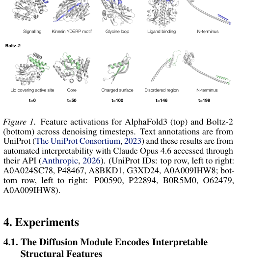
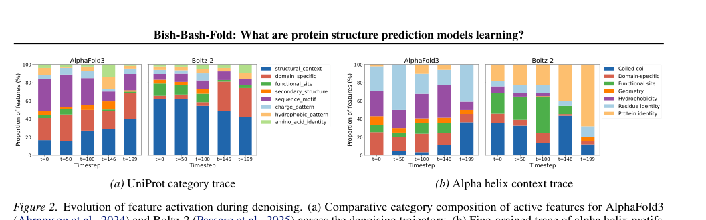
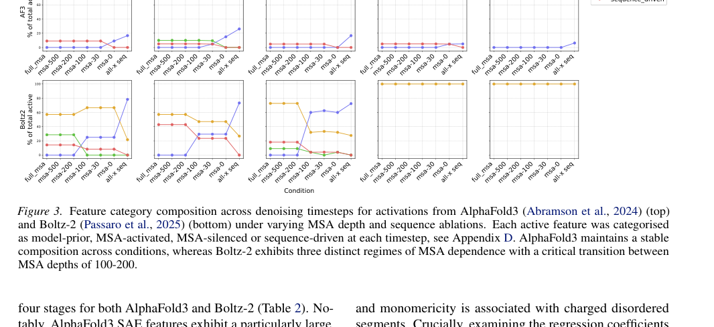
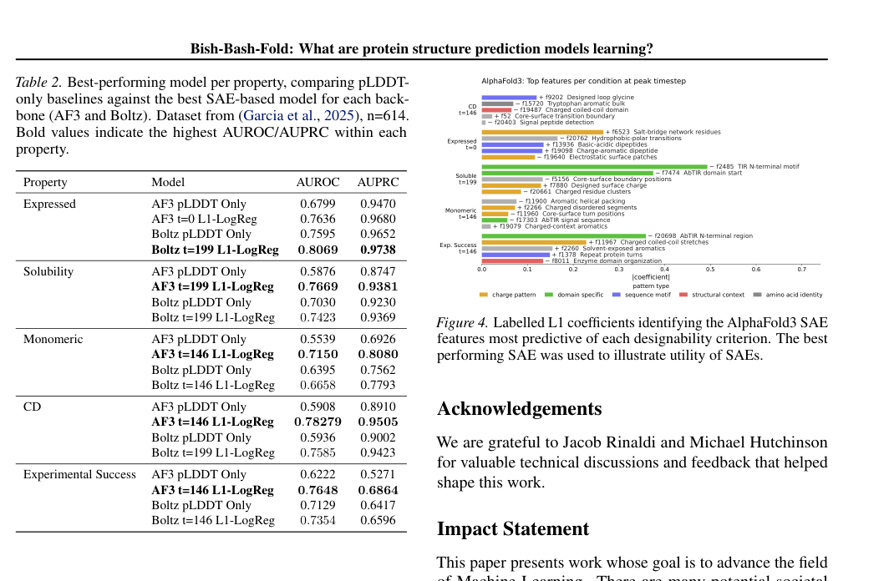

# Bish-Bash-Fold:  What are protein structure prediction models learning?

### Link: [full article](https://openreview.net/forum?id=ogUnDI1Qqp)

Authors: Soo-Jeong Kim, Carlos Vonessen, Robert D Finn

ICML 2026 Workshop on Generative and Agentic AI for Biology, 2026

---
AlphaFold3 and Boltz-2 perform remarkably well at protein structure prediction, but what is actually happening inside their diffusion modules? A set of conditioning signals goes in and 3D coordinates come out. Over the 200 denoising steps in between, what is going on in the model's "mind"?

A team from the University of Cambridge and EMBL-EBI used **sparse autoencoders (SAEs)** to open up this black box. Their findings: the diffusion module internally encodes a rich set of interpretable biological features; **although AF3 and Boltz-2 have similar architectures, they follow entirely different denoising paths**; AF3 carries a stronger "model prior" and keeps running even when its input signals are corrupted, which may point to a form of hallucination; and, most importantly, **these internal features predict the experimental success or failure of de novo proteins more accurately than pLDDT**.

*This is the second installment of our series on opening up the black box of protein-folding AI. Last time we covered InterPLM, which used SAEs to dissect the internal features of the protein language model ESM-2. This time we go one step further, into the very core of structure prediction models: the diffusion module.*

## Part 1: Research Question

Today's strongest protein structure prediction models (AlphaFold3, Boltz-2, Chai-1) share a **two-stage architecture**:

**Stage 1: Trunk / Pairformer**

It processes the input sequence and MSA (multiple sequence alignment), extracts coevolutionary signals, and produces the single representation and the pair representation. This stage is about "understanding the structural information contained in the protein sequence".

**Stage 2: Diffusion Module**

Conditioned on the upstream single/pair representations, it starts from random noise and denoises step by step over hundreds of steps, finally outputting 3D atomic coordinates. This stage is about "turning an abstract understanding of the sequence into a concrete spatial structure".

For natural proteins this system works very well, because deep MSAs let the model infer residue contacts accurately from coevolutionary signals. For **de novo designed proteins**, however, a problem arises:

Designed proteins are artificial and entirely new. They have no evolutionary history and therefore lack MSA/coevolutionary signals. This pushes designed proteins into the "failure regime" of structure prediction models. The model may still produce a plausible-looking structure with high confidence while the structure actually suffers from all kinds of problems: wrong chirality, steric clashes, or regions that should be disordered being "forced into alpha helices".

Worse still, **the diffusion module keeps "rationalizing" the weak signal passed down from the upstream Pairformer**. It carries on denoising and generating a structure as if nothing were wrong. Common confidence metrics such as pLDDT may fail to catch this kind of "confidently wrong" behavior.

This is the paper's entry point: **at each denoising timestep, how do the diffusion module's internal representations evolve? How much do they depend on the input evidence (MSA, sequence)? When the evidence degrades, does the model "honestly lower its confidence", or does it "keep forcing a fold based on its prior"?**

## Part 2: Methodology: SAEs + input ablation

### 2.1 Sparse autoencoders (SAEs): decoding the internal language of the diffusion module

Before getting into the method, let us revisit a key concept: **superposition**.

A neural network's hidden dimensions are limited (for example, the hidden dim of AF3's diffusion transformer), yet the model needs to represent far more concepts than it has dimensions. What does it do? It encodes multiple concepts "superimposed" on the same set of neurons, so that each neuron takes part in representing several concepts at once. This makes the activation of any single neuron hard to interpret.

What an SAE does is **pull these superimposed signals apart**. It projects the original dense activations into a **sparse space of much higher dimension than the original**, so that each latent feature corresponds, as far as possible, to a single clear concept.

**How a TopK SAE works**

Given an input activation vector **x** (the hidden state of a residue at a given layer of the diffusion transformer):

1\. **Encoding**: the encoder projects x into the high-dimensional space, and only the k dimensions with the largest activations are kept (the TopK operation), with the rest set to zero. This guarantees sparsity: each residue is described by only a handful of features.

2\. **Decoding**: the decoder maps the sparse latent vector back to the original space, giving a reconstructed activation.

3\. **Training objective**: minimize the reconstruction error (MSE), with an auxiliary loss that keeps features from "dying" (never activating).

In the previous article of this series, InterPLM applied SAEs to the hidden representations of the protein language model ESM-2 and successfully isolated features corresponding to biological concepts such as binding sites, structural motifs, and PTM sites. The goal of this paper is more ambitious: **applying SAEs to the diffusion module of a structure prediction model**.

Why is this harder? Because the diffusion module's activations are not a single "snapshot" as in a PLM. They change with the timestep: across the whole denoising trajectory from noise to structure, the internal representations keep evolving.

### 2.2 Experimental setup

**Extraction point**

Activations from layer 24 (the last layer) of the AF3 and Boltz-2 diffusion transformers, taken before the final LayerNorm. This is the position closest to the final coordinate output and where information is most condensed; you can think of it as "the model's last thought before it commits to a structure".

**Timestep selection**

Five timesteps were chosen along the denoising trajectory: **t = 0, 50, 100, 146, 199**, covering stages from high noise to low noise (from nearly pure noise to close to the final structure).

An independent SAE was trained for each model at each timestep, **10 SAEs** in total (2 models x 5 timesteps).

**Training data**

Single-domain proteins from UniProt, strictly restricted to those with exactly one Pfam annotation (to make feature meanings easier to interpret). In total, **55,000 sequences, about 10 million tokens**.

Why restrict to single domains? Because the features of multi-domain proteins are more complex and harder to interpret. Validating the method on a simple system first is a reasonable starting point.

**Evaluation metrics**

1\. **Explained Variance (EV)**: measures how well the SAE recovers the original activations. AF3's EV lies between 0.88 and 0.95; Boltz-2's is even higher, at 0.96–0.99.

2\. **Dead features**: the fraction of features that never activate. Both models are close to 0, indicating high dictionary utilization.

3\. **Linear probe accuracy**: SAE features are used for linear classification of four known biological labels: HELIX, STRAND, DISULFID, and ZN_FING. The classification accuracy of SAE features is **consistently higher than PCA of matched dimensionality**, suggesting that SAEs learn more "conceptual" representations.

### 2.3 Input ablation: separating "evidence" from "prior"

Are the features extracted by the SAE driven by the "input signal", or are they prior knowledge the model "brings with it"? To answer this, the authors designed a **systematic set of input ablation experiments**: they progressively stripped the model of input information and observed which features disappeared and which remained.

**Ablation ladder (from most to least informative)**

Full MSA (raw depth of about 1000 sequences)

→ MSA 500 → MSA 200 → MSA 100 → MSA 30

→ MSA 0 (only the single query sequence remains, with no coevolutionary information)

→ **all-X sequence** (the whole sequence replaced by the unknown amino acid X, removing even the sequence identity)

The elegance of this design is that it separates two sources of information:

Reducing MSA depth (Full → 0) progressively strips away **coevolutionary information**. If a feature disappears as the MSA gets shallower, it depends on the coevolutionary signal.

All-X replacement, on top of removing coevolutionary information, further strips away **sequence identity information**. If a feature is still present at MSA = 0 but disappears after all-X, it depends on the sequence itself (rather than on coevolution).

### 2.4 A four-category framework for features

Based on the ablation results, the authors sorted SAE features into four categories. This classification framework is one of the paper's **most important methodological contributions**:

**1\. MSA-activated (driven by coevolution)**

Active when an MSA is present and gone once the MSA is removed. These features genuinely depend on coevolutionary information; they represent structural constraints the model has learned from the MSA.

**2\. MSA-silenced ("suppressed" by coevolution)**

Inactive when a deep MSA is present, and appearing only once both the MSA and the sequence are removed. These features may be the model's "default prior" or compensatory patterns: suppressed when input information is plentiful and switched on only when information is scarce.

**3\. Sequence-driven (driven by sequence identity)**

Unaffected by MSA depth (unchanged as the MSA drops from 1000 to 0), but gone after all-X replacement. These features rely on the amino acid composition of the sequence itself and have nothing to do with coevolution.

**4\. Model-prior**

Active under all conditions, including all-X. Even when the model receives the worst possible input, essentially "I have no idea what protein this is", these features are still expressed. They reflect the **intrinsic structural priors** the model learned during training, entirely independent of the current input.

This four-way split turns the vague question of "does the model rely on its input or on its prior" into a quantifiable, comparable classification. Now let us look at the results.

## Part 3: Key Figure Analysis

### Figure 1: The diffusion module really does encode interpretable biological features

{: width="552" height="524" loading="lazy" decoding="async"}

*Figure 1. Feature activations for AF3 (top row) and Boltz-2 (bottom row) across denoising timesteps (t=0 → t=199). Colored regions mark where SAE features activate; the text labels were generated automatically by an LLM.*

**How to read this figure**

Each column corresponds to one denoising timestep (from high noise at t=0 to low noise at t=199). The colored regions on each protein structure are where an SAE feature activates at that residue.

Features extracted from **AF3** include: a signaling-related region (Signalling), the kinesin YDERP motif (Kinesin YDERP motif), a glycine loop (Glycine loop), a ligand-binding site (Ligand binding), and the N-terminal region.

Features extracted from **Boltz-2** include: a "lid" structure covering the active site (Lid covering active site), the hydrophobic core (Core), a charged surface (Charged surface), a disordered region (Disordered region), and the N-terminal region.

These features have clear, verifiable biological meaning, showing that during denoising the diffusion module really does encode rich structural, biochemical, and functional information about the protein. Although AF3 and Boltz-2 were trained independently, they converge on similar feature representations at t=199 (close to the final output), which hints that the structure prediction task itself exerts a kind of "convergence pressure" on the models.

The automated interpretation of SAE features was performed by Claude Opus 4.6 (which inferred the corresponding biological concept by examining in which proteins and at which positions each feature fires most strongly). The authors validated this quantitatively with UniProt annotations: the linear classification accuracy of SAE features on the four labels HELIX, STRAND, DISULFID, and ZN_FING is **consistently higher than PCA of matched dimensionality**.

### Figure 2: AF3 and Boltz-2 follow different denoising "lines of thought"

{: width="1056" height="330" loading="lazy" decoding="async"}

*Figure 2. Evolution of feature composition during denoising. (a) Changes in the share of the eight UniProt categories at each timestep. (b) Using the alpha helix as an example, a trace of how the fine-grained features making up the alpha-helix representation change across timesteps.*

This figure reveals one of the paper's most interesting findings: **although AF3 and Boltz-2 have similar architectures, their denoising strategies are strikingly different.**

**AlphaFold3: bottom-up resolution from local to global**

* **Panel (a)** shows that AF3's category composition stays relatively balanced throughout denoising. Structural-context features rise steadily over time, while sequence-motif features are more prominent early on. This indicates that AF3 starts from local sequence/physicochemical information and then gradually brings in higher-level structural context.
* **Panel (b)** traces the concrete example of the alpha helix: AF3 first uses residue identity and hydrophobicity features, then functional-site features rise, and finally coiled-coil / tertiary structural context features increase sharply at t=199. The whole process looks like step-by-step construction.

**Boltz-2: locking in protein identity early**

* **Panel (a)** shows that Boltz-2's structural-context features actually decrease over time, and the later stages are dominated by domain-specific and protein-identity features. This indicates that Boltz-2 "decides" earlier which domain/family the input protein belongs to, and then drives structure generation around that identity.
* **Panel (b)** shows that Boltz-2 uses coiled-coil, functional-site, and protein-identity features heavily from the very start, while residue identity and hydrophobicity play only a marginal role throughout.

An analogy: **AF3 is like an engineer who assembles from individual parts**, first identifying each part's material and size and then fitting them into the overall frame step by step; **Boltz-2 is like an engineer who reads the manual first**, first establishing "which model am I building" and then following the template. Each strategy has its pros and cons, but for de novo proteins the latter may be more fragile: what if the "manual" (the domain identity) does not exist?

### Figure 3: Input ablation reveals the distribution of the four feature categories

{: width="1066" height="490" loading="lazy" decoding="async"}

*Figure 3. Feature category composition for AF3 (top row) and Boltz-2 (bottom row) under different MSA depths and sequence ablation conditions. The four columns correspond to t=0, t=50, t=100, t=146, and t=199. The four colors correspond to model-prior (blue), MSA-activated (orange), MSA-silenced (green), and sequence-driven (red).*

This is the paper's core results figure, and it is dense with information. There are two key things to look at:

**Finding 1: AF3 has a stronger model prior**

For AF3 (top row), the feature category composition barely changes across input conditions. Whether the MSA depth drops from 1000 to 0, or the sequence is even replaced with all-X, the blue model-prior features always make up a high proportion.

This shows that **AF3's diffusion module is not very sensitive to changes in input evidence**: it has a powerful set of internal priors and keeps advancing some kind of structured representation no matter how impoverished the input.

**Finding 2: Boltz-2 has three clear regimes of MSA dependence**

Boltz-2 (bottom row) is much more sensitive to input changes. The authors identify three regimes:

* **Deep MSA** (MSA ≥ 200): one stable feature pattern
* **Shallow MSA** (0 &lt; MSA &lt; 200): the feature composition starts to change noticeably
* **Information-free** (all-X): a switch to an entirely different pattern

**Finding 3: MSA information is integrated mainly at early timesteps**

This holds for both models: the MSA has a more visible effect at t = 0–100, while dependence on the MSA is weaker at t = 146 and 199. In other words, **coevolutionary information is integrated mainly early in denoising, and the later steps mostly continue generating on top of the representations already in place**.

Another phenomenon is worth noting: sequence-motif features account for a large share in Figure 2a, yet very few features are classified as sequence-driven in Figure 3. This means that many features that "appear to express sequence/motif concepts" keep firing even after the input has been destroyed: their expression has become "decoupled" from input quality. The authors speculate that this may be **a manifestation of hallucination**: the denoiser seems to keep folding based on an internal picture that "assumes the input is valid", even when the actual input no longer carries any information.

### Figure 4 + Table 2 · Internal features predict experimental success better than pLDDT

{: width="1064" height="696" loading="lazy" decoding="async"}

*Figure 4 (right) + Table 2 (left). Left: AUROC/AUPRC of SAE feature probes vs pLDDT for predicting the experimental outcomes of designed proteins. Right: the SAE features with the largest/smallest logistic regression coefficients, revealing which internal representations drive the prediction of experimental success.*

This is the paper's most striking result on the application side. Using the de novo protein dataset of Garcia et al. (2025) (614 designed proteins), the authors predicted four experimental readouts: expression, solubility, monomericity, and circular dichroism (CD), as well as overall experimental success.

The method is simple: train an **L1-regularized logistic regression** on mean-pooled SAE features, with a pLDDT-only baseline for comparison. The results are very clear:

| Experimental readout | AF3 pLDDT | AF3 SAE | Boltz-2 pLDDT | Boltz-2 SAE |
|---|---|---|---|---|
| Expression | 0.680 | **0.764** | 0.760 | **0.807** |
| Solubility | 0.588 | **0.767** | 0.703 | **0.742** |
| Monomericity | 0.554 | **0.715** | 0.640 | **0.666** |
| Circular dichroism | 0.591 | **0.783** | 0.594 | **0.759** |
| Overall success | 0.622 | **0.765** | 0.713 | **0.735** |

*AUROC values; bold red marks where SAE outperforms pLDDT. Source: Table 2.*

**SAE feature probes outperform pLDDT on every readout and for both models.** The gains are especially large for AF3: the AUROC for solubility jumps from 0.588 to 0.767, and for circular dichroism from 0.591 to 0.783.

Why are internal features more useful than pLDDT? The intuition is actually quite simple: **pLDDT is the model's self-assessment of whether the predicted structure is correct, so it focuses on geometric accuracy**. But whether a protein expresses, stays soluble, and folds correctly in the lab depends on far more than geometric accuracy, including surface charge distribution, the packing quality of the hydrophobic core, interface features, and more. This information may well be encoded in the model's internal representations, yet pLDDT does not reflect it.

Figure 4 further reveals which specific SAE features drive these predictions:

**Circular dichroism (CD, reflecting correct folding)**

Positively associated: **core-surface boundary** (core-to-surface transition), designed-loop features

Negatively associated: **bulky aromatics** (bulky aromatic residues)

**Expression**

Positively associated: **salt-bridge network residues**

Negatively associated: **localized electrostatic patches** and signal-peptide detection features

**Solubility**

Driven mainly by **surface charge** and an **N-terminal motif**, consistent with rules of thumb.

**Overall experimental success**

Strongly associated with **charged coiled-coils**, **solvent-exposed aromatics** (solvent-exposed aromatic residues), and **repeat-protein turns**.

These design heuristics that "emerge" from the regression coefficients agree closely with the rules of thumb of protein engineering. Structure prediction models have **implicitly learned some practical rules of protein design**; it is just that these rules have never been exposed through the standard outputs (pLDDT, predicted structures).

## Part 4: Key Contributions

**Finding 1: The diffusion module encodes rich, interpretable biological features**

From the activations of the diffusion transformer, SAEs extract features corresponding to well-defined concepts such as residue charge, secondary structure, functional sites, ligand binding, motifs, disordered regions, and core/surface boundaries. What the diffusion module does internally during denoising is far more complex than "adding noise to and removing noise from coordinates".

**Finding 2: AF3 and Boltz-2 have strikingly different denoising strategies**

**AF3 is bottom-up**: it starts from local amino acid physicochemical properties and progressively embeds them into higher-level structural context.

**Boltz-2 is identity-first**: it settles the protein/domain identity earlier and drives structure generation around that known identity.

**Finding 3: AF3 has a stronger model prior and may be at risk of hallucination**

Even when the input signal is heavily weakened or wiped out entirely, most of AF3's features keep being expressed. Boltz-2 is more sensitive to input changes.

AF3's strong prior is a double-edged sword: it can still produce organized representations under weak-MSA conditions (an advantage), but it may also "confidently produce wrong structures" when evidence is insufficient (a risk). The authors cautiously note that the evidence here is at the level of feature expression: persistent feature expression means the model keeps running, but whether the final structure is correct still needs to be checked with metrics such as RMSD and PoseBusters.

**Finding 4: Internal features predict the experimental success of de novo proteins better than pLDDT**

They win across the board on all five readouts: expression, solubility, monomericity, CD, and overall success rate. This shows that the model's internal representations contain designability information that the standard outputs do not expose, and that pLDDT misses a large amount of valuable signal.

**Finding 5: Sensible protein design heuristics can be recovered from the regression coefficients**

Core-surface boundaries correlate positively with folding quality, surface charge with solubility, and salt-bridge networks with expression. These agree closely with the rules of thumb of protein engineering, indicating that structure prediction models have internally "learned" these rules.

## Part 5: Limitations and Outlook

### Three implications for protein design

**1. The limitations of pLDDT as a proxy for designability are now clear.** If you run a screening pipeline for de novo protein design, looking only at pLDDT/self-consistency is not enough. The model internally "knows" things that pLDDT does not expose: surface charge distribution, core-surface transitions, the packing quality of aromatic residues, and so on. This information can be extracted through SAE features and used as a more comprehensive screening metric.

**2. The behavioral differences between AF3 and Boltz-2 have practical implications.** AF3's strong prior means that it will still "confidently" output structures for de novo proteins (with no MSA). That is not necessarily bad; its internal features are in fact more predictive of experimental success. But it also means you should treat its outputs with more caution. Boltz-2 is more sensitive to its input and may be more reliable when an MSA is available, but its internal representations shift more under de novo conditions.

**3. The most exciting future direction is "design steering".** If we can use these internal features as optimization targets, boosting positive designability features and penalizing negative ones, it may become possible to optimize designs directly on the internal representations of structure prediction models instead of relying only on pLDDT at the output end. This could be more efficient and more targeted than current self-consistency or MPNN redesign pipelines.

### Limitations to keep in mind

This is a pioneering piece of work, and quite a few limitations remain to be addressed:

The scope of the analysis is limited: only 5 timesteps, one transformer layer, and single-domain proteins. Whether the findings generalize to more complex settings such as multi-domain proteins, multi-chain complexes, and binder design remains unclear.

The automatic feature names are generated by an LLM and contain errors. These labels should be treated as heuristic interpretations rather than gold-standard biological annotations.

The prediction of designability is still correlational evidence. That SAE features predict experimental success does not mean they are causal factors. To truly use them for design steering, intervention experiments will be needed for validation.

The relationship between feature changes and final structure quality (RMSD, steric clashes, chirality errors) has not been systematically evaluated. This is the most critical missing link in moving from "interpretability" to "failure diagnosis".

## About the Corresponding Authors

Robert D. Finn is a group leader and team leader at the European Molecular Biology Laboratory's European Bioinformatics Institute (EMBL-EBI), where he leads the Protein Function Development team. He is one of the defining figures in protein bioinformatics and has long been responsible for maintaining and developing Pfam (the protein families database) and InterPro (an integrated platform for protein function annotation), two of the most widely used protein annotation databases in the world. Professor Finn received his PhD from Washington University in St. Louis, and his research spans protein function annotation, comparative genomics, and the development of sequence analysis methods. In recent years his team has been actively bringing AI/ML methods into protein annotation workflows, and this paper is the latest result in that direction: using interpretability tools to turn the tables and understand what AI protein structure prediction models have learned. The paper's first and corresponding author, Soo-Jeong Kim, is affiliated with the University of Cambridge and EMBL-EBI and was responsible for the design and execution of this study.

## Citation

Kim, S. J., Vonessen, C., & Finn, R. D. (2026). Bish-Bash-Fold:  What are protein structure prediction models learning?. ICML 2026 Workshop on Generative and Agentic AI for Biology. https://openreview.net/forum?id=ogUnDI1Qqp
