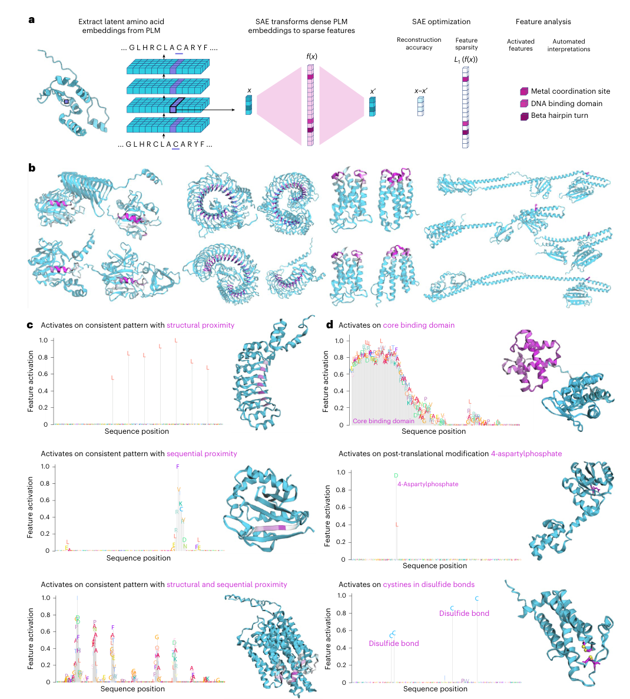
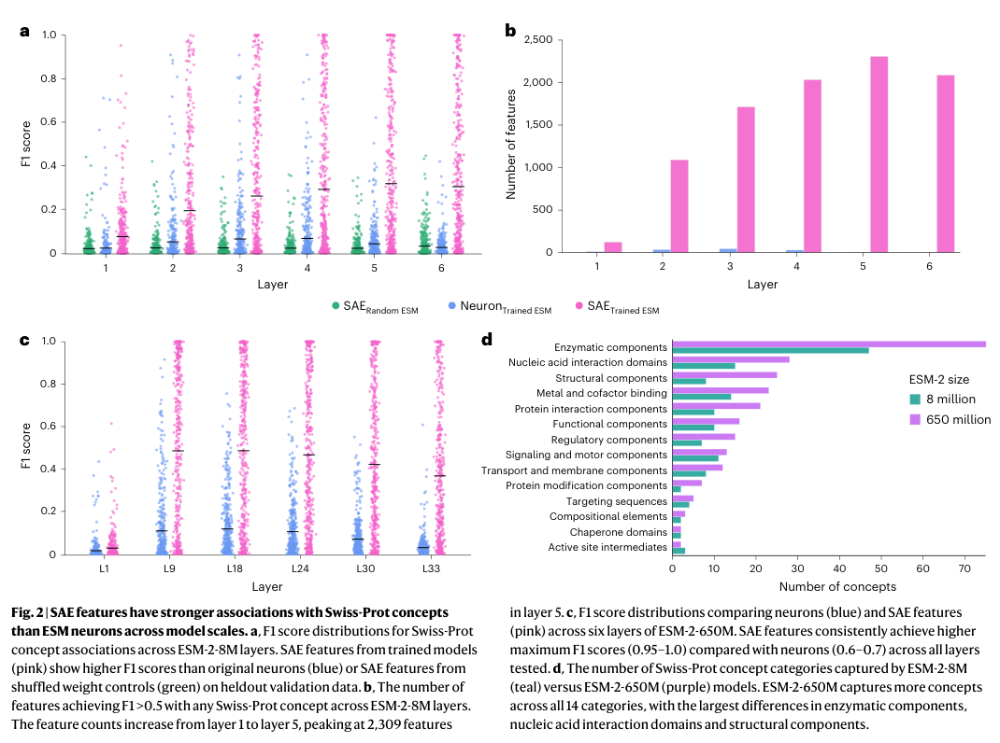
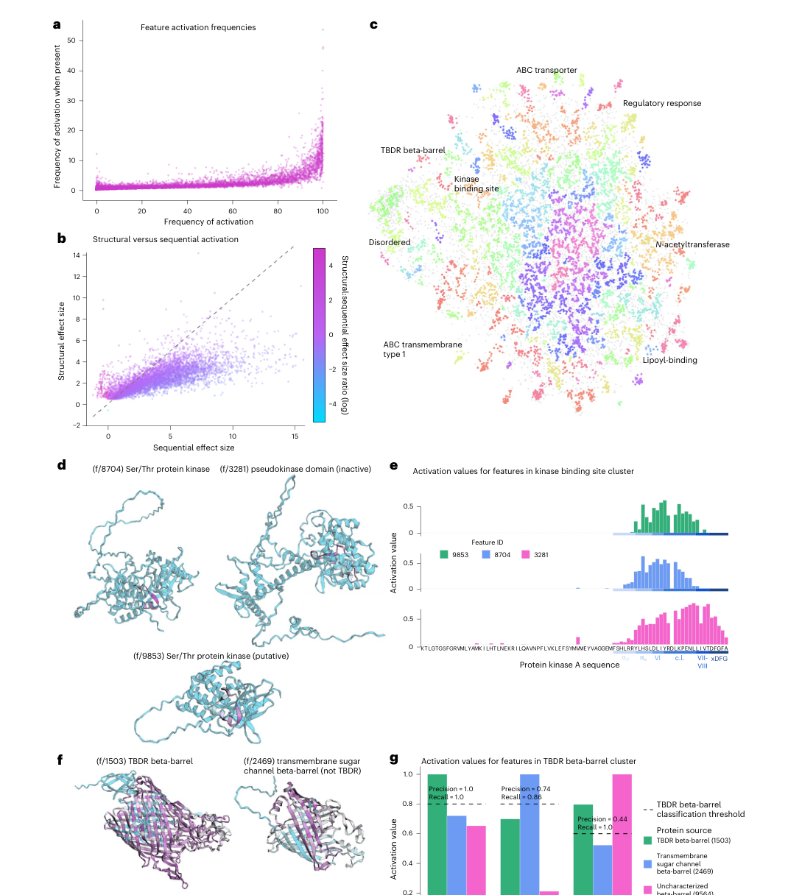
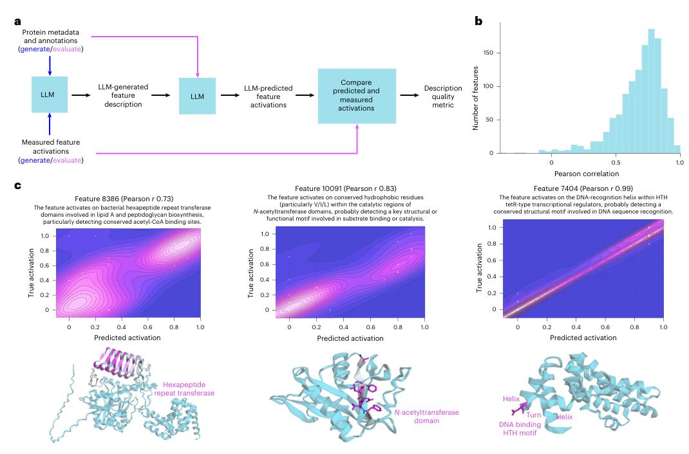
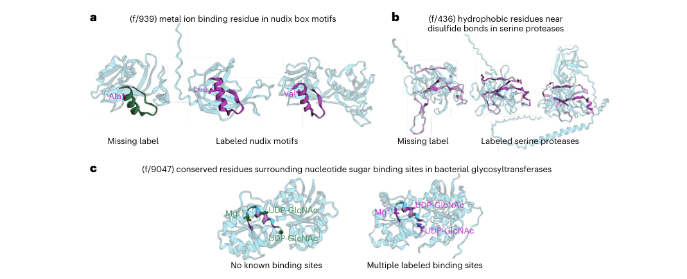
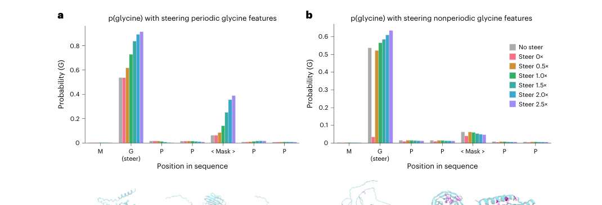

# InterPLM: discovering interpretable features in protein language models via sparse autoencoders

### Link: [full article](https://doi.org/10.1038/s41592-025-02836-7)

Authors: Elana Simon, James Zou

Nature Methods, October 2025

---
Protein language models (PLMs) have achieved remarkable success in protein modeling and design, but what have they actually learned internally? What biological concept does a single neuron represent? These questions have long lacked a systematic answer.

Elana Simon and James Zou at Stanford propose the **InterPLM** framework: they use **sparse autoencoders (SAEs)** to decompose the internal representations of ESM-2 and discover thousands of interpretable biological features, ranging from binding sites and structural motifs to functional domains and post-translational modifications. They further show that these features can be used not only to **uncover missing annotations in databases**, but also to **causally control the model's sequence predictions**.

## Part 1: Research Question

Protein language models such as ESM-2 can predict protein structure, annotate function and assess mutational effects starting from sequence alone. Their success implies that, during training, these models must have learned a great deal about the physicochemical and evolutionary rules governing proteins. Yet one fundamental question has always remained:

**What do the internal representations of a PLM actually look like? How does it store and organize biological knowledge?**

Answering this question matters in several ways: understanding a model's internal mechanisms helps us identify spurious correlations and systematic biases, assess how reliable its predictions are, and perhaps even work backwards from the model to discover biological rules that humans have not yet recognized. Earlier interpretability work followed two main routes:

**Attention analysis**

This approach inspects the weight distributions of attention heads and has found that some heads capture patterns such as spatial contacts between residues and coevolutionary couplings. But attention weights are only an indirect measure of 'how much attention is paid'; they cannot answer concrete questions such as 'which internal variable does the model use to represent a zinc finger domain?'

**Probing**

Here one trains a linear classifier on the embeddings of a given layer to see whether it can predict secondary structure, contact maps or functional labels. If it can, the relevant information is said to 'exist' in that layer. But probing is only an existence test: it cannot tell you **which specific internal feature carries** that knowledge, nor can it distinguish 'information the model actively uses' from 'information that merely sits passively in the representation'.

The most intuitive idea is: **can we just look at individual neurons?** If neuron 42 of a PLM happened to fire on every zinc finger domain residue and stay silent everywhere else, we could say that 'neuron 42 encodes zinc fingers'. This 'one neuron = one concept' correspondence is the ideal state of interpretability.

However, research in NLP has long revealed an important phenomenon: **individual neurons in large language models are usually 'polysemantic'**, meaning the same neuron may respond to several completely unrelated concepts. This happens because the number of concepts a model needs to represent far exceeds the number of neurons, so the model is forced to encode multiple concepts **in superposition** within the same set of neurons.

The core idea of this paper is therefore: **if concepts are stored in superposition, we need a way to 'unmix' them**. In NLP, sparse autoencoders (SAEs) have already proven effective at this kind of decomposition. Can the same approach work for protein language models? And do the features that an SAE extracts genuinely correspond to recognizable biological concepts?

## Part 2: Methodology: How sparse autoencoders decompose protein representations

InterPLM's method comes from **mechanistic interpretability** research in NLP. Let us build an intuition for how it works.

**Analogy: splitting white light with a prism**

Imagine that each residue embedding in a PLM is a beam of 'white light': it contains everything about that residue (its structural role, functional annotations, evolutionary conservation and so on), but all of this information is blended together and cannot be told apart by eye. An SAE acts like a prism, splitting the white light into 'pure colors' of different wavelengths. Ideally, each pure color (an SAE feature) corresponds to one well-defined biological concept. Moreover, for any given residue only a few of these colors are lit (the sparsity constraint) while the rest stay dark, which makes interpretation simple.

**The mathematical form of an SAE**

For an input vector **x** (the hidden embedding of a residue at layer k of ESM-2), the SAE learns a dictionary:

**x ≈ b + Σ fi(x) · di**

Here **fi(x)** is the activation of feature i (a non-negative scalar), **di** is the corresponding dictionary vector (a direction), and **b** is a bias. The training objective has two parts: **reconstruction accuracy** (the SAE output should recover the original embedding as closely as possible) and **sparsity** (L1 regularization forces most fi to zero).

The key design choice is an **overcomplete dictionary**: the SAE has far more features than the original embedding has dimensions. ESM-2-8M embeddings are 320-dimensional, and the SAE expands them to 10,420 features (32×). This gives the SAE a much larger 'vocabulary' for describing each residue, yet because of the sparsity constraint only a handful of 'words' can be used at a time, so the representation does not become redundant.

**Training setup**

* **ESM-2-8M** (6 layers, with an SAE trained on every layer): 320 dimensions → 10,420 features, 32× expansion
* **ESM-2-650M** (6 of its 33 layers analyzed): 1,280 dimensions → 10,420 features, 8× expansion
* Training data: **5 million protein sequences** randomly sampled from UniRef50, with hidden states extracted for all residues (excluding &lt;cls> and &lt;eos>)
* 20 hyperparameter configurations trained per layer, with the best model selected jointly on reconstruction quality and biological interpretability metrics

**How to tell whether a feature is 'interpretable': domain-adjusted F1**

On 50,000 Swiss-Prot proteins, the authors used **433 known biological concepts** (domains, binding sites, active sites, motifs, PTMs, targeting sequences, disorder and more) as ground truth, converted each concept into residue-level binary labels, and then computed how well each SAE feature matches each concept.

There is a subtle methodological point here. Conventional residue-level precision and recall badly underestimate the value of SAE features. For example, a tyrosine recombinase domain can be hundreds of residues long, while an SAE feature fires on only 2 highly conserved catalytic residues within it. Measured by residue-level recall, that feature scores only 0.011; in reality, it successfully identifies every single domain, simply by capturing the two most critical positions instead of the entire region.

The authors therefore propose **domain-adjusted recall**: the unit for computing recall changes from residues to domain instances, so a domain counts toward recall as long as at least one of its residues is hit by the feature. Under this metric, the recall of the feature above becomes 1.0, which accurately reflects its detection ability.

## Part 3: Key Figure Analysis

### Figure 1: SAE overview and representative features

**What this figure asks:** What does the InterPLM workflow look like, and what do the features extracted by the SAE look like?

{: width="1070" height="1186" loading="lazy" decoding="async"}

*Figure 1. (a) The SAE processing pipeline. (b) Consistent activation patterns of four representative features across different proteins. (c) Three types of activation pattern: structural neighbors, sequential neighbors, and both. (d) Example features that correspond strongly to Swiss-Prot annotations.*

**How to read this figure**

* **Panel a** shows the full technical pipeline: protein sequences are fed into ESM-2, the hidden embedding of each residue (a dense vector x) is extracted, and the SAE decomposes it into a sparse feature activation vector f(x) (mostly zeros, with a few active entries), while jointly optimizing reconstruction accuracy (x' approximates x) and sparsity (L1 regularization). On the right, the decomposed features map onto concrete biological concepts such as metal coordination sites, DNA-binding domains and beta-hairpin turns.
* **Panel b** is the most intuitive illustration: the same SAE feature (for example f/1854) activates on multiple proteins from different protein families, and the residues highlighted in pink occupy similar positions and roles in the 3D structures. This cross-protein consistency indicates that SAE features capture genuine biological regularities rather than a memorized bias toward a particular protein family.
* **Panel c** reveals three types of activation pattern, a finding that is valuable in its own right:
  * **Structural-neighbor type**: residues that are close in 3D space but may lie far apart in sequence activate together. For example, the residues of a binding site may be scattered across the sequence yet cluster together in space once the protein folds.
  * **Sequential-neighbor type**: contiguous stretches of sequence activate, corresponding to linear elements such as short motifs and beta strands.
  * **Combined type**: features that cluster in both sequence and structure, such as turn regions in alpha-helical bundles. The existence of such features is strong evidence that PLMs encode 3D structural information well beyond linear sequence patterns.

### Figure 2: SAE features vs raw neurons: a quantitative comparison

**What this figure asks:** How much more interpretable are SAE features than raw neurons? This is the most important quantitative result of the paper.

{: width="1070" height="796" loading="lazy" decoding="async"}

*Figure 2. (a) Distribution of F1 scores across the layers of ESM-2-8M. (b) Number of features with strong concept associations per layer. (c) F1 comparison for ESM-2-650M. (d) Concept coverage across 14 functional categories for the two model sizes.*

**Key data and interpretation**

* **Panel a** is the key comparison. The three colors represent three groups: pink is SAE features on the trained model, blue is raw neurons of the trained model, and green is SAE features on a model with random weights (the negative control). The result is very clear: **SAE features have far higher F1 scores than raw neurons**, while the random baseline is close to zero. The green control matters because it proves that complex biological features are not something the SAE 'cobbles together' from the input data distribution; they depend on knowledge learned by the trained model.
* **Panel b** shows the order-of-magnitude gap: in ESM-2-8M, up to **2,309 SAE features per layer** are strongly associated with a concept, whereas raw neurons reach at most about 46 per layer. SAEs identify **143 distinct Swiss-Prot concepts**, while neurons cover only about 15. This 50-fold gap directly demonstrates how pervasive superposition is in PLMs.
* **Panel c** repeats the same experiment on ESM-2-650M. SAEs still clearly outperform neurons, and the top F1 scores of SAE features reach 0.95–1.0, meaning that some features correspond almost perfectly to Swiss-Prot annotations.
* **Panel d** reveals an important pattern: ESM-2-650M captures more concepts than 8M in all 14 functional categories (**427** in total vs 143, more than 1.7×). The largest gaps are in enzymatic activity components, nucleic acid interaction domains and structural components. Yet even in the larger model, **neurons remain polysemantic**: scaling up increases the capacity for superposition so that more concepts can be packed in, but individual neurons do not become any 'purer'.

### Figure 3: Feature activation patterns and functional clusters

**What this figure asks:** Is there an organized structure among these features? Do functionally related features cluster together in embedding space?

{: width="1070" height="1216" loading="lazy" decoding="async"}

*Figure 3. (a) Distribution of feature activation frequencies. (b) Scatter plot of structural vs sequential clustering. (c) UMAP embedding of feature dictionary vectors. (d–e) A kinase feature cluster. (f–g) A beta-barrel / TBDR feature cluster.*

**The large-scale organization of features**

* **Panel a** shows the distribution of activation frequencies across all features: some features fire on almost every protein (general features, such as markers of the hydrophobic core), while others appear only in a handful of protein families (specific features, such as a TBDR beta-barrel detector).
* **Panel c** (UMAP) is one of the most noteworthy panels in the figure: when the dictionary vectors of all features are projected into two dimensions, functionally related features naturally form clusters, with kinase binding sites (green region), TBDR beta-barrels (blue), ABC transporters (top) and disordered regions (bottom left) each forming a clear group. This shows that in the PLM embedding space, **biological concepts are organized into regions by functional similarity**, much like the semantic topology of word embeddings in NLP models.

**Two compelling functional clusters**

**Kinase cluster** (Panels d–e): all three features relate to kinase binding or catalytic regions, but they show a fine-grained division of labor. f/9853 prefers the conserved secondary structure elements preceding the catalytic loop; f/8704 concentrates on the catalytic loop itself; and f/3281 is more sensitive to inactive pseudokinase domains. Panel e further shows the activation values of all three on the same kinase sequence: they partly overlap in the same region, but each peaks at a different position. This reveals a **hierarchical concept representation** inside the model: the parent concept 'kinase' branches into sub-concepts such as subtypes, local structures and functional states.

**Beta-barrel / TBDR cluster** (Panels f–g): f/1503 is a precise TBDR detector (a near-perfect F1 = 0.998); f/2469 recognizes the broader class of transmembrane sugar channel beta-barrels (Precision=0.74); and f/9564 corresponds to an incompletely characterized beta-barrel structure. The three features sit next to each other in embedding space, forming a **gradient of concept specificity** from 'generic beta-barrel' to 'specific TBDR'.

### Figure 4: LLMs automatically explain protein features

**What this figure asks:** Can reliable text descriptions be generated automatically for tens of thousands of features?

{: width="1070" height="706" loading="lazy" decoding="async"}

*Figure 4. (a) The LLM annotation and validation pipeline. (b) Distribution of Pearson r across 1,240 features. (c) Three representative examples and their density plots.*

**Why automated LLM annotation is needed**

Swiss-Prot annotations cover fewer than 20% of SAE features. What about the remaining 80%? Having human experts interpret tens of thousands of features one by one is clearly infeasible. The authors designed a clever LLM pipeline (Panel a):

* **Generation stage**: Claude-3.5 Sonnet is given metadata for a batch of proteins (species, function, domain annotations) together with the feature's activation pattern on those proteins (which residues activate and how strongly), and is asked to write a text description of the feature and a one-sentence summary.
* **Validation stage**: the generated description, together with metadata for a new batch of proteins (but not their activation values), is handed to the LLM, which predicts the feature's activation strength on the new proteins from the description alone. The Pearson correlation r between predicted and true values serves as an objective measure of description quality.
* **Panel b** shows a median r of **0.72** across 1,240 features, with many features exceeding r = 0.8. This means the descriptions the LLM writes are not merely 'plausible-looking' but have real predictive power: given an unseen protein, one can roughly guess from the description where the feature will activate.

Of course, while r=0.72 is strong, it does not mean every description is semantically correct. An LLM may engage in 'post hoc rationalization', spinning a plausible-sounding story from the examples. But as a scalable solution, this kind of automated annotation greatly lowers the barrier to interpreting large feature sets.

### Figure 5: Discovering missing database annotations

**What this figure asks:** Are the 'false positives' of SAE features errors by the model, or omissions in the database?

{: width="1070" height="436" loading="lazy" decoding="async"}

*Figure 5. (a) A missing Nudix motif annotation. (b) A missing peptidase S1 domain annotation. (c) Conserved binding sites across distantly related glycosyltransferase families.*

**From 'explaining the model' to 'discovering biology'**

This is the most practically valuable part of the paper. The authors found that many proteins on which an SAE feature fires strongly, but which lack the corresponding annotation in Swiss-Prot, do in fact deserve that annotation when checked against independent databases such as InterPro. In other words, these 'false positives' are actually **genuine omissions** in the database.

* **Panel c** (glycosyltransferases) is the most impressive. Feature f/9047 spans multiple families of UDP-dependent glycosyltransferases and precisely identifies the conserved binding site architecture surrounding the nucleotide sugar and Mg²⁺. These proteins share **only 11–22% sequence identity** (traditional sequence alignment can barely relate them), yet their **structural TM-scores reach 0.74–0.78**. This means the features learned by the PLM can bridge gaps in sequence space and directly capture deep structure–function conservation, something that traditional annotation pipelines based on sequence alignment struggle to do.

This finding sends an important signal: **SAE features can become an entirely new source of functional annotation**, complementing and potentially even surpassing traditional sequence-homology methods.

### Figure 6: Causal intervention: steering sequence predictions

**What this figure asks:** Do these features genuinely take part in the model's computation? Can they causally influence the model's output?

{: width="1070" height="366" loading="lazy" decoding="async"}

*Figure 6. (a) Changes in model predictions after activating periodic glycine features. (b) Control: the effect of nonperiodic glycine features.*

**From correlation to causation**

All the preceding analyses, namely the F1 matching between features and annotations and the predictive power of the LLM descriptions, are essentially correlational evidence. A feature being highly correlated with a biological concept does not mean the model actually 'uses' it when making predictions. Answering the causal question requires intervention experiments.

The authors chose the **periodic glycine repeat pattern** in collagen (GXXGXX...) as their test case. During the ESM-2 forward pass, they forcibly clamped the activations of three 'periodic glycine features' at the first glycine position, at a given layer, to different strengths (0× to 2.5× the maximum observed value), then let the model continue its computation and observed how the probability of predicting glycine changed at each position of the sequence 'MGPP&lt;Mask>PP'.

* The results in **Panel a** are highly convincing: as the steering strength increases, not only does **the glycine probability at the directly intervened position (G) rise from ~0.55 to ~0.9**, but, more importantly, **the masked position three residues away also rises from near 0 to about 0.4**. This shows that these features encode the higher-order rule 'a periodic glycine repeat pattern is present here', and activating them strengthens the model's glycine predictions across the entire local region.
* **Panel b** is a carefully designed control: the authors applied the same intervention to the 'nonperiodic' features with the highest F1 scores for the amino acid glycine itself. Here, **only the directly intervened position is affected, and distant positions barely change**. This contrast proves that 'periodic glycine features' and 'glycine letter features' are representations at two different levels: the former is a higher-order sequence pattern, while the latter is merely the identity of a single amino acid.

## Part 4: Key Contributions

Taken together, this paper establishes a **complete research loop** that runs from decomposition to evaluation and from description to application:

**1\. It demonstrates that superposition is pervasive in PLMs**

Individual ESM-2 neurons are polysemantic, with a single neuron packing together multiple biological concepts. SAEs can split these mixed representations into purer features. Importantly, the phenomenon persists in larger models: scaling up increases concept capacity rather than improving the interpretability of individual neurons.

**2\. It proposes a systematic framework for evaluating protein features**

433 Swiss-Prot concepts + the domain-adjusted F1 metric + random-weight controls + validation across model scales + an automated LLM annotation pipeline. This framework moves the interpretability of protein features from scattered case studies to standardized evaluation that is quantifiable and comparable.

**3\. It connects interpretability research to practical biological applications**

SAE features can uncover functional annotations missing from databases (especially deep conservation across distantly related families), can causally control model predictions through steering, and are available for the community to explore through the interactive platform InterPLM.ai. Interpretability research is no longer just an academic exercise in 'understanding the model'; it can become a practical tool that feeds back into biological discovery.

## Part 5: Limitations and Outlook

The paper's chain of evidence is complete (quantitative evaluation + random controls + cross-scale validation + causal intervention), but several important open questions deserve attention:

**There is still a long way from a feature catalog to mechanistic understanding.** We now know which interpretable features exist in the model, but how are these features combined across the layers of the transformer? Which attention heads and MLP modules invoke particular features? How do features cooperate to produce a complete prediction? Moving from a feature catalog to circuit-level mechanisms is the most important next step in understanding PLMs.

**The evaluation depends on existing annotation systems.** Swiss-Prot and InterPro represent the conceptual framework that humans already know. The features that fire consistently across multiple distantly related families but currently have no matching annotation are the ones most likely to point to interesting 'new biology'. How to systematically mine these unnamed features is a key challenge for future work.

**Steering is still rudimentary.** Causal intervention has so far been validated only on a simple periodic sequence pattern. Whether steering can control more complex protein properties, such as binding specificity, solubility, thermostability and catalytic activity, is the crucial leap from 'interpreting PLMs' to 'using PLMs for interpretable protein design'.

**Larger and newer PLMs are worth exploring.** Will larger models such as ESM-3 and ProGen2, as well as multimodal sequence–structure–function models, give rise to more abstract, more function-oriented features? Is the SAE itself the best decomposition tool, or can variants such as TopK SAEs and hierarchical dictionary learning do better? All of these directions merit continued attention.

## About the Corresponding Author

The corresponding author, James Zou, is an Associate Professor in the Department of Biomedical Data Science at Stanford University, with appointments in the Departments of Computer Science and Electrical Engineering. He completed his undergraduate studies in mathematics at the University of Cambridge, then earned his PhD at Harvard University and did postdoctoral research at Microsoft Research before joining Stanford. His research spans machine learning and biomedicine, with core interests in AI interpretability, computational genomics, protein language models and AI fairness. In recent years his group has produced several important works on interpreting and applying protein language models, including the InterPLM framework described here and a widely cited PLM primer (Nat Methods 2024). The first author, Elana Simon, is a PhD student at Stanford University whose research focuses on the mechanistic interpretability of protein language models.

## Citation

Simon, E., & Zou, J. (2025). InterPLM: discovering interpretable features in protein language models via sparse autoencoders. Nature Methods, 22(10), 2107-2117. https://doi.org/10.1038/s41592-025-02836-7
