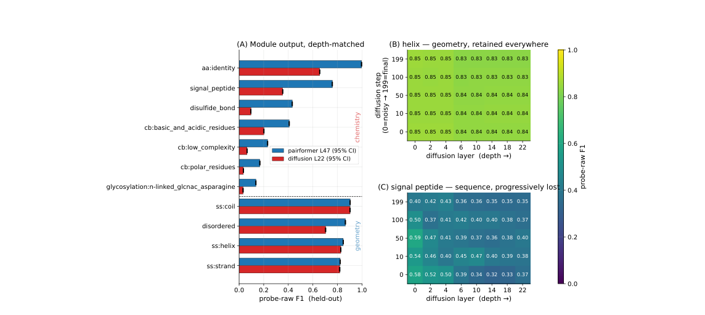
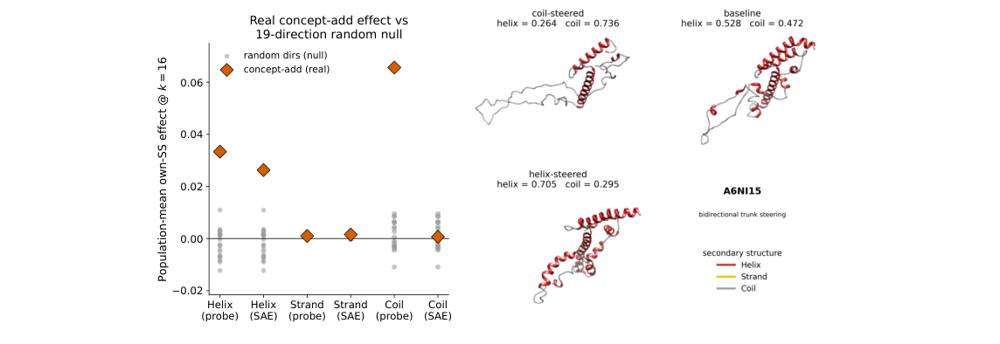

# Probing and steering biology across Boltz-1s trunk-diffusion boundary

### Link: [full article](https://doi.org/10.48550/arXiv.2608.11475)

Authors: Piotr Jedryszek, Tongmeng Xie, Adam Winnifrith, ..., Oliver M. Crook

arXiv, August 11, 2026

---
Opening the Black Box of Protein-Folding AI · Installment 4

Structure predictors in the AlphaFold3 family consist of two major modules: a **Pairformer trunk** that learns representations, and a **diffusion module** that generates atomic coordinates. But what actually happens to biological information as it crosses this architectural boundary? Which knowledge is kept, and which is thrown away?

A team from Oxford used three scalpels, linear probes, sparse autoencoders (SAEs) and causal interventions, to systematically dissect the trunk and diffusion module of the open-source model Boltz-1. They uncovered a key split: **secondary-structure information crosses the boundary intact, while sequence-chemistry information is heavily attenuated**.

An even deeper finding: steering the model along helix and coil directions changes the predicted structure in a dose-dependent way, yet a highly predictive beta-strand direction (F1=0.82) completely fails to increase strand content. **Linear decodability does not equal causal influence.** This is a wake-up call for every effort to 'read out' biological knowledge from model representations.

## Part 1: Research Question

The architecture of structure predictors such as AlphaFold3 and Boltz-1 can be divided into two stages:

**Pairformer Trunk (representation learning)**

It takes in sequence and context information (including the MSA) and, through 48 Pairformer layers, iteratively updates two representations: the per-residue **single representation s** and the residue-pair **pair representation z**. This stage is responsible for 'understanding' the protein's sequence and evolutionary information.

**Diffusion Module (coordinate generation)**

Conditioned on the trunk outputs s and z, it denoises step by step through 22 diffusion-transformer layers and finally produces 3D atomic coordinates. This stage is responsible for turning 'understanding' into 'structure'.

There is a clear architectural boundary between these two modules. The trunk output conditions the diffusion module, but the diffusion module has its own internal representation-learning process. A natural question follows:

**Is the biological information encoded by the trunk fully preserved after crossing this boundary? If it changes, what is kept and what is discarded? And is the decodable information actually 'used' by the model?**

A handful of earlier studies probed the internal representations of either the trunk or the diffusion module on its own (for example, Feldman & Skolnick analyzed AlphaFold3's Pairformer, and Lu et al. studied ESMFold with activation patching), but nobody had systematically compared the trunk with the diffusion module, nor combined decodability with causal steerability in a single test. This paper fills that gap.

## Part 2: Methodology: Three Scalpels

The authors use three complementary methods to answer these questions. Understanding how the three differ and relate to one another is the key to reading this paper.

### Method 1: Linear Probes – 'Is the information there?'

The most direct question: does the representation at a given layer of the model contain a particular piece of biological information?

**Approach**

For each biological concept (e.g., 'this residue is in a helix'), a **logistic-regression classifier** (logistic probe) is trained on the per-residue activation vectors of one model layer. If this linear classifier's F1 score is well above the random baseline, the concept is **linearly decodable** from that layer's representation.

The authors call this method **probe-raw**: a probe trained directly on the raw activations.

**Coverage**

Every second layer of the trunk's 48 layers is sampled (layers 0-47), and every second layer of the diffusion module's 22 layers is sampled as well, covering all diffusion sampling steps (steps 0-199). This yields a complete layer x step grid.

The probed concepts fall into two broad categories:

* **Geometry**: secondary structure (helix, strand, coil) and disordered regions (disorder)
* **Sequence chemistry**: amino-acid identity, signal peptides, disulfide bonds, glycosylation sites, and so on

**Evaluation details**

Evaluation uses a fixed test set of 486 proteins (21.9M residues). Probes are evaluated with 5-fold cross-validation grouped by protein (residues from the same protein never appear in both the training and test sets). F1 uses a domain-level metric (precision is computed per residue and recall per domain: a domain counts as recalled as long as at least one of its residues is hit).

Amino-acid identity serves as a **positive control**: if the probe recovers amino-acid identity perfectly (F1 ≈ 1.0), the alignment between labels and activations is confirmed to be correct.

### Method 2: Sparse Autoencoders (SAE) – 'Which features carry the information?'

A linear probe tells us whether information 'is there', but not **which specific internal features** carry it. SAEs try to answer this finer-grained question.

**The core idea of an SAE**

Each residue's activation vector is decomposed into a linear combination of a small number of 'dictionary features'. TopK sparsification (only k=256 latents active at a time, out of 2048 in total) pushes each latent to correspond as closely as possible to a single biological concept.

The SAEs are trained on **84,074 unlabeled proteins** (21.9M residues) with l2 weight regularization. The training-set mean of each dimension is subtracted, because the authors found that a few high-variance dimensions otherwise dominate learning.

**How the four readouts differ**

* **probe-raw**: a logistic probe trained on raw activations (Method 1 above)
* **probe-SAE**: a logistic probe trained on the SAE latent space
* **SAE-1feat**: the **single** SAE latent that best matches the target concept (no additional classifier is trained)
* **neuron-1feat**: the single best-matching raw neuron (a control baseline)

The relationship among these four readouts matters: probe-raw and probe-SAE are **supervised methods** that exploit label information, whereas SAE-1feat and neuron-1feat are **unsupervised methods** that only measure how well a single feature aligns with a label. The results below repeatedly compare these four readouts.

### Method 3: Causal Steering – 'Is the information used?'

Decodability is only evidence that 'the information exists'. A model may encode a feature yet never use it, much as a signal may exist in the brain without affecting behavior. Proving that information is 'used' requires a causal experiment.

**How steering works**

Take the 'concept direction' (a unit vector u) learned by a probe or an SAE decoder, and add it to the single representation s at the final trunk layer:

**s' = s + k · mean\|(x - μ) · u\| · u**

where k is the dose multiplier (1, 2, 4, 8, 16). The modified s' is then fed back through the diffusion module to generate a new structure, and one checks whether the DSSP-assigned secondary-structure fractions shift as expected.

**Key design choice**: the pair representation z is left unchanged. Steering modifies only the single representation s, which is one of the conditioning inputs to the diffusion module.

**Controls**

* **matched-norm random**: the concept direction is replaced by a random direction (with the same norm as the concept direction) to test whether the effect is specific to the concept direction
* **19-direction random null**: the same proteins are steered with 19 different random directions to build a random baseline distribution
* **ablation experiments**: the concept direction is subtracted from s (instead of added) to test whether removing it changes the structure
* **pLDDT monitoring**: confirms that the predicted confidence pLDDT stays stable after steering (about 79), showing that the intervention stays within the distribution of representations the model has learned and does not push it 'off the rails'

Data split: 389 proteins are used to fit the steering directions and 97 held-out proteins for evaluation. The training set is sampled with stratification by helix content, and the evaluation set is fixed before any steering, ensuring a fair held-out evaluation.

## Part 3: Key Figure Analysis

### Figure 1: The trunk keeps everything; the diffusion module keeps only geometry

**What this figure asks:** Which biological concepts are decodable from the output representations of the trunk and of the diffusion module? How do the two modules differ?

{: width="1144" height="512" loading="lazy" decoding="async"}

*Figure 1. (A) Depth-matched comparison: probe-raw F1 for trunk L47 vs diffusion L22. Geometric concepts score similarly in both modules, while sequence-chemistry concepts drop markedly in the diffusion module. (B) Heatmap of helix over diffusion layer x sampling step: the whole grid is bright, so geometric information is stably retained. (C) Heatmap for signal peptide: it fades progressively with depth and step.*

**How to read this figure**

* **Panel A** is the core: the horizontal axis is the held-out probe-raw F1 score, and the vertical axis lists the biological concepts. The comparison between the blue bars (trunk L47) and the red bars (diffusion L22) is immediately clear. Geometric concepts (helix, strand, coil, disorder) score almost identically in the two modules. Sequence-chemistry concepts, however, show a **systematic attenuation**: signal peptide drops from 0.76 to 0.35, disulfide bond from 0.43 to 0.10, and amino-acid identity from nearly 1.0 to 0.66.
* **Panel B** shows helix F1 across the entire layer x step grid of the diffusion module. **The whole grid is bright (about 0.83-0.85)**, meaning helix information is stably encoded from the noisiest initial step onward and is consistent across all layers. In other words, the diffusion module 'knows' from the very start which residues should be helical.
* **Panel C** offers a sharp contrast: the signal-peptide heatmap fades along both axes. The deeper the diffusion layer and the later the sampling step, the weaker the signal. This indicates that the diffusion module **progressively discards sequence-chemistry information** as it computes, because computing geometry does not require it.

### Figure 2: Steering results: helix/coil are controllable, strand fails

**What this figure asks:** Can decodable concept directions be used to steer the model's structure predictions? Which concepts can be steered and which cannot?

{: width="1144" height="394" loading="lazy" decoding="async"}

*Figure 2. Left: steering effect of each concept direction (concept-add vs 19-direction random null). Helix and coil directions (probe and SAE) are significantly above the random control; strand directions have no effect. Right: structural changes of protein A6NI15 under helix steering and coil steering, showing bidirectional control of helix and coil fractions.*

**How to read this figure**

**The scatter plot on the left** shows the population-mean steering effect over the 97 held-out proteins (k=16). Yellow diamonds are the effects of the concept directions, and grey dots form the null distribution of 19 random directions. Helix (both the probe and SAE directions work) and coil (the probe direction works) are significantly above the random control. Both strand directions (probe and SAE) are buried in the random noise.

**The protein structures on the right** give an intuitive example: at baseline, protein A6NI15 has 52.8% helix and 47.2% coil. After steering along the helix direction, helix rises to 70.5% and coil falls to 29.5%; steering along the coil direction reverses the effect, with helix dropping to 26.4% and coil rising to 73.6%. This shows that **the helix and coil directions lie on the same antiparallel axis** (cos = -0.69): pushing one end pulls the other.

## Part 4: Key Contributions

### Finding 1: The trunk is an 'all-rounder'; the diffusion module is a 'geometry specialist'

In the final trunk layer (L47), both geometric and sequence-chemistry information are highly decodable:

* **Geometry**: helix F1 = 0.79-0.90, strand F1 ≈ 0.83, coil F1 ≈ 0.86
* **Sequence chemistry**: signal peptide F1 ≈ 0.76, disulfide bond F1 ≈ 0.43, disorder F1 ≈ 0.86
* **Positive control**: amino-acid identity F1 = 0.996 (trunk output), confirming that the label-activation alignment is correct

Once inside the diffusion module (L22), the two kinds of information split dramatically:

* **Geometry is essentially unchanged**: helix, strand and coil F1 shift by no more than 0.02
* **Sequence chemistry is heavily attenuated**: signal peptide drops from 0.76 to 0.35, disulfide bond from 0.43 to 0.10, and amino-acid identity from 1.00 to 0.66

The authors' explanation is that the diffusion module computes geometry (coordinates) conditioned on the trunk's s, so it can **consume sequence-chemistry information without re-representing it**. It is like navigating with a map: your brain 'consumes' the map's information to plan a route, but no longer holds the raw details of the map in conscious awareness. As the diffusion layers deepen and denoising proceeds, the sequence-chemistry signal is gradually used up.

### Finding 2: Helix/coil can be steered, strand cannot

The steering results are even more surprising:

**Helix and Coil: controllable**

Adding the helix direction to the trunk's single representation **increases helix content in held-out proteins in a dose-dependent way**, significantly above both the matched-norm random control and the 19-direction random null. The same holds for the coil direction. pLDDT stays at about 79, indicating that the intervention does not 'break' the model: it still generates structures confidently, only with different structural content.

More interestingly, the helix and coil directions are approximately antiparallel (cos = -0.69), meaning they are encoded on the same axis. Pushing toward the helix end naturally reduces coil, and vice versa. This offers protein design a continuously tunable 'knob'.

**Strand: highly predictive but not steerable**

The strand direction is highly predictive in the trunk: probe F1 = 0.82, precision ≥ 0.93. It 'knows' precisely which residues are in a beta-strand. Yet when this highly predictive direction is used for steering, **strand content shows no measurable increase at all**. The steering effect is completely buried in random noise.

Even more puzzling: adding the strand direction instead converts helix into coil, as if the model 'heard the intervention' but responded in an entirely different way.

### The deeper meaning of 'linearly decodable ≠ causally controllable'

The strand example is the most profound finding of the paper. It exposes an easily overlooked trap: **being able to 'read out' a concept from a model's representation does not mean that intervening on that concept at the same site will change the output**.

### Why can't strand be steered? The authors' hypothesis

Understanding this result requires going back to the physical nature of beta-strands. A beta-sheet is defined by **backbone hydrogen bonds between residues that are far apart in sequence**. Such long-range pairing information is inherently pairwise, and it is encoded in the pair representation z.

In Boltz-1, information flows z → s (one-way, from pair to single). The trunk's single representation s can receive strand information from z, which is why a probe can decode strand from s. But steering modifies s, and s cannot feed back into z. When the diffusion module builds strands, it relies on the pairing information in z, so simply adding a strand direction to s **cannot reach the actual causal site of strand formation**.

**An analogy**

Picture a thermometer placed next to a window. You can 'read' the outdoor temperature from it (decodable), but heating the thermometer with a hair dryer will not change the weather outside (no causal control). The thermometer is a passive readout of the outside temperature, and its location has no causal influence. The strand signal in the single representation is like that thermometer: it can be read, but intervening on it does not affect the output.

By contrast, helix and coil are defined by **local backbone conformation**: local torsion angles and local hydrogen bonds are enough to specify them. This information can be fully carried by the single representation, so steering s directly affects the geometry generated by the diffusion module.

### Supporting evidence from ablations

The authors ran ablation experiments to further test this hypothesis. They removed the helix direction from the trunk, from the diffusion module, or from both at once, with the following results:

* Removing the helix direction from the trunk: helix content barely changes (+0.003)
* Removing it from the diffusion module: likewise barely changes (-0.001)
* Removing it from both at once: still no change (+0.001)

This shows that helix/coil geometric information is **redundantly encoded**: the trunk's single-representation direction is enough to steer (sufficiency), but after removing that direction the model can still reconstruct the geometry from other sources (non-necessity). The steering direction is a **sufficient but not necessary** causal factor.

### Methodological warnings for interpretability research

This finding yields three methodological recommendations for the whole field of ML interpretability, not just for proteins: (1) **specify the readout type**: saying 'the model represents X' is not enough; one must state which readout was used (probe, SAE, single feature?) and with which labels; (2) **restrict causal conclusions to the intervention site and method actually tested**: steering that works on s does not imply it works on z, and vice versa; (3) **control for missing labels when evaluating against sparse annotations**: otherwise false positives are systematically inflated.

### Finding 3: Sparse SwissProt annotations make all evaluation scores lower bounds

The authors also expose a widely ignored evaluation trap. When sparse experimental SwissProt annotations are used as labels, probe F1 is markedly lower than with dense, computed DSSP labels:

* **Helix**: dense DSSP F1 = 0.85 vs sparse SwissProt F1 = 0.42 (gap of 0.43)
* **Strand**: dense DSSP F1 = 0.83 vs sparse SwissProt F1 = 0.33 (gap of 0.50)

The reason is simple: SwissProt only annotates experimentally validated regions, so many genuine helix/strand residues are left unannotated. When the probe correctly predicts these unannotated residues, they are counted as **false positives**: the model is penalized for getting them right.

The authors ruled out model error with a self-consistency check: DSSP computed on Boltz-1's own predicted structures, compared with DSSP computed on AlphaFold structures, changes helix probe-raw F1 by only 0.06-0.08. The large SwissProt drop therefore reflects **incomplete annotation**, rather than model mistakes or probe failure. This means that any work evaluating model representations against sparse annotations obtains scores that are lower bounds on precision.

### Finding 4: When labels exist, supervised probes beat single SAE features across the board

Comparing the four readouts on trunk secondary structure:

* **probe-raw** beats **SAE-1feat** across the board, by 0.13-0.35 F1
* Specific numbers: helix probe 0.85 vs SAE-1feat 0.72; strand probe 0.82 vs SAE-1feat 0.47
* The same holds for steering: the coil probe direction can steer, while the best coil SAE latent cannot
* SAE-1feat sometimes beats the probe on rare concepts, but this is the **winner's curse**: best-of-many selection manufactures spuriously high scores on concepts where even the random baseline is close to zero

This does not mean SAEs are useless. The authors point out that the value of SAEs lies in **hypothesis generation**: they can surface concepts absent from existing annotation vocabularies. In a companion study, the same trunk SAEs, combined with auto-interpretability techniques, uncovered a putative zinc-coordination cluster and a kinase catalytic-histidine motif, neither of which has a corresponding SwissProt label. But once labels exist, supervised probes are consistently more reliable.

## Part 5: Limitations and Outlook

### Contributions to understanding protein AI

**1. The first systematic comparison of the information content of the trunk and the diffusion module.** Earlier work looked either only at the trunk (e.g., AlphaInterp) or only at the diffusion module (e.g., Bish-Bash-Fold). This paper is the first to compare the two modules within a single framework, revealing the split between geometry and sequence chemistry.

**2. The first to combine decodability with causal steering.** Prior work typically did only probing or only steering. This paper shows the two can disagree, which is an important methodological finding.

**3. Quantifying the effect of sparse annotations on evaluation.** The sparsity of SwissProt annotations systematically underestimates F1 by 0.4-0.5, which affects every interpretability study that benchmarks against SwissProt.

### Limitations

**1. Only one model (Boltz-1) was tested.** Whether AlphaFold3, Chai-1 and other models show the same trunk-diffusion split remains to be verified.

**2. Steering was applied only along the secondary-structure axis of the single representation.** Causal steering of sequence-chemistry concepts (signal peptide, disulfide bond) has not been attempted. Direct interventions on the pair representation z were not done either, even though that is the most natural next step after the failure of strand steering.

**3. Probe folds are grouped by protein but not clustered by sequence identity.** Close homologs may land in different folds. Although the authors checked for leakage with BLOSUM62 (only 3.3% of test proteins have a training neighbor with >30% identity), strict identity-based redundancy removal would be more conservative.

**4. Steering only 'nudges' the model's predictions; it is not protein design.** The authors state explicitly that steering changes the predicted structure and does not prove that the altered structure corresponds to a real protein that can fold. This is not a de novo design tool.

### Connections to other articles in this series

Bish-Bash-Fold, covered in the second installment of this series, also used SAEs to analyze protein-folding models (the diffusion modules of AF3 and Boltz-2) and found interpretable biological features and MSA-dependence patterns. This paper extends a similar methodology (SAE + probes + steering) to **a systematic comparison across the trunk-diffusion boundary**. The core findings of the two echo each other: Bish-Bash-Fold showed that SAEs can discover unlabeled functional categories such as MSA-activated/silent features, while this paper further shows that single SAE feature alignment (SAE-1feat) alone cannot replace supervised probes: when labels are available, supervised methods are consistently more reliable. At the same time, the failed strand-steering case here sounds a warning about the causal role of SAE features: a feature an SAE can capture is not necessarily on the model's causal chain.

## About the Corresponding Authors

Corresponding author Piotr Jedryszek is affiliated with both the Department of Biology at the University of Oxford and Evolvere Biosciences (London). Senior author Oliver M. Crook works in the Department of Statistics and the Kavli Institute for Nanoscience Discovery at the University of Oxford; his research spans Bayesian statistics, spatial proteomics, and machine learning applications in biology. Crook's earlier representative work includes BANDLE (Bayesian analysis of differential subcellular localization) and MR.Ash (a multi-resolution adaptive shrinkage prior), and in recent years he has shifted his focus toward the interpretability and controllability of protein structure prediction models. First author Jedryszek and Crook previously co-authored a methods paper on weight regularization for TopK SAEs (ICML 2026 Workshop on Mechanistic Interpretability), and the SAEs used in this paper were trained with that method.

## Citation

Jedryszek, P., Xie, T., Winnifrith, A., Hasson, A., Ślesak, W., Wicks, G., ... & Crook, O. M. (2026). Probing and steering biology across Boltz-1s trunk-diffusion boundary. arXiv. https://doi.org/10.48550/arXiv.2608.11475
