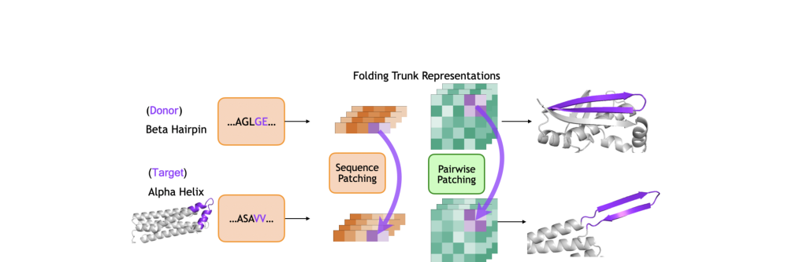
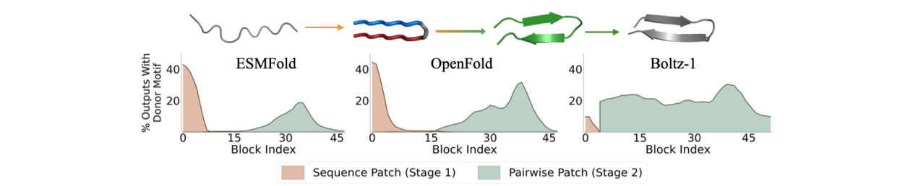
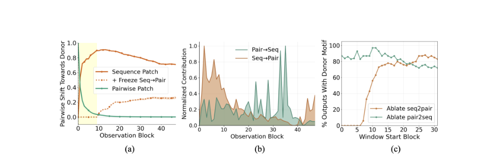
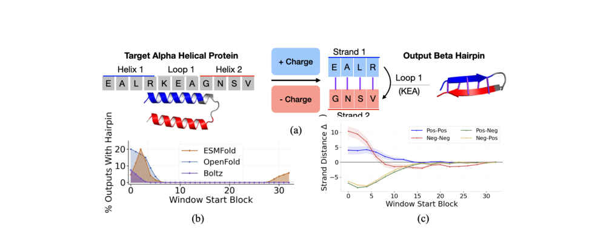
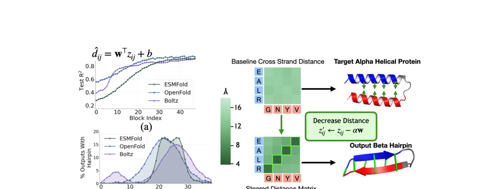
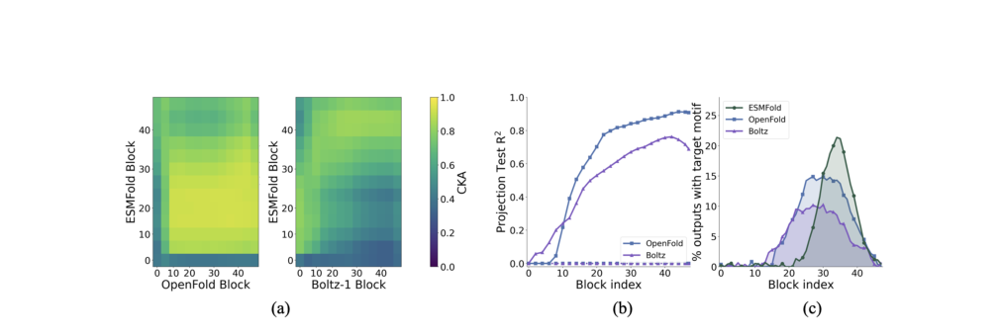

# Two Stages of Folding: Convergent Mechanisms in AI Protein Folding Trunks

### Link: [full article](https://doi.org/10.48550/arXiv.2602.06020)

Authors: Kevin Lu, Jannik Brinkmann, Stefan Huber, ..., Chris Wendler

arXiv, June 24, 2026

---
This is the third installment in our series on opening the black box of protein-folding AI. The first two covered decomposing the internal features of protein language models with sparse autoencoders, and a behavioral analysis of AlphaFold2. This one goes a step further: **it opens up the folding trunk directly and uses causal interventions to ask how, step by step, the model actually turns an amino acid sequence into a three-dimensional structure.**

The answer is surprisingly uniform: **the folding trunks of three different architectures, ESMFold, OpenFold and Boltz-1, all converge on the same two-stage computational mechanism**. In the early stage, biochemical information from the sequence (charge in particular) is written into the pairwise representation; in the later stage, geometric information (distances and contacts) takes shape in the pairwise representation and drives the final fold. Even more striking, the pairwise representations of different models can be linearly aligned, and they still work after being swapped across models.

## Part 1: Research Question

Over the past few years, the community's attention to models like AlphaFold and ESMFold has mostly centered on **"how accurate are the predictions?"** This paper asks a more fundamental question:

**What computation do these models actually perform internally to turn an amino acid sequence into a three-dimensional structure?**

Concretely, the authors organize the work around three sub-questions:

**1) When does the model decide whether a local structure becomes a helix or a hairpin?** In other words, at which layer of the trunk is the structural fate "locked in"?

**2) What features does this decision rely on?** Certain biochemical properties (such as charge), or spatial geometry (such as distances and contact maps)?

**3) Do different models use the same internal "logic"?** ESMFold relies on a single-sequence language model while OpenFold and Boltz-1 use MSAs. Do their internal representations have anything in common?

To make the question tractable, the authors focus on the two most classic secondary-structure decisions: the **alpha helix** and the **beta hairpin**. Both are simple enough to interpret, yet a hairpin requires residues that are far apart in sequence to coordinate and form contacts, which makes it more complex than a purely local decision and well suited to causal analysis.

## Part 2: Methodology: Background: The Two-Track Structure of the Folding Trunk

To understand the paper's core findings, we first need to be clear about how information is organized inside the folding trunk. Taking ESMFold as an example, the model has three modules:

**(1) Sequence encoder** (the ESM-2 language model): encodes the amino acid sequence into an initial sequence representation s

**(2) Folding trunk**: 48 blocks that iteratively update two representation tracks

**(3) Structure module**: decodes the final representations into 3D coordinates

The two representation tracks maintained by the folding trunk are the protagonists of the whole paper:

**Sequence representation s(k)**

Its shape is L × ds. For each residue i in the protein, the model maintains a ds-dimensional vector si(k) that carries **residue-level information**: amino acid type, local sequence context, chemical properties and so on. It is analogous to a token's hidden state in NLP.

**Pairwise representation z(k)**

Its shape is L × L × dz. For every residue pair (i, j), the model maintains a dz-dimensional vector zij(k) that carries **pairwise relational information**: whether the two residues are in contact, how far apart they are, and whether there are geometric constraints between them. If s holds the "node features", z holds the "edge features".

The superscript (k) denotes the state after the k-th trunk block. The two tracks interact through **two cross-representation pathways**:

**seq2pair: s → z**

Builds a pairwise update from the sequence representation. Specifically, the representations of residues i and j are linearly projected to ui and vj, and their elementwise product and difference are concatenated: φij = [ui ⊙ vj ; ui − vj], which is then written into z via triangular updates and attention. Intuition: the individual states of two residues are combined into candidate features for the relationship between them.

**pair2seq: z → s**

The pairwise representation generates an attention bias that modulates sequence self-attention: Aij(h) = ⟨qi, kj⟩ / √dh + βij(zij). Intuition: if zij indicates that two residues are spatially close, sequence attention becomes more inclined to let i "look at" j, so the geometric relationships formed in pairwise space feed back to guide the sequence computation.

A key finding of the authors is that patching the encoder or the structure module has little influence on the structural decision; **the folding computation really happens in the trunk**. That is why the whole paper focuses on the inside of the trunk.

## Part 3: Key Figure Analysis

The paper's main methodological value is that it builds a complete chain of causal evidence from three complementary techniques.

### 3.1 Activation Patching: Locating "When" and "Which Track"

**What this figure asks:** How does activation patching reveal the causal roles of the sequence and pairwise representations at different layers?

{: width="1010" height="334" loading="lazy" decoding="async"}

*Figure 3. Activation patching setup: the sequence or pairwise representation of a donor (beta hairpin) is substituted into the forward pass of a target (alpha helix), and the output structure is checked for changes.*

Activation patching is a causal-inference tool developed in the NLP mechanistic interpretability community. The core logic is:

**Step 1**: Pick a pair of proteins: a **donor** (containing a beta hairpin) and a **target** (containing a helix-turn-helix).

**Step 2**: Run each through the model and extract the internal representations s(k) and z(k) at every trunk layer.

**Step 3**: During the target's forward pass, replace the representation of a given local region at a given layer with the corresponding representation from the donor.

**Step 4**: Check whether the target's output structure has "turned into the donor's motif" after the replacement.

**Why does this establish causality?**

Pure probing can only tell you that "a piece of information is present at a certain layer"; it cannot distinguish whether that information actually drives the computation or is merely a redundant by-product. Activation patching intervenes directly: if you "transplant" the donor's hairpin representation into the target and the target really folds into a hairpin, that proves **the replaced representation causally participates in hairpin formation**. This is the crucial step from correlation to causation.

The authors built a large-scale experiment: 200 target proteins × roughly 130,000 donor motif regions, yielding about 10,000 patching experiments. More importantly, they ran **sequence patches** (replacing only s(k)) and **pairwise patches** (replacing only z(k)) separately, and did single-block patching layer by layer, which pinpoints exactly which layer and which track is doing the work.

### 3.2 Linear Probing: Reading Out What the Model Encodes

Probing trains a simple linear classifier or regressor on top of a model's representations to check whether a given layer encodes specific information. In this paper the authors mainly use two probes:

**Charge probe**: a linear classifier trained on the sequence representation s(k) to decide whether a residue is positively charged (K, R, H) or negatively charged (D, E).

**Distance probe**: a linear regressor trained on the pairwise representation zij(k) to predict the Cα distance of a residue pair.

Probes tell us where and when information appears, but they cannot prove causality. So the authors close this gap with a third method.

### 3.3 Representation Steering: Directly "Manipulating" Internal Variables

If a probe finds that a feature (such as charge) is linearly encoded in representation space, then its weight direction acts as a "control lever". Pushing the representation along this direction artificially strengthens or weakens the feature; this is steering.

The logic of steering is:

If pushing si along the "charge direction" makes the model's output structure change in a way consistent with electrostatics (for example, opposite charges attract and like charges repel), then **charge information really is a causal computational variable inside the model**, and the model uses this signal to make folding decisions. Likewise, if pushing zij along the "distance direction" actually changes the distance between residues accordingly, then the distance encoding in z is causal.

## Part 4: Key Contributions

**What this figure asks:** Do three folding models with different architectures all show the same two-stage computational pattern?

{: width="1263" height="258" loading="lazy" decoding="async"}

*Figure 1. Single-block patching results for the three models. Orange: sequence patches are effective (Stage 1); green: pairwise patches are effective (Stage 2). All three architectures show the same two-stage pattern.*

The paper's central result comes from the single-block patching experiment (Figure 1). Patching only the sequence or only the pairwise representation at each block, the authors found a very clear pattern:

**Stage 1 (early blocks, roughly 0-7): sequence patches are effective**

Patching the sequence representation in the first few blocks gives the highest success rate (about 40%). The further into the trunk, the weaker the effect of sequence patches. This shows that **the early stage is dominated by the sequence side**: here the model uses sequence information to decide whether "this segment will end up more like a hairpin or a helix".

**Stage 2 (middle-to-late blocks, roughly 25-40): pairwise patches are effective**

In the middle-to-late blocks, pairwise patches start to work and peak at blocks 30-40. This shows that **the late stage is dominated by the pairwise side**: here the model refines the structural tendency already formed into geometric constraints and spatial arrangement.

This pattern appears **in all three architectures, ESMFold, OpenFold and Boltz-1**, even though their training data, input modalities and architectural details all differ. This is the **Two Stages of Folding** in the title.

### Stage 1 in Detail: Writing Biochemical Information into Pairwise Space

Why are sequence patches effective only early on? The authors propose and verify a hypothesis: **the role of the early trunk is to write biochemical information from the sequence into the pairwise representation z through the seq2pair pathway**.

**What this figure asks:** In Stage 1, does information flow from sequence to pairwise dominate in the first 10 layers?

{: width="1010" height="324" loading="lazy" decoding="async"}

*Figure 4. (a) Change in z after a sequence patch: z drifts rapidly toward the donor within the first 10 layers, and the drift disappears when seq2pair is frozen. (b) The seq2pair contribution is strongest in the first 10 layers, while pair2seq only rises later. (c) Ablating seq2pair early almost completely abolishes hairpin formation.*

### 5.1 Three Lines of Evidence That "Sequence Information Is Written into z via seq2pair"

**Evidence 1: after a sequence patch, z becomes donor-like within the first ~10 layers.** The authors define an interpolation coefficient α that measures whether the patched target's z looks more like the donor or the target. After patching the sequence at block 0, the pairwise state z drifts quickly toward the donor over roughly the first 10 blocks, then levels off. If the early seq2pair pathway is frozen, this drift disappears. This is almost direct causal evidence: **seq2pair is the key channel that writes sequence information into z**.

**Evidence 2: pathway contributions support the two stages.** Measuring the norms of the seq2pair and pair2seq updates in each block (Figure 4b), seq2pair is strongest in the first 10 layers while pair2seq grows stronger later on, closely matching the two-stage windows seen in patching.

**Evidence 3: ablation confirms the direction.** While patching the sequence at block 0, the authors use a sliding window to delete the seq2pair or pair2seq pathway over a span of blocks (Figure 4c). Removing seq2pair early drops hairpin formation almost to zero; removing pair2seq early has little effect. So the key to the first stage is **a directional sequence → pairwise write-in**.

### 5.2 What Gets Written? Charge

The authors focus on charge because the two strands of a beta hairpin are often stabilized by **complementary opposite charges** (salt bridges). If the model has learned to use charge information to make folding decisions, then charge should be detectable in its representations.

**What this figure asks:** Can steering the pairwise representation with electrostatic complementarity controllably induce the target structure?

{: width="1010" height="380" loading="lazy" decoding="async"}

*Figure 5. (a) Charge steering design: "positive" and "negative" perturbations are applied to the two helices of a helix-turn-helix, mimicking the complementary cross-strand charges of a hairpin. (b) Hairpins are successfully induced in all three models, with the effect concentrated in early blocks. (c) Controls: like charges repel (distance increases) and opposite charges attract (distance decreases), with a smooth dose-response.*

**The charge direction is constructed very simply.** The mean sequence representation of positively charged amino acids (K, R, H) minus that of negatively charged amino acids (D, E) gives vcharge. In all three models, positive and negative charges are linearly separable with high AUC, showing that **charge is a stable linear direction in the sequence representation**.

**Charge really is written into the pairwise representation.** A probe trained on z to predict residue charge can barely read out charge at block 0, but probe accuracy rises clearly over the early blocks, and the rise coincides exactly with the window in which seq2pair is active. Charge is not in z from the start; it is written in through the early seq2pair pathway.

**The most important experiment: inducing a hairpin by directly "manipulating the charge direction".** Because the charge direction is linear, the authors add a "positive" perturbation to one helix of a helix-turn-helix target (s'i = si + α · vcharge) and a "negative" perturbation to the other (s'i = si − α · vcharge), artificially creating a pattern resembling the complementary cross-strand charges of a hairpin.

Result (Figure 5b): **hairpin formation is induced substantially in all three models, with the effect concentrated in early blocks**.

The controls are equally clean (Figure 5c):

* **Like charges added to the two strands of a hairpin** → strand distance increases by about 10 Å (repulsion)
* **Opposite charges added to the two sides of a helix** → distance decreases (attraction)

The effect changes smoothly with steering strength in a monotonic dose-response, indicating that the model uses a "continuous charge signal" for structural inference.

### Stage 2 in Detail: The Pairwise Representation Becomes a Geometric Representation

If the first stage is "chemical write-in", what happens in the second? The authors' answer: **in the late blocks, the pairwise representation z gradually encodes approximate spatial geometry, in particular the distances and contacts of residue pairs**.

### 6.1 Downstream Computation Reads z as a Geometric Channel

**The pair2seq bias aligns with the contact map.** In middle-to-late blocks, the attention bias produced by the pair2seq pathway distinguishes contacting pairs (Cα &lt; 8Å) from non-contacting pairs with high ROC-AUC. When visualized, positive bias clearly concentrates at true spatial contacts. This means **late-stage sequence attention is routed along the contact map**.

**The structure module reads z as a geometric signal.** The authors ran a clever experiment: before the representations enter the structure module, they rescale z while keeping s unchanged. Scaling z monotonically changes the mean pairwise distance of the output structure (enlarging z expands the structure, shrinking z contracts it), whereas scaling s has essentially no effect. This shows that, for the structure module, **geometric scale is carried by z**.

### 6.2 Distances Can Be Linearly Predicted from z

**What this figure asks:** In the late blocks, does the pairwise representation linearly encode the spatial distances of residue pairs?

{: width="1010" height="384" loading="lazy" decoding="async"}

*Figure 7. (a) The R² of the distance probe rises from near zero at block 0 to ~0.9 in late blocks. (b) Distance steering successfully induces hairpins in middle-to-late blocks. (c) Experimental design: zij is pushed along the probe weight direction so that cross-strand residue-pair distances shrink.*

The authors trained a linear probe (d̂ij = wT zij + b) to predict residue-pair Cα distances from each layer's zij. Result (Figure 7a): at block 0 distances are almost unpredictable (z is initialized with positional encodings), R² keeps rising with depth, and **late blocks reach R² ≈ 0.9**. The same holds for all three models. This shows that the late-stage pairwise representation is already close to a "linearly readable distance map".

### 6.3 Distance Steering: Manipulating z Along the Distance Direction to Induce Hairpins

Since the distance probe is linear, its weight direction w corresponds to "making the distance smaller". For the cross-strand residue pairs that should form contacts in the target hairpin, the authors steer z directly: z'ij = zij − α · ŵ (pushing toward a target distance of 5.5 Å).

Result (Figure 7b): **in all three models, cross-strand distances shrink and hairpins are induced, with the effect peaking in middle-to-late blocks**, matching the Stage 2 time window exactly.

So the chain of evidence for the second stage is also complete: the probe finds distance information → downstream computation depends on it → steering proves it is causally manipulable.

### Shared Representations Across Models: Platonic Representation

So far we have only said that "all three models show a similar two-stage pattern". This part goes further: **can their pairwise representations be aligned with one another, or even swapped?**

**What this figure asks:** Are the pairwise representations learned by three different architectures aligned at the geometric level?

{: width="1010" height="340" loading="lazy" decoding="async"}

*Figure 8. (a) CKA heatmaps: similarity is high between the middle-to-late blocks of ESMFold-OpenFold and ESMFold-Boltz-1. (b) Linear alignment R² with whitened Procrustes: OpenFold→ESMFold reaches ~0.9 and Boltz-1→ESMFold reaches ~0.75. (c) Cross-model patching: aligned OpenFold/Boltz-1 representations can still induce hairpins in ESMFold.*

### 7.1 CKA Similarity Analysis

The authors computed Centered Kernel Alignment (CKA) between different blocks of different models. Result (Figure 8a): similarity is high among the middle-to-late blocks and concentrates mainly along the diagonal, so a late block of one model most resembles a late block of the other. ESMFold-OpenFold similarity is highest; similarity with Boltz-1 is somewhat lower but still pronounced.

### 7.2 Whitened Procrustes Linear Alignment

CKA only shows that the representations are "similar in shape"; it does not prove they are interchangeable. The authors go further with whitened Procrustes: the pairwise representations of the two models are first whitened (mean-centered and multiplied by the inverse square root of the covariance matrix), and then the optimal rotation matrix R that aligns them is found.

Result (Figure 8b): alignment is poor at block 0 (dominated by differences in positional encoding) and rises quickly from blocks 5-15 onward. At the plateau, **OpenFold → ESMFold reaches R² ≈ 0.9 and Boltz-1 → ESMFold reaches R² ≈ 0.75**. Shuffled correspondences stay near zero, ruling out spurious dimension matching.

### 7.3 Cross-Model Patching: Aligned Representations Really Can Be "Swapped In"

This is the strongest conclusion. The authors linearly project the donor pairwise representation from OpenFold or Boltz-1 into ESMFold's space and then patch it into ESMFold's forward pass.

Result (Figure 8c): **cross-model patches can still induce hairpins in ESMFold's late blocks**, with the same timing window as ESMFold's own pairwise patches and a success rate that tracks alignment quality.

This shows that different models learn **not merely functionally similar representations, but a shared representational geometry that is geometrically alignable and functionally interchangeable**. It is a compelling instance of the Platonic Representation Hypothesis in protein folding: models with different architectures, different inputs and different training procedures converge on the same internal organization.

### Summary of the Evidence Chain and Its Significance

The paper's greatest strength is the completeness of its evidence chain, which builds layer by layer:

**Step 1: Locate "when"**

Single-block patching → early: sequence patches work; late: pairwise patches work

**Step 2: Explain what the early stage does**

Sequence patches make z donor-like → freezing seq2pair abolishes this → early ablation of seq2pair disrupts hairpins → charge is written from s into z → charge steering can induce hairpins

**Step 3: Explain what the late stage does**

pair2seq bias aligns with contacts → the structure module reads z as a geometric signal → distances can be read linearly from z (R²≈0.9) → distance steering can induce hairpins

**Step 4: Show that this is a general mechanism**

Reproduced in all three architectures → middle-to-late pairwise representations can be linearly aligned → after alignment they can even be patched across models

The paper's core picture in one sentence:

**The work of a folding trunk can be understood as first organizing sequence chemistry into pairwise space, then progressively geometrizing it within that pairwise space.**

### Limitations

**1) Only local motifs are analyzed.** The study focuses on beta-hairpin and helix decisions within 12-25 residues and cannot yet be generalized directly to whole-protein long-range folding, domain packing or complex β-sheet assembly.

**2) It depends on architectures with an explicit pairwise trunk.** If new architectures without an explicit pairwise representation emerge (such as SimpleFold), whether the two-stage mechanism persists in some form remains an open question.

**3) The counterfactual structures produced by interventions are not necessarily physically viable.** Although patched structures look like hairpins by DSSP, they may have low pLDDT and steric clashes. The experiments show that such causal control variables exist inside the model, but the resulting controlled structures may not be stable in the real physical world.

**4) Success rates are limited.** Full patching succeeds about 40% of the time, and single-layer patching even less. This indicates that motif transfer is affected by context and flanking interactions, and that factors outside the trunk still matter.

## About the Corresponding Authors

The corresponding authors of the paper are first authors Kevin Lu and Chris Wendler, both from Northeastern University (corresponding emails: lu.kev@northeastern.edu, ch.wendler@northeastern.edu). David Bau, who is also a core contributor, is a professor in the Department of Computer Science at Northeastern University and one of the representative researchers in the field of AI interpretability. He received his Ph.D. from MIT and has long worked on understanding and editing the internal representations of neural networks. His early work on network neuron semantic visualization (Network Dissection) and representation editing (such as ROME and Locating and Editing Factual Associations) had broad impact in the fields of NLP and computer vision, establishing a systematic research paradigm for the direction of "opening the black box." This article transfers the methodologies he developed in language model interpretability (activation patching, linear probing, representation steering) to protein folding models, demonstrating the potential for cross-domain application of mechanistic interpretability.

Co-corresponding author Chris Wendler's affiliation in this paper is Northeastern University, and his main research direction is mechanistic analysis and interpretability of deep learning models. He is a co-corresponding author of this paper, playing an important role in the design of cross-model representation alignment and causal intervention methods.

First author Kevin Lu is from Northeastern University and serves as a co-corresponding author. He led the experimental design and implementation of large-scale patching experiments in this paper.

## Citation

Lu, K., Brinkmann, J., Huber, S., Mueller, A., Belinkov, Y., Bau, D., & Wendler, C. (2026). Two Stages of Folding: Convergent Mechanisms in AI Protein Folding Trunks. arXiv. https://doi.org/10.48550/arXiv.2602.06020
