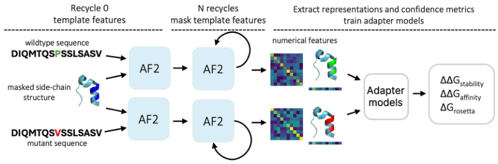
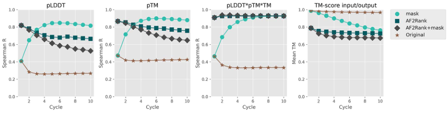
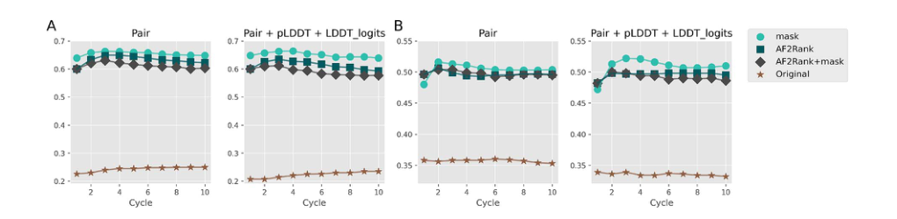
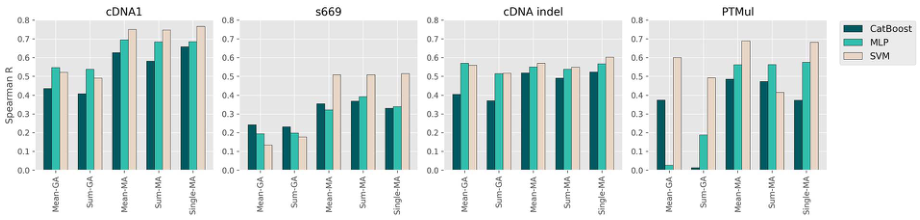

# AFToolkit: a framework for molecular modeling of proteins with AlphaFold-derived representations

### Link: [full article](https://doi.org/10.1093/bib/bbaf324)

Authors: Maria Sindeeva, Alexander Telepov, Nikita Ivanisenko, ..., Olga Kardymon

Briefings in Bioinformatics, July 1, 2025

---
The question asked most often in protein engineering is a simple one: will this mutation make the protein more stable or less stable? Will it strengthen or weaken binding? The corresponding quantity is ΔΔG. AlphaFold2 is excellent at structure prediction but notoriously insensitive to single-point mutations: run the wild type and the mutant separately and the output structures are nearly identical, so structural differences tell you nothing about whether a mutation is beneficial or harmful.

This work from AIRI offers an explanation: **AlphaFold2 has not failed to learn mutation-related information; rather, the MSA and templates in the standard inference pipeline suppress those signals**. Their fix is lightweight: drop the MSA pre-search, use the wild-type structure as the template in the first recycling round, **multiply all template features by zero from the second round onward** (the authors call this a mask), and then read out the model's internal Pair representation, LDDT logits and pLDDT, which are handed to an SVM that regresses ΔΔG.

Throughout, **not a single AlphaFold2 weight is fine-tuned**; only the adapter is trained. The result is a Spearman correlation of 0.68 on PTMul multi-point mutations and 0.60 on cDNA-indel insertions and deletions, and it is the only framework among the compared methods that can handle substitutions, insertions and deletions alike.

*How to read this post: we first explain why masking the template helps, then walk through the method and ablations, and finally look at the hard numbers on seven test sets and its real weaknesses.*

## Part 1: Research Question

**Three quantities to predict**

The everyday operation of protein engineering is site-directed mutagenesis: change a few amino acids in exchange for higher thermostability, stronger binding or better expression. Whether a mutation's effect can be judged in advance directly determines the number of experimental rounds and the cost. The paper targets three kinds of prediction:

**ΔΔGstability: change in monomer folding stability**

The difference in folding free energy before and after a mutation. Under the convention adopted in the paper, ΔΔG &lt; −0.5 counts as a stabilizing mutation and ΔΔG ≥ −0.5 as a destabilizing one; this threshold is used to recast the regression task as binary classification so that AUC and MCC can be computed.

**ΔΔGaffinity: change in protein-protein binding free energy**

How a mutation at an interface changes the binding strength of a complex. Antibody affinity maturation and engineered binder optimization both fall into this category.

**ΔGrosetta: per-residue Rosetta energy**

This target is an absolute value rather than a difference: the residue-level energy given by the REF2015 energy function. Folding it into the same framework means that a single inference run yields the structure, the confidence, the ΔΔG and an energy proxy all at once, sparing you the trouble of shuttling files between several software packages.

**The authors' hypothesis: the signal is suppressed by the MSA and the template**

Previous work has tried using AlphaFold2 embeddings directly for mutation-related tasks, but the standard inference pipeline leans heavily on two things during recycling: the coevolutionary features of the MSA and the structural features of the input template. The authors hypothesize that **it is exactly this dependence that makes AlphaFold2 fail when evaluating point mutations**.

The reasoning is straightforward. Change one amino acid in a 200-residue sequence and the evolutionary information in the MSA is left almost untouched; feed the wild-type structure back in as a template on top of that, and every recycling round reminds the model that the structure looks like this. With both forces stacked, the output structure is bound to correlate strongly with the wild type, and the small perturbation from the mutation is diluted beyond recognition. In the discussion the paper offers a more specific conjecture: template features are weighted heavily in AlphaFold2's training loss, so once the model finds that its output structure closely resembles the template, it becomes overconfident.

A ready reference is AF2Rank, which did something similar for decoy structure quality assessment: it skipped MSA precomputation and replaced residue types in the template with special tokens such as gap or UNK, sharply weakening the identity information in the template so that AlphaFold2's confidence could reflect the true quality of the input structure. The authors' question is whether a similar modification of inference can also work for mutation effect prediction, and whether, while weakening the template constraint, it can **preserve the fold and conformational state the user specified**, which is critical for structure-guided protein optimization.

## Part 2: Methodology: Masked inference plus a lightweight adapter

### Cut one: drop the MSA pre-search

AFToolkit performs no time-consuming MSA retrieval; the MSA features are constructed entirely from the input sequence itself. This cut has two consequences: inference becomes much faster (the authors note that without the MSA the inference complexity approaches that of ESMFold), and **the mutation in the input sequence is no longer diluted by hundreds or thousands of homologous sequences, so it can act directly on the internal representations**.

The implementation builds on the open-source OpenFold, with weights taken from AlphaFold2 **Model 2 pTM**. There are two reasons for choosing Model 2: it was trained with fewer MSAs, so its reliance on coevolutionary information is already lower, which matches the no-MSA setting; and the pTM version makes it easy to reuse AF2Rank's confidence metrics for comparison.

### Cut two: give the template on the first round, then multiply it by zero

This is the key design of the whole paper, which the authors call **masking**:

**Recycle 0 (first round)**

The wild-type structure is supplied as a template in the normal way. The role of this round is to tell the model which fold and which conformational state of the protein is under study.

**Every subsequent recycling round**

All template features are multiplied by zero. From then on the model can rely only on the mutated sequence and its own state from the previous round, and can no longer copy the answer from the template.

The design balances two goals that pull against each other. If the wild-type template is supplied on every round, the model tends to keep reproducing the wild-type structure and the mutation signal is flattened out. If no template is given at all from the very first round, the model may wander off into a different conformational state and the fold the user cares about is lost. **Taking one look and then removing the template is the core difference between AFToolkit and AF2Rank**: AF2Rank's masking is strong from the start and cannot be tuned, whereas the strength of the mask here can be adjusted by how many rounds run before masking kicks in.

The final configuration is **Nrecycle = 4**, based on the structure-preservation experiment in Figure 2.

### How a mutation is written into the input

Mutations are described by a mutcode, formatted as residue-before + position + residue-after; for a deletion the latter is written as a minus sign, and for an insertion it contains two amino acid types. The three mutation types are handled differently in the sequence and in the template:

**Point mutation (e.g. A15D)**

Position 15 of the sequence changes from Ala to Asp; in the template **all side-chain atoms of that residue are deleted** and the residue name is changed to the mutant type, while the backbone is kept. This way the model cannot see how the wild-type side chain was placed and must infer the conformation of the new residue in that local environment on its own.

**Deletion**

The residue is removed from both the sequence and the template structure, and subsequent residues are renumbered.

**Insertion**

A new residue is added to the sequence, and a dummy residue with masked coordinates is inserted into the template, with subsequent residues renumbered. The local structure at the insertion site is left entirely to the model to infer.

Because the mutation is written directly into the sequence and the template, **the framework natively supports multi-point mutations, insertions and deletions without needing a dedicated module for each mutation type**. The input structure can come from an experimental PDB structure, or can be predicted first by AlphaFold2 with standard settings. For multi-chain complexes the authors follow ColabFold and feed the complex as a single pseudo-chain, leaving a 25-residue gap between chains in the positional encoding.

### The adapter: almost counterintuitively simple

Three lightweight models were compared, all with plain settings:

**SVM (the final main model)**: scikit-learn support vector regression with standardization preprocessing. Only one regularization parameter, C, was tuned: C = 1 for stability prediction and C = 2 for binding affinity prediction. The authors stress that it performs robustly across datasets and essentially needs no retuning.

**CatBoost**: gradient boosted trees, at most 500 rounds with early stopping after 15 rounds without improvement, tree depth 4, L2 regularization coefficient 5, optimizing MSE.

**MLP**: trained for 50 epochs, batch size 256, learning rate annealed exponentially from 1e-3, with early stopping. One detail is worth remembering here: **training with Adam overfits noticeably, and only switching to SGD makes it stable**.

This is also where the paper's argument lies: the simpler the downstream model, the more clearly the performance can be attributed to the representation itself rather than to the fitting capacity of the regressor. The Rosetta energy task is even more direct: each residue is treated as an independent sample, the input is again the concatenation of Pair representation, LDDT logits and pLDDT, and no protein-level aggregation is performed.

## Part 3: Key Figure Analysis

The four figures divide the work clearly: Figure 1 lays out the framework, Figure 2 validates masking at the structural level, Figure 3 validates that masking helps at the representation level, and Figure 4 fixes the final configuration.

### Figure 1: The overall AFToolkit pipeline

**What this figure asks:** How does AFToolkit extract mutation-related representations from the inference pipeline without modifying any AlphaFold2 weights?

{: width="824" height="272" loading="lazy" decoding="async"}

The figure shows two parallel paths: the upper one is the wild-type sequence (DIQMTQS**P**SSLSASV in the sketch) and the lower one is the mutant sequence (the same position changed to **V**). Both paths share the same structural template with masked side chains.

The column labeled **Recycle 0** is marked template features: on the first round both paths can see the template. The next column, **N recycles**, reads mask template features and is drawn with a self-loop arrow: on every subsequent round the model feeds its own previous state back into the input, with template features already zeroed out.

On the right, **numerical features** shows a heatmap of the pair representation together with confidence-colored structures: the wild-type chain is highlighted in green and the mutant in red, indicating that **the internal representations around the mutation site do indeed differ**. Both feature sets go into the adapter models, which output three kinds of prediction: ΔΔGstability, ΔΔGaffinity and ΔGrosetta.

Nowhere in the figure is there a step that trains AlphaFold2. The three stages marked by dashed boxes are: supply the template, mask the template, and extract representations to train the adapter. **Every trained parameter lives in that small box on the far right.**

### Figure 2: Decoy ranking: masking balances judging well against not altering the input

**What this figure asks:** Under the masking strategy, can AlphaFold2 both distinguish good from bad structure quality and avoid substantially altering the conformational state the user specified?

{: width="920" height="234" loading="lazy" decoding="async"}

Figure 2 sets mutations aside and reproduces AF2Rank's decoy ranking experiment. The material is **1800 samples** randomly drawn from the Rosetta decoy dataset: for a given protein, Rosetta generates many candidate structures, some close to the true structure and some clearly off. The candidate structure din is fed in as a template, and the question is whether the model's output confidence reflects its true similarity TM(din, e) to the experimental structure e.

The x-axis of all four panels is the number of recycling rounds (1 to 10), and the four curves are four inference schemes: mask (cyan circles), AF2Rank (dark squares), AF2Rank+mask (gray diamonds), and Original, i.e. standard inference (brown stars).

**The first three panels (pLDDT, pTM, pLDDT×pTM×TM)** plot the Spearman correlation between confidence and true quality. Standard inference performs worst: in the pLDDT panel it drops below 0.3 after two rounds, which means **the confidence given by standard AlphaFold2 can barely tell whether the input structure is good or bad**, because it is merely copying the template and then giving its own copy a high score. The mask curve climbs quickly to around 0.85 and stays flat, consistently above AF2Rank; on the composite pLDDT×pTM×TM metric, the mask and AF2Rank curves essentially coincide above 0.9 after several rounds.

**The fourth panel, TM-score input/output**, asks a different question: how far the output structure after inference is from the structure the user supplied. Standard inference is nearly a horizontal line hugging 0.97 - it copies the input exactly, which is why it cannot judge. AF2Rank and AF2Rank+mask drop below 0.8 right away, showing that **they alter the input conformation quite a lot**. The mask curve starts near 1.0 and declines slowly, still around 0.9 at four rounds, only gradually falling to about 0.75 afterwards.

This figure explains why four rounds were chosen: **at that point decoy ranking ability is already on par with AF2Rank while the perturbation of the input structure is clearly smaller**. For protein engineering this is exactly the property needed: the model must be able to judge independently, yet must not alter the catalytic-site geometry or the apo/holo conformation you carefully preserved. The authors mention that this approach has already been used to optimize the apo-state properties of berovin, a ctenophore calcium-regulated photoprotein, and was validated experimentally.

### Figure 3: Change the inference scheme and ask whether the representation is any good

**What this figure asks:** Are the internal representations extracted under masked inference actually better for predicting mutational ΔΔG? How many recycling rounds are appropriate?

{: width="1020" height="250" loading="lazy" decoding="async"}

Figure 2 only shows that masking is sound at the structural level; Figure 3 tests the downstream task directly. The authors fix the downstream model to the same SVM and keep the data, training procedure and hyperparameters unchanged, **varying only which inference scheme the representation was extracted with**, so prediction quality can be attributed to the representation itself. The y-axis is the Spearman correlation between the SVM prediction and the experimental ΔΔG, the x-axis is the number of recycling rounds from 1 to 10, and the four curves follow the same legend as Figure 2, where Original here is standard AlphaFold2 without the MSA.

* **Panel A: the PTMul multi-point mutation set**, with up to about 10 simultaneous mutations per sample. Using the pair representation alone, Original reaches only about 0.22-0.25, while all three template-modified schemes exceed 0.6, with **mask highest at about 0.65**. The right-hand plot adds pLDDT and LDDT logits, and the ranking is unchanged. In other words, dropping the MSA alone is nowhere near enough: the wild-type template keeps reminding the model on every recycling round, and the mutation signal is suppressed.
* **Panel B: the s669 single-point mutation set**, where perturbations are subtler and overall correlations are lower. Original is about 0.34-0.36 and the template-modified schemes fall between 0.49 and 0.52, with mask still slightly ahead. The gap is smaller than in panel A but points the same way: even when the final structure barely changes, a different inference scheme lets the effect of a single mutation be read out of the internal representations.

The curves flatten out or even dip slightly after three to four rounds, so more recycling is not always better. Combined with the perturbation of the input structure in Figure 2, the authors settle on **4 recycling rounds, with features comprising the pair representation plus pLDDT plus LDDT logits**.

### Figure 4: Ablation of aggregation scheme and adapter: Single-MA plus SVM wins

**What this figure asks:** How should representations extracted from AlphaFold2 be aggregated, and which adapter should be used, to perform robustly across mutation types?

{: width="920" height="220" loading="lazy" decoding="async"}

The four panels are cDNA-1 (single point), s669 (external single point), cDNA-indel (insertions and deletions) and PTMul (multi-point). Within each panel the x-axis lists the five aggregation schemes and the three colored bars are CatBoost, MLP and SVM (light color).

**Pattern one: focusing on the mutation site beats global aggregation by a wide margin.** On cDNA-1, the SVM reaches about 0.50 with Mean-GA and Sum-GA, and jumps straight to roughly 0.75 with Mean-MA, Sum-MA and Single-MA. The gap is even more dramatic on s669: the SVM with global aggregation reaches only 0.15-0.2, versus about 0.52 with mutation-site aggregation. **Averaging over the whole protein drowns out the signal of that single mutation.**

**Pattern two: the gap is most striking on PTMul.** CatBoost and MLP sit almost at zero under the Mean-GA and Sum-GA configurations, while the SVM still reaches about 0.60 under Mean-GA. With Single-MA the SVM rises to about 0.68, the tallest bar in the whole figure.

**Pattern three: the SVM is hardly ever beaten in any cell.** The MLP occasionally has a slight edge in the global-aggregation configuration on cDNA-indel (about 0.57 versus 0.55 for the SVM), but in the vast majority of the remaining cells the light-colored SVM bar is the highest or tied for highest. CatBoost is weak overall: AlphaFold2 representations are high-dimensional dense continuous vectors, not the kind of data tree models excel at.

On this basis the authors settle on **Single-MA plus SVM** as the main model, and AFToolkit (SVM) in all subsequent tables refers to this configuration. The reason for the choice is cross-task stability: single point, external generalization, indels and multi-point - it ranks near the top in all four.

## Part 4: Key Contributions

Only the stability category is expanded here. The paper also applies the same representations to protein-protein binding affinity and to Rosetta residue energies, which this post does not cover.

**Stability prediction: seven test sets**

The comparison methods PROSTATA and Mutate Everything were both retrained on the same cDNA+PROSTATA data to ensure comparability. The table below gives the Spearman Rs and the RMSE (lower RMSE is better):

| Test set | AFToolkit Rs / RMSE | ME-AF2 | PROSTATA |
|---|---|---|---|
| cDNA-1 | 0.77 / 0.74 | 0.81 / 0.70 | 0.76 / 0.85 |
| cDNA-2 | **0.57** / 1.22 | 0.52 / 1.22 | 0.46 / 1.25 |
| cDNA-indel | **0.60** / 1.02 | cannot handle | cannot handle |
| s669 | 0.51 / 1.41 | 0.54 / 1.40 | 0.47 / 1.50 |
| ssym | **0.77** / **1.10** | 0.61 / 1.23 | 0.50 / 1.42 |
| PTMul | **0.68** / 1.90 | 0.67 / **1.71** | 0.45 / 2.12 |
| de novo Mega | 0.71 / **0.61** | 0.63 / 0.66 | 0.72 / 0.62 |

A more accurate summary is a layered one: **on single-point mutations it is on par with the strongest baseline** (0.77 on cDNA-1 is below ME-AF2's 0.81, 0.51 on s669 is below 0.54, and 0.71 on de novo Mega is slightly below PROSTATA's 0.72); **on multi-point mutations, the symmetry test and indels the advantage is clear** (0.57 on cDNA-2, 0.77 on ssym, 0.68 on PTMul and 0.60 on cDNA-indel).

Two numbers deserve to be singled out. The first is **0.77 on ssym**, 0.16 above ME-AF2. Ssym is designed specifically to test whether a model is self-consistent on forward and reverse mutations, and many methods expose systematic bias on it. The forward/reverse comparison on s669 is even more telling: AFToolkit scores 0.51 forward and 0.51 reverse, perfectly symmetric, whereas SDM falls from 0.41 to 0.13, PoPMuSiC from 0.41 to 0.24, and MAESTRO from 0.50 to 0.20. This is presumably related to the reverse-mutation augmentation added during training.

The second is that **on PTMul the correlation wins while the RMSE loses**: Rs of 0.68 is slightly above ME-AF2's 0.67, but the RMSE of 1.90 is clearly worse than 1.71. In other words, it is better at putting mutations in the right order, while the absolute calibration of the values still lags. The MCC on cDNA-indel is −0.002, which likewise suggests that binary classification at that threshold has almost no discriminative power and only the ranking is useful.

**The T4 lysozyme case study** provides direct evidence for Single-MA. PTMul contains seven T4 lysozyme (PDB 2LZM) samples, corresponding to different combinations of seven point mutations. Two prediction strategies are compared: predicting each single mutation independently and summing gives RMSE = 1.12, while extracting representations in the multi-mutation context with Single-MA and then summing gives **RMSE = 0.99**. Interestingly, the experimental data show that this set of mutations is itself additive, and even so, representations extracted in the multi-mutation context are still more accurate.

## Part 5: Limitations and Outlook

**Limitations worth noting**

**It depends on the quality of the input structure.** The whole pipeline uses the wild-type structure as a template, so when the initial structure is clearly inaccurate the local environment of the mutation site is wrong, and interface tasks are hit especially hard. The authors recommend using an experimental structure, or first generating a high-quality structure with AlphaFold2 under standard settings.

**The adapter is still shallow.** Only SVM, CatBoost and MLP have been tried so far, and the input is aggregated mutation-site features. This discards long-range interactions, the spatial topology of interfaces and full-sequence context. The authors themselves point out that a Transformer operating directly on residue-level representations of the whole sequence is a more reasonable next step.

**Multiple mutations still carry an additivity assumption.** Although the local features from Single-MA include the context of the other mutations, the output layer is ultimately a sum. For mutation combinations with strong synergy or strong antagonism, this form may not suffice.

**Correlation and error metrics do not move together.** On PTMul the Rs is higher while the RMSE is worse; on C380 all three correlation metrics are the best while the RMSE ranks near the bottom; the MCC on cDNA-indel is close to zero. **Using it to rank candidate mutations and for high-throughput prescreening is appropriate, but taking the predicted values directly as a substitute for experimental ΔΔG calls for caution.**

**The handling of complexes is simplified.** Multiple chains are concatenated into a pseudo-single chain, with only a 25-residue gap in the positional encoding between chains. This allows the single-chain pipeline to be reused, but chain identity, stoichiometry and interface pairing information are not fully expressed; an AlphaFold-Multimer or AlphaFold3 style model would be a more natural fit.

**Baseline comparisons are not entirely like-for-like.** Some comparison metrics are taken from the original papers and some were retrained by the authors; the mCSM-PPI2 results come from the official server and multiple mutations there are obtained by summing independent single-mutation predictions; under the complex-level split, the MpbPPI and FoldX numbers were read approximately off figures in other papers and are marked with an approximately-equal sign in the paper. The appropriate reading is therefore that the method reaches a competitive level, and **not that a fully standardized, strict comparison against all SOTA methods was performed**.

**In one sentence:**

AlphaFold2's insensitivity to mutations may be a problem with the inference pipeline rather than with the model itself. **Let it glance at the template to pin down the structure, then take the template away so it has to re-judge from the mutated sequence, and read the internal representations instead of the final coordinates** - this set of changes turns a structure predictor into a general-purpose mutation representation extractor without training any large-model parameters. The code is open source at AIRI-Institute/AFToolkit.

## About the Corresponding Author

Maria Sindeeva is the corresponding author and co-first author of this paper, serving as an AI Research Fellow in the Bioinformatics Group of the Russian Artificial Intelligence Research Institute (AIRI, Artificial Intelligence Research Institute) located in Moscow. Her research is centered on applying deep learning methods to protein and genome modeling, specifically covering protein stability change prediction, protein-protein interaction energy change prediction, B cell conformational epitope prediction, and deep learning analysis of genomic and epigenomic data. Besides AFToolkit presented in this paper, her representative works include the B cell conformational epitope prediction platform SEMA 2.0 (published in Nucleic Acids Research), with the relevant code also open-sourced by AIRI. The other co-first authors of this paper, Alexander Telepov, Nikita Ivanisenko, and Tatiana Shashkova, are all members of the AIRI Bioinformatics Group, with Artur Kadurin and Olga Kardymon responsible for project supervision. The entire team has been conducting long-term research in the areas of protein engineering and AI-driven drug discovery.

## Citation

Sindeeva, M., Telepov, A., Ivanisenko, N., Shashkova, T., Khrabrov, K., Tsypin, A., ... & Kardymon, O. (2025). AFToolkit: a framework for molecular modeling of proteins with AlphaFold-derived representations. Briefings in Bioinformatics, 26(4), bbaf324. https://doi.org/10.1093/bib/bbaf324
