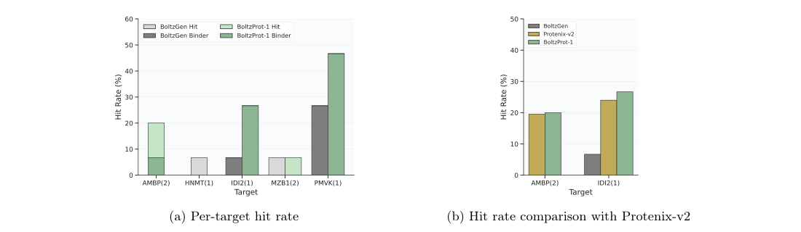
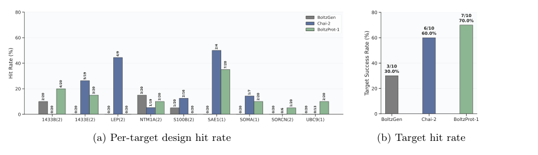
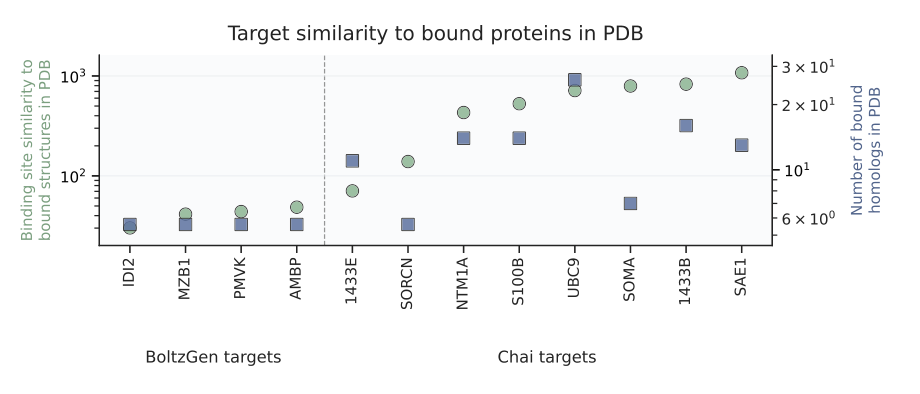
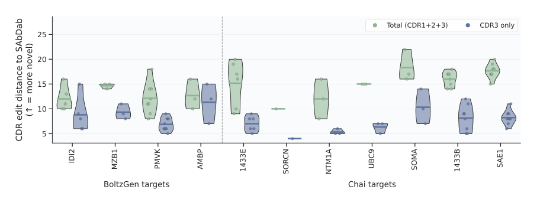
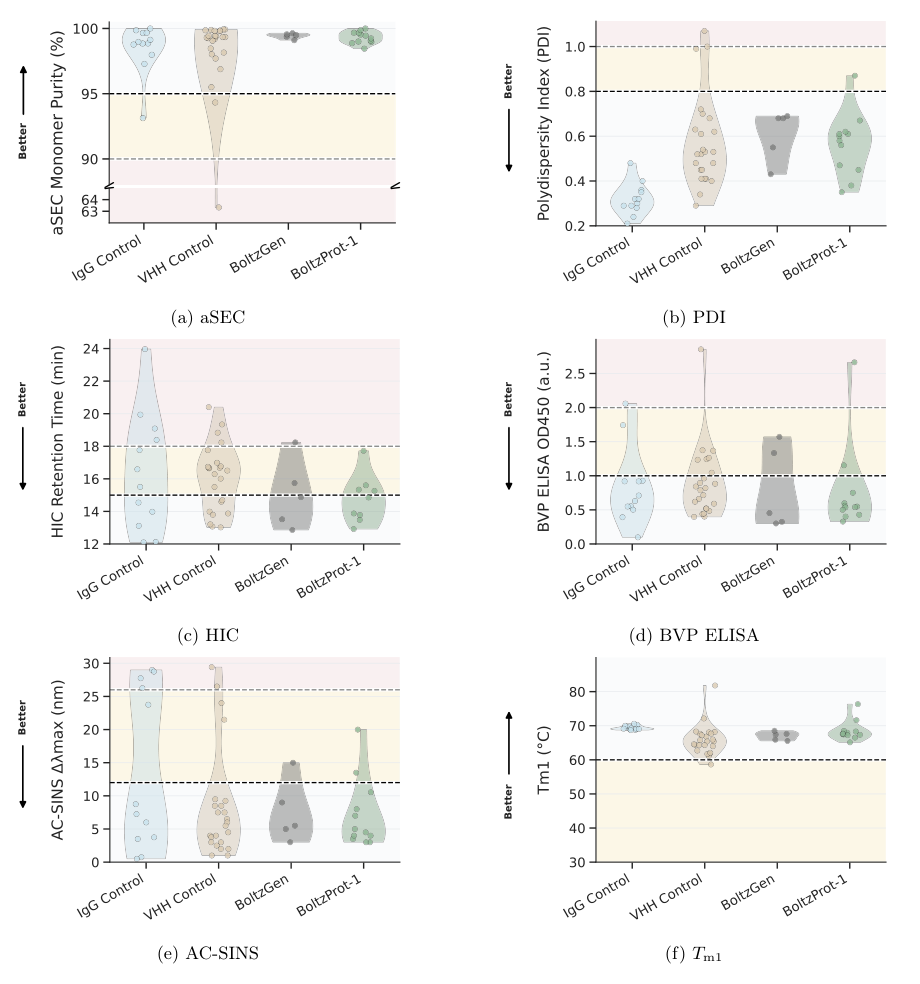
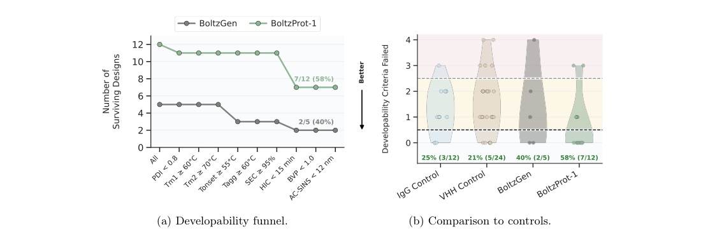

# BoltzProt-1: Towards Efficient De Novo Binder Design with Good Developability

### 原文链接：[全文](https://doi.org/10.64898/2026.06.23.733997)

作者：Talip Uçar, Jack Bates, Yunguan Fu, ..., Saro Passaro

bioRxiv，2026 年 6 月

---
**导读**

计算设计蛋白结合剂（如纳米抗体）时，生成模型已经能产出数万乃至数十万候选序列，但如何从中精准筛出真正能结合靶标的分子，仍然是实验效率的核心瓶颈。BoltzProt-1 提出了一条新思路：**在生成环节之后，增加一个专门预测蛋白-蛋白相互作用的评分模型 BoltzPPI，用结合概率而非结构置信度来排序候选**。在同一候选池、同一实验预算下，确认结合剂命中率从 3.3% 提升到 8.0%；在另一组 10 靶点面板上覆盖 7/10 靶点；同时 58% 的确认结合剂通过全部成药性标准，优于临床阶段 VHH 对照的 21%。

## 一、研究问题

计算蛋白结合剂设计通常分两步：先由生成模型产出大量候选序列及复合物结构，再从中挑选少量序列送入实验验证。当前的主要困难集中在第二步——排序与筛选。传统方法依赖结构预测模型的置信度指标（pLDDT、PAE、界面置信度等）来评价候选质量。这些指标回答的问题是"模型对这个复合物结构有多大信心"，但高结构置信度并不等于实验中真的会结合。一个生成模型可能已经在其数万候选中包含了真正的结合剂，但传统评分没有把它们排到前面——真正的瓶颈在于优先级排序的精度。

BoltzProt-1 的出发点正是这一差距。它的核心假设是：**结构预测置信度与实验结合概率之间存在系统性偏差**，如果能训练一个直接预测蛋白-蛋白相互作用的评分模型，就可以在不增加实验预算的前提下显著提升命中率。这对实际药物发现意义重大：实验验证的成本远高于计算生成，每提升一个百分点的命中率都意味着节省大量实验资源。

此外，即使能结合靶标，一个结合剂是否适合后续开发还取决于稳定性、溶解性、聚集倾向、非特异性结合等成药性属性。许多设计研究只报告是否出现结合信号，而缺乏对这些关键属性的系统评估。BoltzProt-1 在报告命中率的同时，还对确认结合剂进行了涵盖 9 项指标的全面成药性测试，使其结果更接近真实治疗分子早期开发阶段的要求。

## 二、方法核心：BoltzPPI 评分模型

BoltzProt-1 由两个核心组件构成。第一个是改进版的 BoltzGen 全原子生成模型，可同时完成结合剂序列设计和复合物结构预测，每个靶点可产出数万到数十万个 VHH（纳米抗体/单域抗体）候选。第二个是本文最重要的方法创新——**BoltzPPI**，一个构建在 Boltz-2 结构预测网络表示之上的蛋白-蛋白相互作用预测头。

BoltzPPI 的输入包括每个残基的单体特征、残基对的 pairwise 特征、预测的三维坐标、token 间的最小距离矩阵，以及区分结合剂与靶蛋白的掩码信息。这些特征重点强调结合界面区域，让模型聚焦于跨链接触的几何和化学特征。模型通过一个 4 层 Pairformer 网络（每层 16 个 attention head，dropout 0.25）处理后，分别汇总所有跨链残基对的 pair 特征和结合剂/靶蛋白各自的 token 特征，两类汇总表示拼接后经 MLP 输出一个结合概率 p = σ(ŷ)，其中 σ 为 sigmoid 函数。其目标并非精确预测 Kd 值，而是首先判断一个提出的复合物是否具有真实相互作用的可能性。

**训练策略**

BoltzPPI 采用多视图训练：50% 的样本同时使用坐标信息和主干网络的 pairwise 特征，另外 50% 去掉归一化后的主干 pairwise 表示，迫使模型更多地学习三维几何特征，避免过度依赖原始结构预测网络的内部置信信号。总体损失函数将结构置信度预测和 PPI 分类任务联合训练，PPI 分类采用 focal loss 来减少容易分类样本的主导作用。正样本包括 PDB 中的蛋白-蛋白复合物、专利来源的复合物、抗体-抗原复合物等；负样本为人工合成的预计不相互作用的蛋白配对。

完整流程为：生成大量候选 → 预测复合物结构 → BoltzPPI 评分 → 选择高分候选 → 实验验证。与传统方法的关键区别在于排序依据从"结构看起来是否合理"转变为"这个候选是否更可能在实验中表现出结合"。直观上，BoltzPPI 试图判断两个蛋白表面是否形状互补、界面残基排列是否合理、跨链距离是否符合真实蛋白复合物的特征——总之，界面看起来更像真实相互作用，还是模型强行拼出的结构。

## 三、看图说话

### Figure 1 · 低同源靶点上的命中率对比

**这张图想回答：**在固定候选池、固定实验预算下，只换排序模型能多挑出多少真结合剂？

{: width="1100" height="320" loading="lazy" decoding="async"}

*Figure 1. BoltzGen 低同源靶点面板上的命中率。(a) 各靶点的初筛命中（浅色）与确认结合剂（深色）率。(b) 整体确认结合剂命中率。*

10 个低同源靶点，两种方法共用同一 BoltzGen 候选池、各测 15 个设计、互不重叠——所以这张图严格衡量「只换排序模型」的贡献。

* **Panel b**：BoltzProt-1 的确认结合剂命中率 **8.0%（12/150），是 BoltzGen 3.3%（5/150）的约 2.4 倍**。注意论文区分「初筛命中」（SPR/BLI 有信号，可能含伪影）和「确认结合剂」（翻转固定方向正交验证），后者标准更严。单靠 BoltzPPI 排序就把确认靶点从 2/10 提到 3/10。

### Figure 2 · Chai-2 面板上的端到端表现

**这张图想回答：**在 10 个靶点上完整跑一遍，BoltzProt-1、BoltzGen、Chai-2 各覆盖多少靶点？

{: width="912" height="264" loading="lazy" decoding="async"}

*Figure 2. Chai-2 VHH 靶点上的纳米抗体设计。(a) 各靶点的初筛命中率。(b) 至少有一个初筛命中的靶点比例。Chai-2 数字取自其公开 VHH 结果。*

BoltzProt-1 在 **7/10 个靶点**上拿到至少一个初筛命中，高于 Chai-2 的 6/10、BoltzGen 的 3/10。但这组是完整端到端比较（BoltzProt-1 每靶点约 24 万候选、BoltzGen 6 万、Chai-2 用自己的流程），不能把全部提升都算到 BoltzPPI 头上。SAE1 上拿到 7 个命中最突出；S100B 上反而 BoltzGen 命中、BoltzProt-1 没复现；LEP、ONCM 三方都挂零，说明结合剂设计高度依赖靶点表面和已知结构先验。

### Figure 3 · 靶点与 PDB 已知复合物的相似度

**这张图想回答：**这些靶点到底有多「陌生」——结合位点能在 PDB 里找到多少同源？

{: width="920" height="394" loading="lazy" decoding="async"}

*Figure 3. 靶点与 PDB 中已结合蛋白的相似度。每个靶点给出结合位点与 PDB 已结合结构的相似度（绿）及 PDB 中已结合同源数（蓝）。*

左侧 BoltzGen 低同源靶点（IDI2、MZB1、PMVK、AMBP）的**结合位点相似度低、PDB 已结合同源数也少**，更考验对陌生结合位点的泛化；右侧 Chai 靶点普遍有更丰富的结构先验。这解释了为什么低同源面板的确认命中更难、覆盖只到 4/10。

### Figure 4 · 设计序列的新颖性

**这张图想回答：**这些设计是不是简单抄了数据库里已知的 CDR 序列？

{: width="912" height="354" loading="lazy" decoding="async"}

*Figure 4. 设计与 SAbDab 已知抗体/纳米抗体的 CDR 编辑距离。绿色为 CDR1+2+3 合计、蓝色为仅 CDR3，距离越大越新颖。*

对每个确认结合剂/初筛命中，计算其 CDR 与 SAbDab 已知序列的最小编辑距离。结果所有恢复的设计 **CDR3 最小编辑距离都 ≥ 4**，合并 CDR1/2/3 时距离更大——说明这些设计是真正从头生成，而不是复制数据库里的已知 CDR。

### Figure 5 · 九项成药性检测

**这张图想回答：**这些设计结合剂在稳定性、溶解性、聚集等成药性指标上表现如何？

{: width="920" height="984" loading="lazy" decoding="async"}

*Figure 5. 成药性检测。BoltzProt-1 结合剂在 (a) aSEC 单体纯度、(b) PDI 分散度、(c) HIC 疏水性、(d) BVP ELISA 非特异结合、(e) AC-SINS 自相互作用、(f) Tm1 热稳定性上的分布，与 IgG/VHH 对照、BoltzGen 比较。*

六个小提琴图各对应一项指标，每个标注了「Better」方向和合格阈值（黑虚线）。BoltzProt-1 的点在 **aSEC 单体纯度和 Tm1 热稳定性上明显靠好的一侧**，几乎都在 95%、60°C 阈值以上；PDI、HIC、AC-SINS 上则与临床对照相当，个别分子偏疏水。全部用 VHH-Fc 融合格式测试。

### Figure 6 · 成药性筛选漏斗

**这张图想回答：**综合全部成药性标准，有多少设计能通关？卡在哪一环？

{: width="1100" height="368" loading="lazy" decoding="async"}

*Figure 6. 成药性漏斗。58%（7/12）的 BoltzProt-1 确认结合剂通过全部成药性标准，BoltzGen 为 40%（2/5）。*

**7/12（58%）**的确认结合剂通过全部 9 项标准，高于 BoltzGen 的 40%、临床 IgG 的 25%、临床 VHH 的 21%。

漏斗显示主要淘汰环节在 **HIC 疏水性**：热稳定性和单体纯度阶段几乎不掉人，HIC 阶段从 11 个降到 7 个（4 个因表面疏水偏高被淘汰）。未来优化方向就落在降低表面疏水斑块。

## 四、核心贡献总结

一个能结合靶标的分子，如果不能表达、纯化、稳定保存或规模化生产，就无法进入临床开发。作者对低同源靶点的确认结合剂进行了系统的生物物理评价，包含 9 项指标：aSEC 单体纯度（≥95%）、PDI 多分散指数（&lt;0.8）、Tm1 和 Tm2 热熔解温度（分别≥60°C 和≥70°C）、Tonset 构象变化起始温度（≥55°C）、Tagg 聚集起始温度（≥60°C）、HIC 疏水相互作用色谱保留时间（&lt;15 min）、BVP ELISA 非特异性结合（&lt;1.0）和 AC-SINS 自相互作用波长偏移（&lt;12 nm）。对照组包括 12 个临床阶段 IgG、24 个临床阶段 VHH 和 5 个 BoltzGen 确认结合剂，所有设计 VHH 采用 VHH-Fc 融合格式测试。

综合通过率方面，BoltzProt-1 表现最优：**7/12（58%）**的确认结合剂通过全部 9 项标准，高于 BoltzGen 的 2/5（40%）、临床 IgG 对照的 3/12（25%）和临床 VHH 对照的 5/24（21%）。这一成药性强度值得关注：Chai-2 的成药性基准报告中，起始单体纯度门槛（≥90%）就淘汰了 37% 的候选，而 BoltzProt-1 的确认结合剂在更严格的 95% 门槛下几乎无损失。

从筛选漏斗来看，BoltzProt-1 的主要淘汰环节来自 HIC 疏水性检测：12 个确认结合剂经 PDI 筛选后剩 11 个，热稳定性（Tm1 ≥60°C、Tm2 ≥70°C、Tonset ≥55°C、Tagg ≥60°C）和单体纯度（SEC ≥95%）阶段基本无损失，但 HIC 阶段从 11 个降至 7 个——4 个分子因表面疏水性偏高而被淘汰。相比之下，临床阶段对照的失败更多来自多特异性和自相互作用等指标。这表明 BoltzProt-1 在热稳定性和单体纯度方面已经表现出色，未来优化方向可以聚焦于降低设计分子的表面疏水斑块暴露。

## 五、局限与展望

首先，在最困难的低同源面板上，完整流程最终只覆盖 4/10 个靶点的确认结合剂，距离"对任意靶点都能稳定设计"仍有明显差距。其次，Chai-2 面板的 7/10 是初筛命中而非严格确认的结合剂，两组结果使用的评判标准不同，不能直接比较 7/10 与 4/10。第三，成药性统计的样本量较小（BoltzProt-1 仅 12 个，BoltzGen 仅 5 个），58% 与 40% 之间的差异在统计上需要更大规模验证。第四，论文没有系统汇总全部确认结合剂的亲和力分布（Kd、kon、koff），重点报告了命中率和传感曲线，更多地证明了"能找到结合剂"，但尚未证明所有设计都具有治疗级别的高亲和力。第五，所有设计 VHH 采用 VHH-Fc 融合格式测试，而最终产品可能使用单体 VHH、多价 VHH 或其他融合形式，格式改变可能影响聚集、自相互作用等成药性指标。

总体而言，BoltzProt-1 最重要的贡献在于证明了一个实际而有力的观点：在能够生成数十万候选之后，真正关键的是用一个与实验结合更一致的评分函数（BoltzPPI），找到值得花钱验证的少数分子。固定候选池实验清楚地表明，仅仅改善排序策略就能将命中率提升 2.4 倍——大量有价值的候选可能已经存在于生成模型的输出中，只是被传统结构置信度指标遗漏了。同时，58% 的成药性通过率表明提高命中率并未以牺牲分子的稳定性和可制造性为代价，结合能力和早期成药性可以在同一设计流程中同时获得。BoltzProt-1 完整流程已通过 Boltz API 和 Boltz Lab 平台对外开放。

## 通讯作者介绍

本文通讯作者为 Talip Uçar、Gabriele Corso 和 Saro Passaro，三人均就职于 Boltz PBC。Gabriele Corso 本科毕业于剑桥大学，博士就读于麻省理工学院（MIT CSAIL），师从 Tommi Jaakkola 和 Regina Barzilay，研究方向为几何深度学习在分子设计中的应用，是 DiffDock（分子对接扩散模型）和 Boltz-1/Boltz-2（生物分子结构预测）系列工作的核心作者，也是 BoltzGen 通用结合物设计模型的主要贡献者。Talip Uçar 此前在 BioNTech 从事机器学习药物发现研究，专注于自监督学习和表格数据的表示学习方法，代表工作包括 SubTab，现为 Boltz PBC 核心贡献者。Saro Passaro 同为 Boltz PBC 核心成员，参与了 Boltz-2 结构预测和 BoltzGen 结合物设计等项目，研究方向涵盖生成式蛋白设计与分子相互作用预测。

## 引用

Uçar, T., Bates, J., Fu, Y., Shi, W., Stark, H., Nava, D., ... & Passaro, S. (2026). BoltzProt-1: Towards Efficient De Novo Binder Design with Good Developability. bioRxiv. https://doi.org/10.64898/2026.06.23.733997
