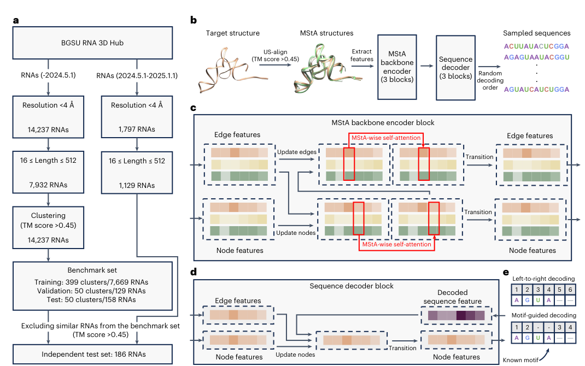
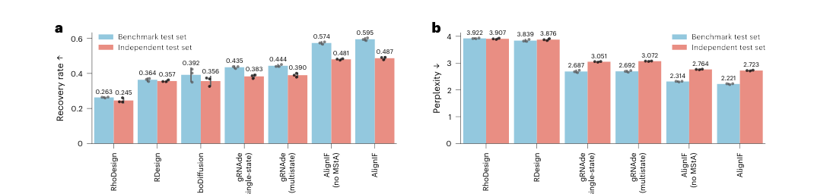
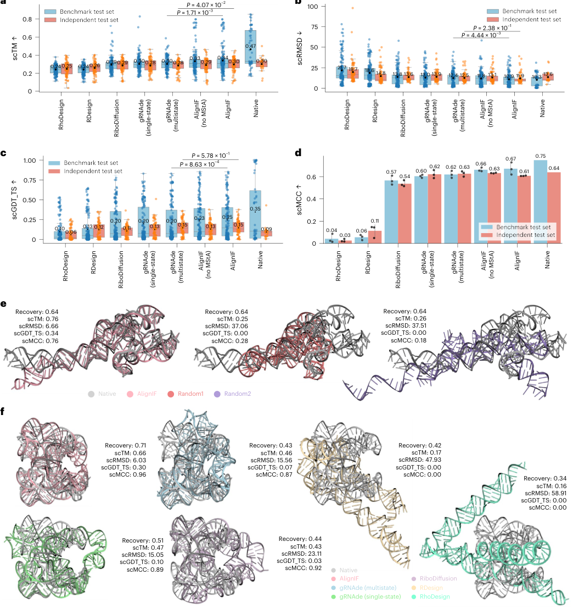
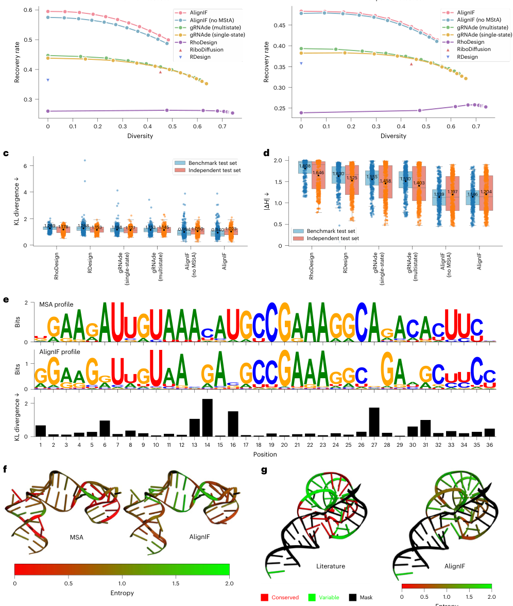
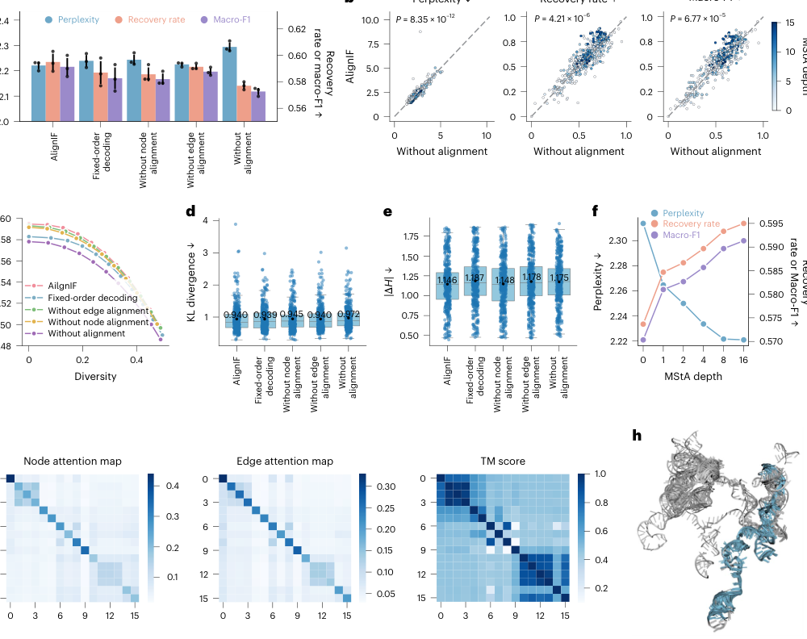
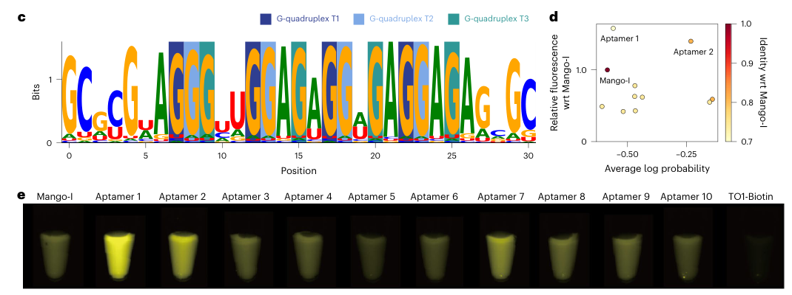

# Structure-alignment-driven cross-graph modeling for functional RNA design

### 原文链接：[全文](https://doi.org/10.1038/s43588-026-01029-2)

作者：Shengfan Wang, Jun Wang, Xiaojian Liu, ..., Xiaoyong Pan

Nature Computational Science，2026 年 8 月

---
RNA 的功能高度依赖三维结构：适配体靠特定折叠结合小分子，核酶靠精确的催化中心完成自切割。RNA 逆折叠的任务是给定一个目标三维结构，设计出能折叠成该结构的序列。现有方法大多只看单个目标结构，且受限于 RNA 结构数据的稀缺，泛化能力不足。

上海交通大学潘小洋、沈红斌、严骏驰、宋婕等人的团队提出了 **AlignIF**，将结构预测中"多序列比对"的思想逆向应用到序列设计中：通过多重结构比对（MStA）检索相似 RNA 结构，用跨图注意力学习结构家族的保守几何规律，再由随机顺序解码器生成序列。

成绩单：序列恢复率 **0.595**，比此前最优方法 gRNAde（0.444）提升 34%；合成的 23 条荧光适配体全部具有活性，其中两条 Mango-I 设计的荧光分别达到野生型的 **1.6 倍和 1.4 倍**；7 条手枪型核酶全部检测到自切割活性。

*本文先讲 AlignIF 如何借鉴结构比对的思想实现 RNA 序列设计，再看计算基准和湿实验验证的核心结果，最后讨论方法的边界。*

## 一、研究问题

RNA 逆折叠可以形式化为：给定目标三维结构，估计每个位置应该是 A、U、C 还是 G 的概率。这项任务在 RNA 工程中非常重要——设计具有特定荧光性质的适配体、具有催化活性的核酶、或者能作为基因开关调控表达的核糖开关，都需要从目标结构出发反推序列。

RDesign、RiboDiffusion、RhoDesign、gRNAde 等现有方法主要从单个目标结构出发生成序列。gRNAde 的 multistate 版本虽然能处理多个构象，但通常要求输入同一条 RNA 的不同状态——绝大多数 RNA 并没有多个已知构象可用。

另一个根本限制是 RNA 三维结构数据太少。RNA 具有动态性和柔性，实验解析困难，可用的三维结构远少于蛋白质。数据不足使深度学习模型容易过拟合，面对训练时未见过的 RNA 折叠泛化能力不足。

**核心思路**

蛋白质和 RNA 结构预测常用多序列比对（MSA）从同源序列中提取进化规律。AlignIF 将这个思想逆向化：**从多个相似的三维结构中提取保守的几何规律，用于指导序列设计**。结构预测是从多序列推断结构，AlignIF 则是从多结构推断可行序列。

## 二、方法核心：把多序列比对的思想逆向用到多结构比对

*Figure 1. (a) 数据集构建与划分。(b) 总体流程：目标结构 → US-align 检索相似结构 → MStA 特征提取 → 跨图编码 → 序列生成。(c) MStA backbone encoder：图内消息传递与跨结构注意力交替进行。(d–e) 随机顺序解码与 motif 引导生成。*

AlignIF 的流程分为三步：检索并比对相似结构、跨图编码、序列生成。

**多重结构比对（MStA）**：对给定的目标 RNA 结构，用 US-align 在结构库中检索 TM-score > 0.45 的相似 RNA。这些结构不要求高度序列相似，只需要具有相近的三维折叠。它们的几何共性和差异可以揭示哪些局部构象必须保守、哪些位置允许变化、哪些长程相互作用对折叠至关重要。

**跨图编码**：每个 RNA 结构被表示为几何图——节点是核苷酸，以 C4' 原子为位置代表，20 Å 内的核苷酸对之间连边。为避免整体平移和旋转影响，作者为每个核苷酸建立局部坐标系，提取 6 个骨架二面角、碱基取向角和 2 个核糖环构象角度作为节点特征；边特征则包含 P、C4'、碱基氮原子之间的距离以及局部坐标系间的相对旋转。消融实验表明，新加入的核糖环角度对建模 RNA 糖环构象变化确有帮助。

编码器在每个模块内交替进行两种操作：**图内消息传递**在单个 RNA 结构内聚合空间邻居信息，学习局部和长程空间关系；**跨结构注意力**在 MStA 对齐的对应位置之间交换信息，同时覆盖节点和边。这个机制与简单平均多个结构不同：模型可以给不同参考结构分配不同权重。论文发现，注意力权重分布与参考结构的 TM-score 呈明显对应关系——模型倾向于更多利用结构上真正相似的参考对象。

**随机顺序解码**：与固定从左到右生成不同，AlignIF 在训练时随机选择核苷酸生成顺序，减少对固定方向的依赖并缓解过拟合。实际使用中支持 motif 引导生成——先固定已知功能位点（如 G-四链体核心碱基、催化中心保守核苷酸或底物结合臂），再让模型在这些约束下补全其余序列。这对设计核酶和适配体尤为重要。

## 三、看图说话

### Figure 1 · AlignIF 的整体架构

**这张图想回答：**AlignIF 怎样用结构相似的 RNA 模板，通过跨图编码来指导序列设计？

{: width="1070" height="670" loading="lazy" decoding="async"}

*Figure 1. AlignIF 架构。(a) 数据集构建与划分。(b) 目标结构 → US-align 检索相似结构 → MStA 特征提取 → 跨图编码 → 序列生成。(c) 图内消息传递与跨结构注意力交替。(d–e) 随机顺序解码与 motif 引导生成。*

核心思路是把结构预测常用的「多序列比对」反过来用：**从多个相似三维结构里提取保守几何规律来推序列**（MStA，多重结构比对）。对目标结构用 US-align 检索 TM-score > 0.45 的相似 RNA，这些结构不要求序列相似，只要折叠相近。

每个 RNA 表示成几何图（节点是核苷酸、20 Å 内连边）。编码器交替做两件事：图内消息传递聚合空间邻居，**跨结构注意力在 MStA 对齐位置之间交换信息**——它会给更相似的参考（TM-score 高）分配更大权重，而非对多个结构简单平均。解码用随机顺序，并支持先固定功能位点（G-四链体核心、催化中心）再补全。

### Figure 2 · 序列恢复率大幅领先

**这张图想回答：**在序列恢复率和困惑度两项指标上，AlignIF 比现有方法强多少？

{: width="1070" height="256" loading="lazy" decoding="async"}

*Figure 2. 恢复天然序列的性能。(a) 各方法的序列恢复率（越高越好）。(b) 困惑度（越低越好）。基准集与独立测试集上 AlignIF 均最优。*

数据来自 BGSU RNA 3D Hub，按 TM-score 0.45 聚类划分，另有严格的独立测试集。基准集上 AlignIF **恢复率 0.595、困惑度 2.221**，远超 gRNAde multistate（0.444/2.692）、RDesign（0.364）、RhoDesign（0.263）。去掉 MStA 的版本仍有 0.574——说明增益来自两方面：更强的几何特征+随机顺序解码本身，以及 MStA 的额外加成（可用相似结构越多，加成越大）。Macro-F1 也最高，说明对四类碱基预测都均衡。

### Figure 3 · 设计序列能折回目标结构

**这张图想回答：**设计的序列用 AlphaFold3 重新折叠，能不能折回原来的目标结构？

{: width="1044" height="1106" loading="lazy" decoding="async"}

*Figure 3. 用 AlphaFold3 评估设计序列的可折叠性。(a–d) scTM、scRMSD、scGDT_TS、scMCC 等自一致性指标。(e–f) 设计序列重折叠与天然结构的叠合示例。*

把设计序列喂回 AlphaFold3 重新预测，再和原目标比 TM-score（scTM）等自一致性指标。AlignIF 的 scTM 整体最高。**一个关键对照**：核糖开关 8SA3 上，AlignIF 设计与天然恢复率都是 0.64、scTM 0.76；而恢复率同样 0.64 的随机突变序列 scTM 只有 0.25–0.26——说明 AlignIF 学到的是**哪些突变组合彼此兼容、能共同维持折叠**，而不是凑够恢复率数字。

### Figure 4 · 学到了 RNA 家族的进化规律

**这张图想回答：**模型只是复制天然序列，还是真的分得清哪些位点保守、哪些可变？

{: width="996" height="1176" loading="lazy" decoding="async"}

*Figure 4. 进化保真度分析。(a–b) 多样性 vs 恢复率。(c–d) 生成序列与天然同源分布的 KL 散度、绝对熵差。(e) MSA profile 与 AlignIF profile 的逐位对比。(f–g) 保守/可变位点在结构上的着色。*

一个目标结构通常对应很多可行序列。把生成序列的逐位碱基分布和真实同源序列的 MSA 分布比，AlignIF 的 **KL 散度和绝对熵差都最低**（panel c/d），profile 对比（panel e）里保守位点和可变位点都对得上。在 RNase P 和锤头核酶上，它仅凭三维结构就识别出的保守位点与文献催化位点一致。消融显示：同时去掉节点和边的跨结构注意力后 KL 最大——真正有效的是在对齐位置间传信息，而非简单平均。

### Figure 5 · 消融：每个部件都在起作用

**这张图想回答：**跨结构对齐、随机顺序解码、MStA 深度，各自贡献多大？

{: width="1000" height="792" loading="lazy" decoding="async"}

*Figure 5. 消融实验。(a) 各变体在困惑度、恢复率、Macro-F1 上的对比。(b–e) 逐样本对比与各项指标。(f) MStA 深度的影响。(g–h) 注意力图与 TM-score 对应关系。*

去掉对齐（without alignment）后三项指标都明显变差（panel a 最右）；固定顺序解码、去掉节点或边对齐也各有下滑。**Panel f**：**MStA 深度越大，恢复率越高、困惑度越低**。**Panel g/h**：注意力权重与参考结构的 TM-score 明显对应——模型确实更多利用真正相似的参考。用随机高斯扰动结构替代真实 MStA 得不到同样收益，证明增益来自真实结构家族里物理合理的构象差异。

### Figure 6 · 湿实验：荧光适配体超过野生型

**这张图想回答：**设计的 Mango-I 适配体变体，实验荧光能不能超过野生型？核酶有活性吗？

{: width="1070" height="400" loading="lazy" decoding="async"}

*Figure 6. AlignIF 生成的荧光点亮型 RNA 适配体与手枪型核酶的实验验证。(a–b) 适配体 sequence logo。(c–e) Mango-I 设计的 logo、相对荧光与荧光成像。(f) 核酶自切割活性。*

**适配体**：iMango-III 的 13 条设计（序列一致性 30%–73%）全部有荧光活性——连只有 30% 一致性的也能发光，说明学到的是结构约束而非复制序列。Mango-I 的 10 条设计全部有活性，**aptamer 1 荧光约为野生型的 1.6 倍、aptamer 2 约 1.4 倍**（panel d/e）。最亮的两条 Kd 反而更高，但最大荧光容量 Bmax 是野生型的约 2 倍，圆二色显示其 G-四链体折叠更稳。

**核酶**：对手枪型核酶用 motif 引导固定底物结合臂和 G40/G42，设计 7 条序列（训练集没有手枪型核酶），**7 条全部检测到自切割活性**，最佳 pistol 1 的 kobs 约为野生型的 11%。综合三组实验，30 条合成序列在没有任何后筛的情况下全部展现预期功能。

## 四、核心贡献总结

这篇工作的贡献可以归纳为三点。

**把「多序列比对」反向用成「多结构比对」。**结构预测是从多条同源序列推结构，AlignIF 则是从多个相似三维结构（MStA）推可行序列，正好绕开了 RNA 三维结构数据稀缺、单结构方法易过拟合的瓶颈。跨结构注意力在对齐位置之间传信息、按 TM-score 加权，是性能的关键来源。

**计算指标全面领先。**序列恢复率 **0.595，比此前最优的 gRNAde（0.444）提升约 34%**，困惑度、Macro-F1、自一致性折叠、与天然 MSA 的分布一致性等指标都最优；它学到的是「哪些突变组合能共同维持折叠」，而非凑恢复率。

**湿实验强力验证。**在没有任何后筛的情况下，**合成的 30 条候选全部具有预期功能**——13 条 iMango-III、10 条 Mango-I 适配体全部有荧光（两条亮度超野生型 1.4–1.6 倍），7 条手枪型核酶全部自切割。这比只看计算指标的验证更有说服力。

## 五、局限与展望

**缺少通用的候选排序方法。**AlignIF 能生成高比例的功能序列，但无法可靠判断哪条活性最高。作者回顾性检查了平均对数概率、AlphaFold3 scTM、二级结构 scMCC 和 RibonanzaNet scMCC 等指标，发现它们与实验活性的关系因目标而异，尚未找到跨 RNA 类型通用的排序标准。AlignIF 目前更擅长回答"哪些序列结构上可能合理"，还不能稳定回答"哪条序列一定具有最高活性"。

**主要依赖静态结构。**RNA 功能常依赖构象转换、配体结合前后的状态变化和催化中间态，AlignIF 目前只输入静态三维结构。适配体设计效果较好，核酶虽保留功能但活性弱于野生型，可能正因为此。

**MStA 带来显存开销。**跨图注意力的内存需求随参考结构数量增加。作者提出可通过删除低 TM-score 参考结构、蒸馏编码器等方式缓解。

**结构相似不等于功能相似。**MStA 以 TM-score 筛选结构，相似的整体折叠通常有价值，但局部活性中心的微小差异可能比整体 TM-score 更重要。未来可以引入序列 MSA、SHAPE 化学探测数据、配体和离子环境、cryo-EM 密度甚至动力学构象集合等额外信息，进一步提升设计质量。

## 通讯作者介绍

论文标注了三位共同指导作者：**沈红斌（Hong-Bin Shen）**与**潘小洋（Xiaoyong Pan）**均来自上海交通大学图像处理与模式识别研究所（系统控制与信息处理教育部重点实验室），研究方向为生物信息学、模式识别和深度学习在 RNA 生物学中的应用；**宋婕（Jie Song）**的署名单位为上海交通大学纳米生物医学与工程研究所及中国科学院杭州医学研究所。共同作者**严骏驰（Junchi Yan）**来自上海交通大学人工智能学院，研究方向涵盖图学习和组合优化，论文未将其标为通讯作者。几位作者分别从生物信息、模式识别、图学习和机器学习角度支撑了 AlignIF 的跨学科方法设计。

## 引用

Wang, S., Wang, J., Liu, X., Zhu, W., Huang, J., Xue, Y., ... & Pan, X. (2026). Structure-alignment-driven cross-graph modeling for functional RNA design. Nature Computational Science, 6(8), 826-841. https://doi.org/10.1038/s43588-026-01029-2
