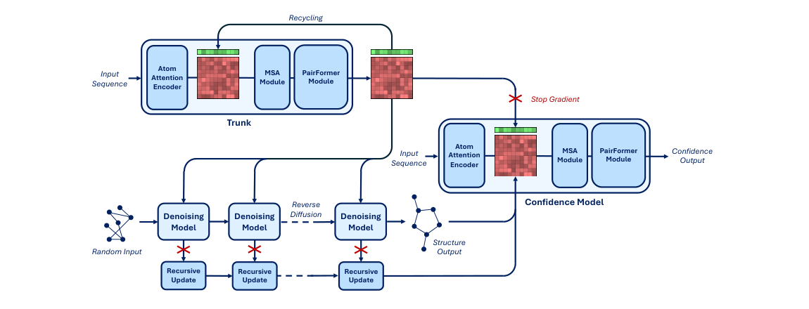
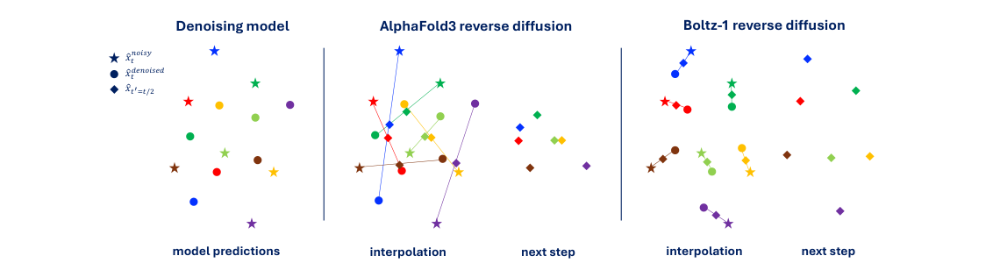
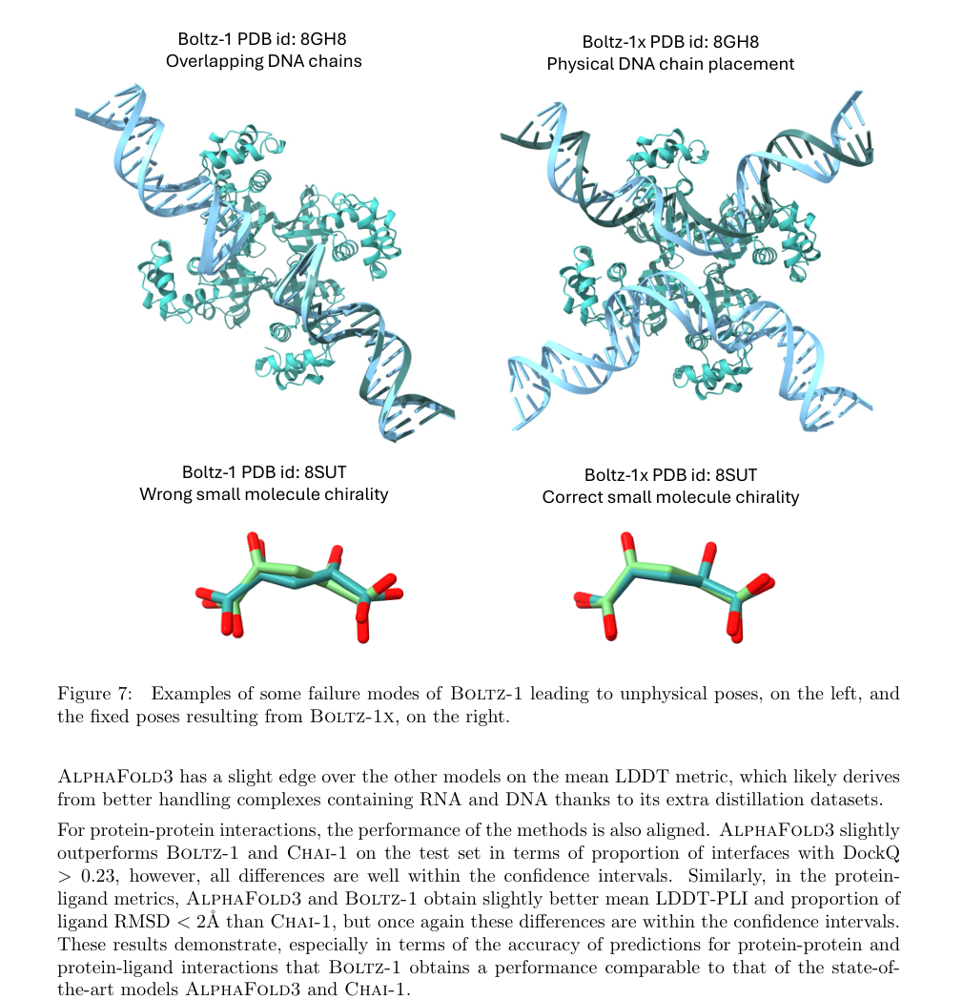
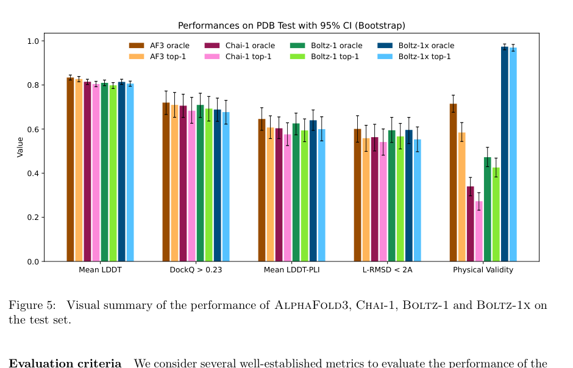

# Boltz-1: Democratizing Biomolecular Interaction Modeling

### 原文链接：[全文](https://doi.org/10.1101/2024.11.19.624167)

作者：Jeremy Wohlwend, Gabriele Corso, Saro Passaro, ..., Regina Barzilay

bioRxiv，2024 年 11 月 20 日

---
**导读**

AlphaFold3 在 2024 年证明深度学习可以高精度预测蛋白质、DNA、RNA、小分子等任意生物分子复合物的三维结构，但其**代码、权重和训练流程长期未公开**，研究者无法复现、修改或在此基础上创新。同期的商业模型 Chai-1 也只提供推理代码。

MIT CSAIL 和 Jameel Clinic 的 Wohlwend、Corso、Passaro 等人推出 **Boltz-1**——一个以 MIT 许可证全面开源的生物分子结构预测平台。Boltz-1 在数据处理流水线、模型架构、扩散推理过程和置信度估计四个层面做了系统性改进，在多项基准测试上**达到与 AlphaFold3 和 Chai-1 同等精度**，训练计算量仅为 AlphaFold3 的约四分之一。

更重要的是，团队还提出 **Boltz-steering** 推理时物理约束校正技术：通过 Feynman-Kac 框架和 Sequential Monte Carlo 采样，在扩散过程中引入七类物理势函数，将物理合理性从 57% 一举提升到**97%**，远超 AlphaFold3（58%）和 Chai-1（27%）。代码、权重、训练流程和基准测试全部以 MIT 许可证开放，已成为下游研究（SwitchCraft、Pair Representation Scaling 等）的核心平台。

## 一、研究问题

2020 年，AlphaFold2 在 CASP14 竞赛上以压倒性的精度证明了深度学习可以达到实验级的单链蛋白质结构预测。2024 年，AlphaFold3 进一步将预测范围扩展到**蛋白质、DNA、RNA、小分子配体、修饰残基、共价键**等几乎所有类型的生物分子复合物，覆盖了药物发现、酶工程和疾病机制研究中最核心的分子相互作用问题。

然而，AlphaFold3 长期以来只提供在线预测服务器，**训练代码、模型权重和数据处理流程均不公开**。研究者可以用它做预测，但无法在其基础上修改架构、扩展输入类型、实施新的训练策略，或将模型集成到自己的蛋白质设计和药物筛选流程中。同期的商业模型 Chai-1 也只公开了推理代码，训练过程仍然封闭。

这种封闭状态严重制约了结构预测领域的研究推进。首先，研究者无法验证和复现 AlphaFold3 声称的各项性能指标；其次，架构和训练策略的探索只能从头开始，无法站在巨人的肩膀上迭代改进；最后，许多下游应用——比如多构象采样、蛋白质设计的评分函数、特定类型复合物的微调——都需要对模型内部有完整的访问权限。

Boltz-1 的目标因此非常明确：**构建一个完全开源的生物分子结构预测平台，在精度上对标 AlphaFold3，在开放程度上做到训练代码、模型权重、数据处理和基准测试全部以 MIT 许可证发布**，使全球研究者都能自由地实验、验证和创新。

## 二、方法核心：整体框架：Trunk + 扩散范式

Boltz-1 的整体架构延续了 AlphaFold3 确立的 trunk + diffusion 范式，但在多个关键环节做了独立的改进。整个预测过程可以分为三个阶段：**输入编码 → 全局表示构建 → 扩散生成坐标**。

**这张图想回答：**Boltz-1 的整体架构如何将 MSA Module、PairFormer 和反向扩散结构生成结合在一起？

{: width="1150" height="440" loading="lazy" decoding="async"}

*Figure 3｜Boltz-1 架构示意图——左半部分为 Trunk（MSA Module + PairFormer），右半部分为反向扩散结构生成和 Confidence Model*

**输入层面**，模型接收蛋白质序列、配体 SMILES 字符串、核酸序列以及通过搜索获得的多序列比对（MSA）。Boltz-1 对不同分子类型采用统一的 token 定义：蛋白质以单个氨基酸为 token，DNA 和 RNA 以单个碱基为 token，小分子配体以每个重原子为一个 token。这种统一的 tokenization 使模型可以用同一套架构处理各种类型的分子输入。

**表示层面**，模型维护三种表示：**single representation**（每个 token 一个向量，捕捉局部序列和进化特征）、**pair representation**（每对 token 一个向量，编码残基间的相对关系和共进化信号）、**atom representation**（每个原子一个向量，提供原子级别的精细信息）。Trunk 部分由 MSA Module 和 PairFormer Module 组成，通过 48 层的深层网络将三种表示融合为全局结构信息。

**结构生成层面**，Boltz-1 使用扩散模型（diffusion model）从纯噪声出发，通过反复去噪逐步生成三维原子坐标。在每一步去噪中，模型利用 Trunk 编码的全局信息引导坐标向正确的结构逼近。

值得注意的是，Boltz-1 **没有使用结构模板**（structural templates），这一点与 AlphaFold3 不同。AlphaFold3 将已知结构作为模板输入来提供先验信息，而 Boltz-1 完全依赖序列和 MSA 信息，这简化了数据流水线，也避免了模板搜索带来的计算开销和潜在的模板偏差。

## 三、看图说话

数据处理流水线是结构预测模型的基础，它决定了模型能接收什么信息、以什么方式接收。Boltz-1 在 MSA 配对、空间裁剪和口袋条件化三个环节做了独立的改进，每一项都直接影响预测精度。

**3.1 Dense MSA Pairing：基于分类学信息的多链 MSA 配对**

对于蛋白质复合物的预测，仅靠单链 MSA 是不够的——模型需要知道哪些序列在自然界中同时出现在同一个物种里，从中提取**链间共进化信号**（co-evolution signal）。这是预测蛋白质-蛋白质界面的关键线索。

Boltz-1 的 Dense MSA Pairing 算法基于**分类学 ID（taxonomy ID）分组**：在各链的 MSA 中，找到属于同一物种的序列，将它们配对形成"同源多链 MSA 行"。这样，来自同一物种的多条链天然携带了链间共进化的信息。

这里有一个微妙的权衡：**配对越多，共进化信号越强；但过度配对会降低 MSA 的深度和密度**，因为只有在多条链上都有同源序列的物种才能参与配对。Boltz-1 的方案在配对强度和 MSA 密度之间寻求平衡，而非简单地追求最大配对数。

**3.2 Unified Cropping：空间与连续裁剪的统一插值**

训练时，大的生物分子复合物需要被裁剪到固定的 token 数。传统方法面临两种选择：**空间裁剪**（spatial cropping，选择三维空间中相邻的 token，保留局部空间关系但可能切断序列连续性）和**连续裁剪**（contiguous cropping，沿序列连续截取，保留链完整性但可能丢失空间相邻信息）。

Boltz-1 提出了一种**在两者之间直接插值**的统一裁剪策略。具体操作分三步：

* **（1）** 随机选择一个中心 token 作为裁剪起点，定义一个邻域大小参数 N；
* **（2）** 按空间距离依次向外扩展 token，但每次加入一个新 token 时，同时将其在序列上前后各 N 个 token 也纳入（即一个连续的序列邻域）；
* **（3）** 训练时，N 在 0 到 40 之间随机采样。

当 N=0 时，退化为纯空间裁剪；当 N 很大时，接近纯连续裁剪。**这种随机插值让模型在训练中同时学到空间关系和序列连续性**，避免了固定裁剪策略的偏差。

**3.3 Robust Pocket Conditioning：单模型支持灵活的口袋指定**

在药物发现场景中，研究者通常已知靶蛋白的结合口袋位置，希望模型在预测配体构象时参考这些先验知识。AlphaFold3 的做法存在两个问题：第一，它需要维护**两个独立模型**（一个用口袋信息，一个不用）；第二，它要求用户指定 6Å 范围内的**全部**口袋残基，部分指定会导致性能下降。

Boltz-1 采用了一种更优雅的方案：**单一模型统一处理有口袋和无口袋两种场景**。训练时，30% 的样本会随机纳入口袋信息：

* **（1）** 随机选择一个 binder（配体或相互作用链）；
* **（2）** 找到该 binder 6Å 以内的所有口袋残基；
* **（3）** 随机选择口袋残基的一个子集（允许部分指定）；
* **（4）** 用 one-hot token 特征标记四种状态：**BINDER**（配体 token）、**POCKET**（选中的口袋残基）、**UNSELECTED**（已知是口袋但未被选中的残基）、**UNSPECIFIED**（其余残基）。

这带来三个优势：模型只需训练和部署一个，降低维护成本；用户可以只指定部分口袋残基，更贴近实际使用中信息不完整的场景；口袋条件化的框架天然适用于蛋白质-蛋白质和蛋白质-核酸界面的指定，适用范围超出了小分子对接。

### 模型架构的三处关键改进

Boltz-1 在 AlphaFold3 的架构基础上做了三处结构性修改。这些修改看起来是"微调"，但每一处都涉及信息流传播路径的改变，对模型收敛速度和最终精度都有实质性影响。

**4.1 MSA Module 操作顺序重排**

AlphaFold3 的 MSA Module 中各操作的执行顺序为：

**AlphaFold3 顺序：**OuterProductMean → PairWeightedAveraging → MSATransition → TriangleUpdates → PairTransition

**Boltz-1 顺序：**PairWeightedAveraging → MSATransition → OuterProductMean → TriangleUpdates → PairTransition

关键区别在于：Boltz-1 将 **MSATransition** 放在 **OuterProductMean** 之前执行。MSATransition 负责更新 single representation（即每个 token 的独立表示），而 OuterProductMean 负责将 single representation 的信息聚合到 pair representation 中。**先更新 single representation，再通过 OuterProductMean 传播到 pair representation**，使得更新后的序列特征能更快地影响残基对之间的关系编码，信息传播效率更高。

**4.2 Transformer 残差连接修复**

AlphaFold3 的 DiffusionTransformer 中存在一个结构性问题：**AttentionPairBias**（注意力层）和 **ConditionedTransitionBlock**（前馈层）两个子模块共用一次加法更新。也就是说，两个模块的输出被加在一起形成一个 delta，再加回输入。这意味着**缺少一条残差连接**——ConditionedTransitionBlock 看到的输入并不包含 AttentionPairBias 的最新输出。

**AlphaFold3：**a ← a + [AttentionPairBias(a) + ConditionedTransitionBlock(a)]（两者基于同一个输入 a）

**Boltz-1：**a ← a + AttentionPairBias(a)；然后 a ← a + ConditionedTransitionBlock(a)（**两步独立的残差更新**）

Boltz-1 的修复带来两个好处：第一，反向传播路径更丰富，梯度可以通过更多的路径回传，有利于深层网络的训练稳定性；第二，AttentionPairBias 的输出能直接影响 ConditionedTransitionBlock 的计算——注意力捕获的全局模式可以立即被前馈网络利用，减少了信息传播的延迟。

**4.3 Confidence Model 的大幅度重设计**

置信度模型（Confidence Model）的作用是评估预测结构的质量，输出 pLDDT（局部距离差异测试）、PAE（预期对齐误差）、PDE（距离误差）和原子分辨率概率等指标。这些指标对于下游使用者判断预测的可信度至关重要。

AlphaFold3 的置信度模块相对简单：**仅使用 4 层 PairFormer**，只接收扩散最后一步的输出作为输入。这意味着它丢失了扩散过程中间步骤的大量信息。

Boltz-1 对 Confidence Model 做了**根本性的升级**：

**完整的 Trunk 架构：**Confidence Model 拥有与结构预测模型相同级别的架构——包含 AtomAttentionEncoder、MSA Module 和完整的 48 层 PairFormer Module。这赋予了置信度模型与主模型同等的表达能力。

**预训练权重初始化：**Confidence Model 的权重从训练完成的结构预测 Trunk 初始化（类似于对预训练模型进行微调）。新增的模块使用零初始化，确保初始状态下不会破坏已经学到的表示。

**扩散过程中间信息聚合：**通过一个时间条件化的循环模块（time-conditioned recurrent module），Confidence Model 从扩散过程的每一步收集中间表示，将整个去噪轨迹的信息聚合起来，信息量远大于 AlphaFold3 只取末步输出的做法。

**训练解耦：**Confidence Model 的训练与结构预测模型完全独立进行，避免了联合训练中的梯度干扰。这种设计使得研究者可以独立改进置信度估计，而不需要重新训练整个结构预测管线。

### Kabsch 扩散插值

**这张图想回答：**三种反向扩散策略在不同分子量复合物上的性能差异有多大？

{: width="1140" height="300" loading="lazy" decoding="async"}

*Figure 2｜三种反向扩散策略的对比——上：AlphaFold3（训练时对齐、推理时不对齐），中：简单插值，下：Boltz-1 的 Kabsch 对齐插值。三个散点图展示了在不同分子量下各策略的性能差异*

扩散模型的反向过程（inference）需要将去噪模型预测的"干净坐标"与当前的"噪声坐标"进行插值，生成下一步的中间状态。这里存在一个被忽视的理论缺陷。

在训练时，AlphaFold3 会对去噪预测做**刚体对齐**（rigid alignment）：将预测坐标对齐到真实坐标后再计算损失。但在推理时，没有真实坐标可用，去噪预测与噪声坐标之间可能存在全局旋转和平移的差异。**如果直接在未对齐的坐标之间做插值，尤其在低噪声步骤，会产生训练过程中从未见过的分布外中间状态**，导致模型在后续步骤中出现混乱。

Boltz-1 的解决方案：**在推理过程的每一步都执行 Kabsch 刚体对齐**。具体而言，在每个去噪步骤中：

* **（1）** 模型预测去噪后的坐标 x̂₀；
* **（2）** 使用 Kabsch 算法将 x̂₀ 刚体对齐到当前的噪声坐标 xₜ；
* **（3）** 在对齐后的 x̂₀ 和 xₜ 之间进行插值，生成 xₜ₋₁。

这保证了插值结果始终在去噪结构附近，处于模型训练时见过的分布之内。

值得注意的是，作者在论文中也给出了一个审慎的注释：在大型模型中，模型通常已经能预测出接近正确投影的坐标（即去噪预测和噪声坐标之间的刚体偏差本身很小），因此 Kabsch 对齐在大模型上的改进可能不如在小模型消融实验中那么显著。这种诚实的分析体现了 Boltz-1 团队对实验结论的谨慎态度。

### 扩散损失加权与训练策略

扩散模型的训练中，不同噪声水平（时间步）对最终预测精度的贡献是不均匀的。低噪声步骤需要模型做精细的原子级调整，高噪声步骤则需要确定全局折叠拓扑。如何在各时间步之间分配训练信号的权重，直接影响模型的最终表现。

Boltz-1 采用了 EDM（Elucidating the Design Space of Diffusion-Based Generative Models）风格的损失加权：

w(t̂) = (t̂² + σ_data²) / (t̂ × σ_data)²

与 AlphaFold3 使用的加权方案不同，EDM 加权旨在**让各噪声水平对总损失的贡献更加均衡**。在高噪声水平（t̂ 很大）时权重降低，避免模型过度关注"预测全局拓扑"这一相对容易的任务；在低噪声水平（t̂ 很小）时权重适当提升，促使模型在原子级精度上做更多优化。

在训练规模上，Boltz-1 的总训练步数约为 68,000 步，batch size 为 128。训练分两个阶段：前 53,000 步使用 384 tokens、3,456 atoms 的裁剪尺寸；后 15,000 步将裁剪尺寸提升到 512 tokens、4,608 atoms，让模型在更大的上下文中学习长程依赖。训练前半段使用 50% PDB 真实结构和 50% OpenFold 蒸馏数据的混合。

作为对比，AlphaFold3 的训练使用了约 150,000 步，batch size 256，**计算量约为 Boltz-1 的 4 倍**。Boltz-1 能在如此低的计算预算下达到同等精度，得益于上述架构改进和训练策略的优化。消融实验表明，3 轮 recycling + 50 步扩散已经达到性能饱和点，继续增加并不能带来显著提升。

### 计算效率优化

高精度结构预测的计算开销是巨大的。Boltz-1 从算子级、架构级和算法级三个层面做了系统性的效率优化。

**7.1 Trifast Kernel：将 Triangle Self Attention 内存降一个量级**

PairFormer 中的 **Triangle Self Attention** 是整个模型最大的计算瓶颈——时间和内存复杂度均为 O(n³)，其中 n 是 token 数。对于一个 2000 token 的复合物，这意味着 8×10⁹ 次注意力操作和相应的内存占用。

Boltz-1 实现了一个基于 **Triton**（OpenAI 的 GPU 编程框架）的分块在线 softmax 内核（blocked online softmax kernel），**将内存复杂度从 O(n³) 降至 O(n²)**，同时在 GPU 上实现了高效的并行化。在 n=2000 时，Trifast 比 DeepSpeed 的实现快约 2 倍，使得大复合物的训练和推理在合理的 GPU 数量下变得可行。

**7.2 Attention Bias 共享与缓存**

Boltz-1 团队观察到，去噪模型中的 **attention pair bias**（注意力对偏置）既不依赖于当前的扩散步骤，也不依赖于输入的噪声结构。这意味着它在所有采样步骤中保持不变。基于这一洞察，Boltz-1 将 attention pair bias 的计算**提到所有采样步骤之前执行一次**，结果被缓存并在后续每一步中直接复用。当使用 200 步扩散采样时，这一优化可以省去 199 次重复计算。

**7.3 Greedy Symmetry Correction：对称性校正的可行化**

多聚体复合物中常存在对称链（如同源二聚体、四聚体），训练损失需要在所有可能的链排列中找到最优匹配。链排列的组合数随链数指数增长，暴力搜索在三条以上的对称链时就变得不可行。

Boltz-1 采用了**两阶段贪心算法**：

**第一阶段：**搜索最优的链赋值（chain assignment）——将预测的每条链匹配到真实结构的对应链，使得全局对齐误差最小；

**第二阶段：**在每条链内部，贪心优化原子排列（atom permutation），处理对称残基（如苯丙氨酸侧链环翻转）的匹配。

这种分层贪心策略将指数级的搜索空间压缩到了多项式级别，同时在消融实验中表现出与精确搜索相当的精度。

### Boltz-steering：推理时引入物理约束

尽管 Boltz-1 在结构预测精度上与 AlphaFold3 持平，生成的构象中仍有**约 57% 存在物理缺陷**。这些缺陷包括：对称链在空间中重叠、原子间的空间碰撞（steric clash）、共价键被拉伸到不合理的距离、手性中心翻转、E/Z 双键立体构型错误、芳香环偏离平面以及跨链共价键断裂等。这些问题并非 Boltz-1 特有——AlphaFold3 的物理合理性通过率约 58%，Chai-1 更低，仅约 27%。

直观地理解：扩散模型学习的是数据的统计分布，它"知道"蛋白质结构长什么样，但并不显式地"知道"物理规则。当模型在统计意义上正确但在物理约束上出错时，这些错误在基于距离的度量（如 RMSD、LDDT）中并不明显，但对下游的分子动力学模拟、自由能计算和实验验证来说却是致命的。

**8.1 理论框架：Feynman-Kac + Sequential Monte Carlo**

Boltz-steering 的核心思想是在推理时修改扩散分布。设原始扩散模型的输出分布为 p_θ(x₀)，我们希望采样的目标分布为：

p_target(x₀) ∝ p_θ(x₀) × exp[−λ E(x₀)]

其中 E(x₀) 是物理约束势函数，λ 控制约束强度。**这等价于将原始分布与物理约束的 Boltzmann 分布相乘**——在保留模型学到的结构特征的同时，把物理不合理的构象的概率压低。

实现上，Boltz-steering 使用 **Feynman-Kac (FK)** 路径积分框架将上述目标分布的采样转化为扩散路径上的重要性加权问题，然后通过 **Sequential Monte Carlo (SMC)** 算法高效求解。在每个扩散步骤中：

* **（1）** 模型预测去噪坐标 x̂₀；
* **（2）** 计算物理约束能量 E(x̂₀)；
* **（3）** 对坐标施加梯度下降，沿 E 的负梯度方向微调 x̂₀；
* **（4）** 维护多个粒子（候选结构），根据约束能量计算重要性权重；
* **（5）** 每隔 3 个时间步执行一次**重要性加权重采样**（importance-weighted resampling），淘汰物理不合理的候选、复制物理合理的候选。

**8.2 七类约束势函数**

Boltz-steering 定义了七类物理约束势函数，每一类都采用**平底势**（flat-bottom potential）的形式——在合理范围内能量为零，超出范围才产生惩罚。这确保约束只在物理不合理时才起作用，不会干扰本身合理的预测。

**1. 手性约束（Chirality）：**基于四面体中心的 CIP 优先级排列，通过非正常二面角（improper torsion angle）检查手性中心是否正确。R/S 构型翻转会导致分子功能完全改变。

**2. 键立体化学约束（Bond Stereochemistry）：**检查 E/Z 双键构型，通过二面角判断双键两侧取代基的相对位置是否正确。

**3. 平面键约束（Planar Bonds）：**确保芳香环（苯环、嘌呤、嘧啶等）中的原子保持共面，非平面的芳香环在物理上是不允许的。

**4. 内部几何约束（Internal Geometry）：**使用 RDKit 计算的距离边界（distance bounds），约束 1-2 键长、1-3 键角和非键合原子间距在合理范围内。

**5. 空间碰撞约束（Steric Clash）：**要求非键合原子之间的距离大于 0.725 倍的两原子范德华半径之和。这个 0.725 的系数留出了合理的容差，避免对稍有接触的原子过度惩罚。

**6. 链重叠约束（Chain Overlap）：**针对对称多聚体中对称链在空间中完全重叠的问题。约束对称链的质心距离随扩散步骤递减——在早期允许较大的重叠容差（因为结构尚未成型），在后期逐步收紧，确保最终结构中各链明确分开。

**7. 共价键约束（Covalent Bonds）：**要求跨链的共价键（如二硫键、配体共价结合）的原子间距离不超过 2Å，防止共价连接被扩散过程拉断。

**这张图想回答：**Boltz-steering 能否修正 Boltz-1 输出中典型的物理缺陷（链重叠、手性翻转）？

{: width="1010" height="1048" loading="lazy" decoding="async"}

*Figure 7｜Boltz-steering 修正效果——左列为 Boltz-1 的典型物理缺陷（DNA 链在空间中完全重叠、手性中心翻转），右列为 Boltz-1x 修正后的合理构象*

**8.3 效果：物理合理性从 57% 跃升至 97%**

加入 Boltz-steering 的模型称为 **Boltz-1x**。在保持结构预测精度（LDDT、DockQ 等指标）基本不变的前提下，物理合理性通过率从 57% 跃升至**97%**。横向对比：AlphaFold3 的物理合理性约 58%，Chai-1 仅约 27%。Boltz-1x 的 97% 通过率意味着几乎所有生成的构象都可以直接用于下游的分子动力学模拟和自由能计算，无需额外的结构修正后处理。

## 四、核心贡献总结

Boltz-1 的评测在两个独立基准上进行：**593 个最新 PDB 结构**（2023 年 1 月之后发布，确保所有模型的训练集中均未见过）和 **CASP15 竞赛的 66 个结构**。推理参数设置为 200 步扩散、10 轮 recycling，对每个目标生成 5 个候选结构取最优。

**这张图想回答：**在 PDB 测试集上，Boltz-1 与 AF3、Chai-1 等模型在五项核心指标上如何比较？

{: width="940" height="604" loading="lazy" decoding="async"}

*Figure 5｜PDB test set 上四个模型的五项核心指标对比——前四项为结构精度指标，第五项为物理合理性指标*

五项核心指标的详细解读：

**Mean LDDT（局部距离差异测试，衡量局部结构精度）：**Boltz-1 约 0.73，与 AlphaFold3（~0.73）和 Chai-1（~0.73）在统计上无显著差异。这表明 Boltz-1 在残基级别的局部结构精度上完全达到了商业模型的水平。

**DockQ > 0.23（蛋白质-蛋白质界面质量，阈值以上视为可接受的对接）：**各模型均在 0.62–0.65 范围内，差异在置信区间之内。蛋白质-蛋白质界面预测是最具挑战性的任务之一，四个模型表现相当说明当前架构范式可能已接近这一任务的天花板。

**Mean LDDT-PLI（蛋白质-配体界面精度）：**AlphaFold3 和 Boltz-1 在这项指标上略优于 Chai-1。配体结合模式的准确预测对药物发现至关重要，Boltz-1 在这里的表现尤其有意义。

**L-RMSD &lt; 2Å（配体构象 RMSD 低于 2Å 的比例）：**三者接近，差异不显著。RMSD 阈值 2Å 是药物设计领域广泛采用的"可用对接"标准。

**Physical Validity（物理合理性通过率）：**这是 Boltz-1x 最亮眼的指标。**Boltz-1x 以 97% 的通过率大幅领先**，AlphaFold3 约 58%，Chai-1 仅约 27%。这一指标直接反映了生成构象能否被下游物理模拟工具直接使用。

综合来看，在四项结构精度指标上，Boltz-1 与两个商业/封闭模型处于统计不可区分的水平；在物理合理性上，Boltz-1x 凭借 Boltz-steering 技术取得了压倒性的领先。考虑到 Boltz-1 的训练计算量仅为 AlphaFold3 的约四分之一，且全部以 MIT 许可证开源，这一结果是非常令人印象深刻的。

## 五、局限与展望

Boltz-1 的意义不仅仅在于它"复现了 AlphaFold3 的精度"——这固然重要，但它真正的价值在于以下几个层面：

**首先，它证明了开源社区可以在合理的计算预算下构建出与商业模型精度相当的结构预测工具。**Boltz-1 的训练计算量约为 AlphaFold3 的四分之一，且全部开源（MIT 许可证，含训练代码、模型权重、数据处理流水线和标准化的基准测试套件），这为学术实验室和初创公司提供了一个可负担的起点。

**其次，Boltz-1 作为平台的价值已经得到验证。**发表以来，**SwitchCraft**（多构象蛋白质设计）和 **Pair Representation Scaling**（构象空间采样）等后续工作都直接构建在 Boltz-1 之上。一个完全开放的预测平台使得这些创新成为可能——如果底层模型是封闭的，这些二次开发根本无法进行。

**最后，Boltz-steering 代表了一种值得关注的方法论。**传统思路是在训练阶段让模型隐式地学习所有物理规则，但这要求训练数据中包含足够多的物理约束信息，且模型容量必须大到能同时编码结构统计和物理定律。Boltz-steering 提出了一种不同的哲学：**将统计学习和物理约束解耦——模型专注于学习结构分布，物理规则在推理时通过显式势函数引入**。这种"训练学统计、推理加物理"的分工，既保留了扩散模型的灵活性和数据驱动优势，又通过可解释、可调节的约束势满足了下游应用对物理合理性的硬性要求。这一思路对未来的分子生成模型设计具有广泛的启发意义。

## 通讯作者介绍

Jeremy Wohlwend、Gabriele Corso 和 Saro Passaro 为本文的共同通讯作者，三人均就职于 MIT 计算机科学与人工智能实验室（CSAIL）和 MIT Jameel Clinic。Gabriele Corso 本科毕业于剑桥大学，在 MIT 攻读博士期间主导开发了分子对接扩散模型 DiffDock，是将生成式 AI 应用于结构生物学的核心推动者之一。Regina Barzilay 教授（MIT CSAIL 与 MIT Jameel Clinic）是 School of Engineering Distinguished Professor，专注于机器学习在药物发现和分子科学中的应用，是 Boltz 系列项目的资深指导者。Tommi Jaakkola 教授（同属 MIT CSAIL 与 MIT Jameel Clinic）是机器学习与概率推理领域的先驱学者，他的研究深刻地影响了 Boltz 项目在扩散模型和随机过程方面的理论基础，对 Boltz-steering 中 Feynman-Kac 框架的应用有重要启发。

## 引用

Wohlwend, J., Corso, G., Passaro, S., Getz, N., Reveiz, M., Leidal, K., ... & Barzilay, R. (2024). Boltz-1: Democratizing Biomolecular Interaction Modeling. bioRxiv. https://doi.org/10.1101/2024.11.19.624167
