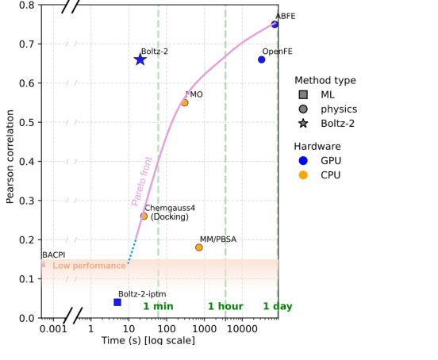
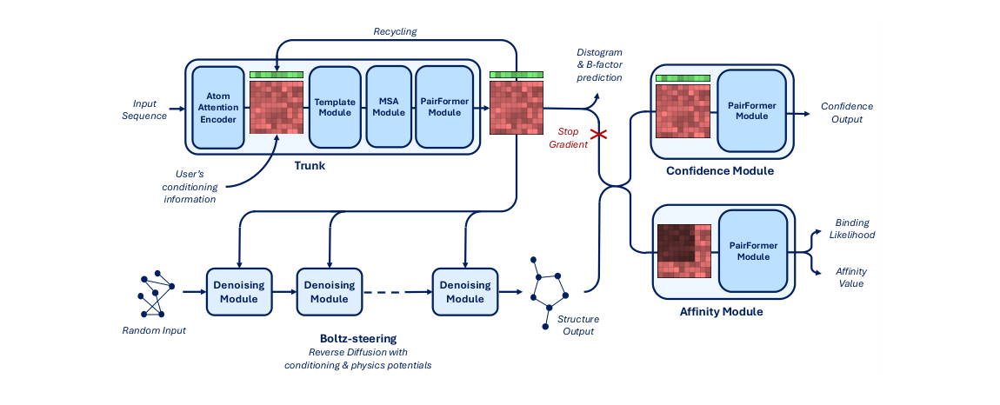
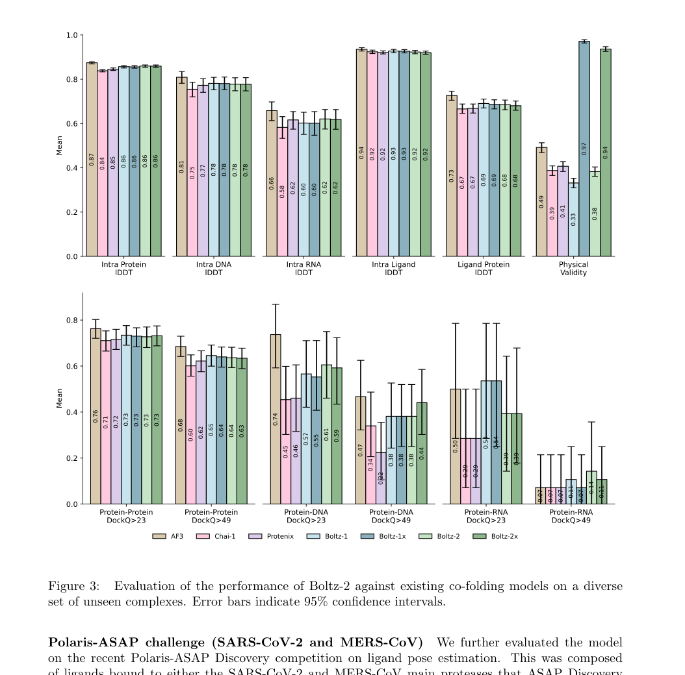
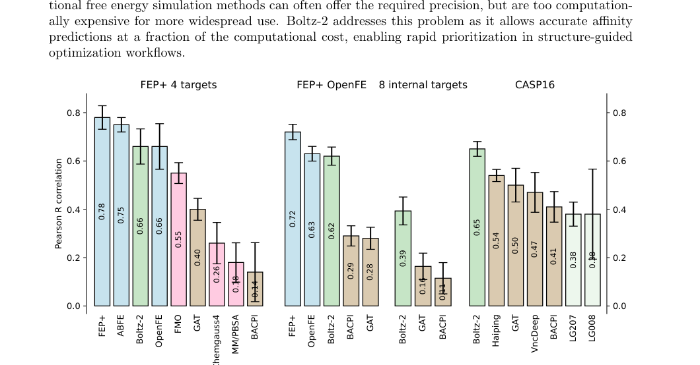
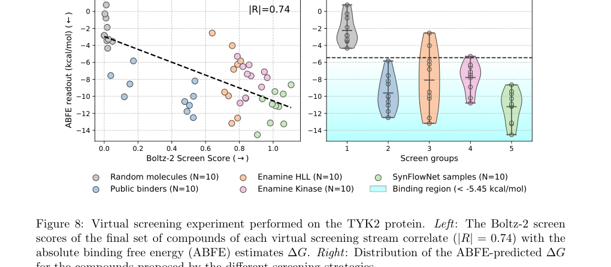

# Boltz-2: Towards Accurate and Efficient Binding Affinity Prediction

### Link: [full article](https://doi.org/10.1101/2025.06.14.659707)

Authors: Saro Passaro, Gabriele Corso, Jeremy Wohlwend, ..., Regina Barzilay

bioRxiv, June 18, 2025

---
**Overview**

Boltz-1 showed that an open-source model can reach AlphaFold3-level accuracy in structure prediction. But predicting a 3D structure is only the first step in drug discovery. The question that really decides whether a compound can become a drug candidate is: **how tightly does the small molecule bind its target protein?**

The most accurate way to compute binding affinity today is free energy perturbation (FEP), but it requires hours to days of molecular dynamics simulation per molecule and cannot be used for large-scale screening. Building on Boltz-1, Boltz-2 adds an **affinity prediction module** that reaches accuracy comparable to FEP methods on the FEP+ benchmark (Pearson r = 0.66 vs ABFE r = 0.75) while running three orders of magnitude faster.

Beyond affinity prediction, Boltz-2 is upgraded across the board in structural accuracy, controllability and dynamics modeling: RNA lDDT jumps from 0.45 to 0.62, a new template module and a multi-dimensional conditioning system are added, and molecular dynamics data are brought in to model flexibility. Using Boltz-1 as the reference point, this post walks through every improvement in Boltz-2, from data and architecture to training and applications.

The paper comes from a joint team at MIT CSAIL, the Jameel Clinic, Valence Labs, Recursion and ETH Zurich, and the model code and weights are fully open-sourced under a permissive license.

## Part 1: Research Question

AlphaFold3 and Boltz-1 answer the question of "what does it look like": given the sequences and structures of a protein and a ligand, they predict the 3D conformation of the complex. In drug design, however, the more central question is "how strongly does it bind": whether a compound can become a drug candidate depends on its **binding affinity** for the target protein.

Existing methods for computing affinity sit at two extremes. At one end is **molecular docking** (e.g. Chemgauss4), which is fast (seconds) but has very low predictive accuracy (Pearson r ≈ 0.28) and is only good for rough initial ranking. At the other end is **free energy perturbation (FEP)**, which is accurate (r ≈ 0.75) but needs thousands to tens of thousands of CPU hours of molecular dynamics simulation per molecule, placing enormous demands on compute. The broad middle ground between speed and accuracy, where a tool would be reasonably accurate and still fast enough, has long lacked a reliable option.

**What this figure asks:** Where does Boltz-2 sit on the accuracy-speed trade-off compared with docking and FEP methods?

{: width="552" height="454" loading="lazy" decoding="async"}

*Figure 1 \| The accuracy-speed trade-off of affinity prediction methods: Boltz-2 reaches r ≈ 0.66 at about 20 GPU seconds per molecule, filling the gap between docking and FEP*

This gap is exactly what Boltz-2 targets. Its ambition goes well beyond bolting on an affinity head: the team set out to build a **complete AI drug-discovery pipeline that starts from sequence, goes through structure prediction and affinity evaluation, and on to virtual screening and molecule generation**. Within this pipeline, Boltz-2 serves as both the structure prediction engine and the affinity evaluation engine.

On the FEP+ 4-target benchmark, Boltz-2 reaches Pearson r = 0.66, close to ABFE (r = 0.75) and OpenFE (r = 0.65), while computing more than 1000 times faster. On the CASP16 affinity track, Boltz-2 outperformed every participant with zero tuning. In virtual screening, Boltz-2 reaches an enrichment factor of 18.4 (at the 0.5% threshold), more than 7 times that of conventional docking.

## Part 2: Methodology: Upgraded training data: from static structures to dynamic ensembles plus affinity labels

Boltz-1 was trained only on static crystal structures from the PDB. Boltz-2 substantially expands the training data along three dimensions: **structural data**, **affinity data** and **synthetic negatives**.

**Expanded structural data**

On top of experimental PDB structures, Boltz-2 adds three important new data sources:

**Molecular dynamics trajectories**: three datasets are included: MISATO (protein-ligand MD), ATLAS (protein MD) and mdCATH (protein domain MD). These trajectories expose the model to the real thermal motion of proteins in solution: side-chain wobble, loop fluctuations and the breathing motions of binding pockets. For MD data, Boltz-2 converts the root-mean-square fluctuation (RMSF) into a B-factor using B = (8π²/3) × RMSF², which serves as a supervision signal for local flexibility.

**NMR ensembles**: NMR experiments naturally produce multiple conformational models (typically 10–20) that represent the conformational distribution of a protein in solution. Boltz-1 did not use this kind of data; Boltz-2 includes it in training to help the model learn conformational diversity.

**Expanded distillation data**: high-confidence predictions from AlphaFold2 and from Boltz-1 itself are used to cover a broader region of sequence space. Compared with Boltz-1's distillation, which used only PDB structures, Boltz-2's distillation is far larger, especially for RNA, and this directly drives the marked gain in RNA structure prediction accuracy.

**Affinity data curation**

Collecting and cleaning affinity data was one of the heaviest data-engineering tasks behind Boltz-2. The team gathered millions of binding measurements from multiple public databases and applied strict quality control:

**Data sources**: ChEMBL + BindingDB provide 1.2 million optimization-stage measurements (Ki, Kd, IC50, EC50, etc.); PubChem HTS provides high-throughput screening data with about 200k binders and 1.8 million decoys; CeMM fragment screens provide 115k decoys; and the MIDAS metabolite dataset adds 20k decoys.

**Unified scale**: all affinity values are converted to a single **log10(μM)** scale. Different experimental readouts such as Ki, Kd, IC50, EC50, AC50 and XC50 are mapped onto the same axis.

**Quality filtering**: PAINS (pan-assay interference compounds) and large molecules with more than 50 heavy atoms are removed; only biochemical or functional assays against a single protein target are kept; low-confidence assays are filtered out; and the train/test split is made at 90% sequence similarity to avoid data leakage.

**Synthetic decoy generation**

Classification needs a large number of negatives (non-binding molecules), but negative results are badly under-recorded in experimental data. Boltz-2 uses a clever synthetic strategy: known binders are randomly shuffled across targets, so that a known binder of target A is assigned to target B as a decoy. The key constraint is that every decoy must have a **Tanimoto similarity below 0.3** to all known binders of that target, which lowers the risk of false negatives. This approach produced 1.2 million synthetic decoys and effectively mitigates the systematic biases in high-throughput screening data.

**Training data overview**

| Data source | Type | Supervision | Binders | Decoys | Targets | Compounds |
|---|---|---|---|---|---|---|
| ChEMBL + BindingDB | Lead optimization | Continuous | 1.2M | 0 | 2k | 600k |
| PubChem small assays | Hit discovery | Mixed | 10k | 50k | 250 | 20k |
| PubChem HTS | Hit discovery | Binary | 200k | 1.8M | 300 | 400k |
| CeMM fragments | Hit discovery | Binary | 25k | 115k | 1.3k | 400 |
| MIDAS metabolites | Hit discovery | Binary | 2k | 20k | 60 | 400 |
| Synthetic decoys | Synthetic | Binary | 0 | 1.2M | 2k | 600k |

## Part 3: Key Figure Analysis

**What this figure asks:** How does the Boltz-2 architecture add a template module, an affinity module and a controllability system on top of Boltz-1?

{: width="1150" height="466" loading="lazy" decoding="async"}

*Figure 2 \| Boltz-2 model architecture: on top of Boltz-1's Trunk + Confidence design, it adds a Template Module, an Affinity Module and an enhanced Controllability system*

Boltz-2's architecture makes four major changes to Boltz-1's trio of trunk, diffusion and confidence.

**Trunk upgrade: deeper, larger, faster**

**PairFormer depth**: increased from 48 layers in Boltz-1 to 64 layers. A deeper PairFormer lets the model capture more complex inter-residue interaction patterns, especially long-range contacts across chains.

**Crop size**: enlarged from 512 tokens to 768 tokens. A larger crop window means the model "sees" more local context during training, which markedly improves coverage of large complexes (such as antibody-antigen complexes and ribosomal subunits).

**Mixed-precision training**: bfloat16 mixed precision is used throughout, sharply reducing memory use and training time while keeping training numerically stable.

**trifast kernel**: the trifast kernel developed for Boltz-1 is inherited and optimized to speed up triangle attention, the most time-consuming operation in the PairFormer.

**Confidence Module redesign**

Boltz-1's Confidence Module used a full PairFormer (48 layers) of the same size as the trunk, which was computationally expensive. Boltz-2 replaces it with a **lightweight 8-layer PairFormer**, greatly reducing the cost of confidence estimation. This change frees up compute budget for the affinity module without sacrificing the quality of the confidence predictions.

**Template Module (new)**

Boltz-1 **does not use template information at all**, an important difference from AlphaFold3. Boltz-2 adds a Template Module that supports the integration of **multi-chain templates**.

Users can supply known homologous structures as references for prediction. Template information is injected into the model as token pair features and can be used in two modes: **soft guidance**, in which the template acts as prior information that influences but does not force the prediction; and **hard constraints** (template steering), in which a physical potential forces the predicted structure toward the template during reverse diffusion.

Multi-chain template support means users can provide reference structures for several chains of a complex at once. This is especially useful for predicting protein-protein interactions, because in many cases we know the monomer structures but are unsure of the orientation at the complex interface.

**Distogram and B-factor prediction heads (new)**

Two new prediction heads are added at the end of the trunk: the **distogram** head predicts inter-residue distance distributions (as probability distributions), and the **B-factor head** predicts the temperature factor (B-factor) of each atom, reflecting local flexibility. These outputs provide structure-level priors for downstream flexibility analysis and conformational sampling. Boltz-1 had neither capability.

### A multi-dimensional controllability system

Boltz-1's controllability was limited to pocket conditioning and basic Boltz-steering physical constraints. Boltz-2 builds a **six-dimensional controllability framework** that lets users guide prediction at several levels:

**1. Method conditioning**: specify the prediction mode as X-ray, NMR or MD, and the model adjusts its prediction style accordingly. For example, in NMR mode the model tends to generate more conformational diversity, and in MD mode it focuses on thermal fluctuations. Boltz-1 had no such capability at all.

**2. Template conditioning**: provide homologous structures as soft references, with multi-chain template support. Template information is encoded as token pair features and injected into the trunk.

**3. Template steering**: a stronger, hard-constraint version that uses a time-dependent physical potential to keep pulling the predicted conformation toward the template throughout reverse diffusion. It suits cases where there is a high-confidence structural prior.

**4. Contact conditioning**: users specify distance constraints between particular residue or atom pairs (in the 4–20Å range), encoded as token pair features. This is well suited to integrating experimental constraints such as cross-linking mass spectrometry and FRET.

**5. Pocket conditioning**: specify the protein residues where the ligand should bind. Boltz-1 already had this feature; Boltz-2 enhances it.

**6. Contact/pocket steering**: like template steering, it uses time-dependent potentials during diffusion to enforce contact and pocket constraints as hard constraints.

The difference between conditioning and steering is this: conditioning "suggests" to the model through its internal feature representations, and the model weighs all the information to make the final decision; steering applies forces directly on the diffusion trajectory through external potentials, which is closer to a physical constraint. Users can choose the appropriate strength according to how confident they are in their prior information.

### The affinity module

The affinity module is the most important new component of Boltz-2 relative to Boltz-1 and the center of gravity of the paper's technical contribution. Its design idea is to **extract binding-strength information directly from the pair representation learned during co-folding**, because these representations naturally encode the spatial contact patterns and chemical interactions between protein and ligand.

**Inputs and architecture**

The affinity module takes three kinds of input signal:

**Trunk pair representation**: global interaction information between residue-atom pairs distilled by the 64-layer PairFormer.

**3D geometric features**: distances and orientations of protein-ligand atom pairs extracted from the predicted 3D coordinates, capturing spatial complementarity.

**Intra-ligand geometric features**: conformational information about the ligand itself (bond angles, torsion angles, etc.), reflecting how well the ligand fits in the binding pocket.

These inputs are integrated by a **dedicated PairFormer**. This PairFormer makes one key design choice: it attends only to **protein-ligand interactions** and **intra-ligand interactions**, and uses a mask to block residue-residue interactions within the protein. The protein's own folding state has little to do with ligand binding strength, so removing this redundant information lets the model focus on the signals that actually matter.

The PairFormer output is compressed into a global representation by mean pooling and then fed to two separate output heads:

**Binding Likelihood head**: predicts whether the ligand is a true binder of the protein (a binary classification task). This is a qualitative "can it bind?" judgment, used mainly for high-throughput filtering in virtual screening, quickly discarding clear non-binders from libraries of millions of compounds.

**Affinity Value head**: predicts a continuous binding affinity value (a regression task) whose output can be read approximately as an IC50 on the log10(μM) scale. This is a quantitative "how strongly does it bind?" prediction, used in the hit-to-lead and lead optimization stages to rank compounds within the same series finely.

An important caveat: because the training data mix different measurement types such as Ki, Kd, IC50, EC50 and XC50, **the affinity value is best understood as an approximate IC50-level ranking score**. Comparisons are most meaningful within the same assay or chemical series, and directly comparing absolute values across assays calls for caution.

### Affinity training methodology

Training the affinity module involves several carefully designed strategies that address problems inherent to biological assay data: cross-assay bias, sparse labels and uncertain qualifiers.

**Two-stage training**

Training is strictly split into two stages. **Stage one** completes structure prediction and confidence training (similar to Boltz-1), so that the trunk has mature structural awareness. **Stage two** freezes the trunk's gradients and trains only the affinity module's parameters. This freezing strategy is essential: if affinity training were allowed to backpropagate into the trunk, structure prediction accuracy would degrade from over-optimizing the affinity objective.

**Pocket precomputation and affinity cropping**

A full protein-ligand pair representation can contain tens of thousands of token pairs, and keeping all of them would blow up memory. Boltz-2 adopts a pocket precomputation strategy:

For each target protein, 10 known binders are randomly selected, the complex structure of each is predicted, protein-ligand atom distances are computed, and a consensus pocket is derived. **Affinity cropping** is then applied: at most 256 tokens are kept, with a cap of 200 protein tokens, using a local neighborhood expansion of about 10 tokens around the pocket center.

This strategy **cuts the memory cost of affinity training by 5 times**, and by focusing the pair features on the pocket region it also filters out distant, irrelevant information.

**Activity cliff sampling**

One of the biggest challenges in affinity training is that absolute values carry systematic biases between assays (IC50 can differ by several orders of magnitude under different experimental conditions), whereas the relative ranking of compounds within the same assay is reliable.

Boltz-2's solution is **activity cliff sampling**: each training batch samples 5 compounds from **the same assay**. Assays are sampled with weights set by the **interquartile range (IQR)** of their affinity values. A larger IQR means compound activity varies more within the assay and contains more "activity cliff" signal (pairs in which a small structural change causes a dramatic change in activity), making it more valuable for training. For the classification task, 1 binder + 4 decoys are sampled.

**Pairwise affinity loss**

The loss design is the most elegant part of the whole affinity training scheme:

**Ltotal = 0.9 × Ldif + 0.1 × Labs + Lbinary**

**Ldif** (pairwise difference loss, weight 0.9): the prediction error on the affinity **difference** between every pair of compounds within the same assay. This is the core signal: taking differences **naturally cancels systematic cross-assay bias**. If assay A reads 1 log unit too high overall, that offset disappears once differences are taken.

**Labs** (absolute value loss, weight 0.1): directly predicts absolute affinity values, using a Huber loss (more robust to outliers). Its weight is low and it mainly serves as an anchor.

**Lbinary** (binary classification loss): binder vs decoy classification, using a focal loss (which gives more weight to hard examples).

**Censor-aware handling**: experimental data often carry ">" or "&lt;" qualifiers (e.g. IC50 > 10 μM, where we only know the activity is below some threshold but not the exact value). The loss treats such censored values specially, so that a bound is not trained on as if it were an exact value.

The core insight of this scheme is that **in medicinal chemistry practice, the relative ranking of compounds within a series matters far more than absolute values across series**. The 0.9 weight on the pairwise difference loss reflects this priority.

### Structure prediction accuracy

**What this figure asks:** On PDB structures newly released in 2024-2025, how much stronger are Boltz-2's structure prediction metrics than those of AF3 and Chai-1?

{: width="1054" height="1040" loading="lazy" decoding="async"}

*Figure 3 \| Comparison of Boltz-2 with AlphaFold3, Chai-1, Protenix and Boltz-1 on 12 structure prediction metrics (PDB structures newly released in 2024–2025)*

On PDB structures newly released in 2024–2025, Boltz-2's structure prediction accuracy improves over Boltz-1 in a clear pattern:

**RNA structure prediction: the biggest breakthrough**. Boltz-2's Intra RNA lDDT jumps from about 0.45 for Boltz-1 to about 0.62, an improvement of nearly 40%. This breakthrough is directly attributable to the introduction of large-scale RNA distillation data: Boltz-1 had limited RNA training data, whereas Boltz-2 extends data coverage using RNA predictions from AlphaFold2 and from itself.

**DNA-protein complexes**: another modality with a marked gain. The expanded training data and deeper PairFormer improve the model's ability to model nucleic acid-protein interfaces.

**Intra-protein structure** (Intra Protein lDDT): Boltz-2 is on par with AlphaFold3 and slightly better than Boltz-1. Protein monomer folding is already quite mature, leaving limited room for improvement.

**Protein-protein interfaces** and **protein-ligand interfaces**: close to or slightly better than Boltz-1.

**Antibody-antigen**: a clear improvement over Boltz-1 (a higher fraction with DockQ > 0.49), but still behind AlphaFold3. This remains an open problem for open-source models.

**Polaris-ASAP drug discovery challenge**: an 84.8% success rate, submitted directly without fine-tuning.

**Physical plausibility**: Boltz-2x (with steering) reaches about 96% physical plausibility (no broken bonds, no atomic clashes), on par with Boltz-1x (97%).

Overall, on structure prediction Boltz-2 achieves "no regressions anywhere, breakthroughs where it counts": it adds substantial affinity prediction capability without sacrificing core structure prediction quality.

### Dynamic conformations and flexibility prediction

Under physiological conditions proteins are dynamic: side chains wobble constantly, loops open and close repeatedly, and binding pockets switch between "open" and "closed" states. Boltz-1 could only predict static structures; by bringing in MD training data and method conditioning, Boltz-2 takes a first step toward modeling conformational ensembles.

**RMSF prediction accuracy**: on the mdCATH dataset, Boltz-2's per-target RMSF Pearson correlation reaches 0.79; on the ATLAS dataset it reaches 0.85. This means **the model can predict fairly accurately how flexible each site of a protein is**: which regions form a rigid core and which are flexible loops.

**Comparison with specialized models**: Boltz-2's RMSF prediction accuracy is on the same level as BioEmu and AlphaFlow, models designed specifically for conformational ensembles. Those two models take reproducing the diversity of MD trajectories as their core goal, whereas Boltz-2 picked up this ability as a side effect.

**Limitations**: on diversity metrics, Boltz-2 still trails BioEmu and AlphaFlow. The model is better at predicting "where it is flexible" than at "generating many distinct conformations": at present it behaves more like a predictor of the amplitude of dynamics than a full reproduction of the conformational distribution of an MD trajectory.

With MD conditioning turned on, the diversity of the generated conformational ensembles increases. This offers early support for "induced-fit" scenarios in drug design: large-scale conformational changes remain hard to capture, but local adjustments in the pocket region have already improved.

### Affinity prediction benchmarks

**What this figure asks:** How does Boltz-2 perform on four affinity benchmarks compared with FEP+ and other scoring functions?

{: width="1060" height="554" loading="lazy" decoding="async"}

*Figure 6 \| Boltz-2 on four affinity benchmarks: FEP+ 4-target, the full OpenFE set, 8 internal assays and CASP16*

The paper validates affinity prediction comprehensively on four independent benchmarks, each representing a different application scenario:

**Benchmark 1: FEP+ 4-target (CDK2, TYK2, JNK1, P38)**

This is the classic benchmark of the FEP field, with experimental affinities for dozens of congeneric compounds on each of four kinase targets. The results:

* **Boltz-2: R = 0.66** (about 20 GPU seconds per molecule)
* FEP+: R = 0.78 (thousands of CPU hours per molecule)
* ABFE: R = 0.75 (>20 GPU hours per molecule)
* OpenFE: R = 0.66 (6–12 GPU hours per molecule)
* FMO: R = 0.55
* Chemgauss4 (docking): R = 0.26
* MM/PBSA: R = 0.18
* BACPI (ML): R = 0.14

Boltz-2 matches OpenFE in accuracy (both at 0.66), but the speed gap is enormous: OpenFE needs 6–12 GPU hours per molecule, while Boltz-2 needs only about 20 GPU seconds, **roughly 1000–2000 times faster**.

**Benchmark 2: the full OpenFE set (876 complexes)**

A large-scale validation covering more targets and chemical series. Boltz-2 reaches R = 0.62 and OpenFE R = 0.63, essentially the same accuracy. The machine learning baselines GAT (R = 0.28) and BACPI (R = 0.29) lag far behind.

**Benchmark 3: CASP16 affinity track**

CASP16 is the "Olympics" of structure prediction. On the affinity prediction track of 140 protein-ligand pairs, Boltz-2 reaches R = 0.65, **outperforming every participant (best competitor about R = 0.54)**.

It is worth stressing that many participating teams used custom inputs and task-specific fine-tuning, whereas Boltz-2 was **submitted directly with zero tuning**, with no adaptation to the CASP16 targets.

**Benchmark 4: Recursion internal 8-target medicinal chemistry evaluation**

This is the validation closest to real drug discovery. The 8 assays come from Recursion's active programs and cover different protein families. Boltz-2's average R = 0.39 (range 0.165–0.634), far above the ML baselines GAT (R = 0.16) and BACPI (R = 0.11).

**Candid about instability**: R varies widely across assays (lowest 0.165, highest 0.634), showing that the model's generalization across protein families and chemical spaces is still uneven. Performance is limited on some GPCR targets, which are also a known weak spot of FEP methods and may be related to the special conformational environment of membrane proteins.

### Virtual screening

One of the ultimate applications of affinity prediction is large-scale virtual screening: picking likely active molecules out of hundreds of thousands to millions of compounds. Boltz-2 was evaluated comprehensively on the MF-PCBA virtual screening benchmark:

**Average precision (AP)**: Boltz-2 = 0.0248, GAT = 0.0133, BACPI = 0.0131, Chemgauss4 = 0.0051

**Enrichment factor (EF@0.5%)**: Boltz-2 = 18.39 (among the top 0.5% of predictions, actives are 18.39 times denser than at random)

**Enrichment factor (EF@1%)**: Boltz-2 = 13.95

**AUROC**: Boltz-2 = 0.812

A particularly meaningful finding is that Boltz-2's **affinity module is far better suited to virtual screening than the structural confidence score**. Screening with Boltz-2's ipTM (interface predicted TM-score, a structural confidence metric) gives an AP of only 0.0046, just 1/5 of the affinity module's. This shows that accurate structure prediction does not mean the model can judge binding strength: a molecule can adopt a reasonable binding pose in the pocket (high ipTM) yet bind weakly, and vice versa. The affinity module learns a deeper signal of binding strength.

## Part 4: Key Contributions

**What this figure asks:** In a prospective virtual screen against TYK2, how well do Boltz-2 scores correlate with ABFE calculations?

{: width="1020" height="446" loading="lazy" decoding="async"}

*Figure 8 \| Prospective virtual screening on TYK2: correlation between Boltz-2 scores and ABFE calculations (left), and the ABFE distribution of candidate molecules from different sources (right)*

The paper designs a complete end-to-end drug discovery workflow validation with the TYK2 kinase as the target, carried out in two steps:

**Step 1: screening fixed compound libraries**

Two commercial libraries were screened: the Enamine Hit-Likeness Library (HLL, about 460k molecules) and the Enamine Kinase Library (about 65k molecules). Boltz-2 predicted an affinity score for every molecule; the Top-10 from each library plus 10 random molecules were then sent to ABFE for independent validation:

* HLL Top-10: **8/10** predicted by ABFE to be binders
* Kinase Library Top-10: **10/10** predicted by ABFE to be binders
* 10 random molecules: **all** predicted by ABFE to be non-binders

**Step 2: de novo molecule generation (SynFlowNet)**

A more ambitious test coupled Boltz-2 with SynFlowNet, a GFlowNet generative model, to search chemical space directly for new molecules. SynFlowNet samples molecules from the **Enamine 76B REAL synthesizable chemical space** (76 billion synthesizable molecules), with Boltz-2 binding scores as the reward signal.

* About 400k molecules were sampled, and 117k unique molecules were evaluated by Boltz-2
* 10 diverse candidates were selected, and **all were predicted by ABFE to be binders**
* The average affinity of the generated molecules was **higher** than that of the best candidates from the fixed commercial libraries
* Correlation between Boltz-2 scores and ABFE: \|R\| = 0.74
* The maximum Tanimoto similarity to known TYK2 ligands was only 0.396: **these are entirely new chemical scaffolds**

This result shows Boltz-2's potential as an "AI drug-discovery engine": starting from sequence, it predicts structure, evaluates affinity, and steers a generative model through a chemical space of tens of billions of molecules, ultimately yielding synthesizable candidates with new scaffolds.

**Three important caveats**

The paper candidly notes three limitations of the TYK2 experiment: (1) ABFE validation is not a wet-lab experiment, and the final candidates have not yet been confirmed in vitro or in vivo; (2) TYK2 is a "favorable" target for affinity prediction (R = 0.83 in benchmarking, above average), so the results may not represent performance on all targets; (3) toxicity, solubility and selectivity of the candidates were not evaluated, and these are just as critical in real medicinal chemistry.

## Part 5: Limitations and Outlook

The Boltz-2 paper devotes considerable space to a candid discussion of the model's limitations. For teams that want to use Boltz-2 in real drug programs, understanding these boundary conditions is essential:

**1. Cascading structural errors**: the affinity module's input is the predicted 3D structure. If the binding pocket is predicted inaccurately (wrong pocket, wrong ligand pose), the affinity prediction becomes unreliable as well. Structure prediction and affinity prediction are tightly coupled, and upstream errors are amplified downstream.

**2. Missing biological context**: the current model does not explicitly handle cofactors, structural waters, metal ions and the like. These play key roles in the binding mechanisms of many enzymes (such as metalloproteases) and receptors. Their absence may make affinity predictions systematically low for certain targets.

**3. A fixed 256-token affinity crop window**: the affinity module only "sees" a region of at most 256 tokens around the pocket. This means allosteric effects, where ligand binding at one site affects the behavior of a distant site, cannot be captured at all. For allosteric drug design this is a fundamental limitation.

**4. Large-scale conformational change**: despite the MD data, the model still struggles to predict large conformational rearrangements such as induced fit. A protein may undergo substantial domain motions upon ligand binding, and neither the current diffusion architecture nor the scale of the training data is sufficient to capture such changes reliably.

**5. Unstable generalization across assays**: on the 16-assay validation set, the per-assay Pearson R ranges from 0.056 to 0.732, a spread of more than 10-fold. This shows that the model's generalization remains limited for some protein families and chemical spaces. When using Boltz-2 on a new target, users should first calibrate expectations on known active compounds.

**6. Inherent noise from data cleaning**: in the training data, IC50 values were not converted to Ki, cell-based and biochemical assay data are mixed together, and an estimated ~40% of the HTS data are false positives. This noise caps the achievable accuracy of affinity prediction.

**7. No complete ablation study**: because the model is so large (64-layer PairFormer + expanded data + affinity module), the paper could not run independent ablations for each improvement. We cannot know exactly how much of the accuracy gain comes from the deeper network, how much from more data and how much from the training strategy.

### Boltz-1 → Boltz-2 upgrades at a glance

| Dimension | Boltz-1 | Boltz-2 |
|---|---|---|
| **Binding affinity** | Not supported | New affinity module approaching FEP accuracy (R = 0.66) |
| **Virtual screening** | Only via ipTM (poor) | Dedicated binding likelihood head (EF@0.5% = 18.4) |
| **Templates** | Not used | Multi-chain templates, soft guidance + hard constraints |
| **Training data** | Static PDB structures | PDB + MD trajectories + NMR ensembles + expanded distillation + affinity data |
| **Controllability** | Pocket conditioning + basic steering | Method + template + contact + pocket conditioning, each with a steering version |
| **PairFormer** | 48 layers | 64 layers |
| **Confidence Module** | Full 48-layer PairFormer (expensive) | Lightweight 8-layer PairFormer |
| **Crop size** | 512 tokens | 768 tokens |
| **RNA accuracy** | lDDT ≈ 0.45 | lDDT ≈ 0.62 (+38%) |
| **Dynamics** | Not supported | B-factor prediction + MD conditioning + RMSF correlation 0.79–0.85 |
| **Distogram** | Not supported | Trunk outputs distance distributions |
| **Precision (mixed)** | float32 | bfloat16 mixed precision |

## About the Corresponding Authors

Saro Passaro, Gabriele Corso and Jeremy Wohlwend are the co-corresponding authors of this paper; all three are at MIT CSAIL and the MIT Jameel Clinic and are core developers of Boltz-1. The Boltz-2 author team expands substantially on Boltz-1, adding collaborators from Valence Labs, Recursion and ETH Zurich, which reflects the model's extension from pure structure prediction toward drug discovery applications. Stephan Thaler (Valence Labs / Recursion) is a core contributor to the affinity module, and Vignesh Ram Somnath (ETH Zurich) led the design for coupling the generative model (SynFlowNet) with Boltz-2. The senior advisor, Professor Regina Barzilay (MIT CSAIL, School of Engineering Distinguished Professor), has worked on AI for drug discovery for many years, and her body of work has provided sustained momentum for taking Boltz from an academic prototype to real-world applications.

## Citation

Passaro, S., Corso, G., Wohlwend, J., Reveiz, M., Thaler, S., Somnath, V. R., ... & Barzilay, R. (2025). Boltz-2: Towards Accurate and Efficient Binding Affinity Prediction. bioRxiv. https://doi.org/10.1101/2025.06.14.659707
