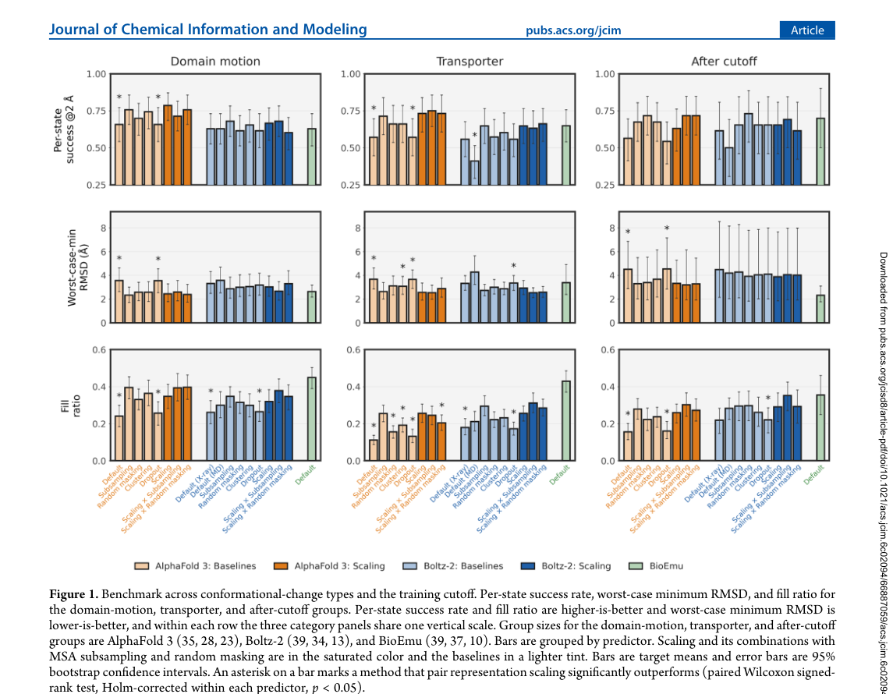
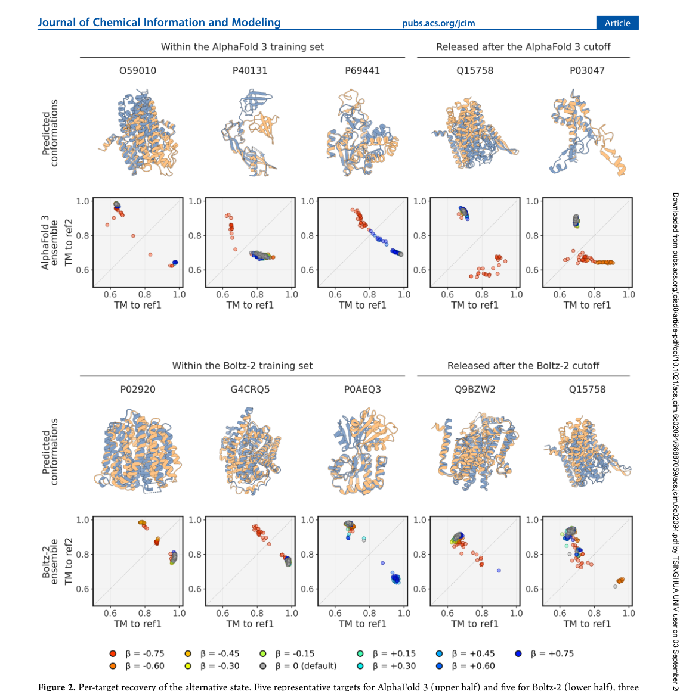
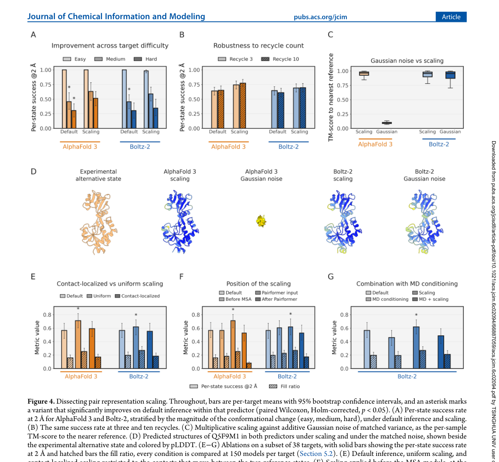
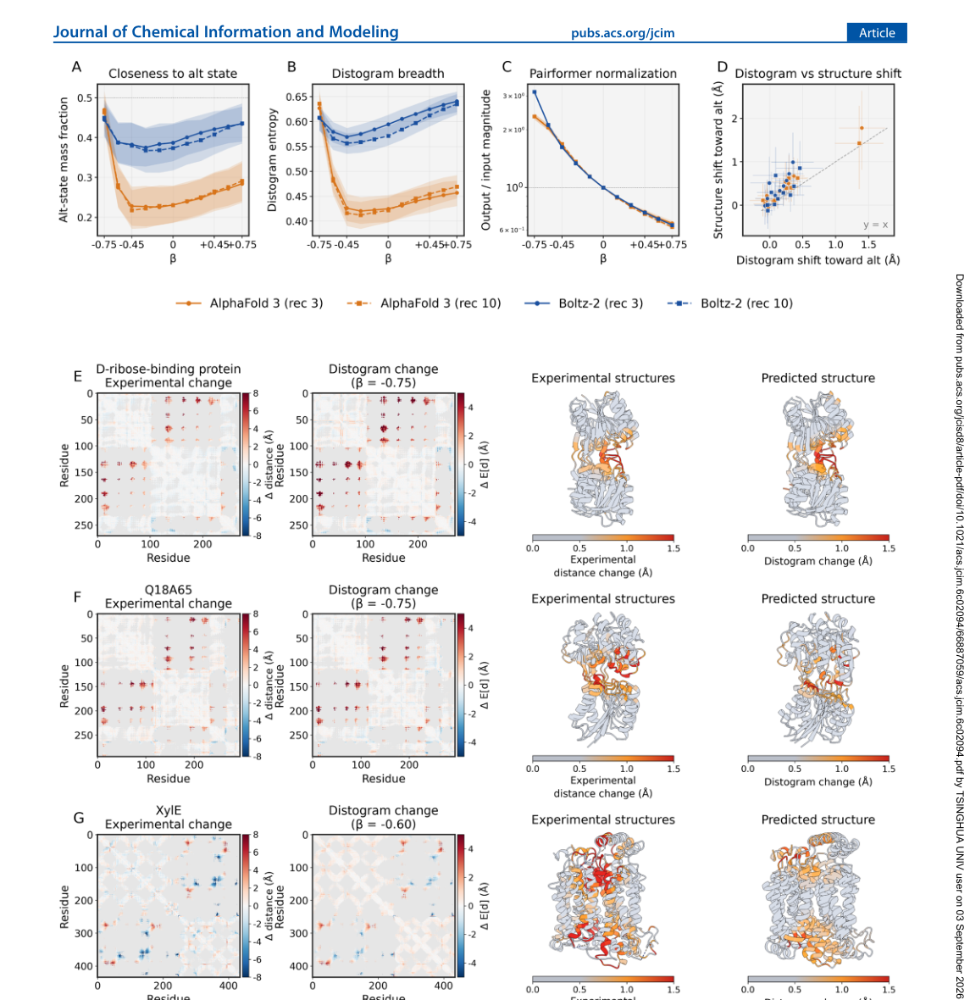

# Biasing Conformational Sampling in AlphaFold 3 and Boltz-2 via Pair Representation Scaling

### 原文链接：[全文](https://doi.org/10.1021/acs.jcim.6c02094)

作者：Shosuke Suzuki, Toshiyuki Amagasa

Journal of Chemical Information and Modeling，2026 年 8 月 20 日

---
AlphaFold 3 和 Boltz-2 预测蛋白质结构的能力已经很强，但它们有一个共同的短板：**倾向于只给出一个主导构象，忽略蛋白质在功能状态之间切换的动态性**。

这篇文章提出了一个极简的推理时干预方法：在 Pairformer trunk 的入口处，把 pair representation 统一乘上一个标量 (1+β)。这个操作不需要重训练、不需要辅助模型、甚至不需要额外的前向传播——本质上是在推理代码里加了一次张量乘法。

在 86 个双态蛋白上测试，AlphaFold 3 的替代构象命中率从 0.60 提升到 **0.73**；更关键的是，作者通过高斯噪声对照、位置消融和 distogram 分析证明，这个操作是对模型内部已编码的两态信息进行**定向重加权**，而非随机扰动。

## 一、研究问题

蛋白质在体内常常在多个构象之间切换来执行功能——转运蛋白在 inward-facing 和 outward-facing 之间翻转，激酶在 open 和 closed 之间摆动。但 AlphaFold 3 和 Boltz-2 这类深度学习结构预测模型，默认推理时通常只输出一个最主导的构象。

现有的解决思路主要在**输入端做文章**：削弱或拆分 MSA（多序列比对）中的主导共进化信号，期望让替代态浮现出来。典型的方法包括 MSA subsampling、random masking 和 AF-Cluster 风格的 MSA 聚类。但这些方法的问题是：需要 MSA 才能生效，成本随 MSA 深度增长，且没有提供一个可解释的单一控制参数。

这篇文章的核心问题是：

**能否绕过输入层干预，直接在模型的内部表示上找到一个简单、可解释的"旋钮"，来控制构象采样的偏好？**

## 二、方法核心：Pair Representation Scaling

AlphaFold 3 和 Boltz-2 都共享一种关键的内部架构：一个 **Pairformer trunk** 负责迭代精炼 single representation 和 pair representation，然后将它们传给一个 **diffusion module** 生成三维坐标。其中，**pair representation z** 编码了每对残基 (i, j) 之间的潜在关系——混合了共进化信号、几何约束和相互作用倾向——它是结构模块的主要条件输入。

作者的操作极其简单：

**zscaledij = (1 + β) · zij**

在每次 recycle 时，把 pair representation 统一乘上一个标量 (1+β)，然后送入 Pairformer。

β = 0 就是默认推理。作者扫描了 β ∈ {±0.15, ±0.30, ±0.45, ±0.60, ±0.75}，总共 10 个设定，再与不同随机种子组合，形成一个 250 结构的采样集（与 default inference 的 250 结构预算相同）。

这个方法的关键优势在于：

**不改输入**——序列和 MSA 保持原样

**不改参数**——模型权重不动，不需要重训练或微调

**不加计算**——不需要第二次前向传播或辅助模型

**跨模型迁移**——AF3 和 Boltz-2 都围绕 Pairformer + diffusion 架构，同一个操作直接适用

直觉上，pair representation 是把序列/MSA 里的进化约束传递给结构模块的主通道。如果模型内部已经隐含编码了多个构象的信息，那么调节这个内部耦合场的整体强弱，就可能改变 diffusion 采样最终偏向哪个构象盆地——就像调节一个景观地图的等高线对比度，让原本被淹没的次要盆地浮现出来。

## 三、看图说话

### 数据集与评估指标

作者收集了 **86 个 two-state targets**，每个目标都有两个实验确定的参考构象：

**39 个 domain-motion 蛋白**——典型的铰链运动、开闭运动

**47 个膜转运蛋白**——inward-facing / outward-facing 状态切换

Benchmark 按三个组分别报告结果：**domain motion**、**transporter**、以及一个关键的 **after-cutoff** 组（替代构象在模型训练截止日期之后才进入 PDB 的目标）。after-cutoff 组的意义在于：**排查模型是否只是"背过答案"才能找到替代态**。

评估使用三个互补指标：

**Per-state success rate**——两个参考态中，各有多少能在采样集中被 2 Å RMSD 以内命中

**Worst-case minimum RMSD**——两个参考态中更难恢复的那个，最近的模型有多接近

**Fill ratio**——采样结构是否覆盖了两态之间的完整构象路径，而非只堆在一端

比较对象包括：default inference、MSA subsampling、random masking、MSA clustering、inference-time dropout、Boltz-2 的 MD-conditioned mode，以及专门做 ensemble 的生成模型 BioEmu。

*▼ Figure 1：三组 × 三指标的全面 benchmark*

**这张图想回答：**Pair Representation Scaling 在三种折叠模型上如何可控地采样替代构象？

{: width="1145" height="890" loading="lazy" decoding="async"}

### AlphaFold 3 上效果最明显

在 AlphaFold 3 上，pair representation scaling 的提升非常显著：

**Per-state success rate**：从默认推理的 **0.60** 提升到 **0.73**，domain motion 和 transporter 两组均显著改善

**Fill ratio**：两组都有提升，transporter 组翻倍以上

**Worst-case minimum RMSD**：三组均显著下降

**After-cutoff 组**：worst-case minimum RMSD 平均改善 **1.18 Å**，证明提升不依赖于模型训练时见过替代态

### Boltz-2 上也有收益，但需要组合策略

Boltz-2 上三个指标方向一致地改善，fill ratio 的提升在所有三组中达到统计显著。但整体幅度弱于 AlphaFold 3。作者认为原因在于 Boltz-2 的训练数据中包含了 MD ensemble，使得它默认的构象覆盖已经更宽，对内部扰动更鲁棒。

一个实用的发现是：**Boltz-2 + MSA subsampling 的组合效果最强**——"内部表示干预"与"输入 MSA 干预"互补。在 AlphaFold 3 上，scaling 单独已经足够强，组合的边际收益较小。

*▼ Figure 2：代表性目标的构象散点图（灰 = 默认推理，彩色 = 不同 β 的 scaling）*

**这张图想回答：**内部 distogram 分布是否真的朝替代态方向移动，而非随机扰动？

{: width="1145" height="1160" loading="lazy" decoding="async"}

## 四、核心贡献总结

这篇文章最有价值的部分在于：作者不满足于报告"有效"，而是系统性地论证了 scaling 是对模型内部已编码的两态信息进行定向重加权，而非简单加噪声。证据链包括四个关键实验。

### 实验一：高斯噪声对照

给 pair representation 加上方差匹配的高斯噪声（噪声强度与 scaling 带来的改变量相当），测试"有效是否只是因为加了扰动"。

结果在 AlphaFold 3 上非常清楚：**高斯噪声直接导致结构崩坏和严重空间冲突**，恢复不了任何参考态；而 scaling 能保持合理折叠并找回替代态。这说明 scaling 的效果来自**乘法缩放保留了表示的方向结构**，是有组织的调制而非任意扰动。Boltz-2 对噪声更鲁棒一些，但噪声同样无法复现 scaling 的定向收益。

### 实验二：位置消融——必须加在"对的位置"

作者测试了三个施加位置：MSA module 之前、Pairformer 输入处、Pairformer 之后。**只有 Pairformer 输入处有效。**

在 MSA module 之前加：后面的 outer-product mean 操作会把扰动吸收掉。在 Pairformer 之后加：直接改动传给 diffusion module 的条件信号，反而让 ensemble 变窄。这说明关键在于让 Pairformer 重新处理被缩放后的 pair signal——Pairformer 的注意力和投影机制会将全局幅度变化转化为有结构意义的内部重组织。

### 实验三：全局 vs 局部缩放

作者做了一个"oracle"实验：利用两个参考态的真实信息，只对那些距离变化超过 4 Å 的 residue pairs 进行局部缩放。令人意外的是，**局部缩放的效果不如全局统一缩放**。这表明模型内部的构象偏好编码是分布式的，有效因素是 pair representation 整体幅度的全局调节，而非对少数关键接触的点对点操控。

*▼ Figure 4：消融实验（A-B: 难度分层和 recycle 稳健性；C-D: 噪声对照；E-G: 局部/位置/MD 消融）*

**这张图想回答：**缩放因子的大小与采样到的构象距离之间是否呈现剂量-反应关系？

{: width="1145" height="1060" loading="lazy" decoding="async"}

### 实验四：Distogram 分析——内部距离分布朝替代态方向移动

Distogram 是模型对每对残基距离分布的预测，它是 post-Pairformer pair representation 的线性投影，适合用来"读出" pair latent 里的信息。作者在发生距离变化的 residue pairs 上观察到：

Scaling 后 distogram 在替代态一侧的概率质量上升，分布熵增大

逐 target 比较中，AF3 改善 recovery 的 35 个目标里 **34 个**的 distogram shift 与实验两态差异正相关（中位 Pearson r = 0.56）

更多 residue pairs 在 scaling 后出现双峰分布，双峰位置与两个参考态距离吻合

这条证据非常强：它说明 scaling 在 residue-pair 距离分布层面系统性地把概率往替代态几何方向推，模型内部变化的方向与真实构象转变方向一致。

*▼ Figure 5：Distogram 分析（A-C: 替代态质量/熵/归一化 vs β；D: shift 与实验差异的相关性；E-G: 三个案例详解）*

**这张图想回答：**结合 MSA 深度调整和分子动力学模拟，Pair Scaling 能带来哪些补充发现？

{: width="1145" height="1180" loading="lazy" decoding="async"}

### 两个重要的补充结果

### 去噪轨迹的转向

作者追踪了 AlphaFold 3 的 diffusion denoising 轨迹。默认推理下，整个去噪过程中结构始终更靠近主导态。Scaling 之后，一旦 backbone 开始成形，轨迹会转到替代态一侧。在两个展示案例中，一个 40/50 条轨迹切到替代态侧，另一个 50/50 全部切过去。这说明 scaling 在 trunk 里施加的条件变化，确实被 diffusion 过程"读懂并执行"了。

### Sequence-only 模式下仍有收益

去掉 MSA 后，两种模型整体性能明显下降，但 AlphaFold 3 上 scaling 仍保留可测收益。特别是一些膜转运蛋白，默认 sequence-only 推理会错得很离谱，而**负 β 值的 scaling 可以把它"救回"近天然结构**。这说明 scaling 的有效性不完全依赖 MSA 中的共进化信息——即使只靠单序列，模型内部 pair representation 中仍有可被调节的结构先验。

## 五、局限与展望

作者对方法的局限性讨论比较诚实：

**效果 target-specific**：最佳 β 的方向和大小因蛋白而异，86 个目标中没有一个呈现 β 与恢复质量的严格单调关系。实际使用中，如何在没有参考结构时选出"生物学正确的替代态"仍是未解决的问题

**Benchmark 局限**：只覆盖了 two-state 单链蛋白，尚未验证对 intrinsically disordered regions、多状态体系、蛋白复合物和 ligand-induced rearrangement 的适用性

**不能给出热力学占比**：能采样出替代态，但推理时的采样频率不等于真实平衡 Boltzmann population

### 总结与启示

这篇文章的核心贡献可以压缩成一条证据主线：

1\. 提出方法 → 2. 86 targets benchmark 验证有效 → 3. after-cutoff 仍有效（不是背答案）→ 4. 匹配噪声不行（不是随机扰动）→ 5. 局部缩放不行（分布式编码）→ 6. 只在 Pairformer 输入有效（需要重处理）→ 7. distogram 朝替代态移动（内部变化方向与实验一致）→ 8. denoising 轨迹转向（条件变化被 diffusion 落实）→ 9. 无 MSA 也部分有效（不纯是共进化输入效应）

在方法层面，这篇工作是从 **input engineering**（操控 MSA 输入）走向 **representation engineering**（操控内部潜在表示）的一个清晰案例。它表明控制 AlphaFold 类模型输出的关键，不一定只在输入端做文章，直接操控内部 latent 可以提供更简洁、更可解释的控制手段。

在认知层面，这篇文章支持了一个越来越强的观点：**AlphaFold 类模型的 pair latent 中已经隐式编码了蛋白质的构象异质性信息，默认采样只是没有把它充分显化出来。**问题出在 readout/采样机制偏向单一主峰，而非模型不知道替代态的存在。

**通讯作者**

Shosuke Suzuki 和 Toshiyuki Amagasa 均为本文通讯作者，来自日本筑波大学（University of Tsukuba；Suzuki 在理工学研究科，Amagasa 在计算科学中心）。Amagasa 教授的研究方向涵盖数据库系统、数据工程和机器学习在科学数据中的应用，近年来聚焦于将深度学习方法与蛋白质结构预测相结合。本文是该团队在蛋白质构象采样控制方面的代表性工作，发表于 Journal of Chemical Information and Modeling（IF 6.4），2026 年 6 月 24 日投稿，8 月 11 日接收，审稿周期约 48 天。

## 引用

Suzuki, S., & Amagasa, T. (2026). Biasing Conformational Sampling in AlphaFold 3 and Boltz-2 via Pair Representation Scaling. Journal of Chemical Information and Modeling. https://doi.org/10.1021/acs.jcim.6c02094
