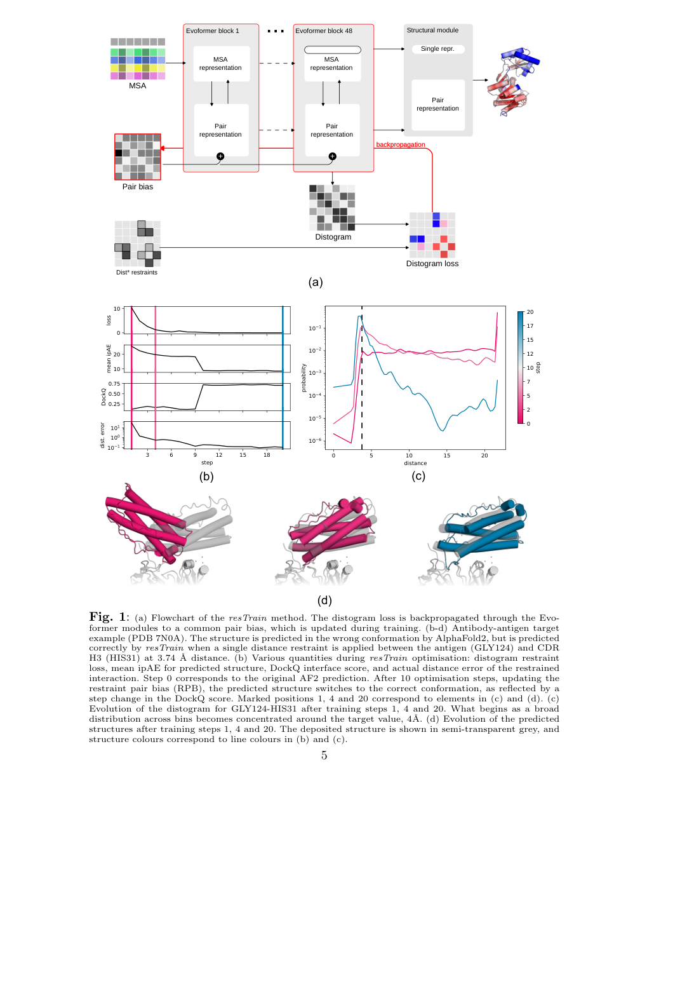
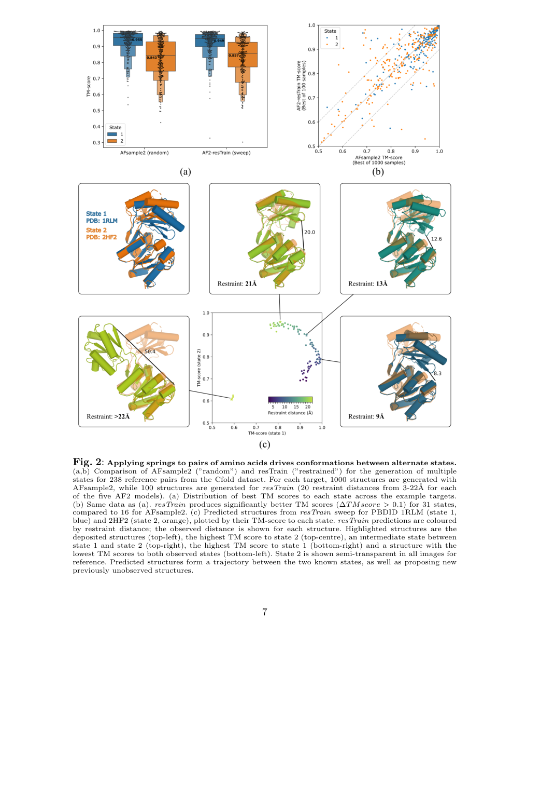
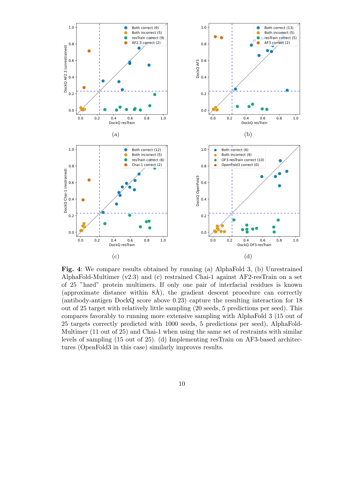

# A generalisable framework to inject distance information into Alphafold-like structure predictors

### 原文链接：[全文](https://doi.org/10.64898/2026.07.02.736010)

作者：Claudio Mirabello, Björn Wallner, Vladislav Orekhov, Björn Nystedt, Nicholas Pearce

bioRxiv，2026 年 7 月 6 日

---
AlphaFold 已经很强了，但有时候我们对蛋白质的结构其实**已经知道一些线索**——某两个残基应该靠近、某个界面大致在哪、NMR 给了某些距离上限。能不能把这些"额外知识"直接塞进 AlphaFold？

瑞典 SciLifeLab 团队给出了一个极其简洁的方案：**冻结 AlphaFold 全部参数，只优化一个加到 pair representation 上的 bias（RPB），通过让 distogram 匹配目标距离分布，间接把约束落实到三维结构中。**

这个叫 **resTrain** 的框架在多构象采样、NMR 数据整合、抗体-抗原复合物预测等任务上均有显著效果——尤其在 25 个困难抗体-抗原复合物上，**仅凭一个"≤8Å"的粗略接触约束，就把预测成功率从 44% 拉到 72%**，甚至优于 AlphaFold 3。

## 一、研究问题

AlphaFold2/3 在纯序列到结构的预测上已经非常出色。但实际科研中，很多任务的特点是**我们并非一无所知**：

* NMR NOESY 提供了原子间距离上限
* 交联实验告诉我们某些位点应该接近
* 已知抗原表位大致在哪个区域
* 功能实验提示蛋白存在 open/closed 两种构象
* 已知 ligand 的 pocket 位置，但不清楚精确 pose

这些"半成品"信息怎么传递给 AlphaFold？现有方案要么需要重训模型（工程量大、泛化性差），要么只支持 soft restraints（约束加了也不保证模型会听），要么限制在单链蛋白（不支持复合物）。

作者要回答的核心问题是：**能不能设计一个通用、轻量、不动模型主体参数的方法，把距离信息注入 AlphaFold，且对 AF2、AF3-like 架构都适用？**

## 二、方法核心：只改 distogram，就能改结构

全文最重要的观察是：AlphaFold 的 **distogram**（对每对残基预测 Cβ-Cβ 距离的概率分布）和最终三维结构都由同一个内部表示驱动——**pair representation**。如果能把 pair representation "推"向正确方向，distogram 会变，结构也会跟着变。

基于这个洞察，resTrain 的做法出奇简洁：

**这张图想回答：**resTrain 如何仅通过修改 distogram 就将 AlphaFold 的预测切换到正确构象？

{: width="1071" height="1574" loading="lazy" decoding="async"}

*Fig 1 \| resTrain 方法流程与抗体-抗原实例。(a) RPB 加到每层 Evoformer 的 pair representation 上，distogram loss 反传只更新 RPB。(b-d) 对 7N0A 复合物，一条 3.74Å 的距离约束在 10-20 步内将预测从错误构象切换为正确构象。*

**Restraint Pair Bias（RPB）**

引入一个形状为 (r, r, 128) 的可学习张量（r 为残基数），加到 **每个 Evoformer block** 的 pair representation 上。AlphaFold 的全部原始参数保持冻结，**唯一被梯度更新的就是这个 RPB**。

**三类距离约束**

* **精确距离**：如"残基 i-j 距离 ≈ 4Å"，用 softmax cross-entropy
* **上限距离**：如"距离 ≤ 8Å"，用 sigmoid / partial-label cross-entropy
* **完整概率分布**：如来自 NMR 统计映射的分布形状，用 KL divergence

**优化流程**

初始化 RPB = 0 → 跑 AF trunk 得 distogram → 在用户指定的残基对上计算 loss → 反传梯度只更新 RPB → 重复若干步 → 最终做完整结构推断。整个过程就是**让 distogram 匹配目标距离**，结构自然跟着变。

一个重要发现是：**只优化 distogram 就够了，不需要额外对坐标加 loss**。因为 distogram 和 structure module 共享同一个 pair representation，改变前者会连带影响后者。这是方法简洁性的关键。

## 三、看图说话

很多蛋白有 open/closed 等多种功能状态，但 AlphaFold 往往只输出其中一种。resTrain 可以像给蛋白装一根"可调弹簧"：拉近某对残基偏向 closed，拉远偏向 open，连续扫描则得到构象路径。

**这张图想回答：**对关键残基对扫描 3-22Å 距离约束，能否生成两种已知构象之间的轨迹？

{: width="1071" height="1564" loading="lazy" decoding="async"}

*Fig 2 \| 多构象采样。(a,b) resTrain 用 100 个结构（20 种距离 × 5 seeds）就能在更多 target 上超越 AFsample2 的 1000 个随机采样结构。(c) 对一个蛋白的关键残基对扫描 3-22Å，生成了两种已知状态之间的"构象轨迹"。*

在 Cfold 数据集的 238 对双构象结构上，作者对每对找到"最活跃"残基对（两状态间距离变化最大），设置 3Å 到 22Å 的距离扫描。结果：

* resTrain 在 **31 个 state** 上显著优于 AFsample2，后者只在 16 个上更好
* resTrain 只用 **100 个结构**，AFsample2 需要 **1000 个**
* 距离扫描还能提出**未被实验观测到的中间构象**

### 实验二：整合 NMR NOE 数据

NMR NOESY 实验给出的是**氢原子间距离上限**，但 AlphaFold distogram 预测的是 **Cβ-Cβ 距离**。作者用一个很巧妙的统计映射解决了这个"翻译"问题：从 PDB 大量结构中统计不同残基类型、氢原子类别下 H-H 距离与 Cβ-Cβ 距离的对应关系，把 NOE 信号转换成 distogram 空间的概率分布。

在 ARTINA 数据集的 90 个 NMR 结构上：

* **88% 的结构 violation 降低**，aggregate violation 总量下降 25%
* 与 PDB deposited NMR 结构相比：PDB 的 aggregate violation 更少 17%，但 AF2-resTrain 满足的 restraints 数量反而**多 6%**
* 典型案例 2L82：AF2 把两片核心 beta-sheet 的关系搞错了，AF2-resTrain 借助 NOE 纠正了这个错误

剩余的大误差主要来自侧链构象——因为 distogram 控制的是残基级别几何，对侧链原子排布只能间接影响。这也是方法目前的一个局限。

### 实验三：一条粗糙约束拯救困难复合物

这是论文最亮眼的结果。抗体-抗原界面缺乏共进化信号，MSA 对跨链相互作用帮助有限，所以即使 AF3 也经常翻车。

作者在 25 个困难抗体-抗原复合物上做了测试。每个复合物**只给一个约束**：抗原表位某残基到抗体重链某残基，距离 ≤ 8Å——连精确距离都不需要，只是一个"这里应该接触"的粗略信息。

**这张图想回答：**在 25 个困难抗体-抗原复合物上，resTrain 相比 AF3 和 Chai-1 的改进有多大？

{: width="1071" height="1530" loading="lazy" decoding="async"}

*Fig 4 \| 25 个困难抗体-抗原复合物预测。(a) AF2-resTrain vs 无约束 AF2.3；(b) vs AF3；(c) vs Chai-1；(d) OF3-resTrain vs OpenFold3。对角线以上的点表示 resTrain 更优。*

**成功率对比（DockQ > 0.23 为正确）**

* AF2-Multimer（无约束）：11/25（44%）→ **AF2-resTrain：18/25（72%）**
* AlphaFold 3（1000 seeds × 5）：15/25（60%）
* Chai-1（接受 restraint）：14/25（56%）
* OpenFold3 → OF3-resTrain：6/25 → **16/25**

值得注意的是，resTrain 只用了 20 seeds × 5 = 100 个预测，AF3 用了 1000 seeds × 5 = 5000 个。一个粗糙的跨链接触信息，就足以决定正确的对接几何。

更重要的一个细节：**最低 restraint loss 的模型不一定是最高质量模型，ipTM 等预测质量分数与 DockQ 仍保持良好相关**。这说明 resTrain 没有"骗过"模型的评分系统，它是真正帮助模型进入更合理的构象盆地。

### 更多应用：表位扫描与小分子 docking

**In silico epitope scanning**：既然单个跨链约束就能引导对接，那可以反过来系统扫描——固定抗体 CDR 上一个残基，依次"拉"向抗原每个残基，生成结构后用 ipTM 排序。在 7W71 上对 93 个抗原残基逐一扫描，共产生 9300 个结构，top-ranked 模型成功预测了正确界面（DockQ 0.74）。

**蛋白-小分子 docking**：在 AF3 已知失败的 hard target 8OV7 上，给 ligand 两端各设一个 ≤ 8Å 的 pocket 约束，top-ranked 模型的 ligand RMSD 降到 **1.24Å**（AF3 原本 12.6Å）。不过这部分目前只是单例验证，证据还不算充分。

## 四、核心贡献总结

如果只看技术描述——"把约束当监督，反传一个向量"——听起来似乎很简单。但 resTrain 真正的价值在于三个关键判断：

**判断一：distogram 是一个足够好的控制接口。**只改 distogram 相关表示，就能稳定影响三维结构——不需要直接对坐标加 loss。

**判断二：不需要动主模型参数。**一个外加 bias 就够用，这让方法极其轻量且通用。

**判断三：一个很弱的局部信号，可以引导全局结构切换。**一条 ≤ 8Å 的粗略约束就能让错误的 docking 变成正确的。

可以用一个直白的类比来理解：普通 AlphaFold 就像让一辆自动驾驶车按自己的经验跑，resTrain 是在某个岔路口轻轻打一把方向盘。车的驾驶能力没变，只是你告诉它**该往哪个方向走**。

所以 resTrain 本质上是一个 **disambiguation tool**——在 AlphaFold 面对多解问题时，用少量外部知识帮它挑出正确的构象盆地。它的价值在"有弱先验但多解"的任务中最大。

## 五、局限与展望

方法思路很优雅，但在内容和工作量上仍有明显的改进空间：

**每个 target 都要单独优化 RPB**。这是 per-target 的 test-time optimization，计算成本随 target 数量线性增长。一个自然的延伸方向是：能否对同一蛋白家族学习一个**共享的 bias prior**？很多家族存在系统性预测偏差（比如某类膜蛋白总被预测成 inward-facing），从 per-target 推进到 family-level 的可迁移方法可能是下一代的方向。

**侧链精细度不足**。主要优化的是 Cβ-Cβ distogram，对 backbone/fold/interface 改善明显，但 sidechain rotamer 和原子级精修仍有局限——NMR 实验中已经体现出来。

**蛋白-小分子验证太少**。ligand docking 目前只做了一个 case，不能说明在广泛基准上稳定有效。对真正 AF3 的可迁移性也还不确定（目前用的是 OpenFold3 作为 proxy）。

**依赖 restraint 选择质量**。选对"关键残基对"很重要，错误或冲突的约束可能把结构推向错误局部极值。目前 restraint 选择主要靠人工判断，自动化识别"最有控制力的残基对"是一个待解决的问题。

**机制分析较少**。RPB 在表示空间里到底学到了什么？为什么某些 restraint 能触发全局构象切换？多条 restraint 冲突时收敛行为如何？这些理论层面的问题还有待深入。

### 一句话总结

resTrain 以 distogram 为桥梁，提出了一个**通用的控制接口**，把外部距离信息稳定地注入 AlphaFold-like 预测器，且不修改模型本体。它把 AlphaFold 从"序列 → 结构"的预测器，推进为**"序列 + 部分先验 → 符合约束的结构"的可控推理器**。这个接口对 NMR 整合、复合物建模、构象探索、假设检验等场景都很实用，未来有可能成为"AI + 实验约束"结构建模工作流的标准组件。

## 通讯作者介绍

Claudio Mirabello 是瑞典林雪平大学（Linköping University）物理化学与生物学系的研究员，同时隶属于瑞典国家生物信息学基础设施（National Bioinformatics Infrastructure Sweden, NBIS）和 SciLifeLab。他的研究方向聚焦于蛋白质结构预测方法的开发和改进，尤其关注如何将 AI 结构预测模型与实验约束信息结合，提升其在复杂生物学问题中的实用性。resTrain 框架已在 GitHub 上开源（github.com/clami66/resTrain），并提供 Google Colab notebook 供直接使用。

## 引用

Mirabello, C., Wallner, B., Orekhov, V., Nystedt, B., & Pearce, N. (2026). A generalisable framework to inject distance information into Alphafold-like structure predictors. bioRxiv. https://doi.org/10.64898/2026.07.02.736010
