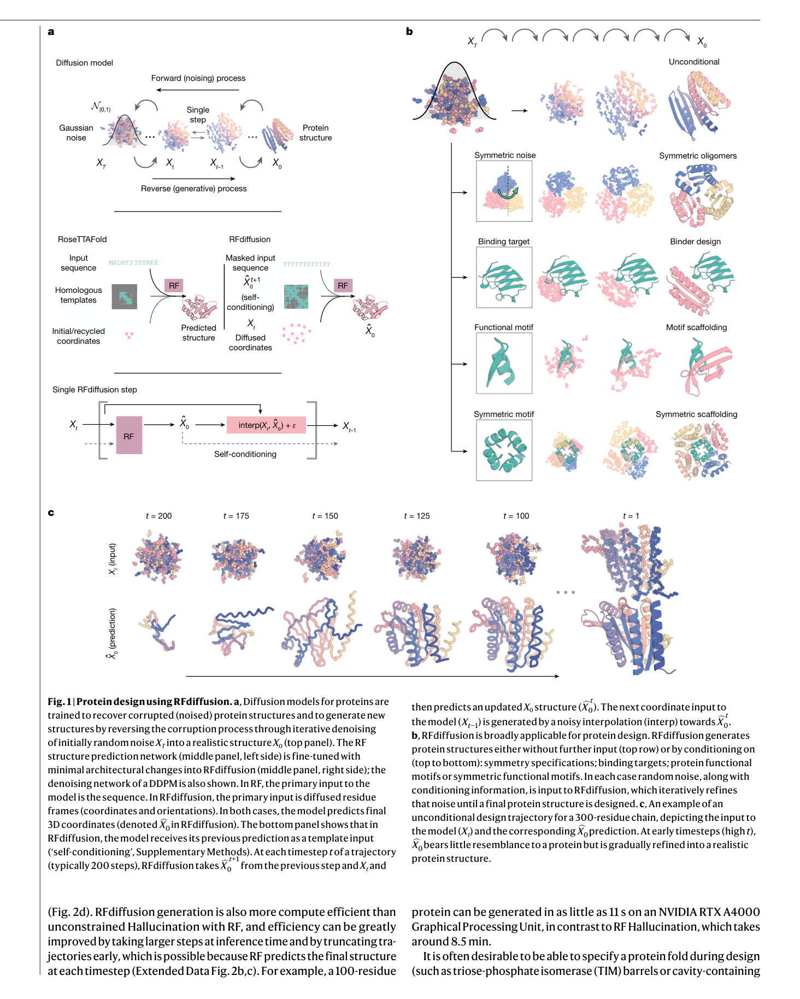
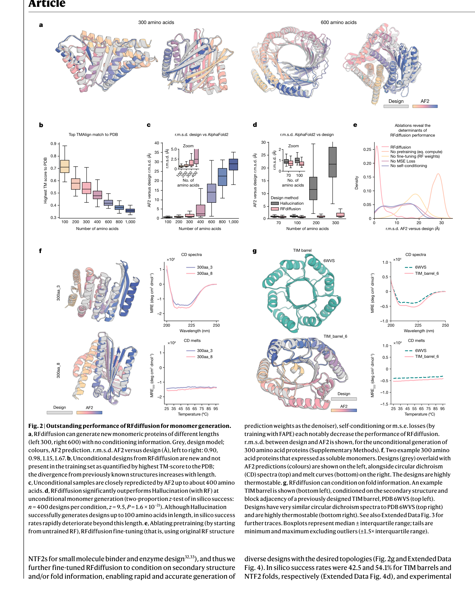
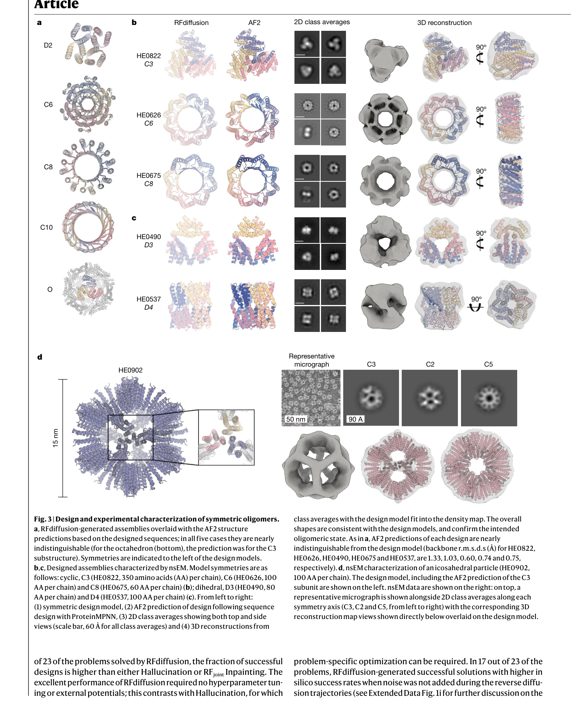

# De novo design of protein structure and function with RFdiffusion

### 原文链接：[全文](https://doi.org/10.1038/s41586-023-06415-8)

作者：Joseph L. Watson, David Juergens, Nathaniel R. Bennett, ..., David Baker

Nature，2023 年 8 月

---
从头设计一个自然界不存在的蛋白质有多难？传统方法需要大量人工拼装片段、反复优化能量函数，一个设计项目耗时数月甚至数年。2023 年，David Baker 团队提出了 **RFdiffusion**——**将 AlphaFold 级别的结构预测网络"反过来"，通过扩散去噪训练，把一个理解蛋白质结构的网络变成了一个能创造蛋白质结构的网络。**

这个框架覆盖了蛋白质设计的几乎所有核心任务：无条件生成单体、对称寡聚体组装、功能位点支架搭建、蛋白结合物设计。**实验验证中，设计成功率比 Rosetta 提升约 100 倍，多个设计经冷冻电镜确认与计算模型高度一致。**

这篇论文是 RFdiffusion 系列的奠基之作，后续的 RFdiffusion2（Nature Methods 2026）和 RFdiffusion3（bioRxiv 2025）分别将其扩展到原子级酶设计和全原子生物分子相互作用设计。

## 一、研究问题

在 RFdiffusion 之前，蛋白质从头设计存在五个长期未解决的问题：

* **无条件生成**：能否凭空生成多样的、可折叠的蛋白质结构，突破 PDB 已知拓扑的限制？
* **功能位点支架搭建**：给定一个酶活性位点或结合界面的几何构型，能否自动生成一个稳定蛋白包裹住它？
* **高阶对称组装体**：能否设计二面体、四面体、二十面体等复杂对称结构？
* **结合物设计效率**：Rosetta 设计蛋白结合物通常需要筛选 10,000+ 个候选分子，成功率极低
* **结构-序列鸿沟**：如何从生成的骨架高效地反推出能折叠成该结构的氨基酸序列？

RFdiffusion 的目标是成为**一个统一框架，同时解决上述所有问题**。核心思路来自一个大胆的假设：既然 RoseTTAFold 已经学会了"理解"蛋白质结构，那么通过扩散去噪训练，能否让它学会"创造"蛋白质结构？

## 二、方法核心：把结构预测网络变成生成模型

RFdiffusion 的核心洞察极其简洁：**对 RoseTTAFold（一个蛋白质结构预测网络）进行去噪任务的微调，就能将其转化为一个强大的生成模型。**具体而言，训练时对已知蛋白质结构逐步添加噪声，然后让网络学习从噪声中恢复原始结构——这正是扩散模型的标准范式。

**这张图想回答：**RFdiffusion 如何将 RoseTTAFold 从结构预测网络改造成结构生成模型？

{: width="1464" height="1828" loading="lazy" decoding="async"}

*Fig 1 \| RFdiffusion 概览。(a) 将 RoseTTAFold 结构预测网络微调为去噪网络；(b) 多种条件生成模式——对称寡聚体、结合物设计、功能位点支架搭建；(c) 300 残基蛋白质从纯噪声到完整结构的去噪轨迹。*

**刚体坐标系扩散**

每个残基用一个**刚体坐标系（rigid-body frame）**表示：Cα 位置（平移）+ N-Cα-C 骨架朝向（旋转）。前向过程对平移加三维高斯噪声，对旋转加 SO(3) 上的布朗运动。反向过程经约 200 步去噪，从完全随机的坐标系恢复出有意义的蛋白质骨架。

**MSE 损失函数的关键作用**

无条件生成时使用 MSE 损失（均方误差）而非 AlphaFold 的 FAPE 损失。**这一选择至关重要**——FAPE 是局部不变的（对每个残基独立对齐），会破坏全局坐标系的连续性；MSE 在全局坐标系下计算，保证了去噪轨迹中相邻步骤之间结构的一致性。

**自条件化（Self-conditioning）**

当前去噪步骤可以参考上一步的预测结构，类似 AlphaFold2 的 recycling 机制。这使得去噪轨迹更加连贯，生成质量显著提升。

**完整设计流水线**

**RFdiffusion**（生成蛋白质骨架）→ **ProteinMPNN**（为骨架设计氨基酸序列）→ **AlphaFold2**（验证序列是否折叠回目标结构）。三者串联形成一个从结构生成到序列设计到计算验证的完整闭环。

## 三、看图说话

**这张图想回答：**无条件生成的蛋白质在 designability 和结构新颖性上表现如何？

{: width="1464" height="1828" loading="lazy" decoding="async"}

*Fig 2 \| 单体蛋白质生成性能。(a) 300 和 600 残基设计实例；(b-e) 与 hallucination 方法的定量对比；(f) 圆二色谱和热稳定性测试；(g) TIM 桶折叠设计。*

RFdiffusion 在无条件生成模式下，不给任何输入约束，直接从纯噪声出发生成蛋白质骨架。测试涵盖了 100 至 600 个残基的蛋白质，结果令人印象深刻：

* **拓扑多样性**：生成的蛋白质拓扑远超 PDB 已知结构空间，含大量全新折叠方式
* **实验验证**：18 个设计中 **9 个表达为可溶蛋白**，多个展现出极高热稳定性——部分设计在 95°C 仍保持稳定
* **速度提升**：生成一个 300 残基蛋白只需 **11 秒**，传统 hallucination 方法需要 8.5 分钟
* **折叠定向设计**：指定生成 TIM 桶（42.5% 成功率）和 NTF2 折叠（54.1% 成功率）均表现优异

### 实验二：对称寡聚体——从环状到二十面体

对称寡聚体设计是本文的**最大亮点之一**。RFdiffusion 通过一种精巧的方式处理对称性：**在推断时将对称约束作为条件注入，而模型本身并未在对称数据上训练**。具体做法是只对一个亚基做去噪，然后通过对称操作复制到其余亚基位置。

**这张图想回答：**RFdiffusion 生成的对称寡聚体是否通过了冷冻电镜实验验证？

{: width="1464" height="1828" loading="lazy" decoding="async"}

*Fig 3 \| 对称寡聚体设计与实验验证。(a) D2、C6、C8、C10、O 对称设计实例；(b-c) 负染电镜表征；(d) 二十面体粒子 HE0902 的冷冻电镜三维重构。*

作者系统测试了从简单到极其复杂的各种对称类型：

**对称类型覆盖**

* **环状对称**（C3–C12）：最基本的旋转对称
* **二面体对称**（D2–D4）：兼具旋转和翻转对称
* **正多面体对称**：四面体（T）、八面体（O）、二十面体（I）
* **新颖拓扑**：双层 β-桶、含 18 条 β-链和 18 个 α-螺旋的 C6 α/β 桶——自然界中从未观察到的结构形式

**实验验证结果**

* 608 个设计送实验，**87 个以上**表现出正确的寡聚化状态
* 负染电镜（nsEM）确认了多种设计的正确组装
* 最引人注目的是 **HE0902**——一个 15 nm 的多孔二十面体粒子，冷冻电镜重构清晰确认了设计结构，这代表了当时从头设计的最复杂对称组装体

### 实验三：功能位点支架搭建

给定一个已知功能的结构片段（如酶活性位点、抗原表位），RFdiffusion 可以自动生成一个稳定蛋白将其包裹——这就是 motif scaffolding。

**基准测试结果**

* 25 个基准问题中解决了 **23 个**（hallucination 方法只解决 15 个，RFjoint 19 个）
* p53-MDM2 示例：设计蛋白的 KD = **0.5 nM**，比天然 p53 肽段强约 1000 倍

**酶活性位点支架搭建**

作者还展示了对 EC1–EC5 类酶活性位点的支架搭建，覆盖多种酶功能类别。但这一代 RFdiffusion 的酶设计仅限于**骨架水平**——能正确放置骨架原子，但无法精确控制侧链构象和催化残基的原子级几何。这成为后续 RFdiffusion2 升级到原子级分辨率的核心动机。

### 实验四：蛋白结合物设计

蛋白结合物（binder）设计是蛋白质工程中最具实际应用价值的任务之一——药物设计、诊断试剂、合成生物学都依赖于精确的蛋白-蛋白相互作用。RFdiffusion 在这个方向上取得了突破性进展：

**五个治疗性靶标的结合物设计**

* 靶标：流感血凝素（HA）、IL-7Rα、PD-L1、胰岛素受体（InsulinR）、TrkA
* 命中率：约 **19%**，比传统 Rosetta 方法提升约 **100 倍**
* 所需筛选量：不到 100 个候选设计即可找到有效结合物
* Rosetta 通常需要筛选 10,000 个以上才有可能找到一个命中

**冷冻电镜验证：HA_20 结合物**

针对流感血凝素设计的结合物 HA_20 通过 2.9 Å 分辨率的冷冻电镜获得了结构解析，**实验结构与计算设计模型的 RMSD 仅 0.63 Å**——几乎完美匹配。这是对 RFdiffusion 生成精度最直接的验证。

## 四、核心贡献总结

**创新一：预测→生成的范式转换。**通过去噪微调，将已经学会"理解"蛋白质结构的 RoseTTAFold 转化为能"创造"蛋白质结构的生成器。预训练积累的结构知识直接迁移到生成任务中。

**创新二：刚体坐标系扩散。**不在笛卡尔坐标上简单加噪声，而是对每个残基的平移（R³）和旋转（SO(3)）分别做扩散。这种表示自然适配蛋白质骨架的几何特性。

**创新三：自条件化机制。**当前去噪步骤参考上一步预测结果，保证轨迹连贯，避免生成过程中出现结构"跳变"。

**创新四：对称性作为推断时约束。**模型不需要在对称数据上训练——在推断时施加对称操作即可。这意味着一个模型就能处理从 C3 到二十面体的所有对称类型。

**创新五：模块化流水线。**骨架生成（RFdiffusion）、序列设计（ProteinMPNN）、结构验证（AF2）各司其职。每个模块可以独立升级迭代，整体流程既灵活又可扩展。

## 五、局限与展望

作为开创性工作，RFdiffusion 仍存在明确的局限性，这些局限也直接驱动了系列后续工作的方向：

**残基级分辨率**：RFdiffusion 在残基水平操作（每个残基一个刚体坐标系），无法显式建模原子级细节。这在酶设计中尤其关键——催化活性依赖侧链原子的精确定位。RFdiffusion2 将分辨率提升到原子级别，直接解决了这个问题。

**无法显式建模小分子和配体**：当前版本只能通过外部势函数间接考虑小分子配体，无法将其作为扩散过程的一部分。RFdiffusion3 进一步拓展到全原子生物分子相互作用设计，覆盖蛋白质-小分子、蛋白质-核酸等场景。

**酶设计仅限骨架水平**：虽然能搭建酶活性位点的骨架支架，但无法精确控制催化残基的侧链构象——而酶催化效率往往取决于亚埃级别的原子位置。

**实验验证的选择偏差**：论文展示的实验结果经过筛选（如按 AF2 预测质量排序后选取 top 设计），实际成功率可能低于报告数字。但即使考虑这一点，相比传统方法的提升仍然是数量级的。

### 一句话总结

RFdiffusion 证明了一个核心观点：**深度学习时代的蛋白质结构预测网络，经过扩散去噪微调后，可以成为通用的蛋白质生成器**。它在单体设计、对称组装体、功能位点支架搭建、结合物设计等任务上全面超越传统方法，将蛋白质从头设计从"每个项目一场战役"推进到"通用框架、多场景适配"的新阶段。后续的 RFdiffusion2（Nature Methods 2026）将其拓展到原子级酶设计，RFdiffusion3（bioRxiv 2025）进一步实现全原子生物分子相互作用设计——三代工作构成了蛋白质生成式设计最完整的方法体系。

## 通讯作者介绍

David Baker 是美国华盛顿大学（University of Washington）生物化学系教授、蛋白质设计研究所（Institute for Protein Design）创始所长、霍华德·休斯医学研究所（HHMI）研究员。他是计算蛋白质设计领域的开创者，开发了 Rosetta 软件套件，在蛋白质从头设计、酶设计、蛋白质结构预测和治疗性蛋白质工程等方向取得了一系列里程碑式成果。2024 年，David Baker 与 Demis Hassabis、John Jumper 共同获得诺贝尔化学奖，以表彰其在计算蛋白质设计领域的开创性贡献。

## 引用

Watson, J. L., Juergens, D., Bennett, N. R., Trippe, B. L., Yim, J., Eisenach, H. E., ... & Baker, D. (2023). De novo design of protein structure and function with RFdiffusion. Nature, 620(7976), 1089-1100. https://doi.org/10.1038/s41586-023-06415-8
