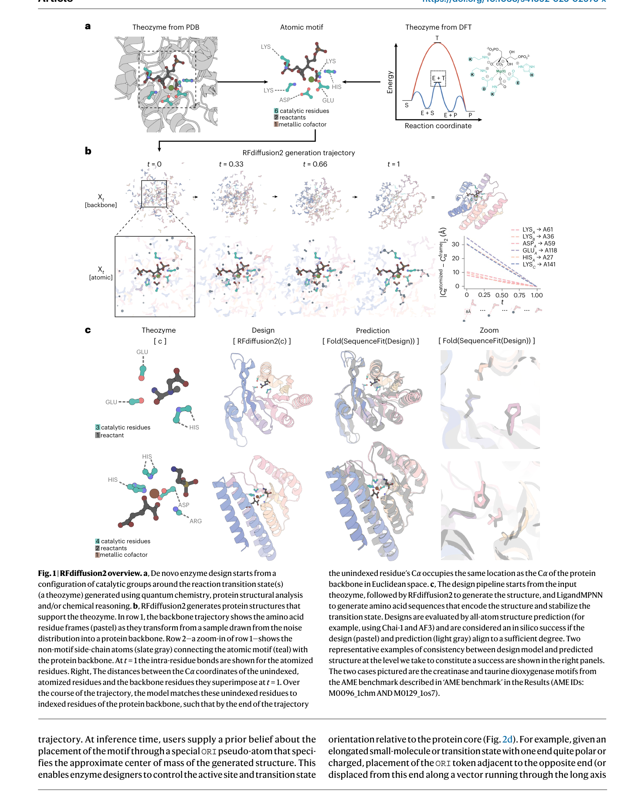
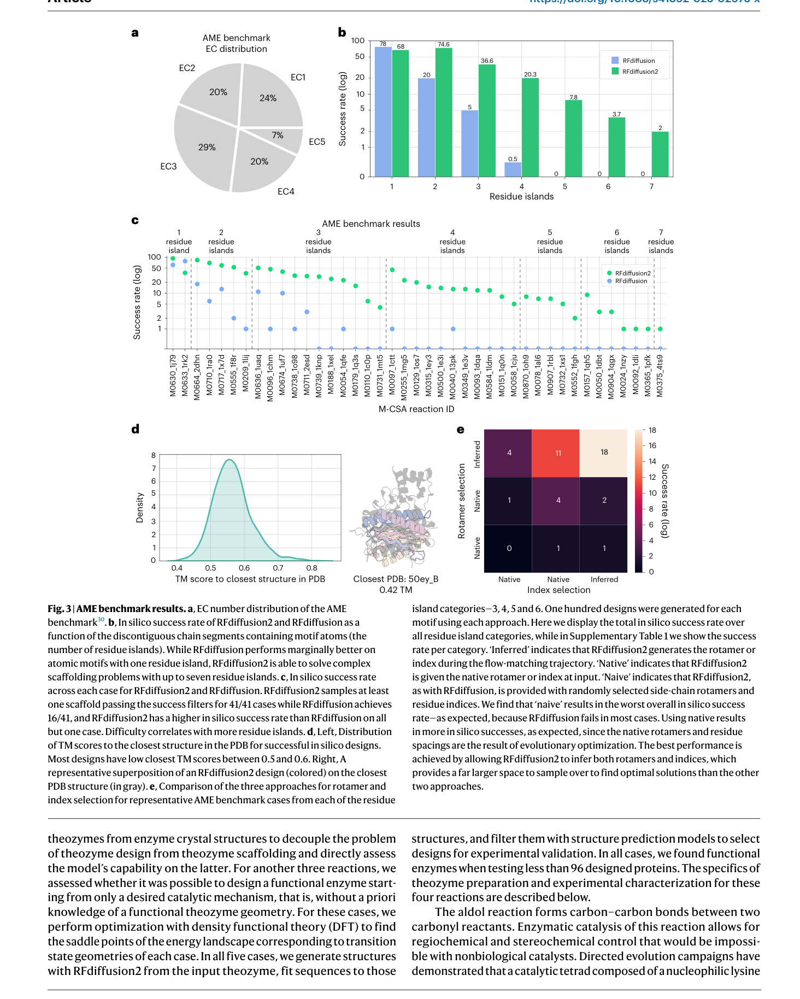
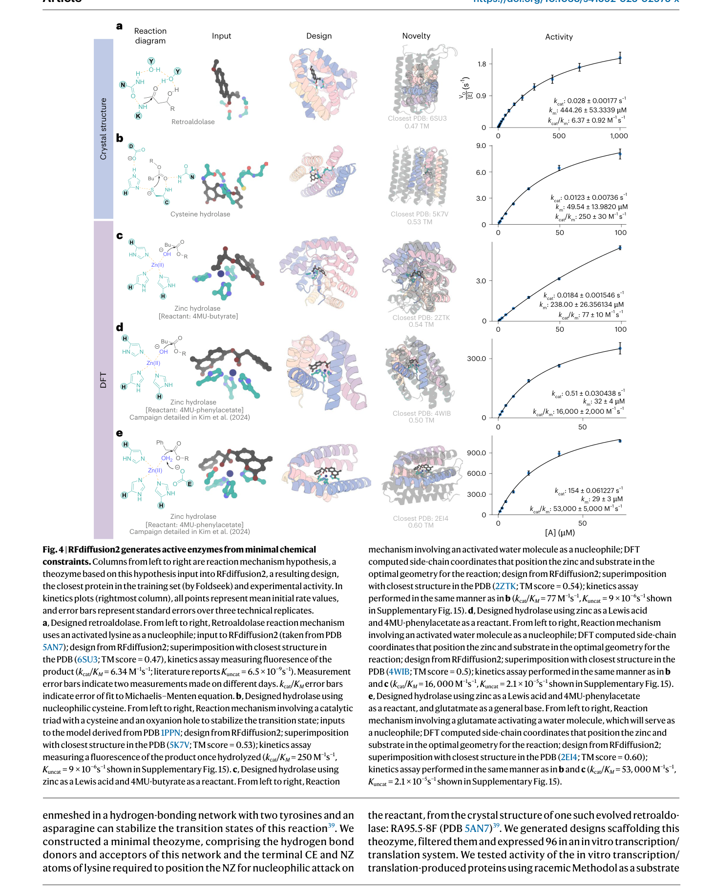

# Atom-level enzyme active site scaffolding using RFdiffusion2

### Link: [full article](https://doi.org/10.1038/s41592-025-02975-x)

Authors: Woody Ahern, Jason Yim, Doug Tischer, ..., David Baker

Nature Methods, January 2026

---
RFdiffusion (RFD1) opened a new era of generative protein design in 2023, but enzyme active site design always remained a hard nut for it: the side-chain atoms of catalytic residues have to be placed with sub-angstrom precision, while RFD1 can only manipulate residue-level backbone frames and has no control over side-chain atom positions.

**RFdiffusion2 (RFD2)**, from David Baker's group, breaks through this bottleneck entirely: the model diffuses directly on atomic coordinates, and the input can be nothing more than the 3D coordinates of a few functional-group atoms. **You do not have to specify which residue they belong to, where they sit in the sequence, or which rotamer they adopt**; the model infers all of it.

On the AME benchmark of 41 enzyme active sites, RFD2 **solves all 41/41** (RFD1 solves only 16/41). More importantly, starting from theozymes derived from quantum chemistry calculations, the team designed and experimentally validated 5 functional enzymes; the best zinc hydrolase reaches a kcat/KM of 53,000 M-1s-1, and for each enzyme an active molecule was found after testing fewer than 96 designs.

## Part 1: Research Question

To understand why RFD2 matters, you first need to see where RFD1 got stuck on enzyme active site design.

The representation granularity of RFD1 (Nature 2023) is **residue-level**: each residue is encoded as a rigid-body frame (Cα coordinate + backbone orientation). This representation is highly efficient for designing the overall topology of a protein backbone, but enzyme active site design comes with one fundamental additional requirement: **the side-chain atoms of the catalytic residues must be arranged precisely at specified 3D coordinates**.

When RFD1 is used for enzyme design, the user has to supply in advance:

* **Sequence indices**: the exact position of each catalytic residue in the final sequence
* **Rotamers**: obtained by inverse rotamer sampling, which works backwards from side-chain atom coordinates to backbone positions
* **Backbone frames**: the position and orientation of the motif specified under the residue-level representation

This workflow triggers a **combinatorial explosion**: the search space is L!/(L-M)! (permutations of sequence positions) × M rotameric states. When the catalytic residues of an active site come from several discontinuous sequence segments (multiple "residue islands"), RFD1's search space balloons and its success rate collapses.

In the later AME benchmark tests, **RFD1 solved only 16 of the 41 active sites**, and almost all its failures were concentrated in complex active sites with 4 or more residue islands.

## Part 2: Methodology: The core upgrades in RFD2: breakthroughs at three levels

The improvements in RFD2 can be understood at three levels: a more flexible motif representation, a more powerful network architecture, and a more stable training framework.

**What this figure asks:** How does RFD2 diffuse backbone frames and side-chain atoms at the same time to build all-atom enzyme active sites?

{: width="1464" height="1828" loading="lazy" decoding="async"}

*Fig 1 \| Overview of RFdiffusion2. (a) The theozyme concept: defining atomic-level motifs and the reaction coordinate from PDB/DFT; (b) generation trajectory: backbone frames and atomic side chains are diffused together, and unindexed residues are automatically matched to sequence positions; (c) two design examples (creatinase and a taurine dioxygenase motif).*

**Upgrade 1: atomic-level motif representation, from "telling the model the answer" to "letting the model work it out"**

RFD2 supports three motif input modes, from coarse to fine, with increasing flexibility:

* **Backbone motif** (similar to RFD1): specify backbone frame positions + sequence indices + rotamers → least flexible
* **Atomic motif**: specify only the coordinates of the side-chain functional group atoms, not the backbone → the model infers the rotamer itself
* **Unindexed atomic motif**: specify only atom types and coordinates, **not even the residue type or the sequence position** → the model infers both the rotamer and the sequence index

The last mode is the key breakthrough: **the model simultaneously generates the protein backbone, assigns the catalytic residues to sequence positions, and determines their rotamers**, internalizing the entire combinatorial search problem.

**Upgrade 2: the RoseTTAFold All-Atom architecture**

The network underlying RFD1 is RoseTTAFold, in which each residue has only one representation, a rigid-body frame. RFD2 adopts **RoseTTAFoldAA**, which introduces an extended representation:

* Each residue can be represented either as a frame (backbone) or as **all of its heavy-atom coordinates** ("atomized")
* During training a random subset of residues is atomized, so the model learns to switch between frame and atomic representations
* Small-molecule ligands are also represented with explicit atomic coordinates and participate directly in the diffusion process
* How "unindexed residues" are implemented: the catalytic residues are **duplicated and stripped of their identity information**, and the model learns during diffusion to place them at the correct sequence positions

**Upgrade 3: flow matching replaces DDPM**

RFD1 uses a DDPM (denoising diffusion probabilistic model), which needs auxiliary losses and self-conditioning to train stably. RFD2 switches to **flow matching**:

* Riemannian flow matching for frames on SE(3), and Gaussian flow matching for atomic coordinates in R³
* The key trick, **"stochastic centering"**: instead of centering on the motif during training (which would leak positional information), the centered structure is given a small random translation
* The result: **stable training directly from random initialization, with no auxiliary loss and no self-conditioning**
* Training cost: only 17 days on 24 A100 GPUs

**Upgrade 4: fine-grained conditioning, RASA, partial ligand, and the ORI token**

Besides the motif itself, RFD2 supports three additional atomic-level conditioning inputs that give the designer more precise control over the microenvironment of the active site:

* **Ligand atom RASA**: annotate each ligand atom with its desired solvent accessibility (fully exposed / fully buried / intermediate), controlling how deeply the substrate is embedded in the active pocket
* **Partial ligand**: provide only part of the atomic coordinates of the ligand or transition state and let the model infer the rest of the conformation, which is especially useful when only the local geometry of the reaction center is known
* **ORI token**: a special pseudo-atom that specifies the approximate orientation of the scaffold center of mass relative to the ligand, controlling the orientation of the active site and the spatial layout of the binding pocket

## Part 3: Key Figure Analysis

To systematically evaluate enzyme active site scaffolding, the team built the **AME (Active site Motif Evaluation) benchmark**: starting from 958 hand-curated catalytic active sites from the M-CSA (Mechanism and Catalytic Site Atlas) database, they selected 41 diverse active sites spanning EC classes 1-5.

**What this figure asks:** On the 41 enzyme motifs of the AME benchmark, how much higher is RFD2's success rate than RFD1's?

{: width="1464" height="1828" loading="lazy" decoding="async"}

*Fig 3 \| AME benchmark results. (a) Distribution of EC classes; (b) success rate as a function of the number of residue islands, where RFD2's advantage on complex motifs is enormous; (c) case-by-case scatter plot; (d) TM scores showing the novelty of the designed structures; (e) comparison matrix of rotamer/index inference strategies.*

**Key results**

* RFD2 solved **41/41 active sites** (at least 1 passing scaffold for each), while RFD1 managed only 16/41
* RFD2 outperformed RFD1 in 40/41 cases
* **The gap widens with complexity**: when there are ≥ 4 residue islands, RFD1 fails almost completely, while RFD2 maintains a high success rate
* **Model inference beats manual specification**: an ablation compared three strategies, naive (randomly sampled index + rotamer), native (index + rotamer from the real structure), and inferred (letting the model work them out). The inferred strategy had the highest success rate, even higher than native. This indicates that within the larger search space the model finds arrangements better than the natural solution
* On complex cases with more than 4 residue islands, the naive strategy fails almost completely, as the combinatorial explosion makes random sampling hopeless
* The designed structures are structurally novel: TM scores to the closest structure in the PDB are mostly 0.5-0.6, indicating genuinely new folds

The most important message in this set of data is that RFD2 moves enzyme active site scaffolding from "only simple motifs are tractable" to "active sites of arbitrary complexity are tractable". The gap between 16/41 and 41/41 essentially reflects **the capability gulf between residue-level and atomic-level representations**.

## Part 4: Key Contributions

Computational benchmarks establish RFD2's scaffolding ability, but the ultimate test is **wet-lab experiments**. The team tested two routes: theozymes extracted from crystal structures, and theozymes derived from density functional theory (DFT) calculations.

**What this figure asks:** Starting from minimal chemical constraints, do the five enzymes designed by RFD2 show catalytic activity in experiments?

{: width="1464" height="1828" loading="lazy" decoding="async"}

*Fig 4 \| Designing functional enzymes from minimal chemical constraints. (a) Retroaldolase; (b) cysteine hydrolase; (c-e) three zinc hydrolases. Each column shows, in order, the reaction equation, the DFT input, the RFD2 design, a comparison with the closest structure in the PDB, and the Michaelis-Menten kinetics curve.*

**Route A: theozymes from crystal structures**

**1\. Retroaldolase**

Theozyme source: the crystal structure of the evolution-optimized RA95.5-8F, containing a Lys nucleophilic catalytic center plus a Tyr/Asp/Asn hydrogen bond network. Of 96 designs tested, **4 were catalytically active**.

Best design: kcat/KM = 6.34 ± 0.92 M-1s-1 (the paper quotes an uncatalyzed rate of 6.5×10-9 s-1).

**2\. Cysteine hydrolase**

Theozyme: a Cys-His-Asn catalytic triad, with an oxyanion hole formed by the cysteine backbone nitrogen together with a glutamine. Of 48 designs tested, **several were active**.

Best design: kcat/KM = 248 M-1s-1, **better than any previously reported computationally designed cysteine esterase**.

**Route B: theozymes derived from DFT calculations, the most radical test**

This route is more challenging: the input no longer comes from the crystal structure of a known enzyme. Instead, starting from the reaction mechanism, quantum chemistry (DFT) is used to optimize the transition state geometry, and the metal coordination and key atomic coordinates are extracted as the theozyme.

**3\. Zinc hydrolase I (substrate: 4MU-butyrate)**

DFT theozyme: Zn2+ + imidazole ligand + metal-coordinating groups. Of 96 designs, **3 were functional**.

Best design: kcat/KM = 77 M-1s-1.

**4\. Zinc hydrolase II (substrate: 4MU-phenylacetate)**

Also designed from a DFT theozyme.

Best design: kcat/KM = **16,000 M-1s-1**, several orders of magnitude higher than previously reported zinc hydrolases.

**5\. Zinc hydrolase III (glutamate general base)**

Uses Glu as a general base to activate a water molecule. Of 96 designs, **11 were functional**, the highest hit rate of the set.

Best design: kcat/KM = **53,000 M-1s-1**, the highest activity among the five enzymes.

One number runs through all five experiments: **no more than 96 designs were tested for any of the enzymes**. This means RFD2's design hit rate is already high enough that the full pipeline from reaction mechanism to functional enzyme is practical in real work.

### Summary comparison: RFD1 vs RFD2

Going from RFD1 to RFD2 is essentially the key step that takes generative protein design from **residue-level topology design** to **atomic-level functional design**.

|   | RFD1 | RFD2 |
|---|---|---|
| Representation granularity | residue level (Cα frames) | atomic level (all heavy atoms) |
| Motif input | backbone position + rotamer + index | only functional-group atom coordinates |
| Sequence index | must be specified in advance | can be inferred automatically |
| Rotamer | must be enumerated in advance | can be inferred automatically |
| Training framework | DDPM + auxiliary loss | flow matching, no auxiliary loss |
| AME benchmark | 16 / 41 | 41 / 41 |
| Small-molecule modeling | external potential (implicit) | atomic ligand coordinates (explicit) |

It is worth noting that RFD2 is the second generation of the RFdiffusion series (RFD1 was published in Nature 2023), and that the third generation, **RFD3** (bioRxiv 2025), builds on it with full all-atom modeling, extending the capability to DNA-binding proteins and small-molecule binder design with another jump in performance. From RFD1 to RFD2 to RFD3, the trajectory of protein design models from "backbone topology" to "atomic function" is clear.

## Part 5: Limitations and Outlook

**The designed enzymes are still less active than natural enzymes.** The best kcat/KM among the five designed enzymes is 53,000 M-1s-1, which still falls short of the 106-108 M-1s-1 routinely achieved by natural enzymes. Part of this comes from the incompleteness of the theozyme itself, which contains only the most critical catalytic residues and does not model the full secondary catalytic network, water molecules, or the complete transition state dynamics.

**The AME benchmark is limited by its PDB origin.** All 41 test cases come from known catalytic sites in M-CSA, so the benchmark is essentially a "reverse engineering" test on known enzyme structures. The ability to design theozymes for entirely new reaction types needs more validation.

**Building DFT theozymes still requires expert knowledge.** Although RFD2 dramatically lowers the barrier for the scaffolding step, the upstream theozyme design (which catalytic residues to choose, what metal coordination geometry to use, how to model the transition state) still depends on deep expertise in enzymology and quantum chemistry.

**Water molecules and full transition state dynamics are not modeled.** The current theozyme input contains only protein side-chain atoms and ligand atoms, with no structural water. For the many enzymes in which water takes part in catalysis (such as the water activation step in zinc hydrolases), this is a systematic gap in the information provided.

## About the Corresponding Authors

Rohith Krishna is a research scientist at the Institute for Protein Design (IPD) at the University of Washington, where he also received his PhD. He is a core developer of the RoseTTAFold All-Atom architecture and the RFdiffusion series, led the architecture design of RFD2 and RFD3, and has played a key role in moving protein structure prediction and generative models from the residue level to the atomic level.

David Baker is a professor at the University of Washington, an investigator of the Howard Hughes Medical Institute (HHMI), and the founding director of the Institute for Protein Design. A pioneer of computational protein design, his group developed the Rosetta software suite and a series of deep learning methods (RFdiffusion, ProteinMPNN, and others) that form the technical foundation of modern protein design. In 2024, Baker shared the Nobel Prize in Chemistry with Demis Hassabis and John Jumper in recognition of their pioneering contributions to computational protein design and protein structure prediction.

## Citation

Ahern, W., Yim, J., Tischer, D., Salike, S., Woodbury, S. M., Kim, D., ... & Baker, D. (2026). Atom-level enzyme active site scaffolding using RFdiffusion2. Nature Methods, 23(1), 96-105. https://doi.org/10.1038/s41592-025-02975-x
