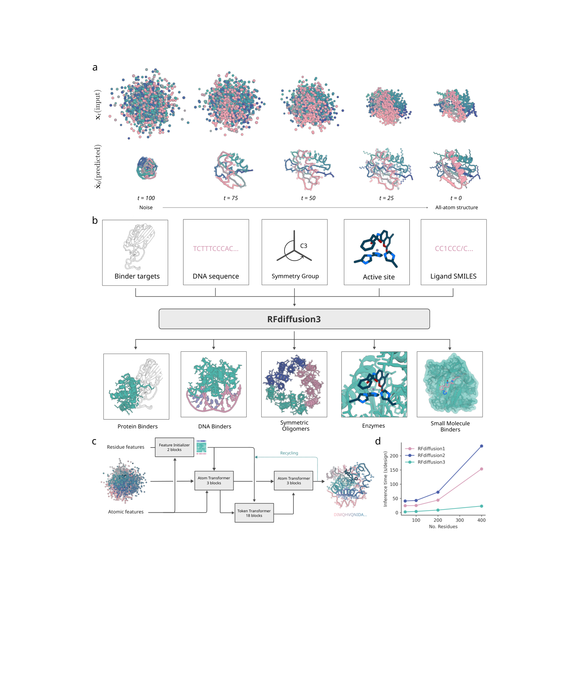
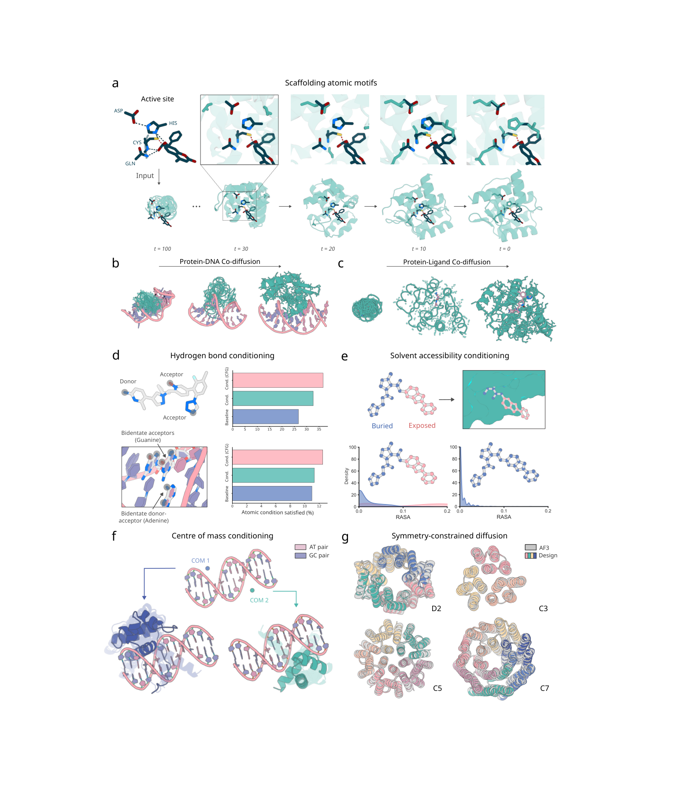
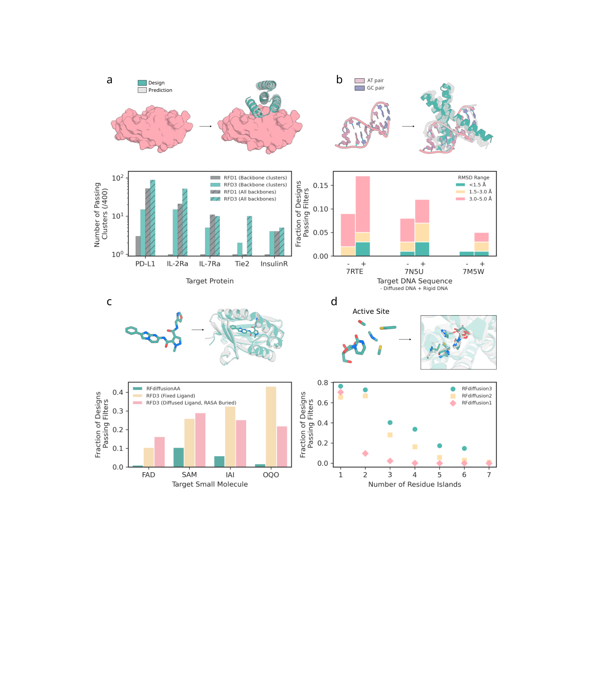
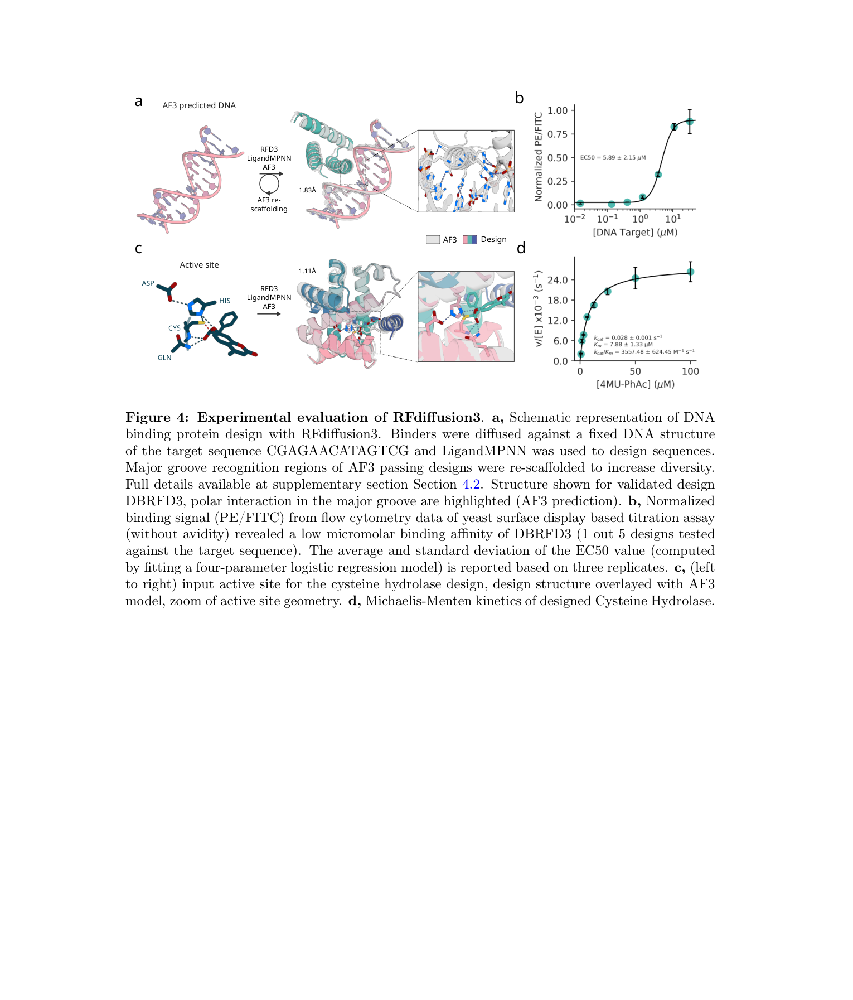

# De novo Design of All-atom Biomolecular Interactions with RFdiffusion3

### 原文链接：[全文](https://doi.org/10.1101/2025.09.18.676967)

作者：Jasper Butcher, Rohith Krishna, Raktim Mitra, ..., David Baker

bioRxiv，2025 年 9 月 18 日

---
RFdiffusion 系列走到了第三代。RFD1（Nature 2023）证明扩散模型可以从头设计蛋白质；RFD2（Nat Methods 2026）把原子级酶活性位点纳入设计范围。现在，**RFD3 彻底转向全原子表示——每个聚合物原子都被显式建模**，蛋白-蛋白、蛋白-DNA、蛋白-小分子、酶活性位点四类设计任务统一在一个模型中完成。

基于全新的 AtomWorks 框架，RFD3 只用 **168M 参数**，推理速度却比 RFD2 快 10 倍。在 in silico 评估中，蛋白 binder 设计在 5 个靶标中的 4 个上优于 RFD1，酶活性位点脚手架设计在 41 个 benchmark 中的 37 个上优于 RFD2。

实验验证方面：设计的 DNA 结合蛋白经酵母展示确认结合（EC50 = 5.89 uM）；设计的半胱氨酸水解酶 **kcat/Km 达到 3557 M⁻¹s⁻¹**，大幅超过此前同一反应上的最佳设计（RFD2: 248 M⁻¹s⁻¹）。

## 一、研究问题

理解 RFD3 的设计动机，需要回顾前两代的表示方式：

**RFD1（Nature 2023）——残基级 frame**

每个残基用一个刚体 frame（平移 + 旋转）表示，扩散过程在 frame 空间进行。这一表示天然适合蛋白-蛋白相互作用设计（binder、对称寡聚体），但无法表示小分子、DNA 或精细的原子级相互作用。

**RFD2（Nat Methods 2026）——混合 frame + atom**

扩散仍在残基级 frame 上进行，但引入了原子级条件化（atomic motif conditioning），使模型能理解酶活性位点中的原子排布。这是一种"嫁接"方案——原子信息作为额外约束注入，并非扩散过程本身的组成部分。

**RFD3（本文）——全原子扩散**

**原子是被扩散的基本单元。**每个残基展开为 14 个原子（4 个骨架 + 10 个侧链，较小的氨基酸用虚拟原子在 Cb 位置补齐至色氨酸大小），扩散直接在原子坐标空间进行。这意味着：原子级约束是天然的，DNA/小分子共扩散可以直接实现，氢键供体/受体、溶剂可及性等精细条件都有了物理基础。

简言之，RFD1 和 RFD2 的表示空间限制了它们的设计范围。RFD3 通过全原子建模，将蛋白-蛋白、蛋白-DNA、蛋白-小分子、酶活性位点四类任务统一在一个一致的框架下。

**这张图想回答：**RFD3 的 U-Net 架构如何同时处理骨架和侧链的全原子扩散，且速度比 RFD2 快 10 倍？

{: width="1530" height="1793" loading="lazy" decoding="async"}

*Fig 1 \| RFD3 总览。(a) 100 步扩散轨迹，同时对骨架和侧链原子进行去噪；(b) 多种输入条件 → RFD3 → 蛋白 binder、DNA 结合蛋白、对称寡聚体、酶、小分子结合蛋白；(c) U-Net 架构，包含 atom transformer 和 token transformer；(d) 推理速度对比——RFD3 比 RFD2 快约 10 倍。*

## 二、方法核心：架构：基于 AtomWorks 的轻量高速设计

RFD3 基于 AtomWorks 框架（github.com/RosettaCommons/atomworks）构建，采用 **transformer-based U-Net** 架构，分为三个阶段：

**阶段一：下采样（Downsampling）**

编码原子级和残基级特征。每个残基的 14 个原子首先经过稀疏的距离依赖注意力（sparse distance-based attention），捕获局部几何上下文；然后通过交叉注意力（cross attention）在原子表示和残基 token 表示之间传递信息（down-pool：原子 → token）。

**阶段二：稀疏 transformer（Sparse Transformer）**

核心计算在残基级进行——18 层 token transformer 处理残基间的长程相互作用。这里有一个关键的简化：**Pairformer 从 AlphaFold3 的 48 层缩减到仅 2 层**，并且完全去掉了计算量大的三角乘法更新（triangle multiplicative update）和三角注意力（triangle attention）。

**阶段三：上采样（Upsampling）**

将残基级信息通过交叉注意力回传到原子级（up-pool：token → 原子），调制原子特征，最终预测坐标更新。

这种"原子-残基耦合"的 U-Net 设计实现了两个关键目标：

* **全原子精度**：原子级注意力捕获局部化学环境（氢键几何、侧链旋转异构体等）
* **残基级效率**：计算量最大的 transformer 层在残基级运行，避免了全原子注意力的 O(N²) 爆炸
* 最终模型仅 **168M 参数**（对比 AF3 约 350M），推理速度比 RFD2 快约 10 倍

训练采用**分层策略**：先在 PDB 结构 + AlphaFold2 蒸馏结构的混合数据上预训练，再对 DNA 结合、蛋白-蛋白相互作用等特定任务做进一步微调。这避免了模型在复杂任务上过拟合或偏向某一类体系。

## 三、看图说话

全原子表示带来的最大优势之一，是条件化机制变得更加自然和丰富。RFD3 支持以下 8 种条件化方式：

**这张图想回答：**RFD3 支持哪些原子级和全局级的条件化机制来引导蛋白质生成？

{: width="1530" height="1793" loading="lazy" decoding="async"}

*Fig 2 \| 全局与原子级条件化。(a) 酶活性位点脚手架轨迹；(b) 蛋白-DNA 共扩散；(c) 蛋白-配体共扩散；(d) 氢键条件化；(e) 溶剂可及性（RASA）条件化；(f) 质心位置条件化；(g) 对称扩散（D2/C3/C5/C7）。*

**1\. 靶标/结合伙伴（Target conditioning）**

提供靶蛋白、DNA 或小分子的坐标，模型围绕靶标生成结合蛋白。

**2\. 原子 motif 条件化（Atomic motif conditioning）**

指定活性位点残基的精确原子坐标，模型在周围生成蛋白骨架。与 RFD2 类似，但在全原子框架下是原生支持的。

**3\. 氢键条件化（Hydrogen bond conditioning）**

指定哪些原子应该是氢键供体或受体。结合 classifier-free guidance，**小分子的氢键比例从 26.67% 提升到 36.67%**。

**4\. 溶剂可及性条件化（RASA conditioning）**

标注配体的每个原子为"埋藏/暴露/部分暴露"，控制结合口袋的几何形态——例如要求配体完全埋入蛋白内部。

**5\. 质心位置条件化（Centre-of-mass / ORI token）**

指定设计蛋白相对于配体/靶标的空间位置，控制结合方向。

**6\. 部分配体输入（Partial ligand input）**

只提供配体的部分坐标，让模型推断其余构象——实现蛋白和配体的联合采样。

**7\. 对称噪声（Symmetric noise）**

通过对称化的噪声注入，直接生成 D2、C3、C5、C7 等对称寡聚体。

**8\. Classifier-free guidance**

对条件化预测和无条件预测做加权平均，增强模型对指定条件的遵从程度。这一机制与图像生成中的做法一致，可调节生成多样性与条件满足度之间的平衡。

### In Silico 性能对比

**这张图想回答：**在蛋白 binder、DNA 结合蛋白、酶和小分子结合蛋白四类任务上，RFD3 比前代好多少？

{: width="1530" height="1793" loading="lazy" decoding="async"}

*Fig 3 \| In silico benchmark。(a) 蛋白 binder 设计——RFD3 在 5 个靶标中的 4 个上优于 RFD1，且产生更多样的解；(b) DNA 结合蛋白设计；(c) 小分子 binder 设计——RFD3 优于 RFdiffusionAA；(d) 酶活性位点设计——RFD3 在 AME benchmark 上优于 RFD2，尤其在含 4+ 残基岛的复杂 motif 上优势显著。*

**蛋白 binder 设计（vs RFD1）**

在 PD-L1、IL-2Ra、IL-7Ra、Tie2、InsulinR 五个靶标上，每个靶标生成 400 个设计，用 AF3 评估。RFD3 在其中 4 个靶标上优于 RFD1。更关键的是多样性：**RFD3 平均找到 8.2 个独立成功簇（TM-score 0.6 聚类），RFD1 仅 1.4 个**。RFD3 还能采样到更多样的对接姿态。

**DNA 结合蛋白设计（新能力）**

RFD3 支持蛋白-DNA 共扩散——在生成蛋白的同时预测 DNA 的结合构象。在 3 条训练集中未出现的 DNA 序列上测试，通过率为 8.67%（单体）和 6.67%（二聚体），评估标准为 DNA 对齐后 RMSD &lt; 5A。去掉预设 DNA 结构后，生成的 DNA 构象多样性进一步增加。

**小分子 binder 设计（vs RFdiffusionAA）**

测试了 4 个配体：FAD、SAM（常见）和 IAI、OQO（罕见）。配体固定时，RFD3 在全部 4 个配体上显著优于 RFdiffusionAA。RFD3 还支持联合采样配体构象（配体扩散 + RASA 埋藏条件），生成的设计更多样，Rosetta DDG 结合能更低。

**酶活性位点设计（vs RFD2，AME benchmark）**

* RFD3 在 41 个 AME benchmark 案例中的 **37 个上优于或持平 RFD2（90%）**
* 优势集中在复杂 motif：含 4 个以上残基岛的案例（n=12），RFD3 通过率 15%，RFD2 仅 4%
* 生成的折叠结构更新颖、更多样
* 支持跨链对称酶活性位点脚手架设计（C2 对称示例）

## 四、核心贡献总结

**这张图想回答：**RFD3 设计的 DNA 结合蛋白和半胱氨酸水解酶在实验中表现如何？

{: width="1530" height="1793" loading="lazy" decoding="async"}

*Fig 4 \| 实验验证。(a-b) DNA 结合蛋白设计及酵母展示结合实验，EC50 = 5.89 +/- 2.15 uM；(c-d) 半胱氨酸水解酶设计，kcat/Km = 3557 M⁻¹s⁻¹，超过此前该反应上的最佳设计。*

**DNA 结合蛋白**

采用两阶段方案：(1) 以 AF3 预测的 DNA 构象为条件进行采样；(2) 对预测良好的设计进行二次脚手架优化。合成了 5 个设计，通过酵母表面展示流式细胞术进行验证。其中 1 个设计（DBRFD3）确认结合，**EC50 = 5.89 +/- 2.15 uM**。结构预测显示该设计通过大沟（major groove）识别 DNA。

**半胱氨酸水解酶**

催化三联体为 Cys-His-Asp + Gln + 底物 4-methylumbelliferyl phenyl acetate，与 RFD2 论文中的反应相同，但使用 RFD3 进行设计。筛选 190 个设计，35 个表现出多轮催化活性。最佳酶的催化效率：

* **kcat/Km = 3557 M⁻¹s⁻¹**
* 此前同一反应上的最佳设计（来自 RFD2）：kcat/Km = 248 M⁻¹s⁻¹
* 提升幅度约 **14 倍**

### RFD 系列三代演进总览

三代 RFdiffusion 的核心差异：

|   | RFD1 (2023) | RFD2 (2026) | RFD3 (2025) |
|---|---|---|---|
| 表示 | 残基级 frame | 混合 frame+atom | **全原子** |
| 核心架构 | RoseTTAFold | RoseTTAFoldAA | AtomWorks U-Net |
| 参数量 | ~RoseTTAFold | ~RoseTTAFoldAA | **168M** |
| 训练框架 | DDPM | Flow matching | Flow matching |
| 蛋白-蛋白 | ✓ | ✓ | ✓（更多样） |
| 酶活性位点 | 残基级 | 原子级 | 原子级（37/41 >= RFD2） |
| DNA | ✗ | ✗ | **✓** |
| 小分子 | ✗ | 配体坐标 | **联合扩散** |
| 推理速度 | baseline | ~10x slower | **~10x faster than RFD2** |

从 RFD1 到 RFD3 的演进路径清晰：表示从残基级走向全原子，设计范围从蛋白-蛋白扩展到统一的多分子类型，架构从 RoseTTAFold 演变为更轻量的 AtomWorks U-Net。RFD3 的全原子扩散将此前分散在不同工具中的设计能力统一到了一个模型。

## 五、局限与展望

**DNA binder 实验成功率偏低。**5 个合成的设计中只有 1 个确认结合（20%），且亲和力为微摩尔级。作为一种全新的设计能力，这是可以接受的起点，但距离实用仍有距离。

**AME benchmark 为 in silico 评估。**酶设计的实验验证仅限于一个反应（半胱氨酸水解酶）。37/41 的优势数据来自 AF3 评估，在多少个真实反应上能保持这一优势尚不清楚。

**预印本，尚未经过同行评审。**这篇文章发布于 bioRxiv（2025 年 9 月），in silico 和 experimental 数据的质量和可重复性有待正式审稿的检验。

**序列设计仍然依赖外部工具。**RFD3 生成的是骨架结构（backbone + sidechain geometry），序列设计仍需通过 ProteinMPNN / LigandMPNN 完成，并非端到端的结构-序列联合生成。

**训练数据偏差。**尽管使用了全 PDB + AlphaFold2 蒸馏结构，模型仍表现出 PDB 数据分布的偏好——生成的序列倾向于高比例丙氨酸（alanine），结构偏向紧凑球形折叠（compact globular fold）。对非典型拓扑和非天然氨基酸组成的设计可能受限。

**结构成功不等于可开发性。**即便在结构预测评估中表现良好，设计蛋白距离真正可用还需跨越多个工程障碍——表达量、纯化稳定性、免疫原性、体内活性等均未被当前评估体系覆盖。

## 通讯作者介绍

Rohith Krishna 是华盛顿大学蛋白质设计研究所（Institute for Protein Design, IPD）的研究科学家，博士毕业于华盛顿大学。他是 RFdiffusion 系列的核心架构师，主导了 RFD2 和 RFD3 的开发，同时也是 RoseTTAFold All-Atom 框架的第一作者（Science, 2024）和 AtomWorks 框架的主要开发者。他的工作推动了蛋白质设计从残基级到全原子级的范式转变。

David Baker 是华盛顿大学教授、霍华德-休斯医学研究所研究员、蛋白质设计研究所创始所长。他是计算蛋白质设计领域的开拓者，开发了 Rosetta 软件套件，2024 年因在计算蛋白质设计方面的开创性贡献获得诺贝尔化学奖（与 Demis Hassabis、John Jumper 共享）。从 RoseTTAFold 到 RFdiffusion 系列，Baker 实验室持续引领着 AI 驱动的蛋白质设计前沿。

## 引用

Butcher, J., Krishna, R., Mitra, R., Brent, R. I., Li, Y., Corley, N., ... & Baker, D. (2025). De novo Design of All-atom Biomolecular Interactions with RFdiffusion3. bioRxiv. https://doi.org/10.1101/2025.09.18.676967
