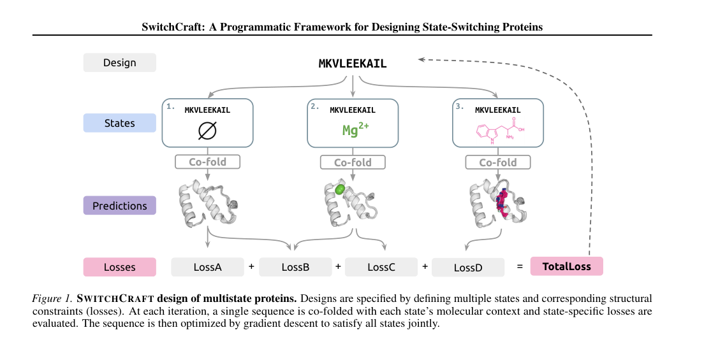
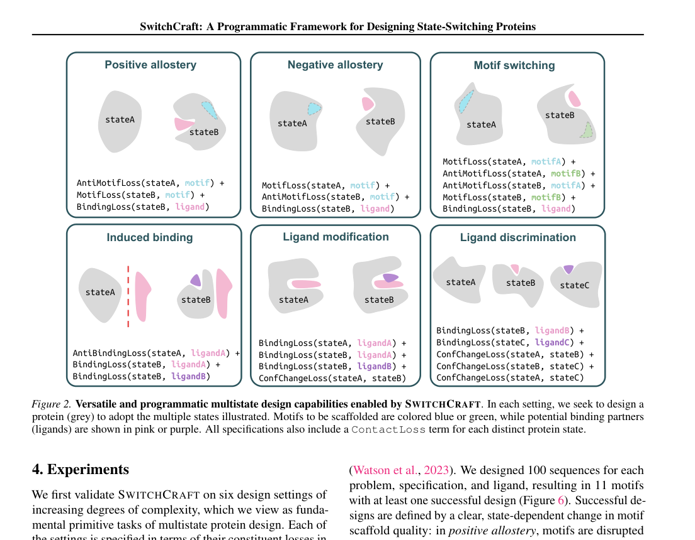
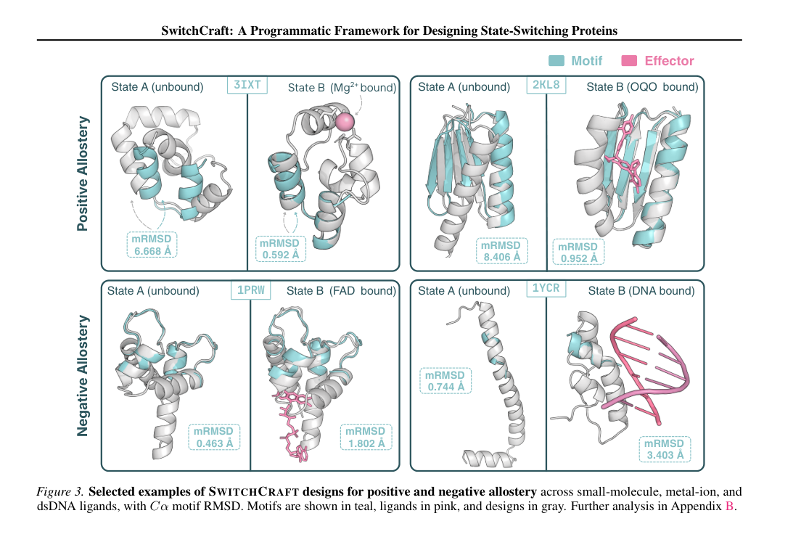
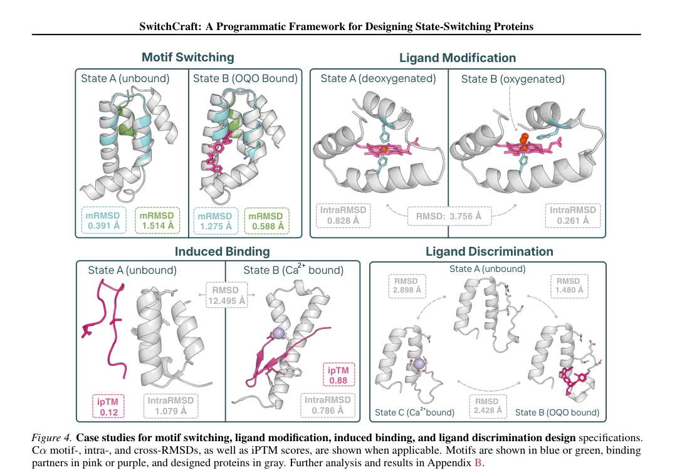
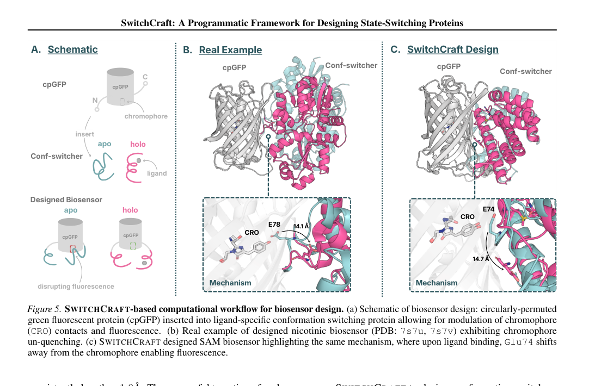

# SwitchCraft: A Programmatic Framework for Designing State-Switching Proteins

### Link: [full article](https://doi.org/10.48550/arXiv.2605.31236)

Authors: Bowen Jing, Mihir Bafna, Anisha Parsan, ..., Bonnie Berger

ICML 2026, 2026

---
**Overview**

The real appeal of natural proteins lies not in 'folding into one structure' but in **switching between states under different conditions**: opening an active site upon ligand binding, adopting different conformations in response to different signaling molecules, or passing through multiple intermediate states during a catalytic cycle. Yet almost all mainstream protein design methods target a single static structure and cannot specify this kind of multistate switching behavior.

Bonnie Berger's group at MIT presents **SwitchCraft**, the first general programmable framework for multistate protein design. It writes functional requirements as composable programs of 'states + constraints' and optimizes sequences by backpropagating through the structure prediction model Boltz-1, so that the same protein satisfies different structural and functional requirements in different molecular environments. The paper validates the framework's generality on six functional primitives and demonstrates a pipeline for de novo fluorescent biosensor design.

## Part 1: Research Question

Protein design currently follows two main routes:

**Protein language models (PLMs)** can generate new sequences and inherit the function of natural protein families, but their conditional control is coarse: usually it amounts to a family label or GO term, which makes it hard to specify a fine-grained functional mechanism such as 'be in state 1 under condition A and switch to state 2 under condition B'.

**Structure generation methods** (diffusion, flow matching, or optimizing sequences by inverting a structure prediction model) excel at designing binders and motif scaffolds, but they fundamentally target a single static structure and struggle to express the multistate behaviors common in natural proteins, such as ligand-dependent conformational change, state-dependent binding and allosteric switching.

The core question SwitchCraft sets out to answer is: **can we build a general framework that writes 'multistate protein function' directly as programmatic constraints and then automatically designs protein sequences that satisfy them?**

## Part 2: Methodology: Turning protein function design into 'writing a program'

The core idea of SwitchCraft can be understood this way:

optimize a protein sequence the way you would train a neural network, except that here the **'parameters'** are the sequence logits of the protein being designed, the **'data'** is the multistate design specification, and the **'loss function'** encodes the structural and binding requirements you want the protein to satisfy in each state.

**What this figure asks:** How does SwitchCraft fold and optimize the same protein sequence across multiple states at once?

{: width="1104" height="540" loading="lazy" decoding="async"}

*Figure 1 \| Overview of the SwitchCraft framework: the same sequence is cofolded under multiple states, and the losses computed for each state are optimized jointly*

Concretely, a multistate design task is defined by the following elements:

**Multiple states:** each state corresponds to a folding context, that is, the molecular environment fixed to be present in that state. For example: state A is the protein alone, state B is the protein + the small molecule OQO, and state C is the protein + Ca²⁺.

**Composable loss functions:** the paper defines four core losses, each of which can be taken in a 'positive' or 'negative' direction:

**Motif Loss**: makes the protein accurately scaffold a functional motif in a given state, computing the distance error of motif residue pairs from the Boltz-1 distogram output. **Anti-Motif Loss = −0.5 × Motif Loss**, which conversely encourages the motif to be disrupted.

**Binding Loss**: makes the protein bind a ligand in a given state, scoring the confidence and probability of protein-ligand contacts. **Anti-Binding Loss** requires no binding.

**Conformational Change Loss**: uses the Jensen-Shannon divergence to measure the difference between the distograms of two states, **requiring the same sequence to have markedly different internal geometric relationships in different states**. This is the key to achieving state switching.

**Contact Loss**: ensures that the structure in each state is itself compact and confidently predicted, serving as the default regularizer for all design tasks.

Sequence optimization uses a straight-through estimator (STE) to handle the non-differentiability of argmax, and a four-stage schedule (240 steps in total) that moves gradually from continuous exploration to a discrete sequence: the first 30 steps perform soft optimization for rapid exploration, the middle 200 steps gradually lower the temperature to sharpen the distribution, and the final 10 steps finish with a hard sequence.

## Part 3: Key Figure Analysis

The most important thing about SwitchCraft is not any single task but its **compositionality**: different tasks can all be written as programmatic combinations of losses. Figure 2 shows six functional primitives:

**What this figure asks:** What kind of state-switching behavior does each of the six functional primitives supported by SwitchCraft describe?

{: width="1104" height="860" loading="lazy" decoding="async"}

*Figure 2 \| The six functional primitives supported by SwitchCraft, each defined by a combination of states and losses*

**1. Positive allostery:** the motif is disrupted in the absence of the ligand and recovers its correct geometry once the ligand binds, the classic case of allosteric activation.

**2. Negative allostery:** the reverse, in which the functional motif is intact without the ligand and is perturbed once the ligand binds, that is, allosteric inhibition.

**3. Motif switching:** a ligand makes the protein switch from motif A to motif B. Four conditions must be satisfied at once (each motif on and off), making it harder than ordinary allostery.

**4. Induced binding:** the protein binds its target molecule only in the presence of an effector, a conditional interaction.

**5. Ligand modification:** sensing different chemical states of the same ligand (for example heme versus oxygenated heme), letting the chemical modification drive a conformational change.

**6. Ligand discrimination:** a three-state switch, in which different ligands (OQO versus Ca²⁺) correspond to different conformations, giving a multi-input, multistate response.

The key to these six tasks is **the combination of positive constraints, negative constraints and cross-state constraints**. Positive constraints alone easily yield nonspecific solutions in which 'both states work'; adding negative constraints (Anti-Motif / Anti-Binding) is what actually produces 'state switching'; and adding ConfChangeLoss on top prevents the model from finding the lazy solution in which the structures are nearly identical yet both satisfy the constraints.

## Part 4: Key Contributions

**Positive/negative allostery (the most systematic benchmark):**

The authors ran systematic designs over 24 RFDiffusion benchmark motifs × 5 ligands (OQO, FAD, Zn²⁺, Mg²⁺, dsDNA), generating 100 sequences per combination. The success criteria require a motif RMSD ≤ 1 Å in the target state, a motif RMSD > 1 Å in the non-target state, and consistency across 5 predictions within the same state (standard deviation ≤ 0.5 Å). In the end, **11 of the 24 motifs yielded at least one successful design**, and in some cases state switching moved the motif RMSD from 0.5 Å to more than 6–8 Å.

**What this figure asks:** In positive and negative allostery designs, how large is the on/off switch of the motif region between the different ligand states?

{: width="1104" height="740" loading="lazy" decoding="async"}

*Figure 3 \| Examples of positive and negative allostery designs: the motif (cyan) switching on and off in different ligand states*

**More complex functional primitives:**

**What this figure asks:** What are the design success rates for the more advanced functions of motif switching, ligand modification and induced binding?

{: width="1104" height="750" loading="lazy" decoding="async"}

*Figure 4 \| Representative cases of motif switching, ligand modification, induced binding and ligand discrimination*

**Motif switching:** 3 of 100 designs achieved a complete mutual exchange between the two motifs.

**Ligand modification:** 10 of 558 designs succeeded; in the representative case, the entry of molecular oxygen induces a 3.8 Å conformational change, reminiscent of the cooperativity of oxygen binding in hemoglobin.

**Induced binding:** 8 of 940 designs succeeded. In the showcased case, ipTM = 0.12 without Ca²⁺ (no binding) and ipTM = 0.88 with Ca²⁺ (strong binding), with a conformational change of **12.5 Å**.

**Ligand discrimination:** 12 of 465 designs achieved three-state discrimination. In the representative case, a key loop forms a salt bridge in the unbound state, a hydrophobic pocket in the OQO-bound state and a calcium coordination site in the Ca²⁺-bound state; the RMSD between any two states is > 1.4 Å, and predictions within each state are consistent.

### From primitives to application: de novo fluorescent biosensor design

The most application-oriented part of the paper is the pipeline for cpGFP-based fluorescent biosensor design. The idea is to first use SwitchCraft to design a **conformational switch protein (confswitcher)** that responds to an arbitrary small molecule, then insert a circularly permuted GFP. Ligand binding causes a conformational change that alters the environment around the chromophore and thereby modulates the fluorescence signal.

**What this figure asks:** Validation of the de novo fluorescent biosensor design: do the computationally predicted on/off ratios match experimental values?

{: width="1104" height="710" loading="lazy" decoding="async"}

*Figure 5 \| The biosensor design pipeline: (A) schematic of the principle, (B) the real mechanism of a known nicotine biosensor, (C) a SAM biosensor designed by SwitchCraft*

The authors designed confswitchers for three small molecules, SAM, cGMP and ATP, generating **13,858** sequences in total (lengths 150–200 aa). After stringent filtering (effector iPTM > 0.8, intraRMSD ≤ 1.5 Å, pLDDT > 0.8, crossRMSD > 3 Å, radius of gyration ≤ 22 Å), **89** passed.

After inserting cpGFP at the sites of largest conformational change in these confswitchers, **44** passed the chromophore modulation screen. One of them, a SAM biosensor, displays an 'unquenching' mechanism very similar to that of a known nicotine biosensor: **in the apo state, Glu74 contacts the chromophore and suppresses fluorescence, and after ligand binding Glu74 moves about 14.7 Å away, which should in principle restore fluorescence.**

### Validation and controls

The paper's validation scheme is worth noting, as it rests on four layers of evidence:

**Comparison with an RFD3 + TiedMPNN baseline:** the authors built a baseline in which RFDiffusion3 generates the structures and TiedMPNN performs multistate sequence design. SwitchCraft succeeds significantly more often; for example, for the FAD + 6e6r_med combination, SwitchCraft has 17 successes versus 0 for the baseline. The underlying reason is that when the structures of different states are incompatible, tied inverse folding logits contaminate one another.

**Ablation study:** removing AntiMotifLoss clearly lowers the success rate (for example, OQO + 3IXT drops from 5 to 1), showing that **state switching does not emerge naturally as a by-product and must be supervised explicitly with negative constraints**.

**Cross screening:** among sequences designed with positive allostery as the objective, positive allostery was observed 259 times and negative allostery only 22 times (fold change 3.01×, p = 2.9×10⁻²¹), and the converse also holds, indicating that the loss objectives really do drive the desired behavior.

**Preliminary wet-lab validation:** the appendix reports zinc-induced PD-L1 binders: no binding without Zn²⁺, with binding detected after adding Zn²⁺, and some Kd values reaching the sub-micromolar range (746 nM). The sample size is small, but it shows that at least some designs exhibit conditional binding in a real system.

## Part 5: Limitations and Outlook

**Nearly all of the core conclusions remain in silico:** what the paper demonstrates is that 'within Boltz-1's predicted world, these multistate designs can be realized'. Whether real proteins can be stably expressed, fold correctly, switch reversibly and possess suitable thermodynamic and kinetic balance has not been systematically verified.

**Kinetics and path accessibility are not constrained:** both states being low-energy and confidently predicted does not mean the protein can naturally switch from state A to state B. Some designs might need to fully unfold and rebind first, and in the ligand modification section the authors acknowledge the existence of implausible paths that 'appear to require unbinding and rebinding'.

**Absolute success rates are still low:** motif switching 3/100, induced binding 8/940, ligand discrimination 12/465. The framework has demonstrated feasibility, but it is still some distance from reliable high-throughput engineering.

**Heavy dependence on the structure prediction model:** the whole framework optimizes for 'making Boltz-1 believe this mechanism holds', and Boltz-1's modeling biases at certain ligand, ion and DNA interfaces may mislead the designs.

Overall, SwitchCraft is a **paradigm-opening framework paper**. Its most important contribution is proposing a new problem formulation: protein function design can be achieved through 'multiple states + composable constraints + differentiable optimization', advancing protein design from 'drawing a static structure' to 'writing a molecular mechanism'. The most promising future directions include introducing energy landscape and kinetic constraints, extending to atomic-level functional site constraints, and implementing more complex logic such as AND/OR/NOT molecular logic gates.

## About the Corresponding Authors

The corresponding authors of this paper are Bowen Jing, Mihir Bafna and Bonnie Berger, all from the Massachusetts Institute of Technology (MIT). Bonnie Berger is the Simons Professor of Mathematics at MIT and also leads the Computation and Biology group at CSAIL (the Computer Science and Artificial Intelligence Laboratory). With more than three decades of research experience in computational biology and bioinformatics, she has long worked on sequence analysis, genomic privacy and single-cell data analysis, and is one of the most influential scholars in computational biology. Bowen Jing is a PhD student at MIT CSAIL working on geometric deep learning and protein design, with several notable earlier works in protein structure prediction and generative modeling (such as ProDiT). Mihir Bafna is also a PhD student at MIT CSAIL and co-first author with Jing. The collaborators on this paper also include Professor Adam Klivans of the Department of Computer Science at UT Austin and Professor Bryan Bryson of the Department of Biological Engineering at MIT.

## Citation

Jing, B., Bafna, M., Parsan, A., Ni, H. M., Kwabi-Addo, D., Bryson, B., ... & Berger, B. (2026). SwitchCraft: A Programmatic Framework for Designing State-Switching Proteins. ICML 2026. https://doi.org/10.48550/arXiv.2605.31236
