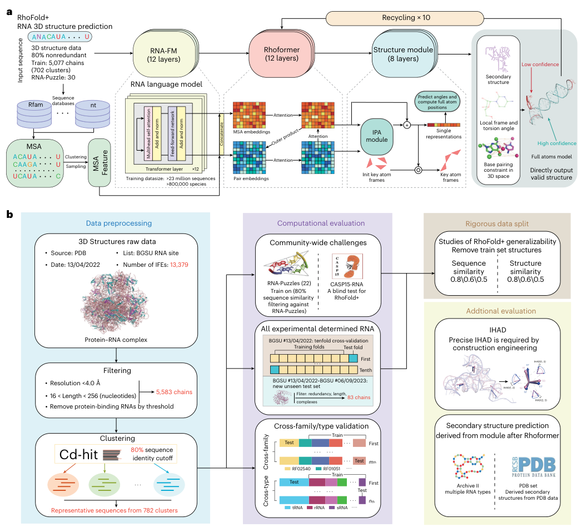
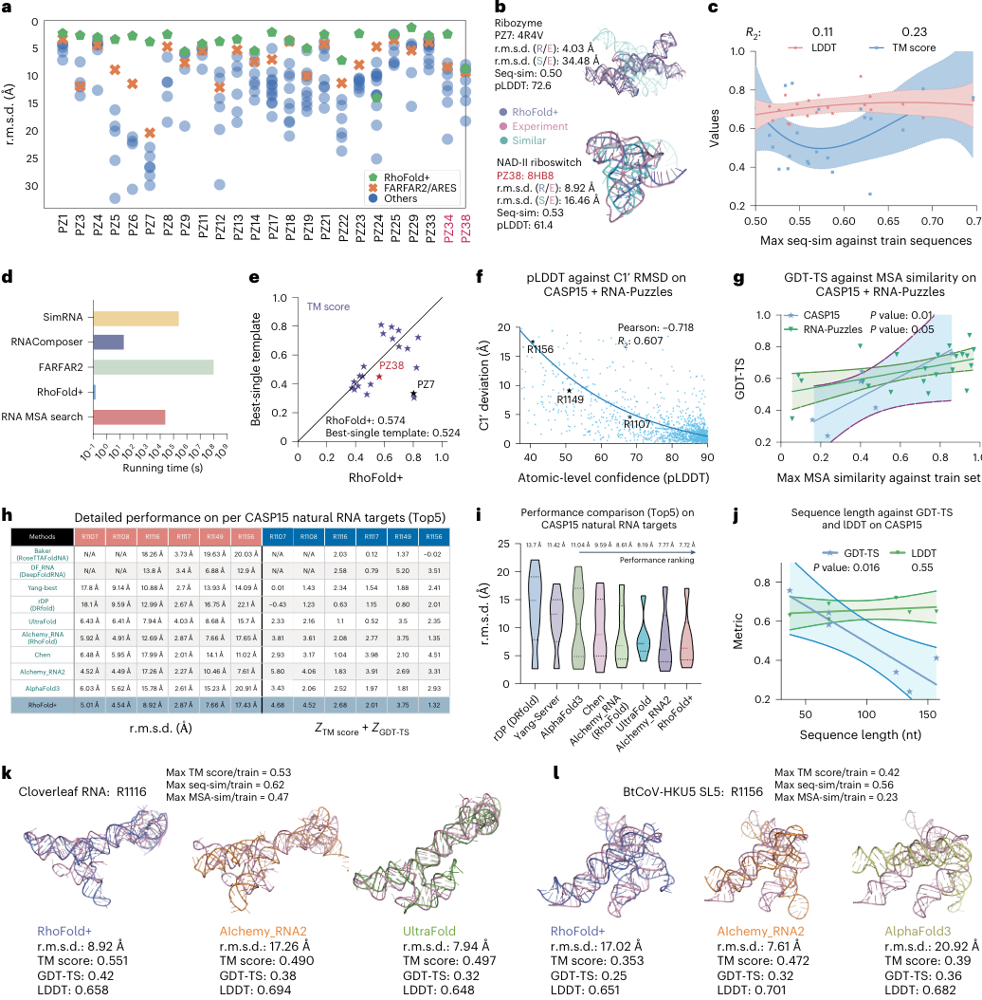
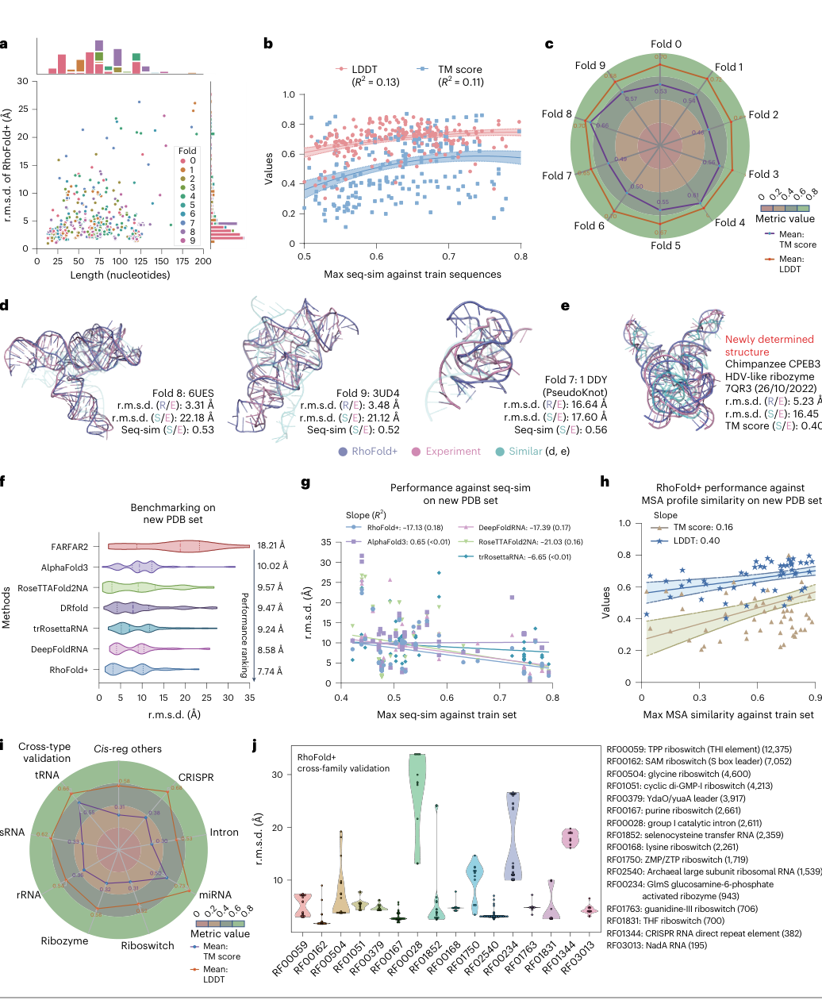
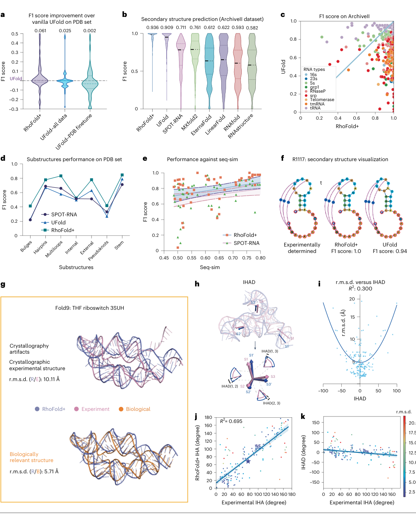
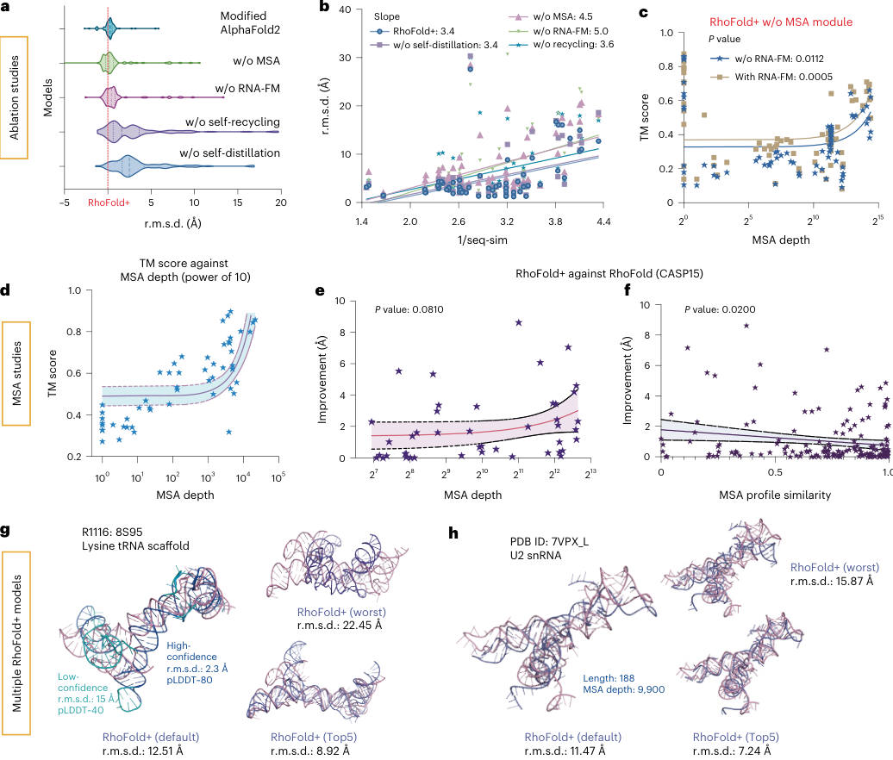

# Accurate RNA 3D structure prediction using a language model-based deep learning approach

### 原文链接：[全文](https://doi.org/10.1038/s41592-024-02487-0)

作者：Tao Shen, Zhihang Hu, Siqi Sun, ..., Yu Li

Nature Methods，2024 年 12 月

---
RNA 的功能由它的三维结构决定，可在 PDB 收录的约 21.4 万个结构里，纯 RNA 结构还不到 1%。蛋白质结构预测已经有了 AlphaFold2，RNA 这边却一直缺一个又准又快、全程自动、不需要专家介入的工具。训练数据太少，是横在深度学习面前的第一道坎。

香港中文大学、复旦大学、智峪生科、哈佛大学 Wyss 研究所、MIT 和亚利桑那州立大学等机构的团队提出了 **RhoFold+**。它先用一个在 **约 2,370 万条无标注 RNA 序列**上预训练的语言模型 RNA-FM 学习“RNA 序列语法”，再把多序列比对（MSA）中的进化信息融合进来，最后由一个为 RNA 专门设计的几何结构模块直接输出全原子结构。

成绩单：24 个 RNA-Puzzles 单链目标上平均 r.m.s.d. **4.02 Å**，比第二名 FARFAR2 低 2.30 Å；CASP15 的 6 个天然 RNA 目标上平均 7.72 Å，与依赖专家知识的冠军组 AIchemy_RNA2（7.77 Å）持平；在训练截止后新解析的 76 个单链 RNA 结构上，平均 r.m.s.d. **比 AlphaFold3 低约 2.2 Å**。不计 MSA 搜索，单个结构的推理只需约 0.14 秒。

*本文先讲模型如何搭建、训练数据如何补足，再逐图拆解论文的五张主图，最后讨论它的边界：最好的结果仍然离不开高质量 MSA，多条螺旋在连接区的空间组装仍是最主要的失败模式。*

## 一、研究问题

RNA 在中心法则中承上启下。人类基因组中超过 85% 的序列会被转录，其中只有约 3% 编码蛋白质，大量转录出来的 RNA 功能和结构都还不清楚。RNA 的功能高度依赖三维构象：核酶靠特定折叠完成催化，核糖开关靠结合口袋识别代谢物；开发 RNA 靶向的小分子药物、设计合成生物学元件，也都需要知道分子在空间里长什么样。

难点首先在数据。截至 2023 年 12 月，PDB 中约 21.4 万个结构里，**纯 RNA 结构不足 1.0%，含 RNA 的复合物也只占 2.1%**。RNA 构象柔性大，同一条链在不同离子、配体或蛋白环境下可能采取不同构象，X 射线晶体学、NMR 和冷冻电镜解析起来都费时费力。

计算方法大致有三条路线：

**模板建模**（ModeRNA 等）受限于 RNA 模板库太小；**基于采样的从头预测**（FARFAR2、SimRNA 等）在能量函数指导下大规模采样构象，预测能力更强但计算量极大；**深度学习**（DeepFoldRNA、trRosettaRNA、AlphaFold3 等）依赖 MSA，搜索成本高，对没有同源序列的孤儿 RNA 帮不上忙。

于是出现了一组相互牵制的矛盾：深度学习需要大量结构数据，RNA 恰恰结构数据最少；采样方法不依赖训练数据，但太慢；MSA 能提供进化信息，但搜索成本高，对没有同源序列的孤儿 RNA 和人工设计 RNA 也帮不上忙。

**本文要回答的问题**

**能否用海量没有结构标注的 RNA 序列弥补结构数据的不足，做出一个准确、快速、全自动、无需专家干预的 RNA 三维结构预测系统？**

RhoFold+ 是同一团队早期模型 RhoFold（预印本名 E2Efold-3D）的升级版。RhoFold 曾以 AIchemy_RNA 的队名参加 CASP15 的“专家组”赛道；RhoFold+ 把整套流程做成全自动、可微分的端到端系统，定位更接近不允许人工干预的“服务器组”。作者把研究范围限定在**单链 RNA**，也就是与其他分子相互作用有限的 RNA 链，希望先把这类问题做扎实，再作为解决更复杂结构问题的起点。

## 二、方法核心：RhoFold+ 是怎么搭起来的

### 总体流程

**输入**：一条 RNA 序列

→ **通路一**：RNA-FM 语言模型提取单序列表征

→ **通路二**：Infernal + rMSA 搜索同源序列，构建 MSA 特征

→ **Rhoformer**（12 层）融合两路信息，更新 MSA 表征和核苷酸对（pair）表征

→ **结构模块**（8 层，核心是 IPA）预测每个核苷酸的局部坐标框架和扭转角

→ 重建全原子坐标，在三维空间施加碱基配对等约束

→ **循环（recycling）**约 10 轮，输出全原子结构、二级结构和逐原子置信度 pLDDT

## 三、看图说话

五张主图的逻辑是一条线：图 1 讲方法和评估体系；图 2 看社区竞赛 RNA-Puzzles 和 CASP15；图 3 检验模型能否推广到没见过的结构、类型和家族；图 4 展示三维结构之外的附加能力；图 5 用消融实验和 MSA 采样回答“性能到底从哪里来”。

### Figure 1 · 模型架构与评估体系

**这张图想回答：**RhoFold+ 如何将 RNA 语言模型和 MSA 信息融合来预测全原子三维结构？

{: width="1056" height="948" loading="lazy" decoding="async"}

*Figure 1. (a) RhoFold+ 架构：RNA-FM 与 MSA 两路输入，经 Rhoformer 融合后由结构模块（IPA）输出全原子结构，整体循环 10 次。(b) 数据预处理流程，以及社区竞赛、全部实验结构、跨家族/跨类型验证、严格数据切分和附加评估构成的测试体系。*

**怎么读这张图**

* **Panel a** 从左往右读。左下方是 MSA 通路：从 Rfam、nt 等数据库搜到同源序列，经聚类或抽样得到 MSA 特征。上方是 RNA-FM（12 层），它的输出与 MSA 嵌入拼接后进入 Rhoformer（12 层），在 MSA 嵌入与 pair 嵌入之间通过注意力和外积反复交换信息。随后结构模块（8 层）以初始化的关键原子框架为起点，用 IPA 更新框架，再预测扭转角、计算全原子位置。

最右侧灰色区域是输出：二级结构、局部框架与扭转角、三维空间中的碱基配对约束，以及按置信度着色的全原子模型（红色为低置信度，青色为高置信度）。顶部的“Recycling × 10”箭头表示结构被送回 Rhoformer 循环优化。

* **Panel b** 分三栏。左栏是数据预处理：PDB 原始结构 → 过滤得到 5,583 条链 → 80% 序列一致性聚类得到 782 个簇。中栏是计算评估：社区竞赛、全部实验结构上的十折交叉验证和新结构盲测、跨家族/跨类型验证。右栏是按序列相似度和结构相似度（0.8/0.6/0.5 三档阈值）剔除训练结构的严格切分，以及 IHAD 和二级结构两项附加评估。

图 1b 体现了这篇文章评估设计的用心。RNA 结构数据少、同家族成员之间又高度相似，随机切分很容易高估模型。作者为此设计了一组层层加码的测试：

**1. 社区竞赛**：评测 RNA-Puzzles 时，训练集事先去掉与各目标序列相似度高于 80% 的结构；CASP15 则作为一次回顾性盲测。

**2. 十折交叉验证**：782 个序列簇分成 10 份，每次遮掉约 80 个簇做验证，用剩下的 702 个簇训练，轮流 10 次，检验结果是否依赖某种特定切分。

**3. 时间切分盲测**：取 BGSU 在 2022-04-13 到 2023-09-06 之间新增的结构，经去冗余、长度和复合物过滤后作为测试集。这些结构在训练时尚未公开，最接近真实使用场景。

**4. 跨家族与跨类型**：测试某个 Rfam 家族（或某种 RNA 类型，如 tRNA、rRNA、sRNA）时，把该家族（类型）的全部结构从训练集中移除，相当于一次“领域迁移”。

**5. 结构相似度过滤**：除序列相似度外，还按 TM-score 阈值剔除与测试目标结构相似的训练结构。序列不像、结构却很像的训练样本也被拿掉。

这五类测试的难度依次递增，目的只有一个：证明 RhoFold+ 学到的是**可迁移的折叠规律**，没有靠记忆训练集取巧。

### Figure 2 · RNA-Puzzles 与 CASP15 基准

**这张图想回答：**在 RNA-Puzzles 和 CASP15 基准上，RhoFold+ 的预测精度如何？

{: width="1036" height="1054" loading="lazy" decoding="async"}

*Figure 2. RhoFold+ 在社区竞赛上的基准。(a) 24 个 RNA-Puzzles 目标的 r.m.s.d.；(b) PZ7/PZ38 结构叠合；(c) 精度与训练集序列相似度回归；(d) 运行时间；(e) 与最佳单一模板 TM-score 比较；(f) pLDDT 与 C1′ 偏差；(g) GDT-TS 与 MSA 相似度；(h) CASP15 天然 RNA 逐靶标表现；(i-j) 性能排名与序列长度关系；(k-l) R1116、R1156 的结构示例。*

**Panel a：24 个目标上几乎全面领先**

横轴是 24 个非冗余单链 RNA-Puzzles 目标，纵轴是 r.m.s.d.，注意纵轴是倒置的，**点越靠上误差越小**。每个点是某个方法提交的一个模型：绿色五边形为 RhoFold+，橙色叉为 FARFAR2/ARES，蓝色圆点为其他方法。红色标注的 PZ34 和 PZ38 在 RhoFold+ 开发完成后才发布，相当于两道真正的盲测题。

绿色五边形几乎在每一列都处于最上方。具体数字：RhoFold+ 平均 r.m.s.d. **4.02 Å**，第二名 FARFAR2（取其排名前 1% 的模型）为 6.32 Å，差距 2.30 Å；在一半以上的目标上，RhoFold+ 比第二名好约 4 Å；17 个目标低于 5 Å，只有 1 个高于 10 Å。平均 TM-score 为 0.57，其他表现最好的方法分别为 0.41 和 0.44。

唯一明显的例外是 **PZ24**，一个含复杂假结的困难目标。

**Panel b：最像的序列，结构可能完全不同**

两个案例把三种结构叠在一起：紫色是 RhoFold+ 预测，粉色是实验结构，青色是训练集中与目标序列最相似的 RNA 的结构。图中 R/E 表示 RhoFold+ 与实验结构的偏差，S/E 表示最相似训练结构与实验结构的偏差。

**PZ7**（PDB 4R4V，186 nt 的 Varkud satellite 核酶）：R/E 为 **4.03 Å**，S/E 高达 34.48 Å，序列相似度 0.50，pLDDT 72.6。

**PZ38**（PDB 8HB8，NAD-II 核糖开关）：这是所有目标里与训练集序列相似度最高的一个（53%），可最相似训练结构与实验结构仍差 16.46 Å；RhoFold+ 的 8.92 Å 虽不算完美，也明显更好，pLDDT 为 61.4。

结论很直接：照搬最相似序列的结构会错得离谱，RhoFold+ 的预测远比这种“最近邻检索”准确。

**Panel c：性能与训练集相似度只有弱相关**

横轴是每个目标与训练集的最大序列相似度，纵轴是 TM-score（蓝）和 LDDT（粉）。TM-score 侧重全局拓扑；LDDT 是一种无需叠合的局部指标，衡量所有原子之间局部距离的保持程度。

如果模型主要靠记忆，序列越像训练集，成绩应该越好。蛋白质结构预测中曾观察到这种相关性，这里的回归 R² 却只有 **0.23（TM-score）和 0.11（LDDT）**，作者据此认为模型性能与训练—测试相似度之间没有显著相关。

**Panel d：快了好几个数量级，但要算上 MSA 搜索**

横轴是对数坐标的运行时间。RhoFold+ 的典型预测约 0.14 秒；按图中刻度估读，RNAComposer 在 10 秒量级，SimRNA 在 105 秒量级，FARFAR2 接近 108 秒（作者用单个 CPU 核心运行 FARFAR2）。这些采样方法慢，主要是因为要做大规模构象采样。

图里还单独画了一根“RNA MSA search”，落在 104–105 秒之间。也就是说，**0.14 秒指的是神经网络推理本身**；如果需要从头搜索 MSA，整个流程的耗时主要花在搜库上。RhoFold+ 省掉的是三维构象采样这一步，预处理成本依然存在。

**Panel e：超过“最佳单一模板”**

这次比的是结构相似度。对每个目标，从训练集中找出与之结构最相似的模型作为“最佳单一模板”，横轴是 RhoFold+ 预测的 TM-score，纵轴是最佳模板的 TM-score。点落在对角线右下方，就说明 RhoFold+ 比最好的模板还准。

多数目标落在对角线右下侧；也有几个目标（集中在模板 TM-score 0.7–0.8 一带）最佳模板更好。平均下来，RhoFold+ 的 TM-score 为 **0.574**，最佳单一模板为 0.524，高出 0.05。作者特别提到，在蛋白质领域，计算方法直到 CASP14 才首次超过最佳单一模板，这在当时被视为实质性突破。

**Panel f：pLDDT 是可信的置信度指标**

把 RNA-Puzzles 和 CASP15 所有目标的原子级 pLDDT 与 C1′ 原子偏差画在一起，两者呈明显负相关，**Pearson r = −0.718，R² = 0.607**。pLDDT 高的区域误差小，低的区域更可能出错。图中标出的 R1156 落在左上角（pLDDT 约 40、偏差约 17 Å），正是后面要讲的失败案例。对使用者来说，这意味着可以借助低 pLDDT 区域定位最需要实验验证的部分。

**Panel g：真正影响准确率的是 MSA 相似度**

横轴换成了查询 RNA 的 MSA profile 与训练集 MSA 的最大相似度，纵轴是 GDT-TS。CASP15（P = 0.01）和 RNA-Puzzles（P = 0.05）都呈正相关。把 c 和 g 放在一起看：单条序列像不像训练集，解释力有限；**整个 MSA 所反映的进化模式是否与训练中见过的相近，才更显著地影响预测质量**。也就是说，模型的泛化与序列记忆关系不大，但高度依赖高质量的进化信息。

### Figure 3 · 泛化到没见过的结构、类型和家族

**这张图想回答：**在训练截止后新解析的 RNA、以及整类/整家族被移除的严苛测试下，RhoFold+ 还准吗？

{: width="1036" height="1260" loading="lazy" decoding="async"}

*Figure 3. 在全部实验解析 RNA 上的基准。(a) 误差与长度/折叠类别。(b-c) 精度与训练集相似度的回归。(d-e) 新 PDB 盲测的结构示例。(f) 与各方法的 r.m.s.d. 对比。(g-h) 与序列/MSA 相似度的关系。(i) 跨类型雷达。(j) 跨家族验证。*

**新 PDB 盲测**（训练截止后新解析的 76 个单链 RNA）：RhoFold+ 平均 r.m.s.d. 7.74 Å，**比 AlphaFold3 低约 2.2 Å**，也优于 DeepFoldRNA、trRosettaRNA、DRfold、RoseTTAFold2NA、FARFAR2——这些做复合物的模型用到单链 RNA 上反而更弱。

* **Panel g（跨家族/跨类型雷达）**：把某个 Rfam 家族或某类 RNA（tRNA、rRNA 等）整个从训练集移除再测，相当于领域迁移，**跨家族平均 r.m.s.d. 仍有 6.69 Å**。配合 b/c 的弱相关（R² 0.11–0.23），说明模型学的是可迁移的折叠规律，不是记忆训练集。

### Figure 4 · 三维之外：二级结构与子结构

**这张图想回答：**除了三维坐标，RhoFold+ 能不能顺带把二级结构也预测好？

{: width="1036" height="1276" loading="lazy" decoding="async"}

*Figure 4. RhoFold+ 准确预测二级结构与子结构。(a) 在 PDB 集上相对 UFold 的 F1 提升。(b) ArchiveII 上各方法 F1。(c) 按 RNA 类型的 F1。(d) 各类子结构的 F1。(e) F1 与 seq-sim 的关系。(f) R1117 二级结构可视化。(g-k) 结构示例与 IHAD 分析。*

RhoFold+ 用 Rhoformer 的注意力图加一个后处理模块预测二级结构。**Panel b**：ArchiveII 上 **F1 0.936，高于 UFold 0.909、SPOT-RNA 0.711** 等；在更大的 RNA 类型上优势更明显。**Panel f**：R1117 的二级结构 RhoFold+ F1 达 1.0（UFold 0.94）。这说明它不只给三维坐标，还生成了能支撑高水平二级结构预测的丰富表征。

### Figure 5 · 消融：性能到底从哪来

**这张图想回答：**MSA、RNA-FM、自循环、自蒸馏各贡献多少？多次采样能挑出更好的结构吗？

{: width="1036" height="882" loading="lazy" decoding="async"}

*Figure 5. 消融研究与多模型采样。(a) 去掉各模块后的 r.m.s.d. 分布。(b) 误差与序列相似度的斜率。(c) 有无 RNA-FM 时 TM-score 随 MSA 深度变化。(d) TM-score 与 MSA 深度。(e-f) 相对早期 RhoFold 的改进。(g-h) 多次采样的最好/最差/默认/Top5 模型。*

* **Panel a/b**：去掉任一模块 r.m.s.d. 都变差。**MSA 是最关键的组件**（去掉后随序列差异增大误差上升最快，斜率 4.5）；去 RNA-FM 斜率 5.0 更陡，说明目标陌生、MSA 缺失时 RNA-FM 的补偿最重要。**Panel c/d**：MSA 深度超过约 100 条、profile 与训练集越近，TM-score 越高。
* **Panel g/h**：对同一目标采样多个模型，最好与最差差距很大（如 R1116 的 2.3 Å vs 22.45 Å），默认模型 12.51 Å、Top5 里能挑到 8.92 Å——说明**采样 + 用 pLDDT 排序能进一步提升**，和前面 pLDDT 与误差负相关一致。

## 四、核心贡献总结

**发现 1：单链 RNA 三维结构预测达到新的精度水平**

RNA-Puzzles 上平均 r.m.s.d. 4.02 Å，17/24 个目标低于 5 Å；CASP15 天然 RNA 目标上平均 7.72 Å，全自动系统追平依赖专家知识的冠军组；新 PDB 集上平均 7.74 Å，优于 DeepFoldRNA、trRosettaRNA、DRfold、RoseTTAFold2NA、AlphaFold3 和 FARFAR2。

**发现 2：模型没有靠记忆训练集取巧**

性能与训练集序列相似度只有弱相关（R² 0.11–0.23）；在 RNA-Puzzles 上平均超过训练集中的最佳单一模板（TM-score 0.574 对 0.524）；十折交叉验证、时间切分、跨类型和跨家族测试中都保持了可用的精度，跨家族平均 r.m.s.d. 6.69 Å。

**发现 3：语言模型与 MSA 互补**

MSA 是最关键的组件，MSA profile 与训练集越相近、深度超过约 100 条，结果越好；RNA-FM 则在目标陌生、MSA 缺失时提供补偿，去掉它之后误差随序列差异增大上升得最快。两者结合才能拿到最佳性能。

**发现 4：失败模式高度一致**

从 R1116、R1156 到长序列和跨家族测试，最常见的错误都是局部螺旋预测正确、螺旋之间的取向和堆积出错。GDT-TS、TM-score 对长度和 MSA 相似度敏感，LDDT 却相对稳定，从统计上印证了这一点。

**发现 5：一个模型，多种可验证的输出**

Rhoformer 的内部表示可以直接做二级结构预测（ArchiveII 上 F1 0.936）；pLDDT 与实际误差强相关（r = −0.718）；预测的螺旋间夹角与实验值高度一致（R² 0.695）；模型还可能帮助识别晶体学伪影。这些输出都可以用实验数据检验。

## 五、局限与展望

**这项工作的意义**

**1. 给“结构少、序列多”的问题提供了一个可行解。**RNA 是生物大分子里结构数据最匮乏的一类，RhoFold+ 把两千多万条无标注序列、两万多条带二级结构注释的序列和几千条实验结构组合起来，通过语言模型预训练、自蒸馏和严格的数据整理，在三类数据之间找到了一条有效的训练路径。这个思路对其他数据稀缺的结构问题也有参考价值。

**2. 全自动、可复现。**此前表现最好的 RNA 结构预测往往离不开专家介入。RhoFold+ 在 CASP15 天然目标上追平专家组，同时开源了权重和推理代码，也提供在线服务器，让非结构生物学背景的研究者也能直接用上。

**3. 评估设计值得借鉴。**社区竞赛、十折交叉验证、时间切分、跨类型、跨家族、序列与结构双重相似度过滤，这一整套测试比单纯随机切分更能说明泛化能力，也为后续 RNA 结构预测工作提供了一个可参照的评测框架。

**4. 实际可以怎么用。**为未知 RNA 提供初始三维模型；帮助解释化学探测得到的二级结构数据；用预测的螺旋间夹角辅助冷冻电镜、NMR 构建体设计和 RNA 纳米结构设计；为分子动力学模拟提供起始构象；借助低 pLDDT 区域，确定最需要实验验证的位置。

**使用时的几点提醒**

* 0.14 秒是神经网络推理时间，从头搜索 MSA 的耗时要高出几个数量级。已有 MSA 或需要反复预测同一序列时，速度优势最明显。
* CASP15 成绩是 5 个候选中的最好结果。实际使用时不要只看一个模型，应同时检查整体与逐核苷酸 pLDDT、多次 MSA 采样结果是否一致、二级结构是否合理、螺旋间夹角是否稳定。
* RhoFold+ 在单链 RNA 基准上优于 AlphaFold3，但两者定位不同：AlphaFold3 面向蛋白质、核酸、配体及其复合物的通用预测。这组结果不能推出 RhoFold+ 整体上强于 AlphaFold3。

**需要注意的局限**

作者在讨论部分坦率列出了 RhoFold+ 与同类深度学习方法共同面临的限制：

**输出的是单一静态构象。**人类对 RNA 结构多样性的了解还很有限，同一分子因为动态性和与其他分子的相互作用，可能采取多种构象。连接区就是典型，用动态构象系综来描述更合适。RhoFold+ 难以表达构象交换、配体诱导折叠这类过程。

**大型复杂 RNA 仍然困难。**受数据不足所限，多螺旋、含假结的大型结构依然难预测，**超过 500 nt 的序列尤其如此**。本文的训练数据也只覆盖到 256 nt 左右。

**复合物没有覆盖。**RNA 与配体、蛋白质形成的复合物带来额外挑战。AlphaFold3 和 RoseTTAFoldNA 能预测 RNA 复合物，但精度仍然有限，单链 RNA 上也不如 RhoFold+。跨家族测试中内含子、CRISPR 元件的困难，部分原因就在于忽略了它们在体内与蛋白的相互作用。

**环境条件被简化。**训练数据来自特定的实验条件，未必能推广到体内多变的溶液环境。镁离子、钾离子等离子浓度和配体的存在，对 RNA 的折叠和稳定性都有关键影响，而本文所有评测都只输入序列。

**最佳性能离不开 MSA。**标题强调的是语言模型，消融实验却显示 MSA 才是最关键的组件。对人工设计 RNA、孤儿 RNA 这类缺少 MSA 的序列，准确预测依然困难；RNA-FM 能缓解这种依赖，但没有消除它。CASP15 中被排除在外的人工设计目标，恰好就是这一类。

作者给出的改进方向包括：引入化学探测等实验方法确定二级结构作为约束；结合分子动力学和能量函数；改进 MSA 提取流程；与 RoseTTAFoldNA、AlphaFold3 等蛋白结构预测工具整合，以处理 RNA–蛋白和 RNA–配体相互作用。总的来看，**RhoFold+ 明显推进了单链 RNA 结构预测，但 RNA 三维结构预测整体上仍是一个开放问题**。

## 通讯作者介绍

本文共有六位通讯作者。**Yu Li（李煜）**任教于香港中文大学计算机科学与工程系，本科毕业于中国科学技术大学，在阿卜杜拉国王科技大学（KAUST）获博士学位，研究方向是机器学习与生物信息学的交叉，RhoFold+ 所依托的 RNA-FM 语言模型也出自其团队。**Siqi Sun** 是复旦大学青年研究员，芝加哥丰田技术研究所博士，研究方向包括深度学习与计算生物学。**Di Liu（刘迪）**任美国亚利桑那州立大学分子科学学院助理教授，南京大学本科、芝加哥大学博士，研究 RNA 纳米结构自组装和基于冷冻电镜的 RNA 结构解析。**Sheng Wang（王晟）**是上海智峪生物科技有限公司 CEO，上海交通大学本科、中科院理论物理研究所博士，从事深度学习驱动的蛋白质结构预测和合成生物学研究。**Peng Yin** 是哈佛医学院系统生物学系教授、Wyss 研究所核心教员，北京大学本科、杜克大学博士，研究方向是 DNA/RNA 纳米结构的构建与成像。**James J. Collins** 是 MIT Termeer 讲席教授，罗德学者、牛津大学博士，合成生物学奠基人之一，本研究也是他主持的 Antibiotics-AI Project 的一部分。

## 引用

Shen, T., Hu, Z., Sun, S., Liu, D., Wong, F., Wang, J., ... & Li, Y. (2024). Accurate RNA 3D structure prediction using a language model-based deep learning approach. Nature Methods, 21(12), 2287-2298. https://doi.org/10.1038/s41592-024-02487-0
