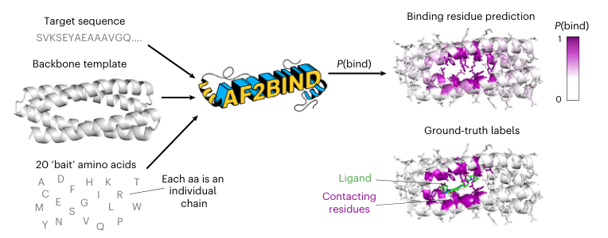
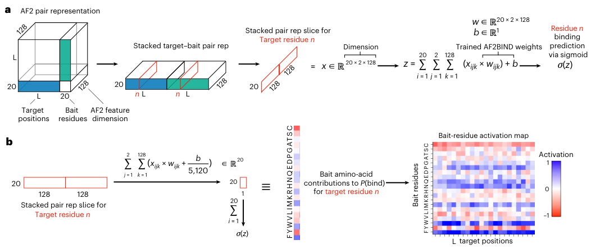
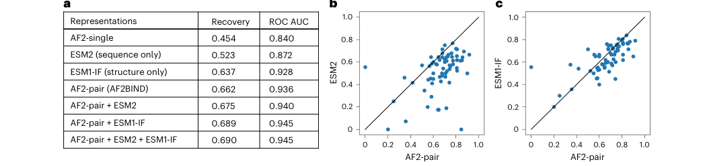
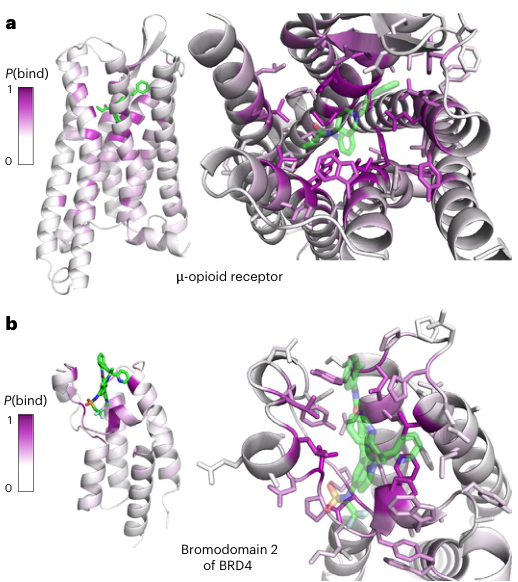
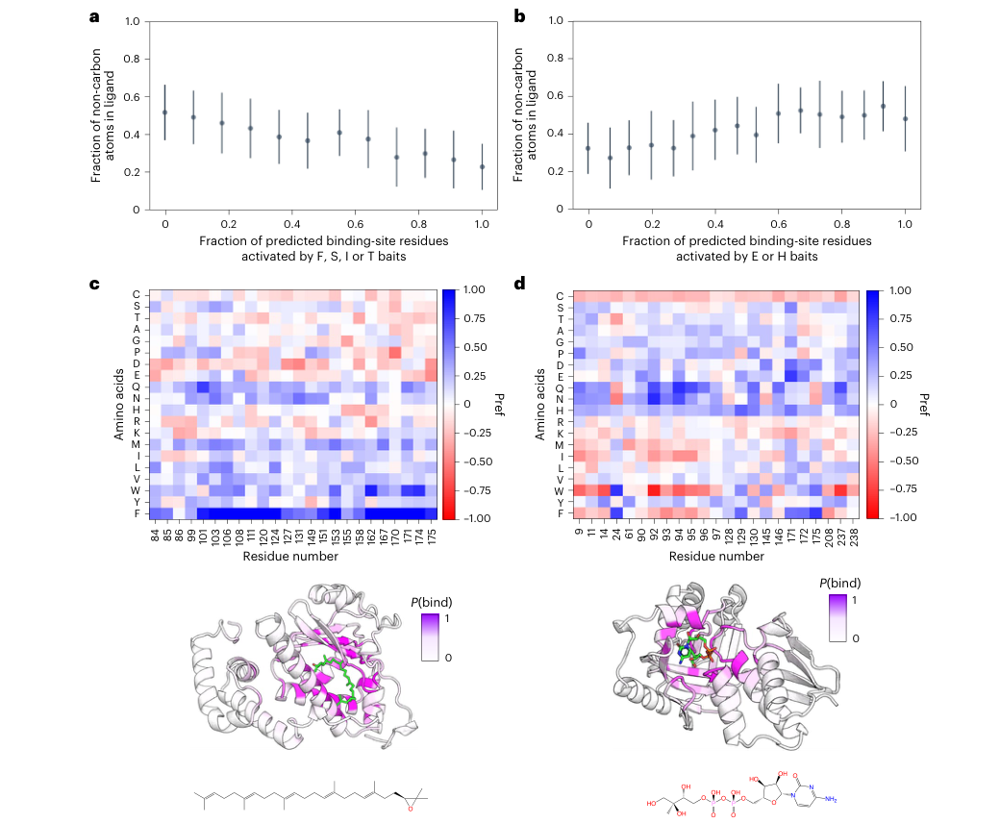
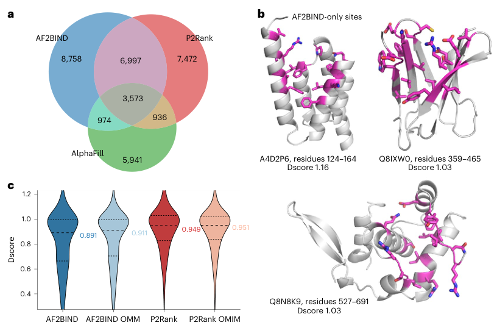

# AF2BIND: predicting small-molecule binding sites using the pair representation of AlphaFold2

### 原文链接：[全文](https://doi.org/10.1038/s41592-026-03011-2)

作者：Artem Gazizov, Anna Lian, Casper Goverde, Jody Mou, Sergey Ovchinnikov, Nicholas F. Polizzi

Nature Methods，2026 年 3 月

---
找到蛋白质上小分子可能结合的位置，是药物发现的起点。传统方法要么依赖已知同源结构，要么靠几何口袋检测，对没有已知配体、没有明显凹陷的蛋白往往束手无策。

哈佛大学和 MIT 的团队提出了 **AF2BIND**：它向 AlphaFold2 输入目标蛋白加上 **20 种氨基酸"诱饵"**，读取 AlphaFold2 内部的 pair representation，再用一个简单的逻辑回归模型预测每个残基参与小分子结合的概率。不需要 MSA、不需要已知配体、不需要同源模板。

*本文先讲 AF2BIND 的核心思路，再通过三张图看方法流程、跨家族泛化和蛋白质组规模的新位点发现。*

## 一、研究问题

预测蛋白质上的小分子结合位点有三条常见路线：**同源转移**（如 AlphaFill）从相似蛋白搬运已知配体，但遇到新折叠或未被配体占据过的位点就失效；**几何口袋检测**（如 fpocket、P2Rank）根据表面凹陷识别口袋，容易漏掉浅表或弥散的结合区域；**从头训练的深度学习**需要大量非冗余蛋白–配体复合物数据，数据有限时容易过拟合。

作者注意到一个有趣的事实：AlphaFold2 的训练目标只是预测蛋白质结构，并不涉及小分子结合。但为了准确预测折叠，它的内部表征必须编码大量与结合位点相关的信息——局部几何、残基间相互作用、溶剂暴露程度、电荷与极性环境、序列保守性和共变关系。小分子结合位点往往具有未被蛋白内部相互作用完全满足的化学环境（例如埋藏的极性基团、局部结构受挫），这些特征很可能已经反映在 AlphaFold2 的内部特征中。

问题是：**如何把这些信息"读"出来？**作者想解决的是更严格的 de novo 结合位点预测：对一个没有已知配体、没有可转移的同源结合位点的蛋白，仅根据序列和结构预测小分子可能结合在哪里。

## 二、方法核心：用 20 种氨基酸当探针，读出 AF2 的配对表征

**诱饵氨基酸：小分子官能团的替代探针**

AF2BIND 的输入有三部分：目标蛋白的氨基酸序列、骨架结构（作为 AlphaFold2 的模板），以及 **20 种天然氨基酸作为"诱饵"（bait amino acids）**，每种一个，各自作为独立的短链。这是整个方法最有创意的部分。这些诱饵充当小分子官能团的替代探针——Phe/Trp/Tyr 近似芳香基团，Asp/Glu 近似羧酸基，Lys/Arg 近似正电基团，Ile/Leu/Val 近似疏水基团，Asn/Gln/Ser/Thr 近似极性基团。作者分析 PDB 中约 40,000 种化合物，发现以 Morgan fingerprint 衡量，一个分子平均约有 46%–50% 的化学环境可以用氨基酸官能团覆盖。

**Pair representation + 逻辑回归**

AlphaFold2 只做**一次前向计算**（不 recycle），提取目标残基与 20 种诱饵之间的 pair representation。通常 AlphaFold2 会进行多轮 recycle 反复修正结构，但 AF2BIND 只要一次，因为作者希望捕捉的是诱饵被结构模块放置之前、目标蛋白与诱饵之间最初的注意力信号。输入时还屏蔽了侧链二面角信息，只保留骨架和 Cβ 附近的信息，这让模型不依赖精确的侧链 rotamer。

对每个残基，pair representation 产生 20 × 2 × 128 = **5,120 维特征向量**，输入逻辑回归模型得到 P(bind)。作者刻意选择线性模型而非复杂神经网络，目的是保持可解释性：每种诱饵对预测的贡献可以直接拆解，相当于一张粗略的"位点化学指纹"——不仅回答"哪里可能结合"，还能初步推断"偏疏水还是偏极性"。推荐的分类阈值为 P(bind) > 0.28，对应约 67% 的召回率和 63% 的精确率。

**严格的数据划分**

训练数据来自 PDB 中 1,897 个单链蛋白–小分子复合物。测试集中 67 个复合物不仅与训练集序列不相似，**结构域分类（ECOD、CATH、SCOP2B）、Pfam 注释和口袋结构相似性也都不重叠**。这很重要——即使两个蛋白整体序列不同，结合口袋仍可能高度相似；只按序列拆分，模型可能只是"记住了口袋"。在这种划分下，AF2BIND 十折交叉验证的结合残基 recovery 为 **66.2%**，ROC AUC 为 **0.936**（详见 Figure 3）。

## 三、看图说话

### Figure 1 · AF2BIND 工作流程

**这张图想回答：**AF2BIND 如何利用 AlphaFold2 内部的 pair representation 来预测小分子结合位点？

{: width="764" height="300" loading="lazy" decoding="async"}

*Figure 1. AF2BIND 工作流程。*

图从左到右展示整个流程。**左侧输入**有三部分：目标蛋白序列（上方字母串）、蛋白质骨架三维结构、以及 20 种标准氨基酸"诱饵"（下方列表，每种作为一条独立短链）。这三部分一起送入 AlphaFold2，只做一次前向计算，不做 recycle。

**中间矩阵**是 AlphaFold2 产生的 pair representation。AF2BIND 只取蓝色和绿色区域，即目标残基与 20 个诱饵之间的配对特征——蓝色对应目标→诱饵方向，绿色对应诱饵→目标方向。每个残基得到 20 × 2 × 128 = 5,120 维特征，展平后输入逻辑回归。

**右侧输出**：蛋白质表面从白到紫着色，紫色越深表示 P(bind) 越高。绿色棒状物是真实配体。图中结合位点附近的残基呈深紫色，与真实配体位置高度一致，说明从 pair representation 提取的特征能有效定位结合位点。

这张图传达的核心概念是：输入蛋白序列、骨架和 20 种氨基酸探针，就能输出残基级的小分子结合概率，而不需要提前知道真正的配体是什么。模型没有做分子对接，而是在回答"仅根据蛋白质本身的结构和 AF2 内部表征，哪些残基具有小分子结合特征"。

### Figure 2 · 从配对表征到结合概率

**这张图想回答：**AF2BIND 具体怎样把 AF2 的配对表征变成一个残基的结合概率？每种诱饵贡献了多少？

{: width="1052" height="444" loading="lazy" decoding="async"}

*Figure 2. (a) 取目标残基与 20 个诱饵之间两个方向的配对特征（蓝、绿），展平成 20 × 2 × 128 维向量，经逻辑回归和 sigmoid 得到 P(bind)。(b) 线性模型可以按诱饵拆分，得到每种诱饵氨基酸对每个目标残基的激活值。*

* **Panel a**：左边的立方体是 AF2 的 pair representation，边长 L+20（目标蛋白 L 个残基加 20 个诱饵），深度 128 是特征维度。蓝色块是"目标→诱饵"方向，绿色块是"诱饵→目标"方向。AF2 的配对表征不对称，所以两个方向都要用。对第 n 个目标残基切出一片，得到 **20 × 2 × 128 = 5,120 维**输入，乘上训练好的权重 w、加偏置 b，过 sigmoid 就是 P(bind)。整个分类器只有这一层。
* **Panel b**：因为模型是线性的，总分 z 可以严格拆成 20 份：对每种诱饵，把它对应的 256 个特征乘权重求和，再分摊一份偏置。拆出来的 20 个数就是每种诱饵的"激活值"。右边的热图横轴是目标残基位置，纵轴是 20 种诱饵，**蓝色为正贡献、红色为负贡献**。

这张图解释了作者为什么坚持用逻辑回归：换成多层网络也许能多拿一点分数，但就拆不出"哪种诱饵在推动预测"。这张拆分图正是后面 Figure 5 化学指纹分析的基础。

### Figure 3 · 哪种预训练表征最懂结合位点

**这张图想回答：**AF2 的配对表征比序列模型、反向折叠模型的表征强多少？优势是不是逐个蛋白都成立？

{: width="1048" height="248" loading="lazy" decoding="async"}

*Figure 3. (a) 十折交叉验证中，不同表征接逻辑回归的平均结合位点 recovery 与 ROC AUC。(b, c) 测试集上逐蛋白比较 AF2-pair 与 ESM2、ESM1-IF 的 recovery，每个点是一个靶蛋白。*

**指标**：recovery 借用了接触预测的评价方式。一个蛋白有 n 个真实结合残基，就把预测按置信度排序、取前 n 个，看命中几个。这样不同模型的分数即使没有校准到同一尺度，也能公平比较。

* **Panel a**：AF2 单残基表征只有 0.454；只看序列的 ESM2 有 **0.523**，说明结合位点在进化上留有序列信号；只看骨架的 ESM1-IF 达到 **0.637**，说明骨架几何本身就编码了大量结合信息；AF2-pair 以 **0.662 / ROC AUC 0.936** 成为最强的单一表征。三者拼在一起也只到 0.690 / 0.945，提升有限，作者因此选了更简单、可解释的 AF2-pair 单独建模。
* **Panel b、c**：横轴是 AF2-pair，纵轴分别是 ESM2 和 ESM1-IF，对角线右下方的点表示 AF2-pair 更好。和 ESM2 比，大多数点落在对角线下方；和 ESM1-IF 比，点更贴近对角线，差距明显缩小，骨架信息已经覆盖了很大一部分信号。

### Figure 4 · 跨家族泛化

**这张图想回答：**模型能否预测训练时从未见过的蛋白家族上的结合位点？

{: width="518" height="582" loading="lazy" decoding="async"}

*Figure 4. 跨家族泛化测试。*

* **Panel a：μ-阿片受体与芬太尼。**这是一个 GPCR，训练时作者将整个 GPCR 家族以及相似结构和口袋全部排除。蛋白表面按 P(bind) 着色（白→紫），绿色棒状结构是芬太尼。高分残基集中在跨膜区内部的正构口袋，与芬太尼所在位置高度一致，远离配体的区域保持白色。值得注意的是，这些高分残基与序列保守性并非简单相关——正构位点并不总是蛋白中最保守的区域，说明模型学到的是更一般的结合位点化学特征。
* **Panel b：BRD4 第二个 bromodomain。**同样将 bromodomain 及相似蛋白从训练中排除。紫色高分残基集中在抑制剂结合的乙酰化赖氨酸识别口袋周围，对口袋内不同残基给出了区分度明显的概率。

两个案例共同证明 AF2BIND 具有真正的跨家族泛化能力。传统几何口袋方法输出的是"这里存在一个凹陷"，AF2BIND 则精确到"凹陷中哪些残基最可能参与小分子相互作用"——这种残基级排序可以用于选择对接约束、指导突变实验、判断口袋中的核心锚点残基。同时，在 μ-阿片受体多个晶体结构上（平均 Cα RMSD 约 0.7 Å），每个残基的 P(bind) 标准差仅约 0.02，说明预测对输入结构的微小变化具有稳健性。

### Figure 5 · 诱饵激活是一张位点化学指纹

**这张图想回答：**诱饵氨基酸的激活模式，能不能告诉我们这个位点偏爱疏水还是极性配体？

{: width="1040" height="856" loading="lazy" decoding="async"}

*Figure 5. (a) 被 F、S、I、T 诱饵激活的预测结合残基比例越高，配体中非碳原子比例越低。(b) 被 H、E 诱饵激活的比例越高，配体越亲水。(c) 疏水配体案例 PDB 4OMJ（2,3-环氧角鲨烯），W、F 激活占主导。(d) 极性配体案例 PDB 2V2Z，W、F 激活下降，Q、N 等极性诱饵上升。a、b 为 1,896 个蛋白的均值 ± 标准差。*

* **Panel a、b**：作者在全部 1,896 个蛋白–配体复合物上做激活分析，用"配体中非碳原子的比例"衡量亲水性。在所有诱饵组合里，**F、S、I、T 这一组和配体疏水性的 Pearson 相关最高**：被它们激活的结合残基越多，配体越富碳。**H、E 这一对则和亲水性相关最高**：被它们激活越多，配体含杂原子越多。FSIT 是数据筛出来的最佳组合，里面的 S、T 本身并不疏水，应把它看作统计模式，不必逐个按化学直觉解释。
* **Panel c**：上半部分热图纵轴是 20 种诱饵，横轴是预测出的结合残基，蓝色为正激活。上清蛋白因子（supernatant protein factor，PDB 4OMJ）结合的是高度疏水的萜类 2,3-环氧角鲨烯，热图里 **F 这一行几乎整行深蓝**，W 也多处为正。下方结构图中紫色的高 P(bind) 残基正好包住绿色配体。
* **Panel d**：激酶 2V2Z 的底物带多个羟基和磷酸基，极性很强。这次 W 一行变成红色，**Q、N 等极性诱饵转为正贡献**。

这张图让 AF2BIND 从"哪里能结合"往前走了一步，能粗略判断"适合什么样的配体"。目前它只能区分疏水与极性这样的粗粒度性质，离预测具体配体还很远，但已经可以用来挑选片段库或给对接设置化学偏好。

### Figure 6 · 人类蛋白质组分析

**这张图想回答：**在人类蛋白质组规模上，AF2BIND 能发现多少传统方法遗漏的结合位点？

{: width="816" height="538" loading="lazy" decoding="async"}

*Figure 6. 人类蛋白质组位点发现。*

* **Panel a：三种方法的 Venn 图。**AF2BIND 共预测 20,302 个结合位点（13,686 个蛋白），其中 **6,997 个是 AF2BIND 独有**——P2Rank 和 AlphaFill 都未预测到。反过来 P2Rank 也有 7,472 个独有位点。三种方法捕捉的是部分不同的信号：AlphaFill 靠已知同源关系，P2Rank 靠表面几何口袋，AF2BIND 靠预训练模型中的残基对特征。
* **Panel b：AF2BIND 独有位点案例。**展示三个蛋白上 AF2BIND 独有的高质量位点（P2Rank 和 AlphaFill 均未覆盖），这些位点在表面可能不是传统意义上的深凹口袋，但 AF2BIND 从 pair representation 中识别出了结合特征。
* **Panel c：可成药性比较。**用 SiteMap Dscore 评估，AF2BIND 位点的中位数为 0.891（高于常用阈值 0.83），但分布比 P2Rank 位点略偏左——AF2BIND 发现的位点平均更浅、更暴露、包裹性略低，P2Rank 偏好深凹、包裹性强的口袋。这正好解释了两种方法互补的本质：几何方法擅长找深口袋，AF2BIND 擅长找化学环境适合结合但几何上不突出的位点。在 OMIM 数据库约 5,700 个疾病相关蛋白中，AF2BIND 在 3,556 个蛋白中预测到位点，其中 411 个蛋白的位点既未被 P2Rank 覆盖、也未被 AlphaFill 覆盖。

## 四、核心贡献总结

AF2BIND 的核心贡献是证明了 **AlphaFold2 的内部表征可以迁移到小分子结合位点预测**。这种"预训练模型 + 轻量下游分类器"的范式，与 NLP 中"大模型提特征 + 线性探针做分类"的思路一脉相承。AF2BIND 本身只训练了逻辑回归层的权重，但依赖 AlphaFold2 在海量蛋白结构数据上学到的表示能力。

更深层的发现是：蛋白内部的残基–残基相互作用模式，可以迁移用于识别蛋白–小分子相互作用——因为许多小分子官能团与氨基酸侧链的化学环境存在局部相似性。诱饵氨基酸的设计利用了这一点，让模型能初步推断位点的化学偏好。作者将 20 个诱饵对 P(bind) 的贡献拆开，发现结合疏水性配体的蛋白主要由 Phe、Trp 等芳香/疏水诱饵激活，结合极性底物的激酶则 Gln、Asn 等极性诱饵贡献更明显。

实际使用中，AF2BIND 最适合与 P2Rank、fpocket 等几何口袋方法联合使用：优先关注两种方法共同支持的位点，对 AF2BIND 独有的浅表位点重点检查是否位于功能界面或变构区域，再根据诱饵激活分析判断化学偏好，然后用分子对接或共结构模型（如 AlphaFold3、Boltz、RoseTTAFold All-Atom）筛选配体，最终通过片段筛选、SPR 或化学蛋白质组学验证。

## 五、局限与展望

如果输入结构中口袋完全坍塌（隐蔽口袋），模型通常会漏检——在 β-内酰胺酶的案例中，apo 状态下一段螺旋封闭了口袋，AF2BIND 无法预测被掩埋的结合残基。这是模型最主要的结构性局限。

20 种天然氨基酸只覆盖有限化学空间，卤素、硼酸、磺酰胺、特殊杂环等官能团无法表示，作者建议未来用更丰富的小分子片段作为诱饵。训练数据偏向 PDB 中已结晶的经典药物样口袋，正构位点远多于变构位点。人类蛋白质组分析以单链 AlphaFold 结构为主，真实结合位点中很多存在于寡聚体界面、蛋白–核酸复合物或多结构域重排形成的口袋中。P(bind) 较高只表示残基具有小分子结合特征，并不直接给出配体姿势、亲和力或选择性。

## 通讯作者介绍

**Sergey Ovchinnikov** 在本文的署名单位是 MIT 生物系，此前是哈佛的 John Harvard Distinguished Science Fellow，本科毕业于加州大学戴维斯分校生物物理学专业，在华盛顿大学获得生物物理学博士学位（导师 David Baker），博士期间研究蛋白质共进化与结构预测，之后在哈佛大学从事博士后研究，研究方向为蛋白质设计和机器学习驱动的蛋白质结构预测。**Nicholas F. Polizzi** 在本文的署名单位是 Dana-Farber 癌症研究所肿瘤生物学系和哈佛医学院生物化学与分子药理学系，本科毕业于罗格斯大学化学专业，在宾夕法尼亚大学获得化学博士学位，之后在加州理工学院和 MIT 从事博士后研究，研究方向为计算蛋白质设计和蛋白质–小分子相互作用。

## 引用

Gazizov, A., Lian, A., Goverde, C., Mou, J., Ovchinnikov, S., & Polizzi, N. F. (2026). AF2BIND: predicting small-molecule binding sites using the pair representation of AlphaFold2. Nature Methods, 23(3), 626-635. https://doi.org/10.1038/s41592-026-03011-2
