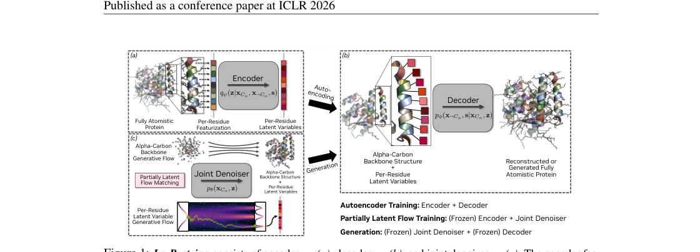
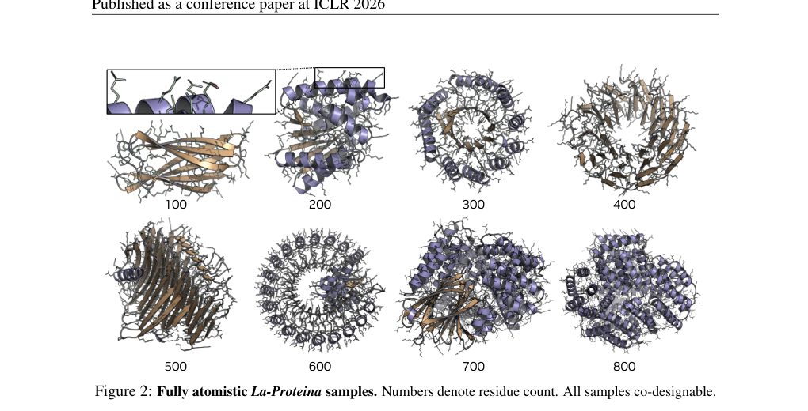
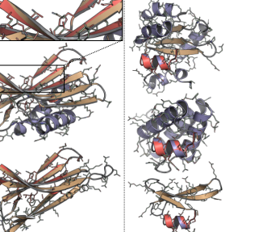
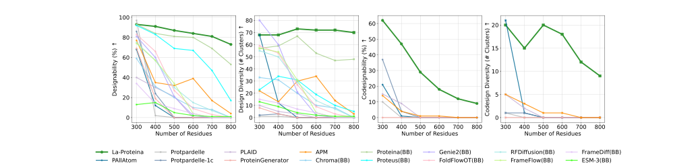
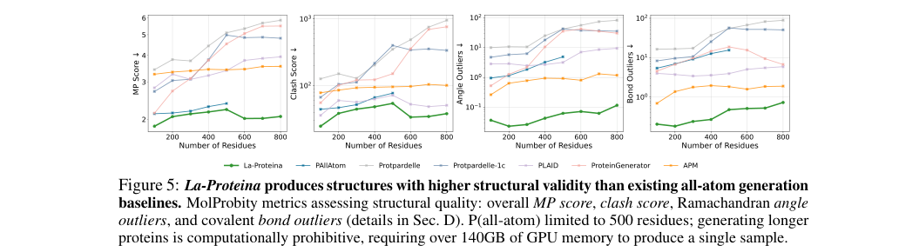
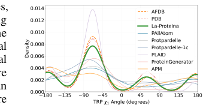
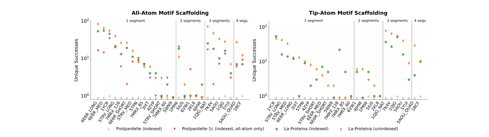
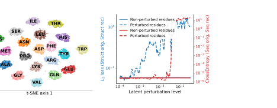

# La-Proteina: Atomistic Protein Generation via Partially Latent Flow Matching

### Link: [full article](https://doi.org/10.48550/arXiv.2507.09466)

Authors: Tomas Geffner, Kieran Didi, Zhonglin Cao, ..., Arash Vahdat

arXiv, May 27, 2026

---
**Overview**

The most complete form of protein design generates the sequence and the full-atom three-dimensional structure at the same time, but all-atom generation runs into hard problems: discrete sequences mixed with continuous coordinates, different amino acids having different numbers of side-chain atoms, and memory blowing up on long proteins. This paper introduces **La-Proteina, an all-atom protein generative model built on a partially latent representation and flow matching**: Cα backbone coordinates are modeled explicitly, while sequence and side-chain information are compressed into a fixed 8-dimensional continuous latent variable per residue; flow matching then jointly generates the backbone and the latents, and a VAE decoder restores the complete all-atom structure. La-Proteina reaches 68.4% all-atom co-designability, nearly twice the previous best, can generate co-designable proteins up to 800 residues long, and leads by a wide margin on atomistic motif scaffolding.

## Part 1: Research Question

An ideal protein design tool should output both the amino acid sequence and a three-dimensional structure accurate to every atom, that is, model and sample from the joint distribution p(sequence, all-atom structure). Many protein generative models have appeared in recent years, and methods such as RFDiffusion, Chroma and FrameFlow do excellent work on backbone generation, but most of them generate only backbones and then need ProteinMPNN to design sequences and AlphaFold to predict the complete structure. In functional-site design, such as enzyme active sites or metal coordination sites, the position and orientation of specific side-chain atoms in three-dimensional space must be controlled precisely, and this staged strategy struggles to guarantee atomic accuracy while errors accumulate from stage to stage.

Generating sequence and all-atom structure jointly faces three obstacles. **First**, the sequence is a discrete categorical variable (20 amino acids) while atomic coordinates are continuous, so the model must handle discrete and continuous spaces in one framework; pure diffusion or pure flow matching is naturally suited to continuous spaces, and adding discrete variables requires extra modeling strategies. **Second**, the number of side-chain atoms varies enormously between amino acids: glycine has essentially no side chain, alanine has a single methyl carbon, and tryptophan has a bicyclic indole with 9 heavy atoms. The paper uses the Atom37 representation (37 potential atom slots for every residue), but the number of effective atoms ranges from 4 to 14, so the effective output dimensionality at each position depends on the sequence itself, creating a circular dependency. **Third**, treating each atom as an independent generation target means a 500-residue protein involves roughly 4,000 heavy atoms and 12,000 coordinate dimensions, and memory and compute costs grow sharply. The paper notes that existing all-atom models such as P(all-atom) and PLAID tend to break down beyond about 500 residues: co-designability drops to 0%, memory overflows, or no structurally sensible samples can be produced at all.

## Part 2: Methodology: A partially latent representation

La-Proteina's central design choice is to split protein information in two: **Cα backbone coordinates are kept explicit, while sequence and side-chain information are compressed into fixed-dimensional continuous latent variables**. For a protein of length L, the data the model actually operates on are the Cα coordinates (L × 3) plus an 8-dimensional latent per residue (L × 8), forming a single continuous space that sidesteps the difficulty of handling discrete sequences and variable-length side chains directly.

Keeping Cα coordinates explicit has four key advantages. First, it can directly inherit mature backbone generation architectures (diffusion and flow models such as RFDiffusion and FrameFlow that already excel at backbone generation). Second, large-scale geometric information is preserved, so the entire global shape does not have to be recovered from low-dimensional latents. Third, the backbone and the side chains can be generated at different speeds, and experiments show that letting the backbone take shape quickly and filling in side-chain details afterwards is the optimal strategy. Fourth, only 8 dimensions per residue are added, so the internal sequence length still scales with the number of residues, which guarantees scalability to long proteins. An ablation supports this design clearly: with explicit Cα modeling the all-atom co-designability is about 82.4%, and encoding the Cα into the latent space as well makes it plunge to 21.2%.

The model has three networks. The **encoder** maps the complete all-atom protein into an 8-dimensional Gaussian latent per residue; input features include Atom37 atomic coordinates, relative Cα coordinates, amino acid type, side-chain dihedrals, backbone dihedrals, and pairwise features such as inter-residue distances and orientations. The **decoder** reconstructs the sequence from the Cα coordinates and the latents (through a per-residue 20-way categorical distribution, taking the argmax for the amino acid type) and the non-Cα atomic coordinates (through Gaussians with fixed unit variance, taking the means for the atom positions). The **joint denoiser** learns, via flow matching, to generate the joint distribution of Cα backbone and latents from Gaussian noise.

Training has two stages. The **first stage** trains the VAE (encoder plus decoder), optimizing a weighted ELBO (evidence lower bound) objective: the reconstruction loss combines sequence cross-entropy and mean squared error on atomic coordinates, and the KL divergence regularization weight β is set to a very small 10⁻⁴ so the model prioritizes accurate reconstruction. On the test set it achieves a mean all-atom RMSD of just 0.12 Å and a sequence recovery rate of 100%, demonstrating that an 8-dimensional latent per residue is enough to encode the 20 amino acid types and side-chain conformations losslessly. The **second stage** freezes the VAE encoder and decoder and trains the flow matching model to learn the joint (Cα, z) distribution corresponding to real protein data. The key innovation is the use of **two independent time variables**: Cα and the latents each have their own denoising time t_x and t_z, with Cα on an exponential schedule (approaching the finished product faster) and the latents on a quadratic schedule (filling in more slowly), and times sampled during training from Beta(1.9, 1) and Beta(1, 1.5) distributions so that backbone denoising systematically runs ahead of side-chain detail. Ablations confirm that nearly every configuration exceeding 50% co-designability follows the pattern of a faster schedule for Cα and a slower one for the latents: backbone first, details later, is the key empirical conclusion behind the performance.

Generation starts from standard Gaussian noise and integrates a stochastic differential equation (SDE) numerically for 400 steps. The sampling noise strength η controls the trade-off between quality and diversity: co-designability is highest at η = 0.1 (68.4%), and as η grows co-designability falls while the amino acid frequency distribution moves closer to the natural UniProt distribution. The final Cα coordinates and latents are restored into a complete all-atom protein by the frozen decoder: the sequence takes the argmax of the classification logits and the non-Cα coordinates take the means of the Gaussian decoding distribution. The networks use a Transformer architecture with pair-biased attention, with roughly 130M parameters each for the encoder and decoder and about 160M for the flow denoiser. Training uses the Foldseek cluster representative subset of the AlphaFold database (AFDB), roughly 46 million structure-sequence pairs.

## Part 3: Key Figure Analysis

### Figure 1: Encoder, decoder and joint denoiser

**What this figure asks:** How does La-Proteina split protein information into backbone coordinates and continuous latent variables for generation?

{: width="1120" height="404" loading="lazy" decoding="async"}

*Figure 1. La-Proteina consists of an encoder qψ (a), a decoder pϕ (b) and a joint denoiser pθ (c). The encoder compresses the all-atom protein into per-residue latents, the denoiser jointly generates Cα and latents by flow matching, and the decoder restores the all-atom structure.*

**The core representation**: Cα backbone coordinates (L×3) are kept explicit, while sequence and side chains are compressed into an **8-dimensional continuous latent per residue** (L×8), concatenated into a single continuous space that sidesteps the difficulty of handling discrete sequences and variable-length side chains directly.

Keeping Cα explicit brings four benefits: it inherits mature backbone architectures directly, loses no global shape, lets the backbone and side chains use different denoising speeds, and adds only 8 dimensions per residue so long proteins remain tractable. The ablation evidence is hard: **with explicit Cα modeling co-designability is about 82.4%, and encoding Cα into the latent space as well makes it plunge to 21.2%**.

### Figure 2: All-atom generated samples

**What this figure asks:** What do the all-atom proteins generated directly by the model look like, and how good are they?

{: width="1020" height="520" loading="lazy" decoding="async"}

*Figure 2. All-atom samples generated by La-Proteina; numbers give the residue count, and all samples are co-designable.*

These are complete all-atom structures (backbone plus side chains plus sequence) produced by the model in one shot, covering residue counts from small to large, all passing the co-designability test. They illustrate directly what joint generation of sequence and all-atom structure delivers, in contrast to producing a backbone first and adding a sequence afterwards.

### Figure 3: Atomistic motif scaffolding examples

**What this figure asks:** Given the atomic coordinates of a functional site, can the model generate diverse scaffolds that wrap around it?

{: width="336" height="288" loading="lazy" decoding="async"}

*Figure 3. Atomistic motif scaffolding. La-Proteina reconstructs the atomistic motif (red) accurately while generating diverse scaffolds.*

Red is the given functional motif (with fixed atomic coordinates), and the rest are different protein backbones generated by the model around that motif. **The motif is reconstructed with atomic accuracy while the scaffolds all differ**, which is exactly the capability enzyme design needs: functional sites such as catalytic triads depend on a precise arrangement of specific side-chain atoms, and backbone-level conditioning alone cannot guarantee atomic accuracy.

### Figure 4: Co-designability in unconditional generation

**What this figure asks:** In unconditional all-atom generation, how much higher is La-Proteina's co-designability than that of existing methods?

{: width="1032" height="250" loading="lazy" decoding="async"}

*Figure 4. Unconditional generation performance by length. Designability, diversity, co-designability and related metrics as a function of residue count, with La-Proteina (green) compared against more than ten baselines.*

La-Proteina in green sits clearly above every other method at all lengths. All-atom co-designability is **68.4%, nearly twice the previous best (P(all-atom) at 36.7%)** (the tri version with triangular multiplicative layers reaches 75.0%, at a higher memory cost). More important is the **long-protein regime**: other all-atom baselines drop to 0% co-designability around 500 residues or even run out of memory, while La-Proteina still holds about 80% backbone designability and close to 60% all-atom co-designability at 800 residues.

### Figure 5: Chemical plausibility of the structures

**What this figure asks:** Are the generated structures clean on chemical metrics such as bond lengths and angles, clashes and outliers?

{: width="1032" height="290" loading="lazy" decoding="async"}

*Figure 5. La-Proteina's structural validity exceeds that of existing all-atom baselines. MolProbity metrics: MP score, clash score, Ramachandran angle outliers and covalent bond outliers (lower is better).*

The four plots are overall MP score, atomic clashes, Ramachandran angle outliers and covalent bond outliers, and lower on the vertical axis is better. **La-Proteina in green is lowest on all four**, indicating that the generated structures respect the chemical constraints of real proteins rather than merely looking plausible while violating details. Note that the caption also points out that all-atom scoring was limited to 500 residues by compute, since generating a single longer sample requires more than 140 GB of memory.

### Figure 6: Recovering side-chain rotamer distributions

**What this figure asks:** Can the model reproduce the multiple stable states of side-chain dihedral angles seen in real proteins?

{: width="364" height="180" loading="lazy" decoding="async"}

*Figure 6. Tryptophan χ₁ dihedral distribution, comparing AFDB and PDB references with La-Proteina and the baselines.*

Taking tryptophan χ₁ as the example, real proteins (AFDB/PDB) have three main stable states at −60°, 60° and 180°. **La-Proteina (green) accurately reproduces the positions and relative heights of all three peaks**, whereas some baselines miss a rotamer or deviate badly in frequency, which means they fail to cover the true side-chain conformational space. The appendix repeats the same analysis for almost every amino acid with side-chain dihedrals, with consistent conclusions.

### Figure 7: Results on 26 motif scaffolding tasks

**What this figure asks:** On a strict atomistic motif scaffolding benchmark, how much stronger is La-Proteina than its competitors?

{: width="1032" height="290" loading="lazy" decoding="async"}

*Figure 7. Twenty-six atomistic motif scaffolding tasks (x-axis), with the all-atom setting on the left and the tip-atom setting on the right, comparing Protpardelle, Protpardelle-1c and La-Proteina (indexed / unindexed).*

Two settings: **all-atom** provides every atom of the motif, and **tip-atom** provides only the functional atoms at the side-chain tip (so the model must also infer the whole side chain and the backbone placement), which is harder. The success criteria are strict (the motif sequence must be fully recovered and the Cα RMSD must be small). **The unique successes of La-Proteina in green and orange exceed the Protpardelle family on the vast majority of tasks** (the gray triangles barely leave the floor), with both indexed and unindexed clearly ahead.

### Figure 8: The chemical meaning of the latent space

**What this figure asks:** What exactly do those 8 latent dimensions learn? Is the representation local or globally entangled?

{: width="468" height="184" loading="lazy" decoding="async"}

*Figure 8. Latent space analysis. Left: t-SNE of the latent variables. Right: locality analysis under perturbation of the latents (structure and sequence reconstruction error as a function of perturbation strength).*

**Left, t-SNE**: the 20 amino acids form clear clusters in the 8-dimensional latent space, with chemically similar ones close together (the aromatics Phe/Tyr/Trp in one cluster, Gln/Glu and Asn/Asp each adjacent), showing that **distance in latent space corresponds roughly to the chemical similarity of residues**. **Right, perturbation analysis**: changing the latent of one residue significantly affects only that residue's reconstruction and barely moves the others, so despite the use of global attention the model has **automatically learned a residue-aligned local representation**, which makes it naturally suited to local editing and functional-site design.

## Part 4: Key Contributions

The authors generated 100 proteins at each of lengths 100, 200, 300, 400 and 500 residues to evaluate unconditional all-atom generation systematically. The core metric is all-atom co-designability: the sequence produced by the model is folded by ESMFold, and if the predicted structure is within 2 Å RMSD of the all-atom structure the model generated directly, co-design counts as successful. Compared with six publicly available all-atom generation baselines, P(all-atom) (36.7%), Protpardelle-1c (35.8%), APM (19.0%), PLAID (11.0%), ProteinGenerator (9.8%) and Protpardelle (8.8%), **La-Proteina reaches 68.4% all-atom co-designability, nearly twice the previous best method**. The La-Proteina tri version, which adds triangular multiplicative update layers (similar to the triangular multiplicative update in the AlphaFold2 Evoformer), pushes this further to 75.0% but at higher compute and memory cost, which largely confines it to short proteins. La-Proteina also performs well on the pLDDT of co-designable samples (72.2), ProteinMPNN-8 designability (93.8%) and ProteinMPNN-1 designability (82.6%), and maintains 301 distinct clusters in the joint diversity of structure and sequence.

The ability to generate long proteins deserves particular attention. The authors additionally trained a long-protein version on AFDB (with samples up to 896 residues) and compared it against 12 methods, including backbone-only models, over the 300 to 800 residue range. All all-atom baselines have essentially collapsed by about 500 residues (co-designability falling to 0%), and some cannot even produce samples because they run out of memory. By contrast, **La-Proteina still holds about 80% backbone designability and close to 60% all-atom co-designability at 800 residues**, while maintaining structural diversity of about 20 distinct clusters. Even against backbone-only models such as RFDiffusion, FrameFlow and Genie2, which are strong on backbone designability, La-Proteina's backbone quality is fully competitive while it additionally delivers the sequence and the all-atom structure, showing that the partially latent framework does not sacrifice backbone quality for all-atom capability. This scalability comes from the efficiency of the partially latent representation: only 8 extra dimensions per residue, with the internal sequence length always proportional to the residue count L.

Biophysical quality analysis further confirms the chemical plausibility of the generated structures. Evaluated with MolProbity on bond lengths, bond angles, Ramachandran outliers and covalent bond outliers, La-Proteina beats the all-atom baselines on every dimension. Quantitative validation of side-chain rotamer distributions is especially important: taking the tryptophan χ₁ dihedral as an example, La-Proteina accurately reproduces the positions and relative frequencies of the three main stable states at −60°, 60° and 180° in the PDB and AFDB reference data. Some baselines, by contrast, miss certain rotamer modes or deviate badly in frequency, meaning they cannot cover the full side-chain conformational space of real proteins. The appendix of the paper carries out similar analyses for almost every amino acid with side-chain dihedrals, and La-Proteina is consistent across all of them.

**Atomistic motif scaffolding**

La-Proteina's all-atom capability lets it carry out atomistic conditional design: given the atomic coordinates of a functional site (motif), generate a complete protein scaffold around it. Such tasks are especially critical in enzyme design, where the function of a catalytic site often depends on the precise spatial arrangement of specific side-chain atoms (for instance the serine hydroxyl, the histidine imidazole ring and the aspartate carboxyl in a catalytic triad), and backbone-level conditioning alone cannot guarantee that atomic accuracy.

The authors evaluated four settings on 26 motif scaffolding tasks: **all-atom** (all backbone and side-chain atom coordinates of the motif residues plus their amino acid types are given), **tip-atom** (only the functional atoms at the side-chain tip are given, such as a catalytic nitrogen or a metal-coordinating atom, with the model also having to infer the conformation of the whole side chain and the backbone placement), **indexed** (the positions of the motif residues in the new protein sequence are specified in advance) and **unindexed** (the positions are decided by the model as well). The success criteria are very strict: the motif sequence must be recovered exactly, the motif Cα RMSD must be &lt; 1 Å, the motif all-atom RMSD must be &lt; 2 Å, and the entire protein must be all-atom co-designable. La-Proteina leads the Protpardelle baseline by a wide margin in all four settings, successfully solving 21 to 25 of the 26 tasks (Protpardelle solves only about 4), and produces more structurally unique successful scaffolds on every task. One interesting finding is that for complex motifs made up of three or four discontinuous segments, the unindexed mode actually outperforms the indexed one: the indexed setting fixes the sequence spacing between motif segments and their absolute positions along the chain, which may over-constrain the space of scaffold topologies and make loop lengths and the overall fold hard to optimize.

Latent space analysis reveals a structural source of the model's effectiveness. The t-SNE visualization shows the 20 amino acids forming clear clusters in the 8-dimensional latent space, with chemically similar amino acids close to one another: the three aromatics Phe, Tyr and Trp cluster together, and the pairs Gln/Glu and Asn/Asp, which have similar side-chain scaffolds but different terminal groups, are each adjacent. This indicates that the continuous representation learned by the latents carries chemically meaningful distance relationships, which can be read as distance in latent space corresponding roughly to how similar residues are structurally and chemically. Local perturbation experiments further show that changing the latent of a single residue significantly affects only that residue's reconstruction error and has almost no effect on other residues along the chain, so even though the encoder and decoder use Transformers with global attention, the model still automatically learns a residue-aligned, local representation. This locality makes La-Proteina naturally suited to local editing and functional-site design: keep the overall backbone fixed and modify only the sequence and side-chain conformation at a particular site.

## Part 5: Limitations and Outlook

A few points to keep in mind. **Compute and memory**: the more accurate tri version (with triangular multiplicative layers) is expensive in compute and memory and is essentially limited to short proteins, and all-atom MolProbity evaluation was likewise capped at 500 residues by compute, since generating a single longer sample requires more than 140 GB of memory.

**The quality-diversity trade-off**: the sampling noise strength η is a compromise, with co-designability highest at η = 0.1 (68.4%) and falling as η grows while amino acid frequencies move closer to the natural distribution. In addition, all the evaluations are **computational** (ESMFold co-designability, MolProbity, t-SNE and so on), and no wet-lab experiment has yet confirmed that the generated proteins can actually be expressed, fold, and function.

Even so, the partially latent representation, which keeps the backbone explicit and compresses sequence and side chains into a few continuous latent dimensions per residue, solves three problems of all-atom generation at once: the discrete/continuous mix, variable side chains, and scalability to long proteins. It is a framework well worth borrowing from. Follow-up work (Didi et al. 2026) has already applied it to binder design.

## About the Corresponding Authors

Karsten Kreis is a Senior Research Scientist at NVIDIA Research, whose primary research focuses on deep generative models and their applications in scientific domains. Kreis received his bachelor's and master's degrees from RWTH Aachen University's Department of Physics in Germany, and his Ph.D. in statistical physics from the University of Waterloo in Canada, where he conducted computational simulations of liquid crystals and soft matter systems. He subsequently conducted postdoctoral research in collaboration with leading scholars in machine learning at the University of Toronto before joining NVIDIA Research. He has made broad methodological contributions to generative models including energy-based models, score matching, denoising diffusion models, and flow matching, with representative work including improvements to the training stability and sampling efficiency of score-based models. In recent years, Kreis has shifted his research focus toward scientific applications, applying these generative model frameworks to key problems such as de novo protein design and molecular generation. Arash Vahdat is a co-corresponding author and senior research scientist and research director at NVIDIA Research, with numerous influential works in variational autoencoders (VAE) and diffusion models. First author Tomas Geffner is from NVIDIA, and co-first author Kieran Didi's affiliation is with NVIDIA and the University of Oxford; team members also include researchers from NVIDIA, Mila (Quebec Artificial Intelligence Institute), and the University of Montreal. The paper's code has been open-sourced on GitHub (github.com/NVIDIA-Digital-Bio/la-proteina), facilitating researchers to reproduce and extend the work. Didi et al. (2026) have further applied La-Proteina to de novo protein complex design, demonstrating the framework's application potential in practical protein engineering scenarios.

## Citation

Geffner, T., Didi, K., Cao, Z., Reidenbach, D., Zhang, Z., Dallago, C., ... & Vahdat, A. (2026). La-Proteina: Atomistic Protein Generation via Partially Latent Flow Matching. arXiv. https://doi.org/10.48550/arXiv.2507.09466
