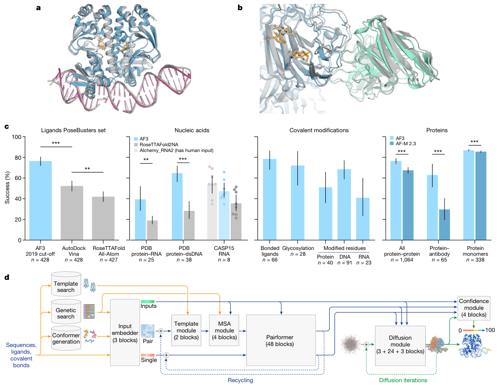
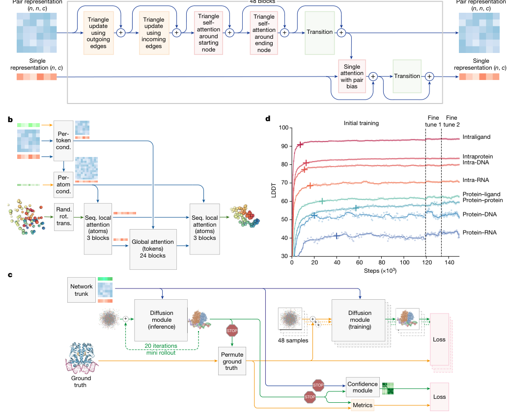
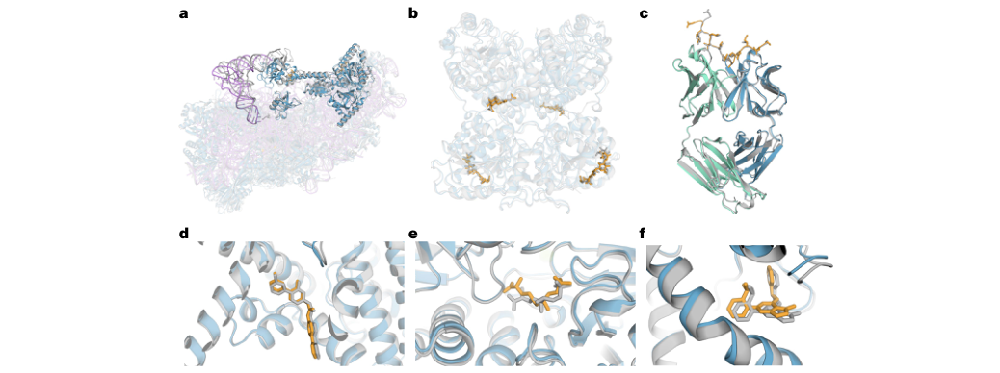
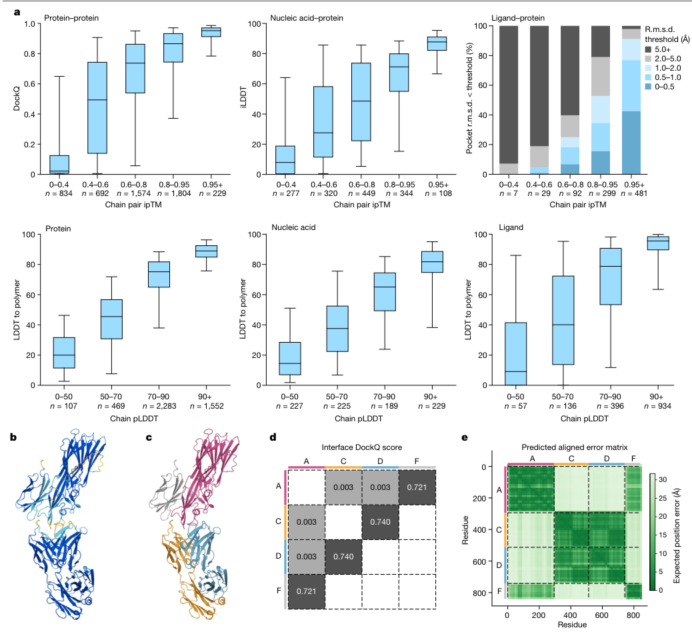
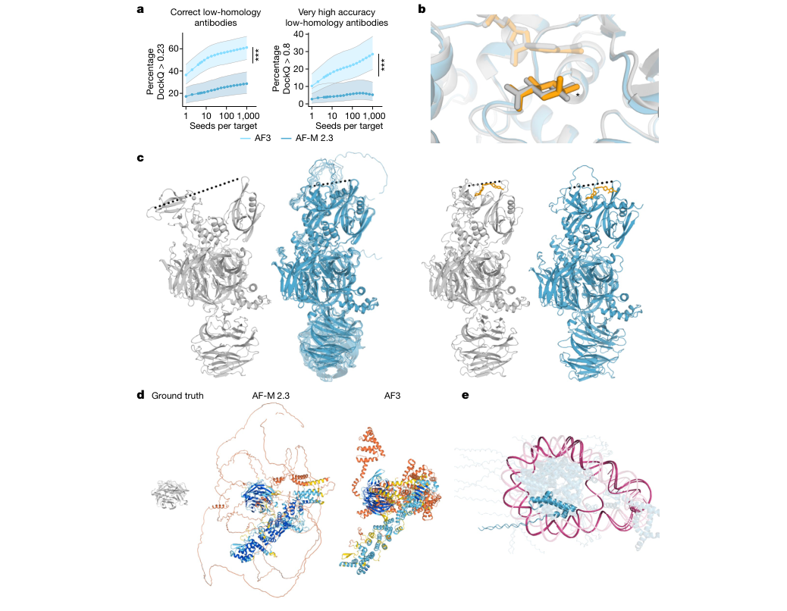

# Accurate structure prediction of biomolecular interactions with AlphaFold 3

### Link: [full article](https://doi.org/10.1038/s41586-024-07487-w)

Authors: Josh Abramson, Jonas Adler, Jack Dunger, ..., John M. Jumper

Nature, June 2024

---
AlphaFold 2 brought single-chain protein structure prediction close to experimental accuracy, yet the molecular machines inside cells are rarely made of protein alone: transcription factors must grip DNA, ribosomes are assembled from rRNA and dozens of proteins, drug molecules have to slot into protein pockets, and glycans and phosphate groups can rewrite how proteins bind to one another. Until recently, each of these problems belonged to its own specialized tool, each covering only one piece of the picture.

In May 2024, Google DeepMind and Isomorphic Labs published **AlphaFold 3 (AF3)** in Nature: given protein/DNA/RNA sequences, small-molecule SMILES, modified residues and covalent-bond information, it **directly outputs all-atom 3D coordinates for the entire complex**. To get there, the model makes two fundamental changes: **it replaces the Evoformer with a Pairformer that drastically simplifies MSA processing**, and **it replaces AF2's structure module with a diffusion module that denoises atomic coordinates directly**.

In terms of results, on the PoseBusters protein–ligand benchmark AF3 reaches a success rate (pocket-aligned ligand RMSD &lt; 2 Å) of **76.4%**, versus 52.3% for the classical docking tool Vina, even though Vina was given the experimental structure and the pocket information; protein–double-stranded DNA interface iLDDT rises from 28.3 with RoseTTAFold2NA to 64.8; and antibody–antigen interface accuracy climbs from 29.6% with AlphaFold-Multimer v2.3 to 62.9%. At the same time, the paper is explicit about remaining problems such as chirality errors, atomic clashes, 'hallucinations' in disordered regions and insufficient conformational coverage.

*This post follows the arc 'research question → methodology → figure-by-figure walkthrough → key findings → significance and limitations', and closes with a checklist for when you get an AF3 prediction back.*

## Part 1: Research Question

Shortly after AlphaFold 2 (AF2) was released, researchers found that simple tweaks to its input (for example, joining two chains with a long linker) were enough to produce fairly accurate predictions of protein–protein interactions; DeepMind then trained AlphaFold-Multimer specifically, making complex prediction a formal capability. This string of successes naturally raised the next question: **can complexes containing ligands, ions, nucleic acids and modified residues be predicted accurately within a single deep-learning framework?**

Before AF3, these problems were handled separately by roughly the following families of tools:

**Protein monomers and protein complexes**

AF2, AlphaFold-Multimer, RoseTTAFold, ESMFold and others. Their representations are built around amino acids: local backbone frames, side-chain torsion angles and residue-level geometric constraints.

**Protein–small molecule**

Physics-based docking tools such as AutoDock Vina and Gold, and deep-learning docking methods such as DiffDock, EquiBind, TankBind and Uni-Mol. The former usually require a solved protein structure (often a holo structure co-crystallized with the ligand) and the pocket location; the latter vary widely in accuracy, and the PoseBusters analysis showed that many poses generated by AI docking methods are physically implausible.

**Protein–nucleic acid and RNA tertiary structure**

RoseTTAFoldNA / RoseTTAFold2NA, plus the various RNA structure prediction programs in CASP15 (many of which still relied on manual intervention). Contemporaneously with this work, RoseTTAFold All-Atom also attempted general all-atom modeling.

The authors point to two fundamental problems with this division of labor. First, **most methods target a single interaction type** and cannot handle general complexes that contain several kinds of entities at once, such as a 'protein + DNA + small molecule' ternary system or a 'glycosylated spike protein + antibody' complex. Second, **deep-learning methods are often less accurate than physics-based methods on these specialized tasks**. There is also a subtler issue: conventional docking first fixes the protein structure and then places the ligand into the pocket, but ligand binding is often accompanied by pocket rearrangements, so forcibly splitting 'structure prediction' and 'molecular docking' into two steps throws away this coupling from the start.

AF3's goal is therefore clear: **cover nearly every molecular type in the PDB**, handling proteins, DNA, RNA, small-molecule ligands, ions, glycans, modified residues and the covalent links between them within one model, while matching or even surpassing the strongest specialized method in each category, without sacrificing the original protein prediction accuracy.

**AF3 inputs and outputs**

**Inputs**: sequences of proteins, DNA and RNA; small-molecule SMILES (or identifiers from the Chemical Component Dictionary, CCD); residue modifications (phosphorylation, methylation, glycosylation, etc.); covalent bonds between entities.

**Auxiliary information**: MSAs from genetic database searches, structural templates from template searches, and small-molecule reference conformers generated from chemical information.

**Outputs**: 3D coordinates for every heavy atom in the complex, together with confidence measures such as pLDDT, PAE, PDE, pTM and ipTM.

## Part 2: Methodology: Pairformer + atom-level diffusion

AF3's overall approach follows AF2: a large trunk network first evolves a pairwise representation of the complex, and a structure-generation module then turns it into explicit atomic coordinates. But every major component has changed substantially. The authors explain that these changes serve two purposes: accommodating a wide range of chemical entities without extensive 'special-case handling', and improving the data efficiency of learning, informed by long-term observation of how various modifications to AF2 played out.

### Overall pipeline: from sequence to atomic coordinates

AF3 first splits the input into **tokens**: each standard amino acid and nucleotide residue is one token, while small molecules and other non-standard components are tokenized per atom. This lets protein residues, nucleotides and ligand atoms all live in the same representation. The full inference pipeline (corresponding to Fig. 1d below) proceeds as follows:

**Step 1** Input embedder (3 blocks): encodes sequence, chemical information and reference conformers into a **single representation** (one vector per token) and a **pair representation** (one vector per token pair).

**Step 2** Template module (2 blocks): adds information from retrieved structural templates to the pair representation.

**Step 3** MSA module (4 blocks): extracts coevolutionary information from the MSA and feeds it into the pair representation.

**Step 4** Pairformer (48 blocks): the core of the trunk, repeatedly updating the single and pair representations; Steps 2–4 are iterated several times (recycling).

**Step 5** Diffusion module (3 + 24 + 3 blocks): conditioned on the trunk output, it starts from random noise and denoises iteratively to generate all-atom coordinates.

**Step 6** Confidence module (4 blocks): from the trunk representations and the generated structure, it produces error predictions such as pLDDT, PAE and PDE, which are used to rank multiple candidate structures.

## Part 3: Key Figure Analysis

The main text has only five figures, each with a clear job: Fig. 1 answers 'what can it do, and how well', Fig. 2 answers 'how does it manage that', Fig. 3 shows 'how complex a system it can handle', Fig. 4 asks 'can its confidence be trusted', and Fig. 5 admits 'where it goes wrong'.

### Figure 1: Scope and overall performance

**What this figure asks:** How many types of biomolecular complexes can AlphaFold 3 predict, and how does it perform across benchmarks?

{: width="1040" height="802" loading="lazy" decoding="async"}

*Figure 1. a, b: AF3 example predictions (colored: predicted; gray: experimental structure); c: comparison with specialized methods on PoseBusters, the recent PDB evaluation set and CASP15 RNA; d: AF3 inference architecture.*

**How to read this figure**

The four groups of bar charts in Panel c **each use their own metric**: ligands and covalent modifications use the success rate at pocket-aligned RMSD &lt; 2 Å, protein–nucleic acid uses iLDDT, nucleic acids and protein monomers use LDDT, and protein–protein and antibodies use the fraction with DockQ > 0.23. So methods can only be compared within a group; bar heights should not be compared across groups.

Bar heights are means and error bars are 95% confidence intervals; \*\*\* denotes P &lt; 0.001 and \*\* denotes P &lt; 0.01 (two-sided Fisher's exact test for PoseBusters, two-sided Wilcoxon signed-rank test for everything else).

**Panel a** shows a bacterial CRP/FNR-family transcriptional regulator in complex with DNA and cGMP (PDB 7PZB), with full-complex LDDT 82.8 and GDT 90.1. **Panel b** is the spike protein of human coronavirus OC43, 4,665 residues in total, heavily glycosylated and bound by neutralizing antibodies (PDB 7PNM), with full-complex LDDT 83.0 and GDT 83.1. The point of these two examples is that AF3 can model proteins, nucleic acids, small molecules, glycans and antibodies jointly in a single prediction, with no need to predict them separately and stitch them together.

**Panel c** is the most important performance summary in the paper; the exact values are in Extended Data Table 1:

**Ligands (PoseBusters v1, 428 targets)**

AF3 (2019 cutoff version) success rate **76.4%**, AutoDock Vina 52.3%, RoseTTAFold All-Atom 42.0% (427 targets). The significance of AF3 versus Vina is P = 2.27 × 10−13, and versus RoseTTAFold All-Atom P = 4.45 × 10−25.

The crux is the comparison setting: the paper divides baselines into two classes, one that uses only the protein sequence and ligand SMILES, and another that additionally 'leaks' information from the solved test structures. Conventional docking such as Vina belongs to the latter, using the experimentally determined holo protein structure and pocket location, information that is usually unavailable in real applications. **AF3 uses no structural input at all and still leads by a wide margin**.

**Nucleic acids**

Protein–RNA interface iLDDT: AF3 39.4, RoseTTAFold2NA 19.0 (25 structures, P = 2.78 × 10−3). Protein–double-stranded DNA interface: AF3 **64.8**, RoseTTAFold2NA 28.3 (38 structures, P = 7.28 × 10−12). Because RoseTTAFold2NA was only validated on structures below 1,000 residues, this comparison uses only structures with fewer than 1,000 residues/nucleotides, whereas AF3 itself can handle protein–nucleic acid systems with thousands of residues.

CASP15 RNA (n = 8 in the figure), RNA LDDT: AF3 47.3, RoseTTAFold2NA 35.5, and AIchemy_RNA2, which had human expert input, 54.5. On the respective common subsets, AF3 outperforms RoseTTAFold2NA and AIchemy_RNA, the best purely AI-based submission in CASP15, on average, but **does not catch up with the best human-expert-aided submission**. Because the sample is so small, the authors report no significance test. The dots in the figure are scores for individual targets.

**Covalent modifications**

Success rate for covalently bound ligands 78.5% (66 clusters); glycosylation 72.1% (28 clusters, high-quality, single-residue glycans); for modified residues, modified protein residues 51.0% (40 clusters), modified DNA bases 68.6% (91 clusters) and modified RNA bases 40.9% (23 clusters).

Two conditions attached to these numbers deserve attention: the covalent ligand and glycosylation sets keep only X-ray structures with above-median experimental quality, and **were not filtered by homology to the training set**, because homology filtering would have left only 5 and 7 clusters respectively; the modified-residue dataset, by contrast, received the same low-homology filtering as the other polymer test sets. On data of any experimental quality, the success rate for multi-residue glycans is 42.1% (131 clusters), slightly below the 46.1% for single-residue glycans (167 clusters).

**Proteins (versus AlphaFold-Multimer v2.3)**

Fraction of all protein–protein interfaces with DockQ > 0.23: AF3 76.6%, AF-M 2.3 67.5% (1,064 clusters, P = 1.81 × 10−18). Protein–antibody interfaces: AF3 **62.9%**, AF-M 2.3 29.6% (65 clusters, P = 6.54 × 10−5). Protein monomer LDDT: AF3 86.9, AF-M 2.3 85.5 (338 clusters, P = 1.74 × 10−34).

Note that the antibody group used a special sampling setup: both models were run with **1,000 random seeds** per target and then ranked (AF3 with 5 diffusion samples per seed), whereas all other tasks used the standard 5 seeds. Fig. 5a analyzes this point specifically.

The significance of the protein group is easy to underestimate: **after AF3 extended its modeling scope to nearly all molecular types, accuracy on protein monomers and protein–protein interfaces went up rather than down**. Monomer LDDT improved by only 1.4, but the direction was highly consistent in a paired test over 338 clusters, hence the extremely strong significance.

PoseBusters also has some supplementary results that the main text does not expand on but that are very informative (Extended Data Fig. 4 and Table 1). On PoseBusters v2 (308 targets), which removes the crystal-contact issue, AF3 reaches 80.5% versus 59.7% for Vina (P = 2.3 × 10−8). In the 'holo protein structure given' setting, DiffDock reaches 37.9% and Gold 51.2%; in the 'pocket residues given' setting, Uni-Mol Docking V2 reaches 77.6%. The authors also fine-tuned a version of AF3 that receives pocket information, raising the success rate to **90.2%** on v1 and 93.2% on v2. Extended Data Fig. 3 further shows three examples where both Vina and Gold fail but AF3 succeeds, with ligand RMSDs of 0.65 Å (Notum inhibitor, 8BTI), 1.3 Å (7KZ9) and 0.44 Å (Galectin-3 inhibitor, 7XFA).

**Panel d** is the inference architecture diagram. Yellow marks input data, blue marks abstract internal representations of the network, and green marks outputs; the colored balls represent physical atom coordinates. Two loops are visible: the trunk's recycling (the dashed line back to the input side) and the diffusion module's own multiple rounds of iterative denoising. The confidence module takes both the trunk representations and the structure generated by the diffusion module, and outputs a confidence coloring from 0 to 100.

### Figure 2: Architecture and training details

**What this figure asks:** What exactly changed inside AF3 that lets so many kinds of molecules fit into a single model?

{: width="1038" height="846" loading="lazy" decoding="async"}

*Figure 2. Architecture and training details. a, The Pairformer module (48 blocks, repeatedly updating the pair and single representations). b, The diffusion module performs sequence-local and global attention conditioned on tokens/atoms. c, The diffusion rollout during training and the confidence/metrics branches. d, LDDT for each interface class as a function of training steps.*

* **Panel a** is the core of the trunk, the Pairformer: the pair representation (n×n×128) is repeatedly refined by triangle updates and triangle self-attention, and the single representation (n×384) is then updated with pair-biased attention, over 48 blocks. Compared with AF2's Evoformer, **the heavily MSA-dependent part is compressed away**, keeping only geometric reasoning over the pair representation.
* **Panels b and c** show the diffusion module: it **denoises directly on atomic coordinates**, no longer using frames, torsion angles or equivariant networks, so any chemical component (ligand atoms, glycans, modified residues) can be represented uniformly; during training it runs a 20-step mini-rollout and splits off two branches, one for confidence and one for metrics.
* **Panel d** shows the training curves: LDDT for seven interface classes (intraligand, protein–protein, protein–DNA/RNA, etc.) rises with steps, and after roughly 120,000 steps two rounds of fine-tuning (fine-tune 1/2) push it up another notch. Intraprotein starts highest and protein–RNA lowest, which matches the difficulty ranking of the tasks seen later.

### Figure 3: How complex a system it can handle

**What this figure asks:** How large and how heterogeneous a complex can AF3 actually predict in one go?

{: width="1038" height="388" loading="lazy" decoding="async"}

*Figure 3. Examples of complexes predicted by AF3, with predicted proteins in blue (antibodies in green), ligands and glycans in orange, RNA in purple and experimental structures in gray. a, The human 40S small ribosomal subunit (7,663 residues, including the 18S rRNA and the initiator tRNA); b–f, close-ups of protein–ligand and protein–protein interfaces.*

* **Panel a** is the most striking example: the human 40S small ribosomal subunit, **7,663 residues**, made up of the 18S rRNA, dozens of proteins and an initiator tRNA. The colored prediction almost completely overlaps the gray experimental structure, showing that AF3 can model nucleic acids, proteins and tRNA jointly in a single prediction.
* **Panels b–f** zoom in on several protein–ligand and protein–protein interfaces: the orange ligands sit in the blue protein pockets and fit snugly against the gray true structures. These examples cover many combinations of 'protein + nucleic acid + small molecule + glycan + antibody', exactly the scenarios that used to require several specialized tools working piecemeal.

### Figure 4: Can its confidence be trusted

**What this figure asks:** Does AF3's own confidence actually line up with how accurate its predictions are?

{: width="1038" height="954" loading="lazy" decoding="async"}

*Figure 4. AF3 confidence tracks accuracy. a, Top: accuracy of protein-containing interfaces as a function of chain-pair ipTM; bottom: LDDT-to-polymer for each chain type as a function of chain-averaged pLDDT. b–c, Two predictions of the same complex. d, Interface DockQ matrix. e, Predicted PAE matrix.*

* **Panel a**: binning predictions by confidence, the box plots show that **higher confidence means higher true accuracy**: chain-pair ipTM is monotonically related to protein–protein DockQ and protein–nucleic acid iLDDT, and chain-averaged pLDDT is monotonically related to LDDT-to-polymer. In other words, checking the confidence first gives a rough sense of whether a result should be trusted.
* **Panels d and e**: for the same four-chain complex, the DockQ matrix (d) shows which chain pairs are predicted well (such as A–F at 0.721), while **the PAE matrix (e) can indicate which chain pairs within the same structure are trustworthy and which are not**: the darker the green, the smaller the predicted error in the relative positions of that region. The three confidence measures (pLDDT, PAE, ipTM) each cover a different level.

### Figure 5: Where it goes wrong

**What this figure asks:** What known failure modes does AF3 still have, and where do difficult targets get stuck?

{: width="1038" height="806" loading="lazy" decoding="async"}

*Figure 5. Model limitations. a, Prediction quality for low-homology antibodies improves as the number of model seeds increases (AF3 vs AF-M 2.3). b, An example of a chirality error. c–e, Examples of protein 'hallucinations' and errors related to disordered regions and conformational coverage.*

* **Panel a** is the most important limitation analysis: accuracy on low-homology antibody–antigen interfaces **keeps rising with the number of seeds and is still not saturated at 1,000**, whereas simply adding more diffusion samples per seed does not have the same effect. This shows that for difficult targets the bottleneck is 'whether the correct structure can be sampled at all', which is why antibody tasks need thousands of seeds (the other tasks use only 5).
* **Panel b–e** show other failure modes: the diffusion module's generative nature produces seemingly reasonable but nonexistent "hallucinated" structures in disordered regions (d); approximately 4% of samples exhibit chirality errors (b); additionally, there are issues such as atomic clashes and insufficient conformational coverage. When using AF3 results, they should be assessed in conjunction with pLDDT, PAE, and ipTM, with critical interfaces further experimentally validated.

## Part 4: Key Contributions

**Finding 1: A single unified model can outperform specialized methods in nearly every category**

Among the tasks in Fig. 1c with comparison baselines, AF3 fails to beat the strongest specialized method in only one category (CASP15 RNA, where the competitor had human expert input); in all other categories it is clearly better, and its accuracy on protein monomers and protein–protein interfaces is also higher than that of AlphaFold-Multimer v2.3.

**Finding 2: Without any structural input, ligand pose prediction already beats docking tools that use experimental structures**

76.4% versus 52.3% for Vina on PoseBusters v1, and 80.5% versus 59.7% on v2; with pocket information provided, the numbers rise further to 90.2% and 93.2%. This shows that protein structure prediction and ligand docking can be solved as a single problem.

**Finding 3: Architectural simplification brought generality**

Removing frames, torsion angles, equivariant networks and the stereochemical violation loss, and switching to a diffusion module that acts directly on atomic coordinates, lets the model accommodate any chemical component without special handling; MSA processing is compressed to 4 blocks, and the trunk is built mainly around the Pairformer.

**Finding 4: Cross-entity coevolutionary information is not indispensable**

Ligands carry no coevolutionary signal, and antibody–antigen interfaces often lack reliable paired MSAs, yet AF3 improves greatly on both kinds of task. From this, the authors argue that AlphaFold-style methods can model the chemistry and physics of some classes of molecular interactions without relying on MSAs. Single-chain protein accuracy still depends on MSA depth; that has not changed.

**Finding 5: Confidence is well calibrated, with the three measures dividing the labor**

Chain-pair ipTM is monotonically related to protein–protein DockQ, protein–nucleic acid iLDDT and protein–ligand success rate; chain-averaged pLDDT is monotonically related to LDDT_to_polymer; and PAE can distinguish which chain pairs in the same complex are trustworthy and which are not.

**Finding 6: For difficult targets, the bottleneck is sampling**

Accuracy on low-homology antibody–antigen interfaces keeps improving with the number of model seeds and is still not saturated at 1,000 seeds, whereas adding diffusion samples per seed does not have the same effect. AF3's final performance depends on two steps: whether the correct structure can be sampled, and whether confidence-based ranking can pick it out.

## Part 5: Limitations and Outlook

The significance of AlphaFold 3 is that it **extends biomolecular structure prediction from 'how does a protein chain fold' to 'how do nearly arbitrary types of molecules assemble'**, covering proteins, nucleic acids, small-molecule ligands, ions and modified residues with a single unified model. It also shows that protein structure prediction and molecular docking can be merged into one problem, and can even beat conventional docking tools without an experimental protein structure.

Limitations are equally evident: the generative nature of the diffusion module introduces "hallucination" risks—generating seemingly reasonable but actually non-existent structures for disordered regions; chirality errors appear in approximately 4% of samples; challenging targets such as antibody-antigen require sampling thousands of seeds to approach saturation; RNA prediction accuracy still lags behind some specialized methods (such as AIchemy_RNA2 with manual intervention in CASP15); model training and inference costs are extremely high. One should check three types of confidence metrics—pLDDT, PAE, and ipTM—and validate critical interfaces in combination with experimental data.

## About the Corresponding Authors

The three corresponding authors of this paper are Max Jaderberg, Demis Hassabis and John M. Jumper. Max Jaderberg is listed in the paper under Isomorphic Labs (London), where he served as Chief AI Officer; he received his undergraduate degree in engineering science from the University of Oxford and his PhD from Oxford's Visual Geometry Group, where his doctoral research focused on deep learning algorithms for image understanding, and Vision Factory, the visual recognition company he founded during his PhD, was acquired by DeepMind in 2014; he then led the Open-Ended Learning team at DeepMind, leading or contributing to reinforcement learning work such as Capture the Flag and AlphaStar, and after joining Isomorphic Labs he led the development and application of AI models for drug design, including AlphaFold 3. Demis Hassabis is listed under both Google DeepMind and Isomorphic Labs; he is co-founder and CEO of DeepMind and founder and CEO of Isomorphic Labs; he studied computer science as an undergraduate at the University of Cambridge and received his PhD in cognitive neuroscience from University College London (UCL) in 2009 under Eleanor Maguire, where his doctoral work examined the role of the hippocampus in episodic memory and imagination, and he has since devoted himself to artificial general intelligence, reinforcement learning and the use of AI to drive scientific discovery. John M. Jumper is listed under Google DeepMind, where he leads the AlphaFold team; he earned a bachelor's degree in physics and mathematics from Vanderbilt University and an MPhil in theoretical condensed matter physics from the University of Cambridge, followed by a master's degree and PhD in theoretical chemistry from the University of Chicago under Tobin Sosnick and Karl Freed, with a dissertation on modeling coarse-grained protein folding and dynamics using rigorous machine learning methods, and his research focuses on protein structure prediction and machine learning for biomolecules. Hassabis and Jumper shared the 2024 Nobel Prize in Chemistry with David Baker for AlphaFold's contributions to protein structure prediction.

## Citation

Abramson, J., Adler, J., Dunger, J., Evans, R., Green, T., Pritzel, A., ... & Jumper, J. M. (2024). Accurate structure prediction of biomolecular interactions with AlphaFold 3. Nature, 630(8016), 493-500. https://doi.org/10.1038/s41586-024-07487-w
