# BoltzGen: Toward Universal Binder Design

### Link: [full article](https://doi.org/10.1101/2025.11.20.689494)

Authors: Hannes Stark, Felix Faltings, MinGyu Choi, ..., Tommi Jaakkola

bioRxiv, November 24, 2025

---
**Overview**

Making binder design general faces two bottlenecks: conventional approaches split sequence design and structure generation into separate stages, which leaves the stages inconsistent with one another, and most existing models support only a single molecular modality, making it hard to handle protein, nanobody, peptide and small-molecule targets at once. BoltzGen proposes an all-atom diffusion model that **encodes amino acid identity geometrically with virtual atoms so that sequence and structure are generated jointly in a single continuous diffusion process**. Validated in 8 classes of wet-lab experiments covering 26 targets, it reaches a 66% target success rate for both nanobodies and protein binders on 9 novel protein targets with no known binder in the PDB, with the best affinities in the single-digit nanomolar range.

## Part 1: Research Question

Earlier binder design methods face several core limitations. First, different models handle protein-protein, antibody-protein and protein-small molecule tasks separately, so one framework struggles to cover multiple modalities. Second, common design pipelines split structure generation and sequence design into two steps, first generating a protein backbone and then designing a sequence with an inverse-folding model such as ProteinMPNN. There is no feedback between the two steps, so the backbone generation stage cannot take sequence-level chemical detail into account and may produce designs that are structurally reasonable but hard to realize as sequences. Third, experimental settings often require complex constraints: specifying a binding epitope, avoiding a particular region, adding disulfide or other covalent bonds, fixing part of the backbone, restricting secondary structure type, and existing tools rarely support all of these in one place. Fourth, methods work well on targets seen in training, but their ability to extrapolate to new targets that lack known binders is unclear.

The central idea of BoltzGen is to merge structure prediction and binder design into one. It inherits the architecture of Boltz-2 / AlphaFold3, using PairFormer as the reasoning core and an all-atom diffusion module to generate 3D coordinates, but introduces a key representational innovation: **it encodes amino acid identity directly through geometry**, turning sequence choice from a discrete classification problem into a continuous 3D geometric problem, so that sequence, backbone, side chains and target conformation are optimized jointly in a single diffusion process. The authors also show that this design does not sacrifice structure prediction ability: BoltzGen performs on par with Boltz-2 on structure prediction benchmarks, supporting the core hypothesis that the ability to accurately predict atomic interactions is exactly the ability needed to design high-quality interfaces.

## Part 2: Methodology: Geometric encoding and all-atom diffusion

Protein design requires determining two kinds of variable at once: continuous atomic coordinates and discrete amino acid types. Bringing discrete variables into a continuous diffusion framework is a fundamental difficulty. The solution in BoltzGen is to represent every designed residue by 14 atom positions at all times. The first 4 are fixed as the backbone atoms N, Cα, C and O; of the rest, some are real side-chain atoms and others are **virtual atoms, extra positions stacked near the backbone N or O**. The number and spatial arrangement of the virtual atoms form a geometric encoding of the amino acid type: the model infers whether a residue is threonine, proline or something else by observing which atoms are stacked near N and which near O. Once generation finishes, the virtual atoms are deleted and only real atoms remain. This scheme elegantly sidesteps the technical difficulty of mixing discrete and continuous variables in a diffusion model.

The design lets the model reason at every denoising step about which amino acid should sit at a position, where its side chain should point, and how it forms hydrogen bonds, salt bridges and hydrophobic contacts with the target, so that sequence and structural decisions are naturally coupled in the same continuous space. The architecture has two parts: the **Trunk** (PairFormer) processes residue/atom types, chain information, covalent bonds, structural templates and constraints to build single and pairwise representations; the **Diffusion Module** starts from random noise and denoises step by step over 300 function evaluations to generate all-atom coordinates for the whole complex. The training data comprise PDB experimental structures (sampling weight 60%), AlphaFold DB self-distilled structures (30%) and protein-small molecule / nucleic acid distillation data (10%), with a cutoff of June 2023. The training loss includes a coordinate denoising loss, a bond-length loss and a smooth lDDT loss, with higher weights on nucleic acid and small-molecule atoms so that protein atoms do not dominate by sheer number. During training, different regions of a complex are randomly selected for design, so that one training framework covers fold prediction, binder design, motif scaffolding and unconditional generation.

The figure above shows the complete BoltzGen design pipeline. Panel a shows that the model takes targets of any modality (protein, nucleic acid, small molecule) along with various constraints as input, and outputs an all-atom complex structure that respects those constraints. Panel b shows the runtime of each stage (for a complex of about 200 residues): about 6 s for BoltzGen generation, about 1 s for BoltzIF inverse folding, about 36 s for Boltz-2 refolding validation, about 17 s for affinity prediction, and about 2 s for analysis and filtering. Panel c gives the detailed workflow: BoltzGen generates candidate all-atom structures → BoltzIF redesigns the sequence to improve foldability and solubility → Boltz-2 independently predicts the complex structure and checks consistency with the original design → hydrogen bond counts, salt bridges, buried surface area, hydrophobic patches, solubility and other metrics are computed → designs are ranked by a worst-metric ranking strategy (preferring designs with no obvious weak point) → diversity optimization avoids returning duplicate backbones → a small number of experimental candidates is finally selected.

**A design specification language**

BoltzGen supports a rich set of constraint inputs. **Covalent bond constraints** can specify a covalent bond between any pair of atoms, which makes it possible to design disulfide-bonded cyclic peptides, head-to-tail cyclized peptides, chemically stapled helicons and more. **Structural constraints** can fix the target structure, a nanobody framework or a functional motif while letting other regions be generated freely. **Binding and non-binding site labels** can mark residues the binder should approach or avoid, enabling epitope targeting and region avoidance. **Secondary structure constraints** can require designed residues to form an α-helix, a β-strand or a loop.

This constraint system lets a single model handle nanobodies (fixing the framework regions and redesigning the CDR loops), disulfide-bonded cyclic peptides (specifying the positions of covalent bonds), motif scaffolding (generating a protein backbone around a fixed functional motif) and many other design tasks.

## Part 3: Key Figure Analysis

The experimental scale of this paper is large, with 21 main figures in the body. They fall roughly into three groups: **Figs 1-5** give the overview and main results of the wet-lab validation, **Figs 6-12** cover the method and the pipeline, and **Figs 13-21** are detailed characterizations of the various applications. Here they are one by one.

### Figure 1: An overview of eight classes of wet-lab experiment

**What this figure asks:** How far has BoltzGen actually been validated, and which target types and application scenarios are covered?

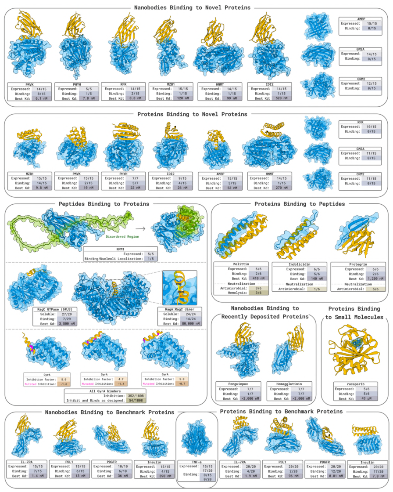{: width="896" height="1120" loading="lazy" decoding="async"}

*Figure 1. Overview of the wet-lab validation of BoltzGen. In collaboration with several labs, it covers nanobodies and protein binders against novel protein targets, neutralization of bioactive peptides, peptide and cyclic peptide design, small-molecule binding, benchmark targets and more, with each cell reporting the number expressed, the number binding and the best Kd.*

This is a report card that packs every wet-lab experiment onto one page: each block is a target, listing Expressed / Binding / Best Kd. Its central message is that **one model covers tasks as different as nanobodies, proteins, peptides, cyclic peptides and small-molecule binding**, with real experimental data for all of them. Figs 2-21 then unpack each panel of this overview in turn.

### Figure 2: Nanobodies against 9 novel targets

**What this figure asks:** On 9 new targets with no known binder in the PDB, how many of the designed nanobodies really bind at nanomolar affinity?

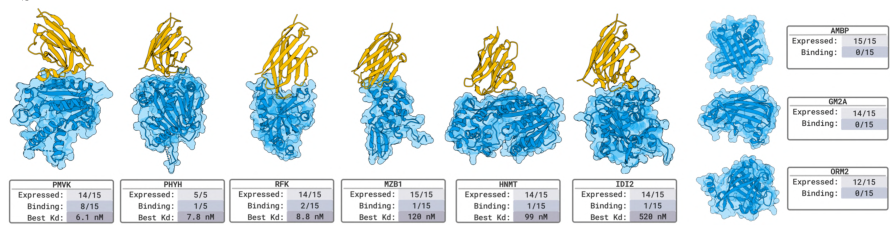{: width="896" height="236" loading="lazy" decoding="async"}

*Figure 2. Nanobody design for 9 novel targets. Fifteen designs per target were measured by SPR/BLI, with the designed nanobody in orange and the target in blue, and expression / binding / best Kd noted below.*

The standard for novel is strict: no protein in the PDB with more than 30% full-length identity to the target appears in a known bound complex, so the model cannot cut corners by recalling an existing interface. About 60,000 candidates were generated per target, with the framework regions fixed and only the 3 CDR loops redesigned. The result is **nanomolar binders for 6 of 9 targets**: PMVK at 6.1 nM, PHYH at 7.8 nM, RFK at 8.8 nM, plus HNMT, MZB1 and IDI2. None of them binds human serum albumin, which preliminarily rules out non-specific binding.

### Figure 3: Protein binders against 9 novel targets

**What this figure asks:** Switching to completely de novo mini-proteins (with no binding site specified), how do they perform on the same 9 novel targets?

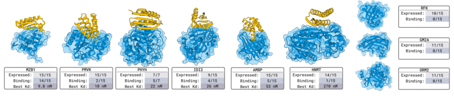{: width="896" height="194" loading="lazy" decoding="async"}

*Figure 3. Protein binders for 9 novel targets (80-140 aa, no binding site specified), with 15 designs evaluated per target.*

Protein binders likewise reached **nanomolar affinity on 6 of 9 targets** (MZB1 at 9.8 nM, PMVK at 10 nM, PHYH at 22 nM, IDI2 at 26 nM, AMBP at 53 nM). Interestingly, the targets on which the two modalities succeed do not fully overlap: nanobodies work on RFK while proteins do not, and proteins work on AMBP while nanobodies do not. Binders of different shapes suit different target surfaces, and several modalities together can cover more targets.

### Figure 4: Nanobodies against 5 benchmark targets

**What this figure asks:** On classic targets such as PD-L1 and IL-7Rα, which have many known structures, what is the nanobody success rate?

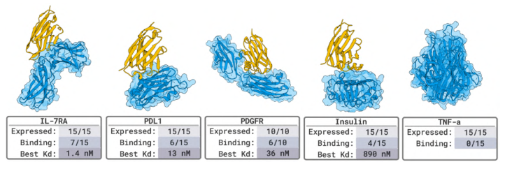{: width="722" height="242" loading="lazy" decoding="async"}

*Figure 4. Nanobody design for 5 benchmark proteins (IL-7RA, PDL1, PDGFR, Insulin, TNF-α), with up to 15 designs per target.*

On benchmark targets, **4 of 5 succeeded (80%)**, with IL-7RA reaching 1.4 nM. One caveat: these targets already have many known complexes in the PDB (dozens for PD-L1 alone), so the model may be recombining existing interface patterns, which makes the evidence weaker than for the novel targets in Figs 2 and 3.

### Figure 5: Protein binders against 5 benchmark targets

**What this figure asks:** How strong can the affinity of protein binders get on benchmark targets?

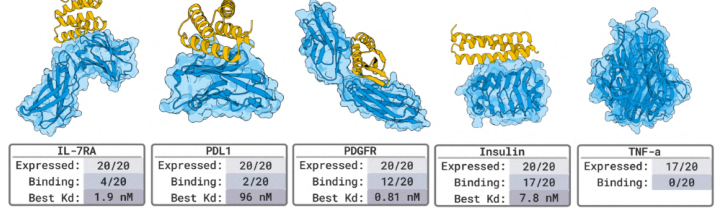{: width="722" height="220" loading="lazy" decoding="async"}

*Figure 5. Protein binders for 5 benchmark proteins, with 20 designs measured per target.*

Again 4 of 5 succeeded, with **PDGFR reaching 0.81 nM (sub-nanomolar)**. The only failure was TNF-α. The benchmark experiments mainly serve to align with existing methods; the real test of generalization remains the novel targets above.

### Figure 6: The complete design pipeline

**What this figure asks:** From target input to the selection of experimental candidates, what are the steps of the pipeline and how long does each take?

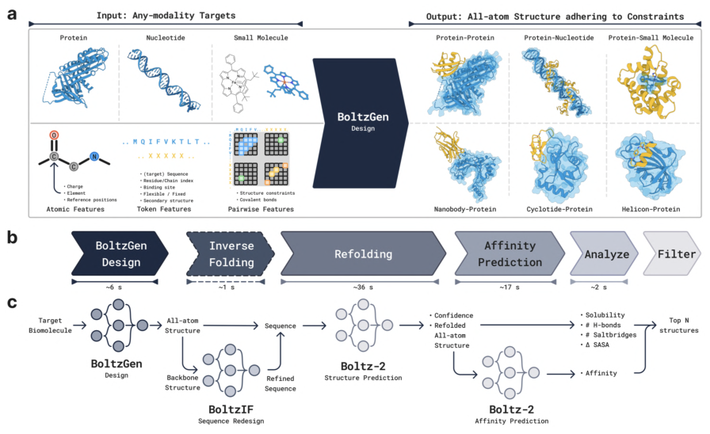{: width="896" height="548" loading="lazy" decoding="async"}

*Figure 6. Overview of the BoltzGen pipeline. (a) It accepts targets of any modality along with constraints and outputs an all-atom structure that respects them. (b) Time spent in each stage. (c) The detailed workflow of generation → inverse folding → refolding → affinity prediction → analysis and filtering.*

For a complex of about 200 residues: **about 6 s for BoltzGen generation, about 1 s for BoltzIF inverse folding, about 36 s for Boltz-2 refolding validation, about 17 s for affinity prediction and about 2 s for analysis and filtering**. The key step is ranking by a worst-metric strategy, which keeps designs with no obvious weak point, followed by diversity optimization to avoid returning duplicate backbones. The 66% success rate is the output of this whole funnel, not the probability of a single design.

### Figure 7: Encoding amino acids with virtual atoms

**What this figure asks:** How can discrete amino acid types be fitted into continuous coordinate diffusion?

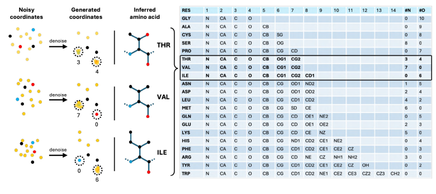{: width="896" height="400" loading="lazy" decoding="async"}

*Figure 7. Residue type encoding. Every designed residue is represented by 14 atoms; during training some of these marker atoms are stacked onto specific backbone atoms, the stacking pattern denotes the amino acid type, and they are discarded after decoding.*

This is the cleverest piece of design in the paper. The first 4 atoms are fixed as the backbone N, Cα, C and O; among the rest, some are real side-chain atoms and others are **virtual atoms stacked near N or O**. The table on the right gives, for each amino acid, how many atoms to stack and where (for instance the different patterns for THR, VAL and ILE). The model infers residue type from which atoms sit near N and which near O, which **turns discrete sequence choice into a continuous geometric problem** so that sequence and structure can be generated jointly in one diffusion process. The virtual atoms are deleted once generation is complete.

### Figure 8: Model architecture

**What this figure asks:** Compared with AlphaFold3 / Boltz-2, what did BoltzGen change in its architecture?

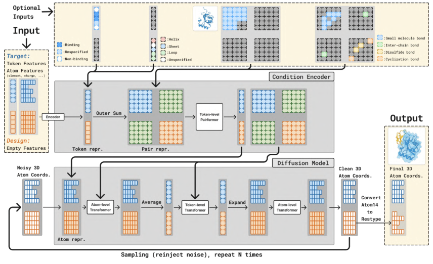{: width="856" height="522" loading="lazy" decoding="async"}

*Figure 8. Model architecture. It keeps the condition encoder (trunk) and diffusion module of AlphaFold3/Boltz-2, mainly adding design tokens and extra inputs such as binding sites and target structures.*

The upper part is the Condition Encoder: residue/atom types, chain information, covalent bonds, templates and constraints (binding sites, secondary structure and so on) are encoded into token and pair representations and processed by a token-level Pairformer. The lower part is the diffusion module, which starts from noisy coordinates and denoises repeatedly through atom-level and token-level Transformers, finally converting the 14-atom representation back into amino acid types. The key point is that **design and structure prediction share one architecture**, which is how the authors argue that the ability to accurately predict atomic interactions is exactly the ability needed to design high-quality interfaces.

### Figure 9: The design specification language

**What this figure asks:** How can one specification language express cyclic peptides, covalent bonds, fixed frameworks and other design requirements?

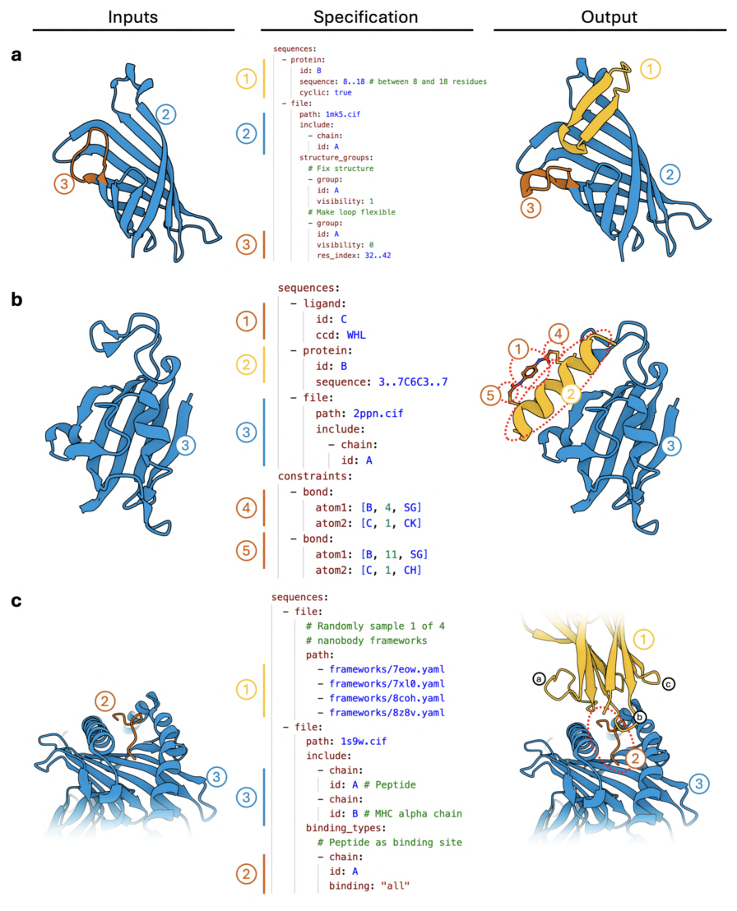{: width="896" height="1108" loading="lazy" decoding="async"}

*Figure 9. Three examples of the design specification language (input on the left, specification in the middle, output on the right). (a) A cyclic peptide against streptavidin, with part of the target structure left flexible. (b) A helicon with a disulfide constraint. (c) A nanobody with a framework chosen at random from 4 options.*

The middle column is a YAML-style specification: it can set a sequence length range, fix the structure of a chain, impose **covalent bond constraints** (for disulfide-bonded cyclic peptides, head-to-tail cyclized peptides, chemically stapled helicons), mark binding and non-binding sites (epitope targeting, region avoidance), and require a segment to form a helix or a strand. **One model covers nanobodies, cyclic peptides, motif scaffolding and other tasks through this language**, with no need to train separately for each task.

### Figure 10: Cropping and conditional sampling during training

**What this figure asks:** How can one model learn fold prediction, binder design, motif scaffolding and other tasks all during training?

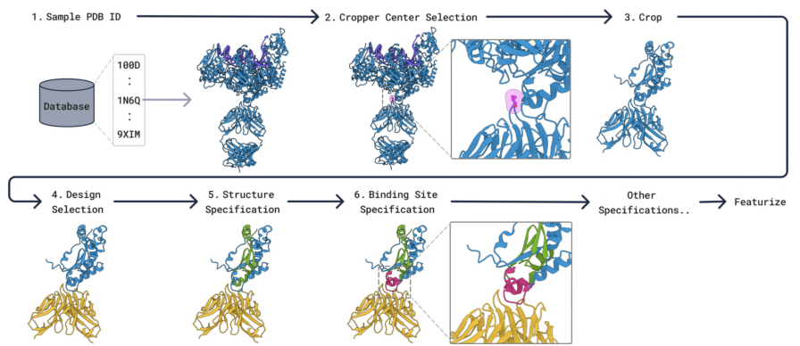{: width="896" height="388" loading="lazy" decoding="async"}

*Figure 10. Cropping, selection and specification during training. A PDB structure is drawn from the database and cropped, then optionally some chains are designated for design (yellow), with various conditions such as a fixed target and binding sites layered on top.*

Each training example crops a random piece of structure, randomly designates some chains as to be designed, and layers various conditions on top at random. **One training framework thus covers fold prediction, binder design, motif scaffolding and unconditional generation**: which regions are marked for design and which constraints are given determine which task is being learned at that step.

### Figure 11: The EDM sampler

**What this figure asks:** What happens at each denoising step, and why are the noise and step-size coefficients tuned?

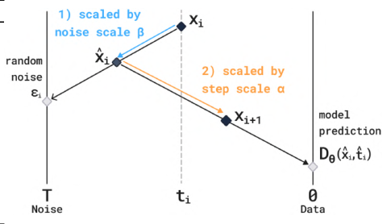{: width="480" height="278" loading="lazy" decoding="async"}

*Figure 11. The EDM sampler. Each denoising iteration first takes a step in the noise direction (scaled by β) and then a step in the direction predicted by the model (scaled by α).*

Each denoising step is illustrated: starting from the current point, some noise is added according to the noise coefficient β, and the point then moves toward the clean structure predicted by the model according to the step-size coefficient α. **Taking α, β ≠ 1 means the sampler no longer draws strictly from the training distribution**; it is a heuristic scaling used to trade off sampling quality against diversity.

### Figure 12: How the time per step scales

**What this figure asks:** As the complex grows, how much slower does each step of the pipeline get, and where is the bottleneck?

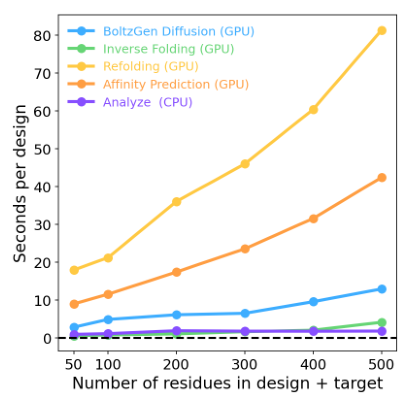{: width="410" height="400" loading="lazy" decoding="async"}

*Figure 12. Time per design for each step on a single A100, as a function of the number of design plus target residues.*

The five lines are BoltzGen generation, inverse folding, refolding, affinity prediction and analysis. **Refolding validation (yellow) is the biggest time cost**, about 80 s per design at 500 residues, followed by affinity prediction; generation itself, inverse folding and analysis are all fast. In other words, the bottleneck is not generation but validation.

### Figure 13: Characterization of melittin binders

**What this figure asks:** Can binders designed against melittin be expressed, fold, bind it and neutralize its hemolytic activity?

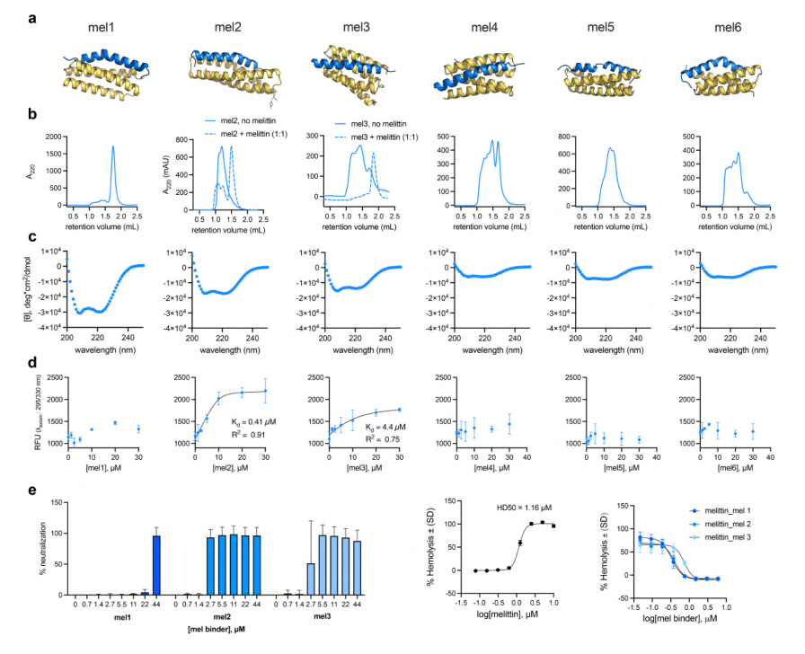{: width="896" height="728" loading="lazy" decoding="async"}

*Figure 13. Characterization of melittin binders. (a) Predicted structures, all helical and binding the amphipathic helical state of melittin. (b) aSEC. (c) Circular dichroism. (d) Binding titration. (e) Neutralization of hemolytic activity.*

Melittin forms an amphipathic helix when it binds a membrane. Among 6 designs, **Mel2 has a KD of 0.41 μM**, and panel e shows that several designs neutralize the hemolytic and antimicrobial activity of melittin, so the designed binders can sequester the target peptide in vitro and abolish its biological activity.

### Figure 14: Characterization of indolicidin binders

**What this figure asks:** Do binders still work for indolicidin, which is conformationally flexible and atypical?

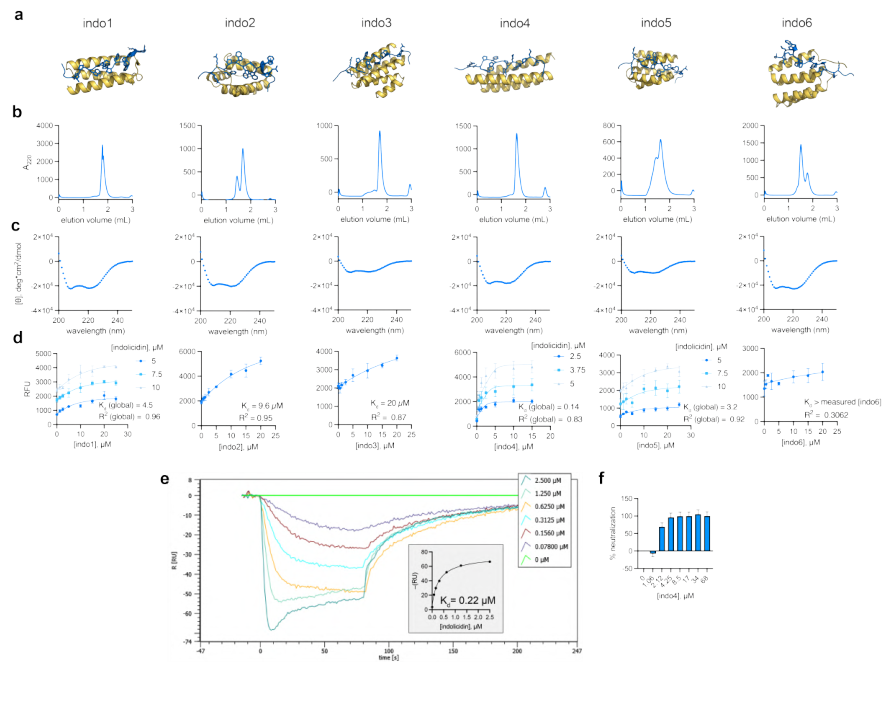{: width="896" height="702" loading="lazy" decoding="async"}

*Figure 14. Characterization of indolicidin binders. (a) Predicted to adopt a helical conformation. (b) aSEC showing different oligomeric states. (c) Circular dichroism. (d) Binding titration. (e) BLI sensorgrams. (f) Neutralization.*

Indolicidin is conformationally flexible and irregular, which makes it a harder target. Among 6 designs, **Indo4 reaches nanomolar affinity by SPR/BLI** (the sensorgrams in panel e fit a KD on the order of 0.22 μM), and panel f shows that its antimicrobial activity can be neutralized.

### Figure 15: Characterization of protegrin binders

**What this figure asks:** For protegrin, a β-hairpin peptide stabilized by disulfides, can the designed helical binders hold onto it?

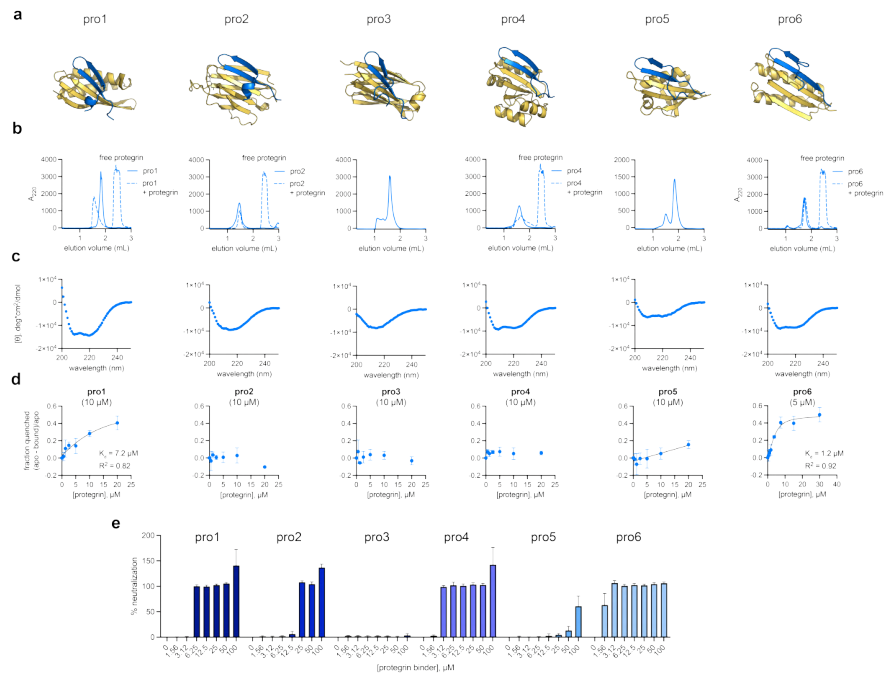{: width="896" height="688" loading="lazy" decoding="async"}

*Figure 15. Characterization of protegrin binders. (a) Predicted to adopt a helical conformation. (b) aSEC. (c) Circular dichroism. (d) Binding titration. (e) Neutralization of antimicrobial activity.*

Protegrin is stabilized by disulfides into a β-hairpin, structurally very different from the two peptides above. The designed helical binders again produced hits among 6 designs, and panel e shows that its antimicrobial activity can be neutralized. **Functional binders could be designed for three structurally very different peptides (helical, flexible and β-hairpin)**, which speaks to the generality of the method.

### Figure 16: Cell-based validation of binders to the disordered region of NPM1

**What this figure asks:** Can peptides designed against the disordered region of NPM1 find and bind their target in living cells?

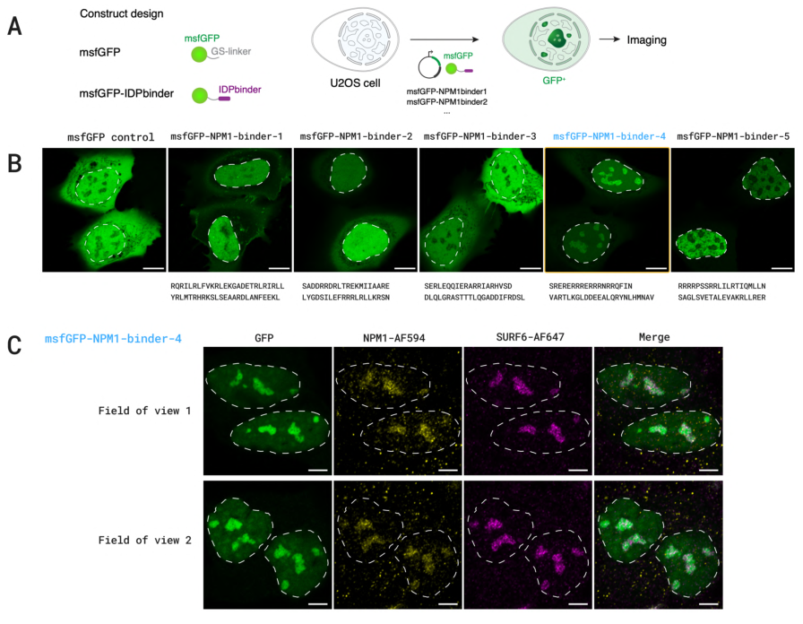{: width="896" height="696" loading="lazy" decoding="async"}

*Figure 16. (A) Schematic of the msfGFP-tagged NPM1 binder designs and the cellular localization experiment. (B) Live-cell fluorescence images in U2OS cells, with dashed lines marking the nuclei. (C) Co-localization of NPM1-binder-4 with endogenous NPM1 and SURF6.*

The binding region of NPM1 is disordered, so the specification language was used to mark the disordered region as binding and the structured β region as not-binding, allowing the disordered region to fold upon binding. Of 5 designs, **1 (binder-4) was enriched in the nucleoli of live cells and co-localized with endogenous NPM1**, which is indirect evidence of intracellular binding rather than a direct affinity measurement.

### Figure 17: Feasibility assessment by yeast display

**What this figure asks:** Using yeast surface display as a quick screen, can an antigen-binding signal be detected for the designed nanobodies?

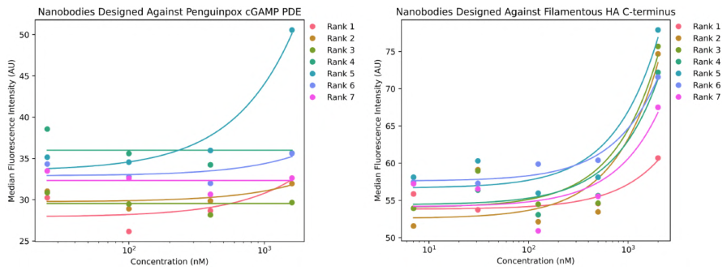{: width="896" height="344" loading="lazy" decoding="async"}

*Figure 17. Yeast surface display (YSD) feasibility assessment for nanobodies. Median fluorescence intensity at different antigen concentrations for nanobodies against cGAMP PDE (left) and FhaB (right).*

The two plots show the fluorescence intensity of nanobodies of different ranks across a gradient of antigen concentration. The signal rises with concentration and is clearest at the highest concentration, indicating that **yeast display can serve as a rapid feasibility screen**, though this is a preliminary assessment and real affinities still rest on SPR/BLI.

### Figure 18: A rucaparib-binding protein

**What this figure asks:** Can a general model build a pocket from scratch that binds the small-molecule drug rucaparib?

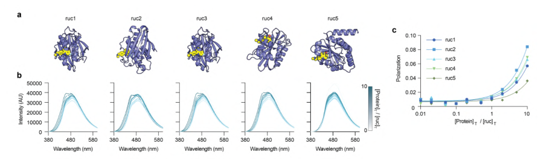{: width="896" height="278" loading="lazy" decoding="async"}

*Figure 18. Design of rucaparib-binding proteins. (a) Model of the complex between the designed protein (purple) and rucaparib (yellow). (b) Fluorescence emission spectra of rucaparib titrated with the designed protein. (c) Polarization titration curves.*

Binding pockets were designed for the PARP inhibitor rucaparib: **5 of 6 designs expressed and all of them showed binding, with the best at about 43 μM**. This shows that a general model can generate a small-molecule binding pocket de novo, but micromolar affinity still falls clearly short of the nanomolar level reached by specialized small-molecule methods.

### Figure 19: Large-scale in vivo screening of GyrA antimicrobial peptides

**What this figure asks:** Among a thousand or more designed peptides, how many really inhibit GyrA inside bacteria, and do so in the designed way?

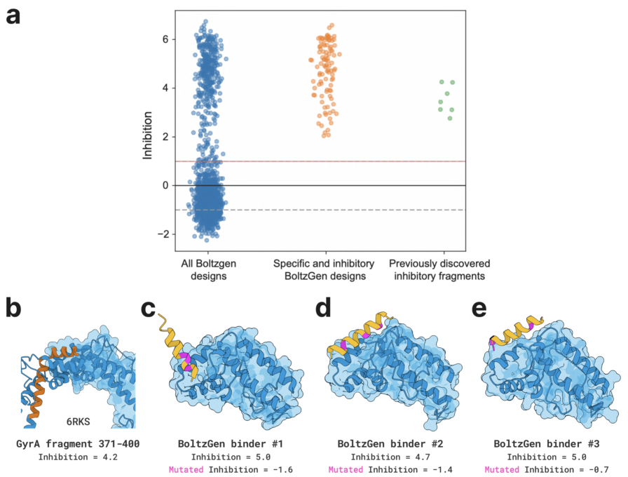{: width="896" height="680" loading="lazy" decoding="async"}

*Figure 19. BoltzGen-designed binders are effective in vivo DNA gyrase inhibitors. (a) Swarm plot of in vivo inhibition values for all GyrA designs (all designs / specific and inhibitory designs / known inhibitory fragments). (b-e) Structures of GyrA fragments with three BoltzGen binders, annotated with wild-type and mutant inhibition values.*

This is the largest experiment in the paper, with 1,808 antimicrobial peptides against E. coli GyrA tested in total. **352 of them (19.5%) reduced bacterial growth by at least 4-fold**; for each design, a control with 3 predicted interface residues mutated to alanine was also built, and **54 designs (3.0%) lost activity significantly after mutation**, showing that they really do target GyrA in the predicted manner. The fraction producing inhibition is about 43-fold higher than for random eGFP fragment controls (the three examples in panels b-e show wild-type inhibition around 5 dropping to negative values after mutation).

### Figure 20: Structure prediction as good as Boltz-2

**What this figure asks:** Has the structure prediction accuracy of BoltzGen degraded now that design capability has been added?

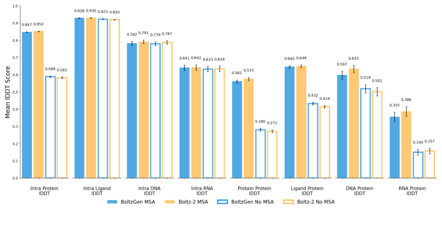{: width="896" height="456" loading="lazy" decoding="async"}

*Figure 20. Structure prediction evaluation. Best lDDT for various interface types (intra-protein, ligand, DNA, RNA, protein-protein and so on), comparing BoltzGen with Boltz-2 with and without MSAs.*

In the paired bar charts, BoltzGen (blue) and Boltz-2 (orange) are almost equally tall (for instance 0.847 versus 0.852 for intra-protein and 0.561 versus 0.575 for protein-protein). This supports the core hypothesis: **adding design capability has not sacrificed structure prediction accuracy**, and being able to predict interactions accurately is the prerequisite for designing good interfaces.

### Figure 21: Do the designs really look at the target?

**What this figure asks:** Does the model really adapt its designs to the target, or does it generate generic structures unrelated to it?

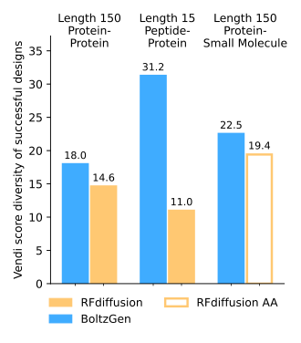{: width="330" height="376" loading="lazy" decoding="async"}

*Figure 21. Quantification of target conditioning. One binder was designed for each of 110 targets, and the diversity (Vendi diversity score) of successfully refolded complexes is compared against RFdiffusion / RFdiffusionAA.*

If the model could only generate the same structure over and over, its designs for different targets would look nearly identical. Across three task groups (protein-protein, peptide-protein, protein-small molecule), **the Vendi diversity score of BoltzGen is higher than that of RFdiffusion/RFdiffusionAA**, especially for the peptide-protein task (31.2 versus 11.0). This indicates that it really does adjust its designs to the surface features of the target rather than generating generic backbones unrelated to it.

## Part 4: Key Contributions

The figure above gives an overview of all 8 classes of wet-lab experiment. Beyond the novel targets, BoltzGen was validated in a range of application scenarios:

**Neutralizers of bioactive peptides**: protein binders were designed against three structurally very different antimicrobial/hemolytic peptides, melittin, indolicidin and protegrin. Melittin forms an amphipathic helix when it binds a membrane, indolicidin is conformationally flexible and atypical, and protegrin is stabilized by disulfides into a β-hairpin. Only 6 designs were tested per peptide: the Mel2 design against melittin reached a KD of 0.41 μM, the Indo4 design against indolicidin reached nanomolar affinity by SPR, and several designs neutralized the antimicrobial or hemolytic activity of the target peptide. These results show that the designed binders can functionally sequester a target and abolish its biological activity in vitro.

**RagC peptide design**: linear peptides (5-20 amino acids) were designed against the RagC GTPase, and 7 of 29 tested showed binding by SPR, with a best KD of 3.5 μM. Some sequences lost binding entirely after being shuffled, showing that activity depends on the specific sequence. In the disulfide-bonded cyclic peptide experiment against RagA:RagC, 14 of 24 showed specific binding, but with weaker affinity (around 80 μM).

**Large-scale screening of GyrA antimicrobial peptides**: the largest experiment in the paper, testing 1,808 antimicrobial peptide candidates against E. coli GyrA. Of these, 352 (19.5%) reduced E. coli growth by at least 4-fold; for each design, 3 additional controls with predicted interface residues mutated to alanine were constructed, and 54 designs (3.0%) lost activity significantly after mutation, indicating that these peptides really do target the specific site on GyrA in the predicted manner. Compared with random eGFP fragment controls, the fraction of BoltzGen designs producing growth inhibition is about 43-fold higher.

**Binding the disordered region of NPM1**: binding peptides of 40-80 amino acids were designed against the disordered region of the NPM1 protein, using the design specification language to mark the disordered region as a binding region and the structured β region as not-binding, allowing the disordered region to fold together with the binder upon binding. Of 5 designs tested, 1 was enriched in the nucleoli of live cells and co-localized with endogenous NPM1, providing indirect evidence of intracellular binding.

**Small-molecule binding proteins**: protein binding pockets were designed for rucaparib (a PARP inhibitor) and a rhodamine derivative. For rucaparib, 5 of 6 designs expressed successfully and all of them bound, with a best value of 43 μM; for the rhodamine derivative, 4 of 4 bound, with a best value of 30.9 μM. This shows that a general model can generate small-molecule binding pockets de novo, although the affinities still fall clearly short of the nanomolar levels already achieved by specialized methods.

**Benchmark targets**: on the five classic targets PD-L1, PDGFR, IL-7Rα, InsulinR and TNFα, the target success rate reached 80%, with nanobodies reaching 1.4 nM against IL-7Rα and protein binders reaching a best affinity of **0.81 nM (sub-nanomolar)** against PDGFR. However, these targets already have many known complexes in the PDB (dozens of related complexes for PD-L1 alone), so the model may have learned and recombined existing interface patterns, which makes the evidence markedly weaker than in the novel target experiments.

## Part 5: Limitations and Outlook

All experimental results in the paper come from a pipeline of large-scale generation, strict computational filtering and a small number of experimental tests. The typical case is picking 15 candidates out of 60,000 for validation, so the 66% target success rate reflects the enrichment power of the whole pipeline, and the probability of success for a single randomly drawn design is far lower. It is worth noting that the design pipeline relies not only on the BoltzGen model itself but also on BoltzIF inverse folding, Boltz-2 refolding validation and several physicochemical filtering metrics, so the success rates in the paper are the output of a whole multi-stage funnel. Performance also varies considerably across tasks: proteins and nanobodies against protein targets reach single-digit nanomolar affinity, but the RagA:RagC disulfide-bonded cyclic peptides are around 80 μM and the small-molecule binders around 30-250 μM. Being general means the model can attempt many tasks, not that every task reaches drug-grade performance.

The authors identified a clear memorization problem in the training data: when designing proteins of 73-76 amino acids, the model repeatedly generated ubiquitin-like sequences (ubiquitin appears more than 1,000 times in the PDB), and in the test at length 73 all 156 designs had more than 97% sequence identity to ubiquitin, a severe mode collapse. Selectivity validation also remains insufficient: the non-specific HSA assay is only a preliminary screen, and real therapeutic development would require systematic tests of cross-binding to homologous proteins, proteome-wide off-target effects, serum stability, aggregation propensity and immunogenicity. The strength of the evidence varies across experiments as well: the NPM1 experiment relies mainly on nucleolar co-localization rather than a direct affinity measurement, and in the GyrA experiment some peptides may inhibit bacterial growth through unintended mechanisms such as membrane disruption. As a bioRxiv preprint the paper has not been peer reviewed, some experiments report only a single measurement, and independent replication and stricter blind testing remain necessary.

## About the Corresponding Authors

Regina Barzilay is a professor in the Department of Electrical Engineering and Computer Science at MIT and co-director of the Jameel Clinic for AI and Health. She holds a Ph.D. from Columbia University, with research focused on machine learning applications in drug discovery and molecular design. She received the MacArthur Fellowship for her contributions to computational biology and natural language processing. Tommi Jaakkola is the Thomas M. Siebel Professor of Electrical Engineering and Computer Science at MIT and a member of CSAIL and IDSS. He has made pioneering contributions in probabilistic models, machine learning, and their molecular applications. His team's work on diffusion models and stochastic processes forms one of the theoretical foundations of the Boltz series of models. The corresponding author for this paper is the first author Hannes Stark (hstark@csail.mit.edu), while Barzilay and Jaakkola are senior authors of this paper. This research was completed through collaboration between MIT, UCSF, and other institutions, with 38 authors spanning computational and experimental teams.

## Citation

Stark, H., Faltings, F., Choi, M., Xie, Y., Hur, E., O’Donnell, T., ... & Jaakkola, T. (2025). BoltzGen: Toward Universal Binder Design. bioRxiv. https://doi.org/10.1101/2025.11.20.689494
