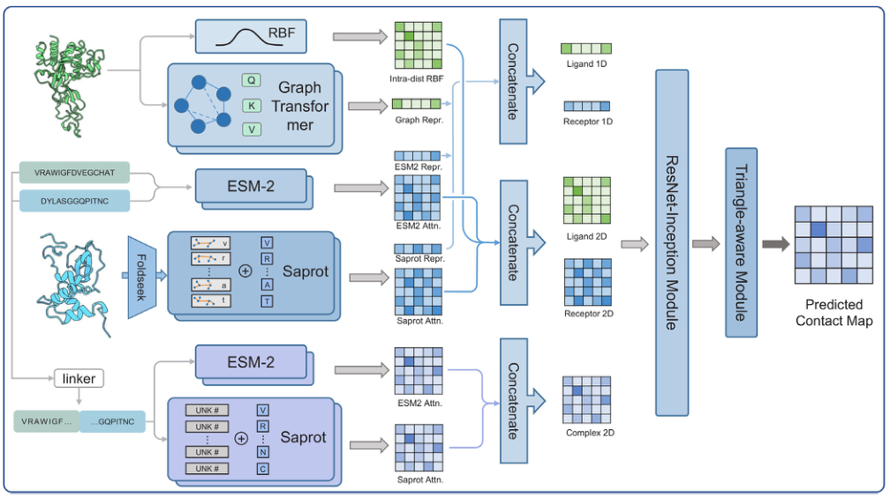
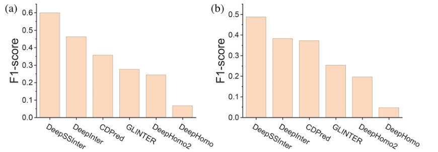
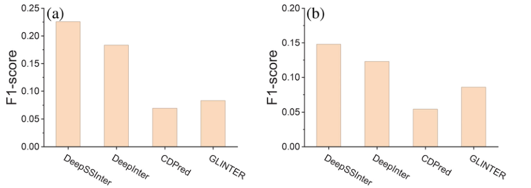
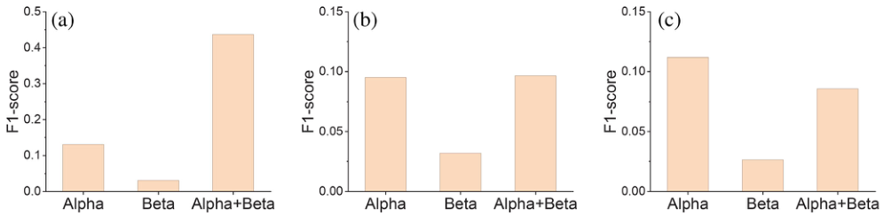
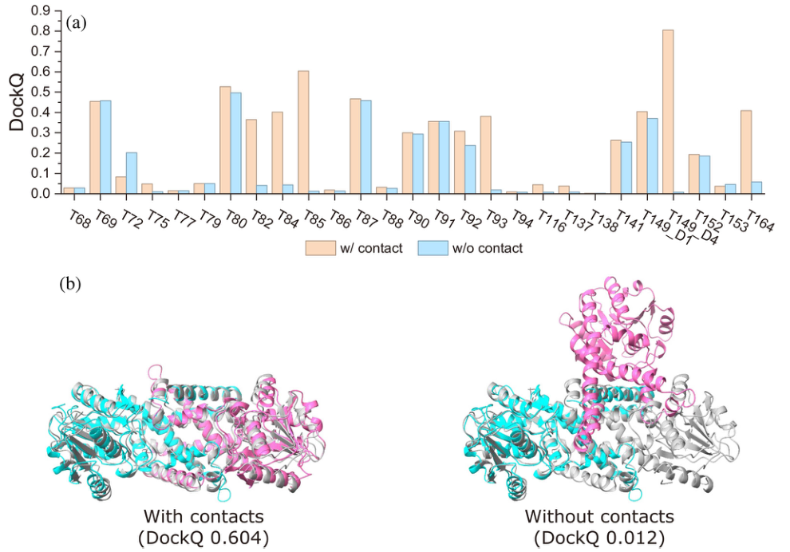
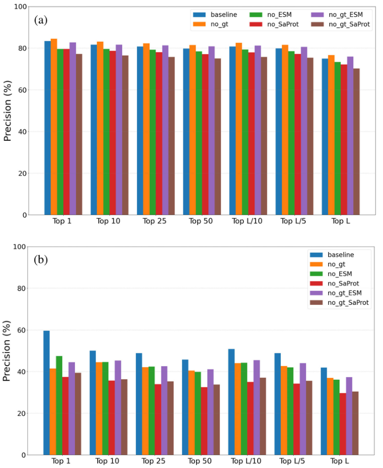

# DeepSSInter: Protein–protein contact prediction with a structure-aware protein language model

### 原文链接：[全文](https://doi.org/10.1002/pro.70667)

作者：Derek Huang, Jiamin Lv, Xuan Yao, Peicong Lin, Sheng-You Huang

Protein Science，2026 年

---
**导读**

蛋白质间残基接触预测是理解复合物结构和功能的关键步骤，但现有方法大多依赖多序列比对（MSA），存在计算代价高、同源序列不足和异源复合物配对困难等问题。这篇文章提出了 **DeepSSInter——一种不依赖 MSA、结合 ESM2 和 SaProt 蛋白语言模型以及几何图变换器的界面接触预测方法**。在同源和异源二聚体测试集上，DeepSSInter 的 top-k 预测精度均优于 DeepInter、CDPred、GLINTER 等方法，且推理速度快约两个数量级。将预测接触作为距离约束整合到蛋白质对接中，显著提高了复合物建模质量。

## 一、研究问题

蛋白质在细胞中很少独立工作——信号转导、代谢调控、免疫应答、基因表达调控等生命过程都依赖蛋白质间的精确物理相互作用。人类蛋白质组中预计存在数十万对蛋白质-蛋白质相互作用（PPI），其中大部分尚未获得实验结构解析。理解哪些残基参与了蛋白质间的接触界面，是解析复合物结构和功能的关键一步。界面接触预测的任务是：给定两个相互作用的蛋白 A（长度 L_A）和 B（长度 L_B），输出一个 L_A × L_B 的矩阵，其中每个元素表示蛋白 A 的第 i 个残基与蛋白 B 的第 j 个残基发生接触（任意一对重原子距离小于 8.0 Å）的概率。高精度的接触预测可以辅助蛋白质对接（提供距离约束缩小搜索空间）、加速复合物结构建模、识别功能性结合位点，以及指导突变设计和药物靶点发现。

以 DeepInter、CDPred、GLINTER 为代表的现有方法通常利用 MSA 中的共进化信号：如果两个残基在进化过程中协同突变，它们可能在空间中接触。然而 MSA 方法存在三个主要瓶颈。第一，搜索同源序列、构建 MSA 和提取共进化特征的计算开销很大，导致推理速度慢。第二，对于同源序列稀少的蛋白（如新设计蛋白、孤儿蛋白或数据稀缺的物种），MSA 质量不足会直接影响预测精度。第三，也是最困难的一点：对于异源复合物（两种不同蛋白的相互作用），即使分别有单体 MSA，也必须正确判断不同物种中哪些序列是真正的相互作用配对——这是复合物预测中的长期难题，错误配对会引入大量噪声。因此，作者尝试回答：能否完全不用 MSA，直接从单条序列和单体结构中提取足够的信息来预测蛋白质间的残基接触？

## 二、方法核心：不用 MSA，融合 ESM2、SaProt 与几何图

DeepSSInter 的输入包括两个蛋白的氨基酸序列和单体三维结构，输出跨蛋白残基接触概率矩阵。模型通过四条并行特征提取路径获取互补信息。

**路径一：ESM2 序列特征。**将两条蛋白质序列分别输入 ESM2（esm2_t33_650M_UR50D，6.5 亿参数、33 层 Transformer），获取每个残基的 1280 维上下文表示和 660 维的注意力矩阵（33 层 × 20 个注意力头）。对于长度为 L_A 的蛋白 A，输出残基表示的维度为 L_A × 1280，注意力矩阵为 L_A × L_A × 660。ESM2 通过在 UniRef50 数据库上的大规模掩码语言模型预训练，隐式地从数亿条序列中学习了进化规律、结构倾向和功能模式，其注意力矩阵已被证明与蛋白质内部的残基接触图有显著对应关系。

**路径二：SaProt 结构感知特征。**先用 Foldseek 将单体三维结构转换为结构字母——一种将局部几何环境（骨架二面角、残基间空间关系）离散化为 20 个字母的编码方式——再与氨基酸序列交替拼接成 SaProt 输入。例如，一个残基同时被描述为"它是丙氨酸"和"它处于 alpha 螺旋的中间位置"。**SaProt 是整个模型中贡献最大的特征模块**（消融实验证实），因为它的词表同时包含氨基酸类型和局部结构环境，输出特征显式携带了三维折叠信息，本质上是在 ESM2 学到的序列知识之上叠加了结构层面的先验。

**路径三：几何图变换器。**将每个单体蛋白表示为残基图——残基为节点，序列上相邻或三维空间中距离小于阈值的残基对构成边，节点和边特征包含残基坐标、方向向量和距离等几何信息。通过 Geometric Transformer（一种在图结构上执行注意力计算并保持几何等变性的架构）提取每个残基的 128 维几何表示，直接在三维结构图上建模蛋白质的折叠拓扑和残基间空间关系。

**路径四：单体内距离矩阵。**从单体结构中提取所有 Cα 原子间的成对距离，通过高斯径向基函数（RBF）将连续距离编码为多通道特征向量，提供蛋白质内部的全局距离信息。RBF 编码的优势是将距离的精确数值转化为平滑的特征表示，让模型更容易学习距离与接触之间的非线性关系。

此外，模型还有一条**复合物分支**：将两条蛋白质序列用 linker 连接后再次输入 ESM2 和 SaProt（此时 SaProt 的结构字母用 UNK 占位，因为真实复合物结构未知），提取跨蛋白的上下文表示——这让模型能从语言模型中隐式学习蛋白质间的相互作用模式。

所有特征按维度拼接后，通过 **ResNet-Inception 模块**（多尺度卷积融合）和 **Triangle-aware 模块**（建模"如果残基 i 接触残基 j、残基 j 接触残基 k，则 i 和 k 的空间关系受约束"的三角几何关系，灵感来自 AlphaFold2 的 Evoformer）产生最终的接触概率图。

## 三、看图说话

### Figure 1 · 四条并行特征的架构

**这张图想回答：**DeepSSInter 怎样从序列和结构里抽出四条互补特征来预测跨蛋白接触？

{: width="1008" height="564" loading="lazy" decoding="async"}

*Figure 1. DeepSSInter 工作流程。输入两个蛋白的序列和单体结构，经 ESM2、SaProt、几何图变换器、单体内距离矩阵四条路径及复合物分支，拼接后经 ResNet-Inception 和 Triangle-aware 模块输出接触图。*

四条路径：**ESM2** 从单条序列抽上下文表示和注意力矩阵（隐含进化规律）；**SaProt（贡献最大）**先用 Foldseek 把结构转成「结构字母」再和序列交替输入，让特征显式带上三维折叠信息；**几何图变换器**在残基图上建模折叠拓扑；**单体内距离矩阵**用 RBF 编码 Cα 距离。

还有一条复合物分支：用 linker 连接两条序列再过 ESM2/SaProt。全部拼接后经 ResNet-Inception（多尺度卷积）和 Triangle-aware 模块（借鉴 AlphaFold2 Evoformer 的三角几何约束）出接触图。**整条路线完全不用 MSA**。

### Figure 2 · 与主流方法的 F1 对比

**这张图想回答：**在同源和异源二聚体上，DeepSSInter 的接触预测比现有方法好多少？

{: width="870" height="302" loading="lazy" decoding="async"}

*Figure 2. 以实验结构为输入时，各方法在同源（a）与异源（b）二聚体测试集上的 F1-score。*

两张图里 DeepSSInter 的柱子都最高，领先 DeepInter、CDPred、GLINTER、DeepHomo 等。同源二聚体上七个 top-k 指标全最优（Top-1 精度 **83.4%**，比 DeepInter 高约 3%–4%）；用 AlphaFold2 预测结构输入时虽下降（Top-1 71.6%）但仍第一。异源二聚体整体更难（Top-1 34.7%），但 **DeepSSInter 相对 DeepInter 的提升反而更大（1.9%–14.1%）**——结构感知特征在 MSA 配对困难时优势更明显。

### Figure 3 · 与同样不依赖配对 MSA 的方法比

**这张图想回答：**和其它几种界面接触方法在更严格设定下相比，DeepSSInter 还领先吗？

{: width="870" height="308" loading="lazy" decoding="async"}

*Figure 3. DeepSSInter 与 DeepInter、CDPred、GLINTER 在同源（a）与异源（b）测试集上的 F1-score 对比。*

在这组更聚焦的对比里，DeepSSInter（最左柱）在同源（a，F1 约 0.225）和异源（b，F1 约 0.148）上都明显高于 DeepInter、CDPred、GLINTER。**速度上更是快约两个数量级**——传统方法要先用 HHblits/JackHMMER 搜库建 MSA（数分钟到数十分钟），DeepSSInter 跳过这步，推理只需秒级，适合蛋白质组规模的大批量预测。

### Figure 4 · 不同拓扑类型上的表现

**这张图想回答：**对 α、β、α+β 不同折叠类型的蛋白，预测难度一样吗？

{: width="1004" height="244" loading="lazy" decoding="async"}

*Figure 4. 不同蛋白拓扑类型（Alpha / Beta / Alpha+Beta）上的 F1-score，三个面板对应不同评测设定。*

按折叠类型拆开看，**α 型和 α+β 型的 F1 明显高于纯 β 型**（Beta 柱最矮）。作者认为这可能与训练数据里不同拓扑类型的分布有关——纯 β 结构样本相对少、接触模式也更难学。

### Figure 5 · 把预测接触用于对接

**这张图想回答：**把预测的接触当约束喂给 HADDOCK 对接，能把对接质量提高多少？

{: width="990" height="692" loading="lazy" decoding="async"}

*Figure 5. (a) 27 个同源二聚体靶标在有/无接触约束下的 DockQ。(b) 靶标 T85：有约束 DockQ 0.604、无约束 DockQ 0.012 的结构对比。*

取预测概率最高的 top-L/5 残基对，转成「重原子距离 &lt; 8 Å」的约束喂给 HADDOCK。**Panel a**：加约束后（橙）大多数靶标 DockQ 明显高于无约束（蓝），**top-1 对接成功率（DockQ ≥ 0.23）从 29.6% 升到 51.9%**。**Panel b**：T85 加约束后得到 DockQ 0.604 的中等精度结构，无约束只有 0.012（完全错误）——接触约束把对接从错误方向拉回了正确界面。

### Figure 6 · 消融：哪个模块最关键

**这张图想回答：**SaProt、几何图、ESM2、复合物分支，去掉哪个掉得最多？

{: width="752" height="918" loading="lazy" decoding="async"}

*Figure 6. 不同消融模型在同源（a）与异源（b）测试集上各 top-k 的精度，baseline 与去掉 gt/ESM/SaProt 等变体对比。*

蓝色 baseline（完整模型）在各 top-k 上基本都最高。重要性排序在同源/异源上一致：**SaProt 贡献最大**（移除后掉最多），其次几何图变换器，再次 ESM2。这说明在界面接触预测里**显式结构信息比纯序列信息更关键**——SaProt 正是在 ESM2 的序列知识之上又叠了三维几何先验。

## 四、核心贡献总结

DeepSSInter 的贡献可以归纳为三点。

**第一个 MSA-free 的界面接触预测方案。**完全跳过搜同源序列、建 MSA、配对异源链这套繁琐又易错的流程，只用单条序列加单体结构，靠 ESM2 + **SaProt（结构感知语言模型）** + 几何图变换器提供互补信息。

**精度与速度双赢。**在同源、异源二聚体测试集上 top-k 精度全面超过 DeepInter、CDPred、GLINTER 等，异源场景提升尤其明显；**推理比依赖 MSA 的方法快约两个数量级**，适合蛋白质组规模的大批量预测。

**能直接帮到对接。**把预测接触当距离约束喂给 HADDOCK，27 个同源二聚体靶标的 top-1 对接成功率从 29.6% 升到 51.9%，证明预测结果有实际结构生物学价值。

## 五、局限与展望

作者通过逐例分析发现模型在界面面积小或涉及内在无序蛋白（IDP）的复合物上表现较弱——这些情况下，蛋白质缺乏稳定的单体结构或折叠态，Foldseek 生成的结构字母和 Geometric Transformer 的图表示都难以提供有效信息，单条序列的语言模型表示也无法捕获瞬时相互作用的特征。此外，模型在 GPU 显存上有限制（Heterodimer99 中有一个靶标 T144 因序列过长导致显存不足而被排除），处理超长蛋白质复合物时需要引入分段预测、混合精度计算或降维策略。作者指出，为内在无序区域和瞬态蛋白质-蛋白质相互作用开发专门的特征提取模块是未来改进的重要方向。

## 通讯作者介绍

黄胜友（Sheng-You Huang），本文通讯作者之一，署名单位为华中科技大学物理学院（另一位通讯作者为同单位的 Peicong Lin）。本科毕业于武汉大学化学系，后在中国科学院武汉物理与数学研究所获得博士学位，随后在华中科技大学和堪萨斯大学从事博士后研究。Huang 的研究方向为计算结构生物学，专注于蛋白质-蛋白质对接算法、分子识别打分函数和生物分子相互作用预测方法的开发。Huang 实验室长期致力于蛋白质对接与界面接触预测工具的开发，先后推出了 DeepHomo、DeepHomo2.0 和 DeepInter 等系列方法。本文的 DeepSSInter 是该系列的最新进展，首次在蛋白质界面接触预测中实现了 MSA-free 的方案。第一作者 Derek Huang 与第二作者 Jiamin Lv 同样来自华中科技大学物理学院，分别负责模型架构设计与实现以及数据集构建与评估等核心工作；Derek Huang 的现地址为佐治亚理工学院电气与计算机工程学院。

## 引用

Huang, D., Lv, J., Yao, X., Lin, P., & Huang, S. Y. (2026). DeepSSInter: Protein–protein contact prediction with a structure-aware protein language model. Protein Science, 35(7), e70667. https://doi.org/10.1002/pro.70667
