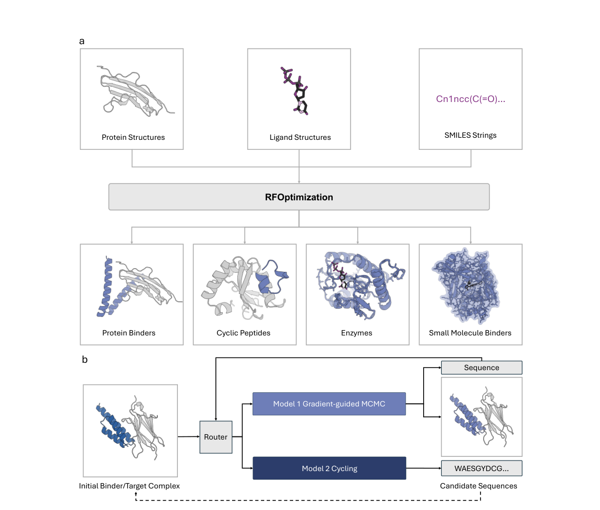
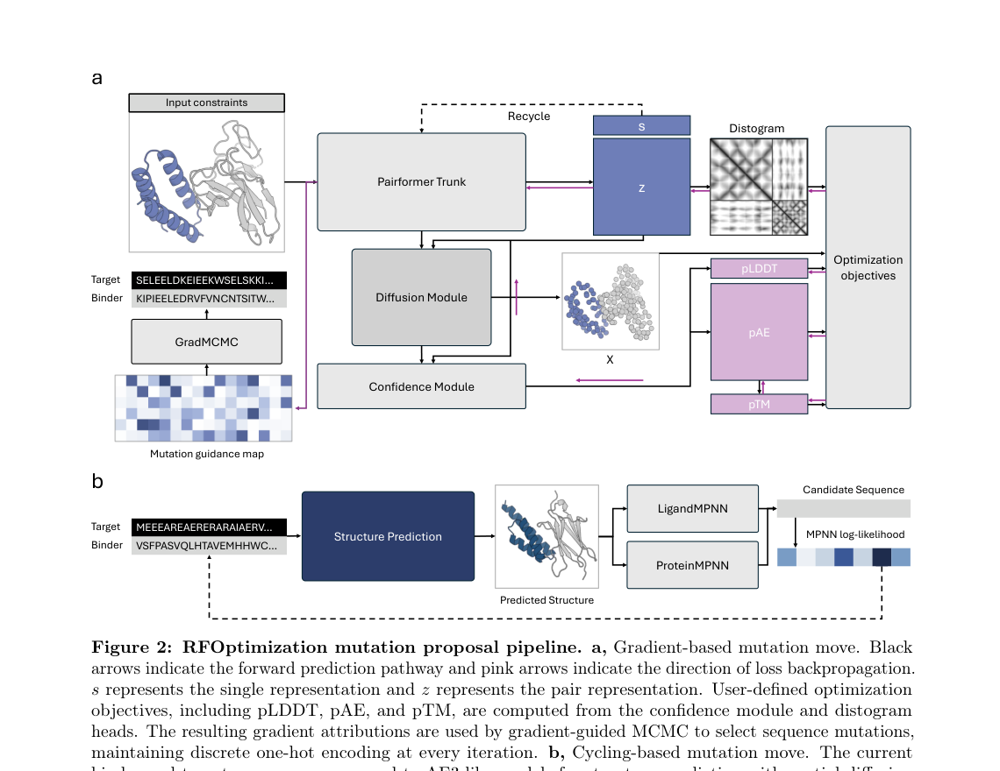
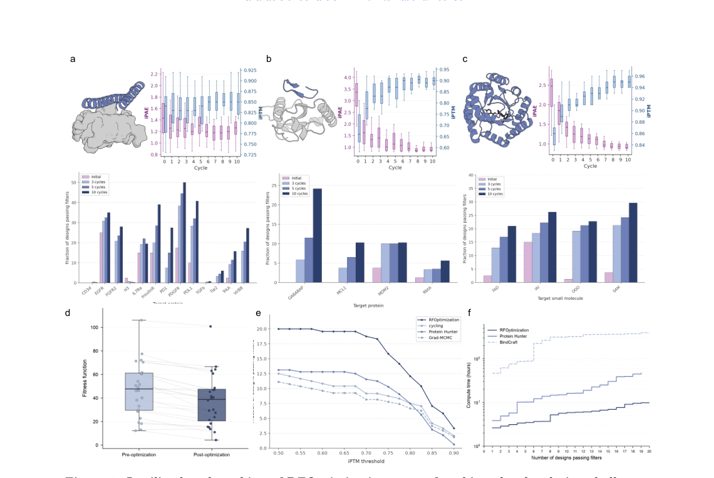

# RFOptimization: Guiding Design Optimization with All-Atom Structure Prediction

### 原文链接：[全文](https://doi.org/10.64898/2026.09.04.749184)

作者：Odin Zhang, Jiaqi Wang, Tuscan Rock Thompson, ..., David Baker

bioRxiv，2026 年 9 月 7 日

---
**导读**

当前蛋白质从头设计的一大瓶颈是"高生成、低通过"——RFdiffusion 等模型可以产生大量候选设计，但绝大多数无法通过结构预测的计算筛选。Baker 实验室提出的 **RFOptimization（RFO）**，专门作为设计流程的后处理优化器，通过交替使用 RF3 梯度引导突变和 Boltz 结构预测+逆折叠循环两条互补路径，在 1–10 个优化周期内（约 1–10 分钟）将边缘设计提升为高置信候选。该方法在蛋白 binder、环肽、小分子结合蛋白和酶设计四类任务上均显著提高了 AF3 评估下的通过率。

## 一、研究问题

蛋白质从头设计的标准流程通常包含三步：首先用 RFdiffusion 等扩散模型产生数千到数万个候选骨架和序列；然后用 AlphaFold3（AF3）或 RoseTTAFold3（RF3）等全原子结构预测模型做计算筛选，判定标准一般为界面预测对齐误差 iPAE &lt; 2.5 且界面预测 TM 分数 iPTM > 0.8；最终只有极少比例的设计能通过这些筛选进入实验验证。

然而，大量被淘汰的设计并非完全错误——它们的骨架构型往往已经合理，结合界面也基本成形，只是少数几个残基位置的氨基酸类型不够理想，导致预测置信度刚好未达到阈值。这类处于决策边界附近的设计被称为"边缘设计"（borderline designs）。全部丢弃后重新大规模生成，意味着此前投入的计算资源被浪费；而且新一轮生成产生的候选仍然面临相同的低通过率问题。

RFOptimization 正是针对这一瓶颈提出的：**它不从零设计蛋白，而是将已有的边缘设计作为起点，在局部序列空间中快速搜索更优的突变组合**。其核心定位是蛋白设计流程的后处理优化器——接收上游生成模型的输出，通过少量迭代优化提高通过率，从而显著降低整个流程的计算开销。

## 二、方法核心：双分支混合优化

RFO 是一个**无需训练的模块化优化框架**，核心思想是交替使用两条互补的突变策略。底层结构预测模型是模块化可替换的，当前实现使用 RF3 和 Boltz。每个优化周期，系统以相等概率随机选择两条路径之一：

**分支一：RF3 梯度引导的离散突变搜索**

将用户定义的优化目标（如 iPAE、pLDDT、distogram 代理损失、原子级几何约束等）通过 RF3 的 Pairformer Trunk 和置信度模块反向传播到输入序列表示。由于 RF3 的扩散模块（denoising diffusion）本质上不可微，RFO 对该模块施加 stop-gradient，绕过坐标生成过程，改从可微分的输出头（distogram 头、pLDDT 头、pAE 头、pTM 头）计算梯度。所得梯度矩阵可视为一张"突变指导图"——行对应序列位置，列对应 20 种标准氨基酸，数值指示将某位置改为某种氨基酸时目标函数的变化趋势。每一步选择负梯度最大的氨基酸替换，默认每次最多改变一个残基。关键设计是序列始终保持离散的 one-hot 编码，每次突变后通过 RF3 的标准特征化流程完整重建原子类型、原子 mask、化学连接、侧链拓扑和参考坐标，确保每个中间状态都是化学上合法的蛋白序列。单次正向传播加梯度计算约需 45–60 秒（单张 A100 GPU）。

**分支二：Boltz 结构预测 + MPNN 逆折叠循环**

将当前 binder 和 target 序列送入 Boltz——一个与 RF3 架构完全不同的全原子结构预测模型——通过部分扩散（partial diffusion）得到独立的复合物结构假设。这一步的关键价值在于提供与 RF3 不同的结构视角，避免优化过程被单一模型的置信度偏差所主导。得到预测结构后，根据任务类型选择逆折叠模型：纯蛋白-蛋白体系使用 ProteinMPNN，含小分子配体或非蛋白实体的体系使用 LigandMPNN。逆折叠前先对 binder 残基做置信度筛选：Boltz 分支中 pLDDT > 80 的至少 5 个连续残基组成的高置信片段在逆折叠时被固定，保留已稳定的结构区域；RF3 分支中距离 target 原子小于 8 Å 的界面残基也被固定，防止 MPNN 破坏梯度分支刚优化好的界面。最终按 MPNN 对数似然选择最优候选序列。

两条分支的互补性体现在：梯度分支利用目标函数直接指导最有利的局部突变方向，擅长精细的单残基调整；循环分支跳出 RF3 的置信度景观，从 Boltz 的结构视角对序列进行更广泛的重设计，擅长探索局部梯度无法到达的序列区域。两者交替使用既能精确优化又能跳出局部最优，同时降低对单一结构预测模型的依赖。

突变的接受与否遵循 **Metropolis 式规则配合几何温度退火**：改进性突变直接接受；暂时变差的突变以概率 exp(−ΔL/T) 接受，其中温度 T 按几何级数递减（T₀ = 1.0，半衰期 40 步）。早期高温允许接受部分变差的突变以鼓励探索，后期低温聚焦于只接受改进性突变。整个优化过程通常运行 1–10 个外层周期，在单张 A100 GPU 上耗时约 1–10 分钟。最终，AF3 作为从未参与优化的独立评估器对候选做三模型共识筛选（同时满足 RF3、Boltz、AF3 三个模型的 iPAE 和 iPTM 阈值），有效减少过拟合风险。

RFO 还提供了高度可定制的目标函数体系。用户可以组合三类优化目标：置信度损失（iPAE、pLDDT、iPTM 等）、distogram 代理损失（界面距离分布熵、接触损失等）以及原子级几何约束（指定任意两个原子之间的距离要求）。后者对酶设计尤为重要——催化活性位点要求催化残基的特定原子处于精确的三维位置，这种原子分辨率的约束只有全原子结构预测模型才能提供。用户还可以通过 mask 指定哪些残基可突变、哪些固定，从而保留功能 motif 或仅优化界面残基。

## 三、看图说话

### Figure 1 · 双分支混合优化框架

**这张图想回答：**RFOptimization 怎样同时用梯度引导和结构循环两条路径来优化设计？

{: width="1140" height="970" loading="lazy" decoding="async"}

*Figure 1. RFOptimization 整体框架。(a) 支持蛋白 binder、环肽、酶、小分子结合蛋白等多种输入。(b) 每个优化周期以相等概率随机走梯度引导突变或结构循环两条路径之一。*

RFO 是**无需训练的后处理优化器**：不从零设计，而是把上游 RFdiffusion 产出的「边缘设计」（骨架合理、界面基本成形，只差几个残基没过阈值）当起点，在局部序列空间里快速搜更优突变。

每周期随机选一条路径，底层结构预测模型可替换（当前用 RF3 和 Boltz）。突变接受用 **Metropolis 规则 + 几何温度退火**（早期高温探索、后期低温收敛）。通常跑 1–10 个周期、单张 A100 约 1–10 分钟，最后由从未参与优化的 AF3 做三模型共识筛选，减少过拟合。

### Figure 2 · 两条互补的突变分支

**这张图想回答：**梯度分支和循环分支各自通过什么机制产生候选突变？

{: width="1140" height="880" loading="lazy" decoding="async"}

*Figure 2. 两条突变分支。(a) 梯度分支：经 RF3 的置信度和 distogram 头反向传播得到「突变指导图」。(b) 循环分支：Boltz 预测结构后由 ProteinMPNN/LigandMPNN 逆折叠出候选序列。*

* **Panel a 梯度分支**：RF3 扩散模块不可微，所以 stop-gradient 绕过它，从 distogram / pLDDT / pAE / pTM 这些可微输出头算梯度，得到一张**「位置 × 20 种氨基酸」的突变指导图**，每步挑负梯度最大的替换。序列始终保持离散、每次突变都重建成合法蛋白。
* **Panel b 循环分支**：用架构完全不同的 Boltz 预测结构，再逆折叠——**提供和 RF3 不同的结构视角，避免被单一模型的置信度偏差带偏**。梯度分支擅长精细单残基调整，循环分支擅长跳出局部最优做更大范围重设计，交替使用兼顾两者。

### Figure 3 · 四类任务的计算基准

**这张图想回答：**在蛋白 binder、环肽、小分子结合蛋白、酶四类任务上，RFO 能把成功率提多少？

{: width="1140" height="764" loading="lazy" decoding="async"}

*Figure 3. 四类设计任务的计算基准。(a) 蛋白 binder。(b) 环肽。(c) 小分子结合蛋白。(d–f) 酶设计适应度、消融实验、计算效率。初始设计均由 RFdiffusion 生成，成功标准为 AF3 独立评估 iPAE &lt; 2.5 且 iPTM > 0.8。*

四类任务成功率都大幅提升：**蛋白 binder（13 靶标）6.73%→22.31%**（PDGFR 17.5%→50%、多个从 0% 突破）；**环肽 1.25%→12.57%（10 倍）**；小分子结合蛋白 5.62%→24.91%；酶设计 24 个里 18 个适应度改善。很多初始设计起始仅约 1%，说明只差几个残基、RFO 少量突变就能修复。

* **Panel e/f**：消融显示完整双分支在所有 iPTM 阈值上都最高（iPTM>0.8 时 12.08%，仅循环 7.5%、仅梯度 6.67%）——两条分支**缺一不可**。效率上每产出一个通过三模型共识的设计约 26 GPU 分钟，比 Protein Hunter 快约 7 倍、比 BindCraft 快约 78 倍。

## 四、核心贡献总结

RFOptimization 的贡献可以归纳为三点。

**把「重新生成」变成「局部修复」。**针对从头设计「高生成、低通过」的瓶颈，RFO 不丢弃边缘设计，而是在已有合理骨架上少量突变搜索，把刚过不了阈值的设计救成高置信候选。

**双分支互补 + 多模型共识。**梯度引导（RF3 可微输出头）做精细单残基调整，结构循环（Boltz + MPNN 逆折叠）提供不同结构视角跳出局部最优；最终用从未参与优化的 AF3 做三模型共识筛选，减少过拟合。

**四类任务普遍提升、且快。**蛋白 binder、环肽、小分子结合蛋白、酶设计成功率都显著提高（**环肽 10 倍、binder 3.3 倍**），每产出一个通过共识的设计约 26 GPU 分钟，比 BindCraft 快约 78 倍。框架无需训练，底层模型升级即同步受益。

## 五、局限与展望

RFO 的性能依赖于两个因素：底层结构预测模型的精度和初始设计的质量。初始骨架越接近合理构型，RFO 在局部序列空间中找到改进方案的概率就越大。好消息是，随着 RF3、Boltz、AF3 等模型持续迭代更新，RFO 的优化效果也会同步受益——框架本身无需重新训练，只需替换底层模型即可。当前所有基准测试均为计算评估（in silico），尚未报告实验验证数据（如表达、结合测定或活性测试）。此外，RFO 的 Metropolis 式接受规则未加入完整的 Hastings 提议比校正项，严格来说不具有详细平衡条件或遍历性的理论保证，但作者指出在实际设计场景中这一近似的影响可以忽略。未来方向包括与改进的上游生成方法（如更新版本的 RFdiffusion）结合、进一步扩展到抗体和多特异性 binder 等更复杂的设计场景，以及开展大规模实验验证。

## 通讯作者介绍

本文标注了两位通讯作者：Odin Zhang 和 David Baker。David Baker 教授，华盛顿大学生物化学系和蛋白质设计研究所（Institute for Protein Design, IPD）所长，霍华德·休斯医学研究所（HHMI）研究员。Baker 教授是计算蛋白质设计领域的开创者，开发了 Rosetta 蛋白质建模软件套件，并领导了 RFdiffusion、ProteinMPNN、RoseTTAFold 等多个里程碑式项目的研发。2024 年因在计算蛋白质设计领域的开创性贡献获得诺贝尔化学奖。共同一作 Odin Zhang 和 Jiaqi Wang 均为 IPD 和 Paul G. Allen 计算机科学与工程学院的研究人员，在蛋白质设计优化、结构预测和损失函数设计方面有深入研究。共同一作 Tuscan Rock Thompson 专注于任务设计、基础模型适配和评估方法。

## 引用

Zhang, O., Wang, J., Thompson, T. R., You, Z., Song, Z., DiMaio, F., & Baker, D. (2026). RFOptimization: Guiding Design Optimization with All-Atom Structure Prediction. bioRxiv. https://doi.org/10.64898/2026.09.04.749184
