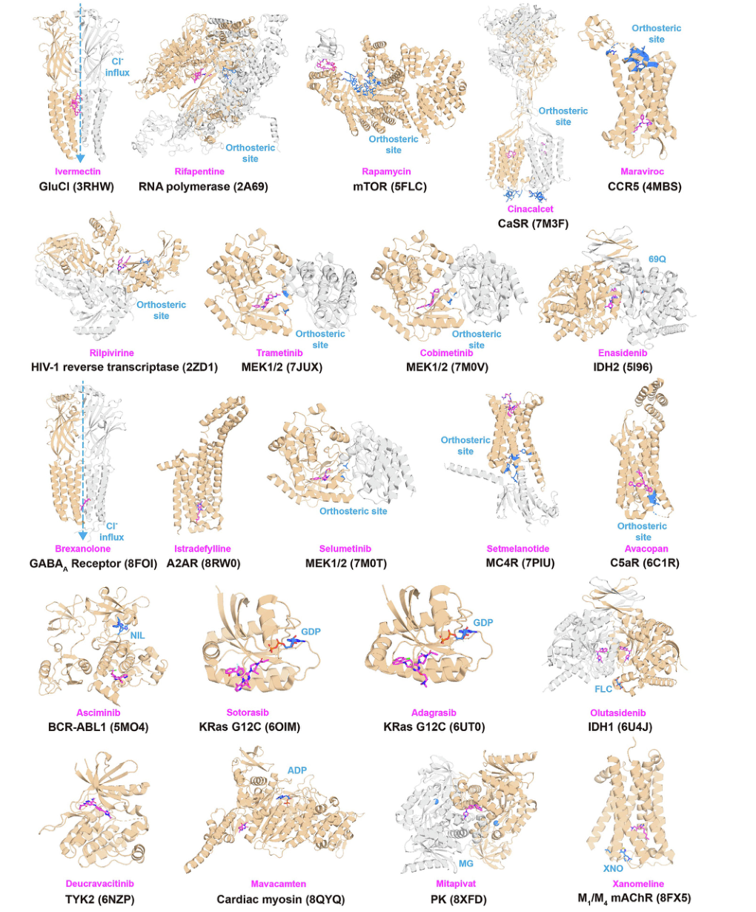
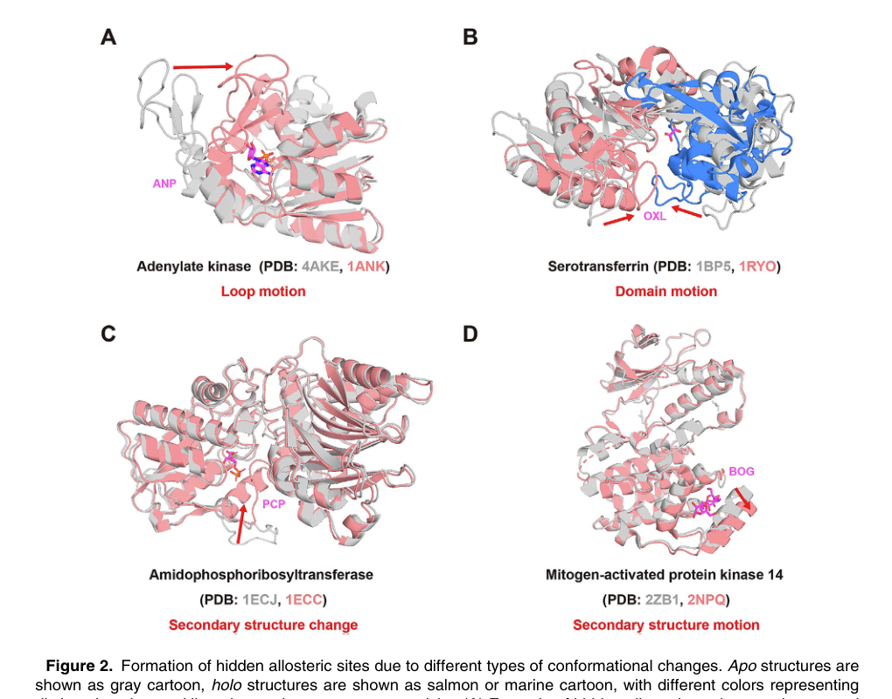
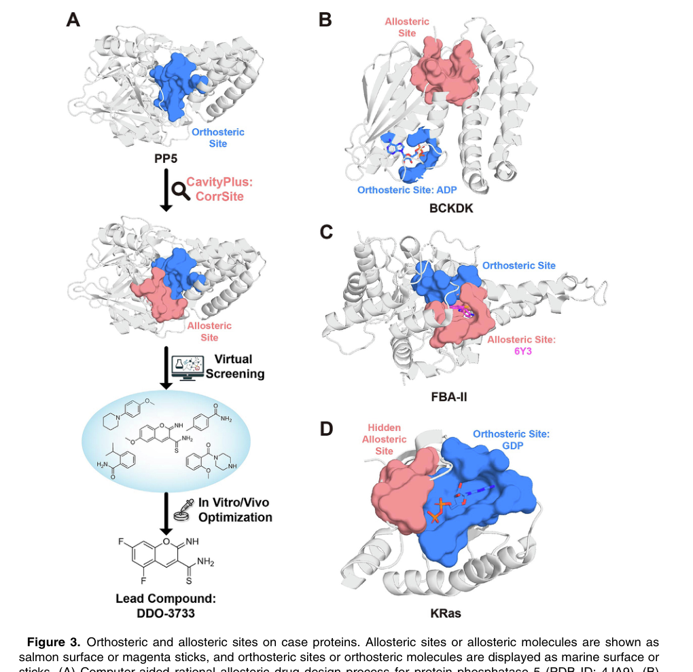

# Sequence and Structure-based Prediction of Allosteric Sites

### Link: [full article](https://doi.org/10.1016/j.jmb.2025.169305)

Authors: Juan Xie, Gaoxiang Pan, Luhua Lai

Journal of Molecular Biology, October 2025

---
**Overview**

Allosteric drugs have raised high hopes thanks to their selectivity and their varied modes of regulation, yet as of February 2025 only **33 of the 2,813 new molecular entities approved by the FDA are confirmed allosteric drugs**: enormous potential, difficult delivery. This review systematically surveys methods for predicting allosteric sites from protein sequence and structure, covering motion correlation analysis, topology-based prediction, protein language models and other algorithm families, and uses four drug design cases (PP5, BCKDK, FBA-II and KRas) to show how site prediction turns into lead discovery. The authors argue that the discovery of hidden allosteric sites and the fusion of multimodal information are the key directions for cracking 'undruggable' targets.

## Part 1: Research Question

Allosteric regulation refers to the situation where a molecular perturbation at a site far from the active center alters the activity of the functional site through conformational change or dynamic coupling. Compared with orthosteric drugs that compete directly at the active site, allosteric drugs have several important advantages. The first is **higher selectivity**: orthosteric sites are often highly conserved among the different subtypes of a protein family, while allosteric sites differ more, so targeting an allosteric site makes subtype selectivity and fewer off-target effects easier to achieve. The second is **a richer repertoire of regulation**: allosteric molecules can be inhibitors, activators or modulators that shift the conformational equilibrium, allowing finer functional control than simply 'blocking the active site'. Finally, allosteric sites open new possibilities for 'undruggable' targets: for proteins whose orthosteric site binds the natural substrate with extremely high affinity, whose surface is flat, or where orthosteric inhibition would cause serious side effects, finding a new allosteric pocket may open an entirely different route to a drug.

The article counts 33 allosteric small-molecule drugs approved by the FDA as of February 2025. These drugs cover targets such as the GABAA receptor, GPCRs, MEK1/2, KRas G12C, TYK2 and BCR-ABL1, and they act both as inhibitors and as activators. For example, benzodiazepines such as diazepam act as positive allosteric modulators of the GABAA receptor and enhance chloride channel activity; MEK inhibitors such as trametinib bind an allosteric pocket adjacent to the catalytic site and stabilize an inactive conformation; deucravacitinib targets the regulatory pseudokinase domain of TYK2 to achieve inter-domain allosteric inhibition; and asciminib mimics the self-inhibitory mechanism of the natural myristoyl group of the ABL protein. The mechanisms of these drugs can also be more complex than first recognized: xanomeline shows both orthosteric and allosteric binding modes, and selinexor may produce an allosteric degradation effect in addition to its orthosteric action. Notably, most marketed allosteric drugs were originally found through in vitro screening or structural modification of known molecules, and their allosteric mechanism was only revealed in later studies. Only three cases (asciminib, sotorasib and adagrasib) were clearly designed rationally around a known allosteric site, showing how rare the complete loop from computational prediction to approved drug still is.

## Part 2: Methodology: Three prediction routes via structure, sequence and dynamics

Methods based on the three-dimensional structure of the protein are currently the most mature class and fall roughly into three directions.

**Motion correlation analysis**: CorrSite2.0 uses the Gaussian network model (GNM) to analyze the motion correlation between candidate pockets and the orthosteric site. If a distal pocket is strongly coupled to the orthosteric site in key motion modes, it is more likely to be an allosteric site. The method correctly predicted 18 of 20 allosteric sites in an independent test set and has been integrated into the CavityPlus 2022 web platform.

**Topology and machine learning methods**: TopoAlloSite exploits the topological regularities of protein fold types and predicts allosteric sites directly with a kernel SVM, without first detecting surface pockets, which in principle makes it better suited to finding hidden sites that are not fully formed in the static structure. The PASSer series uses XGBoost and graph convolutional neural networks to learn features of pockets identified by FPocket, and PASSerRank goes further by using a Learning-to-Rank approach to order candidate pockets by similarity. AlloReverse combines protein dynamics, AdaBoost and shortest-path algorithms, and can simultaneously predict allosteric residues, pockets, communication pathways and orthosteric-allosteric coupling.

**Statistical mechanics models**: AlloSigMA 2 uses a structure-based statistical mechanics approach to evaluate the energy changes in other regions of the protein after a stabilizing or destabilizing perturbation is applied at a specific residue, and can be used to search for allosteric sites, analyze the allosteric effects of mutations and predict the direction of regulation. Its strength is that it explicitly accounts for the physical process by which a perturbation propagates.

**Shared limitations of structure-based methods**: Most methods follow a pipeline of 'static structure → pocket detection → feature extraction → classification or ranking'. If the real allosteric pocket has not yet formed in the static structure, the downstream algorithm cannot evaluate it, and errors in pocket detection itself propagate into the prediction model. Moreover, some methods only judge whether a candidate pocket 'looks like' a known allosteric pocket without explicitly testing whether it is genuinely functionally coupled to the orthosteric site, which is closer to the mechanistic definition of allostery. For intrinsically disordered proteins (IDPs) and intrinsically disordered regions (IDRs), which make up about 40% of the human proteome, traditional static-structure and pocket-based methods are particularly unsuitable.

Beyond structure, allosteric information is also encoded in the protein **sequence**: residues that maintain long-range communication coevolve.

**Coevolution methods**: KeyAlloSite uses multiple sequence alignments and evolutionary coupling models to compute the coupling strength between candidate allosteric residues and the orthosteric site, since true allosteric sites are usually more strongly coupled; the three-parameter model of Sala and colleagues combines SCA coevolution, dynamics-based free energy perturbation and druggability scoring. The limitation is the need for enough sufficiently diverse homologous sequences.

**Protein language models**: ESM, ProtBERT and similar models can predict from a single sequence, which is especially useful for proteins lacking homologs. Kannan and colleagues found that residues with high attention to the active site in ESM-1b attention maps are enriched in allosteric residues; Allo-Allo, DeepAllo, AlloPED and others attach classifiers to language model representations or concatenate pocket features.

The authors are fairly cautious about language model approaches: **high attention does not equal genuine energetic coupling or conformational propagation**, and while these models can produce a score they struggle to answer 'why is this an allosteric residue' or 'through what pathway does the signal travel'. Given the limited amount of known allosteric data, deep models are also prone to overfitting.

## Part 3: Key Figure Analysis

### Figure 1: Where marketed allosteric drugs bind

**What this figure asks:** Where on the target protein do approved allosteric drugs bind, and how do those positions relate spatially to the orthosteric site?

{: width="1020" height="1230" loading="lazy" decoding="async"}

*Figure 1. Representative complex structures of FDA-approved allosteric drugs with their target proteins. Allosteric drugs are shown as magenta sticks; orthosteric sites/ligands are shown as marine sticks or spheres.*

Each structure in the figure is a marketed allosteric drug together with its target protein. The magenta drug molecules all sit well away from the marine orthosteric site, which is exactly what allostery means: they do not occupy the active site yet still regulate function.

These examples cover targets such as the GABAA receptor, GPCRs, MEK1/2, KRas G12C, TYK2 and BCR-ABL1, and act both by inhibition and by activation (diazepam, for instance, is a positive allosteric modulator of GABAA, while asciminib mimics the self-inhibitory mechanism of ABL). Note, though, that most of these drugs were screened out first and their allosteric mechanism worked out later; only asciminib, sotorasib and adagrasib were successfully designed rationally around a known allosteric site.

### Figure 2: Four mechanisms that form hidden allosteric sites

**What this figure asks:** Through which conformational changes do hidden allosteric sites form, and what is the representative protein for each?

{: width="1020" height="800" loading="lazy" decoding="async"}

*Figure 2. Hidden allosteric sites form through different types of conformational change. Apo structures are gray, holo structures are red/blue, and different colors represent different domains. A, loop motion; B, domain motion; C, secondary structure change; D, secondary structure motion.*

Hidden allosteric sites are invisible in the ligand-free apo structure and appear only in specific conformations or upon ligand induction. In the figure, gray is apo and colored is holo, and the four panels correspond to four ways of opening: **A, loop motion** (adenylate kinase, where a loop moves aside to expose space); **B, domain motion** (serotransferrin, where two domains rotate relative to each other to form an interface pocket); **C, secondary structure change** (local disorder↔helix); and **D, secondary structure motion** (a helix moves away as a whole).

Pockets formed by loop or hinge motion are more likely to accommodate a drug, whereas cavities formed by pure side-chain rotation usually cannot provide sufficient potency. Finding such sites relies on molecular dynamics simulations, NEB+MSM path sampling, or AI approaches such as PocketMiner and AlphaFold2 conformational ensembles, but these are expensive: for TEM1 β-lactamase, more than 1 μs of simulation opened the hidden pocket only about a third of the way. The KRas G12C drugs sotorasib and adagrasib are the classic examples of drugging a hidden site.

### Figure 3: Four cases from prediction to drug

**What this figure asks:** How does allosteric site prediction actually lead to drug discovery, and which complete cases exist?

{: width="1020" height="990" loading="lazy" decoding="async"}

*Figure 3. Orthosteric and allosteric sites on the case proteins. Allosteric sites/molecules are shown as salmon surfaces or magenta sticks; orthosteric sites/molecules are shown in marine. A, allosteric activator design for PP5; B, the allosteric site of BCKDK; C, the covalent allosteric site of FBA-II; D, the hidden allosteric site of KRas.*

This figure marks the sites of the four cases on the structures: salmon for allosteric sites and marine for orthosteric sites, making it immediately clear that the allosteric drugs all avoid the conserved orthosteric pocket. **A, PP5**: the pocket lies between the TPR domain and the phosphatase domain, and the drug relieves self-inhibition and thus activates the enzyme. **B, BCKDK** and **C, FBA-II**: both look for an alternative allosteric or covalent site in order to avoid a polar or conserved orthosteric site. **D, KRas**: a hidden site found in a conformational ensemble.

The next section, Key Contributions, walks through the design workflow and experimental results of each of these four cases.

## Part 4: Key Contributions

**PP5 allosteric activator**: PP5 is a self-inhibited protein phosphatase whose TPR domain covers the catalytic site in the inactive state. Because TPR domains occur widely across many proteins, targeting them directly lacks selectivity. The researchers used CavityPlus/CorrSite2.0 to find a new allosteric pocket between the TPR domain and the phosphatase domain, and through virtual screening, molecular optimization and experimental validation obtained the lead compound DDO-3733, which allosterically activates PP5 and alleviates heat shock protein overexpression with little effect on other phosphatases. This is a case of an allosteric activator whose action is to release self-inhibition rather than to block the active site.

**BCKDK allosteric inhibitors**: BCKDK negatively regulates branched-chain amino acid (leucine, isoleucine, valine) metabolism by phosphorylating BCKDC, and is also involved in activation of the MEK/ERK signaling pathway in colorectal cancer. Targeting the conserved ATP site directly could inhibit other kinases as well, so the researchers used CavityPlus to find a new allosteric pocket and then performed virtual screening, obtaining three lead compounds, two of which inhibited BCKDK-mediated phosphorylation of BCKDC at the cellular level, inhibited the proliferation of several cancer cell lines and promoted apoptosis. **FBA-II covalent allosteric inhibitors**: FBA-II is a key glycolytic enzyme in fungi and bacteria, and its natural substrate carries several phosphate groups, making the orthosteric site highly polar and difficult to drug while retaining membrane permeability. By combining CorrSite to predict allostery with CovCys to find covalently modifiable cysteines, the researchers found a covalent allosteric site, and the inhibitor they designed suppressed the growth of azole-resistant Candida albicans, combining the selectivity advantage of allostery with the durable potency of covalent binding.

**KRas hidden allosteric site**: KRas is a member of the GTPase family and plays a key role in many cancer-related signaling pathways. Mutations in RAS genes occur in about 30% of human cancers, with KRas mutations accounting for the majority. Because the orthosteric site binds GTP with extremely high affinity, the protein surface is relatively flat, and the orthosteric sites of family members are highly conserved, KRas was long regarded as an 'undruggable' target. Sotorasib and adagrasib succeeded by targeting the hidden switch II pocket of KRas G12C, but they apply only to the G12C mutation. Using 500 ns of accelerated MD and FTMap hotspot detection, Gomez-Gutierrez and colleagues found 8 hidden sites in the conformational ensemble. **Virtual screening against the P4 site yielded 5 hit molecules that reduced the proliferation of KRAS G12V-transformed cells by more than 30% at 50 μM**, and MD analysis suggested that these molecules may act as molecular glues that stabilize the KRas/SOS complex and impede nucleotide-related conformational transitions. Although the activity is early-stage, this demonstrates that new allosteric interventions may exist for non-G12C KRas mutations and that ensemble-based screening can expand the range of discoverable sites.

## Part 5: Limitations and Outlook

The article proposes four key directions. First, **fusion of multimodal information**: jointly modeling sequence evolution, three-dimensional structure, conformational ensembles, dynamics trajectories and ligand information using mechanisms such as cross-attention rather than simply concatenating features, so that models learn the relationships between sequence features and structural pockets, and between dynamic coupling and functional effects. Second, developing genuine **single-sequence prediction methods** so that allosteric site prediction becomes possible without experimental structures or homologous sequences, extending to IDPs/IDRs and proteome-scale screening; future models, however, should not merely judge whether a residue 'looks allosteric' but should also predict orthosteric-allosteric residue pairs, communication pathways and the direction of regulation. Third, improving the **interpretability** of deep learning: a model should not only output predicted sites but also explain which sequence patterns support the prediction and through what pathway a residue couples to the orthosteric site, and known coevolutionary couplings, residue contact networks and rules of energy propagation can be added to the model as priors. Fourth, expanding the scale of high-quality allosteric datasets through experimental automation and high-throughput screening: more validated positive and negative allosteric sites, apo/holo conformation pairs, hidden pocket opening trajectories and mutational function data are needed to address the fundamental bottleneck of insufficient training data.

## About the Corresponding Author

**Luhua Lai** is a professor at the College of Chemistry and Molecular Engineering and the Center for Quantitative Biology at Peking University, the Peking University-Tsinghua University Center for Life Sciences, and the Research Unit of Drug Design at the Chinese Academy of Medical Sciences. Her research covers protein-protein interactions, computational studies of allosteric regulation and computer-aided drug design, and the CavityPlus platform and tools such as CorrSite and KeyAlloSite developed by her group are widely used in allosteric site prediction and rational drug design. The first authors, Juan Xie and Gaoxiang Pan, contributed equally.

## Citation

Xie, J., Pan, G., & Lai, L. (2025). Sequence and Structure-based Prediction of Allosteric Sites. Journal of Molecular Biology, 437(20), 169305. https://doi.org/10.1016/j.jmb.2025.169305
