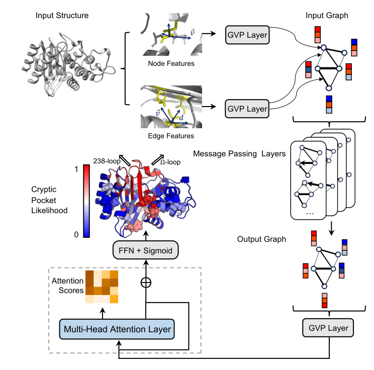
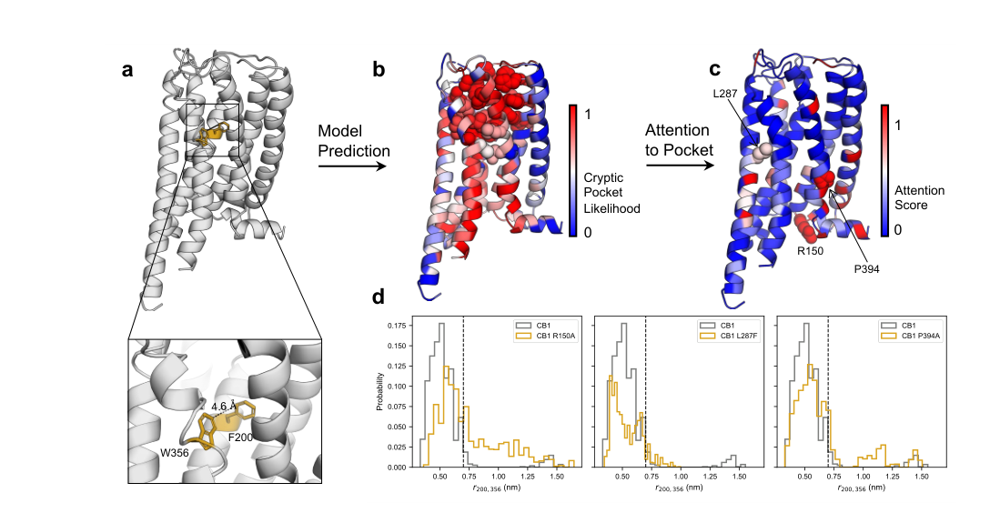
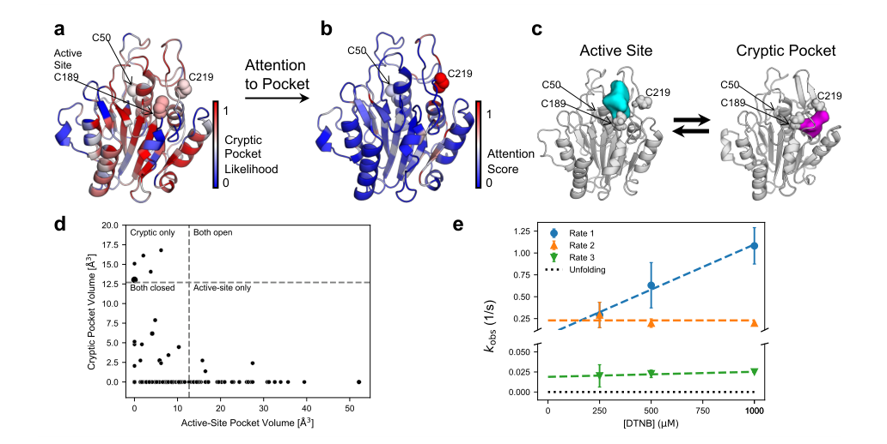
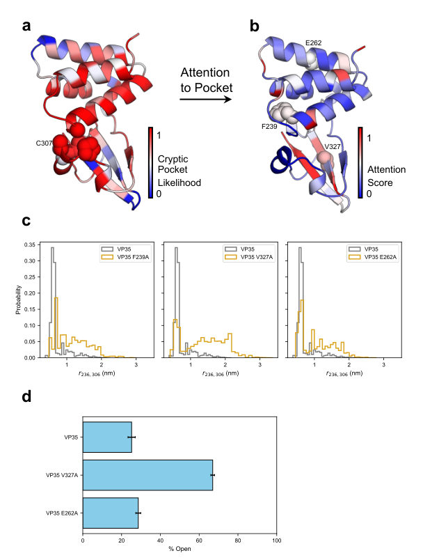

# AE-PocketMiner Uses Attention to Simultaneously Predict Cryptic Pockets and Their Allosteric Coupling

### Link: [full article](https://doi.org/10.64898/2026.05.21.726899)

Authors: Si Zhang, Prajna Mishra, Devin Kelly, Rachit Kumar, Gregory R. Bowman

bioRxiv, May 23, 2026

---
Many proteins look flat and featureless in their crystal structures, offering no obvious foothold, and so they get labeled "undruggable." But proteins move: in low-probability conformations, a groove can transiently open up on the surface. This is a **cryptic pocket**. Finding one effectively reopens the door to a large class of hard-to-drug targets.

Over the past few years, AI has become able to predict "where a pocket might be" from a single structure in seconds, but two far more pressing questions have gone unanswered: **Does the pocket have anything to do with the protein's function? And which residues remotely control its opening and closing?** Without these two answers, predicted pockets are hard to turn into real drug-discovery action.

The solution from the Bowman lab at the University of Pennsylvania is **AE-PocketMiner (attention enabled PocketMiner)**: it appends a two-head multi-head self-attention module after the geometric graph neural network of the original PocketMiner, so that when predicting a given residue the model can "look at" every residue in the protein. The model therefore produces two sets of outputs: a per-residue cryptic pocket probability, and attention scores between residues—the latter used as candidate allosteric couplings.

The results are solid: on 18,250 apo structures from CryptoBank, recall rises from 56.7% to **76.0%**; on the membrane protein CB1, the model hits 29 of 30 known pocket residues; on δ-secretase, it predicts a previously unreported cryptic pocket, with supporting evidence from thiol labeling experiments; and on Ebola virus VP35, mutating two allosteric residues picked by the model shifts the experimentally measured fraction of open pockets from 25.2% to **67.0%**.

## Part 1: Research Question

**Why cryptic pockets matter**

Experimentally solved structures usually report a protein's few most probable conformations. Cryptic pockets hide precisely in low-probability conformations, so they "don't exist" in crystal structures. The consequences are very concrete:

**Opening a way into "undruggable" proteins.** Many targets are written off simply because their experimental structures lack a site concave enough for a small molecule to achieve affinity and selectivity. Cryptic pockets are the main route around this verdict, with KRAS G12C inhibitors the most famous precedent.

**Solving selectivity.** Some protein families share a highly conserved orthosteric pocket, and targeting it inevitably causes off-target effects. Cryptic pockets unique to each family member are instead a good place to achieve selectivity.

**Allosteric modulation.** Binding at a functional site usually can only inhibit function. If one can bind a cryptic pocket that lies far from the functional site but allosterically controls it, there is a chance to achieve effects beyond inhibition, including enhancing certain beneficial functions.

## Part 2: Methodology: Adding a global attention layer on top of a geometric graph network

## Part 3: Key Figure Analysis

The four main figures follow a clear progression: **Figure 1 shows how the model works → Figure 2 asks whether it generalizes to a completely unfamiliar membrane protein → Figure 3 asks whether it can discover an entirely new pocket → Figure 4 asks whether it can design mutations that control pocket opening and closing**.

### Figure 1: Model architecture: from a structure to two sets of outputs

**What this figure asks:** How does AE-PocketMiner predict both cryptic pocket locations and allosteric coupling from a single input structure?

{: width="744" height="736" loading="lazy" decoding="async"}

*Figure 1. AE-PocketMiner architecture. The input structure is converted into a residue graph; node and edge features pass through GVP layers and 4 message-passing layers, then enter the two-head attention block inside the gray dashed box (with layer normalization and a residual connection), and finally an FFN + sigmoid outputs the per-residue cryptic pocket probability; the attention score matrix is extracted separately.*

**How to read this figure**

**Top left**: the input 3D protein structure. It can be a crystal structure or a cryo-EM structure, and in principle a high-quality predicted structure as well. The model does not need long simulations to be run first.

**Top center**: node features (a single residue highlighted in yellow, with blue arrows as direction vectors) and edge features (the distance d between two residues and their direction vectors) are each fed into GVP layers, forming the input graph at the top right.

**Right**: the four stacked graphs represent 4 message-passing layers, each letting residue representations absorb information from their neighbors; below them is the output graph.

**Gray dashed box at bottom left**: the newly added multi-head attention layer. The orange square matrix holds the attention scores, ⊕ denotes the residual connection, and the signal then passes up through FFN + Sigmoid to the output.

**Colored protein at middle left**: an example prediction. Colors from blue (probability 0) to red (probability 1) indicate each residue's cryptic pocket probability. Two black arrows point to the location of a known pocket—in the open state, the red residues on the Ω-loop and the adjacent 238-loop move aside to open the pocket. The 15 residues shown as spheres are those that the attention scores identify as most strongly coupled to this pocket.

The core message of this figure: **a single forward pass tells you both "where the pocket is" and "who might be controlling it remotely."** The former comes from the sigmoid output head and the latter from the attention matrix; both share the same representation.

### Figure 2: CB1: a membrane protein essentially unseen in training

**What this figure asks:** Can the model generalize to membrane proteins? Can its attention point to distant residues that control the pocket?

{: width="1099" height="564" loading="lazy" decoding="async"}

*Figure 2. (a) Crystal structure of CB1 with the pocket closed (PDB 6N4B); the toggle switch residues F200 and W356 are shown in gold. (b) Colored by cryptic pocket probability; spheres are pocket residues within 5 Å of the ligand VIP36 in the open structure. (c) Colored by attention score relative to this pocket; R150, L287, and P394 were chosen for in silico mutagenesis. (d) F200–W356 distance distributions for wild type and the three mutants; the dashed line marks the 7 Å distance in the open structure.*

**How to read this figure**

**Test subject**: the cannabinoid receptor CB1 is a GPCR. Of the 124 proteins in the training set, 123 are soluble, and the only membrane protein, CH25H, has no structural homology to CB1, so this is a genuine extrapolation test.

* **Panel a**: when the pocket is closed, the F200 and W356 side chains are only about 4.6 Å apart; once the pocket is propped open by the ligand, the distance is about 7 Å. The authors use the distance between these two residues as the indicator of pocket opening.
* **Panel b**: the known pocket has 30 residues, and the model **assigns probabilities above 0.5 to 29 of them**; only S390, at the edge of the pocket, scores lower. The original PocketMiner missed two more. The model also flags a candidate pocket on the other side of CB1, which the paper does not pursue.
* **Panel c**: the coloring switches to "where the model directs its attention when predicting this pocket." Residues immediately adjacent to the pocket in sequence naturally receive high attention and are excluded (shown in blue). From the high-scoring residues, the authors picked three: P394 and L287, relatively close to the pocket, and **R150, at the far opposite end of the protein**.
* **Panel d**: in molecular dynamics simulations, a rightward shift of the curve means the pocket opens more often. P394A (in the conserved NPxxY motif on TM7) shifts the distribution to the right; L287F shifts it to the left, and this position is already a phenylalanine in CB2, which is insensitive to VIP36; **R150A also markedly promotes opening**, even though it was chosen almost entirely because of its high attention score.

This figure makes two points: the model generalizes to a membrane protein of a kind that barely appeared in training, and attention scores can nominate distant allosteric residues that there was no prior reason to suspect. Note that all the validation in panel d comes from simulations, with no wet-lab experiments.

### Figure 3: δ-secretase: discovering a brand-new cryptic pocket

**What this figure asks:** Can the model discover a new pocket in a protein with no known cryptic pocket, and can that pocket be validated experimentally?

{: width="1032" height="518" loading="lazy" decoding="async"}

*Figure 3. a) Crystal structure of δ-secretase (PDB 5LUA, ligand 5KN removed) colored by predicted cryptic pocket probability; spheres are the catalytic cysteine C189 and the two buried cysteines C50 and C219. b) The same structure colored by attention score relative to the active-site pocket. c) Representative conformations with the pocket next to C219 closed (left) and open (right); cyan and magenta surfaces show the respective open pocket volumes. d) Scatter plot of cryptic pocket volume versus active-site volume for each state in the MSM; point size is proportional to the equilibrium population of the state. e) Measured thiol labeling rates of the three cysteines at different DTNB concentrations; the black dotted line is the expected labeling rate for the unfolded state.*

#### First, how the target was chosen—this is itself part of the method

The authors went through every human protein in the PDB, tightening the filters step by step:

**Criterion 1**: fewer than 300 residues.

**Criterion 2**: 1 to 3 buried unpaired cysteines. This criterion serves the experiment: with a buried cysteine, a thiol labeling assay can test whether a chemical reagent can reach it, and if it can, a pocket leading to that residue must really open during the protein's dynamics. After this step, about **10,000** candidates remained.

**Criterion 3**: a focus on proteins associated with Alzheimer's disease, given the enormous unmet medical need of this disease.

**Criterion 4**: the buried cysteine has a high attention score relative to a known functional site, suggesting allosteric coupling.

**Criterion 5**: the protein is commercially available, enabling rapid experiments.

δ-secretase (also called legumain) meets all of these. It is a lysosomal protease that cleaves amyloid precursor protein (APP) to produce the Aβ peptide, notorious in Alzheimer's pathology.

#### Panel a: both buried cysteines sit next to pockets

The structure used is PDB 5LUA (ligand 5KN removed), colored by predicted probability, with the three cysteines shown as spheres. The protein has three cysteines in total: **C189** is the catalytic cysteine and is partially surface-exposed in the crystal structure; **C219** and **C50** are both buried. The model's probabilities are **0.59 for C219 and 0.57 for C50**, so both are judged to have a substantial chance of belonging to a cryptic pocket. The logic is clean: they are buried in the static structure, so if a water-soluble chemical reagent can label them, the protein must dynamically open a channel.

#### Panel b: C219 is strongly coupled to the active site

This panel is instead colored by attention score relative to the active-site pocket, and **C219 receives a clearly high score**. So between the two candidate pockets, the authors prioritized the one next to C219. This is exactly the practical value of AE-PocketMiner over ordinary pocket prediction tools: **when a protein has multiple candidate pockets, it provides a basis for ranking them by coupling strength**, rather than blindly ranking them by pocket probability alone.

#### Panel c: in simulations, the pocket really opens

FAST was run for 5 rounds × 10 parallel trajectories × 40 ns each. The left image is a representative conformation with the pocket next to C219 closed and the right image an open one; the cyan and magenta surfaces trace the open pocket volume in each state. Quantitatively, **the open probability of the cryptic pocket next to C219 is about 0.55, and that of the active site containing C189 is about 0.57**—both close to the residue probabilities given by AE-PocketMiner (0.59 and 0.57).

But one thing does not match: **C50 stays buried throughout the simulations**, contrary to the model's prediction. At this point three possibilities could not be distinguished: the pocket does not exist, the pocket opens too slowly to be sampled by finite simulations, or the model produced a false positive here. The experiment in panel e is designed to answer exactly this.

#### Panel d: when one pocket opens, the other closes

The horizontal axis is the active-site volume and the vertical axis is the volume of the cryptic pocket next to C219; each point is a conformational state in the Markov state model, with point size proportional to the equilibrium population of that state. The authors take **12.69 ų** (the active-site volume in the inhibitor-bound structure 5LUA) as an illustrative opening threshold, dividing the plot into four quadrants.

The points clearly cluster in the "cryptic pocket open, active site closed" and "active site open, cryptic pocket closed" regions: **the volumes of the two pockets are anticorrelated**, and they are rarely both fully open at the same time. This is consistent with the allosteric coupling suggested by the attention scores. The implication is straightforward: if a small molecule can stabilize the open state of the C219 pocket, it may push the active site toward closure and thereby inhibit enzyme activity. This, however, is still computational evidence; volume anticorrelation alone cannot prove a strict causal relationship.

#### Panel e: the thiol labeling experiment delivers the verdict

The experiment used human legumain (residues 18–323) purchased from Biomatik. The method is DTNB (5,5′-dithiobis(2-nitrobenzoic acid)) labeling: 10 μM protein was mixed with DTNB at various concentrations at 25 °C, and the absorbance at 412 nm (corresponding to released TNB²⁻) was recorded on a stopped-flow spectrophotometer until the signal plateaued (about 300 s). After subtraction of the buffer control, the raw kinetic traces were globally fit with a multi-exponential model, with the number of exponentials matching the number of cysteines in the construct, yielding the observed rate constant for each site. Data come from at least three independent experiments; the dependence of the rates on DTNB concentration was analyzed with the Linderstrøm-Lang model, and the equilibrium constant for pocket opening was then computed according to whether the system follows an EX1 or an EX2 mechanism.

In the figure, the horizontal axis is DTNB concentration and the vertical axis is the observed rate; the three colors correspond to the three fitted kinetic processes, the colored dashed lines are linear fits, and **the black dotted line is the rate expected if labeling required global unfolding first**.

**Three conclusions**

**1) Three labeling rates are observed**, showing that all three cysteines are accessible to the reagent. If either of the two predicted pockets did not exist, the corresponding cysteine should not label and fewer than three rates would be observed. This **confirms that cryptic pockets exist next to both C219 and C50**—including C50, which the simulations failed to sample.

**2) All three rates are far faster than the expected rate for the unfolded state**, showing that labeling arises from local conformational fluctuations of the native state, without the protein first having to unfold entirely.

**3) All three rates fall within the range the group has previously observed for other cryptic pockets.** If any cysteine were in fact routinely exposed on the surface, its labeling rate would be markedly faster than any of the observed rates.

The mapping of rates to residues is inferred, and the authors are cautious about it in the paper: the fastest rate is presumed to correspond to the partially exposed C189; in light of the simulations, the second fastest is presumed to correspond to the cryptic pocket next to C219 and the slowest to C50. This assignment is reasonable but **is not a direct site-specific proof**; nailing it down would require mass spectrometry, single-site mutants, or site-specific probes.

#### Corroboration from the proteomics literature

After the thiol labeling succeeded, the authors went back for a deeper literature review and found two independent pieces of evidence in a proteomics study published under the alternative name legumain. First, **C219 can be modified by iodoacetamide-alkyne (IA)**. That study did not discuss the structural mechanism of labeling, but since C219 is buried in existing crystal structures, the fact that it can be covalently modified itself supports the presence of an adjacent pocket. Second, **oxidation of C219 and the C219S and C219A mutations all inhibit autocleavage of the propeptide**, a step required for δ-secretase activation. The second point directly supports a functional coupling between the C219 pocket and the active site.

The weight of this case lies in completing the full chain: **screening targets from about 10,000 candidate proteins → predicting a new pocket → using attention to rank multiple pockets within the same protein → observing pocket opening and anticorrelation in simulations → confirming local opening with thiol labeling → corroborating functional coupling with existing literature**. The model is doing more than reproducing known pockets.

### Figure 4: VP35: experimental confirmation of model-designed allosteric mutations

**What this figure asks:** When the allosteric residues picked out by attention scores are mutated, does the pocket's opening equilibrium actually shift?

{: width="608" height="804" loading="lazy" decoding="async"}

*Figure 4. a) Crystal structure of VP35 (PDB 3FKE) colored by predicted cryptic pocket probability; spheres are G236, P304, A306, C307, and S310, which define the pocket. b) The same structure colored by attention score relative to this pocket, with F239, V327, and E262 shown as spheres. c) G236–A306 distance distributions for the three mutants and wild type; larger distances mean a more open pocket. d) Open-state populations of wild type, V327A, and E262A measured by thiol labeling (n=3); error bars are standard deviations across replicates.*

VP35 comes from Zaire ebolavirus, and this case study focuses on its interferon inhibitory domain. The group had previously combined simulations and biophysical experiments to discover a cryptic pocket in this domain, and **this pocket allosterically controls VP35's critical interaction with double-stranded RNA (dsRNA)**. The pocket forms when helix 5 (residues 305–309) moves away from the four-helix bundle, exposing G236, P304, A306, C307, and S310; nearby T237, A238, L311, F328, and L338 also become partially exposed.

There are two yardsticks for the open/closed state: the **G236–A306 distance** in simulations and **thiol labeling of C307** in experiments. The group had also already found mutations that shift the opening equilibrium: F239A increases opening, and A291P reduces it. This prior knowledge makes VP35 an ideal system for testing the model—it can check whether the model reproduces what is already known, and it can be used to test entirely new predictions.

**Guarding against data leakage**

When training the model used for this case, the authors **removed all VP35 simulation data from the original training set**, ensuring the model gained no advantage from having seen this protein. This step was handled cleanly.

#### Panel a: reproducing the known pocket, with a clear gap over the previous generation

The structure is PDB 3FKE, colored by predicted probability, with the five pocket-defining residues shown as spheres. **All five residues receive probabilities greater than 0.5**; by contrast, **the original PocketMiner confidently predicts only one of them**. This five-to-one gap is consistent with the authors' claim that AE-PocketMiner better captures the allosteric effects of distal residues.

#### Panel b: attention both recovers known sites and nominates new ones

After coloring by attention score relative to this pocket, three residues are highlighted:

**F239 — positive control**

The model gives it a relatively high attention score, and F239A is known to increase the probability of pocket opening. Conversely, for A291, known to reduce opening, the model gives a low score. **Both known sites, one positive and one negative, check out**, showing that the attention does recover part of the genuine allosteric information.

**V327 — new prediction 1**

High attention score. It is not far from the pocket, sitting on the β-strand behind the pocket, but **its side chain points away from the pocket**. From the static structure alone, it would be hard to imagine that it could directly control the pocket.

**E262 — new prediction 2**

Its attention score is slightly lower than V327's, but the authors deliberately chose it: it is **very far from the cryptic pocket, with its side chain pointing into solvent**. Apart from the model's prediction, there is no reason anyone would pick this position.

#### Panel c: simulations first

The three subplots compare the G236–A306 distance distributions of F239A, V327A, and E262A with wild type. The VP35 system is smaller, so the simulations are more extensive: **10 rounds × 10 parallel trajectories × 50 ns each**. All three mutants tend to increase pocket opening; V327A shows the most pronounced shift in its distribution, and E262A also shifts in the same direction.

#### Panel d: the experimental numbers

VP35 and its mutants were expressed in E. coli BL21(DE3) Gold: cultured at 37 °C to an OD600 of about 0.6–0.8, induced with 1 mM IPTG, and expressed at 18 °C for 24 hours; after sonication, they were purified by Ni-NTA affinity chromatography, TEV protease tag cleavage, cation-exchange chromatography, and Superdex 75 size-exclusion chromatography, with a final buffer of 10 mM HEPES (pH 7.0), 150 mM NaCl, 1 mM MgCl₂, and 2 mM TCEP; SDS-PAGE and intact mass analysis confirmed sample quality. The open-state population was then back-calculated from the DTNB labeling kinetics of C307—C307 is inaccessible when the pocket is closed and can be labeled only when the pocket opens.

| Protein | Open-state population | Compared with wild type |
|---|---|---|
| VP35 wild type | 25.2 ± 1.3% | Baseline |
| **V327A** | **67.0 ± 1.0%** | Open fraction rises about 2.7-fold; a strong effect |
| **E262A** | **28.6 ± 1.9%** | Smaller but measurable increase, in the same direction as the simulations |

*n=3; errors are standard deviations across replicate experiments. Data source: main text of the paper and Figure 4d.*

**Ruling out the alternative explanation that the mutations simply make the protein fall apart more easily**

Faster labeling has a mundane alternative explanation: the mutation destabilizes the protein so that it unfolds globally more easily, and the cysteine naturally becomes easier to label. The authors ran four sets of controls to close off this possibility—**thermodynamic stability** (Figure S8), **global secondary structure** (Figure S9), **unfolded-state population under native conditions**, and **intrinsic cysteine labeling rate**.

Figure S10 shows that across the entire DTNB concentration range, **the observed labeling rates are significantly faster than the predicted rates for the unfolded state**. Labeling therefore arises from local fluctuations in the native folded state, not from global unfolding.

This is the most direct chain of evidence in the paper: **the model nominates residues by attention → simulations predict the mutational effects → wet-lab experiments measure a genuine shift in the pocket's opening equilibrium**. E262 in particular is far from the pocket and points into solvent, so it could never have been picked by structural intuition alone, yet the experiment still measured an effect in the right direction. However, the effect of E262A (25.2% → 28.6%) is far smaller than that of V327A (25.2% → 67.0%), which shows that **a high attention score does not imply a strong mutational effect**.

## Part 4: Key Contributions

**Finding 1: one model answers both "where is the pocket" and "who controls it"**

By placing an attention module after GVP message passing, the model naturally produces an attention matrix over all residue pairs while predicting each residue's cryptic pocket probability. A question that used to require a separate allosteric analysis is now a by-product of the same inference.

**Finding 2: large-scale recall improves substantially, and both the architecture and the data are indispensable**

On CryptoBank, recall goes from 56.7% → 76.0% (all annotations) and 47.2% → 72.6% (high confidence). Ablation experiments show that neither adding attention alone nor expanding the data alone achieves this gain.

**Finding 3: generalization to protein types barely covered by the training set**

Only 1 of the 124 training proteins is a membrane protein, and it has no structural homology to CB1. The model still hits 29 of 30 known pocket residues in CB1 and nominates the distal R150, and simulations confirm that R150A markedly promotes pocket opening.

**Finding 4: a new pocket discovered in a protein with no previously known cryptic pocket**

The cryptic pocket next to C219 in δ-secretase was predicted by the model, observed in simulations (open probability about 0.55), anticorrelated with active-site volume, confirmed to be reagent-accessible by thiol labeling, and supported by proteomics literature showing its functional coupling to the active site.

**Finding 5: attention can be used to design mutants that shift the pocket equilibrium**

In VP35, V327A raises the experimentally measured open-state population from 25.2% to 67.0% and E262A raises it to 28.6%, with multiple controls, including stability and secondary structure, ruling out the alternative explanation of global unfolding.

**Finding 6: inference in seconds, suited for large-scale screening**

Running on a single input structure takes only a few seconds. Compared with running microsecond-scale simulations for every protein, this is a difference of orders of magnitude, meaning entire PDB or AlphaFold structure libraries can be scanned and then prioritized.

## Part 5: Limitations and Outlook

## About the Corresponding Author

The corresponding author of this article is Gregory R. Bowman, currently the Louis Heyman University Professor in the Department of Biochemistry and Biophysics at the University of Pennsylvania, and also director of the distributed computing platform Folding@home. He received his B.S. in Computer Science from Cornell University in 2006 (summa cum laude, with a minor in Biomedical Engineering) and his Ph.D. in Biophysics from Stanford University in 2010. During his doctoral studies in Vijay Pande's laboratory, he developed the Markov state model methodology, which later became the core tool enabling Folding@home to assemble vast amounts of short trajectories into a complete dynamical landscape. Subsequently, he served as a Berry postdoctoral fellow at Stanford University and then became a Miller Research Fellow at UC Berkeley. In 2014, he established an independent laboratory in the Department of Biochemistry and Molecular Biophysics at the School of Medicine at Washington University in St. Louis, serving as Assistant Professor and later Associate Professor. Starting in 2018, he became director of Folding@home, and in 2022, he moved his laboratory to the University of Pennsylvania and was appointed as a Penn Integrates Knowledge (PIK) Professor. His research combines large-scale molecular dynamics simulations, Markov state models, machine learning, and biophysical experiments, with the core goal of understanding how proteins fluctuate between different conformations and how these fluctuations determine function and dysfunction, and thereby identifying cryptic pockets and allosteric sites on proteins that are traditionally considered "undruggable." Applications span major health threats including Alzheimer's disease and viral infections. The first author of this article, Si Zhang, is a member of his research group, responsible for simulation data processing, training label generation, and model training and evaluation.

## Citation

Zhang, S., Mishra, P., Kelly, D., Kumar, R., & Bowman, G. R. (2026). AE-PocketMiner Uses Attention to Simultaneously Predict Cryptic Pockets and Their Allosteric Coupling. bioRxiv. https://doi.org/10.64898/2026.05.21.726899
