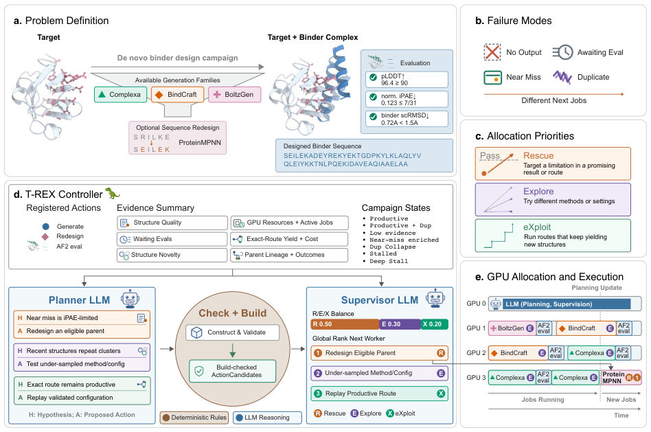
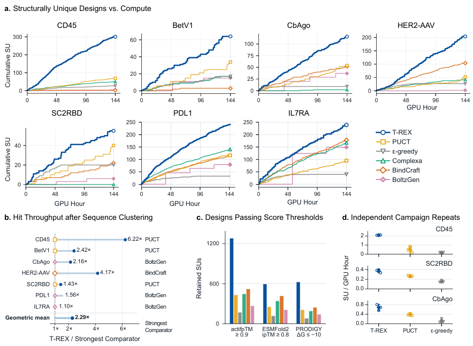
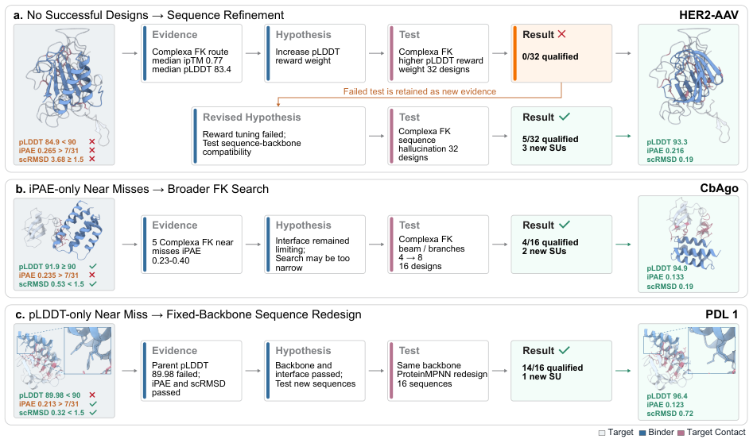
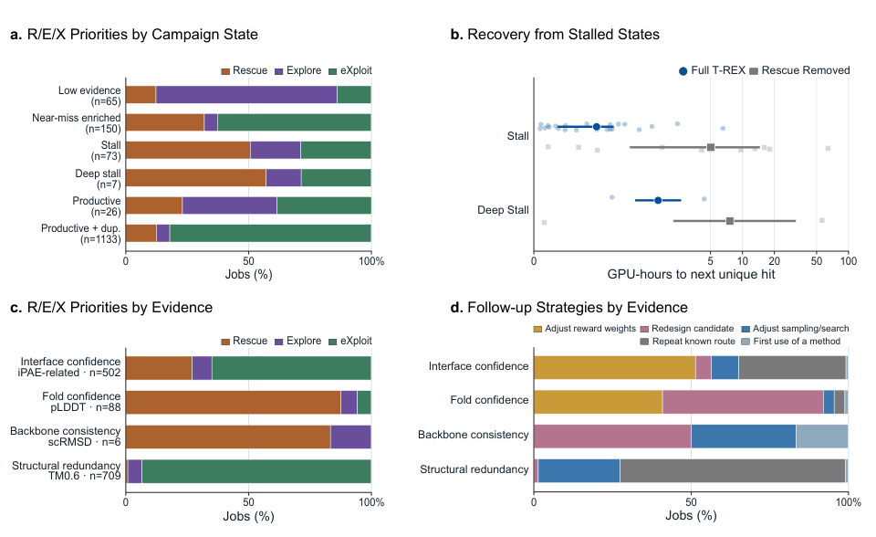
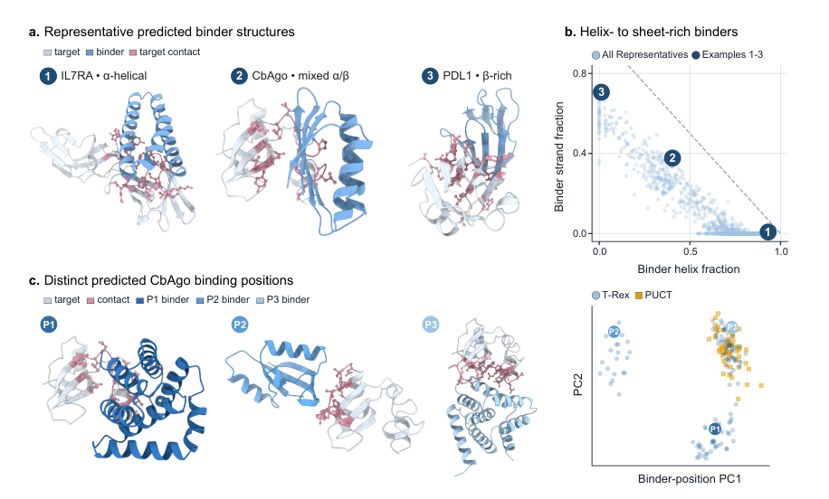

# Agentic campaign control for high-throughput de novo binder design

### Link: [full article](https://doi.org/10.64898/2026.09.22.753604)

Authors: Minkyu Jeon, Jinyeop Song, Jina Kim, Ellen D. Zhong

bioRxiv, September 24, 2026

---
**Overview**

Tools for protein binder design keep multiplying: Complexa, BindCraft, BoltzGen, ProteinMPNN, and more. With a limited GPU budget, which tool should the compute go to, and with what parameters? The group of Ellen D. Zhong at Princeton University presents **T-REX (Target-adaptive Rescue-Explore-eXploit)**, an LLM-driven campaign controller. Guided by evidence that accumulates during the design process, it dynamically switches among three strategies, **Rescue, Explore and eXploit**, and raises the throughput of structurally unique hits by about 2.4-fold across seven targets.

## Part 1: Research Question

Recent years have brought a flood of tools for de novo protein binder design: Complexa for generating backbones (supporting four search modes, namely beam search, best-of-N, Feynman-Kac steering and MCTS) and BoltzGen, the integrated design pipeline BindCraft, ProteinMPNN for sequence redesign, and AlphaFold2-Multimer for structural evaluation. Each tool has its own strengths across targets and scenarios, and **no single generator is optimal on every target**.

Real design campaigns run into several kinds of difficulty: a generator produces no usable result; structures are generated but not yet evaluated; a candidate comes very close to success and misses on just one metric; a design meets the quality criteria but duplicates the structure of an existing result; a route that works at first starts producing duplicate structures over and over.

Always running the same generator, or mechanically allocating resources based only on historical hit rates, can waste a great deal of compute. T-REX formalizes the problem as online resource allocation: under a fixed compute budget, how should the tool, the parameters and the object being worked on be chosen dynamically from accumulating evidence so as to maximize the number of qualified binders that differ structurally from one another? Its role is that of a lab supervisor: it does not design proteins itself, but observes the results so far, judges the current bottleneck, and decides how to allocate the next batch of GPU jobs.

## Part 2: Methodology: The core architecture of T-REX

T-REX models protein design as a continuous decision loop: **evidence → hypothesis → action → new evidence**. The system has three layers:

**The structured evidence layer (EvidenceSummary).** Deterministic code collates information on all completed and running jobs, including structural quality (pLDDT, iPAE, scRMSD), structural novelty (whether a new structural cluster is formed, and the duplication rate), the SU output and GPU cost of each route, designs waiting for AF2 evaluation, the kinship between candidates and their redesigned descendants, and the current GPU resources. On this basis the system classifies a campaign into seven states: low evidence, productive, productive with duplication, near-miss enriched, duplicate collapse, stalled, and deep stall.

**The LLM reasoning layer.** Two LLM agents divide the work. The **Planner** proposes hypothesis cards (HypothesisCard) from the evidence summary; each card records the evidence currently observed, a hypothesis about the cause of failure, the tool and parameters it suggests calling, the metric it expects to improve, and whether the job leans toward Rescue, Explore or eXploit. The **Supervisor** ranks all candidate jobs globally, assigns R/E/X labels, and sets the target proportions for subsequent jobs. Both run a locally served Qwen3.6-27B-FP8.

**The deterministic execution layer.** Proposals from the LLM must pass Check + Build validation: does the tool exist, are the parameters within range, does the parent candidate really exist, is the input structure complete, are resources sufficient? Once validated, a deterministic controller handles GPU scheduling and asynchronous execution: as soon as any GPU job finishes, its result enters the campaign archive, the EvidenceSummary is updated, the free GPU immediately picks up a new job, and jobs on the other GPUs keep running.

**What the three strategies mean**

**Rescue**: fix the specific defect of a candidate that is close to success, for example by redesigning the sequence with ProteinMPNN on a fixed backbone, turning on sequence hallucination, adjusting reward weights or widening the local search. The underlying idea is that candidates that already consumed compute and came close to success may be worth more than generating from scratch.  **Explore**: try generators that have not been used much, new parameter settings, different sampling noise or a larger search width, to avoid locking onto one route too early.  **eXploit**: keep running a specific configuration (tool + parameters + upstream candidate source) that has been shown to produce new structures.

An important principle of this layered design is that **the LLM interprets curated evidence and proposes hypotheses, but cannot launch programs directly or modify the evaluation criteria**. All experiment definitions, resource limits and quality metrics are managed by deterministic code. The campaign archive is also append-only: failed jobs, jobs with no output and refuted hypotheses are all retained, so the controller knows which strategies have already been tried and which parameter combinations did not work, and avoids repeating failed experiments.

**What counts as a successful design?** A protein binder must satisfy three AlphaFold2 criteria at once: pLDDT ≥ 90 (confidence in the binder fold), normalized iPAE ≤ 7/31 (interface confidence) and binder scRMSD &lt; 1.5 Å (agreement between the generated structure and the AF2 refold). Designs that pass the quality bar are then clustered structurally with Foldseek at a TM-score of 0.6, and each structural cluster counts as a single **structurally unique hit (SU)**. The final objective is the number of SUs obtained per GPU-hour.

## Part 3: Key Figure Analysis

### Figure 1: Decomposing the design process into evidence, hypotheses and actions

**What this figure asks:** How does T-REX turn a design campaign into a closed loop of evidence → hypothesis → action → new evidence?

{: width="948" height="629" loading="lazy" decoding="async"}

*Figure 1. (a) Problem definition: scheduling multiple design tools under fixed compute. (b) Four failure modes. (c) The three allocation priorities, Rescue / Explore / eXploit. (d) The evidence summary is handed to two LLMs, the Planner and the Supervisor, while a deterministic controller handles execution. (e) Jobs run asynchronously on several GPUs, and results flow back as new evidence.*

**Panel a** states the problem: one target, a handful of available generators (Complexa, BindCraft, BoltzGen, plus ProteinMPNN for sequence redesign), with the qualification criteria on the right, namely pLDDT ≥ 90, normalized iPAE ≤ 7/31 and binder scRMSD &lt; 1.5 Å, all three of which must pass.

**Panel b** is the key distinction of this paper: no result produced, awaiting evaluation, just short of qualifying, and structurally duplicated are four very different situations in which no new hit is obtained, and each calls for something different next. **Panel c** maps them to three responses: Rescue repairs existing near-successes, Explore switches method or parameters, eXploit keeps running a route that is still producing new structures.

**Panel d** shows the inside of the controller. On the left is the evidence summary collated by deterministic code (structural quality, structural novelty, output and cost per route, jobs awaiting evaluation, candidate kinship, GPU resources), from which the campaign is classified into one of seven states. The Planner proposes hypothesis cards, the Supervisor ranks them globally and sets R/E/X quotas, and the Check + Build step in between validates that the tool, parameters and parent candidate are legitimate.

**Panel e** is the execution timeline: one GPU serves the LLM and the rest run design jobs, and as soon as any job finishes it flows back as evidence while the free card immediately takes a new job. The central message of this figure is that **the LLM only interprets evidence and proposes hypotheses, while launching programs and judging criteria belong to deterministic code**.

### Figure 2: Throughput comparison across seven targets

**What this figure asks:** How many more structurally unique hits does adaptive scheduling collect than a single generator or a non-LLM controller?

{: width="948" height="694" loading="lazy" decoding="async"}

*Figure 2. (a) Cumulative structurally unique hits (SUs) versus GPU-hours across seven targets. (b) Throughput after switching to MMseqs2 clustering at 70% sequence identity, relative to the strongest comparison method on each target. (c) SUs retained under stricter post-hoc metrics. (d) Throughput of three independent campaigns on CD45, SC2RBD and CbAgo.*

**Experimental setup**: each campaign runs for 48 hours on **144 H100 worker GPU-hours**, with one additional card dedicated to serving the LLM. The comparisons are three single generators (Complexa, BindCraft, BoltzGen) and two non-LLM adaptive controllers (PUCT and ε-greedy). Qualified designs are clustered with Foldseek at a TM-score of 0.6, and each cluster counts as one structurally unique hit (SU).

**Panel a**: in all seven subplots the blue T-REX curve sits on top and ends with the highest SU count, for a total of **1,461 SUs** across the seven campaigns. Note that the strongest single generator differs from target to target: Complexa on PDL1, BindCraft on HER2-AAV, BoltzGen on CbAgo, which is exactly where committing to one fixed tool loses out. The geometric-mean gain is **2.43-fold** over PUCT and 2.48-fold over the strongest single generator on each target.

**Panel b** replaces structural clustering with clustering at 70% sequence identity, and the geometric mean is still 2.29-fold. **Panel c** re-filters the designs with three stricter post-hoc metrics (actifpTM ≥ 0.9, ESMFold2 ipTM ≥ 0.8, PRODIGY ΔG ≤ −10 kcal/mol); the blue bars are clearly highest in all three groups, showing that the advantage in numbers is not built on a pile of marginally qualifying designs.

**Panel d** is a stability check: three independent campaigns on each of three targets, with the T-REX points tightly clustered and above PUCT and ε-greedy every time.

### Figure 3: Three retrospective cases of changing tactics to match the cause of failure

**What this figure asks:** Faced with different types of failure, how exactly does T-REX's next move differ?

{: width="947" height="558" loading="lazy" decoding="async"}

*Figure 3. Three retrospective cases. (a) HER2-AAV: a batch of designs tuning reward weights failed entirely, after which sequence refinement gave 5 qualified designs out of 32 and 3 new SUs. (b) CbAgo: near-successes failing only on iPAE prompted a broader Feynman-Kac search, giving 4 qualified designs out of 16 and 2 new SUs. (c) PDL1: a candidate failing only on pLDDT was given fixed-backbone ProteinMPNN sequence redesign, giving 14 qualified designs out of 16 and 1 new SU. Orange marks failed metrics and green marks passed ones.*

**Panel a: revise the hypothesis once it is refuted.** The Complexa FK route produced good-looking interfaces (median ipTM 0.77) but a pLDDT of only 83.4. The first hypothesis was that the reward weight was too low, so 32 designs were run with a higher pLDDT weight, yielding **0 qualified designs**. That failure record was kept as new evidence and the hypothesis was revised to incompatibility between sequence and backbone; switching to sequence hallucination gave 5/32 qualified, with an example design at pLDDT 93.3 and scRMSD 0.19 Å.

**Panel b: when only one metric is missing, widen the search.** Five candidates passed on pLDDT and scRMSD, with only iPAE slightly above the threshold. The inference was that the interface search was too narrow, so the beam/branch width was raised from 4 to 8, giving 4/16 qualified.

**Panel c: when the backbone is sound, change only the sequence.** One candidate had a pLDDT of 89.98 against a threshold of 90, with iPAE and scRMSD already passing. Judging the backbone and interface to be fine, the controller redesigned the sequence with ProteinMPNN on the fixed backbone, giving **14/16 qualified** and a top pLDDT of 96.4.

What the three cases share is that the action is chosen according to the specific cause of failure. Two campaigns may have the same recent SU count yet completely different bottlenecks, a distinction that PUCT and ε-greedy, which see only a scalar reward, cannot make.

### Figure 4: Strategy allocation really does track the campaign state

**What this figure asks:** Do the R/E/X proportions actually change with campaign state and type of evidence? Is Rescue really necessary?

{: width="960" height="588" loading="lazy" decoding="async"}

*Figure 4. (a) R/E/X proportions across 1,454 generation and redesign jobs, grouped by campaign state. (b) GPU-hours from entering a stalled state to the next new SU, for full T-REX versus a version with the Rescue priority removed. (c) R/E/X proportions across 1,305 jobs, grouped by the primary type of evidence. (d) Follow-up strategies for the same jobs, grouped by type of evidence.*

**Panel a**: when evidence is scarce, **74% of jobs are Explore**, because with too little information it pays to cast a wide net; on entering a stall or deep stall, **51% are Rescue**, because repairing near-successes beats starting over; when productive but duplicating, **82% are eXploit**, because the duplication rate is rising yet the route is still contributing new structural clusters and is worth continuing.

**Panel b** is the ablation, and the most convincing part of this figure. Full T-REX recovered from 26 of 27 entries into a stall, whereas removing the explicit Rescue priority recovered only 14 of 20. The median recovery time stretched from 1.77 GPU-hours to 5.04 (3.52 versus 7.60 for deep stalls), and the fraction of total time spent in a stalled state rose from **3.8% to 27.7%**.

**Panels c and d** look at the same jobs by type of evidence: pLDDT problems lead to Rescue 88% of the time, while structural duplication leads to eXploit 93% of the time and interface confidence 65% of the time. Panel d further shows the difference in concrete actions: fold-confidence problems mostly lead to redesigning a candidate, while structural redundancy mainly leads to adjusting sampling and continuing on known routes.

### Figure 5: How diverse are the structures obtained?

**What this figure asks:** Are these 1,461 hits variants of the same fold? Do they land on the same site of the target?

{: width="916" height="552" loading="lazy" decoding="async"}

*Figure 5. (a) Three representative complexes: an α-helical IL7RA binder, a mixed α/β CbAgo binder, and a β-rich PDL1 binder. (b) Secondary-structure composition of all 1,461 hits (computed with DSSP), with numbered points corresponding to the examples in a. (c) Representative hits landing at different predicted binding sites on CbAgo. (d) Principal component analysis of binder positions in the target coordinate frame, T-REX (n = 116) versus PUCT (n = 54).*

**Panels a and b**: the three examples are purely helical, mixed, and mostly β-sheet, corresponding to three corners of the scatter plot in panel b. The points spread along the anti-diagonal, showing that the hits cover a continuum from all-helix to all-β rather than concentrating on one class of fold. Counting a binder as β-rich when at least 20% of its residues are β-strand, T-REX obtained **308 β-rich structural clusters, against only 95 for the runner-up, BoltzGen-only**.

**Panels c and d**: after aligning the complexes on the target, the mean position of all Cα atoms of the binder represents where it sits. The three examples in panel c clearly land in different regions of CbAgo, and in the PCA of panel d the blue T-REX points spread into several groups while the yellow PUCT points crowd into one spot. Resampling 1,000 times with 30 representatives per group, the median pairwise distance between binder centers is **31.2 Å for T-REX and 9.97 Å for PUCT**.

## Part 4: Key Contributions

The contributions of this paper fall into three layers.

**It turns the question of which tool to run into a schedulable problem.** Failure to obtain a new hit in a design campaign is split into four modes, namely no result produced, awaiting evaluation, just short of qualifying and structurally duplicated, which are then grouped into seven campaign states mapped onto three classes of action, Rescue / Explore / eXploit. This taxonomy gives subsequent decisions an explicit basis instead of a single scalar reward.

**It separates the work of the LLM from that of deterministic code.** The LLM reads curated structured evidence rather than raw history; it only proposes hypotheses and rankings, while launching jobs, validating parameters and deciding what qualifies are all handled by deterministic code. The campaign archive is append-only, retaining failed jobs and refuted hypotheses, so the controller knows which avenues have already been tried.

**The effect is supported by several lines of evidence.** Seven targets yielded **1,461 structurally unique hits** in total, with geometric-mean throughput gains of 2.43-fold over PUCT and 2.48-fold over the strongest single generator on each target; the advantage persists under sequence clustering, under stricter post-hoc metrics and in independent replicate runs; an ablation shows that the Rescue component is necessary for escaping stalls; and the resulting structures are markedly more dispersed than the controls in both secondary-structure composition and binding site.

## Part 5: Limitations and Outlook

All results are computational predictions and have not been validated experimentally. The 1,461 hits pass AlphaFold2 metrics and structural clustering, which does not directly demonstrate actual expression, correct folding, binding affinity, specificity or function in vivo. Even though the original papers for individual generators report experimentally validated binders, that does not automatically establish that the computational hits in this study work.

The performance gain comes from the complete T-REX control strategy (LLM reasoning + deterministic rules + R/E/X quotas + state classification + route penalties, among others), so the improvement cannot be attributed simply to the LLM itself; the supplementary material likewise acknowledges that the present comparisons do not isolate the independent contribution of LLM reasoning. The main table reports only a single campaign for each of the seven targets, and independent replicates cover only three targets. In addition, throughput is computed in worker GPU-hours and excludes the extra GPU occupied by the LLM service; counting it shrinks the advantage from about 2.4-fold to roughly 1.8–1.9-fold. The paper is a bioRxiv preprint and has not yet been peer reviewed.

## About the Corresponding Author

Ellen D. Zhong is an assistant professor in the Department of Computer Science at Princeton University. She received her bachelor's degree from the University of Virginia and her PhD from MIT, where she developed the cryoDRGN family of tools, which use deep learning to resolve protein conformational heterogeneity from cryo-EM data, with the results published in journals including Nature Methods. Her research sits at the intersection of machine learning and structural biology, covering protein structure reconstruction, conformational dynamics analysis and computational protein design. The code for T-REX is open source on GitHub (ml-struct-bio/T-REX).

## Citation

Jeon, M., Song, J., Kim, J., & Zhong, E. D. (2026). Agentic campaign control for high-throughput de novo binder design. bioRxiv. https://doi.org/10.64898/2026.09.22.753604
