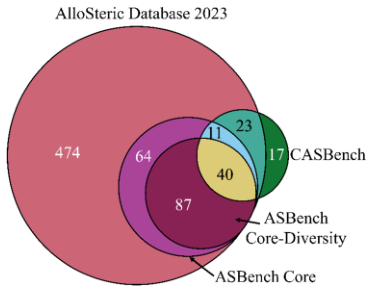
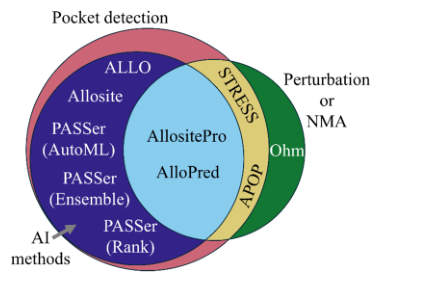
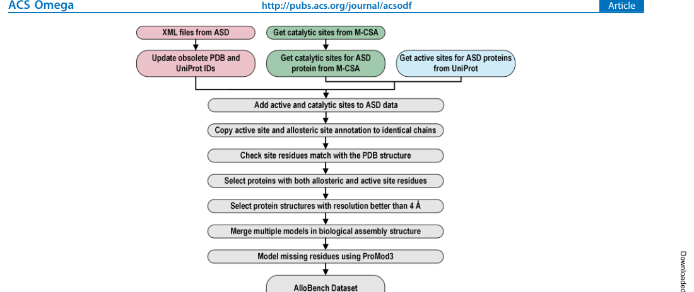
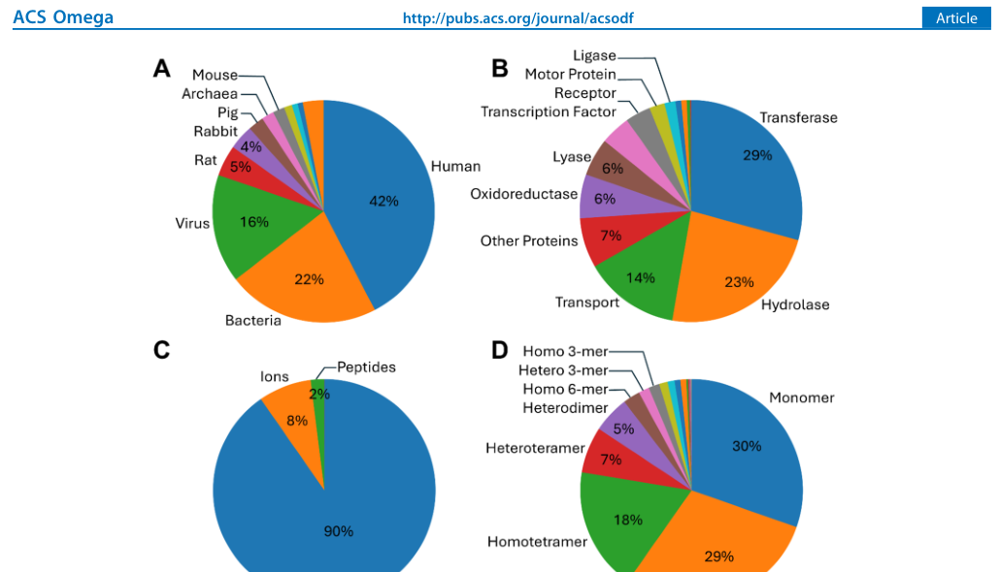
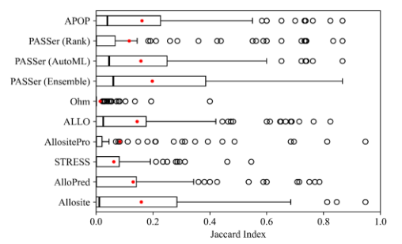
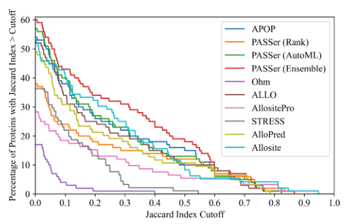
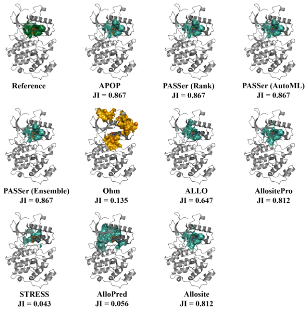

# AlloBench: A Data Set Pipeline for the Development and Benchmarking of Allosteric Site Prediction Tools

### 原文链接：[全文](https://doi.org/10.1021/acsomega.5c01263)

作者：Dibyajyoti Maity, Baofu Qiao

ACS Omega，2025 年 5 月 6 日

---
**导读**

变构调控是药物设计的重要靶向策略，但现有变构位点数据集存在过时、规模小、信息不完整等问题，不同预测工具也缺乏在同一测试集上的公平比较。本文提出 **AlloBench**——一条可持续更新的数据集构建管线，整合 ASD、UniProt、M-CSA 和 PDB 四个数据库，产出包含 **2,141 个变构位点**的高质量数据集。作者在去除训练集泄漏的 100 蛋白测试集上统一评测了 10 种预测工具，发现**所有工具的准确率均低于 60%**，PASSer（Ensemble）表现最优。

## 一、研究问题

**变构调控（allostery）**是指效应分子结合到蛋白质上远离活性位点的位置——即变构位点——进而改变蛋白质活性的现象。与直接占据活性位点的正构药物相比，变构药物通常具有更高的靶点选择性和更少的副作用，且既可以增强也可以抑制蛋白质活性，因此**计算预测变构位点**是药物发现的重要前沿。

然而，现有数据集各有局限。**ASD（AlloSteric Database）2023 版**包含 3,102 个变构位点，规模较大，但作者发现其可下载的表格文件中有 **1,620 条记录（超过一半）缺失变构位点残基信息**，且存在已废弃的 PDB/UniProt ID、数据库间映射不一致等问题，无法直接用于机器学习。**ASBench** 发表于 2015 年，只包含 202 个唯一蛋白质，未纳入近十年的新发现，也不提供系统的活性位点信息。**CASBench** 标注了 2,870 个结构，但仅来自 91 个唯一蛋白质，同一蛋白的多个结构造成严重冗余。

更关键的是，各预测工具使用不同的测试集和评价标准，性能无法公平比较。一个工具论文里报告的高准确率，可能只是因为测试集小或与训练集存在同源蛋白泄漏——如果训练集和测试集中有序列同源性很高的蛋白，模型可能只是在"记忆"已知位点而非真正学会预测新蛋白的变构位点。此前没有人在一个经过严格去泄漏处理的统一测试集上比较过所有主流工具，Table 1 列出了这些工具各自使用的训练数据、方法和评测方式的差异。这就是 AlloBench 要解决的两个核心问题：**数据集质量**和**评测公平性**。

## 二、方法核心：AlloBench 管线的构建

AlloBench 的核心设计思想是：与其再发布一个最终会过时的静态数据集，不如提供一条能够持续重建和升级的管线。整条管线从四个数据源出发，经过多步清洗和质控：

**第一步：提取和清洗。**由于 ASD 表格文件缺失值严重，作者转而解析 ASD 的 XML 文件，提取变构蛋白、调节剂和位点残基。然后更新已废弃的 PDB ID，删除不在 PDB 中的结构，通过 PDB 的 GraphQL API 重新获取 UniProt 映射，删除 PDB 与 UniProt 信息相互矛盾的记录。这一步确保"这个结构到底对应哪个蛋白质"的基础信息是可靠的。

**第二步：补充活性位点。**某些预测工具（如 Ohm 和 AlloPred）要求输入活性位点作为参考，但 ASD 本身不提供这些信息。作者从 UniProt 和 M-CSA 两个来源获取活性位点，并通过序列比对将 UniProt 编号转换为 PDB 结构中的正确残基编号。这一步对于处理 N 端截短、区域缺失、插入缺失和工程化突变至关重要——UniProt 中的第 100 号残基，在 PDB 结构里可能因截短而变成第 85 号。只保留同时具有变构位点和活性位点的蛋白。这也是 AlloBench 区别于 ASBench 的重要特点：**同时提供变构位点和活性位点**。

**第三步：结构质控。**筛选分辨率优于 4 Å 的结构。使用生物学组装体（biological assembly）而非晶体学不对称单元，因为真实蛋白可能是二聚体、四聚体或更高阶复合体，变构位点可能位于亚基界面——如果只输入单链，可能使界面变构位点消失，或使原本被另一个亚基覆盖的表面被错误识别为口袋。将同一 PDB 中的多个模型合并（613 个 PDB 文件包含多模型）。对缺失残基使用 ProMod3 建模补全（2,034 个结构中有 1,291 个存在缺失残基），并删除建模质量 lDDT &lt; 0.8 的结构。缺失残基可能构成变构口袋的一部分或参与跨区域信号传播，补全对依赖动力学分析的工具尤为重要。

**第四步：位点重定义。**作者没有完全照搬 ASD 的位点标注，而是利用 PDB 结构中实际存在的变构调节剂进行核验——找到距调节剂 ≤ 4 Å 的蛋白质残基，定义为结构中的变构位点。这种基于结构距离的统一定义保证了不同蛋白间的位点标准一致。

## 三、看图说话

### Figure 1 · 三个变构数据库的重叠

**这张图想回答：**ASD、ASBench、CASBench 这三个现有数据库，蛋白到底重不重合、各自多大？

{: width="373" height="293" loading="lazy" decoding="async"}

*Figure 1. 各数据库唯一蛋白链（UniProt accession）的 Venn 图。ASD 2023 含 699 个蛋白，ASBench 的 Core 与 Core-Diversity 分别为 202 和 127 个，CASBench 为 91 个。*

图里最大的粉色圆是 ASD 2023，光是它独有的就有 474 个蛋白，远超其他库。ASBench Core（紫色）、Core-Diversity（深红）和 CASBench（绿色）体量都小得多，彼此还高度重叠。

这张图说明两件事：ASD 覆盖面最广，是最值得挖掘的来源；但各库之间冗余明显，直接合并会重复计数。AlloBench 因此选择从 ASD 出发重建，而不是简单拼库。

### Figure 2 · 预测工具分成三类方法

**这张图想回答：**被评测的这些变构位点预测工具，背后其实是哪几种不同的思路？

{: width="440" height="282" loading="lazy" decoding="async"}

*Figure 2. 各变构位点预测工具所用方法的 Venn 图。口袋检测类先找表面口袋再判断是否变构；AI 类用口袋特征训练机器学习模型；扰动类主要靠简正模式分析评估口袋对蛋白动态的影响。*

**口袋检测类**（Allosite、PASSer 系列等）先用 Fpocket 之类找出表面口袋，再判断哪个是变构位点；**AI 类**（AllositePro、AlloPred）在口袋特征上训练分类器；**扰动类**（Ohm、STRESS）靠简正模式或信号传播分析，看扰动某处对蛋白整体动态的影响。

三个圈有交叠：很多 AI 工具仍要先做口袋检测，所以落在两类之间。真正完全不依赖口袋检测的只有 Ohm——这一点在后面的基准里很关键。

### Figure 3 · AlloBench 的数据管线

**这张图想回答：**从四个数据库出发，怎样一步步清洗出可持续升级的基准？

{: width="1100" height="464" loading="lazy" decoding="async"}

*Figure 3. AlloBench 数据管线的各步骤示意。*

**第一步 提取和清洗**：ASD 表格缺值严重，改为解析 XML 提取变构蛋白、调节剂和位点残基；更新废弃 PDB ID，经 PDB GraphQL API 重新获取 UniProt 映射，删掉自相矛盾的记录。

**第二步 补充活性位点**：从 UniProt 和 M-CSA 获取活性位点，用序列比对把 UniProt 编号换算成 PDB 里的正确残基号（处理截短、缺失、突变），只保留同时有变构位点和活性位点的蛋白。

**第三步 结构质控**：保留分辨率优于 4 Å 的结构，用生物学组装体而非不对称单元（避免界面变构位点丢失），合并多模型，用 ProMod3 补全缺失残基并剔除 lDDT &lt; 0.8 的。

**第四步 位点重定义**：不照搬 ASD 标注，而是找 PDB 结构中距调节剂 ≤ 4 Å 的残基作为变构位点，保证不同蛋白的位点标准一致。整条管线用 Jupyter Notebook 实现，用户可改过滤条件重跑。

### Figure 4 · 最终数据集长什么样

**这张图想回答：**收录的 2,141 个变构位点，在物种、功能、调节剂和聚合状态上怎么分布？

{: width="1030" height="590" loading="lazy" decoding="async"}

*Figure 4. AlloBench 中蛋白按 (A) 来源物种、(B) 功能、(C) 变构调节剂类型、(D) 聚合状态的分布。*

最终数据集含 2,141 个变构位点，来自 2,034 个 PDB 结构、418 条唯一 UniProt 链，规模和多样性都远超 ASBench（202）和 CASBench（91）。

* **Panel A 物种**：42% 人类、22% 细菌、16% 病毒——病毒蛋白占比高，反映变构调控在 HIV 逆转录酶、HCV 蛋白酶等病毒酶靶向中的分量。**Panel B 功能**：转移酶 29%、水解酶 23% 最多。
* **Panel C 调节剂**：**90% 是小分子**，离子 8%、肽 2%，与多数工具只针对小分子口袋的适用范围吻合。**Panel D 聚合状态**：同源三聚体和单体各约 30%，83% 为同源多聚体（含单体）。61 个结构同一 PDB ID 却对应 2 个不同调节剂，说明一个蛋白可以有多个变构位点。

### Figure 5 · 十种工具的 Jaccard 指数分布

**这张图想回答：**在去泄漏的 100 蛋白测试集上，各工具预测位点和真实位点的重合度有多高？

{: width="508" height="308" loading="lazy" decoding="async"}

*Figure 5. 100 蛋白测试集上，每个工具排名第一的预测位点与已知位点的 Jaccard 指数（JI = \|已知∩预测\| / \|已知∪预测\|）分布。*

JI 直接衡量预测残基与真实口袋的重合：0 完全不重叠，1 完美匹配。结果里 **PASSer（Ensemble）最好，中位 JI 仅 0.060**（均值 0.197），其次 PASSer（AutoML，中位 0.046）、APOP（0.040）、ALLO（0.025）、Allosite（0.011）。

其余 AlloPred、PASSer（Rank）、AllositePro、STRESS、Ohm 的**中位 JI 都是 0**——对一半以上的蛋白根本没找对位点，其中 AllositePro 有 35 个蛋白完全预测不出任何位点。哪怕最好的工具，对多数蛋白预测的残基也只和真实位点重合约 6%。

### Figure 6 · 不同阈值下的准确率

**这张图想回答：**如果要求预测达到某个 JI 阈值才算对，有多少比例的蛋白能过关？

{: width="500" height="322" loading="lazy" decoding="async"}

*Figure 6. 100 蛋白中，排名第一的预测位点 JI 超过给定阈值的蛋白百分比（横轴为 JI 阈值）。Ohm 不排名，取其最佳预测。*

每条曲线是一个工具，横轴是 JI 阈值，纵轴是达到该阈值的蛋白比例。所有工具在 **JI > 0.5 时准确率都不超过 60%**，大部分低于 20%；阈值提到 0.6 或 0.8，比例急剧跌向零。还有 35 个测试蛋白是所有工具都预测不对的。

有意思的是不排名的 Ohm：它中位 JI 最高（0.129）、均值 0.164，能在变构位点附近找到热点。Ohm 是唯一完全不靠 Fpocket 的工具，直接分析扰动信号的传播路径——这暗示结合后能否影响远端活性位点这类动力学信息，正是纯口袋检测缺的。代价是它预测覆盖大量残基、假阳性多，定位不到单个口袋。

### Figure 7 · 一个具体蛋白上的对比

**这张图想回答：**在同一个蛋白上把各工具的预测摆在一起，差距看起来有多直观？

{: width="615" height="619" loading="lazy" decoding="async"}

*Figure 7. 人 Mitogen-activated protein kinase 7（PDB 4ZSG）上各工具排名第一的预测位点，下方标注各自 JI。参考结构中已知变构位点为深绿色，预测位点为绿色；Ohm 的热点以橙色球显示。*

参考结构（Reference）里深绿色是真实变构位点。APOP、PASSer 三个模型都把绿色预测几乎盖在同一处，**JI 高达 0.867**；AllositePro、Allosite 也到 0.812。

而 STRESS（JI 0.043）、AlloPred（0.056）预测明显偏开；Ohm 则是满屏橙色球（JI 0.135），印证了它热点铺得太广、定位不准的毛病。这张图把前面的统计结论落到了一个能一眼看懂的例子上。

## 四、核心贡献总结

作者从 AlloBench 中构建了一个 **100 蛋白测试集**。构建过程首先识别了各预测工具训练数据中的蛋白，包括来自 ASBench 和 CASBench 的蛋白；然后通过 UniRef50 聚类 ID 将测试集中与训练蛋白属于同一聚类的蛋白全部排除（即序列一致性低于 50%），确保测试集中没有与训练集同源的蛋白。此外，只保留含有小分子变构调节剂的条目（因为被评测工具主要针对小分子）。最终 100 个测试蛋白中只含单体结构的少数，多数为多聚体。评测的工具分为三类方法：

**口袋检测类**：先识别蛋白表面口袋（多数工具共用 Fpocket），再判断口袋是否为变构位点，包括 APOP 和 PASSer 三个模型（Ensemble/AutoML/Rank）。  **AI/机器学习类**：基于口袋特征训练分类模型，包括 ALLO（朴素贝叶斯+人工神经网络）、Allosite 和 AllositePro（支持向量机/逻辑回归）、AlloPred。  **扰动分析类**：通过简正模式分析或弹性网络模型评估口袋对蛋白质动态的影响，包括 Ohm（随机算法分析扰动传播）和 STRESS（简正模式分析）。Ohm 是唯一完全不依赖传统口袋检测的方法。

使用 **Jaccard 指数（JI）**评估预测准确性：已知与预测变构位点残基集合的交集除以并集（JI = \|K ∩ P\| / \|K ∪ P\|），0 表示完全不重叠，1 表示完美匹配。由于已知位点定义为距调节剂 ≤ 4 Å 的残基，这一指标直接衡量预测残基与实际结合口袋的重合程度。每个蛋白只取排名最高的预测位点计算 JI。

结果显示，**PASSer（Ensemble）表现最优**，中位 JI 为 0.060，均值为 0.197——这意味着即使是最好的工具，对一半以上的蛋白预测的变构位点与真实位点也仅有约 6% 的残基重叠。其次是 PASSer（AutoML，中位 JI 0.046，均值 0.117）、APOP（中位 0.040，均值 0.084）和 ALLO（中位 0.025，均值 0.062）。AllositePro、STRESS、AlloPred 和 Allosite 的中位 JI 均为 0，意味着它们对超过一半的测试蛋白完全没有找到变构位点。特别值得一提的是，AllositePro 对 100 个测试蛋白中有 35 个无法预测出任何变构位点。

值得注意的是 Ohm：虽然它不对预测位点排名（无法选出"最可能"的单个位点），但它的中位 JI 最高（0.129）、均值 0.164，表明它能在变构位点附近找到热点。Ohm 是唯一完全不依赖 Fpocket 口袋检测的工具，它使用随机算法直接分析蛋白质中扰动信号的传播路径。这一结果暗示，**扰动传播分析可能提供了口袋检测所缺乏的功能信息**——它关注的是"在此处结合后能否影响远端活性位点"，而非仅仅"此处能否结合分子"。但 Ohm 的预测通常覆盖大量残基，无法精确定位到一个口袋，同时产生了大量假阳性。

如果只考虑各工具排名第一的预测位点，并在不同 JI 阈值下统计准确率：所有程序在 JI > 0.5 时准确率都不超过 60%，大部分低于 20%。使用更高阈值（JI > 0.6 或 0.8），准确率更急剧下降。此外，有 35 个测试蛋白是所有工具都无法正确预测的。

这一结果凸显了**变构位点预测这一问题远未解决**。作者指出，一个理想的变构位点预测方法应该同时回答两个问题：这里能否结合调节剂（口袋几何）？在此处结合后能否影响远端活性位点（动力学传播）？当前大多数工具侧重第一个问题，而 Ohm 的较好表现暗示第二个问题的信息同样关键。未来可能需要深度融合口袋几何特征、蛋白质整体三维结构、机器学习方法和分子动力学分析来显著提高预测准确率。

在运行速度方面，各工具差异极大。大部分口袋检测和 AI 类工具可在秒到分钟量级完成预测，但 AlloPred 和 STRESS 对大蛋白需运行数小时甚至更长，因为它们依赖计算量较大的简正模式分析（NMA）。考虑到大规模虚拟筛选和高通量分析通常涉及数千个蛋白结构，运行速度也是选择工具时不可忽视的实际因素。作者还比较了具体蛋白案例——以人类 Mitogen-activated protein kinase 7 为例，APOP、PASSer 三个模型的排名第一预测位点都与已知变构位点高度重合，但 AlloPred 和 STRESS 的预测偏差较大。

## 五、局限与展望

AlloBench 的数据来源主要依赖 ASD 的人工标注，继承了 ASD 本身的覆盖范围和标注偏差——例如 ASD 中蛋白质功能类别的分布可能反映研究热度而非自然界的变构蛋白真实分布。管线目前不区分变构激动剂和抑制剂的位点，也不包含变构调节的动态机制信息（如信号传播路径）。测试集仅 100 个蛋白，部分工具（如 Allosite 和 AllositePro）只提供网页服务器且无 API，需手动提交，限制了大规模评测的可重复性和标准化——这也是各工具没有在完整 2,034 个结构上全面评测的主要原因。

评价指标 JI 要求预测位点与已知标注精确匹配残基，对于预测位置空间上接近但残基编号略有偏差的情况可能偏于严格。作者也做了 JI 与位点中心距离的相关性分析，发现二者呈强相关，说明 JI 确实能可靠反映预测与真实位点的空间接近程度。此外，多数工具共用 Fpocket 进行口袋检测，如果 Fpocket 的第一步未能找到真实变构位点，后续分类模型也无法补救。作者发现部分工具（PASSer 的三个模型）偶尔会在正确残基附近返回虚假残基编号（补充材料 Table S3），可能源于 Fpocket 的口袋枚举方式。

## 通讯作者介绍

Baofu Qiao（乔保甫），佛罗里达大学化学工程系助理教授。他在中国科学技术大学获得学士学位，在中国科学院化学研究所获得博士学位，随后在美国西北大学和阿贡国家实验室从事博士后研究。他的研究方向涵盖计算化学与生物物理，聚焦于分子动力学模拟、蛋白质变构调控机制和数据驱动的分子设计方法开发。AlloBench 管线代码和生成的数据集均已在 GitHub 开源，用户可以根据需要重新运行管线以纳入最新发现的变构蛋白。第一作者 Dibyajyoti Maity 是 Qiao 组的博士生，本工作是其博士论文的一部分。

## 引用

Maity, D., & Qiao, B. (2025). AlloBench: A Data Set Pipeline for the Development and Benchmarking of Allosteric Site Prediction Tools. ACS Omega, 10(17), 17973-17982. https://doi.org/10.1021/acsomega.5c01263
