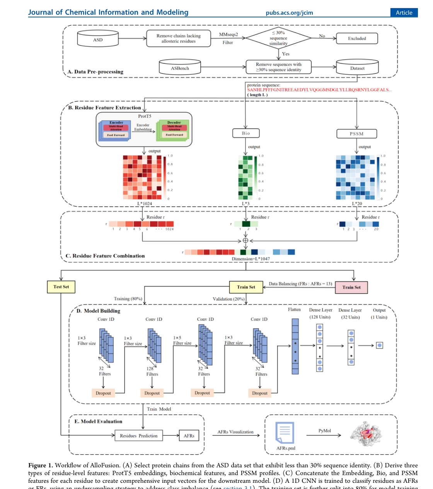
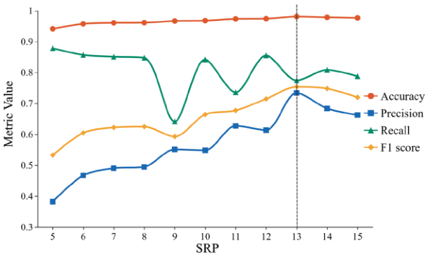
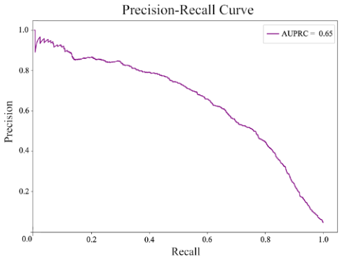
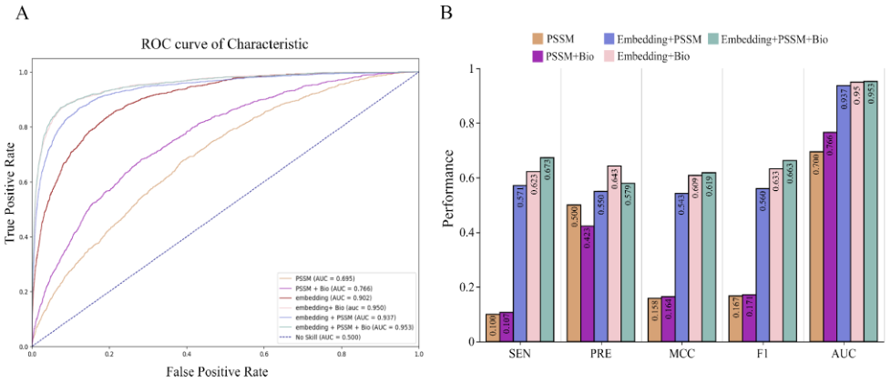
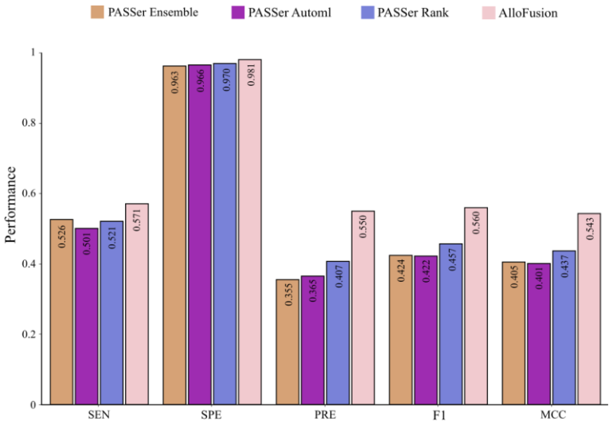
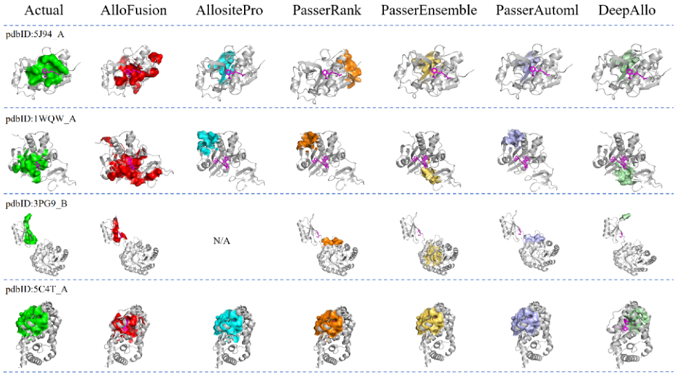
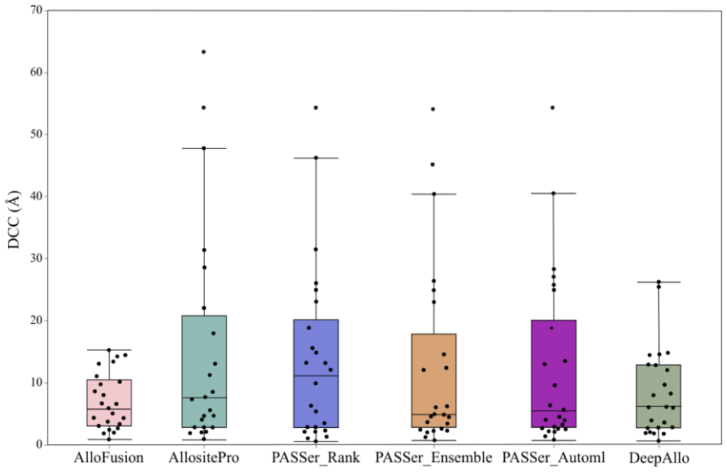
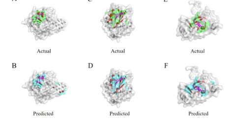
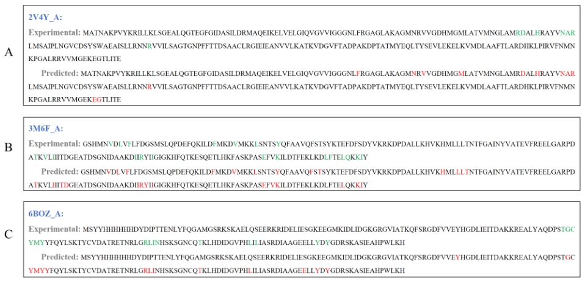
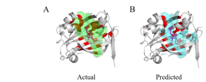

# Allofusion: Allosteric Site Prediction Based on Language Models and Multi-Feature Fusion

### Link: [full article](https://doi.org/10.1021/acs.jcim.5c01033)

Authors: Jiabin Huang, Dongliang Guo, Yapeng Liu, Yanfen Wang, Mengya Lv

Journal of Chemical Information and Modeling, August 1, 2025

---
**Overview**

Allosteric site prediction is crucial for drug discovery, but conventional methods first find pockets and then classify them, and about 18.3% of allosteric residues do not lie in any detectable pocket at all. AlloFusion proposes a residue-level multimodal prediction framework that fuses ProtT5 protein language model embeddings, evolutionary PSSM and biochemical/dynamic features into a 1047-dimensional residue vector, and uses a one-dimensional convolutional network to decide directly whether each residue belongs to an allosteric site. On a test set of 90 proteins it reaches an F1 of 0.560 and an AUC of 0.953, outperforming the pocket-based PASSer family across the board; on 24 independent proteins it successfully predicts 23 allosteric sites.

## Part 1: Research Question

An allosteric site on a protein is a regulatory region far from the active site: when a ligand binds there, it indirectly influences catalytic or signaling function by altering the protein's conformation or dynamics. Allosteric drugs offer higher selectivity and do not need to compete with the natural substrate, making them an important direction in current drug discovery, and several allosteric drugs have already been approved or entered clinical trials. But allosteric sites are extremely hard to predict: some appear only transiently in particular conformations (cryptic sites), some sit on flat surfaces and do not form a typical pocket, and others are highly diverse across evolution. More importantly, allostery is fundamentally about cooperation among residues: a small subset of key residues directly mediates ligand binding and functional regulation, while the other residues mainly maintain the overall conformational stability of the protein. Accurately identifying these key residues is essential both for understanding allosteric mechanisms and for designing allosteric drugs.

Mainstream computational methods today work in two steps: first, tools such as Fpocket detect candidate pockets on the protein surface, and then machine learning judges which pocket is likely to be allosteric. This pipeline has a fundamental bottleneck: **if the true allosteric site is not found by the pocket detection in step one, no downstream classifier, however good, can predict it**. The literature reports that about 18.3% of allosteric site-forming residues (AFRs) lie outside detectable pocket regions. In addition, existing methods mostly rely on static structures or single-modality features, which makes it hard to capture the multidimensional sequence, structural and dynamic signals of allosteric sites.

AlloFusion's core idea is to bypass the pocket-detection prerequisite and **perform binary classification directly at the residue level**: for each residue in a protein sequence, decide whether it is an allosteric site-forming residue (AFR). This makes it possible to identify even residues that lie on flat surfaces or in atypical geometric regions. At the same time, AlloFusion fuses information from three complementary modalities, protein language model representations, evolutionary conservation and physicochemical properties, to characterize each residue comprehensively, fundamentally improving both the accuracy and the coverage of allosteric site identification.

## Part 2: Methodology: Bypassing pocket detection and fusing three feature types at the residue level

AlloFusion represents each residue as a **1047-dimensional feature vector** that fuses three types of information:

**ProtT5 embedding (1024 dimensions)**: ProtT5 is a Transformer model pretrained on large-scale protein sequence data (BFD and UniRef50), producing a 1024-dimensional vector for each residue. Because the Transformer's attention mechanism captures relationships between distant residues, this representation implicitly encodes sequence context, local motifs, long-range dependencies and latent structural and functional information. The authors further apply LoRA (low-rank adaptation) to fine-tune ProtT5's attention layers in a parameter-efficient way, so that it better separates allosteric residues. After fine-tuning, Precision rises from 0.285 to 0.710 and AUC from 0.772 to 0.902.

**PSSM evolutionary features (20 dimensions)**: a position-specific scoring matrix obtained from three iterations of PSI-BLAST search (E-value threshold 0.001). The 20 values at each position reflect the evolutionary tendency of that residue to be substituted by each of the 20 standard amino acids, describing residue conservation and functional constraint. The values are normalized to the [0, 1] interval with a sigmoid.

**Biochemical features (3 dimensions)**: hydrophobicity (reflecting the propensity to interact with ligands), solvent-accessible surface area (reflecting how exposed the residue is on the protein surface) and a dynamic property (ESSA z-score, which uses an elastic network model to measure how perturbing a residue affects the protein's global motion modes). The more a residue affects global dynamics, the more likely it is to take part in allosteric signaling. All three features are min-max normalized.

After the three feature types are concatenated, each residue is represented by a 1047-dimensional vector. These vectors are fed into a four-layer one-dimensional convolutional network (Conv1: 32×3, Conv2: 128×3, Conv3: 32×5, Conv4: 32×3); all convolutional layers use same padding and ReLU activation, with dropout after each layer to prevent overfitting. Two fully connected layers follow (128→32 neurons), and a final sigmoid outputs the probability that each residue is an AFR. A probability ≥ 0.5 classifies the residue as an allosteric site residue. The rationale for choosing a 1D CNN is that convolution kernels sliding along the protein sequence can learn local residue combination patterns: whether a residue participates in an allosteric site often depends on how its physicochemical composition and conservation combine with those of neighboring residues, while the ProtT5 embedding supplies the longer-range context.

The training data come from ASD2023 (V5.0, 3,102 allosteric site entries) and the ASBench benchmark dataset. After clustering and redundancy removal with MMseqs2 (sequence similarity &lt; 30%), 462 nonredundant proteins remain, split 8:2 into the training set TR372 and the test set TE90. In addition, 24 allosteric proteins from the AllositePro study serve as the independent test set D24. AFRs are defined as residues within ≤ 5 Å of the allosteric modulator, and the AFR-to-FR ratio in the training set is about 1:27 (5,239 vs 144,465). To keep the model from simply predicting every residue as nonallosteric (on data this imbalanced, always predicting FR already yields an accuracy of about 96%), the authors randomly undersample FRs, testing a sampling ratio parameter SRP from 5 to 15, and find that SRP = 13 gives the best validation F1.

## Part 3: Key Figure Analysis

### Figure 1: The AlloFusion workflow

**What this figure asks:** How are the three feature types computed from sequence, and how are they fused into a 1D CNN?

{: width="1120" height="1264" loading="lazy" decoding="async"}

*Figure 1. The AlloFusion pipeline. (A) Protein chains with sequence identity &lt;30% are taken from ASD. (B) Three feature types are computed for each residue: ProtT5 embedding, biochemical features and PSSM. (C) They are concatenated into a combined vector. (D) The vector is fed into a one-dimensional convolutional network that decides, residue by residue, whether each belongs to an allosteric site.*

* **Panel A** is the data: protein chains with pairwise sequence identity below 30% are taken from ASD to avoid homology leakage. **Panel B** is the features, three types per residue: a **1024-dimensional ProtT5 language model embedding** (capturing sequence context and long-range dependencies, fine-tuned with LoRA), 20-dimensional PSSM evolutionary features and 3-dimensional biochemical features (hydrophobicity, solvent-accessible surface area, ESSA dynamics).
* **Panel C** concatenates the three into a **1047-dimensional residue vector**. **Panel D** feeds it into a four-layer one-dimensional convolutional network plus two fully connected layers, with a sigmoid outputting the probability that each residue belongs to an allosteric site; ≥ 0.5 classifies it as an allosteric residue. The whole route skips pocket detection, so residues anywhere on the protein have an equal chance of being identified.

### Figure 2: How to choose the decision threshold SRP

**What this figure asks:** After scoring each residue, how many top-ranked residues should be counted as the predicted site?

{: width="614" height="368" loading="lazy" decoding="async"}

*Figure 2. Validation set performance for different SRP values; SRP = 13 gives the highest F1, the best trade-off between precision and recall.*

SRP controls how many top-ranked residues per protein are taken as the predicted allosteric site. The x-axis is SRP, and the four lines are Accuracy, Precision, Recall and F1. Recall first falls and then rises as SRP increases, Precision keeps rising, and **F1 peaks at SRP = 13** (the dashed line in the figure), which is the threshold the authors adopt.

### Figure 3: The PR curve under extreme class imbalance

**What this figure asks:** Allosteric residues make up only a tiny fraction of a protein; how does the model perform under such imbalance?

{: width="488" height="370" loading="lazy" decoding="async"}

*Figure 3. Precision-Recall curve on the TE90 test set (SRP = 13), AUPRC = 0.65.*

The ratio of allosteric to nonallosteric residues is about 1:25, and in this situation a PR curve reflects the real difficulty better than ROC. The area under the curve is **AUPRC = 0.65**: precision stays above 0.8 in the low-recall region and gradually declines as recall increases, showing that the model retains useful discriminative power under severe imbalance, but false positives increase at high recall.

### Figure 4: How much each feature type contributes (ablation)

**What this figure asks:** Of PSSM, embeddings and biochemical features, which one hurts the most when removed?

{: width="978" height="420" loading="lazy" decoding="async"}

*Figure 4. Ablation of feature combinations. (A) Comparison of ROC curves on the test set. (B) Comparison of six combinations on SEN, PRE, MCC, F1 and AUC.*

**The ProtT5 embedding is the most important source**: on its own it already reaches an AUC of 0.902, far above the 0.695 of PSSM alone, showing that the pretrained language model has learned much more than traditional evolutionary features.

Adding biochemical features gives the largest gain (Embedding + Bio reaches an AUC of 0.950, +0.048), because physicochemical constraints such as surface exposure, hydrophobicity and global dynamics are not directly encoded by the language model. Adding PSSM on top gives the full model an AUC of 0.953; the marginal gain is small (+0.003), but SEN, PRE and MCC still improve steadily: the three feature types each play their own role and complement one another.

### Figure 5: Comparison with pocket-based PASSer

**What this figure asks:** On the same nonredundant test set, can a residue-level approach beat pocket-based methods like PASSer?

{: width="770" height="534" loading="lazy" decoding="async"}

*Figure 5. Comparison of AlloFusion with PASSer Ensemble / AutoML / Rank on the TE90 test set.*

For a fair comparison, the pocket methods take only their top-ranked pocket and treat its residues as the prediction. AlloFusion is **best on all five metrics**: SEN 0.571, SPE 0.981, PRE 0.550, F1 0.560, MCC 0.543.

Among these, Precision of 0.550 is a 35% improvement over PASSer Rank's 0.407, and F1 of 0.560 is a 22.5% improvement over the runner-up's 0.457. The high SPE (98.1%) means the model does not scatter labels across the whole protein surface, which matters especially when the vast majority of residues are not allosteric.

### Figure 6: Side-by-side predictions of each method on several proteins

**What this figure asks:** When the predictions of different methods on the same set of proteins are laid side by side, how do they differ?

{: width="982" height="546" loading="lazy" decoding="async"}

*Figure 6. 3D visualization of the allosteric residues predicted by each method on several proteins. Each row, from left to right: true site (green), AlloFusion (red), AllositePro (cyan), PASSer Rank (orange), PASSer Ensemble (light yellow), PASSer AutoML (light blue), DeepAllo (light green). N/A means the method produced no output.*

Each row is one protein; the leftmost column in green is the true allosteric site, and the columns to the right are the predictions of the different methods. AlloFusion's red patches generally overlap the green true sites the most.

The contrast is easy to see: on 5J94_A, for example, AllositePro's prediction is compact but covers many irrelevant residues, while both PASSer models are off target overall; on 3PG9_B, **AllositePro returns N/A (no output)**, yet AlloFusion still locates the site correctly.

### Figure 7: Distribution of localization accuracy (DCC)

**What this figure asks:** How far is each method's predicted site center from the true center?

{: width="894" height="580" loading="lazy" decoding="async"}

*Figure 7. Distribution of DCC (distance from predicted center to true center) for AlloFusion, AllositePro, the three PASSer models and DeepAllo on the independent test set D24.*

DCC is the distance from the center of the predicted site to the center of the true site; smaller is more accurate. AlloFusion's box is the lowest and narrowest, with a **median DCC of 5.35 Å**, clearly better than PASSer Rank (10.94 Å) and PASSer Ensemble (16.47 Å).

AllositePro's median DCC is even lower at 4.23 Å, but it successfully predicts only 16/24 proteins, a miss rate of 33%; AlloFusion **successfully predicts 23/24** on D24, combining coverage with accuracy.

### Figure 8: True versus predicted sites on the structures of three proteins

**What this figure asks:** On the real 3D structures, how well do the predicted sites match the actual ones?

{: width="480" height="244" loading="lazy" decoding="async"}

*Figure 8. 3D visualization of three proteins (PDB 2V4Y, 3M6F, 6BOZ). The top row (A/C/E) shows the true allosteric sites (green), and the bottom row (B/D/F) shows the sites predicted by AlloFusion (cyan).*

Viewing the true sites (top row, green) and predicted sites (bottom row, cyan) of the three proteins side by side, the two rows fall in the same spatial region, with matching shape and position, showing that the model locks onto the correct allosteric region as a whole rather than hitting a few residues by chance.

### Figure 9: Residue-by-residue alignment at the sequence level

**What this figure asks:** Viewed as a one-dimensional sequence, do the predicted residues line up position by position with the true ones?

{: width="958" height="462" loading="lazy" decoding="async"}

*Figure 9. One-dimensional sequence representations of chain A of PDB 2V4Y (A), 3M6F (B) and 6BOZ (C). For each protein, the upper row marks the true allosteric residues (green) and the lower row the residues predicted by AlloFusion.*

This figure flattens the 3D structures into sequences, with the true allosteric residues in the upper row and the predicted residues in the lower row, marked by color. You can check position by position: most green residues are also marked in the predicted row, and both missed and extra residues are in the minority, consistent with the SEN of 0.571 and PRE of 0.550 reported earlier.

### Figure 10: A prediction case on an independent protein

**What this figure asks:** On a protein outside the training data, do the predicted and true sites match?

{: width="414" height="166" loading="lazy" decoding="async"}

*Figure 10. Allosteric site prediction for protein 4ZSI. (A) The true site in green; (B) the site predicted by AlloFusion in cyan; the protein backbone is gray.*

4ZSI is an example from the independent test. The green true site on the left and the cyan predicted site on the right fall in the same concave region with similar shapes, visually confirming that the model can also locate the allosteric region on proteins it has never seen.

## Part 4: Key Contributions

On the TE90 test set (90 nonredundant proteins), the authors compared AlloFusion directly with three PASSer pocket methods at the residue level. To keep the comparison fair, the pocket methods take only their top-ranked predicted pocket, and the residues forming that pocket are treated as predicted AFRs. AlloFusion achieves the best result on all five metrics:

**Sensitivity 0.571**: recovers about 57% of the true allosteric residues, better than PASSer Ensemble (0.526) and PASSer Rank (0.521), and also higher than PASSer AutoML (0.501)

**Specificity 0.981**: 98.1% of nonallosteric residues are correctly excluded. Because the vast majority of residues in a protein are not AFRs, high SPE means the model does not produce large numbers of false predictions across the protein surface

**Precision 0.550**: about 55% of the residues predicted as AFRs are true allosteric residues, a **35% improvement** over PASSer Rank's 0.407 and a 55% improvement over PASSer Ensemble's 0.355

**F1 0.560**: the best balance between 'finding many' and 'finding them accurately', a **22.5% improvement** over the runner-up PASSer Rank (0.457)

**MCC 0.543**: the Matthews correlation coefficient takes all four classification outcomes, TP, TN, FP and FN, into account and suits class-imbalanced settings better than accuracy; AlloFusion also leads on this metric

On the independent test set D24 (24 allosteric proteins), AlloFusion successfully predicted the allosteric sites of 23 proteins. The authors use DCC (the distance between the predicted site center and the known site center) to measure spatial accuracy; AlloFusion's median DCC is 5.35 Å, significantly lower than PASSer Rank (10.94 Å) and PASSer Ensemble (16.47 Å), showing that AlloFusion not only finds the allosteric region but also localizes it more precisely. AllositePro's median DCC is low (4.23 Å), but it successfully predicts only 16/24 proteins, a miss rate as high as 33%. DeepAllo (median DCC 6.87 Å, 21/24 successes) and PASSer Rank (19/24 successes) also have clear blind spots.

In specific protein cases (such as PDB: 5J94_A), the allosteric residues predicted by AlloFusion overlap closely with the true AFRs, whereas AllositePro's predicted region, though compact, covers many irrelevant residues, and the predicted regions of PASSer Ensemble and Automl drift away from the true allosteric site. For another protein, 3PG9_B, AllositePro produces no prediction at all (N/A), while AlloFusion still correctly identifies the allosteric region.

The key to AlloFusion's advantage is a change of strategy. Conventional pocket methods follow a serial 'find pockets first, then judge' pipeline: tools such as Fpocket first detect all possible candidate pockets on the protein surface, and a classifier is then trained to judge which pocket is most likely allosteric. The problem with this pipeline is that if the allosteric region happens to lie on a flat surface that does not form a typical pocket, at a protein–protein interface, or at a cryptic site that appears only in particular conformations, the first step misses it, and no downstream classifier, however good, can recover it.

AlloFusion bypasses the pocket-detection step entirely and scores every residue in the protein sequence independently. This means residues anywhere, whether or not they sit in a detectable pocket, have an equal chance of being classified as AFRs. The deep sequence semantics provided by the ProtT5 protein language model further strengthen this advantage: the model does not depend on experimentally solved 3D structures and works from the protein sequence alone, which is especially important for proteins that so far have no experimental structure or only low-resolution ones.

## Part 5: Limitations and Outlook

AlloFusion's Sensitivity is 0.571, meaning about 43% of allosteric residues are still missed; for drug screening scenarios that need high recall, this miss rate deserves attention. Under highly imbalanced test conditions (positive-to-negative ratio about 1:25), the AUPRC is 0.65, indicating that the model will still produce a certain proportion of false positives in practice. Both training and evaluation data come from the ASD2023 database, whose coverage is limited by published experimental studies; the distribution of protein functional classes may reflect research popularity rather than the true distribution of allosteric proteins in nature, and the model's performance on protein classes not covered by the database remains to be validated.

In addition, because the training data of PASSer and AllositePro are not public, potential overlap between the test sets TE90 and D24 and the training sets of these methods cannot be fully ruled out, which adds uncertainty to the fairness of the comparison. The dynamic property among the biochemical features (ESSA z-score) relies on an elastic network model's linear approximation of protein motion and may be inaccurate for proteins with complex conformational changes or large domain motions. The 1D CNN used by the model mainly captures feature combinations within local sequence windows (kernel sizes of 3–5 residues), relying on the ProtT5 embedding to supply longer-range sequence dependencies indirectly; future work could introduce graph neural networks or attention mechanisms to model spatial relationships between residues explicitly. Finally, AlloFusion currently uses only sequence and sequence-derived features and does not explicitly integrate 3D structural information. Although ProtT5 implicitly carries some structural knowledge, combining it with AlphaFold-predicted structures or molecular dynamics simulation data could further improve prediction accuracy substantially, which is a direction worth exploring.

## About the Corresponding Author

Mengya Lv is an associate professor at the School of Science, China Pharmaceutical University. She received her bachelor's and doctoral degrees from China Pharmaceutical University, and her research spans computational drug design, mechanisms of protein allosteric regulation and AI-based drug discovery methods, with many years of experience in protein structure analysis and prediction and in computational modeling of drug–target interactions. The source code and training data of AlloFusion are open-sourced on GitHub (https://github.com/hjb-001/AlloFusion), making it easy for other researchers to reproduce the work and apply it to their own data. First author Jiabin Huang is a master's student in Lv's group and did most of the work on method design, model training, code development and all experimental validation. This research was supported by the National Natural Science Foundation of China and the Natural Science Foundation of Jiangsu Province.

## Citation

Huang, J., Guo, D., Liu, Y., Wang, Y., & Lv, M. (2025). Allofusion: Allosteric Site Prediction Based on Language Models and Multi-Feature Fusion. Journal of Chemical Information and Modeling, 65(16), 8858-8870. https://doi.org/10.1021/acs.jcim.5c01033
