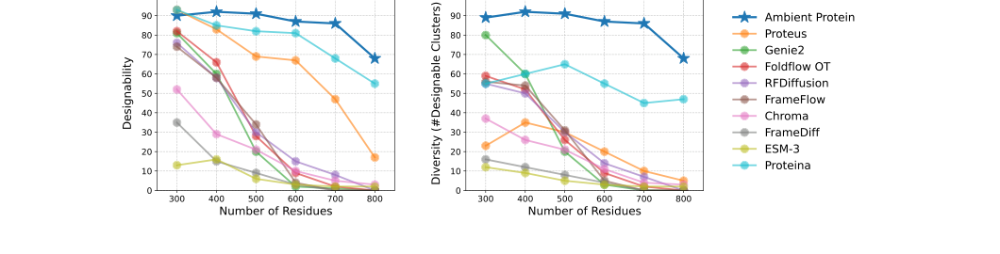
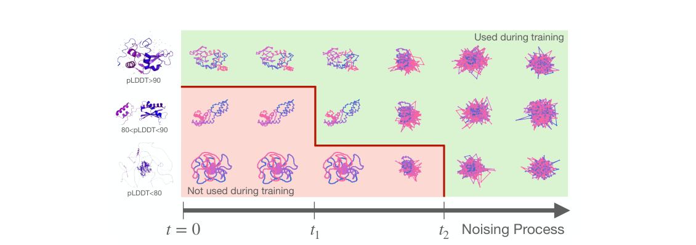
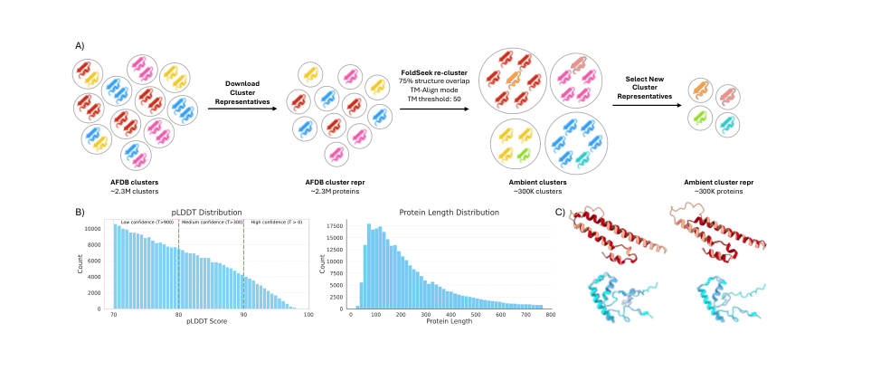
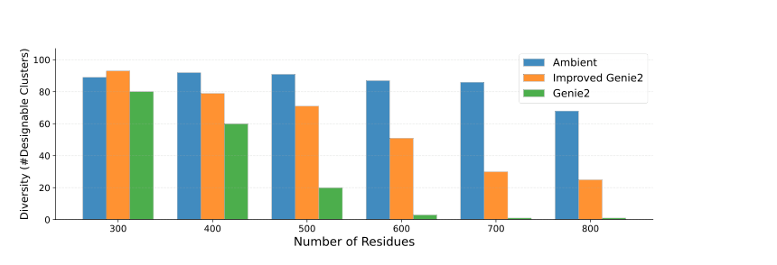
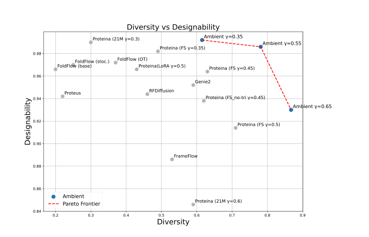

# Ambient Proteins: Training Diffusion Models on Low Quality Structures

### Link: [full article](https://doi.org/10.1101/2025.07.03.663105)

Authors: Giannis Daras, Jeffrey Ouyang-Zhang, Krithika Ravishankar, ..., Daniel J. Diaz

bioRxiv, July 5, 2025

---
**Overview**

The AlphaFold Database contains more than 200 million predicted structures, yet a large number of low-confidence (pLDDT) structures have long been discarded by mainstream generative models. Researchers at MIT CSAIL and UT Austin propose **Ambient Protein Diffusion**, which treats low-pLDDT structures as data already corrupted by noise to varying degrees and restricts the diffusion time range in which each one participates in training according to its quality. Combined with a re-clustering of AFDB based on geometric similarity, a model with only **16.7 million parameters** surpasses the 200-million-parameter Proteina across the board on designability and diversity for long-protein generation.

## Part 1: Research Question

Training a protein backbone generative model requires a great deal of three-dimensional structure data. The AlphaFold Database (AFDB) provides more than 200 million computationally predicted structures, but their quality varies widely. AlphaFold supplies a confidence metric for each residue, pLDDT (predicted Local Distance Difference Test), and in practice researchers usually set a threshold (such as pLDDT > 80) and discard any structure below it.

This practice introduces a systematic bias: **low-pLDDT structures tend to be exactly the long proteins, multi-domain proteins and topologically complex proteins**. Naive filtering skews the training set toward short, simple proteins and weakens the model's ability to generate long proteins of 600 to 800 residues. On the other hand, those low-pLDDT structures are not entirely wrong. They may contain correct local domains, reasonable secondary structure, information about the overall size of long proteins, and topology types that are scarce in the training set; it is the relative orientation between domains and the long-range interactions that are predicted inaccurately, as reflected by a low predicted alignment error (pAE).

The core question is whether there is a way to make full use of the long-protein topology information contained in these low-quality structures without importing their prediction errors.

Looking at the data distribution, the longer a protein is and the more domains it has, the lower its average pLDDT tends to be. In AFDB, for instance, a large number of proteins longer than 500 residues have an average pLDDT below 80. If pLDDT > 80 is required uniformly, short proteins keep plenty of samples while long and multi-domain proteins are deleted en masse, and the rare topology types in the training set are lost along with them. A model that almost never sees complex structures above 600 residues during training naturally struggles to generate high-quality long proteins at inference time.

## Part 2: Methodology: Noise can wash out structure prediction errors

The central idea of Ambient Protein Diffusion comes from a neat mathematical observation. Let the distribution of real protein structures be p0 and that of AlphaFold predicted structures be p̃0. AlphaFold's errors have complicated sources, including local coordinate deviations, wrong domain orientations and poorly modeled disordered regions, so the degradation process cannot be written out explicitly the way it can in a conventional denoising problem. But if Gaussian noise is added to both distributions, the KL divergence between them decreases monotonically as the noise grows; once the noise is large enough, AlphaFold's original prediction error is covered by the diffusion noise and the two distributions converge, which is referred to as distribution merging.

Based on this property, the authors assign every AlphaFold structure a minimum noise threshold according to its pLDDT:

**pLDDT ≥ 90**: can participate across all diffusion times [1, 1000]  **80 ≤ pLDDT &lt; 90**: participates only at medium-to-high noise [600, 1000]  **70 ≤ pLDDT &lt; 80**: participates only at the highest noise [900, 1000]  **pLDDT &lt; 70**: not used

High-quality structures can teach the model fine local geometry at low noise levels; medium-quality structures supply mesoscale conformational information at higher noise levels; and low-quality structures contribute coarse-grained distributional information about long proteins and complex topologies in the highest-noise regime. An intuitive analogy: sharp photographs let you learn textural detail, while blurry photographs, once all photographs have been blurred further, no longer differ meaningfully in sharpness, and you can still learn the rough outline and the class distribution of the objects from them.

Three key adjustments were also made during training. First, the pre-added noise for each low-quality structure is sampled once and then fixed: if the noise were resampled every epoch, the model could average over the different realizations and gradually recover AlphaFold's original error. Second, the diffusion loss is modified. An ordinary diffusion model uses the clean structure as the supervision target, but low-quality structures have no trustworthy clean target, only the pre-noised version. The authors use the conditional expectation relation from Ambient Diffusion so that the model's prediction, linearly combined with the current high-noise structure through a coefficient α(t), is used to predict the observable pre-noised version, with a weighting factor w(t) introduced to compensate for the vanishing gradient as α approaches zero. Third, the sampling order is changed: the diffusion time is sampled uniformly first and then proteins meeting the threshold are selected, which ensures that low, medium and high noise times are all trained in a balanced way.

## Part 3: Key Figure Analysis

### Figure 1: Overall performance on long-protein generation

**What this figure asks:** When generating long proteins, are Ambient's designability and diversity really better than those of existing methods?

{: width="1060" height="270" loading="lazy" decoding="async"}

*Figure 1. Long-protein generation performance. Designability (left) and diversity (right) of the 16.7M-parameter Ambient model across lengths from 300 to 800 residues, compared against the 200M-parameter Proteina and other methods.*

The left plot is designability and the right one diversity, with protein length on the x-axis in both. The blue Ambient curve leads RFDiffusion, Genie2, FrameFlow and Chroma at every length, and does so with a model of **only 16.7 million parameters**.

The advantage is clearest on long proteins: at length 700, designability rises from Proteina's 68% to **86%** and diversity from 45% to 86%. Moreover, Ambient's diversity is almost equal to its designability: at 700 residues, 86 of 100 samples are designable and they form exactly 86 distinct structural clusters, with virtually no duplicates.

### Figure 2: Staged participation in training by pLDDT

**What this figure asks:** How can AlphaFold structures of different quality participate in training only at the appropriate noise levels?

{: width="1130" height="400" loading="lazy" decoding="async"}

*Figure 2. Method overview. The first three rows show AlphaFold structures of high, medium and low pLDDT being progressively noised from left to right; low-quality structures are used for training only in the high-noise regime.*

The core observation: when Gaussian noise is added separately to the real structure distribution and the AlphaFold predicted distribution, the KL divergence between them shrinks as the noise grows, and once the noise is large enough, AlphaFold's prediction error is drowned out and the two distributions converge.

Each structure is therefore given a minimum noise threshold according to its pLDDT: **pLDDT ≥ 90** participates across all diffusion times [1,1000], 80 to 90 only in [600,1000], 70 to 80 only in [900,1000], and anything below 70 is not used. High-quality structures teach fine geometry, while low-quality structures supply only the coarse-grained outline of long proteins in the highest-noise regime.

The analogy: sharp photographs teach textural detail, while blurry photographs, blurred further along with everything else, can still teach the rough outline and the class distribution of objects.

### Figure 3: Re-clustering AFDB by geometric similarity

**What this figure asks:** Why is the original AFDB clustering unsuitable for training generative models, and how is the re-clustering done?

{: width="984" height="420" loading="lazy" decoding="async"}

*Figure 3. Re-clustering AFDB. (A) Starting from 2.3 million AFDB cluster representatives, FoldSeek with TM-Align, a TM threshold of 0.5 and coverage of 0.75 regroups them by geometric similarity into roughly 292,000 clusters. (B) pLDDT and protein length distributions of the re-clustered data. (C) Example structures.*

* **Panel A**: the original 2.3 million AFDB clusters were designed for studying evolution, clustered by sequence homology plus 3Di+AA alignment, with the result that proteins with extremely similar three-dimensional shapes but distant evolutionary relationships end up in different clusters and large superfamilies are over-represented. The authors start from the roughly 1.29 million cluster representatives with pLDDT > 70 and switch to purely geometric TM-Align with a threshold of 0.5 and coverage relaxed to 0.75 (to accommodate long disordered termini), regrouping them into **roughly 292,000 geometric clusters** with a more balanced distribution.
* **Panels B and C**: the pLDDT distribution of the re-clustered data (split into low, medium and high confidence bands) and the length distribution, along with several example structures. Samples of long proteins and complex topologies are retained, and these are precisely the ones that a blanket pLDDT > 80 cutoff used to remove.

### Figure 4: Ablation: the gain really comes from Ambient training

**What this figure asks:** Does the performance gain come from a bigger model and re-clustering, or from the training method for low-quality data?

{: width="860" height="294" loading="lazy" decoding="async"}

*Figure 4. Ablation study. Improved Genie2 (orange) matches Ambient in architecture, parameter count, dataset and training lengths; the only difference is that it does not use Ambient's low-pLDDT training method.*

Improved Genie2 adopts every improvement except the low-pLDDT training method: the larger architecture, the re-clustering and the long-protein fine-tuning. At 300 residues it is even slightly ahead (93 vs 89), but the gap widens as proteins get longer: 71 vs 91 at 500 residues, 51 vs 87 at 600, 30 vs 86 at 700, and **only 25 vs 68 at 800 residues**. This controlled comparison rules out confounders such as scale, training length and clustering scheme, and shows that the large gain on long proteins comes mainly from quality-aware training on low-pLDDT data.

### Figure 5: The designability-diversity trade-off on short proteins

**What this figure asks:** On short proteins, can Ambient achieve high designability and high diversity at the same time?

{: width="740" height="476" loading="lazy" decoding="async"}

*Figure 5. The designability-diversity trade-off in short-protein generation (≤256 residues). Diversity on the x-axis and designability on the y-axis, with blue points for Ambient at different noise scales γ and the red dashed line marking the Pareto frontier.*

The upper right is better (both designable and diverse). The blue Ambient points at various γ **completely occupy the Pareto frontier** (the red dashed line), pushing Proteina, Genie2, RFDiffusion and FoldFlow below it. At γ = 0.55 it reaches 98.6% designability and 0.781 diversity with a model about 12.88 times smaller than its competitor, and without any higher-order sampler or self-guidance.

## Part 4: Key Contributions

The model is built on Genie2's SE(3)-equivariant backbone diffusion architecture, increasing the triangle layers from 5 to 8 for about 16.7 million parameters. The long-protein model is trained in three stages: a first stage with a maximum length of 256 (18 hours), a second at 512 (48 hours) and a third at 768 (48 hours), using 48 GH200 GPUs. By comparison, Proteina uses about 200 million parameters, roughly 780,000 training structures and 128 A100s over about 14 days.

**Unconditional generation of long proteins**

For proteins of length 300 to 800, 100 backbones were generated at each length. The designability validation protocol is as follows: ProteinMPNN generates 8 sequences for each backbone, ESMFold refolds those sequences, the minimum RMSD (scRMSD) is taken, and scRMSD &lt; 2 Å counts as designable. For diversity, the designable structures are clustered with FoldSeek at a TM-score of 0.5 and the number of unique structural clusters is reported.

The results show that Ambient Protein Diffusion performs excellently at every tested length, surpassing existing methods such as RFDiffusion, Genie2, FrameFlow and Chroma across the board. In the 300 to 500 residue range, designability stays above 90%, matching or exceeding Proteina. The advantage is especially pronounced on long proteins: at length 700, designability rises from Proteina's 68% to **86%** and diversity from 45% to **86%**; at length 800, designability rises from 55% to 68% and diversity from 47% to 68%.

It is worth noting that Ambient's diversity is almost equal to its designability: at length 700, 86 of 100 generated samples are designable, and those 86 form exactly 86 distinct structural clusters, meaning that nearly every designable protein is unique with no obvious structural repetition. Proteina has 68 designable structures at length 700 but they form only 45 clusters, indicating that its designable structures include a fair number of repeated or highly similar results.

**Ablation: the gain really comes from Ambient training**

To separate the contributions of the various improvements, the authors trained an Improved Genie2 whose architecture, parameter count, dataset and training lengths are all identical to Ambient's, the only difference being that it does not use Ambient's training method for low-pLDDT data.

At 300 residues the two are close (Improved Genie2 is even slightly ahead, 93 vs 89), but the gap widens rapidly as proteins grow: 71 vs 91 at 500 residues, 51 vs 87 at 600, 30 vs 86 at 700, and only 25 vs **68** at 800. The longer the protein, the more important the long-protein training signal that exists only in low-pLDDT structures becomes. This strict controlled experiment rules out confounders such as model scale, training length and clustering scheme, and provides strong evidence that the large gain in long-protein performance comes mainly from the quality-aware training method applied to low-pLDDT data.

**Short proteins and motif scaffolding**

For short-protein generation at 50 to 256 residues, the authors generated 1,035 structures in total and varied the noise scaling parameter γ in reverse diffusion to explore the designability-diversity trade-off. At γ = 0.55 Ambient reaches 98.6% designability and 0.781 diversity, beating both Genie2 (95.2%/0.59) and Proteina (96.4%/0.63) and establishing a new designability-diversity Pareto frontier.

Ambient performs equally well on motif scaffolding, the conditional generation task in which one or more functional local structures are given and the model must generate a complete protein backbone around them. On 24 single-motif tasks it produces 1,923 unique successful scaffolds (Genie2 produces 1,445 and Proteina 2,094), despite having roughly one twelfth the parameters of the latter and no task-specific optimization, making this a zero-shot application. On multi-motif tasks, Ambient generates 89 unique successful structures and solves 5 of 6 problems (Genie2 produces 40 and solves 4), and on the 2B5I task Ambient alone generates a valid solution. A richer training distribution gives the model a more varied structural vocabulary, strengthening its ability to complete scaffolds under constraints.

## Part 5: Limitations and Outlook

As a quality metric, pLDDT is fairly coarse, compressing an entire protein into a single number and unable to express situations where some domains are accurate and others are not, or where there are local disordered regions alongside incorrect inter-domain orientations. A better approach might use per-residue pLDDT or the pAE matrix to implement residue-level adaptive noise thresholds. The three-tier mapping from pLDDT to diffusion time ([1,1000], [600,1000], [900,1000]) is tuned mainly empirically, without directly estimating the true KL merging time. The method does not yet use structures with pLDDT &lt; 70 or all members within AFDB clusters, so there is still considerable room to expand the amount of usable data. In addition, all evaluations are computational (ProteinMPNN inverse folding plus ESMFold refolding), and whether the generated proteins can be stably expressed, fold correctly and carry the intended function still requires laboratory validation. As a bioRxiv preprint released in July 2025, this work has also not yet been peer reviewed.

**Takeaways**

The most important conceptual shift in this work is that data quality is a continuum: a sample may be unsuitable for providing fine-grained supervision while still being suitable for providing valuable distributional information at a coarse scale. In diffusion models, different diffusion times naturally correspond to different scales, with low-noise stages learning fine local geometry and high-noise stages learning global topology and coarse-grained distributions. By matching data quality to information scale, bringing in low-quality data to widen coverage while limiting which diffusion stages it participates in to protect structural quality, one can raise designability and diversity at the same time. The idea is highly general and may apply to other scientific data settings with uneven quality, such as low-resolution cryo-EM structures, incomplete molecular conformations, noisy medical images and pseudo-labeled data produced by older models.

## About the Corresponding Authors

The co-first authors of this study, Giannis Daras and Jeffrey Ouyang-Zhang, are from the MIT Computer Science and Artificial Intelligence Laboratory (CSAIL) and the Department of Computer Science at the University of Texas at Austin (UT Austin) respectively. The other authors include Krithika Ravishankar and William Daspit, both from UT Austin. Senior author Costis Daskalakis is a professor at MIT CSAIL whose research spans algorithmic game theory, computational complexity and machine learning theory; he received the Nevanlinna Prize (now the IMU Abacus Medal) and has published a series of influential works on the theory of generative models in recent years. Qiang Liu is an associate professor in the Department of Computer Science at UT Austin working on machine learning methodology. Adam Klivans is a professor in the Department of Computer Science at UT Austin focusing on computational learning theory. The team previously introduced the Ambient Diffusion framework, the first demonstration that diffusion models can be trained when only corrupted samples are observed; this paper extends that framework to protein structure generation, offering a new methodological paradigm for exploiting the low-quality portion of large-scale computationally predicted data.

## Citation

Daras, G., Ouyang-Zhang, J., Ravishankar, K., Daspit, W., Daskalakis, C., Liu, Q., ... & Diaz, D. J. (2025). Ambient Proteins: Training Diffusion Models on Low Quality Structures. bioRxiv. https://doi.org/10.1101/2025.07.03.663105
