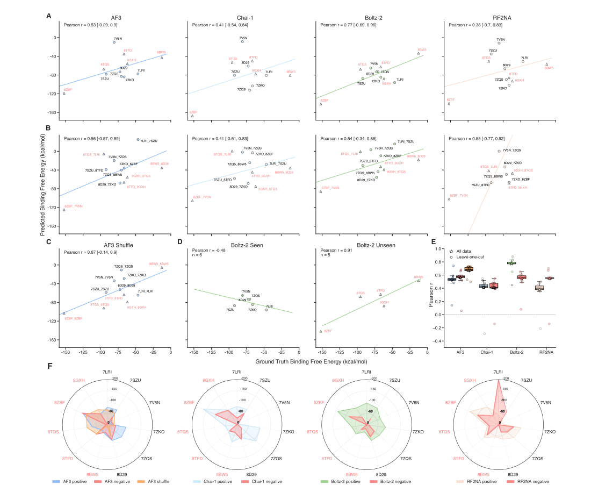
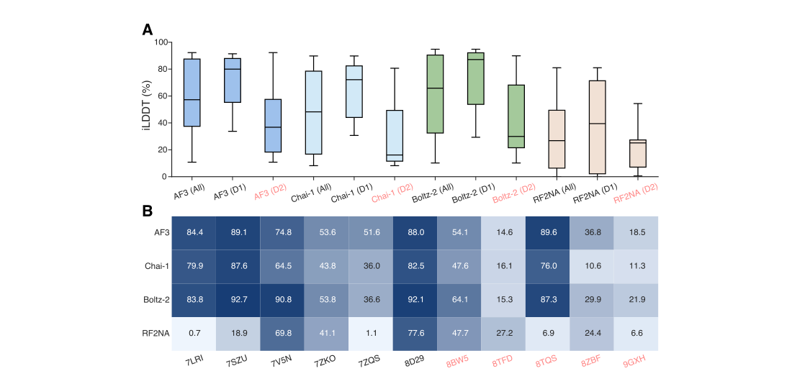
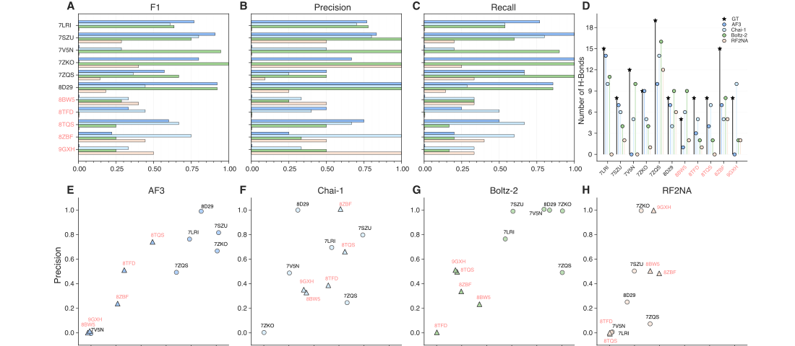
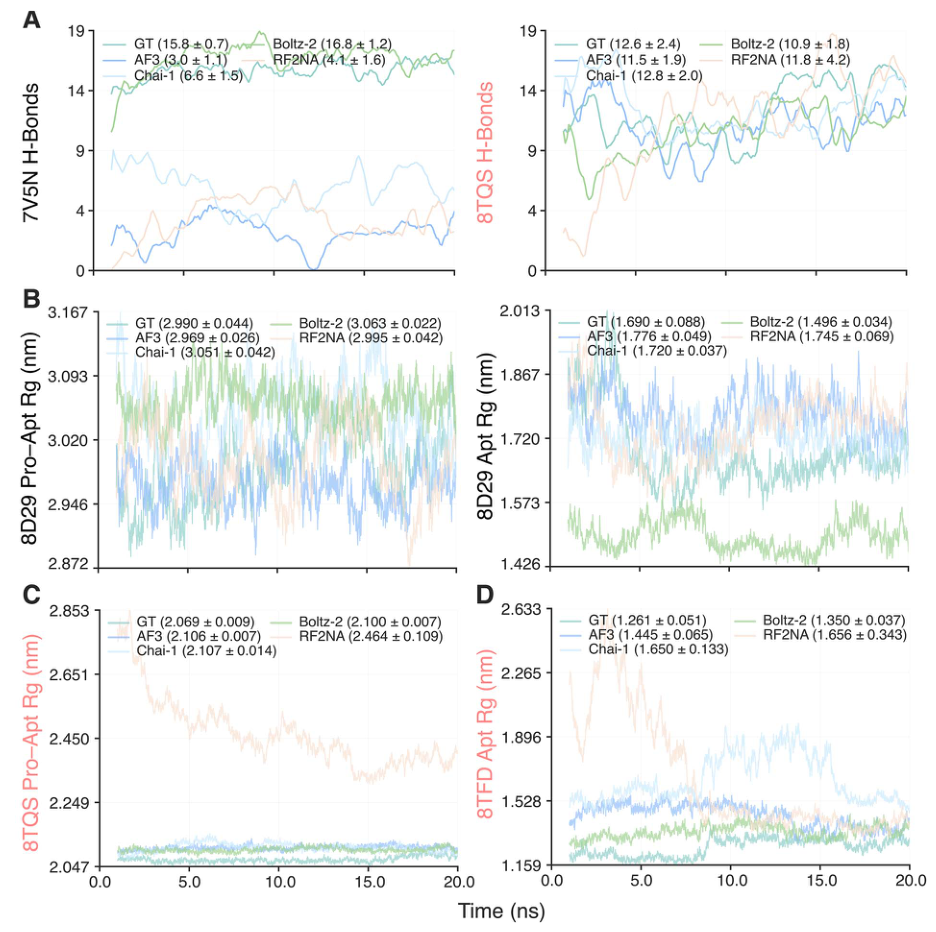
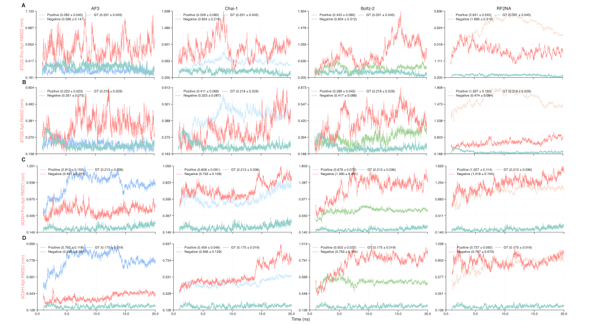
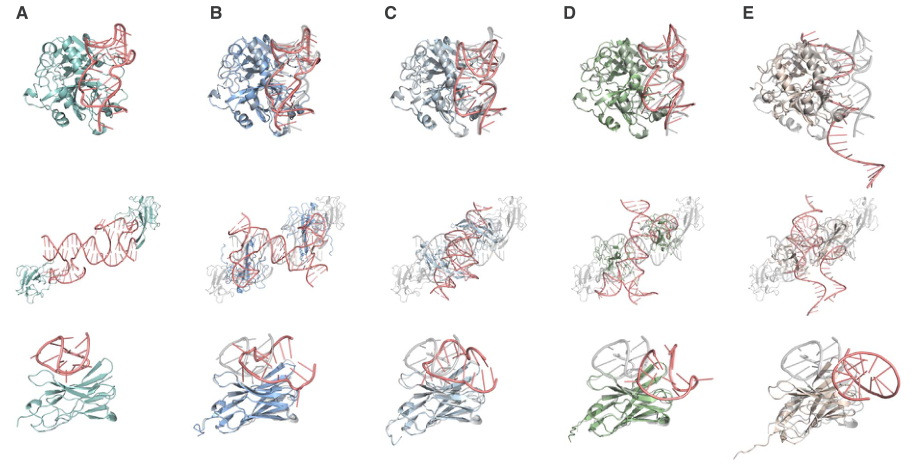
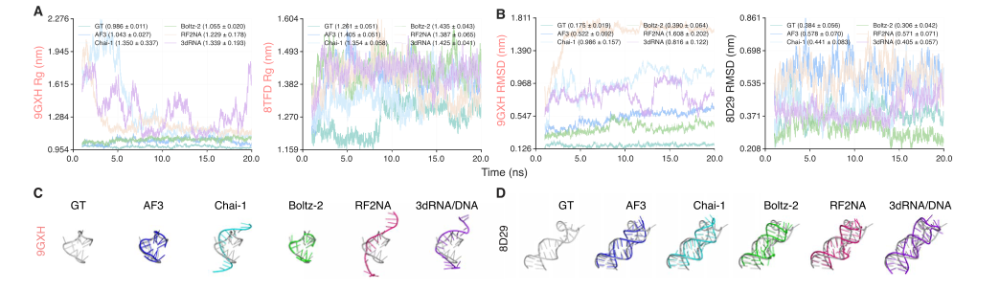
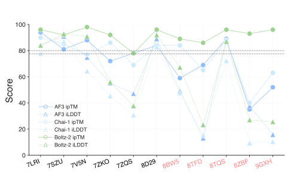
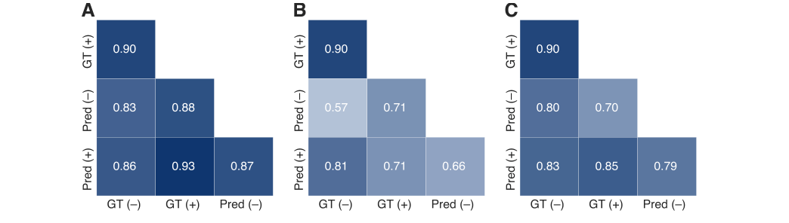

# Comprehensive evaluation of artificial intelligence-empowered approaches for protein–aptamer complex prediction

### Link: [full article](https://doi.org/10.1093/bib/bbag206)

Authors: Jiani Zhao, Kha Tram, Hongbin Yan, Yifeng Li

Briefings in Bioinformatics, May 1, 2026

---
**Overview**

Aptamers are single-stranded DNA or RNA molecules about 15–100 nt long, regarded as highly promising nucleic acid drugs because of their high affinity, high specificity and low immunogenicity. However, **when four major AI structure prediction models, AlphaFold3, Chai-1, Boltz-2 and RF2NA, were systematically applied to 11 protein–aptamer complexes, a worrying phenomenon emerged: pairing a protein with a completely unrelated aptamer, or even randomly shuffling the aptamer sequence, still lets the models generate 'complexes' that remain stable in molecular dynamics simulations, with favorable binding energies and persistent hydrogen bonds**. In other words, these models are already good at answering 'how do I assemble two chains into a plausible-looking complex', but cannot yet answer 'do these two molecules actually bind specifically'.

## Part 1: Research Question

AI-driven protein structure prediction has made breakthrough progress in recent years: from AlphaFold2 to AlphaFold3, Chai-1 and Boltz-2, models can now handle complexes of many types, including proteins, nucleic acids, small molecules and ions. But protein–aptamer systems pose unique challenges for these models. Aptamers are functional nucleic acids selected by SELEX (systematic evolution of ligands by exponential enrichment); they fold into specific 3D structures and bind target proteins with nanomolar affinity, which is why they are often called 'nucleic acid antibodies'. Yet publicly available protein–aptamer complex structures are extremely scarce (far fewer than protein–protein or protein–ligand structures), aptamers themselves are highly flexible with very different free and bound conformations, and special secondary structures such as G-quadruplexes depend on precise coordination by ions such as K⁺ and Mg²⁺. The more fundamental issue is that structure prediction models are trained to 'take these chains and assemble them into a plausible complex', whereas what aptamer drug design really needs is to judge 'will this particular aptamer sequence bind this particular protein specifically', and these are two entirely different questions.

The authors built the most systematic protein–aptamer structure prediction benchmark to date. They collected 11 experimentally solved protein–aptamer complexes from the PDB (all solved before 30 September 2021, to minimize the chance that AF3, Chai-1 and RF2NA saw the test structures directly during training), covering a range of target proteins including HIV-1 reverse transcriptase–DNA aptamer, human thrombin–DNA aptamer (including a G-quadruplex conformation), SARS-CoV-2 nucleocapsid protein–DNA aptamer, the transferrin receptor and nanobodies. To rigorously test whether the models had learned sequence-specific recognition, the authors carefully designed two kinds of negative controls.

## Part 2: Methodology: Benchmark design: positives, mismatches and sequence shuffling

The benchmark evaluates four deep learning models and one template-based method. AlphaFold3 (AF3) uses a diffusion model to predict proteins, nucleic acids, ligands and ions in a unified way. Chai-1 builds on the AF3 architecture, adds protein language model representations and supports contact constraints. Boltz-2 supports structure-controllable generation and has an affinity prediction module. RoseTTAFold2NA (RF2NA) is designed specifically for protein–nucleic acid systems and models them with rigid-body frames and torsion angles. 3dRNA/DNA is a template assembly method that splits a nucleic acid into secondary structure elements and then stitches together a 3D structure from known templates. For the four deep learning models, 25 predicted structures were generated for each protein–aptamer combination (5 random seeds × 5 diffusion samples; 25 independent predictions for RF2NA), and the two highest-confidence structures were subjected to 20 ns all-atom molecular dynamics (MD) simulations to assess structural stability and interface quality.

**(A)** Measuring the geometric accuracy of predicted interfaces with iLDDT (interface local distance difference test), Boltz-2 performs best overall (median 83.8 in the All group), followed by AF3 (84.4), with Chai-1 third (79.9) and RF2NA weaker (0.7). But a key piece of context is that **6 of the 11 test complexes may appear in Boltz-2's training set** (training data cutoff 1 June 2023). Looking only at the 5 complexes absent from the training set (the D2 subset), iLDDT drops markedly for all models: Boltz-2 falls from 92.1 to 36.6 and AF3 from 51.6 to 74.8 (AF3 overtakes Boltz-2 on D2), indicating that the models' ability to generalize to unseen protein–aptamer complexes remains limited. **(B)** A heatmap further shows each model's median iLDDT on each complex; complexes such as 8TFD, 8ZBF and 9GXH are challenging for all models.

The design of the negative controls is the most important experimental strategy in this study. **Mismatched negatives**: each protein is paired with the aptamer from another complex (for example, HIV-1 reverse transcriptase paired with the thrombin aptamer), while avoiding reassigning an aptamer to a homologous protein, so that the negatives are genuinely functionally unrelated combinations. **Sequence-shuffled controls** (AF3 only): the aptamer's length and base composition (overall proportions of A, T, G and C) are kept unchanged while the nucleotide order is randomly shuffled, with at least 80% of positions required to differ from the original sequence. If the models had truly learned information about base order and binding motifs, the structures predicted from shuffled sequences should be markedly worse than those from native sequences on metrics such as binding energy, pocket occupancy and interfacial hydrogen bonds.

## Part 3: Key Figure Analysis

### Figure 1: Correlation of binding free energies

**What this figure asks:** Do binding free energies computed from model-predicted structures correlate with the experimental values? Can positive and negative samples be told apart?

{: width="1100" height="902" loading="lazy" decoding="async"}

*Figure 1. Correlation of ΔG_bind between predicted and experimental structures. (A) Positives, (B) mismatched negatives, (C) AF3 shuffled-sequence controls; the x-axis is the ΔG_bind of the experimental structure. (D) Boltz-2 split into training-set and non-training-set complexes. (E) Leave-one-out stability. (F) Radar chart.*

* **Panel A**: among positives, Boltz-2 has Pearson r = 0.77, AF3 0.53, Chai-1 0.41 and RF2NA 0.38, so on the surface the models seem to capture the trend in binding strength.
* **Panels B and C are the key counterevidence**: after mismatching proteins with unrelated aptamers, the correlation barely drops (AF3 0.56→0.54); **after AF3 fully shuffles the sequence, r actually rises to 0.67**, higher than with the native sequence. This suggests that the correlation comes mostly from global physicochemical quantities such as protein size, aptamer length and surface charge, rather than genuine sequence-specific recognition.
* **Panels D–F**: the 6 Boltz-2 training-set complexes show a negative correlation (−0.48), while the 5 outside the training set reach 0.91, showing that the correlation is extremely sensitive to sample composition; under leave-one-out, each model's r fluctuates sharply (there are only 11 samples), and the radar chart further shows that energies cannot separate true from false pairs.

### Figure 2: Interface geometric accuracy (iLDDT)

**What this figure asks:** How accurate is the interface geometry predicted by the four models? Does it hold on unseen complexes?

{: width="1100" height="516" loading="lazy" decoding="async"}

*Figure 2. iLDDT of predicted interfaces. (A) Distribution of each model's iLDDT across all complexes. (B) Heatmap of each model's median iLDDT on each complex.*

* **Panel A**: overall, the median iLDDT is 83.8 for Boltz-2, 84.4 for AF3 and 79.9 for Chai-1, with RF2NA very weak. But of the 11 complexes, **6 may be in Boltz-2's training set**; looking only at the 5 outside it (the D2 subset), all models drop sharply, with Boltz-2 falling from 92.1 to 36.6, at which point AF3 overtakes it: generalization to unseen complexes is still limited.
* **Panel B**: the per-complex heatmap shows that 8TFD, 8ZBF, 9GXH and others are hard for every model.

### Figure 3: Interfacial hydrogen bonds: the right number, not necessarily the right positions

**What this figure asks:** How many true interfacial hydrogen bonds can the models recover? How far apart are precision and recall?

{: width="1100" height="480" loading="lazy" decoding="async"}

*Figure 3. Interfacial hydrogen bond analysis. (A–C) F1, precision and recall. (D) Comparison of total hydrogen bond counts. (E–H) Per-complex precision scatter plots for each model.*

* **Panels A–C**: AF3, Chai-1 and Boltz-2 recover a fair number of true hydrogen bonds on some complexes (7SZU, 7V5N, 7ZKO), but the differences between systems are huge, and RF2NA is generally low. **Panel D**: experimental structures have 3–18 interfacial hydrogen bonds per complex, and **a similar total does not mean the right identities**: of 10 predicted hydrogen bonds, perhaps only 5 coincide with the experiment, while the other 5 are 'invented' by the model.
* **Panels E–H**: per-complex precision fluctuates enormously; for example, AF3 is close to 1.0 on 8D29, only about 0.25 on 8ZBF and almost zero on 8BW5, and Boltz-2's precision on 8TFD, outside its training set, is near zero. Success is highly concentrated in specific combinations, with little generalization across systems.

### Figure 4: Hydrogen bonds and radius of gyration in MD

**What this figure asks:** Over a 20 ns simulation, are the interfacial hydrogen bonds and overall size of the predicted complexes stable?

{: width="936" height="932" loading="lazy" decoding="async"}

*Figure 4. Hydrogen bond and radius of gyration (Rg) curves over 20 ns of MD (counted from 1 ns to exclude initial equilibration). (A) Interfacial hydrogen bond curves for 7V5N and 8TQS. (B–D) Rg curves for 8D29, 8TQS and 8TFD, with mean ± standard deviation in parentheses.*

Each curve shows one model's behavior over the whole trajectory. The number of interfacial hydrogen bonds in **Panel A** stays steady throughout the simulation, and the Rg in **Panels B–D** is essentially a flat horizontal line, showing that the predicted complexes do not fall apart in MD and keep a stable size. That is exactly the problem: **even mismatched and shuffled-sequence combinations can produce such stable 'complexes'**, so MD stability by itself does not prove that the binding is real.

### Figure 5: Aptamer RMSD in MD

**What this figure asks:** How far does the aptamer drift during simulation, relative to the protein and when simulated alone? Do positive and negative samples differ?

{: width="1044" height="572" loading="lazy" decoding="async"}

*Figure 5. Aptamer RMSD over 20 ns of MD. (A, C) Aptamer RMSD relative to the protein backbone within the complex. (B, D) RMSD of the aptamer simulated alone. Curves show the GT and positive predictions, with mismatched negatives in red.*

The four columns are the four models. **Panels A and C** show aptamer RMSD relative to the protein backbone, and **Panels B and D** show RMSD when the aptamer is taken out and simulated alone. In most systems, the GT and positives (bluish/green) have lower, steadier RMSD, while **the red mismatched negatives drift more**, but the two distributions overlap heavily, and no threshold cleanly separates true from false pairs.

### Figure 6: Structural comparison of representative complexes

**What this figure asks:** Laying the four models' predictions next to the experimental structures, where does the aptamer part go wrong?

{: width="916" height="476" loading="lazy" decoding="async"}

*Figure 6. Representative protein–aptamer complexes (8TQS, 8ZBF, 9GXH). For each complex: (A) experimental reference, (B) AF3, (C) Chai-1, (D) Boltz-2, (E) RF2NA.*

The aptamer is in red and the protein in color/gray. Comparing the columns makes it easy to see that **the protein part is generally predicted well, and the main errors are concentrated in the aptamer**: the folding direction, the landing position on the interface and special structures such as G-quadruplexes are often misplaced. The aptamer's high flexibility and conformational diversity are a difficulty shared by all models.

### Figure 7: Predicting aptamers on their own

**What this figure asks:** How do the models perform when predicting the aptamer structure alone, without the protein?

{: width="1044" height="302" loading="lazy" decoding="async"}

*Figure 7. Rg, RMSD and representative structures from 20 ns MD of aptamer-only structures. Aptamer sequences are taken from the experimental complexes, and aptamer-only structures are generated separately with each of the five models.*

* The Rg/RMSD curves in **Panels A and B** show that, away from the protein, aptamer conformations are less stable and differ more between models; the representative structures in **Panels C and D** (GT and the five models side by side) show that each model produces a different single-strand fold. This confirms that the root of the problem lies in the flexibility of the aptamer itself, not only in the complex interface.

### Figure 8: Is the models' self-reported confidence reliable

**What this figure asks:** Can confidence scores such as ipTM / iLDDT be used to judge whether a prediction is correct?

{: width="512" height="304" loading="lazy" decoding="async"}

*Figure 8. ipTM and iLDDT of the predicted structure for each complex (red labels mark complexes outside the training set).*

The x-axis lists the complexes, and the lines show each model's ipTM and iLDDT. **Boltz-2 still assigns very high ipTM to predictions for 8TFD, 8ZBF and 9GXH whose interfaces are actually far off**, a clear case of overconfidence; AF3's and Chai-1's ipTM agree better with iLDDT overall, but confidence alone still cannot decide right from wrong. When actually using models to screen aptamers, you cannot rely only on the scores they report about themselves.

### Figure 9: The effect of ions on binding energy

**What this figure asks:** Once ions are included explicitly, does the binding-energy relationship between positive and negative samples become separable?

{: width="1044" height="296" loading="lazy" decoding="async"}

*Figure 9. Cross-correlation of ΔG_bind for nine complexes. (A–C) AF3, Chai-1 and Boltz-2, respectively. '+' and '−' indicate with and without ions, and 'Pred' denotes predicted structures.*

The three heatmaps compare the pairwise correlations of ΔG_bind for GT/predicted structures with and without ions. After experimental ions are included explicitly, **AF3's and Chai-1's iLDDT does not improve noticeably, and Boltz-2 improves only slightly**; moreover, ions are often misplaced, put on the opposite side from their experimental positions or abnormally clustered, and Chai-1 sometimes does not even keep the input ions in the final structure. The models' understanding of ion-mediated stabilization of aptamer folding is still very limited.

## Part 4: Key Contributions

The most important conclusions of this paper can be understood at three levels. First: AF3 and Boltz-2 can already generate geometrically fairly accurate interface structures for some protein–aptamer complexes; the protein part is usually more accurate than the aptamer part, and the main sources of error are concentrated in the aptamer's folding direction, its position on the interface and the recovery of special structures such as G-quadruplexes; the high flexibility and conformational diversity of aptamers remain the core difficulty for all current models. Second: **mismatched negatives and sequence-shuffled controls likewise show favorable binding energies, persistent pocket occupancy and stable hydrogen bonds over 20 ns of MD**: the models can generate 'stable wrong complexes' for combinations that biologically should not bind. The authors define pocket occupancy as the fraction of aptamer atoms in each frame that lie within 4.5 Å of the protein binding interface, and the results show that some mismatched combinations even have higher pocket occupancy than the positives, indicating that an aptamer lingering on the protein surface may merely reflect nonspecific electrostatic adsorption between nucleic acid and protein. Third: the models' internal confidence (ipTM) is likewise unreliable. Boltz-2 still gives extremely high ipTM values to predictions for 8TFD, 8ZBF, 9GXH and others whose actual interfaces are far off, showing clear overconfidence; AF3's and Chai-1's ipTM agree better with iLDDT overall, but cannot serve on their own as a criterion for prediction correctness either.

## Part 5: Limitations and Outlook

The test set has only 11 complexes, so statistical power is limited and bootstrap confidence intervals are generally wide; MM/GBSA includes no entropy correction, and the MD uses a uniform NaCl ionic environment rather than reproducing the system-specific Mg²⁺ or K⁺ conditions; Boltz-2's training-set overlap makes its results hard to compare fairly; and 20 ns of simulation may be too short to observe the dissociation of incorrect structures. In addition, the authors ran an extra test on 9 complexes containing experimental ions, explicitly adding the corresponding ion types and numbers: AF3's and Chai-1's iLDDT did not improve significantly, Boltz-2 improved only slightly but statistically significantly, and ion positions were often predicted incorrectly, with some ions placed on the opposite side from their experimental positions, some abnormally clustered, and Chai-1 in a few systems not even retaining the input ions in the final structure. Current models' understanding of ion-mediated stabilization of aptamer folding is still very limited. Even so, the authors recommend that when AI models are actually used to screen aptamers, negative controls with shuffled sequences and non-target proteins must be included, the relative performance of native candidates versus negative controls should be compared, and specific interface contacts (base–residue interactions, salt bridges and base stacking) should be checked; in the end, specificity still has to be verified by SPR, BLI, ITC or competitive binding experiments.

## About the Corresponding Author

Yifeng Li holds a joint appointment in the Department of Computer Science and the Department of Biological Sciences at Brock University in Canada. Li's research focuses on bioinformatics and the application of artificial intelligence to nucleic acid drug design, with a long-standing interest in systematic benchmarking and method development for deep learning approaches in biomolecular structure prediction and drug discovery, and the team spans three disciplines: computer science, chemistry and biological sciences. First author Jiani Zhao, in the Department of Computer Science at Brock University, carried out the core work of dataset construction, multi-model evaluation, molecular dynamics simulation and statistical analysis. Collaborator Kha Tram is from the Canadian biotechnology company Cytodiagnostics Inc. and brings industry experience in aptamer applications. Hongbin Yan holds appointments in the Department of Chemistry and the Department of Biological Sciences at Brock University and provided disciplinary support in chemistry and structural biology. Brock University is located in St. Catharines, Ontario, Canada.

## Citation

Zhao, J., Tram, K., Yan, H., & Li, Y. (2026). Comprehensive evaluation of artificial intelligence-empowered approaches for protein–aptamer complex prediction. Briefings in Bioinformatics, 27(3), bbag206. https://doi.org/10.1093/bib/bbag206
