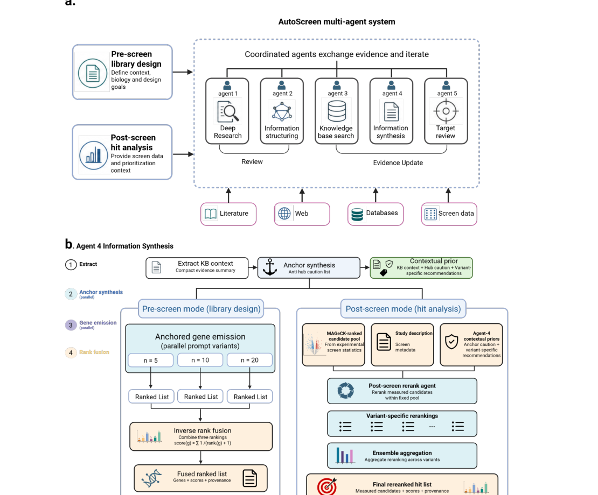
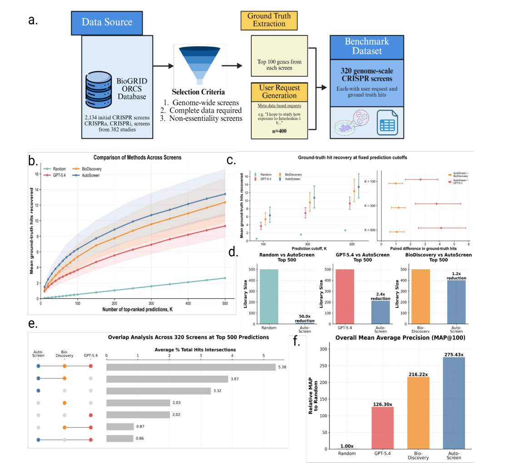
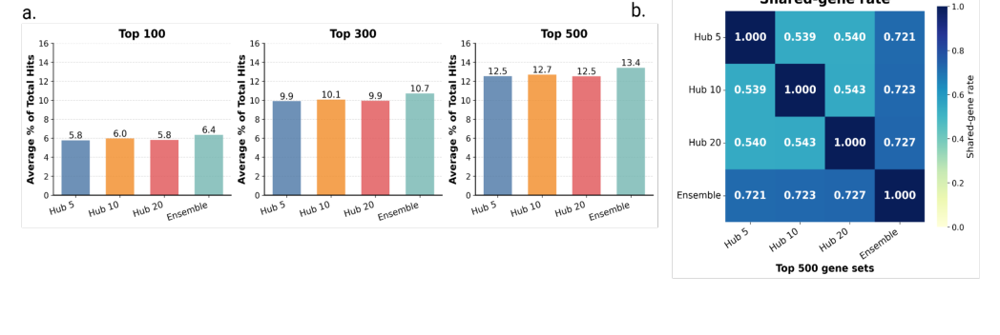
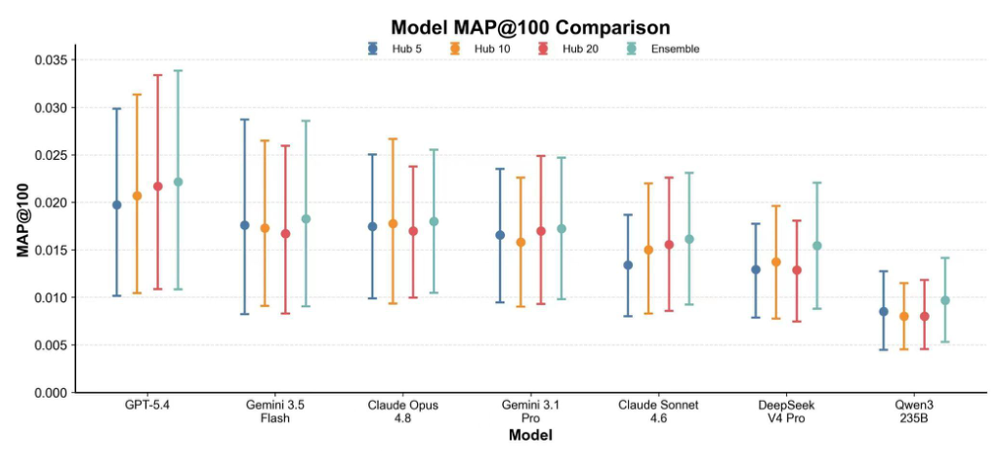
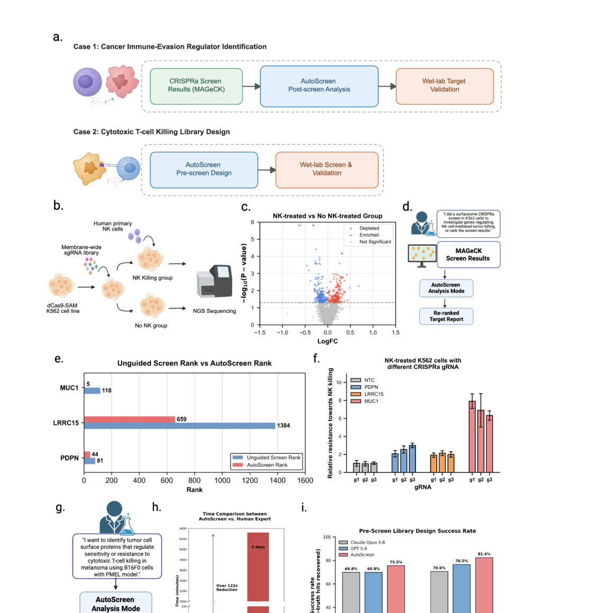
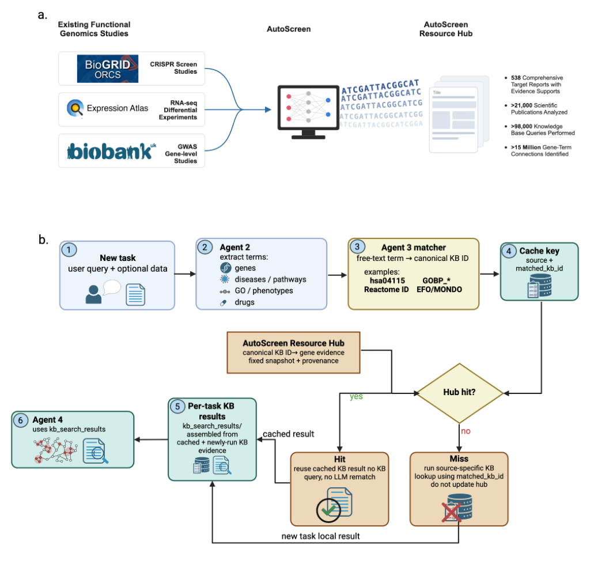

# AutoScreen: AI Co-Scientist System for Target Discovery in Functional Genomics

### Link: [full article](https://doi.org/10.64898/2026.09.06.749678)

Authors: Yuanhao Qu, Xufeng Liu, Xiaotong Wang, ..., Le Cong

bioRxiv, September 10, 2026

---
**Overview**

A CRISPR screen can produce hundreds or thousands of candidate genes at once, but deciding "which one to validate first" is still a time-consuming step that depends heavily on literature integration and expert experience. AutoScreen builds a pipeline of five specialized AI agents that automatically searches 26 biomedical databases, dynamically removes large language models' preference for "famous genes," and produces a traceable ranking of candidate genes through multi-configuration fusion. Across a benchmark of 320 CRISPR screens, it improves hit recovery by about 19% over general-purpose large models; in NK-cell killing experiments, it successfully lifted MUC1, PDPN, and LRRC15 from low ranks into priority validation positions, with confirmation in wet-lab experiments.

## Part 1: Research Question

The bottleneck in high-throughput functional genomics—CRISPR screens, RNA-seq, GWAS—has shifted from "getting the data" to "picking the right genes from the data." A single genome-wide CRISPR screen often yields hundreds of statistically significant candidates, and researchers still have to go through the literature one by one, inspect pathways, and check expression and druggability before deciding the order of follow-up validation.

Asking a large language model to recommend genes directly runs into a fundamental problem: **LLMs tend to repeatedly recommend "famous genes" such as TP53, AKT1, and MTOR**. These hub genes are genuinely important, but they are not necessarily directly relevant to the specific phenotype of the experiment at hand. This is what is known as fame bias.

AutoScreen tries to solve two problems at once: before the experiment (Pre-screen), designing a focused candidate library according to the research goal—useful when a genome-wide screen is impossible, primary cells are limited, or combinatorial perturbation experiments must be designed; and after the experiment (Post-screen), re-ranking hit genes by combining statistical results with external knowledge—within the fixed set of genes already measured, combining the P values and fold changes from tools such as MAGeCK with literature evidence, pathway information, and clinical data to redetermine the order of follow-up validation.

## Part 2: Methodology: System architecture: a pipeline of five agents

AutoScreen's core idea is to decompose "let one model guess genes" into a structured evidence-integration pipeline.

**Agent 1 (Deep Research)** rewrites the user's research description into search queries and retrieves Google Scholar literature, web information, and the model's internal knowledge in parallel. It summarizes each source separately, merges them into research background, fact-checks the sentences in the summaries against evidence, and stores provenance such as title, URL, authors, and publication date. The goal at this stage is to understand the biological context of the experiment, not to output genes directly.

**Agent 2 (Information Restructure)** breaks free text into eight classes of standardized biological entities—cell lines, genes, pathways, GO terms, diseases, phenotypes, drugs, and cellular components. For example, "melanoma cells resist NK-cell killing" is decomposed into the biological system A375 melanoma, the phenotype NK-cell resistance, and pathways such as immune evasion and cell-surface signaling, which are mapped to standard identifiers in HGNC, Reactome, KEGG, MONDO, EFO, and so on. By default the system also runs two rounds of critique and revision.

**Agent 3 (Knowledge Base Search)** is the external knowledge retrieval layer, running **26 subagents** that query in parallel: pathway and ontology resources (KEGG, Reactome, WikiPathways, MSigDB Hallmark, Gene Ontology), molecular interaction resources (STRING, Ensembl paralogs, COXPRESdb), disease and clinical evidence resources (OMIM, ClinGen, ClinVar, Open Targets, TCGA), cancer driver resources (IntOGen), and drug information resources (PubChem, RxGrid), among others. In Post-screen mode, it also integrates the user's own CRISPR screen results and RNA-seq differential expression data. The final output for each gene retains the specific source, the matching term, the raw score, and metadata, rather than merely a flag saying "the model thinks this is important."

**Agent 4 (Information Synthesis)** is the most important innovation. It first dynamically generates a set of "anti-hub anchors" for the current task: it identifies classic hub genes that the large model is likely to over-recommend but that are not specific enough for the current experiment, and puts them into the prompt as a soft constraint. The system generates candidate gene rankings independently with three anchor lengths (Hub 5, Hub 10, Hub 20), then merges them into the final list by inverse-rank fusion.

**Agent 5 (Target Review)** adds experimental actionability annotations to the candidate genes: expression in the target cell line, cell dependency from DepMap, druggability from DGIdb, and literature support. This information serves as labels rather than hard filters, and the final report preserves the complete evidence chain.

## Part 3: Key Figure Analysis

### Figure 1: How the five agents work together

**What this figure asks:** How do AutoScreen's five agents collaborate all the way from literature interpretation to target ranking?

{: width="1110" height="920" loading="lazy" decoding="async"}

*Figure 1. AutoScreen system architecture. (a) The collaborative workflow of the five agents, supporting both pre-screen library design and post-screen re-ranking; (b) the workflow in which Agent 4 generates rankings with multiple anchor configurations and fuses them.*

* **Panel a**: "let one model guess genes" is broken into a pipeline—Agent 1 rewrites the research description into search queries and retrieves literature and web content in parallel; Agent 2 breaks free text into eight classes of standardized entities such as cell lines, genes, and pathways; Agent 3 runs **26 subagents** in parallel against databases such as KEGG, STRING, and Open Targets; Agent 5 adds actionability annotations such as expression, dependency, and druggability.
* **Panel b** is the key piece, Agent 4: it first dynamically generates a set of "anti-hub anchors," applying a **soft constraint** that tamps down the famous genes LLMs love to recommend repeatedly (TP53, AKT1, MTOR). The effect is direct: in an autophagy screen it promotes the actual executing machinery WIPI2, ATG2A, and ATG9A into the top 15 rather than the generic MTOR; in a diphtheria toxin screen it ranks the key enzymes DPH1–DPH7 at positions 3–19.

### Figure 2: A benchmark of 320 CRISPR screens

**What this figure asks:** On 320 CRISPR screens, how good are AutoScreen's hit recovery and ranking precision?

{: width="1120" height="1020" loading="lazy" decoding="async"}

*Figure 2. The 320-CRISPR-screen benchmark. (a) Data construction workflow; (b–c) hit recovery as a function of candidate library size; (d) library size efficiency; (e) overlap of hits across methods; (f) overall MAP@100 precision.*

From the 2,134 screens in BioGRID ORCS, 320 were selected using three criteria—genome-wide scale, complete metadata, and non-essentiality—and the top-100 genes from each screen's original analysis were taken as ground truth, with each method asked to recommend genes from the research goal description alone.

* **Panel b–f**: in the top 100, **AutoScreen recovers 6.4% of true hits**, ahead of BioDiscovery at 5.4% and GPT-5.4 at 3.8% (a relative improvement of about 19%); MAP@100 reaches 275 times the random baseline. To recover the same number of hits as AutoScreen's top 500, a random approach would need a library 50 times larger and GPT-5.4 one 2.4 times larger.

### Figure 3: Multi-configuration fusion improves recovery

**What this figure asks:** Why use three anchor lengths and then fuse them? Do they find the same candidates?

{: width="1048" height="352" loading="lazy" decoding="async"}

*Figure 3. Ensemble fusion across hub-list configurations. (a) Validated-hit recovery of single configurations and the fused ranking at different numbers of candidates. (b) Heatmap of pairwise shared-gene rates among the top-500 gene sets of the three configurations.*

A shorter anchor list (Hub 5) is more conservative, while a longer one (Hub 20) moves more aggressively away from hub genes. **Panel a** shows that the three configurations have similar recovery, but in the shared-rate heatmap of **Panel b** their top-500 lists **overlap only about 54% pairwise**—indicating that they explore different but equally valuable candidate spaces. Inverse-rank fusion (Ensemble) boosts the scores of genes that rank highly in several configurations and achieves the best recovery.

### Figure 4: Performance with different large-model backends

**What this figure asks:** Does AutoScreen's advantage depend on one particular large model, or does it come from the framework itself?

{: width="1024" height="480" loading="lazy" decoding="async"}

*Figure 4. Dot-and-line plot of MAP@100 for seven inference backends on the 207 benchmark screens common to all configurations, with each backend run in the Hub 5 / Hub 10 / Hub 20 and Ensemble configurations.*

The horizontal axis holds seven backends including GPT-5.4, Gemini, Claude, DeepSeek, and Qwen3, with four configurations of MAP@100 plotted per backend. Stronger models (GPT-5.4) are higher overall, but **the multi-anchor ensemble (cyan) generally outperforms single configurations on both reasoning and non-reasoning models**. This indicates that the performance gain comes mainly from the retrieve–anchor–fuse framework rather than from any single large model.

### Figure 5: Experimental validation in immune evasion

**What this figure asks:** Can AutoScreen's predictions be validated in wet-lab experiments? How do post-screen and pre-screen each fare?

{: width="1130" height="1160" loading="lazy" decoding="async"}

*Figure 5. Validation in cancer immune evasion. (a–f) post-screen: re-ranking and wet-lab experiments for an NK-cell killing screen. (g–i) pre-screen: prospective candidate library design for T-cell killing.*

**Post-screen (a–f)**: a K562 surfaceome CRISPRa screen produced 317 candidates, and AutoScreen's re-ranking moved **MUC1 from rank 118 to rank 5**, PDPN from 81 to 44, and LRRC15 from 1384 to 659. Wet-lab experiments with three independent sgRNAs confirmed that activating all three genes significantly increases K562 resistance to NK-cell killing.

**Pre-screen (g–i)**: on two T-cell killing tasks for which no screen data were provided, 500 candidates were designed from the research question alone, and the subsequent real screens confirmed that they **cover 77.1% of consensus hits on average**, ahead of Claude and GPT-5.4; the whole design takes 35.5 minutes on average, more than 120 times faster than roughly 3 days of manual work.

### Figure 6: From a single run to the Resource Hub

**What this figure asks:** How can AutoScreen be turned from a one-off run into a reusable, scalable resource?

{: width="1024" height="974" loading="lazy" decoding="async"}

*Figure 6. Building and using the AutoScreen Resource Hub. (a) A pre-computed resource library integrating public CRISPR (BioGRID ORCS), transcriptomic (Expression Atlas), and GWAS (UK Biobank) data. (b) The hit/miss workflow keyed on "database source + canonical identifier."*

Running the full pipeline over more than 500 public functional genomics datasets accumulated 538 target reports, more than 21,000 papers, 98,000 knowledge base queries, and 15 million gene–term links. The key design in **Panel b**: stable background knowledge (that a given gene belongs to a given pathway) is reused via cache keys, but **the final gene ranking is still regenerated by Agent 4 for the current experiment**, ensuring that rankings differ across experimental contexts.

## Part 4: Key Contributions

**Post-screen validation**: in a surfaceome CRISPRa screen in K562 leukemia cells, the authors activated cell-surface proteins and co-cultured the cells with primary human NK cells, and MAGeCK identified 317 significant candidates. After AutoScreen re-ranked the full list:

**MUC1**: from rank 118 up to **rank 5** (a cell-surface glycoprotein that can form an immune barrier)

**PDPN**: from rank 81 up to rank 44 (a tumor surface glycoprotein involved in immune regulation)

**LRRC15**: from rank 1384 up to rank 659 (associated with the tumor microenvironment)

Wet-lab validation with multiple independent sgRNAs showed that activating all three genes significantly increases K562 resistance to NK-cell killing. The experiments co-cultured primary human NK cells with K562 at an E:T ratio of 2:1 for 24 hours, with cell survival monitored in real time by IncuCyte. Three independent gRNAs were used per gene with consistent results, reducing the chance of off-target false positives. In addition, in an independent CRISPRa screen in A375 melanoma, AutoScreen also raised CEACAM5 (143→38) and CEACAM6 (155→26), using interaction networks and clinical evidence to recognize that members of this family may jointly contribute to NK-cell immune evasion.

**Prospective pre-screen validation**: in two T-cell killing tasks for which no screen data were supplied (B16F0–PMEL and MC38–OT-I), AutoScreen designed 500 candidate genes knowing only the research question, and the subsequent real CRISPR screens confirmed that **AutoScreen covers 77.1% of consensus hits on average**, ahead of Claude Opus 4.8 (69.8%/70.6%) and GPT-5.4 (69.8%/76.5%). The entire design process takes only 35.54 minutes on average, more than 122 times shorter than the roughly 3 days required by a human expert.

**Resource Hub: from a single run to a scaled resource**

The authors also extended AutoScreen into a pre-computed resource library—running the full pipeline over more than 500 public functional genomics datasets (CRISPR data from BioGRID ORCS, transcriptomic data from Expression Atlas, and GWAS data from UK Biobank) and accumulating 538 comprehensive target reports, more than 21,000 scientific papers, 98,000 knowledge base queries, and 15 million gene–term links. The system uses "database source + canonical identifier" as the cache key, so stable background knowledge (such as a gene belonging to a pathway) can be reused, while the final gene ranking is still regenerated by Agent 4 for the current experiment, ensuring that different experimental contexts yield different rankings.

## Part 5: Limitations and Outlook

AutoScreen's core value lies in systematizing a process that was previously scattered and manual—from research question to structured biological concepts, to multi-database retrieval, to task-specific debiasing, and then to multi-ranking fusion and experimental actionability review. Every step preserves a complete evidence chain, making the results auditable and traceable. The language model is treated as a replaceable backend in the system: the paper tests 7 different models, and the advantage of the multi-anchor ensemble holds for both reasoning and non-reasoning models, indicating that the performance gain comes mainly from the retrieve–anchor–fuse framework.

Several limitations deserve attention, though. On the 320 public benchmarks, the Deep Research Agent queries the literature and the web and may retrieve the results of the original papers, creating some risk of information leakage—the paper does prospective validation with two T-cell tasks, but performs no decontamination assessment for the public benchmarks. The absolute recovery in the top 100 is still only 6.4%, showing that predicting screen results from a description alone remains very hard. The wet-lab validation is small in scale (3 genes), and AutoScreen and the baselines do not have comparable compute budgets—it uses multiple rounds of model calls, 26 databases, and multi-configuration fusion, while the GPT-5.4 baseline is mainly single-model zero-shot generation. The underlying knowledge bases themselves remain biased toward well-studied diseases and highly cited pathways; anti-hub anchoring can reduce the preference for individual famous genes, but it may shift the bias from "recommending the single best-known gene" to "recommending the most thoroughly annotated mechanistic module in the knowledge base."

## About the Corresponding Authors

The corresponding authors of this paper include Russ Altman (Professor of Bioengineering and Genetics at Stanford University and former chair of Stanford's computing and technology school), Jure Leskovec (Professor of Computer Science at Stanford University and a pioneer in graph neural networks), Aviv Regev (Head of Research and Early Development at Genentech, previously a core member of the Broad Institute, and a pioneer of single-cell genomics), Mengdi Wang (Professor of Electrical and Computer Engineering at Princeton University, an expert in reinforcement learning and operations research), and Le Cong (Assistant Professor of Pathology and Genetics at Stanford University, an active researcher in CRISPR functional genomics). The study brings together an interdisciplinary team from institutions including Stanford University, Princeton University, MIT CSAIL, and Genentech.

## Citation

Qu, Y., Liu, X., Wang, X., Chen, M., Luo, X., Lyu, L., ... & Cong, L. (2026). AutoScreen: AI Co-Scientist System for Target Discovery in Functional Genomics. bioRxiv. https://doi.org/10.64898/2026.09.06.749678
