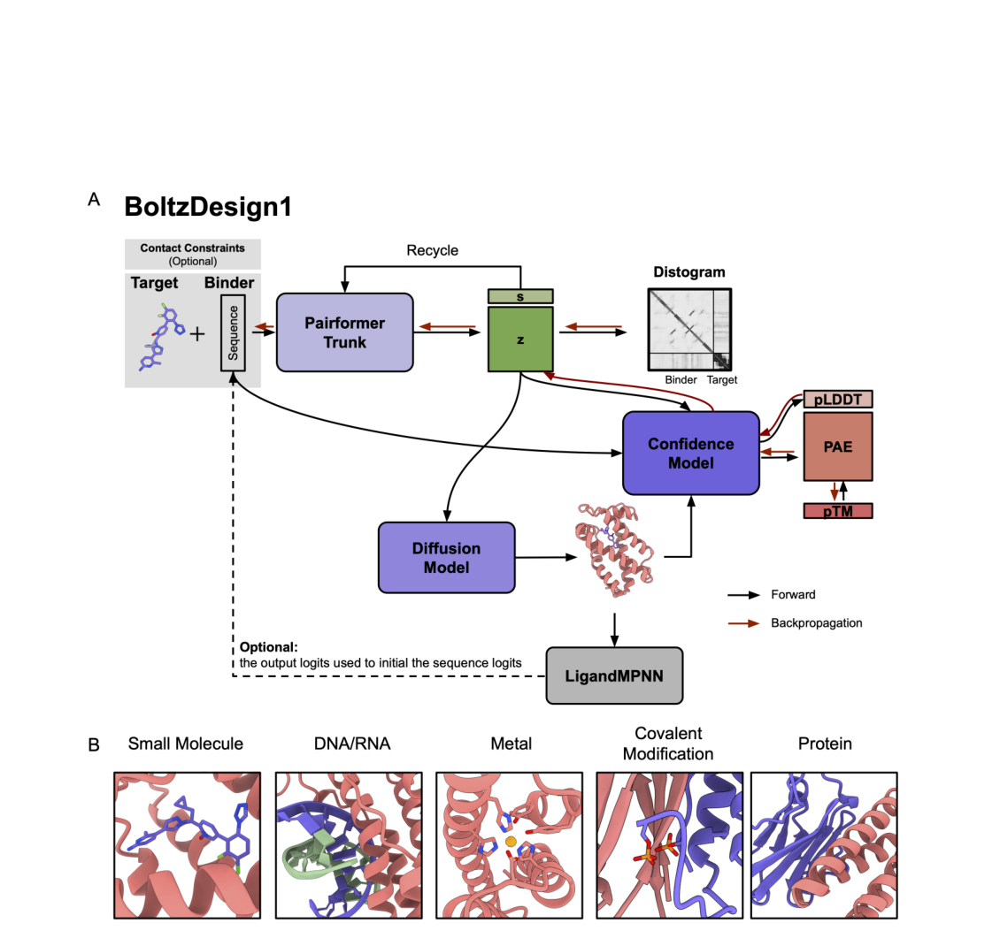
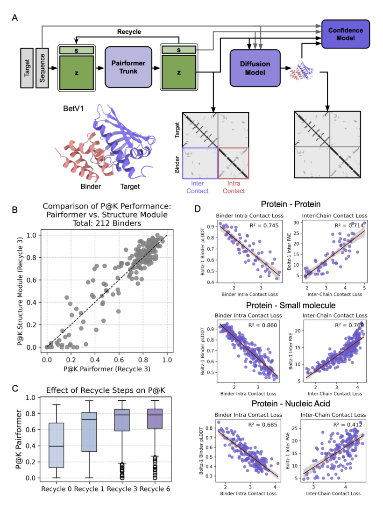
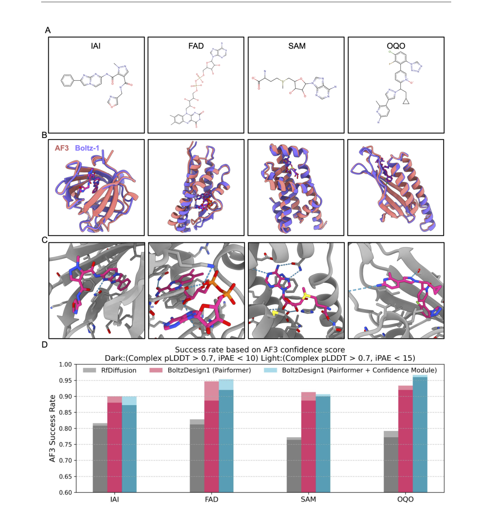
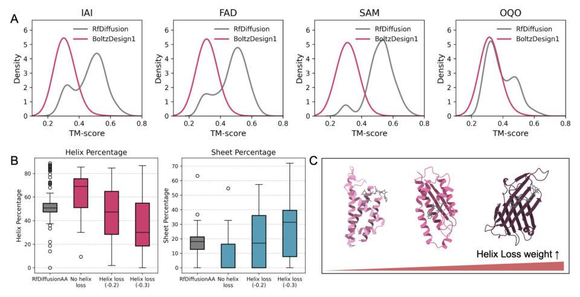
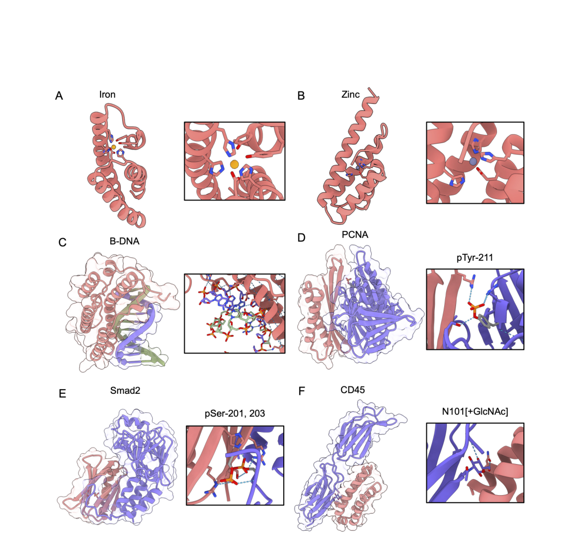

# BoltzDesign1: Inverting All-Atom Structure Prediction Model for Generalized Biomolecular Binder Design

### Link: [full article](https://doi.org/10.1101/2025.04.06.647261)

Authors: Yehlin Cho, Mateusz Pacesa, Zhe Zhang, Bruno E. Correia, Sergey Ovchinnikov

bioRxiv, April 6, 2025

---
**Overview**

The central challenge of protein binder design is this: given a target molecule, design from scratch a new protein sequence that folds stably and binds to it. Existing generative methods such as RfDiffusion require training a dedicated model, while model-inversion methods face the enormous computational cost of backpropagating through a diffusion module. BoltzDesign1 offers an elegant solution: **freeze the parameters of the all-atom structure prediction model Boltz-1 and directly optimize the distance probability distribution (distogram) produced by the Pairformer, bypassing backpropagation through the 200-step diffusion process entirely**. This makes it possible, at relatively low computational cost, to design binders for a wide range of targets including proteins, small molecules, metal ions, nucleic acids and post-translational modifications, with in silico success rates on four small-molecule benchmarks that exceed RfDiffusionAA.

## Part 1: Research Question

There are currently two main technical routes in protein binder design. The first is the **generative-model route**, represented by RfDiffusion/RfDiffusionAA: structure generation is modeled as a diffusion process, a structure prediction model is trained or fine-tuned to generate protein backbones, and then ProteinMPNN or LigandMPNN designs the sequence. Its generative power is strong, but backbone generation and sequence design are two separate stages, and a new type of target requires retraining.

The second is the **model-inversion route**, represented by BindCraft: the parameters of a structure prediction model are frozen, the protein sequence is treated as an optimizable variable, a loss is defined from metrics such as structural confidence, and gradients are backpropagated to the input sequence. BindCraft mainly inverts AlphaFold2, whose Structure Module is relatively well suited to end-to-end backpropagation.

BoltzDesign1 belongs to the second route, but the model it inverts is Boltz-1, an all-atom, multi-molecule-type structure prediction model similar to AlphaFold3 that can handle proteins, small molecules, nucleic acids, metal ions and post-translational modifications at the same time. The core obstacle is that **Boltz-1's final atomic structure is generated by a diffusion module through roughly 200 denoising steps**. Backpropagating directly through the diffusion module would mean huge memory consumption, vanishing gradients along a long chain, and the fact that one diffusion run yields only a single structural sample, so the optimization may end up overly dependent on whichever conformation happened to be sampled.

The authors' key insight is that Boltz-1's **Pairformer module** already encodes the distance probability distribution between residue pairs in the distogram, before diffusion generates any three-dimensional structure. This distribution predicts, for every residue pair, the probability of falling into each of 64 distance bins, and therefore carries rich information about geometric relationships. Optimizing this probability distribution directly bypasses the expensive diffusion process.

## Part 2: Methodology: Bypassing Diffusion and Optimizing the Distance Distribution

The BoltzDesign1 method architecture is shown in the figure above. Throughout the pipeline, black arrows indicate Boltz-1's normal prediction path and red arrows indicate the backward optimization path. The paper proposes two modes of operation:

**Mode 1: Pairformer only.** The gradient path is distogram loss → Pairformer → sequence. This is the cheapest path: no three-dimensional structure needs to be generated, and the optimization signal comes straight from the distance probability distribution.

**Mode 2: Pairformer + Confidence module.** The diffusion module still runs forward to generate three-dimensional coordinates, but a stop-gradient is applied to those coordinates (cutting off gradient propagation). The Confidence module outputs confidence metrics such as pLDDT and PAE from these coordinates and the Pairformer representations. Gradients flow back to the sequence through the Confidence module and the Pairformer, but **not through the roughly 200 diffusion steps**. One way to see it: the diffusion module 'proposes a candidate structure' and the Confidence module 'scores it', but the optimization does not track the whole generation process of that candidate.

**Loss function design**

**Intra-protein contact loss**: requires the designed protein to form stable long-range contacts (contact cutoff 14 Å), with two important contacts considered per residue. A key detail is that residue pairs with a sequence separation of &lt;9 are ignored, so the model cannot satisfy the contact requirement by simply generating a continuous helix and must instead build a meaningful long-range topology.

**Protein-target interface contact loss**: ensures that the designed protein forms a reliable interface with the target (cutoff 22 Å). For small-molecule targets, the authors found that requiring every residue to contact the ligand as much as possible from the very beginning makes the protein wrap around the small molecule excessively, producing too large a difference between the free and bound structures. They therefore adopt a 'fold first, then bind' strategy: the protein is first allowed to form a basic fold on its own, and only after secondary structure is established is the ligand introduced, with each step optimizing just the single most reliable protein-ligand contact (k=1). Although only one contact is optimized directly, making that contact highly confident usually leads the model to form other supporting interactions as well.

Sequence optimization uses a **four-stage annealing strategy** that moves gradually from continuous space to discrete amino acids. The first stage explores broadly in continuous softmax space, where each position can carry probabilities for several amino acids at once. The second stage transitions gradually through a weighted mixture of logits and softmax. The third stage lowers the temperature progressively so that the probability distribution becomes sharper and sharper. The fourth stage uses a straight-through estimator to optimize on discrete one-hot sequences: the forward pass sees a discrete sequence, while the backward pass still propagates gradients through continuous probabilities.

Once an initial sequence is obtained, LigandMPNN can optionally be used for a second round of sequence design. The paper finds that the best strategy is to **keep the BoltzDesign1 interface residues and let LigandMPNN redesign only the non-interface regions**. Supplementary experiments show that even when LigandMPNN redesigns all residues, the recovery rate of the original BoltzDesign1 sequence is higher at interface positions than at surface positions, which indicates that BoltzDesign1's interface sequences are quite sound.

## Part 3: Key Figure Analysis

### Figure 1: A Design Pipeline that Bypasses Diffusion

**What this figure asks:** How does BoltzDesign1 bypass the 200-step diffusion and design binders by optimizing the distance distribution directly?

{: width="1130" height="1070" loading="lazy" decoding="async"}

*Figure 1. The BoltzDesign1 pipeline. Black arrows show Boltz-1's normal prediction path; red arrows show the direction of loss backpropagation. s is the single representation and z is the pair representation.*

The core idea is to freeze Boltz-1 and treat the sequence as the optimizable variable. **Mode 1 uses the Pairformer only**: gradients follow distogram loss → Pairformer → sequence, no three-dimensional structure is generated at all, and the cost is lowest. **Mode 2 adds the Confidence module**: the diffusion module still runs forward to generate coordinates but with a stop-gradient, so gradients flow back only through the Confidence module and the Pairformer, never through the 200 diffusion steps.

Sequence optimization uses four-stage annealing, moving gradually from continuous softmax space to a discrete one-hot sequence (straight-through estimator). Optionally, LigandMPNN then redesigns only the non-interface residues while the BoltzDesign1 interface residues are kept.

### Figure 2: Can the Distogram Replace Confidence Scores

**What this figure asks:** Can optimizing only the Pairformer's distance distribution really reflect fold and interface quality?

{: width="820" height="1080" loading="lazy" decoding="async"}

*Figure 2. The Pairformer distogram effectively captures interactions between proteins and their targets and can serve as a proxy for confidence. (A) Architecture and the two sources of contacts. (B) P@K comparison between the Pairformer and the structure module (212 binders). (C) Effect of the number of recycling steps on P@K. (D) Correlation of contact loss with pLDDT and inter-PAE for protein, small-molecule and nucleic acid targets.*

* **Panel B**: validated on 212 successful binders from BindCraft, **76% of designs have P@K > 0.5 for Pairformer contact prediction**, meaning that more than half of the top-K highest-probability contacts match the true interface, so a reliable contact signal can be obtained without going through diffusion.
* **Panel D**: intra-protein contact loss correlates clearly with pLDDT, and interface contact loss with inter-PAE (R² reaches 0.86 for protein-small molecule). **The exception is nucleic acids** (R² only 0.412): the repetitive contacts of the DNA/RNA phosphate backbone mean that knowing there 'is a contact' is not enough, so nucleic acid design depends more on the Confidence module.

### Figure 3: Success Rates for Small-Molecule Binding Proteins

**What this figure asks:** What success rates do the designed small-molecule binding proteins achieve when refolded with AF3 / Boltz-1?

{: width="1130" height="1170" loading="lazy" decoding="async"}

*Figure 3. Small-molecule binding proteins designed by BoltzDesign1 are highly designable and achieve high AF3 success rates. (A) Chemical structures of the four ligands IAI, FAD, SAM and OQO. (B) Superposition of AF3 (red) and Boltz-1 (blue) predicted structures. (C) Zoomed-in atomic interactions in the binding pocket. (D) Bar plot of AF3 success rates for the two modes.*

The benchmark is the four ligands used by RfDiffusionAA. For each ligand, 30 structures were generated with 5 sequences each, which were then independently re-predicted with AF3. In **Panel B**, AF3 and Boltz-1 predictions for the same design superimpose closely; **Panel C** shows hydrogen bonds, hydrophobic packing and shape complementarity; **Panel D** shows that both BoltzDesign1 modes achieve higher AF3 success rates than RfDiffusionAA.

One counterintuitive finding: the best configuration uses **recycle = 0**. The authors suspect that multiple recycling rounds let the optimizer find 'adversarial sequences', which start with low confidence but are pushed up by the model over several iterations. A step that helps when predicting a fixed sequence may be counterproductive in inversion-based design.

### Figure 4: Diversity of Structures and Secondary Structure

**What this figure asks:** Are the designed proteins diverse in fold? Can the α/β ratio be controlled?

{: width="960" height="492" loading="lazy" decoding="async"}

*Figure 4. BoltzDesign1 generates highly diverse structures and secondary structure compositions. (A) Distribution of pairwise TM-scores for Boltz-1 designs and RfDiffusion designs across the four ligands. (B) Helix and sheet content under different helix loss weights. (C) As the helix loss increases, structures shift from all-helical to containing β-sheets.*

* **Panel A**: the average pairwise TM-score between designs is **0.36, lower than RfDiffusionAA's 0.46** (the curve is shifted left), indicating that a wider fold space is explored. **Panels B and C**: increasing the helix loss weight raises the β-sheet fraction, and structures shift step by step from all-helical to sheet-containing, showing that secondary structure composition is controllable.

### Figure 5: Extending to Metals, Nucleic Acids and Modifications

**What this figure asks:** Can the same framework design proteins that bind metal ions, DNA and post-translational modifications? Is the coordination geometry correct?

{: width="1130" height="1074" loading="lazy" decoding="async"}

*Figure 5. BoltzDesign1 can design sequences and structures that AF3 predicts to bind metal ions, nucleic acids and other biomolecules. (A) Iron- and (B) zinc-binding proteins; (C) a DNA-binding protein; (D–F) proteins that bind specifically to post-translational modifications such as phosphorylation and glycosylation.*

* **Panels A and B, metals**: the iron binding site shows the expected **octahedral coordination** and zinc shows tetrahedral coordination, with typical coordinating residues such as Tyr, Asp and His at the interface (though selectivity has not been validated by spectroscopy or titration experiments). **Panel C, DNA**: the designed protein aligns along the surface of B-DNA, with an interface rich in Lys and Arg forming hydrogen bonds with the phosphate backbone, although 'general affinity' and 'sequence-specific recognition' remain hard to tell apart.
* **Panels D–F, post-translational modifications**: binding proteins were designed against PCNA phosphorylation, Smad2 phosphorylation and CD45 glycosylation sites, with interfaces that contact both the protein body and the modifying group. Only the positive binding structures are shown, however, and **negative selectivity against the unmodified state has not yet been assessed**.

## Part 4: Key Contributions

The authors use the four small molecules from the RfDiffusionAA paper (IAI, FAD, SAM and OQO) as a benchmark, covering ligands of different sizes, flexibilities and chemical characteristics. For each ligand, 30 initial structures were generated, LigandMPNN produced 5 sequences per structure, and AlphaFold3 then independently re-predicted the complex structures. Success is defined at two levels: the strict criterion requires complex pLDDT > 0.7 and iPAE &lt; 10, while the relaxed criterion loosens the interface condition to iPAE &lt; 15.

The figure above shows the design results for the four small molecules. Panel A gives the chemical structures of the four ligands. Panel B superimposes the AF3 (red) and Boltz-1 (blue) predictions for the same design, which agree closely. Panel C zooms in on the atomic interactions in the binding pocket, where hydrogen bonds (blue dashed lines), hydrophobic packing and shape complementarity are visible. The bar plot in Panel D shows that both BoltzDesign1 modes achieve higher AF3 in silico success rates (complex pLDDT > 0.7 and iPAE &lt; 10) than the RfDiffusionAA baseline. For three of the four ligands, adding the Confidence module works better than using the Pairformer alone.

Notably, the best configuration unexpectedly uses **recycle = 0**. Recycling usually improves structure prediction, but the authors suspect that in inverse design more cycles may let the optimizer find 'adversarial sequences', which start with low confidence but are wrongly boosted to high confidence after several rounds. This points to an important insight: a computational procedure that helps structure prediction for a fixed sequence can be counterproductive in model inversion, where the sequence is searched by gradients.

**Other key metrics**

**Structural diversity**: the average pairwise TM-score between designs is 0.36, lower than RfDiffusionAA's 0.46, showing that BoltzDesign1 explores a wider space of protein folds. Secondary structure composition can also be controlled by tuning the helix loss weight: as the absolute value of that loss increases, the β-sheet fraction rises.

**Cross-model consistency**: Boltz-1 and AF3 predict similar structures for the same design (RMSD generally &lt; 2 Å), suggesting that the designs are unlikely to be merely 'fooling' a single model. The two models have similar architectures, however, so this does not constitute fully independent validation.

**Docking scores**: some designs achieve Gnina CNN VS scores above those of the native protein-ligand complexes (9.3% for SAM, 7.3% for OQO, 4.0% for IAI), which is an encouraging computational signal, though docking scores cannot be equated with experimental binding affinity.

Compared with methods that 'generate a backbone first and then design the sequence separately', BoltzDesign1 includes amino acid identity in the optimization from the start, so it can directly design fine chemical interactions such as hydrogen bonds, aromatic stacking and metal coordination. At the same time, the ligand conformation can adjust during the design process, since the ligand can take a new conformation in each optimization round, which is closer to real induced fit and suits cases where the native conformation is unknown or the ligand is flexible.

**Extending to metals, nucleic acids and post-translational modifications**

BoltzDesign1 inherits Boltz-1's all-atom, multi-molecule-type representational capability, so a single framework can handle many types of targets.

**Metal ion binders (Panels A-B)**: iron- and zinc-binding proteins were designed, redesigned with LigandMPNN and predicted with AlphaFold3, and then analyzed with AllMetal3D for metal identity and coordination geometry. The iron sites show the expected octahedral coordination geometry and the zinc sites tetrahedral coordination, with typical metal-coordinating residues such as Tyr, Asp and His at the interface. This shows that an all-atom model can handle metal coordination environments, but metal selectivity and binding affinity have not yet been validated by spectroscopy or metal titration experiments.

**DNA binders (Panel C)**: the designed proteins align along the surface of B-DNA with good shape complementarity to the double helix. The interface is rich in positively charged residues such as Lys and Arg that hydrogen bond with the phosphate backbone, and some interactions may involve specific recognition at the base edges. Distinguishing 'general DNA affinity for the phosphate backbone' from 'specific recognition of a particular base sequence' would require deeper validation. The authors also acknowledge that for nucleic acid tasks the correlation between the distogram and interface confidence is weak (R² = 0.412) and that DNA/RNA binder design remains immature.

**Binders specific to post-translational modifications (Panels D-F)**: this is the paper's most forward-looking application. The authors designed binding proteins against PCNA Tyr-211 phosphorylation, Smad2 Ser-201/203 phosphorylation and CD45 N-linked glycosylation sites. Methodologically, the specified contact positions and modification positions are encoded as additional input features. The predicted structures show interfaces that contact both the target protein body and the modifying group (a phosphate group or a sugar), providing a structural basis for modification specificity. An ideal modification-specific binder must discriminate between the unmodified protein and the protein modified at a particular site, but the paper shows only the positive binding structures and has not systematically assessed negative selectivity against the unmodified state.

## Part 5: Limitations and Outlook

The paper's biggest limitation is that **all results are computational predictions, with no experimental validation at all**. High pLDDT, low iPAE or a high docking score cannot guarantee that a protein will express, be soluble, fold correctly or actually bind its target. None of the evaluation tools used in the paper, namely Boltz-1, AlphaFold3, LigandMPNN, Gnina and AllMetal3D, are fully independent of one another, so cross-model consistency, while valuable, is not true independent validation.

Other limitations worth noting: the fact that recycle = 0 is optimal hints that gradient optimization may be exploiting intrinsic weaknesses of the model, with a risk of adversarial solutions; the current version does not support template input, which limits the ability to constrain designs to known backbones or to reproduce a particular pocket geometry precisely; negative design is missing, since the paper only optimizes 'binding the target' while real applications also need explicit penalties against non-specific binding to homologous proteins, similar ligands or the unmodified state; and the model does not incorporate nucleic acid multiple sequence alignments, so nucleic acid binder design is clearly less mature than the protein and small-molecule tasks.

Even so, BoltzDesign1 offers a promising technical route: general binder design by inverting a pretrained all-atom structure prediction model, which avoids the need to retrain a generative model for every new type of target. Its real experimental success rate, binding affinity and modification selectivity still require systematic wet-lab validation.

## About the Corresponding Authors

The sole corresponding author listed in this article is Sergey Ovchinnikov (corresponding email so3@mit.edu), affiliated with the Massachusetts Institute of Technology (MIT). Co-author Bruno E. Correia is affiliated with the Laboratory of Protein Design and Immunoengineering at the Swiss Federal Institute of Technology Lausanne (EPFL), with research interests in computational protein design, vaccine immunogen design, and protein engineering. Dr. Ovchinnikov received his Ph.D. from MIT and has made pioneering contributions in protein coevolution analysis, structure prediction, and deep learning-based protein design. He is a core developer of widely-used structure prediction tools such as ColabFold and has received the NSF CAREER Award.

## Citation

Cho, Y., Pacesa, M., Zhang, Z., Correia, B. E., & Ovchinnikov, S. (2025). BoltzDesign1: Inverting All-Atom Structure Prediction Model for Generalized Biomolecular Binder Design. bioRxiv. https://doi.org/10.1101/2025.04.06.647261
