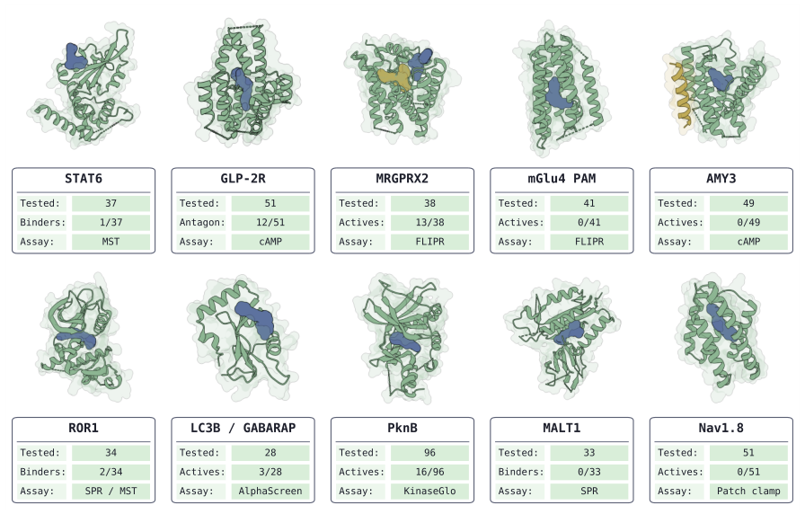
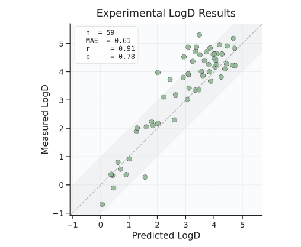
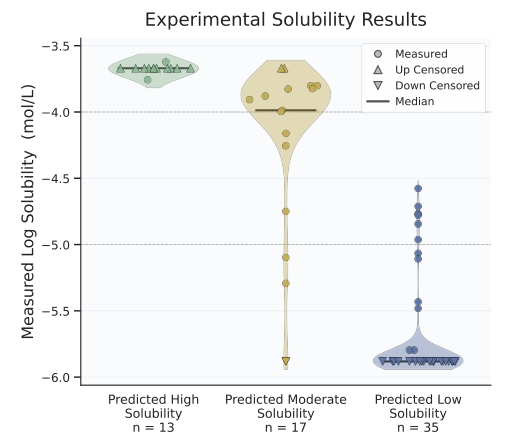
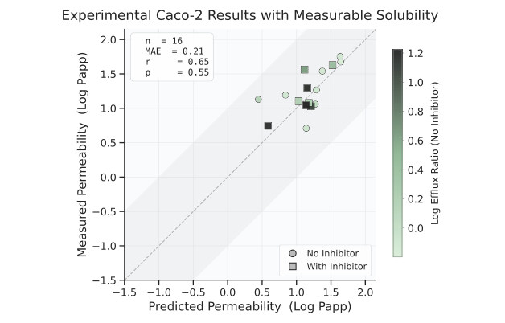
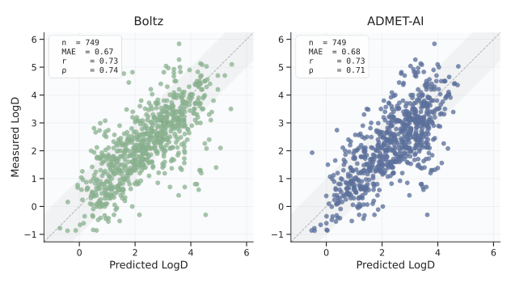
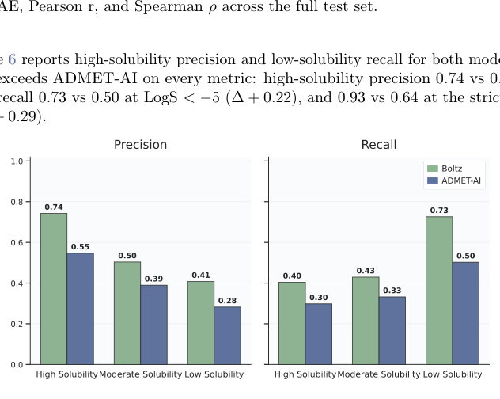
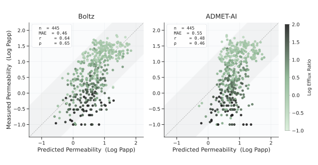

# BoltzMol-1: Towards Reliable Virtual Screening for Fast and Cost-Effective Hit Discovery

### 原文链接：[全文](https://doi.org/10.64898/2026.07.04.736485)

作者：Noah Getz, Geoffrey Smith, Avene Colgan, ..., Saro Passaro

bioRxiv，2026 年 7 月 6 日

---
**导读**

高通量筛选通常需要测试数万到数百万个化合物，命中率仅约 0.01%-0.14%。BoltzMol-1 提出了一条截然不同的路线——**以优化版 Boltz-2 的蛋白-小分子共折叠和亲和力预测为核心，结合药物化学过滤、"虚拟 PAINS"去除和 ADMET 早期评估，将每个靶点的实验预算压缩到仅 28-96 个化合物**。在 10 个靶点（多数在训练数据中无代表）的前瞻性验证中，6 个靶点成功发现了功能活性分子或结合物，包括在 GLP-2R 上发现 12 个拮抗剂（最佳 IC50 约 70 nM）和在 MRGPRX2 上发现 13 个活性分子。这是目前规模最大的基于蛋白-配体共折叠模型的前瞻性虚拟筛选研究，同时完整报告了成功和失败的靶点，为该领域提供了重要参考。

## 一、研究问题

传统高通量筛选（HTS）的命中率通常极低（约 0.01%-0.14%），需要在大型化合物库中筛选数万至数百万个分子，成本高昂、周期漫长且对基础设施要求很高。已有的基于机器学习的虚拟筛选方法虽然在回顾性数据集上表现出色，但普遍存在几个严重的评估偏差：测试集与训练集的化学结构过于相似（数据泄漏），评估靶点集中在已有大量配体数据的热门蛋白家族（如激酶、GPCR 正构位点），而评价指标的改善未必能转化为实验命中率的提升。更关键的是，绝大多数方法停留在回顾性验证阶段，缺乏真正的前瞻性验证——先预测，再购买化合物，最后做实验检验命中率。

BoltzMol-1 的设计理念是回答一个更实际的问题：**如果每个靶点只能购买和测试几十个化合物（28-96 个），模型能否把真正的活性分子排到最前面？**这要求筛选流程同时考虑三件事——结合能力预测、化合物的商业可采购性和基本药物性质。论文最大的价值在于进行了涵盖 10 个靶点的前瞻性实验验证，完整报告了 6 个成功和 4 个失败，为理解当前蛋白-配体共折叠模型在真实药物发现中的适用边界提供了第一手数据。10 个靶点涵盖了多种蛋白类型：GPCR（class A 和 class B）、激酶、伪激酶、转录因子、自噬蛋白和离子通道，多数靶点在 PDB 训练数据中没有或仅有少量小分子配体共晶结构。

## 二、方法核心：优化版 Boltz-2 + 药化过滤 + 虚拟 PAINS

BoltzMol-1 的完整筛选流程分为五步：商业化合物库预处理 → 药物化学过滤 → Boltz-2 共折叠与综合打分 → "虚拟 PAINS"去除 → ADMET 评估与候选选择。核心引擎是经过优化的 Boltz-2 蛋白-小分子共折叠模型，对每个蛋白-配体组合同时预测复合物三维结构、结合亲和力信号和小分子结合置信度，然后将多个模型输出加权组合成一个综合排名分数。

相对于默认 Boltz-2，BoltzMol-1 做了四项关键改进：

**（1）优化推理参数和综合评分**：在内部回顾性筛选任务上系统调整了不同模型输出（结合置信度、亲和力预测、结构可靠性）的权重组合，使综合分数的排序性能优于单一指标。

**（2）药物化学过滤**：在运行模型之前去除 PAINS、反应性基团、分子量极端（过大或过小）、可旋转键过多的分子，减少模型对不可开发化合物的计算浪费。

**（3）"虚拟 PAINS"（virtual PAINS）去除**：这是本文方法上最有新意的概念。对多个无关靶点运行筛选后，统计哪些化合物总是出现在高排名位置。这些化合物可能在传统实验中完全正常（不干扰检测信号），但会系统性地"欺骗"共折叠模型的排名系统，类似于模型层面的假阳性。将它们识别并排除后，剩余候选的真实命中率有望提升。

**（4）推理速度优化**：使固定计算预算下可以筛选更多化合物。论文还提供了两种筛选模式：针对固定商业化合物库（如 Mcule 约 150 万化合物、Enamine 约 400 万化合物）的穷举筛选，以及面向超大规模虚拟空间（如 Enamine REAL，数十亿级分子可按需合成）的生成式主动学习筛选。后者通过迭代"预测-采样-更新"循环，在不对全部分子评分的前提下高效探索化学空间。

**ADMET 早期评估模型**

作者同步开发了三个 ADMET 预测模型作为候选过滤层：**LogD**（脂溶性，测试集 Pearson r = 0.91）、**动力学溶解度 KSol**（设计为高/中/低三分类，高溶解度精确率 0.74）和 **Caco-2 通透性**（MAE = 0.46）。三个模型采用 GPS 风格图 Transformer 架构，在分子图节点和边特征上整合了 UniPKa 原子级酸碱性预测和 RDKit 三维构象信息。

作者特别指出常见 ADMET 基准中存在严重的数据泄漏问题：标准 scaffold split 中，LogD 约 80%、LogS 约 71%、Caco-2 约 47% 的测试化合物与训练分子的化学结构高度相似（Tversky 相似度 ≥ 0.6）。因此他们采用了更严格的文献级划分和人工审查，在这种条件下模型性能下降但仍然实用。

## 三、看图说话

### Figure 1 · 10 个靶点的前瞻性筛选总览

**这张图想回答：**每个靶点只买几十个化合物，10 个靶点里有几个真能筛出活性分子？

{: width="896" height="582" loading="lazy" decoding="async"}

*Figure 1. 前瞻性虚拟筛选总览。10 个靶点各给出预测的蛋白-配体复合物、测试化合物数、确认活性数和实验方法（STAT6、GLP-2R、MRGPRX2、mGlu4 PAM、AMY3、ROR1、LC3B/GABARAP、PknB、MALT1、Nav1.8）。*

10 个靶点共测约 458 个化合物（每靶点 28–96 个），**6 个成功（靶点级成功率 60%）**，由 Scripps、威斯康星、科罗拉多的独立实验室用 cAMP、钙流、SPR、MST 等多种方法验证。

最亮眼的两个：**GLP-2R**（class B GPCR，此前只有肽配体结构）测 51 个化合物得 12 个拮抗剂，最佳母体 IC50 约 70–160 nM；**MRGPRX2** 测 38 个得 10 个激动剂+3 个拮抗剂，化合物级命中率约 34%，远高于 HTS 的 0.01%–0.14%。ROR1 有三种正交方法确认的结合物（KD 5.13 μM）。但共折叠模型无法预先区分激动剂/拮抗剂，GLP-2R 命中的 12 个最终都是拮抗剂。

### Figure 2 · LogD 模型在实购化合物上的验证

**这张图想回答：**买之前预测的脂溶性 LogD，和买来实测的值对得上吗？

{: width="508" height="418" loading="lazy" decoding="async"}

*Figure 2. LogD 模型在前瞻性实购化合物上的表现。n = 59，预测 vs 实测 LogD，虚线为理想对角线。*

对实际采购的 59 个化合物实测 LogD，点基本落在对角线附近，**Pearson r = 0.91、MAE = 0.61**。意味着买化合物前就能用模型筛掉脂溶性过高（易非特异结合）或过低（难透膜）的分子，把有限预算花在药物性质更合理的候选上。

### Figure 3 · 溶解度模型的三分桶验证

**这张图想回答：**模型预测的高/中/低溶解度分桶，和实测溶解度分布一致吗？

{: width="508" height="444" loading="lazy" decoding="async"}

*Figure 3. KSol 溶解度模型在实购化合物上的表现。按预测溶解度分桶展示实测 KSol 分布，上/下三角为上/下删失值。*

三个小提琴分别是「预测高/中/低溶解度」三个桶的实测溶解度分布。**三个桶明显分层**——高溶解度桶集中在上方、低溶解度桶集中在下方，中桶居中。说明模型能作为早期分流器，把可能因溶解度不足而产生假阴性的化合物提前识别出来。

### Figure 4 · Caco-2 通透性模型的验证

**这张图想回答：**预测的细胞通透性（Caco-2）与实测相关吗？

{: width="628" height="402" loading="lazy" decoding="async"}

*Figure 4. Caco-2 通透性模型在实购化合物上的表现。n = 16，预测 vs 实测 A→B 表观通透性，点按外排比着色。*

在 16 个有可测通透性的实购化合物上，预测与实测的 **Pearson r = 0.65、MAE = 0.21**。样本少、相关性弱于 LogD，但仍可作为候选过滤的辅助。至此，LogD、溶解度、Caco-2 三个 ADMET 模型都在真实采购化合物上得到了前瞻性检验。

### Figure 5 · LogD 模型 vs ADMET-AI（全测试集）

**这张图想回答：**在严格去泄漏的大测试集上，自家 LogD 模型比公开的 ADMET-AI 强吗？

{: width="632" height="360" loading="lazy" decoding="async"}

*Figure 5. 全测试集上预测 vs 实测 LogD，左为本文模型、右为 ADMET-AI，标注 MAE、Pearson r、Spearman ρ。*

n = 749 的大测试集上两者相关性相近（都 r ≈ 0.73）。作者特别强调常见 ADMET 基准有严重数据泄漏（scaffold split 里 LogD 约 80% 测试分子与训练高度相似），所以他们改用更严格的文献级划分。这张图是在这种严苛条件下的对比。

### Figure 6 · 溶解度分类的精确率与召回率

**这张图想回答：**在识别高溶解度和低溶解度化合物上，本文模型比 ADMET-AI 好多少？

{: width="632" height="504" loading="lazy" decoding="async"}

*Figure 6. LogS 测试集上本文模型与 ADMET-AI 的高溶解度精确率、低溶解度召回率。真值阈值：高溶解度 LogS > −4，低溶解度 LogS &lt; −5 / &lt; −6。*

左边精确率、右边召回率，绿色本文模型、蓝色 ADMET-AI。本文模型**在每一档上都更高**：高溶解度精确率 0.74 vs 0.55，低溶解度召回率 0.73 vs 0.50。对筛选来说，高溶解度桶挑得准、低溶解度桶捞得全，正是早期分流需要的。

### Figure 7 · Caco-2 模型 vs ADMET-AI（全测试集）

**这张图想回答：**通透性预测上，本文模型相比 ADMET-AI 如何？

{: width="632" height="328" loading="lazy" decoding="async"}

*Figure 7. 全测试集上预测 vs 实测 Caco-2 A→B 通透性，左为本文模型、右为 ADMET-AI，点按对数外排比着色。*

n = 445 的测试集上本文模型 r = 0.64、ADMET-AI r = 0.48，**本文模型略优**。三个 ADMET 模型都用 GPS 风格图 Transformer，整合了原子级酸碱性预测和 RDKit 三维构象信息。

## 四、核心贡献总结

四个零命中靶点提供了关于方法适用边界的重要信息。**mGlu4 PAM**（41 个化合物均无活性）揭示了共折叠模型的根本局限：蛋白-配体结合排名无法可靠区分构象依赖的药理学功能——正变构调节剂（PAM）必须结合特定变构口袋并稳定受体的特定构象状态，仅预测结合能力远远不够。**AMY3**（49 个化合物无活性）涉及由降钙素受体与受体活性修饰蛋白 RAMP3 组成的异源二聚体复合受体，药理学行为受辅助蛋白调控，这种多亚基依赖的靶点增加了预测难度。

**MALT1**（33 个化合物未确认结合）是最有启发性的失败案例：它在 PDB 中有丰富的共晶结构和配体数据，理论上属于模型的"训练内"靶点，但前瞻性筛选仍然失败。作者推测原因可能是商业化合物库中缺少适合 MALT1 特定口袋形状和化学环境的化学型，或者模型学到的特征未能推广到这些新骨架。这个案例表明**训练数据的丰富程度和前瞻性筛选的成功率之间没有简单的对应关系**，化合物库的化学多样性覆盖同样是限制因素。**Nav1.8**（51 个化合物无活性）靶向电压感应域 VSD2 的变构位点，而训练集中钠通道的配体数据主要来自中央孔道正构位点——靶点家族级别的数据丰富度并不意味着模型理解了家族内特定变构位点的结合规律。

## 五、局限与展望

论文最关键的证据缺口是**缺少严格的基线对照**——没有在同一批靶点、同一预算约束下系统比较随机抽样、传统分子对接（如 Glide、AutoDock Vina）、纯配体相似性方法或未经优化的默认 Boltz-2 的表现。因此我们可以说 BoltzMol-1"在极低预算下找到了活性物"，但无法量化它相对于现有方法的优势幅度——特别是对于 GLP-2R 和 MRGPRX2 这两个最强结果，无法排除成熟的传统方法也能在同等预算下取得类似命中率的可能性。六个成功靶点的证据强度也参差不齐：GLP-2R 和 MRGPRX2 有完整的功能剂量-反应验证和亲本细胞对照，ROR1 有三种正交方法支持，但 STAT6 的重复亲和力实验不稳定，LC3B/GABARAP 仅有单一 AlphaScreen 结果缺乏正交验证，PknB 首筛浓度远高于常规药物化学标准（通常 10-100 μM）。

此外，多位作者隶属于 Boltz PBC（商业公司），筛选通过 Boltz Lab/API 实施。综合评分的具体权重组合和"虚拟 PAINS"名单均未完全公开披露，这意味着学术界的完整独立复现仍受限制——虽然基础模型 Boltz-2 是开源的，但 BoltzMol-1 的优化细节构成了商业壁垒。论文作为 bioRxiv 预印本尚未经过同行评审。从药物开发角度看，发现微摩尔级别的结合物只是苗头发现（hit discovery）阶段的产出，距离可开发的先导化合物还需要经历效力优化（通常需要提升 100-1000 倍至纳摩尔级别）、选择性表征、代谢稳定性评估、体内药代动力学和药效研究等大量后续工作。

## 通讯作者介绍

Saro Passaro，Boltz PBC 联合创始人兼 CEO，此前在 MIT 完成博士后研究（导师为 Regina Barzilay 教授），参与开发了 Boltz-1 和 Boltz-2 蛋白结构预测模型，研究方向为深度学习驱动的分子设计和药物发现。Gabriele Corso，MIT 计算机科学博士（导师 Tommi Jaakkola 教授），Boltz PBC 联合创始人，在几何深度学习和分子建模领域发表了多项有影响力的工作，包括分子对接方法 DiffDock 和扩散模型的随机插值理论框架。本研究共 13 位作者，由 Boltz PBC、MIT CSAIL、Morgridge 研究所、威斯康星大学麦迪逊分校、塔夫茨大学化学系以及一家退伍军人事务部医学中心等机构联合完成，其中湿实验验证部分主要由学术合作实验室独立执行。第一作者 Noah Getz 负责了筛选流程的开发和优化工作。

## 引用

Getz, N., Smith, G., Colgan, A., Fan, V., Cavalleri, L., Capponi, F., ... & Passaro, S. (2026). BoltzMol-1: Towards Reliable Virtual Screening for Fast and Cost-Effective Hit Discovery. bioRxiv. https://doi.org/10.64898/2026.07.04.736485
