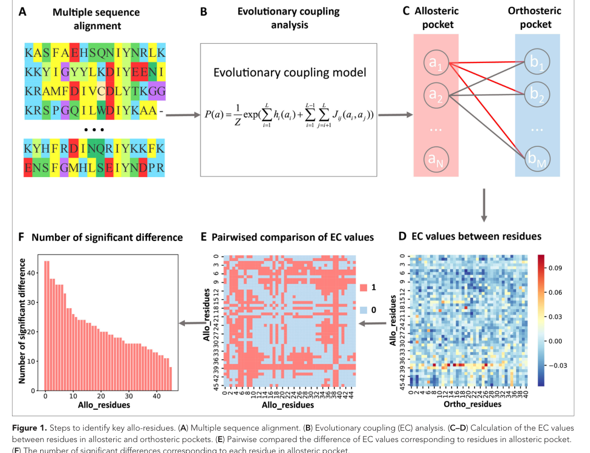
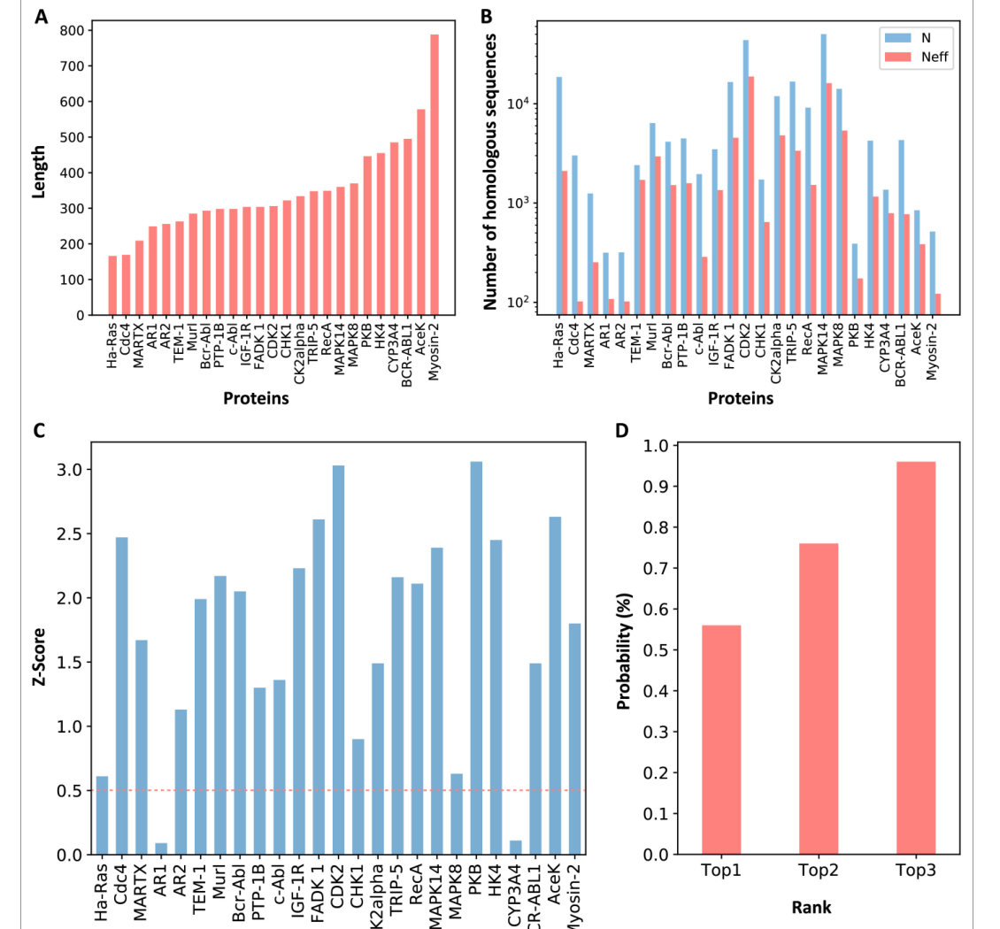
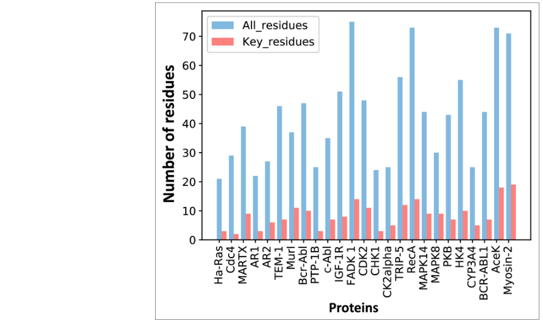
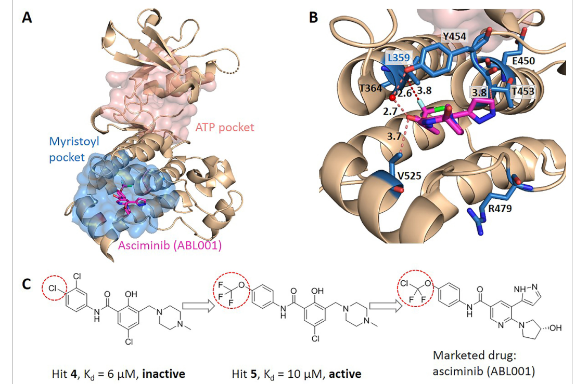
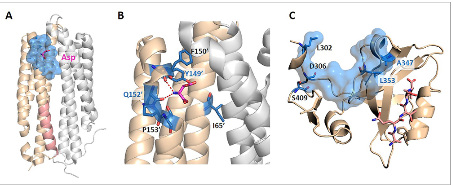
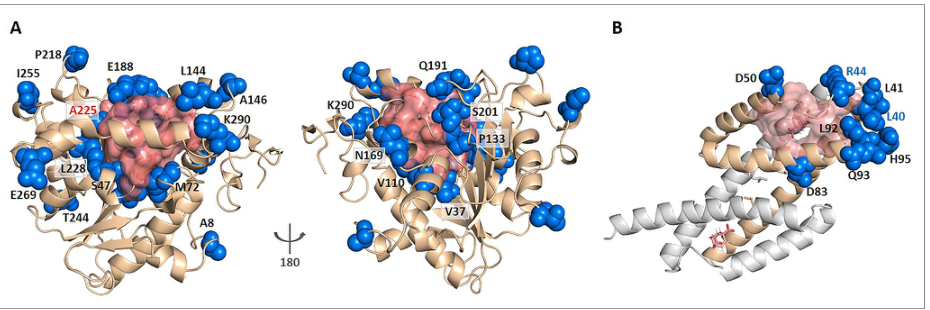

# Coevolution-based prediction of key allosteric residues for protein function regulation

### Link: [full article](https://doi.org/10.7554/eLife.81850)

Authors: Juan Xie, Weilin Zhang, Xiaolei Zhu, Minghua Deng, Luhua Lai

eLife, February 17, 2023

---
**Overview**

In allosteric drug design, an often-overlooked issue is that **the residues in an allosteric pocket are not equally important: some mainly contribute to binding affinity, while others both participate in binding and transmit the perturbation to the functional center**. The latter are the key to allosteric signaling. Starting from the multiple sequence alignment of a protein family, KeyAlloSite exploits the weak, non-contact coupling signals in coevolution models that are usually dismissed as 'noise', and systematically distinguishes ordinary binding residues from signal-transmitting residues in allosteric pockets. In tests on 23 proteins, the known allosteric pocket was correctly ranked in the Top 3 with a probability of 96%, predicted key residues made up about 20% of pocket residues, and the method was supported by experiments in the drug design case of asciminib, an allosteric inhibitor of BCR-ABL1.

## Part 1: Research Question

Allosteric regulation means that a perturbation at one site of a protein can affect another functional site that is spatially distant. Allosteric drugs regulate protein function by binding to allosteric pockets far from the active center; they usually offer higher selectivity and may also bypass resistance mutations at the orthosteric site. Finding the allosteric pocket, however, is only the first step, because the residues in the pocket are not functionally uniform. Some residues mainly contribute to ligand binding affinity; others both participate in binding and transmit the perturbation to the functional center, producing the allosteric signal. The authors call the latter **key allosteric residues (key allo-residues)**. This distinction is crucial for drug optimization: increasing the binding affinity of an allosteric ligand (lowering KD) does not necessarily increase its functional regulatory potency (improving IC50 or EC50). The real key to optimizing allosteric drugs is to maintain or strengthen the interactions between the drug and the key allo-residues, and then, on that basis, tune the interactions with other pocket residues to optimize affinity, selectivity and pharmacokinetic properties.

Existing allosteric site prediction methods (molecular dynamics simulations, rigid residue scanning, normal mode analysis and so on) can usually locate the approximate position of an allosteric pocket, but they are computationally expensive (often requiring separate molecular dynamics simulations for many residues) and struggle to further resolve the functional hierarchy of residues within the pocket, that is, which residues are responsible for binding and which for signal transmission. KeyAlloSite proposes a method based entirely on sequence coevolution. Its core hypothesis stems from a simple but profound observation: strong couplings in protein coevolution models (such as direct coupling analysis, DCA) mainly reflect residue pairs in direct spatial contact and have traditionally been used for protein contact map prediction, whereas the many weak coupling signals, which do not correspond to direct spatial contacts, are usually discarded as statistical noise in conventional applications. Allosteric and orthosteric sites, however, are inherently far apart and do not form direct contacts, so the functional link between them is expressed precisely in these neglected weak couplings.

## Part 2: Methodology: Using weak coevolutionary couplings to separate binding residues from signaling residues

The KeyAlloSite workflow has five steps. **(A) Building the multiple sequence alignment**: HMMER is used to search Pfam for homologs of the target protein, and sequences are reweighted at 80% sequence identity to obtain the number of effective sequences, N_eff, which reduces the outsized influence of highly similar sequences (such as large numbers of strain sequences from the same bacterial genus) on statistical inference. Through random subsampling, the authors show that stable predictions usually require N_eff ≈ 7L ± 4L (where L is the protein length); shorter proteins may need fewer sequences, while longer proteins often need more. **(B) Computing evolutionary couplings**: a global evolutionary coupling model based on the Potts model is fitted. For a protein sequence of length L, the model simultaneously estimates the single-site amino acid preferences at each position and the direct evolutionary coupling parameters between all pairs of positions. The Frobenius norm of the coupling matrix measures the direct coevolutionary strength between each pair of residue positions, and APC (average product correction) is applied to reduce background bias caused by phylogenetic relationships and insufficient sampling.

**(C-D) Building the allosteric–orthosteric coupling matrix**: the CAVITY software is used to detect all potential ligand-binding pockets on the protein surface. Then, for the N residues in each candidate allosteric pocket, the evolutionary coupling values between each residue and the M residues of the orthosteric pocket are extracted to form an N×M matrix. Each row of the matrix represents the coupling pattern between one allosteric residue and the entire orthosteric pocket. Because allosteric and orthosteric pockets are usually far apart in space (generally more than 15-30 Å), most individual values in the matrix are small. This is precisely the method's core insight: it looks at the overall distribution pattern of the many weak couplings between each allosteric residue and the orthosteric pocket, rather than at any single, especially prominent strong coupling signal.

**(E-F) Identifying key residues by statistical comparison**: a t-test (significance level α = 0.05) is performed on every pair of rows in the matrix (that is, every pair of allosteric residues) to determine whether their coupling patterns with the orthosteric pocket differ significantly. For each allosteric residue, the number of other pocket residues whose patterns differ significantly from it is counted and normalized to a Z-score; residues with Z > 0.8 are predicted to be key allo-residues. Intuitively, a residue whose coevolution pattern with the orthosteric site is clearly 'abnormal', meaning it differs from the coupling patterns of most other residues in the pocket, has been subject to special functional evolutionary constraints. This 'unusual' evolutionary pressure may come from the functional requirement of signal transmission rather than from the requirement of ligand binding alone.

## Part 3: Key Figure Analysis

### Figure 1: Five steps from coevolution to key residues

**What this figure asks:** How does KeyAlloSite locate key allosteric residues step by step from sequence coevolution information?

{: width="1130" height="870" loading="lazy" decoding="async"}

*Figure 1. Steps for identifying key allo-residues. (A) Multiple sequence alignment. (B) Evolutionary coupling analysis. (C–D) Computing the matrix of EC values between allosteric pocket residues and orthosteric pocket residues. (E–F) Identifying key residues by statistical comparison.*

**A/B**: HMMER searches Pfam for homologs, sequences are reweighted at 80% identity, and a Potts model is then fitted to compute the direct evolutionary coupling of every residue pair (Frobenius norm + APC correction). **C/D**: CAVITY finds surface pockets, and for each candidate allosteric pocket the N×M coupling matrix between it and the orthosteric pocket is extracted.

**Core insight**: the allosteric and orthosteric pockets are more than 15–30 Å apart and not in direct contact, so most values in the matrix are small. What the method focuses on is precisely **the overall distribution of these weak couplings that are usually discarded as noise**. E/F: a t-test is run on the coupling patterns of every pair of allosteric residues, and residues whose patterns 'differ' from those of most other residues (Z > 0.8) are classified as key allo-residues.

### Figure 2: How high is the allosteric pocket ranked?

**What this figure asks:** On a benchmark of 23 proteins, how high are the known allosteric pockets ranked?

{: width="1130" height="1050" loading="lazy" decoding="async"}

*Figure 2. Z-scores of allosteric pockets and the probability of ranking in the Top 3. (A) Length distribution of proteins in the dataset. (B) Number of effective homologous sequences. (C) Z-score of each known allosteric pocket. (D) Probability of ranking in the Top 1/2/3.*

The dataset spans 166–788 residues, with effective homologous sequences ranging from about 100 to tens of thousands. **Panel C**: of the 25 known allosteric pockets, 23 (92%) have Z-scores above the 0.5 threshold; only Ha-Ras and AR1 are low. **Panel D**: the known pocket is ranked **Top 1 with a probability of 56%, Top 2 with 76% and Top 3 with as much as 96%**. Moreover, the entire procedure uses only sequence coevolution and runs no molecular dynamics, so it finishes in minutes to tens of minutes on an ordinary workstation.

### Figure 3: Key residues make up only about one fifth of the pocket

**What this figure asks:** How many residues in an allosteric pocket are classified as 'key'?

{: width="900" height="532" loading="lazy" decoding="async"}

*Figure 3. Number of predicted key allo-residues in each protein. Blue shows the total number of residues in the allosteric pocket, and red shows how many of them are classified as key.*

Each protein has two bars: blue for all pocket residues and red for those classified as key. The red bars are generally only a small fraction of the blue bars: **key residues make up about 20% of pocket residues**, which narrows the set of residues that drug optimization needs to focus on by roughly 5-fold. Compared with methods such as SCA, which look for 'contiguous network sectors', KeyAlloSite has a more specific goal: to pick out, within a single pocket, the few residues most likely to be directly responsible for signal transmission.

### Figure 4: Corroboration from BCR-ABL1 and asciminib

**What this figure asks:** Do the predicted key residues of BCR-ABL1 match the binding site of the approved allosteric drug asciminib?

{: width="1130" height="740" loading="lazy" decoding="async"}

*Figure 4. Predicted key allo-residues in BCR-ABL1. (A) Crystal structure of the kinase domain, with asciminib (sticks) bound in the myristoyl pocket. (B) Key residues around asciminib. (C) Medicinal chemistry evolution from fragment to drug.*

Asciminib is a fourth-generation CML drug that binds the myristoyl pocket far from the ATP site to inhibit the enzyme allosterically, allowing it to bypass the T315I resistance mutation. KeyAlloSite classifies **7 of the pocket's 44 residues as key (including L359)**, and panel B shows that L359 forms a hydrophobic interaction with the trifluoromethoxy group of asciminib.

* **Panel C provides the strongest corroboration**: the precursor hit 4 (KD 6 μM) binds the pocket but **has no enzyme inhibitory activity**; only hit 5, which replaces the chlorine with a trifluoromethoxy group and establishes an interaction with L359, gains inhibitory activity. This is exactly the difference between a 'binding residue' and a 'signaling residue': the interaction with L359 is what makes the leap from 'binding' to 'allosteric inhibition'.

### Figure 5: Validation on the Tar receptor and PDZ3

**What this figure asks:** Can the method separate residues that 'only handle binding' from residues that 'handle signal transmission'?

{: width="930" height="382" loading="lazy" decoding="async"}

*Figure 5. Predicted key allo-residues in Tar and PDZ3. (A) Structure of holo-Tar, with aspartate (magenta) bound in the periplasmic region. (B) Close-up of the key signaling residues. (C) The PDZ3 domain.*

For the E. coli Tar chemoreceptor: among the 6 key residues predicted by the method, **Y149 and Q152 are experimentally established transmembrane signaling residues**, while R69 and R73 are correctly excluded; these two lie in the pocket but have been shown experimentally to govern only binding affinity, without participating in signal transmission. In PDZ3, the predicted A347 and L353 are also consistent with dynamics-regulating residues identified by NMR relaxation and directed evolution. This set of cases directly corroborates the method's core goal of distinguishing 'binding residues' from 'signaling residues'.

### Figure 6: Extending to enzyme engineering

**What this figure asks:** When the method is extended to the entire protein surface, can it help enzyme engineering narrow the mutational search space?

{: width="930" height="310" loading="lazy" decoding="async"}

*Figure 6. KeyAlloSite predicts key allo-residues for enzymes. (A) Predicted residues on Candida antarctica lipase B (CALB). (B) Predictions for another enzyme.*

The method is extended to the entire surface (not limited to known pockets) to find residues that are far from the catalytic center yet affect enzyme activity. On the lipase CALB, 52 key residues were predicted from the 296 residues outside the active pocket; among them, **A225, ranked third (Z = 3.04), has been experimentally shown to increase catalytic efficiency by about 11-fold with the A225M mutation**, and the V37I mutation at V37 also increases it by about 3-fold. This shows that the method can narrow hundreds of candidate mutation sites down to a few dozen, saving effort in directed evolution.

## Part 4: Key Contributions

BCR-ABL1 is the driver fusion kinase of chronic myeloid leukemia (CML). First- to third-generation ATP-competitive tyrosine kinase inhibitors (such as imatinib, dasatinib and nilotinib) have revolutionized the prognosis of CML patients, but point mutations at the ATP site (especially the T315I 'gatekeeper' mutation) cause resistance. The fourth-generation drug asciminib (ABL001, FDA-approved in 2021) takes an entirely different approach: it allosterically inhibits kinase activity by binding the myristoyl pocket far from the ATP site, thereby bypassing resistance mutations at the ATP site, and it is effective against many resistant forms of CML, including those carrying the T315I mutation. **(A)** KeyAlloSite predicts 7 of the 44 residues in the myristoyl pocket as key allo-residues: L359, R479, V525, Y454, E450, T453 and T364. **(B)** In the cocrystal structure of asciminib with BCR-ABL1, L359 forms a favorable hydrophobic interaction with the trifluoromethoxy group of asciminib (distance about 2.6-3.8 Å), and the other predicted key residues also sit at key positions around the ligand.

**(C)** The medicinal chemistry evolution from fragment screening to drug provides direct validation. The precursors of asciminib came from fragment screening: the early hit 4 (KD = 6 μM) binds the myristoyl pocket but has no kinase inhibitory activity; it can 'bind' but cannot 'push' the allosteric conformational change. Hit 5 (KD = 10 μM), by replacing the chlorine atom on the phenyl ring with a trifluoromethoxy group, establishes a hydrophobic interaction with L359 and gains inhibitory activity. This agrees closely with KeyAlloSite's prediction: **L359 is a key allo-residue, and the interaction with it is precisely the critical difference that bridges mere 'binding' and an actual 'allosteric inhibitory effect'**. In contrast, hit 4 does not form a favorable interaction with L359. The final approved asciminib fully retains this key interaction between the trifluoromethoxy group and L359. This case vividly illustrates what the practical difference between 'binding residues' and 'signaling residues' means for drug optimization strategy.

**Other validation cases and extended applications**

The authors also validated the predictions in several classic allosteric systems. **E. coli Tar chemoreceptor**: Tar is a homodimeric transmembrane receptor that mediates bacterial chemotaxis; after aspartate binds in the periplasmic region, the signal is transmitted through the transmembrane helices to the cytoplasmic region. KeyAlloSite predicts 6 key residues, of which Y149 and Q152 are allosteric signaling residues experimentally shown to be essential for signaling by attractants and antagonists. The method correctly excludes R69 and R73: although these two residues lie in the allosteric pocket, experiments have shown that they are mainly responsible for ligand binding affinity and do not directly participate in transmembrane signaling. This result directly corroborates KeyAlloSite's core goal of distinguishing 'binding residues' from 'signaling residues'. **PDZ3 domain**: the predicted key residues A347 and L353 are consistent with dynamics-regulating residues identified in earlier NMR relaxation experiments and directed evolution studies, further supporting the idea that weak coevolutionary couplings contain information about protein dynamics and allosteric function.

The method was also extended in two directions. The first is **cancer mutation prediction**: cross-referencing the predicted key allo-residues with somatic mutations in the COSMIC database revealed that some cancer mutations lie at predicted key allosteric positions, suggesting that these mutations may cause protein dysfunction by disrupting long-range allosteric signaling (rather than by directly damaging the catalytic center). However, the occurrence of a mutation in cancer samples does not prove that it is an oncogenic driver, so this analysis is better treated as a candidate mechanistic hypothesis. The second is **enzyme engineering**: the method is extended to the entire protein surface (not limited to known pockets) to find residues that are far from the catalytic center but affect enzyme activity. In Candida antarctica lipase B (CALB), 52 key residues were predicted from the 296 residues outside the active pocket; among them, A225, ranked third (Z = 3.04), has been experimentally shown to increase catalytic efficiency by about 11-fold with the A225M mutation, and the V37I mutation at V37 (Z = 1.42) also increases catalytic efficiency by about 3-fold. This indicates that KeyAlloSite can effectively narrow the search space for directed evolution or rational mutation design, reducing hundreds of candidate mutation sites to a few dozen.

## Part 5: Limitations and Outlook

The paper's main limitation is **the lack of prospective experimental validation**, which the eLife editor's evaluation also explicitly points out. All validation is based on experimental results in the existing literature and retrospective comparisons; the authors did not systematically carry out site-directed mutagenesis, enzyme activity assays, double-mutant cycles or NMR dynamics experiments on newly predicted residues. The current evidence therefore shows that KeyAlloSite's predictions are consistent with some known experimental results, but it does not yet fully demonstrate that the method can reliably distinguish 'residues that only affect binding' from 'residues truly responsible for allosteric signaling' in uncharacterized systems.

The dataset is small (23 proteins, 25 allosteric pockets), and the selection criteria were restricted to monomeric proteins, known cocrystal structures with both orthosteric and allosteric ligands, and more than 100 effective homologous sequences; these criteria facilitate method development but limit the generality of the conclusions. It is unclear how the method performs for allostery at oligomeric interfaces, signal transmission across subunits, cryptic allosteric sites without an obvious pocket, or new protein families with few homologous sequences. The method is highly sensitive to MSA quality: when there are too few homologous sequences, insufficient diversity or a mixture of functionally distinct subfamilies, the coevolutionary signals may be unreliable (the lower Z-score of AR1 in the dataset already shows this problem). The Z > 0.8 threshold for calling key residues was tuned according to the coverage of known residues, which gives it a degree of training-set tuning, and the optimal threshold may differ across protein families. In addition, the coupling values between each allosteric residue and the orthosteric pocket are used directly as samples in the t-test, but orthosteric pocket residues may be correlated with one another, and no multiple-testing correction is applied, which may introduce an accumulation of false positives that depends on pocket size. In the Tar case, switching from the holo to the apo structure slightly changes the composition of pocket residues, and the Z-score of Q152 drops from above the threshold to 0.66, showing that predictions are also somewhat sensitive to the choice of protein conformation. Nevertheless, as a computationally efficient method that relies only on sequence information, KeyAlloSite provides valuable computational clues for formulating allosteric drug optimization strategies.

## About the Corresponding Authors

Luhua Lai is a professor in the College of Chemistry and Molecular Engineering at Peking University and a core member of the Center for Quantitative Biology; her research focuses on computational biology and drug design, and she has long worked on developing computational methods for protein allosteric regulation and allosteric drug discovery. Sarath Dantu is a researcher at the Institute of Biophysics, Goethe University Frankfurt, Germany, focusing on computational simulation of protein dynamics and allosteric signal transmission. Minghua Deng is a professor in the School of Mathematical Sciences at Peking University, whose research focuses on bioinformatics and statistical learning. This study was a collaboration between Peking University and Goethe University Frankfurt, and the first authors, Juan Xie and Weilin Zhang, carried out the method development, software implementation and data analysis at Peking University.

## Citation

Xie, J., Zhang, W., Zhu, X., Deng, M., & Lai, L. (2023). Coevolution-based prediction of key allosteric residues for protein function regulation. eLife, 12, e81850. https://doi.org/10.7554/eLife.81850
