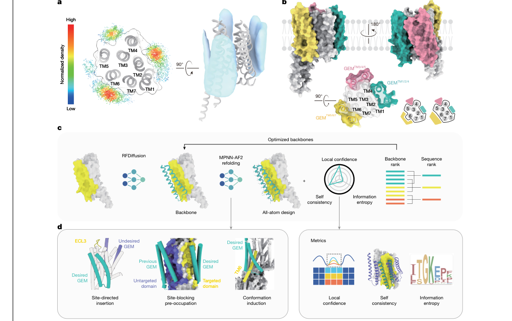
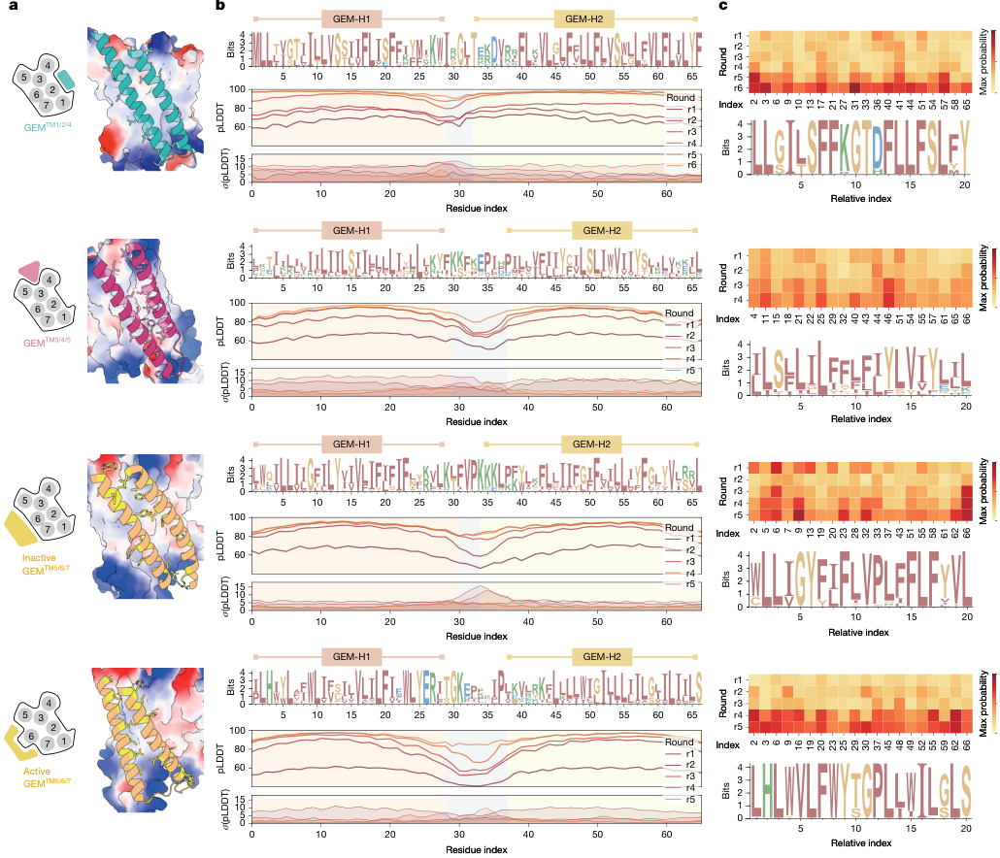
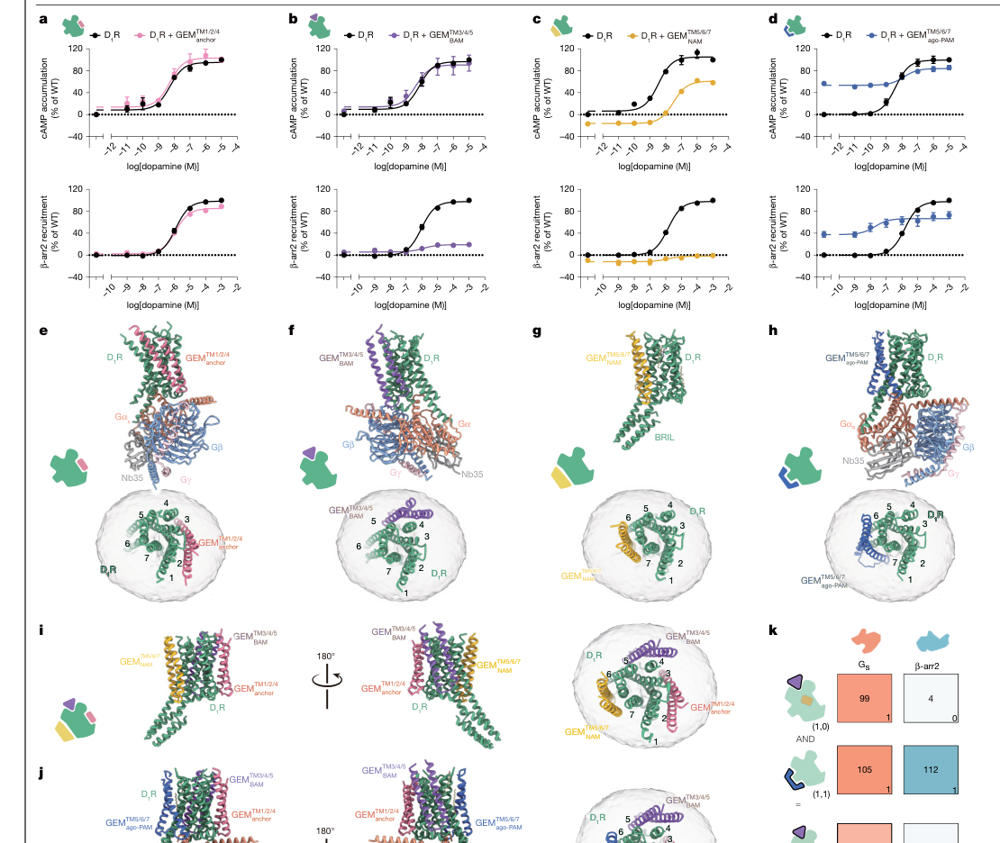
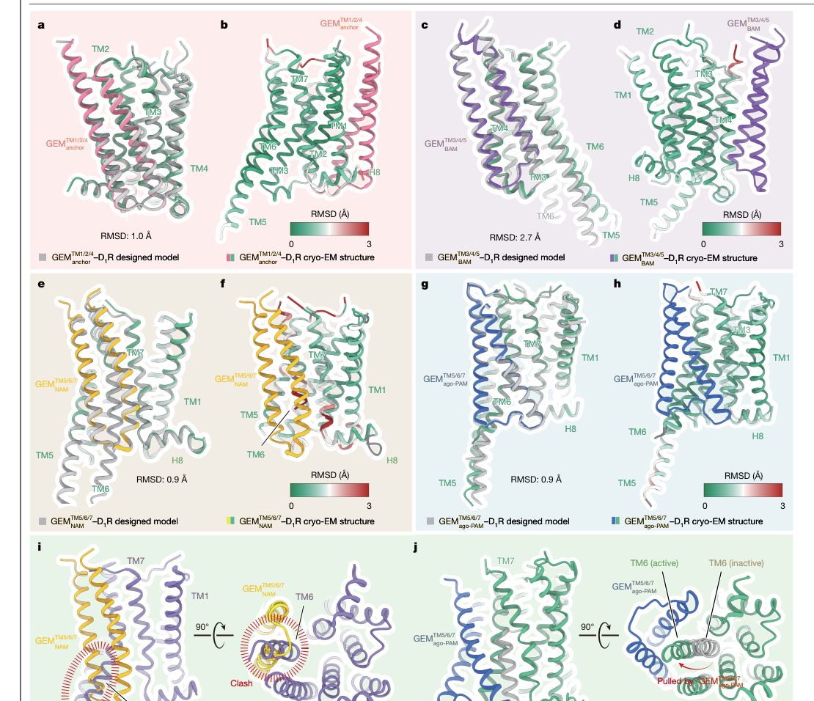

# De novo design of GPCR exoframe modulators

### Link: [full article](https://doi.org/10.1038/s41586-025-09957-1)

Authors: Shizhuo Cheng, Jia Guo, Yun-li Zhou, ..., Yan Zhang

Nature, March 2026

---
**Overview**

GPCRs are the most important family of drug targets, yet almost all conventional drugs act by binding the internal orthosteric site. This Nature paper proposes an entirely new strategy: **using RFDiffusion and ProteinMPNN to design, from scratch, two-pass transmembrane proteins of roughly 60–70 amino acids (GPCR exoframe modulators, GEMs) that attach to the outer surface of a GPCR's transmembrane domain from within the lipid bilayer and stabilize particular receptor conformations like an exoskeleton**. Using the dopamine D1 receptor as a model, the authors successfully designed and validated by cryo-EM four GEMs with distinct functions: an anchor, a biased allosteric modulator, a negative allosteric modulator and an agonistic positive allosteric modulator, with RMSDs between computational models and experimental structures as low as 0.9 Å. The activating GEM can also rescue several D1R loss-of-function mutations, including the T37K mutation associated with infantile parkinsonism.

## Part 1: Research Question

The GPCR (G protein-coupled receptor) family has about 800 members and is the most common target class among approved drugs: roughly 35% of marketed drugs target GPCRs, spanning therapeutic areas from cardiovascular disease and metabolic syndrome to psychiatric disorders and pain. Conventional GPCR drugs activate or inhibit the receptor by binding the orthosteric site occupied by the natural ligand (such as dopamine, adrenaline or serotonin). However, the orthosteric site is often well conserved within a receptor subfamily, which leads to insufficient subtype selectivity and off-target side effects: the orthosteric pockets of the D1 and D5 dopamine receptors, for example, are highly similar, and small molecules struggle to distinguish them. Allosteric modulators can bind other pockets, but the accessible chemical space is limited, and most reported GPCR allosteric sites lie on the extracellular or intracellular surface of the receptor. More importantly, when a GPCR's orthosteric site or internal activation microswitches are disabled by mutation, raising the agonist concentration often fails to rescue receptor function: if a mutation disrupts the internal transmission network that converts the receptor from the inactive to the active conformation, conventional drugs face a fundamental failure.

Nature offers another route to regulation: natural single-pass transmembrane proteins such as RAMPs (receptor activity-modifying proteins), MRAPs and CD69 can regulate receptor trafficking, ligand selectivity and signaling properties by interacting with the transmembrane region of a GPCR. The RAMP family, for instance, determines whether a calcitonin receptor-like GPCR prefers CGRP or amylin through interactions with its transmembrane region. From this the authors ask: **can transmembrane proteins be designed artificially to bind a GPCR from within the membrane and mechanically stabilize a particular receptor conformation?** That is the core idea of the GEM (GPCR exoframe modulator): a structural frame sitting on the outside of the receptor that controls the conformational equilibrium by physical support, bypassing any dependence on the orthosteric site. The authors chose the dopamine D1 receptor (D1R) as the model system: D1R plays a key role in prefrontal cognitive function, motor control and reward pathways, its loss-of-function mutations are directly linked to neurological diseases such as Parkinson's disease and dystonia, and highly selective D1R-modulating drugs are currently lacking in the clinic, making it an ideal target system for testing a new regulatory strategy.

## Part 2: Methodology: Design pipeline

**(a)** The authors first used computational probing to find designable sites on the transmembrane surface of D1R. RFDiffusion generated 300 single-pass transmembrane α-helices around the active-state D1R structure, ProteinMPNN designed sequences for them, and AlphaFold2-Multimer predicted the complex structures, for a total of 1,500 predicted conformations analyzed. Mapping the contact frequency of interface residues onto the receptor surface clearly reveals three high-density bindable grooves: the TM1/2/4 region, the TM3/4/5 region and the TM5/6/7 region. TM5/6/7 is especially important, because the hallmark conformational change of class A GPCR activation, an outward movement of about 14 Å at the cytoplasmic end of TM6, occurs in exactly this region. **(b)** The design goal is for different GEMs to bind these three regions and produce different functional outputs. **(c)** The core design pipeline consists of RFDiffusion generation of initial backbones, iterative MPNN-AF2 refolding to optimize sequences, and several rounds of filtering based on local confidence (pLDDT), self-consistency RMSD and sequence entropy. Each round designs 8 sequences per candidate backbone and predicts 5 structures per sequence; retained designs are required to have a pLDDT above 90 over the GEM region and a self-consistency RMSD below about 1.5 Å. After several rounds of filtering, dozens of candidate sequences of each type were kept for experimental testing.

**(d)** The cleverest part of the design is three 'structural prompting' strategies, borrowed from prompt engineering with language models, which use structural information to steer the diffusion model toward generating backbones in a particular region and a particular conformation. **Site-directed insertion**: the GEM sequence is temporarily inserted via linker peptides into a specific intracellular loop of D1R (such as ICL2 or ICL3), which topologically restricts it to the vicinity of the target region, so the diffusion model is constrained to generate backbones near a chosen receptor surface. **Site blocking by pre-occupation**: an existing high-affinity design is placed at a competing site as a 'placeholder', forcing the new GEM to look for a different target surface and preventing several GEMs from crowding into the same groove. **Conformational induction**: when designing an activating GEM, the Gαs protein is added to RFDiffusion's input structure so that D1R retains the active conformation with TM6 displaced outward, letting the designed GEM fit this open state. Conversely, removing Gαs returns the receptor to the inactive state, which is used to design inhibitory GEMs that lock the inactive conformation. These strategies make it possible to design modules with very different functions on the same receptor, targeting different transmembrane regions and different conformational states.

## Part 3: Key Figure Analysis

### Figure 1: Finding designable grooves and designing GEMs

**What this figure asks:** How can designable grooves be found on the transmembrane surface of D1R, and how are GEMs designed against them?

{: width="1110" height="696" loading="lazy" decoding="async"}

*Figure 1. De novo design of GEMs. (a) Probing bindable sites on the GPCR transmembrane surface with single-pass transmembrane helices. (b) The three target grooves. (c) The pipeline: RFDiffusion generation plus iterative MPNN-AF2 optimization plus multi-round filtering. (d) The three structural prompting strategies.*

* **Panels a/b**: RFDiffusion generated 300 single-pass transmembrane helices around D1R, ProteinMPNN designed the sequences and AF2-Multimer predicted the structures, giving 1,500 conformations in total; mapping interface contact frequency onto the receptor surface yields three high-density grooves: **TM1/2/4, TM3/4/5 and TM5/6/7** (the last is the most important, because the roughly 14 Å outward movement of the cytoplasmic end of TM6 upon class A GPCR activation happens there).
* **Panels c/d**: the pipeline requires a pLDDT > 90 over the GEM region and a self-consistency RMSD &lt; 1.5 Å. The cleverest part is the three **structural prompts**: site-directed insertion (temporarily grafting the GEM into a specific intracellular loop with linker peptides so that it stays near the target region), site blocking by pre-occupation (placing a placeholder first so the new GEM must find another surface) and conformational induction (adding Gαs to the input when designing activating GEMs so the receptor keeps the active state with TM6 displaced outward).

### Figure 2: Computational assessment of the designs

**What this figure asks:** After several rounds of iterative design, how well have the sequences and structural confidence of the four GEMs converged?

{: width="1030" height="884" loading="lazy" decoding="async"}

*Figure 2. Computational assessment of the designs. (a) Binding poses of the four GEMs and their target surfaces. (b) Sequence logos, pLDDT and its standard deviation for each design round. (c) Maximum-probability heatmaps per round and logos of conserved positions.*

The four rows correspond to the anchor type (TM1/2/4), the biased type (TM3/4/5), the inhibitory type and the activating type (both at TM5/6/7). **Panel b**: across design rounds r1→r6, **the pLDDT curves rise overall and confidence is highest over the two transmembrane helices (GEM-H1/H2)**, while the connecting loop in between has slightly lower and more variable confidence; the sequence logos show that the helical regions are rich in hydrophobic residues such as I, V, L and F, so that they fold stably in the lipid bilayer. The maximum-probability heatmap in **Panel c** shows that certain positions converge to being highly conserved across rounds.

### Figure 3: Function and structure of the four GEMs

**What this figure asks:** What strikingly different functional effects arise when the four GEMs bind different transmembrane regions of D1R?

{: width="1110" height="936" loading="lazy" decoding="async"}

*Figure 3. High-resolution structures of de novo designed GEMs in complex with D1R. (a–d) Binding and functional effects of the anchor, biased, inhibitory and activating GEMs. (e–h) Cryo-EM structures (2.6–2.9 Å). (i–k) Simultaneous binding of several GEMs and modular combinations.*

A GEM is about 60–70 amino acids long with two hydrophobic transmembrane helices. The four have very different functions: **the anchor type** (a) barely affects signaling and can serve as a neutral carrier; **the biased type (b)** reduces Gs signaling only slightly while suppressing β-arrestin recruitment to about 20%, steering signaling toward the G protein; **the inhibitory type (c)** acts like a structural clamp that blocks the outward movement of TM6, lowering EC50 by about 100-fold; **the activating type (d)** has a preorganized 'clamp' that fits the outward-displaced TM6, acting both as an agonist in its own right and as a positive allosteric enhancer.

* **Panels e–k**: cryo-EM confirms the four binding modes, and **three GEMs can bind the same D1R simultaneously** (occupying three non-overlapping grooves). Modular combinations behave like logic gates: with the activating and biased GEMs acting together, Gs signaling is retained at about 70% while β-arrestin is suppressed to about 3%, achieving G protein-biased activation.

### Figure 4: Design accuracy and the structural basis of modulation

**What this figure asks:** How closely do the computational designs match the experimental structures, and what is the structural mechanism of inhibition and activation?

{: width="1110" height="956" loading="lazy" decoding="async"}

*Figure 4. Structural assessment and molecular basis of GPCR modulation by GEMs. (a, c, e, g) Superposition of AF2 predictions with the experimental structures. (b, d, f, h) RMSD colored by residue. (i) The inhibitory type blocks the outward movement of TM6. (j) The activating type stabilizes the active state with TM6 displaced outward.*

* **Panels a–h**: superposing the AF2 predictions on the 2.6–2.9 Å cryo-EM structures gives **an RMSD of 1.0 Å for the anchor type, 0.9 Å for the inhibitory type and 0.9 Å for the activating type**, and 2.7 Å for the biased type (larger because TM4 undergoes induced fit upon binding, which AF2 did not fully predict). Coloring by residue shows deviations of &lt; 0.5 Å in the transmembrane core, with the main deviations in flexible loop regions.
* **Panels i/j** highlight two opposite mechanisms: the rigid two-helix bundle of **the inhibitory type** clashes severely with the active-state position of TM6 (marked Clash), physically blocking its outward movement and acting as a conformational lock; the clamp of **the activating type** fits the displaced TM6 exactly and stabilizes the active conformation from outside. Replacing chemical inhibition or activation with physical support is the core idea of GEMs.

## Part 4: Key Contributions

**(a, c, e, g)** Superposing the AF2-predicted structures of the four GEMs on the cryo-EM experimental structures (resolution 2.6–2.9 Å) shows high design accuracy: RMSD 1.0 Å for the anchor type, 0.9 Å for the inhibitory type, 0.9 Å for the activating type and 2.7 Å for the biased type (the larger deviation arises mainly because TM4 near the GEM_BAM binding site undergoes a local receptor rearrangement upon binding, an induced-fit effect that AF2 did not fully predict). **(b, d, f, h)** Heatmaps of per-residue RMSD show that deviations in the transmembrane core (near the membrane center) are very small (usually &lt;0.5 Å), with the main deviations concentrated in loops and side chains near the extracellular and intracellular aqueous boundaries, regions that are themselves conformationally flexible. **(i)** The mechanism of the inhibitory GEM: it forms a rigid two-helix structure that packs against the outside of TM5/6/7 and clashes severely with TM6 of the active-state D1R (the region marked Clash), effectively preventing TM6 from moving outward. In essence, GEM_NAM acts as a conformational lock, replacing chemical inhibition with a physical obstacle. **(j)** The mechanism of the activating GEM is the opposite: its preorganized 'clamp' precisely fits the outward-displaced TM6, stabilizing the active conformation from outside and pushing the conformational equilibrium toward the open state that the G protein can access.

## Part 5: Limitations and Outlook

The finding with the greatest clinical potential is the activating GEM's ability to rescue D1R loss-of-function mutations. The authors tested two broad classes of mutation: defects in ligand binding and defects in the receptor's activation microswitches. For the ligand-binding-defective mutant D103A (D103^3.32 is a key residue for recognizing monoamine ligands), the GEM restored Gs signaling to about 75% of wild type. Notably, the GEM could not restore the mutant's dose-dependent response to dopamine, and instead compensated mainly by raising the receptor's basal activity: it bypasses the broken ligand-binding step and drives receptor activation structurally. For several activation-microswitch mutations (L66F, D70A, F281A/R, N327A, which disrupt the internal conformational transition network of the GPCR), the GEM restored about 45%–75% of Gs signaling and made several mutants produce detectable dose-dependent dopamine responses again. **Of particular note is the clinically relevant T37K mutation (T37^1.46K), which is associated with infantile parkinsonism-dystonia and responds poorly to existing D1R-targeted therapies; the GEM restored its Gs signaling to about 50%**. These results demonstrate the therapeutic potential of conformational compensation from the transmembrane surface: for receptors with a damaged orthosteric pocket or failed internal microswitches, a GEM can stabilize the active state from a different position, effectively adding external mechanical support to the receptor.

As for limitations: GEMs are transmembrane proteins, and delivery to target cells, correct insertion into the cell membrane, control of membrane topology and orientation, regulation of expression level and tissue specificity all remain unsolved; these challenges resemble those of gene therapy and may require delivery platforms such as AAV, mRNA-LNP or engineered cell transplantation. Functional validation was carried out mainly in HEK293T overexpression systems and detergent-purified systems, without primary neuronal cultures, animal models or long-term safety data. Receptor selectivity and off-target effects on membrane proteins remain to be assessed systematically: the membrane contains many other transmembrane proteins, and whether GEMs bind nonspecifically to non-target receptors needs further validation. In the cryo-EM work, GEMs were presented as fusion constructs held close by rigid linker peptides, so the local effective concentration is higher than for free expression; the structures therefore establish the binding modes, but affinities and potencies may differ under native membrane conditions. In addition, the approach has so far been fully validated only on D1R: different GPCRs vary greatly in transmembrane surface, lipid environment and conformational dynamics, and extending the approach to other receptors, ion channels or transporters remains future work. Even so, the concept of 'modular conformational engineering' demonstrated by GEMs, in which programmable signaling outputs are achieved by combining functional modules, opens a new design dimension for GPCR pharmacology and brings protein design tools into the heart of membrane protein pharmacology.

## About the Corresponding Authors

Yan Zhang is a professor and doctoral supervisor at the Shanghai Institute of Materia Medica, Chinese Academy of Sciences, who has long worked on GPCR structural biology and drug design, publishing cryo-EM structures of GPCRs and studies of signal transduction mechanisms in journals including Nature, Science and Cell, with the group having accumulated extensive experience in GPCR allosteric regulation and functionally selective signaling. Min Zhang is a professor at Soochow University whose research focuses on computational protein design and deep learning-driven membrane protein engineering, with deep practical experience in applying tools such as RFDiffusion and ProteinMPNN. Xuechu Zhen is a professor at the College of Pharmaceutical Sciences of Soochow University whose research covers neuropharmacology and dopamine receptor signal transduction, with a long-standing interest in the pharmacological basis of neurodegenerative diseases such as Parkinson's disease. First authors Shizhuo Cheng and Jia Guo, from Soochow University and the Shanghai Institute of Materia Medica, Chinese Academy of Sciences respectively, carried out the core work of computational design, cellular functional validation and cryo-EM structure determination.

## Citation

Cheng, S., Guo, J., Zhou, Y. l., Luo, X., Zhang, G., Zhang, Y. z., ... & Zhang, Y. (2026). De novo design of GPCR exoframe modulators. Nature, 651(8104), 242-250. https://doi.org/10.1038/s41586-025-09957-1
