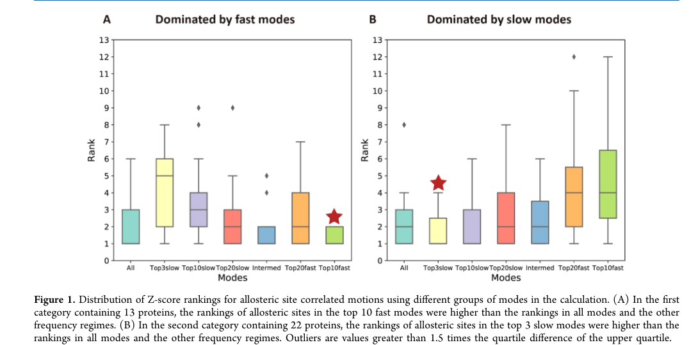
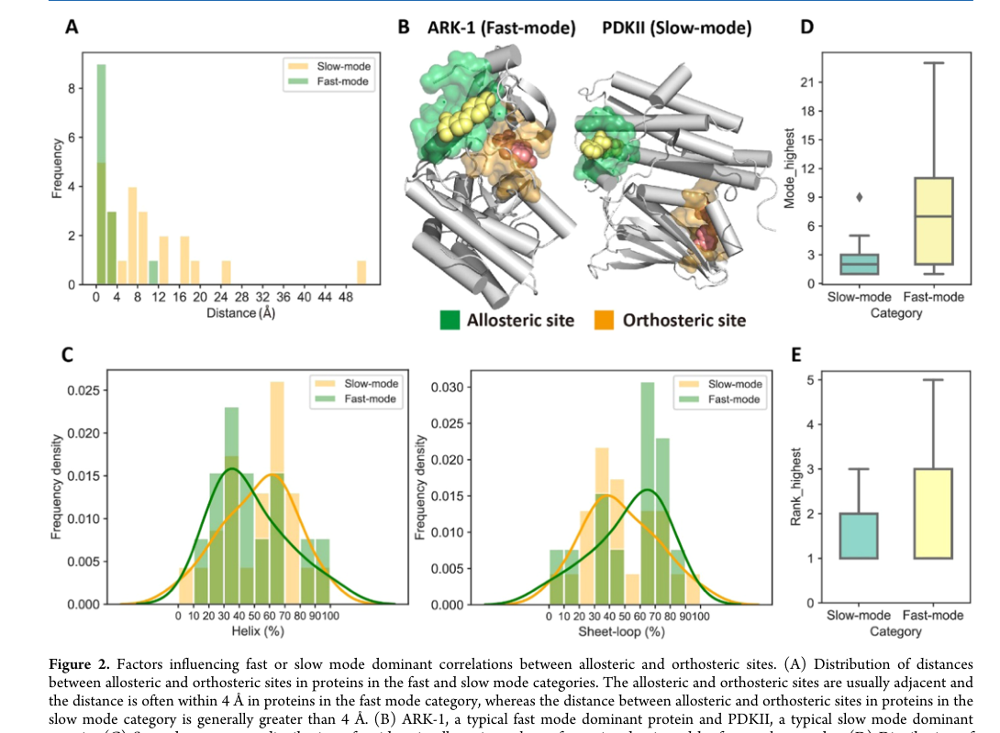
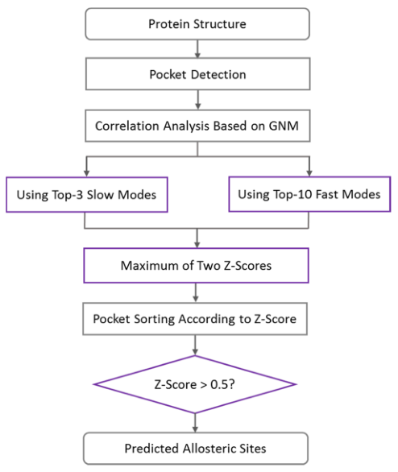
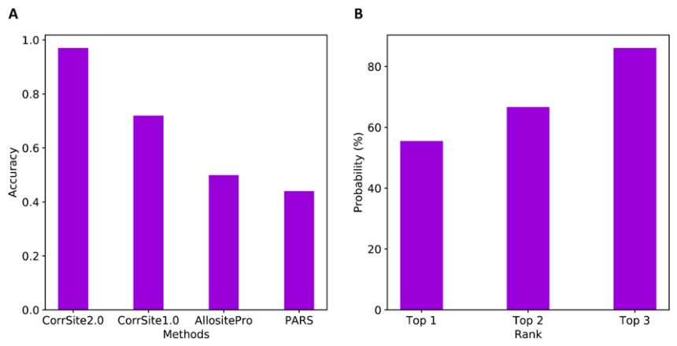
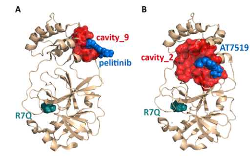

# Uncovering the Dominant Motion Modes of Allosteric Regulation Improves Allosteric Site Prediction

### 原文链接：[全文](https://doi.org/10.1021/acs.jcim.1c01267)

作者：Juan Xie, Shiwei Wang, Youjun Xu, Minghua Deng, Luhua Lai

Journal of Chemical Information and Modeling，2022 年 1 月 10 日

---
**导读**

变构药物设计的前提是准确找到变构位点，而现有方法往往将蛋白质的全部运动模式混在一起分析，忽略了不同蛋白质中变构通信可能由不同频率的运动主导。本文发现，**正构位点与变构位点较近时，局部快速运动模式主导变构通信；两者较远时，整体慢速运动模式更重要**。基于这一发现，CorrSite2.0 分别计算最慢 3 个模式和最快 10 个模式的相关性，取较大 Z-score 作为最终评分。在开发数据集上识别了 35/36 个已知变构位点（97.2%），独立测试达 90%，并成功同时识别了 SARS-CoV-2 主蛋白酶的两个变构位点。

## 一、研究问题

变构调控是蛋白质功能调控的核心机制之一：配体结合到远离活性中心的变构位点，通过蛋白质内部的动态传递改变活性位点的构象和功能。可以把蛋白质想象成一个精密的机械装置——按下某个远处的"按钮"，就能改变核心部件的工作状态。变构药物因为靶向非保守的远端位点，通常具有更高的选择性，副作用可能更少，还能绕过正构位点上的耐药突变。然而，变构药物设计的第一步——准确预测蛋白质上的变构位点——仍然是一个挑战，因为变构位点不像活性中心那样容易通过序列保守性识别，其调控机制高度依赖蛋白质的动态性质。

本文作者此前开发的 CorrSite1.0 利用高斯网络模型（GNM）计算正构位点与候选口袋之间的运动相关性来预测变构位点。其基本逻辑是：如果某个表面口袋与已知正构位点的运动高度相关，那么这个口袋可能就是变构位点。GNM 将蛋白质近似为弹性网络，每个残基用其 Cα 原子表示为节点，距离不超过 7 Å 的节点通过相同弹簧连接。对网络矩阵进行谱分解后，可以得到从慢到快的一系列运动模式。CorrSite1.0 的问题在于**它将全部正常运动模式混在一起计算**。这些模式有不同的物理含义：慢模式（低频）对应结构域级别的整体开合运动，快模式（高频）反映局部残基的振动。把所有模式相加，可能稀释真正重要的变构信号。

作者注意到 CorrSite1.0 对空间上相距较远的正构-变构位点预测较好，但对彼此接近的位点表现较差。这促使他们提出假设：不同蛋白质中的变构通信可能分别由慢模式或快模式主导，把所有模式混在一起反而会稀释真正有用的动态信号。

## 二、方法核心：变构通信的两种动态类型

作者在 35 个蛋白质（包含单体、多聚体和激酶，蛋白质长度 169-917 个残基）上系统测试了不同运动模式组合（最慢 3/10/20 个模式、中频模式、最快 10/20 个模式、全部模式）对变构位点排名的影响，结果发现这些蛋白质可以清楚地分为两类。

**快模式主导型（13 个蛋白质）**：使用最快的 10 个运动模式时，真实变构位点的 Z-score 排名最高（中位数约第 2 名）。使用慢模式或全部模式时，排名明显下降。这 13 个蛋白质的共同特征是正构位点和变构位点空间上彼此接近——**92.3% 的蛋白质中，两个位点的最近距离在 4 Å 以内**。以 Aurora kinase A（ARK-1）为典型例子，其正构位点和变构位点空间相邻，两者的动态耦合主要体现在快速的局部振动中。如果像 CorrSite1.0 一样使用全部模式，大量与功能无关的慢模式和中频成分会淹没这种局部快模式中的关键信号。

**慢模式主导型（22 个蛋白质）**：使用最慢的 3 个模式时排名最高，甚至优于使用最慢 10 个或 20 个模式的结果。为什么只用 3 个模式反而比 10 个更好？因为最慢的几个模式对应蛋白质最核心的整体运动——结构域之间的开合、蛋白质整体扭转和大尺度协同位移。加入更多模式后，与变构功能无关的局部涨落被引入，降低了真实变构口袋与其他口袋的区分度。这类蛋白质中，正构位点和变构位点通常相距较远，**65.2% 的蛋白质中两者距离超过 4 Å**。例如丙酮酸脱氢酶激酶同工酶 2（PDKII），两个位点之间相距 17.8 Å，变构信号的传递依赖蛋白质整体的协同运动。

## 三、看图说话

### Figure 1 · 两类蛋白由不同模式主导

**这张图想回答：**变构通信的两种动态类型——快模式和慢模式——是怎么被区分出来的？

{: width="1090" height="540" loading="lazy" decoding="async"}

*Figure 1. 用不同模式组计算时，真实变构位点的 Z-score 排名分布。(A) 快模式主导组。(B) 慢模式主导组。*

在 35 个蛋白上系统比较不同模式组合，发现蛋白清楚分成两类。**快模式主导型（13 个）**：用最快 10 个模式时真实变构位点排名最高（中位约第 2），用慢模式反而下降，这些蛋白的正构-变构位点大多很近（92.3% 在 4 Å 内）。

**慢模式主导型（22 个）**：用最慢 3 个模式排名最高，甚至比用 10 个、20 个更好——因为最慢几个模式对应结构域开合、整体扭转这类核心运动，加更多模式只会引入无关涨落。这类蛋白两个位点通常相距较远（65.2% 超过 4 Å）。CorrSite1.0 把所有模式混在一起，恰恰稀释了这两种信号。

### Figure 2 · 决定模式类型的结构因素

**这张图想回答：**正构位点与变构位点的空间距离，怎样决定哪种运动模式主导信号传递？

{: width="1090" height="800" loading="lazy" decoding="async"}

*Figure 2. 影响快/慢模式主导的因素。(A) 两位点距离分布。(B) ARK-1（快）与 PDKII（慢）结构对比。(C) 二级结构组成。(D–E) 单模式相关性验证。*

* **Panel A/B**：距离是最关键因素——快模式组两位点基本相邻（ARK-1），慢模式组明显偏远（PDKII 相距 17.8 Å）。**同一结构域内靠局部快振动通信，跨结构域则需整体协同运动**（快模式组 61.5% 同结构域，慢模式组 60.9% 跨结构域）。
* **Panel C–E**：慢模式口袋残基更常在 α-螺旋上（螺旋长、刚性，易整体参与开合）；87% 的慢模式组最大相关模式落在最慢 3 个之内，69.2% 的快模式组落在更高频区——从单模式角度印证了分类。

### Figure 3 · CorrSite2.0 工作流程

**这张图想回答：**不预先判断蛋白属于哪一类，怎样同时覆盖快、慢两种模式？

{: width="494" height="586" loading="lazy" decoding="async"}

*Figure 3. CorrSite2.0 流程：输入结构 → 口袋检测 → 基于 GNM 的相关性分析 → 分别用最慢 3 个和最快 10 个模式 → 取两个 Z-score 的较大值 → Z > 0.5 判为变构位点。*

流程的核心是最后那个「**取两个 Z-score 较大值**」（Z_final = max(Z_slow3, Z_fast10)）。因为想先分类再选模式就得先知道变构位点在哪、与预测任务矛盾，所以干脆**两种模式都算、取大者**——不管这个蛋白由快模式还是慢模式主导都能抓住。用 CAVITY 检测口袋、GNM 弹性网络做正常模式分析，Z > 0.5 判为潜在变构位点。

### Figure 4 · 与其它方法的对比

**这张图想回答：**加了独立的快模式通道后，识别准确率提升了多少？

{: width="860" height="440" loading="lazy" decoding="async"}

*Figure 4. CorrSite2.0 与其它变构位点预测方法对比。(A) 各方法识别准确率。(B) 真实变构口袋进入 Top 1/2/3 的概率。*

* **Panel A**：开发集上 CorrSite2.0 识别 **35/36（97.2%）**，远超 CorrSite1.0（72.2%）、AllositePro（50%）、PARS（44.4%）。提升主要来自快模式通道——CorrSite1.0 漏掉的 10 个里有 6 个是快模式主导型。**Panel B**：真实口袋进 Top 1 的概率 55.6%、Top 2 66.7%、Top 3 达 86.1%。独立测试集上 CorrSite2.0 也有 90%（18/20）。

### Figure 5 · 新冠主蛋白酶的两个变构位点

**这张图想回答：**在 SARS-CoV-2 主蛋白酶上，CorrSite2.0 能不能把两个已知变构位点都找出来？

{: width="512" height="322" loading="lazy" decoding="async"}

*Figure 5. CorrSite2.0 对 SARS-CoV-2 3CLpro 的预测。变构位点配体为蓝色球，正构位点配体为青色球。(A) cavity_9 + pelitinib。(B) cavity_2 + AT7519。*

主蛋白酶上已知两个变构位点。**CorrSite2.0 两个都识别出来了，而 CorrSite1.0、AllositePro、PARS 都只找到一个**。**Panel B** 的 cavity_2 在结构域界面深沟（AT7519 结合），Z-score 2.24、排名第 1；**Panel A** 的 cavity_9 是个小疏水口袋（pelitinib 结合），Z-score 0.66、排名第 6——不高但过阈值，正是这个小口袋被其它三种方法漏掉。用无配体的 apo 结构重算，两个位点仍被正确识别，说明抓的是结构固有的动态耦合。

## 四、核心贡献总结

在开发数据集 I（35 个蛋白质，36 个已知变构位点，蛋白质长度 169-917 残基）上，CorrSite2.0 正确识别了 35 个（97.2%），显著优于 CorrSite1.0（72.2%）、AllositePro（50.0%）和 PARS（44.4%）。改进主要来自快模式通道：CorrSite1.0 预测失败的 10 个蛋白质中有 6 个属于快模式主导型——因为 GNM 中低频模式对总体涨落的贡献通常较大，使用全部模式时慢模式信号仍能保留，但快模式对应的局部功能信号容易被大量其他模式淹没。CorrSite2.0 通过增加独立的快模式通道弥补了这一系统性偏差。

**真实变构口袋进入 Top 1 的概率为 55.6%，Top 2 为 66.7%，Top 3 达 86.1%**。这对后续的分子对接、虚拟筛选和实验验证非常有价值，因为研究者通常没有资源逐一验证所有表面口袋，而前三名是可管理的候选范围。在独立测试集 II（19 个蛋白质，20 个已知变构位点）上，CorrSite2.0 正确预测了 18 个（90%），而 CorrSite1.0 为 60%、AllositePro 为 45%、PARS 仅 30%，表明改进的泛化性良好。

需要注意的是，这里的"97.2%"和"90%"指的是已知变构位点的检出成功率（即 Z-score 大于 0.5 阈值），不完全等同于标准二分类问题中的准确率。一个蛋白质可能预测出多个 Z > 0.5 的口袋，论文没有详细量化假阳性口袋的数量或精确率-召回率曲线。

**应用案例：SARS-CoV-2 主蛋白酶**

SARS-CoV-2 主蛋白酶（3CLpro/Mpro）对病毒复制至关重要，是抗冠状病毒药物开发的关键靶点。通过片段筛选和结构生物学手段，研究者已经在该蛋白质上发现了两个变构位点。CorrSite2.0 成功同时识别了这两个位点，而 CorrSite1.0、AllositePro 和 PARS 都只能识别其中一个。

**第二个变构位点**（cavity_2）位于催化结构域与二聚化结构域之间的深沟，化合物 AT7519 可与其结合（PDB: 7AGA）。CorrSite2.0 给出 **Z-score = 2.24，排名第 1**——这是非常强的信号。该位点位于结构域界面，可能同时影响催化结构域的构象、蛋白质二聚化和活性位点的空间排列，因此与正构位点的整体运动相关性格外突出。

**第一个变构位点**（cavity_9）是一个疏水口袋（包含 Ile213、Leu253、Gln256、Val297、Cys300），激酶抑制剂 pelitinib 可结合此处（PDB: 7AXM）。CorrSite2.0 给出 Z-score = 0.66，排名第 6——虽然排名不高，但超过 0.5 阈值仍被正确识别。这个较小的变构位点被其他三种方法全部遗漏，体现了双通道策略在覆盖不同类型变构口袋方面的优势。作者还使用不含变构配体的 apo 结构（PDB: 2Q6G）重新计算，两个位点仍被正确识别，说明方法检测的是蛋白质结构中固有的动态耦合特征，对小幅构象变化具有稳健性。

## 五、局限与展望

**依赖已知正构位点**：CorrSite2.0 要求用户指定正构口袋或输入正构位点残基，因此它更准确地说是在已知正构位点条件下预测与其动态耦合的变构位点，并非完全从零开始的全蛋白搜索方法。

**口袋检测质量制约结果**：两个独立测试失败案例均与 CAVITY 检测有关——GDH1 的变构口袋未被完整覆盖（将变构配体周围 8 Å 残基重新定义为口袋后，Z-score 变为 0.67，能够正确预测），MIF 的变构口袋与正构口袋残基高度重叠，去除重叠残基后剩余口袋过小，导致预测失败。真实应用中也可能遇到隐蔽或瞬时口袋等 CAVITY 难以检测的情况。

**GNM 是简化模型**：它用相同弹簧连接所有近邻残基，忽略了不同类型的非共价相互作用、原子级化学细节、溶剂效应和非谐性大幅度构象转变，识别的是平衡涨落中的动态耦合，而非完整的变构自由能机制。此外，运动"相关"并不等于"因果"——高相关性说明两个区域协同运动，但不能直接证明扰动候选口袋一定会改变正构位点功能，也不能保证该口袋能够结合可开发的小分子。预测结果仍需通过突变实验、酶活检测、分子动力学模拟或结构生物学手段进一步验证。

## 通讯作者介绍

赖鲁华（Luhua Lai），北京大学化学与分子工程学院教授，北京大学定量生物学中心和北大-清华生命科学联合中心成员。赖鲁华教授在北京大学获得理学学士和博士学位，长期从事蛋白质结构与功能、计算药物设计、变构调控机制和蛋白质设计等方面的研究。其课题组开发了多个广泛使用的计算工具，包括蛋白质口袋检测程序 CAVITY、变构位点预测方法 CorrSite 系列，以及整合这些工具的在线平台 CavityPlus，系统性地推动了基于蛋白质动态性质的变构药物发现研究。本文第一作者谢娟（Juan Xie）同为北京大学赖鲁华课题组成员，主要研究方向为蛋白质变构调控和共进化分析。

## 引用

Xie, J., Wang, S., Xu, Y., Deng, M., & Lai, L. (2022). Uncovering the Dominant Motion Modes of Allosteric Regulation Improves Allosteric Site Prediction. Journal of Chemical Information and Modeling, 62(1), 187-195. https://doi.org/10.1021/acs.jcim.1c01267
