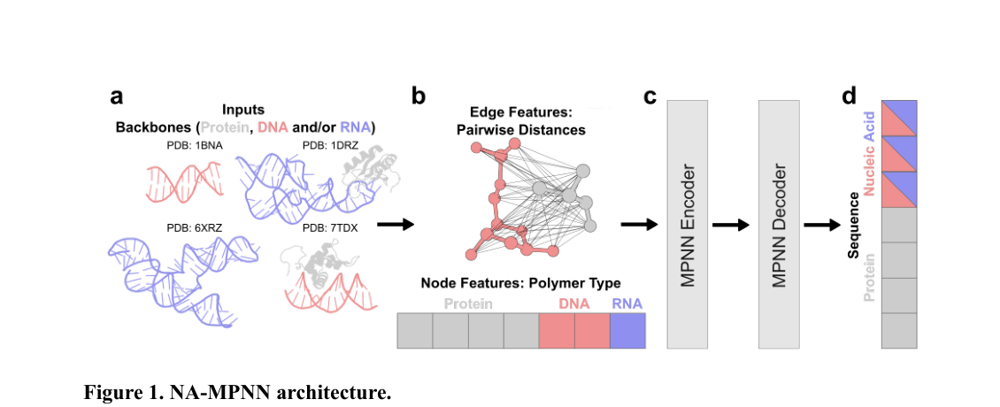
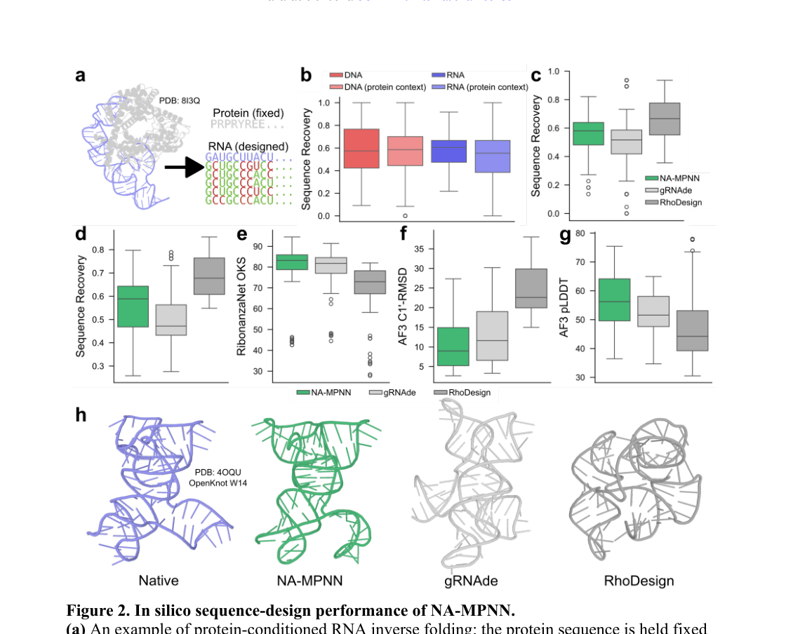
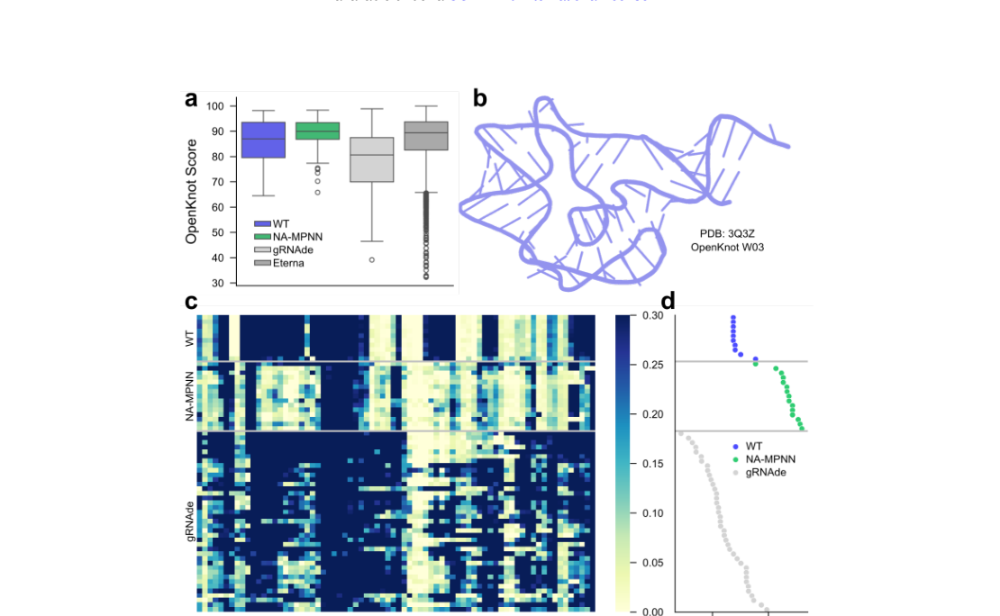
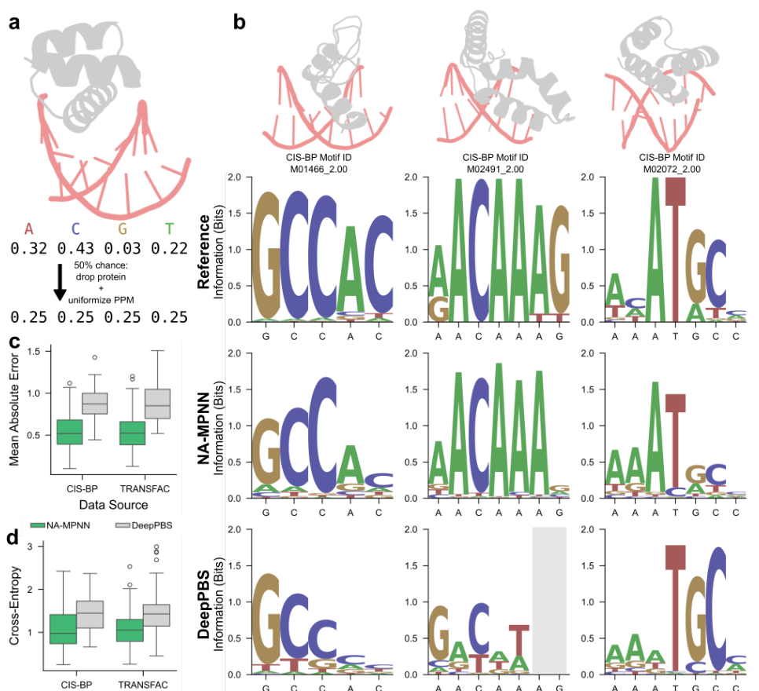

# RNA sequence design and protein–DNA specificity prediction with NA-MPNN

### 原文链接：[全文](https://doi.org/10.1101/2025.10.03.679414)

作者：Andrew Kubaney, Andrew Favor, Lilian McHugh, ..., David Baker

bioRxiv，2025 年 10 月 4 日

---
**导读**

ProteinMPNN 改变了蛋白质序列设计的范式，但核酸领域一直缺乏同等水平的通用逆折叠工具。Baker 实验室推出的 **NA-MPNN（Nucleic Acid MPNN）** 将 ProteinMPNN 的消息传递架构扩展到蛋白质、DNA 和 RNA 的统一图表示中，同时解决了两个长期被分开处理的问题：RNA 序列设计和蛋白-DNA 结合特异性预测。在计算基准和 OpenKnot 社区实验竞赛中，NA-MPNN 均超越了此前的专用工具。

## 一、研究问题

核酸逆折叠——给定三维骨架结构，预测最可能稳定折叠成该结构的核苷酸序列——是生物分子设计中的一类核心计算问题。其应用场景覆盖两个长期被分开研究的领域：一是 RNA 序列设计（为目标骨架结构找到合适的 A、C、G、U 排列），应用于适配体、核酶、CRISPR guide RNA scaffold 和人工核糖体元件的从头设计；二是蛋白-DNA 结合特异性预测（给定蛋白-DNA 复合物的固定构象，预测 DNA 每个位置上蛋白偏好的碱基），应用于转录因子特异性分析、DNA 结合蛋白设计和基因编辑工具的靶点预测。

然而，此前的深度学习方法要么专注于 RNA 设计（如 gRNAde、RhoDesign），要么专注于蛋白-DNA 特异性（如 DeepPBS），缺乏能够统一表示蛋白质和核酸并同时处理两类任务的逆折叠模型。这种割裂不仅导致方法学分散，还严重限制了核酸模型的训练数据规模：截至 2025 年 1 月，PDB 中仅有约 8,961 条含 RNA 的结构条目，而含蛋白质的条目有 235,538 条——两者相差超过 26 倍。如果蛋白质和核酸能在同一模型中表示和联合训练，核酸相关的任务就有机会从海量蛋白质数据中获得跨类型迁移学习的收益。更根本地，RNA 序列设计和蛋白-DNA 特异性预测可以统一建模为「给定骨架几何，预测核酸碱基概率分布」这一共同范式。

## 二、方法核心：统一生物聚合物图表示

NA-MPNN 建立在 ProteinMPNN 的基础之上。ProteinMPNN 原本用于蛋白质逆折叠：每个氨基酸残基是一个图节点，空间接近的残基之间建立图边，通过消息传递整合局部几何环境，最后为每个位置预测合适的氨基酸类型。NA-MPNN 的核心创新在于将这一架构扩展为**统一的生物聚合物图表示**：每个节点可以是蛋白质残基、DNA 碱基或 RNA 碱基，同一张图可以同时表示单独的 RNA/DNA、蛋白-RNA 复合物、蛋白-DNA 复合物，乃至任意混合体系。边连接空间上最近的 32 个邻居，邻居搜索使用蛋白质的 Cα 原子和核酸的 C1' 原子作为代表。

模型的两个关键架构设计区别于原版 ProteinMPNN：

**显式聚合物类型嵌入**

每个节点获得一个 one-hot 类型标签（protein / DNA / RNA / unknown），取代了 ProteinMPNN 的零初始化节点特征。虽然网络理论上可以从骨架原子的缺失模式推断聚合物类型（例如 RNA 有 O2' 而 DNA 没有），但显式标注大幅加速了学习收敛。

**DNA/RNA 共享碱基词表**

核酸输出不区分脱氧核糖形式和核糖形式：A/DA 共享一个 token，C/DC、G/DG、T/DT(U) 各共享一个，另加一个未知核酸 token DX/RX。这样做可以让 DNA 和 RNA 的训练数据互相增益——考虑到 RNA 结构数据的稀缺性，这种跨类型的数据共享尤为关键。聚合物类型嵌入提供了区分 DNA 与 RNA 上下文所需的信息。训练过程中注入 σ = 0.1 Å 的各向同性高斯噪声以抑制对晶体人为因素的过拟合，标签平滑的概率质量在聚合物类别内重分配（蛋白质和核酸之间不交叉），保证蛋白节点不会被分配核酸 token。

边特征由两个节点之间所有骨架原子对的成对距离经径向基函数（RBF）编码得到，捕捉精细的局部几何关系。蛋白质节点使用 N、Cα、C、O 和虚拟 Cβ 五个原子（与 ProteinMPNN 相同）；核酸节点使用磷酸原子（P、OP1、OP2）、糖环原子（C1'–C5'、O3'–O5'，RNA 还有 2'-OH 上的 O2'）和一个虚拟碱基侧链 N 原子（模拟蛋白质虚拟 Cβ 的设计思路）。这一骨架原子集合的选择至关重要：模型主要依赖骨架几何来推断碱基偏好，不读取真实碱基或蛋白侧链的完整原子结构。这既避免了信息泄露——模型无法"偷看"真实碱基的化学身份来做出预测——也使其能在待设计序列完全未知的情况下工作。编码器和解码器的架构与 ProteinMPNN 和 LigandMPNN 保持一致，解码器使用随机顺序的自回归机制，支持设计时部分固定序列。

虽然设计模型和特异性模型共用相同的架构，但它们分别训练、使用不同的监督信号和数据增强策略。设计模型的训练目标是晶体结构中的真实序列（经标签平滑的 one-hot），鼓励网络为每个位置提出一条最佳序列；特异性模型的训练目标是实验测定的位置概率矩阵（PPM），来自 SELEX、蛋白结合微阵列（PBM）等结合偏好测定实验以及 CIS-BP 和 TRANSFAC 数据库中 RFNA/RFAA 蒸馏得到的 PPM。

特异性模型还使用了专门的数据增强：对于蛋白-DNA/RNA 复合物，以 50% 概率随机丢弃蛋白链并将所有核酸位置改为均匀 PPM（0.25×4），教导网络识别哪些碱基偏好确实来自蛋白接触而非核酸骨架本身的偏好；距离蛋白侧链原子超过 5 Å 的非界面 DNA 位置也被设为均匀 PPM，聚焦学习真正受蛋白接触调控的碱基偏好。这些精心设计的数据增强策略帮助网络准确区分"蛋白接触诱导的碱基偏好"和"核酸骨架几何本身的碱基偏好"，是特异性模型取得显著提升的关键因素。

训练数据方面，两个模型都使用 PDB 中含至少一条核酸链、分辨率 ≤ 3.5 Å、总聚合物长度 ≤ 6,000 残基的结构。设计模型的核酸链按 80% 序列同一性聚类，完整聚类留出作为测试集，确保严格的序列级独立性；特异性模型的蛋白链按 40% 序列同一性聚类，测试集包含 228 个具有实验 PPM 的 RFNA/RFAA 蒸馏复合物。

## 三、看图说话

### Figure 1 · 统一的生物聚合物图表示

**这张图想回答：**NA-MPNN 怎样把蛋白质、DNA、RNA 编码进同一张图？

{: width="1130" height="460" loading="lazy" decoding="async"}

*Figure 1. NA-MPNN 架构。(a) 输入可为蛋白/DNA/RNA 或其混合复合物骨架。(b) 构建统一图，节点带聚合物类型嵌入、边为骨架原子距离的 RBF 编码。(c-d) MPNN 编码器-解码器，输出蛋白与核酸的联合词表。*

在 ProteinMPNN 基础上，**每个节点可以是蛋白残基、DNA 碱基或 RNA 碱基**，同一张图能表示单独核酸、蛋白-RNA、蛋白-DNA 乃至任意混合体系，边连空间最近的 32 个邻居。

两个关键设计：**显式聚合物类型嵌入**（protein/DNA/RNA/unknown 的 one-hot，加速收敛）和 **DNA/RNA 共享碱基词表**（A/DA 共用一个 token 等，让稀缺的 RNA 数据能借蛋白和 DNA 数据增益——PDB 里含 RNA 的结构只有含蛋白的约 1/26）。模型只读骨架几何、不看真实碱基，避免信息泄露。

### Figure 2 · 计算序列设计性能

**这张图想回答：**NA-MPNN 设计的 RNA 序列，在结构保真度上比专用 RNA 模型强多少？

{: width="1130" height="904" loading="lazy" decoding="async"}

*Figure 2. 计算序列设计性能。(a) 蛋白条件下的 RNA 逆折叠示例。(b) 四类上下文的序列恢复率。(c-d) 与 gRNAde、RhoDesign 的对比。(e-h) AF3 预测的 OpenKnot 分数、C1'-RMSD、pLDDT。*

* **Panel b**：四类上下文（DNA-only 57.4%、RNA-only 60.5%、蛋白中的 DNA 58.6%、蛋白中的 RNA 55.4%）恢复率接近，说明统一表示能适应不同聚合物组合。RNA 单体上 58.0%，超过 gRNAde（51.7%）、略低于 RhoDesign（66.7%）。
* **Panel e–h 是关键**：序列恢复率不是最高，但**结构保真度明显最好**——假结测试集上 NA-MPNN 的 OpenKnot 分数中位 83.2（gRNAde 81.7、RhoDesign 72.9），AF3 预测 C1'-RMSD 9.0 Å（vs 11.6 / 22.6 Å）。设计的最终目标是折叠对，不是字面匹配天然序列。

### Figure 3 · OpenKnot 竞赛的湿实验验证

**这张图想回答：**在真实的 OpenKnot 实验竞赛里，NA-MPNN 和人类玩家比如何？

{: width="1110" height="684" loading="lazy" decoding="async"}

*Figure 3. OpenKnot 竞赛实验验证。(a) 12 个 puzzle 的实验 OpenKnot 分数分布。(b-c) W03 puzzle 的骨架与 SHAPE-Seq 反应性热图。(d) 各方法的分数与 SHAPE 一致性。*

竞赛对 12 个固定骨架靶标设计 RNA，合成后用 SHAPE-Seq 化学探测验证二级结构（0–100 分，越高越一致）。NA-MPNN 每靶标提交 10–15 条，**12 个 puzzle 中位实验分 89.9，是所有自动化方法里最高的**（gRNAde 80.7、野生型 87.0），与 Eterna 人类玩家的 89.4 相当。计算上的优势真实转化成了 RNA 折叠的正确性。

### Figure 4 · 蛋白-DNA 结合特异性预测

**这张图想回答：**同一个模型预测蛋白-DNA 结合特异性，比专用的 DeepPBS 准吗？

{: width="966" height="880" loading="lazy" decoding="async"}

*Figure 4. 固定构象的蛋白-DNA 特异性预测。(a) 训练用的数据增强（随机丢弃蛋白、位置改为均匀 PPM）。(b) Reference / NA-MPNN / DeepPBS 的 motif logo 对比。(c-d) CIS-BP 与 TRANSFAC 上的 MAE 与交叉熵。*

* **Panel a** 的数据增强很巧妙：以 50% 概率丢掉蛋白链、把核酸位置改成均匀 PPM，教网络分清「碱基偏好是来自蛋白接触，还是核酸骨架本身」。**Panel b** 的 motif logo 里 NA-MPNN 比 DeepPBS 更接近 Reference。
* **Panel c/d**：228 个复合物上 NA-MPNN 全面优于 DeepPBS——综合中位 **MAE 0.53（DeepPBS 0.86）、交叉熵 1.00（1.44）**。而且它只用蛋白和 DNA 的骨架坐标、不读蛋白侧链，可以在序列设计早期就当碱基偏好的快速初筛。

## 四、核心贡献总结

NA-MPNN 的贡献可以归纳为三点。

**把蛋白、DNA、RNA 统一进一张图。**在 ProteinMPNN 的消息传递架构上，用聚合物类型嵌入 + DNA/RNA 共享碱基词表，让稀缺的 RNA 数据能从海量蛋白和 DNA 数据里借力，还把 RNA 序列设计和蛋白-DNA 特异性预测这两个长期分开的问题统一成「给定骨架几何、预测核酸碱基分布」。

**RNA 设计重结构保真而非字面恢复。**序列恢复率不是最高，但折叠后更接近目标结构，**OpenKnot 实验竞赛 12 个 puzzle 中位分 89.9，自动化方法第一，与人类玩家持平**。

**只用骨架就把特异性预测做得更准。**228 个复合物上综合 **MAE 0.53、交叉熵 1.00，全面优于专用的 DeepPBS**；不读侧链、无信息泄露，可当序列设计早期的碱基偏好初筛。

## 五、局限与展望

NA-MPNN 当前为 RNA 设计和蛋白-DNA 特异性分别训练了两个模型变体（共享架构但使用不同的监督信号和数据增强策略），尚未探索单一模型同时处理两个任务的可能性。RNA 结构数据的稀缺性仍然是核心瓶颈：PDB 中 RNA 条目不足蛋白质的 4%，严重限制了模型对复杂 RNA 三级结构、非常规碱基对和长距离碱基相互作用的学习能力。在 RNA 单体测试集上 NA-MPNN 的序列恢复率低于 RhoDesign，可能与后者使用了更丰富的结构特征有关。此外，NA-MPNN 仅做固定骨架上的序列设计，本身不生成新骨架，需要与上游的骨架生成工具（如 RFDpoly）配合使用。作者已展示 NA-MPNN 与 RFDpoly 核酸骨架扩散生成器联合产出的从头 RNA 和蛋白-DNA 复合物能通过电子显微镜验证设计结构与预测结构的一致性，表明该流水线具有实际应用潜力。未来方向包括扩展到 RNA 结合蛋白特异性预测、单链 DNA 的骨架条件序列设计，以及蛋白-核酸复合物中蛋白链和核酸链的联合序列优化，实现真正意义上的跨类型生物聚合物设计。

## 通讯作者介绍

David Baker 教授，华盛顿大学生物化学系和蛋白质设计研究所（Institute for Protein Design, IPD）所长，霍华德·休斯医学研究所（HHMI）研究员，2024 年诺贝尔化学奖得主。Baker 教授领导开发了 Rosetta 蛋白质建模软件套件以及 ProteinMPNN、LigandMPNN、RFdiffusion 和 RoseTTAFold 系列工具，是计算蛋白质设计这一领域的奠基人。第一作者 Andrew Kubaney 是华盛顿大学分子工程、生物化学和物理学方向的研究生，在 IPD 从事核酸逆折叠和序列设计研究。共同一作 Andrew Favor 同为 IPD 分子工程方向研究生。Cameron Glasscock 是 Rice University 生物科学系研究人员，专注于核酸设计从计算到实验的完整验证流程。Justas Dauparas 是 ProteinMPNN 和 LigandMPNN 的核心开发者，为 NA-MPNN 的架构设计和代码实现提供了最直接的技术基础和经验积累。

## 引用

Kubaney, A., Favor, A., McHugh, L., Mitra, R., Pecoraro, R., Dauparas, J., ... & Baker, D. (2025). RNA sequence design and protein–DNA specificity prediction with NA-MPNN. bioRxiv. https://doi.org/10.1101/2025.10.03.679414
