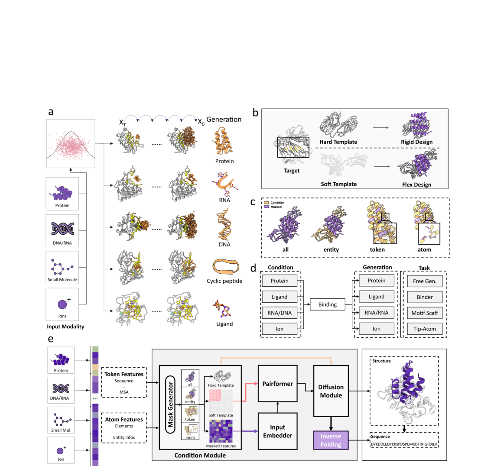
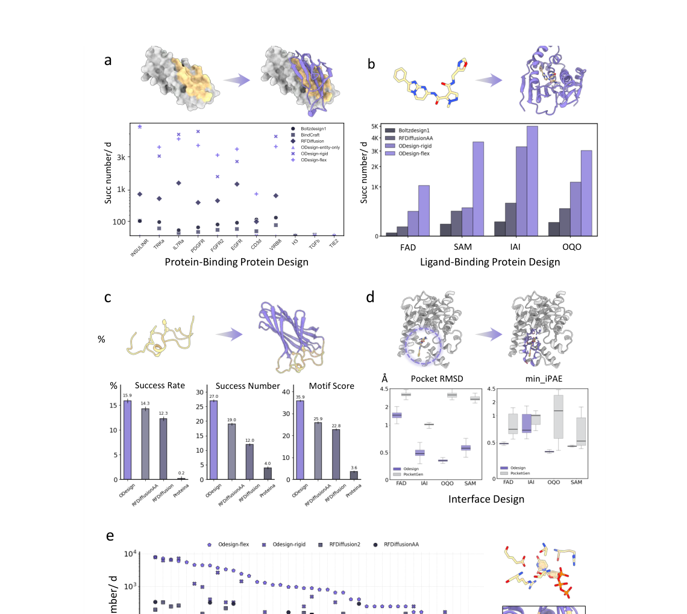
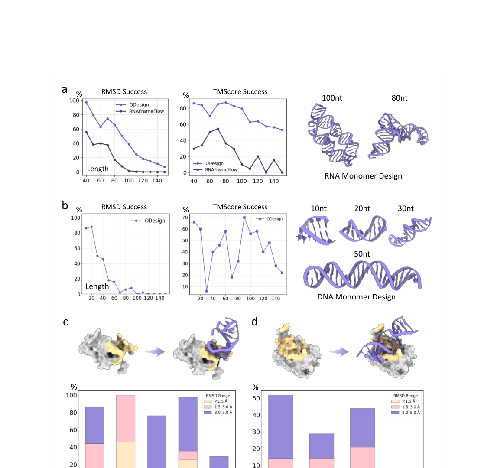
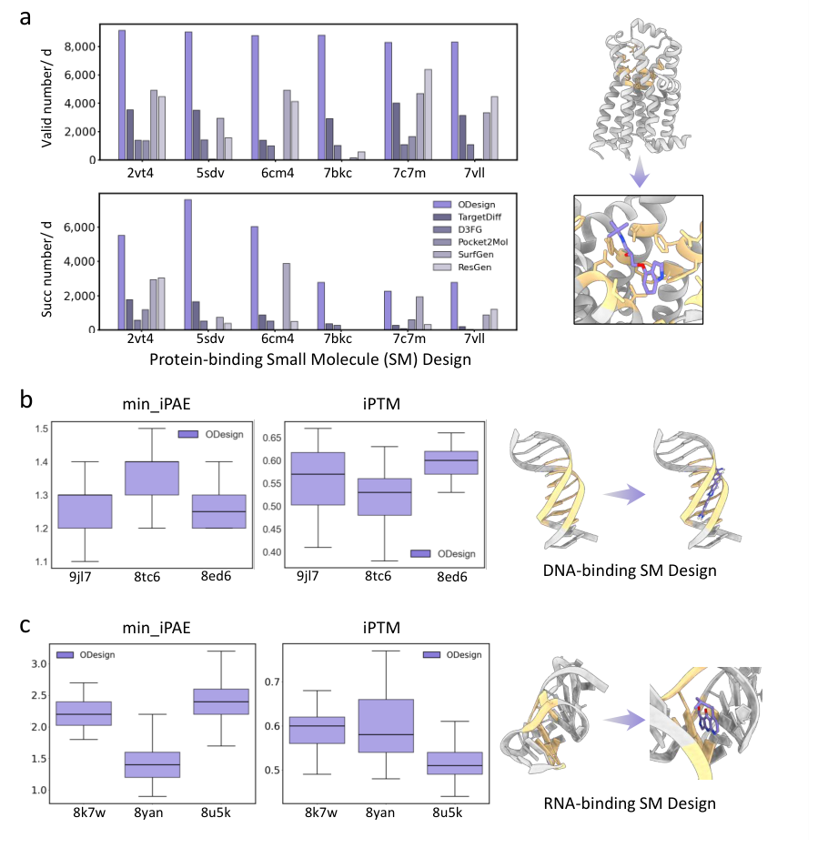

# ODesign: A World Model for Biomolecular Interaction Design

### 原文链接：[全文](https://doi.org/10.48550/ARXIV.2510.22304)

作者：Odin Zhang, Xujun Zhang, Haitao Lin, ..., Shuangjia Zheng

arXiv，2025 年

---
**导读**

现有分子设计模型通常只能处理单一分子类型或单一任务——RFDiffusion 设计蛋白质，TargetDiff 设计小分子，RNAFrameFlow 设计 RNA。但真实的生物系统是多模态的：蛋白质、DNA、RNA、小分子和离子共同形成复杂的相互作用网络。这篇文章提出了 **ODesign——第一个同时覆盖蛋白质、RNA、DNA、小分子和离子的跨模态全原子生成模型**。ODesign 将不同模态的化学基本单位抽象为统一的生成 token，通过任务导向的多粒度掩码策略，用同一个模型完成从蛋白质结合剂设计到核酸适配体设计、从 motif scaffolding 到小分子生成的多种任务。在 11 个基准任务上，ODesign 在保持或超越专用模型精度的同时，实现了数量级的计算吞吐量提升，使大规模候选生成和实验筛选成为可能。

## 一、研究问题

蛋白质设计领域近年来取得了巨大进展：RFDiffusion 可以从头生成蛋白质骨架和结合剂，RFDiffusion-AA 和 RFDiffusion2 扩展到配体结合蛋白和原子级 motif scaffolding，BindCraft 和 BoltzDesign 也各有突破，ResGen 和 TargetDiff 等方法专注于蛋白质口袋中的小分子生成，RNAFrameFlow 和 RDesign 则针对 RNA 结构设计。但每种模型都局限于特定的分子类型和任务类型，覆盖的只是分子设计全景中的一小块。当研究者需要为一个蛋白质靶标设计 RNA 适配体、为一段 DNA 设计结合小分子、为 RNA 靶标设计小分子药物、或在催化位点的原子级约束下重新设计蛋白质 scaffold 时，往往需要拼接多个独立工具——或者根本找不到合适的模型，因为像"蛋白质结合 RNA 从头设计"和"蛋白质结合 DNA 从头设计"这样的跨模态任务在已有模型的覆盖范围之外。

跨模态设计的核心困难在于不同分子的组织方式和化学规则差异很大。蛋白质由 20 种氨基酸残基组成，每个残基有固定的骨架（N-Cα-C-O）和可变的侧链；RNA 和 DNA 由 4 种核苷酸组成，每个核苷酸包含碱基、核糖和磷酸基团，具有独特的碱基配对和堆积规则；小分子是任意拓扑的原子图，可能包含各种环系统、杂原子、支链和手性中心，没有固定的"残基"或"单体"概念。如果只在原子层面统一生成，模型容易丢失"这是蛋白质还是 RNA 还是小分子"的模态先验，生成化学上不合理的结构；如果只在残基层面建模，又无法精确控制催化原子和配体的几何细节。此外，不同任务需要不同粒度的条件控制：结合剂设计需要实体级（整个蛋白质作为条件），motif scaffolding 需要残基级（保留功能基序），催化位点设计需要原子级（固定关键原子位置）。作者提出的核心目标是：**用同一个模型同时统一高层分子单位和底层全原子几何，在一个框架内覆盖所有模态和所有条件粒度的任务**。

## 二、方法核心：ODesign 的核心设计

ODesign 的架构建立在一个关键假设之上：**高性能结构预测模型（如 AlphaFold3）已经学习了丰富的跨分子相互作用规律，可以将这些结构知识迁移到分子生成任务**。因此，ODesign 以 AlphaFold3 风格的架构为基础，继承预训练的 Pairformer 参数，再针对生成任务进行微调。

模型由五个核心模块组成。**（1）嵌入层**编码分子类型、残基位置、链和实体标识、原子元素和名称、原子电荷、MSA 信息、共价键拓扑、以及两个 ODesign 特有的标志位——is_masked（是否需要生成）和 is_hotspot（是否为指定结合表位），提供丰富的化学和任务上下文。**（2）条件模块**支持两种结构注入方式：刚性靶标模式直接固定靶标的三维坐标，在扩散过程中保持条件原子不动；柔性靶标模式将靶标内部距离矩阵编码为 distogram 加入 Pairformer，保留结构拓扑但允许原子坐标在生成过程中与结合伙伴共同调整，模拟诱导契合效应。**（3）Pairformer**（继承自 AlphaFold3 预训练参数）建模分子间的成对相互作用表示。**（4）全原子扩散模块**通过上采样和下采样路径在 token 级和原子级之间切换，用条件扩散过程解码三维坐标。**（5）多模态逆折叠模块**从生成的骨架结构预测序列或原子类型——对蛋白质和核酸采用自回归序列设计，对小分子采用并行元素类型预测。

两个关键创新使跨模态统一成为可能。

**第一，统一生成 token。**ODesign 将不同模态的最小化学单位抽象为统一 token，通过后缀区分模态（-P 蛋白质、-N 核酸、-L 小分子）。这些 token 的含义是"这里需要生成一个属于指定模态、但具体类型尚未知的化学单位"，相当于一个占位符。生成过程采用两阶段策略：第一阶段用条件扩散模型生成三维骨架坐标，第二阶段通过逆折叠模块根据骨架结构预测具体类型——对蛋白质和核酸是自回归序列设计，对小分子是并行预测元素类型和化学属性。这种统一 token 空间让模型可以在训练时同时学习不同模态的结构规律，而不需要为每种分子类型设计独立的生成管道。

**第二，多粒度掩码策略。**ODesign 定义了四个层级的掩码，将看似不同的分子设计任务统一为"条件补全"问题：**all**——整个分子全部生成，对应自由生成任务；**entity**——掩盖复合物中的一个完整实体，保留另一个作为条件，对应结合剂设计（给定蛋白质靶标生成结合蛋白或 RNA）；**token**——保留部分功能残基，生成其余 scaffold，对应 motif scaffolding；**atom**——只保留少量关键催化或功能原子，重建整个分子，对应原子级功能位点设计。训练时，ODesign 在 PDB 的所有单体和复合物结构上随机采样不同层级的掩码，让模型同时学习所有任务类型。用户还可以指定结合表位（热点残基），训练时不同表位以一定概率被随机选中，使模型学习表位定位和关键相互作用模式的识别。

## 三、看图说话

### Figure 1 · ODesign 框架总览

**这张图想回答：**ODesign 怎样借 AlphaFold3 的预训练知识实现跨模态分子生成？

{: width="1140" height="1076" loading="lazy" decoding="async"}

*Figure 1. ODesign 全模态设计框架。模型接受蛋白、DNA、RNA、小分子、离子作为输入，经嵌入层、条件模块、Pairformer、全原子扩散和多模态逆折叠输出设计。*

核心假设：**AF3 这类结构预测模型已学到跨分子相互作用规律，可迁移到生成**。所以 ODesign 用 AF3 风格架构、继承 Pairformer 预训练参数再微调。条件模块支持刚性靶标（固定坐标）和柔性靶标（distogram 编码、允许诱导契合）两种模式。

两个关键创新：**统一生成 token**（不同模态的最小化学单位抽象成带 -P/-N/-L 后缀的占位 token，先生成骨架再逆折叠出类型）；**多粒度掩码**（all/entity/token/atom 四级，把自由生成、结合剂设计、motif scaffolding、催化位点设计统一成「条件补全」）。

### Figure 2 · 蛋白为中心的基准

**这张图想回答：**在蛋白结合蛋白、配体结合蛋白、motif scaffolding 等任务上，ODesign 的吞吐量和质量如何？

{: width="1140" height="1020" loading="lazy" decoding="async"}

*Figure 2. 蛋白为中心的基准。设计为紫色、靶标粉色、配体绿色。(a) 蛋白结合蛋白。(b) 配体结合蛋白。(c) motif scaffolding。(d) 界面设计。(e) 原子级 motif scaffolding。*

* **Panel a**：用「每 GPU 每天通过筛选的设计数」同时衡量吞吐和质量。ODesign 柔性模式在多数靶标上产出最多——相比需要数百次迭代的 BindCraft，**单次前向生成带来数量级吞吐提升**，一张 GPU 一天能出数百到数千个候选。
* **Panel b–e**：配体结合蛋白上柔性模式让口袋和配体共同调整（诱导契合）；motif scaffolding 的成功率/成功数/MotifScore 最佳或接近最佳；界面设计 pocket-RMSD 均值 2.24 Å 优于 PocketGen；原子级 motif scaffolding 的吞吐比 RFDiffusion2 **平均高 37.5 倍**，一次运行就能填满 96 孔板。

### Figure 3 · 核酸为中心的全新任务

**这张图想回答：**在 RNA、DNA 以及蛋白-核酸复合物这些以前缺工具的任务上，ODesign 行不行？

{: width="1140" height="1080" loading="lazy" decoding="async"}

*Figure 3. 核酸为中心的基准。(a) RNA 单体设计。(b) DNA 单体设计。(c) 蛋白结合 RNA 设计。(d) 蛋白结合 DNA 设计。*

* **Panel a RNA 单体**：10–150 nt，经 AF3 重折叠验证，**RMSD 和 TMScore 成功率几乎是 RNA 专用模型 RNAFrameFlow 的两倍**——跨模态模型学到的核酸规律比单模态专用模型还好。**Panel b DNA 单体**：ODesign 是第一个展示 DNA 从头生成的模型（此前无公开基线）。
* **Panel c/d**：蛋白结合 RNA / 蛋白结合 DNA 的从头设计此前几乎没有通用工具，ODesign 是开拓者——每个蛋白靶标生成数百条适配体、以蛋白为条件 AF3 重折叠，大部分达到合理的结合 RMSD。

### Figure 4 · 配体为中心的基准

**这张图想回答：**给蛋白、DNA、RNA 分别设计结合小分子，ODesign 表现怎样？

{: width="910" height="932" loading="lazy" decoding="async"}

*Figure 4. 配体为中心的基准。(a) 蛋白结合小分子设计（valid/success number 对比多种专用方法）。(b) DNA 结合小分子设计。(c) RNA 结合小分子设计（min_iPAE、iPTM）。*

* **Panel a**：蛋白结合小分子设计上，ODesign（紫）的有效数和成功数在六个靶标上大多明显高于 TargetDiff、D3FG、Pocket2Mol、SurfGen、ResGen 等专用方法。
* **Panel b/c**：更少见的 **DNA 结合小分子、RNA 结合小分子设计**，用 min_iPAE 和 iPTM 衡量结合质量，ODesign 都给出了合理结果——这些跨模态配体任务同样是此前缺少通用工具的方向。

## 四、核心贡献总结

ODesign 开辟了多个以前缺乏有效工具的新任务。**（a）RNA 单体设计。**生成 10–150 核苷酸的 RNA 结构，经 AF3 重折叠验证（成功标准：RMSD &lt; 5 Å 且 TMScore > 0.45），ODesign 在各长度区间上的 RMSD 成功率和 TMScore 成功率几乎是 RNA 专用模型 RNAFrameFlow 的两倍，证明一个跨模态模型可以学到比单模态专用模型更好的核酸结构规律。生成的 RNA 结构涵盖了发夹环、内环、多茎结构等多种拓扑。**（b）DNA 单体设计。**由于目前没有公开的 DNA 生成基线（已有核酸模型主要针对 RNA），ODesign 是第一个展示 DNA 从头生成能力的模型。在 20–140 核苷酸范围内，模型能生成多种长度和拓扑的 DNA 结构，经 AF3 重折叠验证具有合理的可折叠性。**（c）蛋白质结合 RNA 设计。**由于缺乏标准基准，作者从 2023 年 1 月 13 日之后发布的 PDB 蛋白-RNA 复合物中筛选了 10 个靶标，对每个靶标生成 400 条 RNA 适配体，以蛋白结构为条件用 AF3 重折叠，评估蛋白-配体整体 RMSD。在 5 个展示的靶标中，大部分候选 RNA 实现了 RMSD &lt; 5 Å 的结合姿态。**（d）蛋白质结合 DNA 设计。**在 4 个蛋白-DNA 复合物靶标上完成了类似的条件生成，同样展示了合理的结合质量和结构多样性。值得强调的是，蛋白质结合核酸的从头设计此前几乎没有通用工具，ODesign 是这一方向的开拓者。

这些结果的意义在于，ODesign 证明了一个统一模型确实可以在多种模态上达到或超过专用模型的水平。从统一的视角看，ODesign 将所有设计任务归结为同一个概念：在多模态复合物中，对被掩码的部分进行条件三维生成。蛋白结合剂设计是实体补全，适配体设计也是实体补全，小分子生成仍是实体补全，motif scaffolding 是局部 token 补全，催化位点设计是原子级补全——过去看起来彼此独立的任务，现在可以使用同一套数据表示、条件机制和生成架构来解决。刚性靶标模式与柔性靶标模式的对比揭示了一个重要规律：柔性模式在大多数任务上优于刚性模式，尤其是在小分子结合蛋白设计中效果显著，说明允许靶标在结合过程中发生构象调整（诱导契合效应）对于生成高质量设计至关重要。

## 五、局限与展望

本文的全部结果都来自计算指标（AF3 重折叠、RMSD、designability 等），缺少系统性的湿实验验证。论文中部分任务的测试集较小，且生成模型和评估模型可能共享一定的架构偏差。对化学可合成性、药代动力学和实际生物功能的控制也有待进一步发展。作者将 ODesign 定位为"world model"的愿景虽然宏大，但目前更准确的描述是：一个基于 AlphaFold3 式结构先验、采用统一 token 和多粒度掩码训练的全原子跨模态条件生成模型。它最令人印象深刻的贡献在于用实证数据证明了不同生物分子模态和不同控制尺度确实有可能被纳入同一个通用全原子生成框架，且不牺牲各任务上的精度。

## 通讯作者介绍

本文标注了四位通讯作者。郑双佳（Shuangjia Zheng）任职于上海交通大学未来技术学院与临港实验室，提出了本文的概念构想并提供了基础资源与研究方向上的指导；侯廷军（Tingjun Hou，浙江大学药学院）负责小分子建模方面的指导；孙思琦（Siqi Sun，上海人工智能实验室）负责核酸设计方向的指导；Pheng Ann Heng（香港中文大学计算机科学与工程学系）负责机器学习架构方面的指导。共同第一作者 Odin Zhang 提出研究构想并主导整个项目，与另一位共同第一作者 Xujun Zhang 共同设计了最初的模型架构。论文署名为"ODesign Team"，参与单位包括临港实验室、上海交通大学、浙江大学、复旦大学、香港中文大学、上海人工智能实验室以及多家北美机构。

## 引用

Zhang, O., Zhang, X., Lin, H., Tan, C., Wang, Q., Mo, Y., ... & Zheng, S. (2025). ODesign: A World Model for Biomolecular Interaction Design. arXiv. https://doi.org/10.48550/ARXIV.2510.22304
