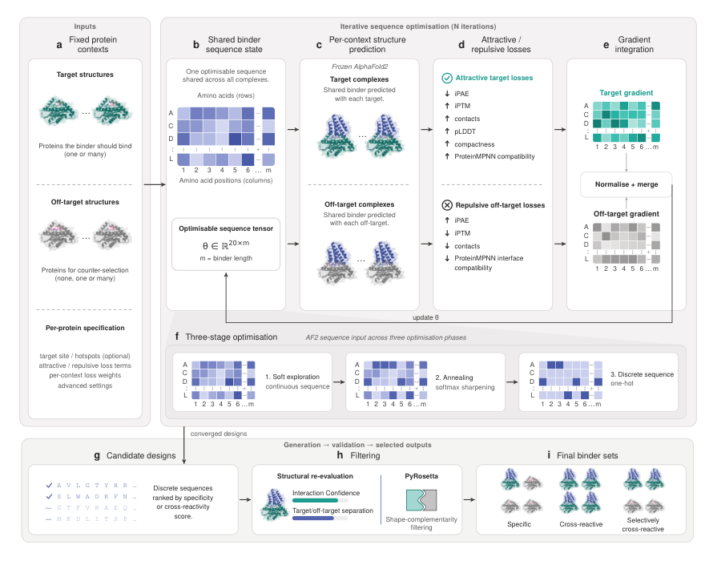
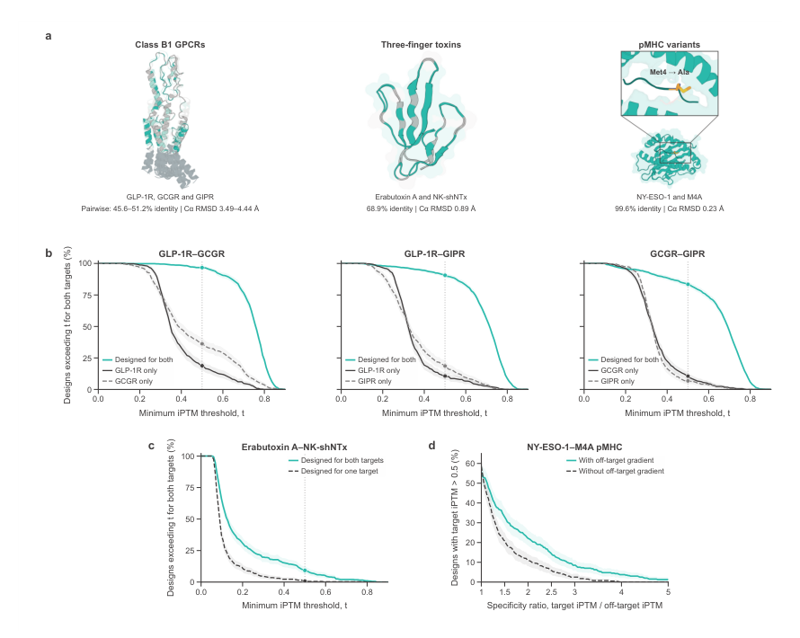
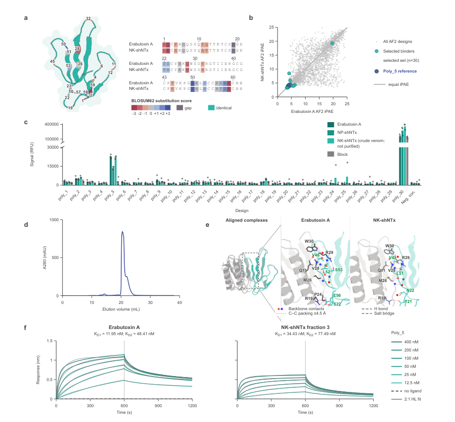
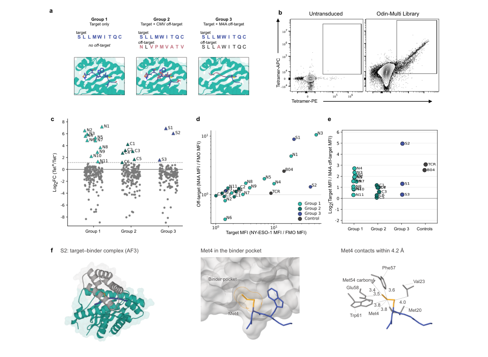

# Specificity-driven protein binder design with Odin-Multi

### 原文链接：[全文](https://doi.org/10.64898/2026.09.08.749745)

作者：Valentas Brasas, Charlotte R. Christensen, Kasper H. Björnsson, ..., Timothy P. Jenkins

bioRxiv，2026 年 9 月 9 日

---
一个好的蛋白结合物，既由它能结合什么决定，也由它不结合什么决定。肿瘤免疫治疗中的 pMHC 靶向分子如果同时识别健康组织上只差一个氨基酸的同源肽，可能导致严重毒性；抗蛇毒制剂如果只中和单个毒素而忽略同家族的其他成员，保护效力也会大打折扣。

丹麦技术大学（DTU）Valentas Brasas、Timothy P. Jenkins 等人提出了 **Odin-Multi**：基于冻结 AlphaFold2 的多情境蛋白结合物设计框架。它让同一条结合物序列同时面对多个靶点和非靶点进行优化——对希望结合的目标施加吸引性损失，对希望避开的非目标施加排斥性损失，在序列生成阶段就控制结合谱。

三个计算基准的结果：GPCR 双靶点交叉反应通过率 **83.5%–96.8%**（单靶点对照仅 6.8%–36.3%）；三指毒素双靶点设计从 0.8% 提高到 **9.2%**；pMHC 单残基级别特异性设计从 6.0% 提高到 **14.2%**。实验上，交叉反应性设计 Poly 5 以 11.95 nM 结合 Erabutoxin A、34.43 nM 结合候选 NK-shNTx 组分；特异性设计 S2 对只差一个氨基酸的 pMHC 实现了优于先前报道的抗原区分能力。

*注：本文为 bioRxiv 预印本，尚未经过同行评审。*

## 一、研究问题

当前主流的深度学习蛋白设计方法（RFdiffusion、ProteinMPNN、BindCraft 等）通常围绕单个 binder–target 复合物进行优化，擅长设计"能结合某个靶点"的蛋白。但实际应用往往需要控制更复杂的结合谱：

**特异性设计**：结合靶标 T，同时避免结合相似的非靶标 O。例如肿瘤新抗原 pMHC 与正常组织呈递的肽可能只差一个氨基酸。

**交叉反应性设计**：让同一个结合物同时识别多个相关靶点。例如蛇毒中含多种同源毒素，需要一个分子覆盖整个家族。

过去的做法是先设计单靶点结合物，再通过后处理筛选（结构过滤、计算交叉筛选、噬菌体 cross-panning、实验多靶点测定）来淘汰不符合要求的候选物。这种"先生成再淘汰"的策略只能从已有序列中挑选，无法改变设计过程本身会生成哪些序列。

Odin-Multi 的核心思路是：**把特异性和交叉反应性从筛选指标变成生成目标**，在序列优化阶段就让多个目标和非目标共同塑造结合物序列。

## 二、方法核心：把特异性与交叉反应性变成生成目标

*Figure 1. Odin-Multi 工作流程。(a) 输入多个目标和非目标蛋白结构。(b) 所有情境共享同一条可优化的结合物序列。(c) 冻结的 AlphaFold2 分别预测各复合物结构。(d) 对目标使用吸引性损失，对非目标使用排斥性损失。(e) 合并各情境梯度更新序列。(f) 三阶段序列优化。(g–i) 候选物排名、过滤与最终输出。*

Odin-Multi 在每条设计轨迹中维护一个共享的可优化结合物序列张量 θ ∈ R^(20×m)，其中 20 对应标准氨基酸，m 为结合物长度。这条序列分别与所有目标和非目标组成复合物，由冻结的 AlphaFold2 独立预测各复合物结构——同一条序列同时接受所有靶点和非靶点复合物的优化信号，各情境共同塑造最终序列。

**对目标的吸引性损失**鼓励形成高置信度复合物：降低界面 iPAE、提高 iPTM、增加界面接触、提升结合物 pLDDT 和紧凑度，可选的 ProteinMPNN/LigandMPNN 损失还约束序列与结构的相容性。**对非目标的排斥性损失**则恰好相反：提高 off-target iPAE、降低 iPTM、减少界面接触，阻止形成稳定的非目标复合物。

各情境产生的梯度可能互相冲突——有利于结合目标的氨基酸可能同时增强对非目标的亲和力。含有 off-target 的任务使用 **PCGrad** 来减轻梯度冲突。序列优化分三阶段：连续 logit 探索 → 温度退火的 softmax → straight-through one-hot 离散化，使系统从连续空间逐步过渡到真实蛋白序列。

候选序列生成后还需经过排名和过滤。交叉反应性任务按表现最差的目标 iPAE 排名，鼓励多靶点之间的平衡表现；特异性任务按目标 iPAE 与非目标 iPAE 的比值排名，奖励目标/非目标分离。排名靠前的设计再经过 AF3 重预测和 PyRosetta 形状互补性过滤，筛除预测偏差较大的候选物。

这个统一框架可以表达三种任务：**特异性**（吸引一个目标 + 排斥非目标）、**交叉反应性**（多个目标全部吸引）、以及**选择性交叉反应**（覆盖部分家族成员，排斥其余）。

## 三、看图说话

### Figure 1 · 多情境联合优化流程

**这张图想回答：**Odin-Multi 怎样让一条序列同时优化对多个靶标的结合和对非靶标的排斥？

{: width="890" height="700" loading="lazy" decoding="async"}

*Figure 1. Odin-Multi 工作流程。(a) 输入多个目标和非目标结构。(b) 所有情境共享同一条可优化序列。(c) 冻结的 AF2 分别预测各复合物。(d) 目标用吸引损失、非目标用排斥损失。(e) 合并梯度更新序列。(f) 三阶段优化。(g–i) 排名、过滤、输出。*

核心是维护一条共享序列 θ，分别和所有目标、非目标组成复合物，由冻结的 AF2 独立预测。**目标用吸引损失**（降 iPAE、升 iPTM、增界面接触），**非目标用排斥损失**（恰好相反）。各情境梯度可能冲突，用 PCGrad 缓解。

这把特异性/交叉反应性**从筛选指标变成了生成目标**——在序列优化阶段就让多个目标和非目标共同塑造序列，而不是「先生成再淘汰」。一个框架能表达三种任务：特异性（吸引一个+排斥非目标）、交叉反应（多个全吸引）、选择性交叉反应（覆盖部分家族、排斥其余）。

### Figure 2 · 三个系统的计算基准

**这张图想回答：**在 GPCR、三指毒素、pMHC 三个系统上，联合优化比单靶点设计好多少？

{: width="890" height="710" loading="lazy" decoding="async"}

*Figure 2. 计算基准。(a) 三个系统：B1 类 GPCR、三指毒素、pMHC 变体。(b) GPCR 双靶点（青=联合优化，灰=单靶点对照）。(c) 三指毒素双靶点。(d) pMHC 特异性（有无 off-target 梯度）。*

三类难度递增。**GPCR 双靶点交叉反应**（GLP-1R/GCGR/GIPR，序列一致性 45.6%–51.2%）：联合优化通过率 **83.5%–96.8%，单靶点对照仅 6.8%–36.3%**（纯计算，无实验验证）。

**三指毒素双靶点**：双靶点通过率从单靶点的 0.8% 提到 **9.2%**（约 12 倍）。**pMHC 单残基特异性**（只差 Met→Ala）：加 M4A counter-selection 使通过率从 6.0% 提到 14.2%，但 AF3 重评估差异减小（P=0.0612），说明这个计算效应对预测模型有依赖。

### Figure 3 · 双毒素结合物 Poly 5 的实验验证

**这张图想回答：**设计的双靶点三指毒素结合物 Poly 5，在 BLI 实验里真能结合两种毒素吗？

{: width="890" height="826" loading="lazy" decoding="async"}

*Figure 3. 双靶点三指毒素结合物 Poly 5 的实验验证。(a) 两种毒素序列比对。(b) 候选选择。(c) DELFIA 初筛。(d) 尺寸排阻色谱。(e) AF2 预测的交叉反应模式。(f) BLI 结合动力学。*

80 aa 的 minibinder，两个毒素权重相同，经 AF3 + PyRosetta 过滤后选 30 个做实验。Poly 5 对 Erabutoxin A 和含 NK-shNTx 的全毒液都产生 4 倍以上信号，BLI 拟合较高亲和力分量 **Erabutoxin A KD 11.95 nM、候选组分 34.43 nM**，都是纳摩尔级。结构预测显示它主要识别两个毒素共享的 β-折叠核心、外围适配差异——类似广谱中和抗体识别保守表位。注意只证明了结合、未证明中和功能。

### Figure 4 · 特异性结合物 S2 的实验验证

**这张图想回答：**针对只差一个氨基酸的 pMHC，设计的 S2 能不能真的把目标和非目标区分开？

{: width="1036" height="758" loading="lazy" decoding="async"}

*Figure 4. pMHC 靶向 minibinder 的实验验证。(a) 三种设计条件。(b) 流式分选。(c–e) 目标/非目标荧光的 fold-change。(f) S2–目标复合物的 AF3 结构与 Met4 口袋接触。*

三组条件：仅目标、目标+CMV、目标+M4A counter-selection。500 个 minibinder 以 CAR 样结构表达在 Jurkat T 细胞上、用四聚体 FACS 分选。前 20 富集设计中仅目标组贡献 11 个、M4A 组仅 3 个——**特异性约束降低了目标结合物产率**（M4A 组要多跑 8 倍轨迹才凑够库）。

但 M4A 组的 **S2 区分能力最好**：目标四聚体 MFI 高于此前报道的 NY1-B04，而对只差 Met→Ala 的 M4A 信号明显更低。**Panel f**：目标肽的 Met4 侧链插进 S2 表面一个口袋（与 Met20、Val23、Phe57 等接触），M4A 的 Ala 更小、填不满这个口袋——不过这个结构解释来自预测，尚未实验确认。「高目标亲和力 ≠ 高特异性」是这组的关键教训。

## 四、核心贡献总结

*Figure 3. 双靶点三指毒素结合物 Poly 5 的实验验证。(a) 两种毒素的序列比对。(b) 候选物选择。(c) DELFIA 初筛。(d) 尺寸排阻色谱。(e) AF2 预测的交叉反应结合模式。(f) BLI 结合动力学。*

**Poly 5：双靶点毒素结合物**

作者设计了 80 个氨基酸的 minibinder，两个毒素权重相同。经 AF3 和 PyRosetta 过滤后（两个靶点 ipSAE > 0.61，形状互补性 > 0.5），选出 30 个进行实验。在 30 个设计中，24 个的蛋白产量高于空载体阴性对照。DELFIA 初筛中，**Poly 5** 对 Erabutoxin A 和含 NK-shNTx 的 Naja kaouthia 全毒液产生高于封闭对照 4 倍以上的信号，另一个高信号设计 Poly 30 因封闭对照信号同样极高而被判断为非特异性吸附。实验命中率为 1/30（3.3%）。

由于纯化 NK-shNTx 无法获得，作者从眼镜蛇全毒液中通过 RP-HPLC 获得候选组分 fraction 3。BLI 使用 2:1 heterogeneous-ligand 模型拟合，较高亲和力分量为：Erabutoxin A KD1 = **11.95 nM**，fraction 3 KD1 = **34.43 nM**，均达到纳摩尔级。结构预测显示 Poly 5 主要识别两个毒素共享的 β-折叠表面核心，外围接触适配序列差异——类似广谱中和抗体识别保守表位的逻辑。

**S2：pMHC 特异性结合物**

pMHC 实验采用三组条件：仅目标（Group 1，166 个设计）、目标 + CMV counter-selection（Group 2，167 个）、目标 + M4A counter-selection（Group 3，167 个）。500 个 minibinder 以 CAR 样结构表达在 Jurkat T 细胞表面，使用 NY-ESO-1 pMHC 四聚体进行 FACS 分选，选出前 20 个富集最高的设计进行单克隆验证：Group 1 贡献 11 个，Group 2 贡献 6 个，Group 3 仅 3 个——特异性约束显著降低了目标结合物的产率。

这一数字分布本身就体现了重要的权衡：特异性约束提高了少数候选物的区分能力，但降低了目标结合物的总体产率。为组装足够大的实验库，M4A counter-selection 需要运行 1,700 条设计轨迹，相比 target-only 的 203 条增加了 8 倍。

但 Group 3 中的 **S2** 实现了最好的抗原区分。target-only 组中最强的目标结合物（如 N1、N3）对 M4A 也有较强信号——高目标亲和力并不等于高特异性。S2 的目标四聚体 MFI 高于先前报道的 de novo minibinder NY1-B04，同时对只差 Met→Ala 一个残基的 M4A 信号明显更低，目标/非目标区分能力优于 NY1-B04。AF3 预测显示目标肽的 Met4 侧链插入 S2 表面的一个口袋，与 Met20、Val23、Phe57、Glu58、Trp61 等残基形成接触；M4A 的 Ala 侧链更小，无法充分填充这个口袋，导致疏水堆积和形状互补性下降——这一结构解释来自预测，尚未通过实验确认。

**实验结果中需注意的限制**

每种设计模式只获得一个主要实验 lead（Poly 5 和 S2）。Poly 5 的第二个结合对象身份尚不能确定——fraction 3 的 MALDI-TOF 质量与候选蛋白理论值并不完全匹配，且文章只证明了结合，未证明毒素中和功能。S2 的结构特异性机制基于 AF3 预测。GPCR 基准展示了最强的计算效果，但完全没有实验验证。

## 五、局限与展望

传统蛋白设计的任务是"设计一个能结合 T 的蛋白"，Odin-Multi 将问题推广为"设计一个满足指定交互模式的蛋白"——吸引某些目标，排斥某些非目标。这使得交叉反应性和特异性成为设计过程中的优化信号，off-target 可以直接影响序列走向。

从优化角度看，交叉反应与特异性只是目标角色的不同组合：多个吸引目标、吸引 + 排斥、或三者同时存在。这种统一形式可以直接扩展到广谱抗毒素、多受体多重激动剂、肿瘤 pMHC 靶向、受体亚型选择性等实际场景。

更高特异性伴随着代价：三情境设计的单轨迹计算时间约为单情境的 3 倍（V100 GPU 上 59 min vs 20 min），而 M4A counter-selection 还需要运行更多轨迹才能收集到足够的候选物。方法的上限也受底层结构预测模型的限制——如果模型无法准确区分目标与非目标之间的结合差异，梯度优化也无法可靠学习这种差异，pMHC 基准在 AF3 重评估中效应减弱正反映了这一点。

off-target 的选择同样关键。CMV 非目标在 target-only 设计中本来就很少被识别（仅一个克隆出现交叉反应），因此加入 CMV counter-selection 的额外收益有限。理想的 off-target 应当在生物学上重要、在无约束设计中确实存在结合风险，且与目标足够相似以对设计形成有效压力。

## 通讯作者介绍

Valentas Brasas 和 Timothy P. Jenkins 均为本文通讯作者，任职于丹麦技术大学（Technical University of Denmark, DTU）生物技术与生物医学系及转化蛋白设计中心。Timothy P. Jenkins 的研究聚焦于蛇毒毒素组学和计算蛋白设计，其团队将深度学习蛋白设计方法应用于广谱抗蛇毒结合物的开发。Valentas Brasas 是该团队的博士研究人员，专注于基于 AlphaFold2 的蛋白结合物设计方法开发，Odin-Multi 即其主要工作之一。

## 引用

Brasas, V., Christensen, C. R., Björnsson, K. H., Møller, V. E., Scapolo, B., Benard-Valle, M., ... & Jenkins, T. P. (2026). Specificity-driven protein binder design with Odin-Multi. bioRxiv. https://doi.org/10.64898/2026.09.08.749745
