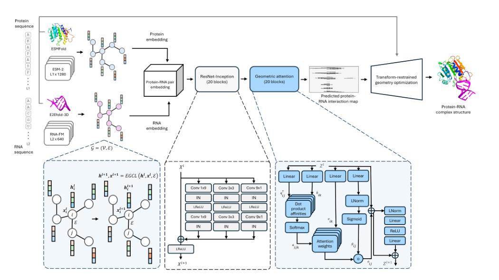
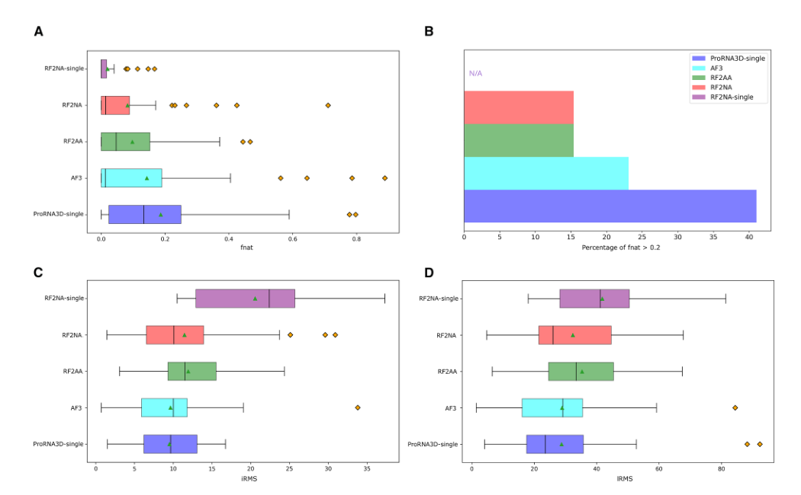
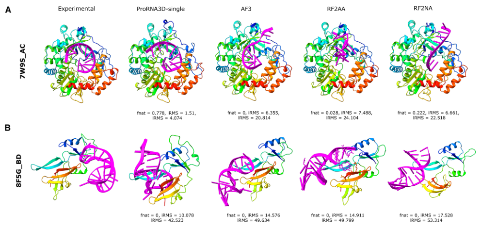
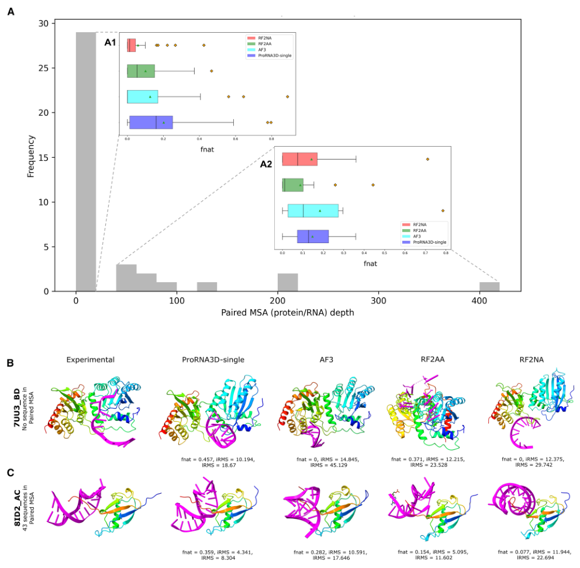
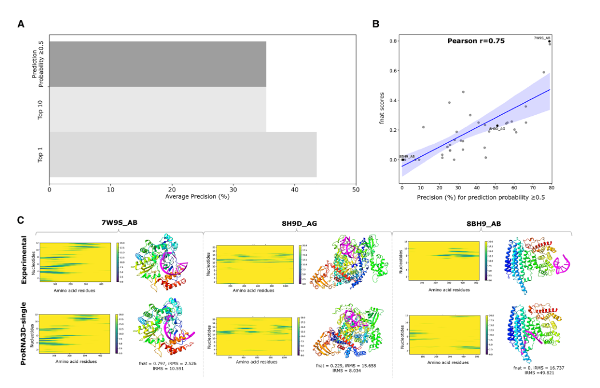
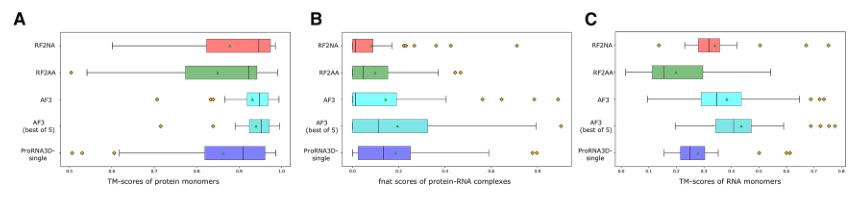
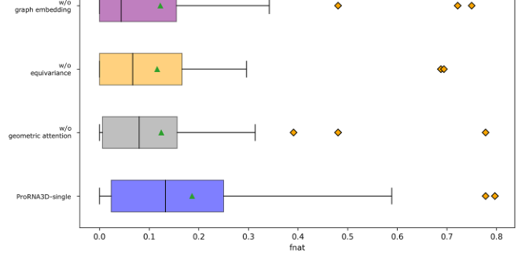

# Single-sequence protein-RNA complex structure prediction by geometric attention-enabled pairing of biological language models

### 原文链接：[全文](https://doi.org/10.1016/j.cels.2025.101400)

作者：Rahmatullah Roche, Sumit Tarafder, Debswapna Bhattacharya

Cell Systems，2025 年 10 月 15 日

---
蛋白质与 RNA 的复合物结构决定了转录调控、RNA 剪接、核糖体组装、病毒复制等过程的分子机制，但实验解析的蛋白质-RNA 复合物数量远少于蛋白质-蛋白质复合物。AlphaFold 3、RF2NA 和 RF2AA 等方法虽然能够预测复合物结构，但它们通常依赖多序列比对（MSA）来捕获共进化信号。问题在于：蛋白质-RNA 配对 MSA 在实际场景中普遍匮乏——在本文的 39 个测试靶标中，**28 个的配对 MSA 深度仅为 1**，也就是只有查询序列本身，没有额外的同源序列可供比对。

奥本大学 Debswapna Bhattacharya 团队提出了 **ProRNA3D-single**：通过几何感知配对蛋白质语言模型（ESM-2，6.5 亿参数）和 RNA 语言模型（RNA-FM，9900 万参数），在完全不使用 MSA 和模板的情况下预测蛋白质-RNA 复合物三维结构。核心策略是先预测跨分子的 Cα-C4′ 原子间距离分布图，再通过 PyRosetta 几何优化将距离约束转换为三维坐标。

在 Test_39 测试集上，ProRNA3D-single 的成功预测率（fnat > 0.2）达到 **41.03%**（16/39），分别比 AlphaFold 3 高约 18 个百分点、比 RF2NA 和 RF2AA 各高约 26 个百分点。更值得注意的是：RF2NA 去掉 MSA 和模板后（RF2NA-single），39 个靶标中没有一个达到成功标准。

## 一、研究问题

蛋白质-RNA 复合物结构预测面临两个关键瓶颈。第一，已知的高分辨率蛋白质-RNA 复合物结构非常有限——PDB 中蛋白质-RNA 复合物数量大约只有蛋白质-蛋白质复合物的 1/10，导致训练数据本身就很稀缺。第二，蛋白质与 RNA 的联合/配对 MSA 比蛋白质-蛋白质的配对 MSA 更难获得：RNA 序列数据库的规模和多样性远不如蛋白质序列数据库（Rfam 家族数约为 Pfam 的 1/10），而且很多蛋白质-RNA 的相互作用并不留下清晰的共进化印记，使得基于 MSA 的方法在这一场景下先天受限。

RF2NA 是当时（2024 年 7 月论文提交时）专门用于蛋白质-核酸复合物预测的代表性方法，但它在去掉 MSA 和模板后的 RF2NA-single 版本中表现急剧下降——39 个靶标全部低于 fnat > 0.2 的成功线。这表明简单地去掉 MSA 输入、只保留单序列并不能解决单序列预测问题——必须针对语言模型嵌入重新设计信息提取和界面建模的架构。

ProRNA3D-single 的核心提问是：能否将蛋白质语言模型和 RNA 语言模型有效配对，利用它们在大规模序列预训练中积累的生物学知识，在没有显式配对 MSA 的条件下直接预测蛋白质-RNA 复合物界面的三维结构？

这里有一个微妙的逻辑：蛋白质语言模型（如 ESM-2）和 RNA 语言模型（如 RNA-FM）各自在大规模单分子序列上预训练，学到的是各自分子类型内部的序列-结构关系——它们并没有被显式训练过蛋白质和 RNA 之间如何相互作用。ProRNA3D-single 的赌注是：这两类模型各自积累的生物学知识，经过适当的几何化配对（E(3) 等变图网络 + 三角注意力），足以推断出跨分子界面的距离关系。

## 二、方法核心：双语言模型配对 + 距离图 + PyRosetta 重建

**双语言模型嵌入与结构图构建**

蛋白质序列送入 ESM-2（6.5 亿参数），产出每个残基的 1280 维嵌入向量；RNA 序列送入 RNA-FM（9900 万参数），产出每个核苷酸的 640 维嵌入向量。同时，蛋白质经 ESMFold 预测单体三维结构（Cα 坐标），RNA 经 E2Efold-3D 预测单体结构（C4′ 坐标）。随后将嵌入向量放入以三维坐标为节点的图中——蛋白质图以 Cα 为节点、14 Å 为邻接阈值，RNA 图以 C4′ 为节点、20 Å 为邻接阈值（RNA 骨架间距更大，因此用更宽的阈值）。两个图分别通过 4 层 E(3) 等变图神经网络（EGNN，隐层维度 128），在保持旋转和平移等变性的前提下融合序列嵌入与空间信息。最后将蛋白质节点特征和 RNA 节点特征两两配对，形成 Lp × Lr 的成对表示矩阵。

**距离分布预测**

成对矩阵经过 20 块 ResNet-Inception 模块处理，每块包含 1×9、3×3、9×1 三种卷积核，分别沿 RNA 方向、局部二维区域和蛋白质方向捕捉不同尺度的界面模式。随后 20 块三角感知几何注意力模块引入多体关系约束：如果残基 i 接近核苷酸 j、核苷酸 j 又与核苷酸 k 有确定距离关系，那么 i-j 和 i-k 之间的距离预测不能互相矛盾。最终输出是 37 个距离区间的概率分布（2.5-20 Å），对应每对 Cα-C4′ 的预测距离。

**PyRosetta 几何优化**

将预测的距离分布转换为 10 个不同权重尺度的 BOUNDED AtomPair 约束，以单体预测结构为起点，通过 FastRelax 协议在约束驱动下迭代优化蛋白质与 RNA 的相对位置和方向。距离约束在全局空间中同时施加，让所有残基-核苷酸对的距离预测共同决定最终三维构型。

## 三、看图说话

### Figure 1 · 方法流程

**这张图想回答：**怎样把两种语言模型的嵌入和单体结构配对，最终预测跨分子距离图？

{: width="1050" height="590" loading="lazy" decoding="async"}

*Figure 1. ProRNA3D-single 流程。蛋白和 RNA 分别经语言模型和单体预测器得到嵌入与坐标，构建结构感知图、E(3) 等变图卷积配对，再经 ResNet-Inception 和几何注意力预测跨分子距离图，最后 PyRosetta 优化出复合物。*

**输入**：蛋白序列过 ESM-2（1280 维嵌入）+ ESMFold（Cα 坐标），RNA 过 RNA-FM（640 维嵌入）+ E2Efold-3D（C4′ 坐标）。关键是**同时用序列语义和空间几何**。

**处理→输出**：各自过 4 层 E(3) 等变图网络，蛋白节点和 RNA 节点两两配对成 Lp×Lr 矩阵，再经 ResNet-Inception 和三角几何注意力预测每对 Cα-C4′ 落入 37 个距离区间的概率，最后 PyRosetta 转成三维坐标。**与 AF3 端到端不同，它把问题拆成单体建模、距离预测、坐标重建三段**，各段可独立验证。

### Figure 2 · Test_39 整体性能

**这张图想回答：**不用 MSA，ProRNA3D-single 和用 MSA 的 AF3、RF2NA、RF2AA 比如何？

{: width="1050" height="650" loading="lazy" decoding="async"}

*Figure 2. Test_39 综合比较。(A) fnat 分布。(B) fnat > 0.2 的成功率。(C) iRMS。(D) lRMS。ProRNA3D-single（紫）整体最优。*

fnat 衡量界面接触预测对不对。**Panel B**：成功率（fnat > 0.2）**ProRNA3D-single 41.03%，AF3 约 23%，RF2NA/RF2AA 约 15%，RF2NA-single（去 MSA）0%**——后者全面崩溃，证明「去掉 MSA 不改架构」行不通。iRMS、lRMS 两个互补指标上 ProRNA3D-single 中位数也最低。最佳案例 7W9S（肠道病毒复合物）fnat 0.778，失败案例 8F5G（β-富集蛋白）所有方法都是 0。

### Figure 3 · 两个代表性案例

**这张图想回答：**在具体复合物上，各方法预测的结构和实验结构贴合得怎样？

{: width="992" height="472" loading="lazy" decoding="async"}

*Figure 3. 两个代表案例（7W9S_AC、8FSG_BD）上 ProRNA3D-single 与 AF3、RF2AA、RF2NA 的预测结构，标注各自 fnat / iRMS / lRMS。*

最左是实验结构，右边四列是各方法。**7W9S_AC** 上 ProRNA3D-single 的 **fnat 0.778、iRMS 1.51 Å**，RNA（洋红）位置与实验基本重合，而 AF3/RF2AA/RF2NA 的 RNA 都明显错位（fnat 0–0.22）。**8FSG_BD** 是公认难例，四个方法 fnat 全为 0、RNA 位置全错——这类 β-富集折叠在训练数据里太少。

### Figure 4 · 没有 MSA 时优势最大

**这张图想回答：**配对 MSA 的深浅，怎样影响各方法的表现？

{: width="992" height="972" loading="lazy" decoding="async"}

*Figure 4. 进化信息对预测的影响。(A) 测试集配对 MSA 深度分布及按深度分组的 fnat。(B–C) 无配对同源序列的代表案例。*

* **Panel A**：39 个靶标里 **28 个配对 MSA 深度只有 1**（只有查询序列本身）。在这些没有共进化信号的靶标上，ProRNA3D-single（蓝）的 fnat 箱体明显高于依赖 MSA 的方法——如 7UU3 上它 fnat 0.5，而 AF3、RF2NA 只有 0.043。当 MSA 深度 > 1 的 11 个靶标上，AF3 靠 MSA 整体最好，ProRNA3D-single 仍排第二。

### Figure 5 · 距离图精度决定结构质量

**这张图想回答：**中间的距离图预测得准不准，和最终复合物质量关系有多大？

{: width="1050" height="680" loading="lazy" decoding="async"}

*Figure 5. 预测距离图精度与复合物质量的关系。(A) 不同置信度阈值下的精度。(B) 距离图精度与 fnat 的相关（Pearson r = 0.75）。(C) 三个代表案例的距离图与结构对比。*

* **Panel A**：按置信度取 Top-K 接触，Top-1 精度 43.59%、Top-10 35.39%，模型对最确信的预测确实更可靠。**Panel B**：距离图精度与最终 fnat 的 **Pearson r = 0.75**——距离图准，PyRosetta 就能重建出好结构；距离图错，物理优化也救不回。这验证了「先学好距离图、再用物理引擎重建」的分段设计。**Panel C** 把失败归因清楚地画出来：距离图里接触条带偏位，直接导致三维空间 RNA 放错方位。

### Figure 6 · 另一组指标上的对比

**这张图想回答：**换单体 TM-score、界面 fnat 等指标，各方法的强弱分别在哪？

{: width="856" height="200" loading="lazy" decoding="async"}

*Figure 6. 各方法对比。(A) 蛋白单体 TM-score。(B) 蛋白-RNA 复合物 fnat。(C) RNA 单体 TM-score。*

这张图点出一个关键对比：**AF3/RF2NA 的单体结构（A、C）预测通常比 ProRNA3D-single 更准，但复合物界面 fnat（B）反而更低**。说明复合物预测其实是两个相对独立的子问题——组分折不折得对、组分之间结合得对不对。ProRNA3D-single 的优势正在后者；端到端方法可能把单体损失权重给得太高、界面权重不足。

### Figure 7 · 消融：各模块缺一不可

**这张图想回答：**图嵌入、等变性、几何注意力，去掉哪个掉得多？

{: width="668" height="328" loading="lazy" decoding="async"}

*Figure 7. 消融研究。完整模型与去掉图嵌入、等变性、几何注意力的变体在 fnat 上的分布对比。*

完整模型平均 fnat 0.186。**去几何注意力降到 0.125（−33%）、去 E(3) 等变性降到 0.116（−38%）、去图嵌入降到 0.123（−34%）**。三组降幅相近，说明「语言模型嵌入的结构化利用（图嵌入+等变性）」和「距离预测的几何一致性（几何注意力）」同等关键，缺一不可。

## 四、核心贡献总结

ProRNA3D-single 回答了一个重要问题：蛋白质-RNA 复合物预测的瓶颈在哪里？答案有三层。第一，**界面预测才是核心难题**——单体折叠准确并不保证复合物准确，专门学习跨分子界面的方法在这一最终目标上更有优势。第二，在缺乏配对 MSA 时，蛋白质和 RNA 语言模型经过结构感知图嵌入和几何注意力的适当组织，可以成为共进化信号的有效替代。第三，明确的原子对距离图是连接深度学习预测与三维物理建模的关键中间表示——每个预测的距离值都有明确的物理含义（Cα 到 C4′ 之间的空间距离），可以直接与实验数据对照，不仅更易解释和调试，也方便在未来融合实验约束（如交联质谱给出的残基间距离上限，或 SHAPE 化学探针给出的 RNA 结构约束）来进一步提升精度。

在训练效率上，ProRNA3D-single 仅需单张 A100 GPU 约 3.5 天完成训练，远低于 AF3 的约 256 张 A100 训练约 20 天——这意味着学术实验室也能在合理的计算预算内训练和改进这一方法。从更广的角度看，ProRNA3D-single 展示了一条"用预训练语言模型替代稀缺共进化数据、用模块化几何深度学习替代端到端巨型模型"的技术路线。随着蛋白质-RNA 复合物实验数据的积累和语言模型规模的扩大，这种双语言模型配对加几何建模的范式有望在更多涉及跨分子相互作用的预测任务中发挥作用——例如蛋白质-DNA 复合物、RNA-RNA 相互作用、以及蛋白质与小分子 RNA（如 miRNA、siRNA）的结合模式预测，这些场景同样面临配对 MSA 稀缺的挑战。

## 五、局限与展望

Test_39 的样本量（39 个复合物）限制了统计推断的可靠性，结论的适用范围需谨慎推广。绝对准确率仍有提升空间——41.03% 的成功率意味着近 59% 的靶标未达到 fnat > 0.2，平均 fnat 仅为 0.186。训练数据中 β-富集型蛋白质-RNA 复合物严重不足，导致这类结构的界面预测全面失败（PDB 8F5G 所有方法 fnat 均为 0）——这提示蛋白质-RNA 预测领域需要更多覆盖不同蛋白质折叠类型的训练数据，仅靠当前的 PDB 数量可能不够。方法由多个独立模块串联组成（ESMFold、E2Efold-3D、ESM-2、RNA-FM、EGNN、距离预测网络、PyRosetta），各模块之间的误差逐步传递而无法通过端到端训练统一优化。

在公平性方面，若从 AF3 的五个输出模型中事后选择与真实结构最接近的那个（oracle selection），AF3 的 fnat 将优于 ProRNA3D-single——但实际预测时并不知道哪个模型最好，本文采用的是 AF3 默认首选模型进行比较。此外，ProRNA3D-single 预测的是蛋白质和 RNA 的相对位置，依赖单体结构预测的质量——当 ESMFold 或 E2Efold-3D 给出的单体结构本身有较大误差时，图神经网络接收到的空间信息就是不准确的，这种误差会传导到最终的界面距离图。作者分析了单体 TM-score 与复合物 fnat 的关系后发现两者并无强相关——这从另一个角度说明了当前方法对单体误差有一定的鲁棒性，但系统性的单体预测失败（如某些非典型 RNA 折叠）仍然是瓶颈。

## 通讯作者介绍

Debswapna Bhattacharya 为本文通讯作者，任职于奥本大学（Auburn University）计算机科学与软件工程系。他本科毕业于印度贾达普大学（Jadavpur University），在爱荷华州立大学取得博士学位，后在华盛顿大学 David Baker 实验室从事博士后研究。其团队长期聚焦于计算结构生物学，特别是蛋白质及蛋白质-核酸复合物的三维结构预测方法开发。此前曾发表 ProRNA3D 系列（最初版本使用 MSA 输入，本文的 single 版本是无 MSA 的扩展）和 DeepComplex 等工作，持续探索如何用深度学习方法从序列信息预测生物分子复合物的三维结构。本文首作 Rahmatullah Roche 是 Bhattacharya 实验室的博士生，也是 ProRNA3D 系列的主要开发者。

## 引用

Roche, R., Tarafder, S., & Bhattacharya, D. (2025). Single-sequence protein-RNA complex structure prediction by geometric attention-enabled pairing of biological language models. Cell Systems, 16, 101400. https://doi.org/10.1016/j.cels.2025.101400
