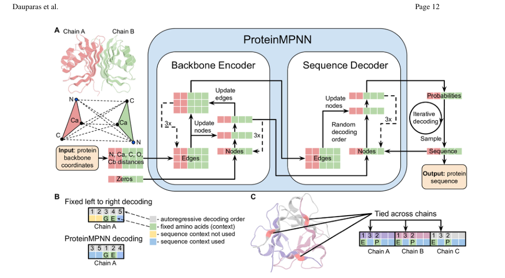
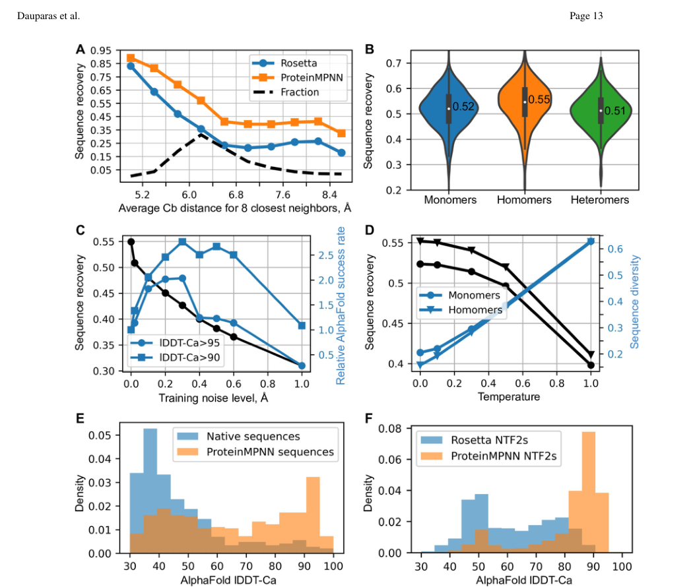
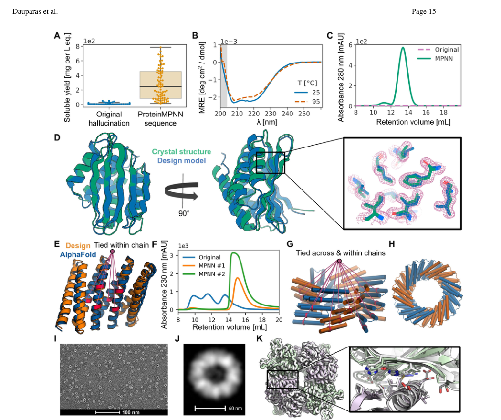
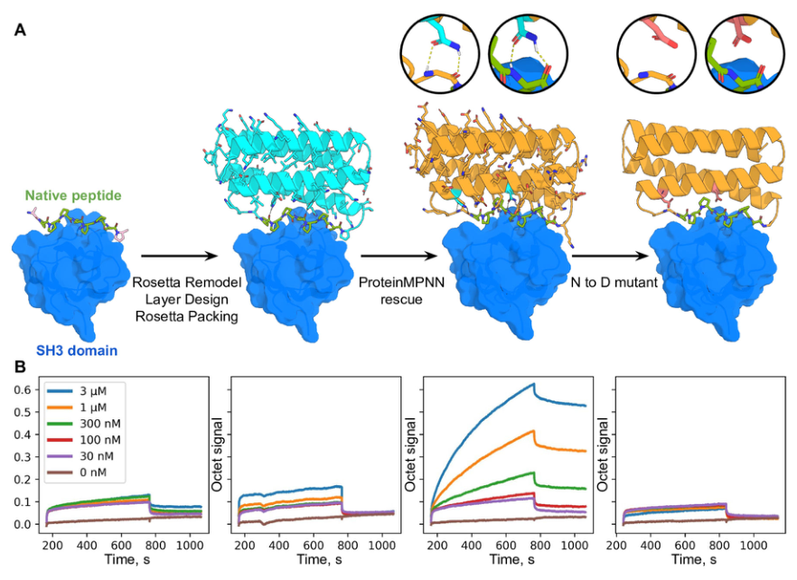

# Robust deep learning–based protein sequence design using ProteinMPNN

### Link: [full article](https://doi.org/10.1126/science.add2187)

Authors: J. Dauparas, I. Anishchenko, N. Bennett, ..., D. Baker

Science, October 7, 2022

---
**Overview**

Protein sequence design, which means finding an amino acid sequence that folds into a given target backbone, is the central problem of protein engineering. Traditional methods rely on physics-based energy functions such as Rosetta, which are computationally expensive and require expert manual tuning. **ProteinMPNN**, developed in David Baker's laboratory at the University of Washington, is based on a message-passing neural network. It speeds up design by two orders of magnitude, raises native sequence recovery from 32.9% to 52.4%, and systematically validates the correct folding and biological activity of the designed proteins by X-ray crystallography, cryo-EM and functional assays.

## Part 1: Research Question

One core sub-problem of protein design is known as 'inverse folding': given target three-dimensional backbone coordinates, find an amino acid sequence that folds into that structure. The problem is hard because one backbone usually corresponds to many viable sequences, so there is no unique answer; local residues interact with one another in complex spatial ways; and multimers require optimizing intra-chain and inter-chain interfaces at the same time. Traditional methods such as Rosetta cast this as a physical energy optimization problem, explicitly searching enormous numbers of side-chain rotamer combinations for the lowest-energy sequence. For a 100-residue protein, a single Rosetta design takes about 4.3 minutes (on a single CPU) and usually requires hand-crafted rules for hydrophobic residue distribution, interface constraints and the like. More fundamentally, physics-based methods optimize only the energy in the target conformation and cannot directly rule out all possible misfolded and aggregated states. In the Rosetta design workflow, restrictions on surface hydrophobic residues and the different treatment of core and boundary regions typically require extensive domain expertise, which greatly limits how widely the method can be adopted and how reproducible it is.

Deep-learning-based inverse folding methods had been proposed before ProteinMPNN, but they were mainly aimed at monomeric protein design, had limited applicability to multi-chain systems and symmetric structures, and lacked systematic experimental validation. The goal of ProteinMPNN was to build a general deep learning sequence design tool that satisfies two requirements at once: broad applicability across design scenarios including monomers, multimers, symmetric assemblies, nanoparticles and functional proteins; and systematic experimental validation of the correct folding and function of the designed proteins through crystallography, electron microscopy and biochemistry.

## Part 2: Methodology: The Core Method of ProteinMPNN

ProteinMPNN represents a protein as a spatial graph: each residue is a node, and spatially nearby residue pairs form edges. The model takes as input features the distances among the backbone atoms N, Cα, C, O and a virtual Cβ. Compared with earlier methods that use only Cα distances or dihedral angles, this rich representation of interatomic distances raises sequence recovery from 41.2% to 49.0%, the largest single contribution among all the model improvements. Adding edge feature updates in the encoder on top of this raises recovery further to 50.5%.

The network consists of 3 encoder layers and 3 decoder layers with a hidden dimension of 128, and each residue is connected to 32–48 spatial neighbors. The authors tested settings from 16 to 64 neighbors and found that performance saturates at 32–48 neighbors, indicating that amino acid choice is determined mainly by the local spatial environment. The encoder passes messages repeatedly over the graph so that each position acquires three-dimensional context such as whether it lies in the hydrophobic core, at an inter-chain interface or on the exposed surface; the decoder then generates the sequence step by step in an autoregressive manner. The training data comprise protein assembly structures in the PDB released before August 2021 with resolution better than 3.5 Å and fewer than 10,000 residues, clustered with MMseqs2 at 30% sequence identity into 25,361 clusters.

**Random decoding order** is one of ProteinMPNN's key innovations. Conventional autoregressive models generate sequences in a fixed N-to-C direction, so when generating positions near the front they cannot use information from functional sites already fixed near the back. In binder design, for instance, the target chain sequence is already determined and certain functional sites must be preserved, so only the remaining positions need to be designed. A model with a fixed decoding order struggles to make full use of such known information. ProteinMPNN samples the decoding order at random from all possible permutations during training, so at inference the decoding strategy can be chosen flexibly: fixed positions are supplied first as known context and skipped, and only the remaining positions are designed. This lets the model handle many practical requirements, such as preserving catalytic residues, fixing a ligand-binding motif, redesigning only part of a region, or designing a binding protein with the target chain held fixed.

For homo-oligomer design, ProteinMPNN offers an elegant mechanism for tying symmetric positions. Take a homotrimer: the amino acids at symmetric positions in the three chains must be identical. The model computes logits for the three equivalent positions separately from their own local three-dimensional environments, then averages them and samples from the combined probability distribution, assigning the same amino acid to all three symmetric positions at once. Measurements show that the **averaged logits** strategy gives a median recovery of 55% for homo-oligomers, better than the 52% obtained without symmetry constraints and the 53% obtained by averaging probabilities. The same tying mechanism is broadly applicable: internally repeating proteins can tie the corresponding positions of each repeat unit; cyclic oligomers can impose inter-chain symmetry and intra-chain repeat constraints simultaneously; the many equivalent subunits of a protein nanoparticle can share one sequence; and multi-state design can even be achieved by combining logits from different backbones with weights, using positive weights to encourage compatibility with the target conformations and negative weights to suppress unwanted states.

## Part 3: Key Figure Analysis

### Figure 1: Encoder-Decoder Architecture

**What this figure asks:** How does the ProteinMPNN architecture handle backbone geometry, and how does it generate sequences?

{: width="1050" height="580" loading="lazy" decoding="async"}

*Figure 1. The ProteinMPNN architecture. (A) Distances among N, Cα, C, O and a virtual Cβ are encoded and processed by a message-passing network. (B) The encoder-decoder framework, which supports random decoding order and tying of symmetric positions.*

The protein is represented as a spatial graph (residues as nodes, edges to neighbors), with the distances among N, Cα, C, O and a virtual Cβ as input. **This rich set of interatomic distances raises recovery from 41.2% to 49.0%, the largest single contribution among all the improvements.** There are 3 encoder layers plus 3 decoder layers, with 32–48 neighbors per residue.

Two key innovations: **random decoding order** (the generation order is sampled at random during training, so at inference known functional sites can be fixed first and the rest designed afterwards, supporting the preservation of catalytic residues, the design of binders with a fixed target chain and more) and **tying of symmetric positions** (logits are computed separately for symmetric positions in a homo-oligomer, then averaged before sampling, giving a median recovery of 55% versus 52% without constraints), which also extends to repeat proteins, nanoparticles and multi-state design.

### Figure 2: Computational Evaluation

**What this figure asks:** How does sequence recovery vary with training strategy and sampling temperature, and what is noise training good for?

{: width="1050" height="890" loading="lazy" decoding="async"}

*Figure 2. Computational evaluation of ProteinMPNN. (A) Recovery is higher than Rosetta's. (B) Effect of training with backbone noise. (C) Sampling temperature and sequence diversity. (D) Validation by AlphaFold structure prediction.*

* **Panel A**: on 402 monomer backbones, native sequence recovery is **52.4%, far above Rosetta's 32.9%** (90–95% in the deeply buried core and about 35% on the exposed surface). In speed terms, 100 residues take about 1.2 seconds, roughly 200 times faster than Rosetta.
* **Panel B**: training with backbone noise slightly lowers recovery on perfect structures, but **performs better on AlphaFold-predicted backbones and raises the success rate of designed sequences folding back to the target by a factor of 2–3**, so robustness matters more than recovery. **Panels C/D**: temperature controls diversity, and ProteinMPNN sequences are usually predicted back to the target backbone by AlphaFold with higher confidence (native sequences are also subject to functional and regulatory constraints, not just optimized for stability).

### Figure 3: Experimental Characterization

**What this figure asks:** Can the designed sequences really express solubly, resist heat and crystallize into the target structure?

{: width="1050" height="880" loading="lazy" decoding="async"}

*Figure 3. Structural characterization of ProteinMPNN designs. (A) Comparison of soluble expression. (B) Thermostability. (C) Crystal structures. (D) Nanoparticle assembly.*

The strategy is demanding: the authors deliberately chose proteins that had previously failed with Rosetta or AlphaFold designs, kept the backbones and changed only the sequences. Across 129 AlphaFold hallucination backbones, the original sequences were mostly insoluble (median 9 mg/L), whereas **after ProteinMPNN redesign, 73 of 96 expressed solubly with a median yield of 247 mg/L (about 27 times higher)**, and secondary structure was retained even at 95°C.

A crystal structure (PDB 8CYK, a novel 130-residue fold) is only 2.35 Å RMSD from the design target; for cyclic oligomers, 88% were soluble (versus 40% for Rosetta); and among nanoparticle designs, 13 formed assemblies of about 1 MDa with a crystallographic deviation of 1.2 Å. The entire sequence design process is fully automated and takes about 1 second per backbone.

### Figure 4: Functional Protein Design

**What this figure asks:** By preserving a functional motif and redesigning only the scaffold, can one design a protein with binding function?

{: width="882" height="642" loading="lazy" decoding="async"}

*Figure 4. Designing function with ProteinMPNN. (A) The design scheme: embed a proline-rich peptide in a helical bundle, redesign the scaffold, then make N→D mutations as a control. (B) Octet (BLI) binding curves at different concentrations.*

The hardest test: designing a protein that binds the human Grb2 SH3 domain, by embedding a proline-rich peptide motif into a helical bundle scaffold. The original Rosetta sequences showed no binding; after ProteinMPNN kept the backbone and the motif and redesigned only the surrounding scaffold, **BLI measured a binding signal stronger than that of the free peptide** (in the third panel of Panel B the signal rises clearly with concentration). The key control: mutating two Asn residues involved in the hydrogen bond network to Asp (N→D) **almost completely abolished the binding signal**, demonstrating that binding really depends on the specific interactions designed by ProteinMPNN rather than on non-specific adsorption.

## Part 4: Key Contributions

ProteinMPNN's contributions can be summarized in three points.

**Replacing physics-based energy functions with deep learning for sequence design.** Casting inverse folding as message passing on a backbone graph raises native sequence recovery **from Rosetta's 32.9% to 52.4% and runs about 200 times faster**, with no need for hand-crafted rules about hydrophobic distribution and the like.

**Random decoding order plus symmetry tying bring generality.** One model covers monomers, multimers, symmetric assemblies, nanoparticles, functional proteins, binders with fixed targets and more. Noise training makes designs more robust to coordinate perturbations and raises the success rate of folding back to the target by a factor of 2–3.

**A complete chain of experimental evidence.** Working deliberately on backbones whose designs had failed before and changing only the sequence, **soluble yield rose about 27-fold**, and crystal structures, nanoparticle assembly and SH3 binding function were all validated, forming a closed loop of 'sound design → improved metrics → expressible and folded → structure matches → function achieved'.

## Part 5: Limitations and Outlook

ProteinMPNN is aimed mainly at protein backbone and protein-protein interface design, and the original version does not explicitly model small-molecule ligands, metal ions or nucleic acids. In enzyme active site design or fine-grained ligand recognition, key functional residues usually have to be fixed and combined with other optimization methods. The model learns from about 25,000 clusters of protein structures in the PDB, so it inherits the preferences and coverage of that training data and may perform less well on extremely novel backbones far from the distribution of natural protein structures; that said, this paper tested a variety of non-natural systems including hallucinated novel backbones, nanoparticles and artificial binders, and the results show that generalization is quite strong. In addition, ProteinMPNN tends to generate highly stable sequences, whereas some biological functions require conformational flexibility, metastable states or particular catalytic geometries, so designs must take care to preserve these properties by fixing functional residues.

ProteinMPNN's influence on protein design has been profound. Together with structure prediction models it forms a closed-loop workflow: ProteinMPNN generates candidate sequences from a backbone, AlphaFold or RoseTTAFold checks whether a sequence folds back to the target structure, and computational filtering selects the most promising candidates for experiments. After the paper appeared, the authors' team followed the same technical route to develop LigandMPNN (adding small-molecule ligand modeling) and NA-MPNN (unifying protein and nucleic acid design), while ProteinMPNN itself became the most widely used sequence design tool in protein design pipelines, with code open-sourced on GitHub (github.com/dauparas/ProteinMPNN). The core contribution of this paper can be summarized as a complete chain of evidence: a sound model design → improved computational metrics → proteins that express and fold → experimental structures matching the design → the target function achieved.

## About the Corresponding Author

David Baker is the corresponding author of this paper; he is a professor in the Department of Biochemistry at the University of Washington, director of the Institute for Protein Design and a Howard Hughes Medical Institute investigator. Baker received his bachelor's degree from the University of Michigan and his PhD from the University of California, Berkeley. His research spans protein structure prediction, de novo protein design and computational enzyme design; he developed the Rosetta software suite and drove the development of a new generation of protein design tools such as ProteinMPNN and RFdiffusion, and he received the 2024 Nobel Prize in Chemistry for his pioneering contributions to computational protein design. The first author of this paper, Justas Dauparas, led the model design of ProteinMPNN and the comprehensive large-scale experimental validation during his postdoctoral work in the Baker laboratory.

## Citation

Dauparas, J., Anishchenko, I., Bennett, N., Bai, H., Ragotte, R. J., Milles, L. F., ... & Baker, D. (2022). Robust deep learning–based protein sequence design using ProteinMPNN. Science, 378(6615), 49-56. https://doi.org/10.1126/science.add2187
