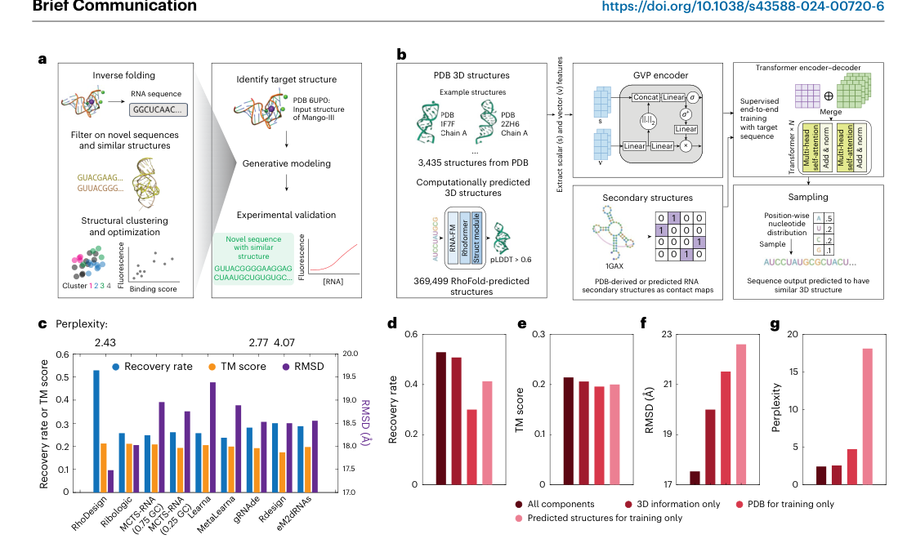
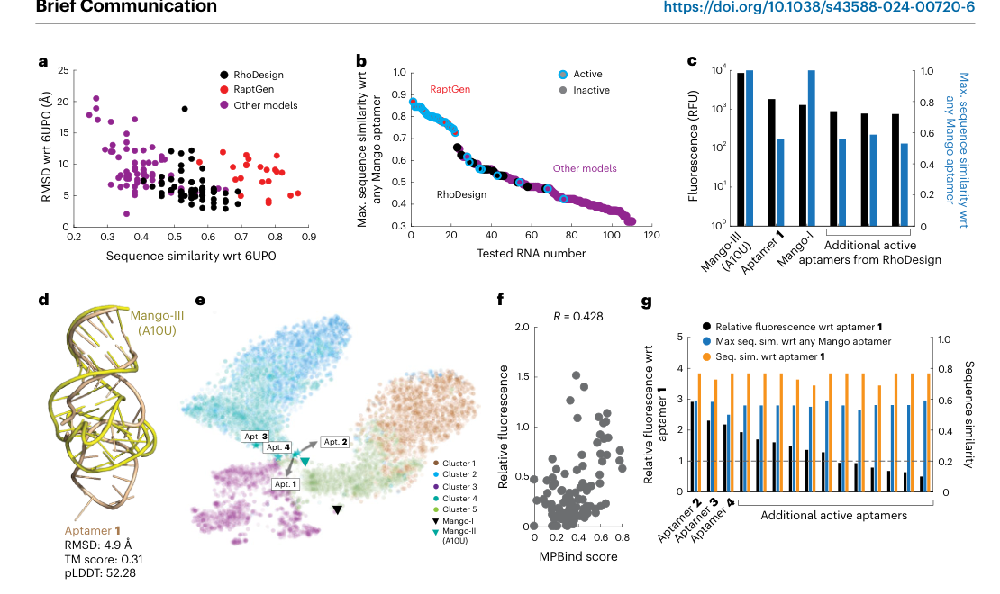

# Deep generative design of RNA aptamers using structural predictions

### Link: [full article](https://doi.org/10.1038/s43588-024-00720-6)

Authors: Felix Wong, Dongchen He, Aarti Krishnan, ..., James J. Collins

Nature Computational Science, November 2024

---
**Overview**

Traditional discovery of RNA aptamers relies mainly on SELEX experiments, which repeatedly screen huge random sequence libraries and consume a great deal of time and resources. This paper presents **RhoDesign, a structure-to-sequence deep learning platform that automatically generates RNA aptamers with novel sequences but similar structures, starting from the 3D backbone structure of a target RNA**. Taking the fluorogenic aptamer Mango-III as the target, the authors obtained 4 active aptamers from the 18 candidate sequences synthesized in the first round (a 22% hit rate); after one round of computational optimization, 15 of 20 candidates were active and 9 outperformed the initial best (a 75% hit rate). These new aptamers differ substantially from known Mango sequences, demonstrating that inverse folding from RNA 3D structure can enable large leaps through functional sequence space.

## Part 1: Research Question

RNA is a functionally diverse and programmable class of biomolecules: ribozymes catalyze chemical reactions, riboswitches sense metabolites and regulate gene expression, and aptamers bind proteins or small molecules with high specificity. Almost all of these functions depend heavily on RNA 3D structure, where specific base stacking, hydrogen-bonding networks and tertiary interactions together form the spatial scaffold required for function. In recent years, sequence-to-structure predictors such as RhoFold and AlphaFold 3 have made striking progress, moving RNA 3D structure prediction from infeasible to preliminarily practical. The authors propose a natural extension: if a given 3D structure is known to carry a particular function, can we work backwards and generate a batch of new RNAs with similar structures but different sequences? This is essentially the RNA counterpart of the inverse-folding idea from protein design: given a 3D backbone, solve for nucleotide sequences compatible with it. Compared with protein inverse folding (where ProteinMPNN, for example, must choose among 20 amino acids), RNA inverse folding looks easier because there are only four bases, A, U, G and C. In practice, however, the accuracy of RNA structure prediction itself remains the main bottleneck, and the scarcity of training data adds further difficulty to modeling.

Conventional RNA aptamer discovery relies on SELEX (systematic evolution of ligands by exponential enrichment), which starts from random sequence libraries of 10^13–10^15 members and runs 8–15 rounds of binding, amplification and sequencing to obtain high-affinity sequences. Although effective, the sequence space explored by SELEX is limited by the diversity of the starting library and by PCR amplification bias, and every new target requires building and screening a library from scratch, typically taking months. More importantly, the sequences enriched by SELEX tend to concentrate in a few regions of sequence space, making it hard to cross large sequence distances to find aptamers that are functionally equivalent but very different in sequence, which matters for avoiding existing patents, reducing immunogenicity, improving nuclease stability and designing orthogonal biosensor components. The idea behind RhoDesign is to use a known 3D structure as a constraint, sample sequences that satisfy the structural requirements efficiently in silico, and compress the scale of synthesis and testing from tens of thousands of sequences to a dozen or so, while allowing jumps across sequence space far larger than the random-mutation range of SELEX.

## Part 2: Methodology: The architecture and training of RhoDesign

**(a)** The RhoDesign workflow starts from a known target 3D structure (such as the Mango-III fluorogenic aptamer, PDB: 6UP0), generates candidate sequences by inverse folding, and then filters them through structure-prediction back-validation, clustering and binding-affinity prediction before synthesis and validation. The conditional probability distribution learned by the whole pipeline is P(RNA sequence \| 3D backbone structure, secondary structure). **(b)** The model architecture has two core modules. The **GVP (geometric vector perceptron) encoder** takes the spatial coordinates of backbone atoms such as C4', C1', N1, C2, C5', O5' and P, and computes local geometric features such as dihedral angles, using vector features to represent spatial directions and scalar features to represent angular information; the design of the GVP makes the encoding naturally invariant to rotation and translation. The **Transformer encoder-decoder** takes the 3D geometric features extracted by the GVP concatenated with the RNA secondary-structure contact map (base-pairing information), and uses self-attention to model long-range dependencies between bases in the sequence, for example pairs that are spatially adjacent but tens of bases apart in sequence. It finally outputs, position by position, a probability distribution over the four nucleotides (A, U, G, C), from which new RNA sequences are produced by temperature-controlled sampling.

The training data face a central bottleneck: the PDB holds only about 3,435 experimentally determined RNA 3D structures, far fewer than the hundreds of thousands available for proteins. Training a deep learning model directly on such a small dataset easily overfits. The authors adopted a key data-augmentation strategy: they randomly drew about 1 million RNA sequences from RNAcentral, predicted their 3D structures with RhoFold, and kept the 369,499 predicted structures with pLDDT greater than 60 as an expanded training set. The pLDDT threshold was chosen after a systematic comparison: at a threshold of 80 only 34,565 high-quality structures remained, too few; at a threshold of 40 there were more data but low-quality predictions interfered with learning; the authors found 60 to be the best overall compromise. An ablation confirmed the value of this strategy: training on PDB experimental structures alone gave a sequence recovery rate of 30.0%, training on predicted structures alone gave 41.3%, and combining the two reached 52.9%, roughly twice that of the other baseline methods (23.7%–26.1%). **(c–g)** In comparisons with LEARNA, RiboLogic, MCTS-RNA, gRNAde, RDesign and eM2dRNAs, RhoDesign holds a clear advantage in recovery rate; further ablations show that the GVP encoder, the Transformer encoder-decoder and the secondary-structure information each make an irreplaceable contribution, and removing any one module degrades performance.

## Part 3: Key Figure Analysis

### Figure 1: Designing sequences from a 3D backbone

**What this figure asks:** How does RhoDesign start from an RNA 3D backbone and generate sequences with a GVP encoder and a Transformer?

{: width="1110" height="660" loading="lazy" decoding="async"}

*Figure 1. A 3D-structure-based generative design method for RNA. (a) Overall workflow: inverse-fold sequences from the target structure, then filter by structural back-validation, clustering and binding-affinity prediction before synthesis. (b) The GVP encoder plus Transformer encoder-decoder architecture. (c–g) Recovery-rate comparison against baseline methods, plus ablations.*

* **Panels a/b**: the model learns the conditional distribution P(sequence \| 3D backbone, secondary structure). The **GVP geometric vector perceptron** extracts rotation- and translation-invariant geometric features from backbone atom coordinates; these are concatenated with the secondary-structure contact map and fed into the Transformer, which outputs A/U/G/C probabilities position by position and samples new sequences with a temperature parameter.

**Data augmentation is the key**: there are only about 3,435 experimental RNA structures in the PDB, so the authors drew 1 million sequences from RNAcentral, predicted their structures with RhoFold, and kept the 369,000 with pLDDT > 60 as an expanded set. The ablation shows recovery rates of 30.0% with PDB data only, 41.3% with predicted structures only, and **52.9% with both combined** (roughly twice that of the other baselines). Panels c–g show that the GVP, the Transformer and the secondary-structure information are each irreplaceable.

### Figure 2: Experimental validation and optimization of fluorogenic aptamers

**What this figure asks:** Are the designed Mango-III aptamer variants active in fluorescence experiments, and can they even beat the wild type? How much does iterative optimization help?

{: width="1110" height="660" loading="lazy" decoding="async"}

*Figure 2. Experimental validation, optimization and mechanism of the generated fluorescence turn-on RNA aptamers. (a) First-round selection by predicted RMSD and sequence distance. (b) Comparison with RaptGen and other methods. (c) Positioning of the method. (d–e) The second-round optimization workflow. (f) Correlation between MPBind score and fluorescence. (g) Hit rate after optimization and the best aptamers.*

The target is Mango-III (PDB 6UP0), and structures with similarity greater than 0.5 to 6UP0, as well as 6UP0 itself, were deliberately excluded from training to prevent the model from memorizing the answer. **Panel a**: 18 of the 60 first-round candidates were selected for synthesis, and **4 were active (22%), with aptamer 1 fluorescing more strongly than Mango-I**, while showing a maximal similarity of only about 0.59 to any known Mango aptamer and containing no conserved motif.

* **Panels b/c**: RaptGen (built on SELEX data) achieved a 91% hit rate, but all of its sequences had similarity greater than 0.7 to known Mango aptamers, so it merely circles around known sequences; RhoDesign has a lower hit rate but **can jump a long way into new regions of sequence space while preserving structure and function**. **Panels d–g**: a second round of optimization starting from aptamer 1 (5,000 sequences generated, filtered by MPBind plus t-SNE) gave **15 active aptamers out of 20 (75%), with 9 better than aptamer 1**, and the best ones, aptamers 2–4, fluoresced roughly 3–5 times as strongly as aptamer 1. Across the two rounds, only 38 sequences were synthesized to obtain 19 active ones.

## Part 4: Key Contributions

The contributions of RhoDesign can be summarized in three points.

**It brings the protein inverse-folding idea to RNA.** Given a 3D backbone, the model solves for compatible sequences, learning the structure-to-sequence mapping with a GVP plus Transformer. To address the scarcity of experimental RNA structures, it uses RhoFold-predicted structures for large-scale data augmentation, raising the recovery rate to **52.9%, roughly twice that of other methods**.

**Wet-lab experiments prove it works, and it explores sequence space in large leaps.** In the first round, 4 of 18 synthesized sequences were hits, aptamer 1 fluoresced more strongly than wild-type Mango-I, and its similarity to known Mango aptamers was only about 0.59, a leap that SELEX and SELEX-based methods struggle to achieve.

**The iterative optimization loop is effective.** Regenerating and filtering from the best first-round sequence raised the hit rate from 22% to **75%**, and the best aptamers reached 3–5 times the fluorescence of aptamer 1; only 38 sequences were synthesized across the two rounds to obtain 19 active ones, orders of magnitude fewer than SELEX. Competitive inhibition and QUMA-1 experiments suggest that the new sequences most likely fluoresce through a similar G-quadruplex mechanism.

## Part 5: Limitations and Outlook

The core structural feature of Mango aptamers is the G-quadruplex, a planar stacked structure formed by multiple guanines through Hoogsteen hydrogen bonds, which provides a rigid binding pocket for TO1-type asymmetric cyanine dyes and restricts their intramolecular rotation, thereby enhancing fluorescence. The authors used two kinds of experiment to test whether the newly designed aptamers use a similar mechanism. First, competitive inhibition with three G-quadruplex-selective small-molecule binders (TMPyP4, pyridostatin and carboxypyridostatin) showed that these inhibitors markedly reduced TO1-biotin fluorescence for aptamers 1–4 and for Mango-III, indicating that the G-quadruplex structure is essential to the fluorescence function. Second, assays with QUMA-1, a fluorescent probe sensitive to RNA G-quadruplexes, showed a clear rise in QUMA-1 fluorescence upon adding aptamers 1–4, further supporting the presence of G-quadruplexes in these new aptamers. In addition, AlphaFold 3 predictions with ion constraints suggest that aptamers 1, 2 and 4 may contain G-quadruplex structures (although RhoFold's predictions on this point are less clear-cut). Taken together, although the new sequences generated by RhoDesign differ considerably from the Mango family in sequence, they most likely achieve fluorescence through a similar G-quadruplex-mediated structural mechanism.

As for limitations, the pipeline carries a self-consistency bias worth noting: about 99% of the training structures were predicted by RhoFold, and design evaluation is also carried out mainly with RhoFold, so the model may learn to generate sequences that RhoFold considers reasonable rather than ones that are physically most accurate. The TM score and RMSD values reported in the paper are bounded by the accuracy ceiling of RhoFold predictions: even when the fully correct native sequence is given as input, RhoFold predictions reach an average TM score of only about 0.247 and an RMSD of about 17.45 Å against PDB experimental structures, so these numbers cannot be interpreted by the usual conventions of protein structure comparison. Experimental 3D structures of the new aptamers (by X-ray crystallography, cryo-EM or NMR) are missing, so it is not possible to confirm at atomic resolution whether they truly adopt Mango-like conformations. Functional validation covers only one class of fluorogenic aptamer and one ligand (TO1-biotin), and the method has not yet been shown to work for protein-binding aptamers, therapeutic targets, catalytic RNAs or the design of structurally more complex multi-domain RNAs. Moreover, RNA function depends not only on a static backbone but also on local base orientations, metal-ion coordination, water networks and conformational dynamic ensembles, whereas RhoDesign currently inverse-folds onto a fixed backbone only. Even so, this work is the first wet-lab demonstration that the RNA structure-to-sequence design idea is feasible, pushing RNA aptamer discovery from large-scale library screening toward structure-guided precision generative design. At the same time, the strategy of using large numbers of predicted structures as training data to compensate for scarce experimental structures offers a generally applicable route to data augmentation in computational RNA design. As the accuracy of RNA structure prediction keeps improving, this paradigm of predicted structures leading to a trained inverse-folding model, then to generated new sequences and experimental validation, should extend to many more classes of RNA function.

## About the Corresponding Authors

James J. Collins is a Professor at the Institute for Medical Engineering and Science at MIT (Massachusetts Institute of Technology), a member of both the National Academy of Sciences and the National Academy of Engineering, and an Investigator of the Howard Hughes Medical Institute, whose research spans synthetic biology, systems biology, and AI-driven drug discovery. The Collins laboratory has made pioneering contributions in synthetic gene circuit design, novel antibiotic discovery (including AI-driven halicin and abaucin), and biosensor development, and in recent years has widely applied deep learning methods to nucleic acid design and drug screening. The first author, Felix Wong, is a postdoctoral researcher at MIT, who previously led work on AI-driven discovery of novel antibiotics and published related results in Nature and Cell; this paper is his representative work extending deep learning to the RNA design field. The other corresponding author, Yu Li, is from the Department of Computer Science and Engineering at the Chinese University of Hong Kong (the corresponding authors listed in the paper are Yu Li and James J. Collins; Irwin King from the same department is a co-author). The Yu Li laboratory has long been engaged in RNA structure prediction and bioinformatics research, and the RhoFold model it developed provides critical structure prediction capability and support for large-scale training data generation for this paper.

## Citation

Wong, F., He, D., Krishnan, A., Hong, L., Wang, A. Z., Wang, J., ... & Collins, J. J. (2024). Deep generative design of RNA aptamers using structural predictions. Nature Computational Science, 4(11), 829-839. https://doi.org/10.1038/s43588-024-00720-6
