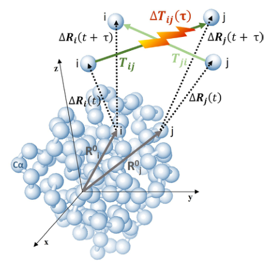
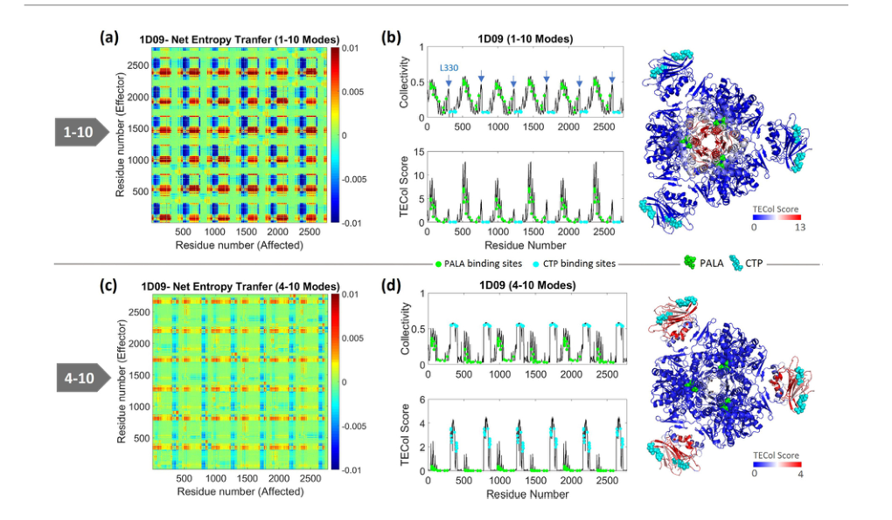
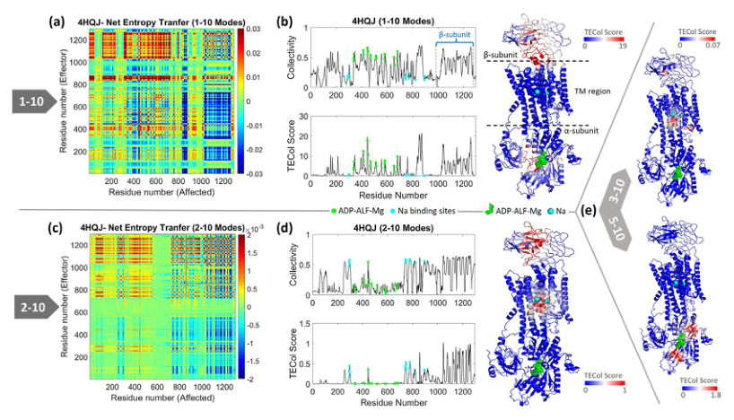
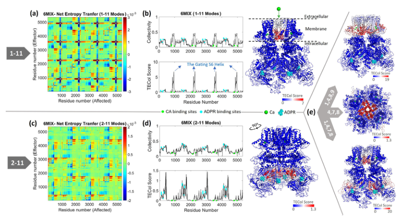
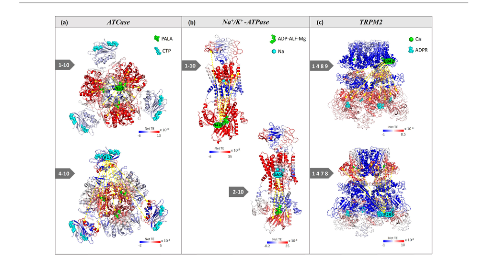
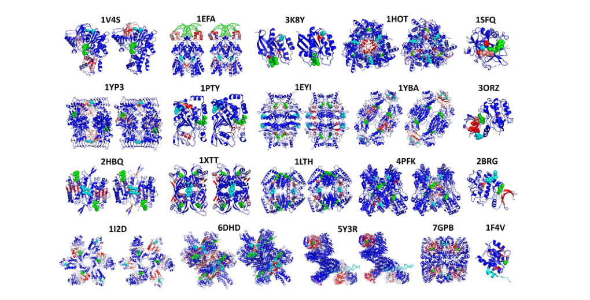

# Subsets of Slow Dynamic Modes Reveal Global Information Sources as Allosteric Sites

### Link: [full article](https://doi.org/10.1016/j.jmb.2022.167644)

Authors: Bengi Altintel, Burcin Acar, Burak Erman, Turkan Haliloglu

Journal of Molecular Biology, September 15, 2022

---
Allosteric regulation is one of the core mechanisms of protein function: a perturbation at one site (such as ligand binding, a point mutation, or a post-translational modification) can affect another functional site that is spatially distant. Conventional analyses usually study a protein's slow collective motions as a whole, but this averaging can mask the signals of secondary functional sites—the slowest, strongest modes obscure the allosteric information carried by other modes.

Turkan Haliloglu's team proposes a new method based on the **Gaussian Network Model (GNM) and Transfer Entropy**: the protein's slow dynamics are split into different subsets of modes, directed information flow between residues is computed within each subset, and the method looks for residues that can **collectively and directionally transmit dynamic information** to a large number of other residues—what the authors call "global information sources."

Systematic validation on **23 proteins** shows that these global information sources overlap closely with known active and allosteric sites: 37 of 46 functional-site predictions are statistically significant (**80.4%**). More importantly, different slow-mode subsets reveal different layers of allosteric pathways—multiple parallel information-transfer networks coexist within the same protein.

## Part 1: Research Question

Allosteric effects do not always propagate along a single, clear structural pathway. A protein's motion can be decomposed into many normal modes: the slowest modes usually correspond to large-scale collective motions, but different slow modes may serve different functional processes—some modes relate to the active site, while others may specifically carry communication from the allosteric site to the active site.

Earlier analyses of dynamic information flow (such as methods based on mutual information or transfer entropy) usually computed over all slow modes together, yielding an averaged residue-residue communication network. The problem with this approach is that the slowest, strongest modes dominate the overall result, so certain weaker but functionally meaningful patterns of information flow are masked. The authors call this phenomenon **mode pollution**: the contamination and masking of functional information patterns by the superposition of irrelevant or overly strong modes.

The core question of this paper is: if a protein's slow dynamics are "viewed layer by layer"—computing directed information flow between residues separately for different subsets of slow modes—do different layers contain different functional information sources? Do these sources correspond to active sites, allosteric sites, or other regulatory sites? What is the direction of information flow between them? Are there layers of allosteric communication that conventional analyses mask?

Some prior work has applied transfer entropy to protein dynamics (for example, the MD-based energy-flow analyses of Leitner and colleagues, and Hacisuleyman and Erman's earlier introduction of transfer entropy into the GNM framework), but all of it computed over the full set of slow modes. The key innovation of this paper is **subset analysis of slow modes**: by systematically splitting and recombining different slow modes, it eliminates mode pollution and reveals, layer by layer, functional information sources hidden in different dynamic layers. The physical intuition is that protein topology supports different types of collective motion at different frequencies, and each type of motion may serve a different functional need.

## Part 2: Methodology: GNM + transfer entropy + slow-mode subset dissection

**Gaussian Network Model (GNM)**

The protein is simplified into an elastic network of Cα atoms—residues closer than 10 Å are connected by springs—and normal modes are obtained by eigendecomposition of the Kirchhoff connectivity matrix. Small eigenvalues correspond to slow, global motions. GNM is an analytical model that requires no time-consuming long molecular dynamics simulations, so it can efficiently handle large proteins with thousands of residues or more (such as the 5348-residue TRPM2 tetramer and the 4670-residue DNA-PK).

**Directional transfer entropy**

Ordinary correlation can only answer whether two residues move together; it cannot distinguish the direction of information flow. Transfer entropy introduces a time delay τ and measures whether knowing how residue i moves now allows a more accurate prediction of residue j's future motion. If the net transfer entropy ΔTi→j = Ti→j - Tj→i is positive, i is an information sender relative to j. GNM can analytically compute time-delayed correlations of residue fluctuations, so transfer entropy can be estimated directly without MD trajectories.

**TECol score: combining information strength and collectivity**

For each residue i, the method sums the positive net transfer entropy it sends to other residues, and uses a collectivity measure, Col, to gauge whether the information is broadly distributed to many other residues (rather than affecting only a few local residues). TECol = Col × ΔTi→rest+. Residues with high TECol satisfy all of the following: strong information transfer, many affected residues, and collective control over the whole protein—that is, they are **global information sources**. The paper's basic hypothesis is that active and allosteric sites are functionally important partly precisely because they have this capacity for global information propagation in specific dynamic modes.

**Slow-mode subset search:** a simple search analyzes modes 1-Ns, 2-Ns, 3-Ns, and so on, progressively removing the slowest modes and observing which residues become information sources in each layer. If the simple search is insufficient, a combinatorial search over combinations of 3-5 modes (for example, modes {1,4,8,9}) is used to further reduce mode pollution. The selection principle is to maximize the collectivity Col of information transfer—Col close to 1/N means information is spread uniformly to all residues (like white noise, with no functional meaning), Col close to 1 means information is highly concentrated on very few residues (a local effect), and the intermediate values chosen in the paper indicate that information is effectively transmitted to a group of functionally related residues. This operation is like viewing a protein's slow dynamics layer by layer: only after the slowest modes are removed do the previously masked secondary information flows emerge.

## Part 3: Key Figure Analysis

The paper chooses three proteins with well-defined allosteric mechanisms as detailed case studies—ATCase (a classic two-state allosteric enzyme), Na+/K+-ATPase (a transmembrane ion pump), and TRPM2 (a ligand-gated ion channel). Their functional sites and allosteric modulators all have reliable experimental annotations, allowing direct comparison with TECol predictions.

### Figure 1: Schematic of GNM-based information transfer

**What this figure asks:** How can "directional" information flow between residues be defined in an elastic network?

{: width="444" height="446" loading="lazy" decoding="async"}

*Figure 1. Schematic of GNM information transfer. Spheres represent residue Cα atoms, R⁰ is the equilibrium position, and ΔR is the fluctuation; after a time delay τ, the net transfer entropy ΔT_ij(τ) between the motion of residue i, ΔR_i(t), and the future motion of residue j defines the direction of information flow.*

The protein is simplified into a Cα elastic network (springs connect residues at distances &lt; 10 Å), and eigendecomposition of the Kirchhoff matrix yields normal modes—small eigenvalues correspond to slow global motions. **Ordinary correlation can only say that two residues "move together"; transfer entropy adds a time delay τ and can distinguish "who moves first and who follows,"** that is, the direction of information flow.

A net transfer entropy ΔT_i→j > 0 means i is the sender. Multiplying by the collectivity Col gives the **TECol score**: residues that combine strong information output, broad reach, and control over the whole protein are "global information sources." Because GNM is an analytical model and needs no MD, it can handle large complexes with thousands of residues (such as the 5348-residue TRPM2 tetramer).

### Figure 2: Dynamic layering of active and allosteric sites in ATCase

**What this figure asks:** Within the same protein, are the active site and the allosteric site hidden in different slow-mode layers?

{: width="1020" height="596" loading="lazy" decoding="async"}

*Figure 2. Two layers of information flow in ATCase (PDB: 1D09). Top row (modes 1-10): high-TECol residues mainly correspond to the PALA active site (green spheres). Bottom row (modes 4-10): after removing the three slowest modes, high-TECol residues instead highlight the CTP allosteric site (cyan spheres). The active and allosteric sites of the same protein are each hidden in a different slow-mode layer.*

**How to read this figure**

ATCase (aspartate transcarbamoylase) is a classic example in allostery research, composed of 6 catalytic subunits and 6 regulatory subunits. The catalytic subunits contain the active site where the PALA analog binds, and the regulatory subunits bind ATP (a positive allosteric effector), CTP (a negative allosteric effector), and UTP. The authors analyzed the PALA-bound R-state structure (PDB: 1D09), using the 10 slowest modes as the initial analysis window (the paper uses Ns=10 as the cutoff).

**The top row (modes 1-10)** is the full analysis including the slowest modes. The net transfer entropy matrix on the left shows the global pattern of directed information flow between residues—information exchange between catalytic and regulatory subunits appears in block patterns, reflecting the distinct intra- and inter-subunit communication channels of a multi-subunit protein. In the TECol profile on the right, the peaks clearly correspond to the PALA active site (green spheres). The active-site residue **A51** can transmit information to the other catalytic subunits, reflecting cooperativity among different catalytic sites—PALA binding affects not only the current pocket but also functional coordination with the other catalytic sites.

**The bottom row (modes 4-10)** removes the three slowest modes. The pattern of the net transfer entropy matrix changes markedly—another layer of information flow that was previously inconspicuous emerges. The TECol peaks no longer point to the active site but shift to the ATP/CTP **allosteric binding region** (cyan spheres; the CTP position is mapped from the T-state structure PDB 1RAC onto the analyzed structure). The allosteric-site residue **V17** becomes a strong global information source, with information flowing mainly to the active sites.

In addition, the C-terminal region A298-N305 of **Helix 12** in the catalytic subunit also shows relatively high TECol. Previous mutagenesis experiments have shown that this region affects trimer stability and the interaction between catalytic and regulatory subunits. This shows that TECol does not merely flag ligand pockets; it can also uncover functional regions related to **quaternary structure stability and subunit assembly**.

The core conclusion of Figure 2: the allosteric site's information is present but masked by stronger slow modes. Analyzing only the average over all slow modes reveals only the active site; the allosteric site appears only after the slowest modes are progressively removed. This speaks directly to the paper's central hypothesis that different functional sites are hidden in different slow-mode layers.

### Figure 3: Layered information flow in Na⁺/K⁺-ATPase

**What this figure asks:** In a transmembrane ion pump, which mode layer harbors the long-range communication between the nucleotide region and the ion region?

{: width="818" height="468" loading="lazy" decoding="async"}

*Figure 3. Na⁺/K⁺-ATPase (PDB 4HQJ). Net transfer entropy maps (a, c) with the corresponding collectivity and TECol scores (b, d), and the structure colored by TECol (e). Top row, modes 1-10; bottom row, modes 2-10.*

This pump uses ATP hydrolysis to pump 3 Na⁺ out and 2 K⁺ in, so the intracellular ATP region and the transmembrane ion region must communicate over long distances. **In modes 1-10, the ADP-site residue N476 is an information source, with information flowing to the Na⁺ region; in modes 2-10, the Na⁺-site residue D808 in turn becomes an information source, sending information back to the ADP region**—the two directions are carried by different modes, mirroring the bidirectional feedback of the E1↔E2 pump cycle. In particular, collectivity is extremely high near E818, and mutations at this site in the human protein disrupt the E1→E2 transition and cause alternating hemiplegia of childhood, offering a dynamic explanation for "long-range disease mutations."

### Figure 4: Multilayer regulation of the TRPM2 ion channel

**What this figure asks:** For a channel that requires two ligands for cooperative activation, in which modes are the gating helix and the two ligand sites hidden?

{: width="818" height="452" loading="lazy" decoding="async"}

*Figure 4. Human TRPM2 ion channel (PDB 6MIX, a 5348-residue tetramer). Net transfer entropy maps (a, c) with collectivity and TECol scores (b, d) and structure coloring (e). Top row, modes 1-11; bottom row, modes 2-11.*

TRPM2 requires cooperative activation by ADPR and Ca²⁺, with rotation of the S6 gating helix opening the pore. **Modes 1-11 highlight the S6 gating helix (the mechanical part that opens the gate), modes 2-11 highlight the ADPR binding region, and the Ca²⁺ site can only be found through combinatorial search**. This is the best illustration of why slow modes must be dissected: the full pathway ADPR↔Ca²⁺→S6 gating→pore opening emerges layer by layer only in different mode combinations. The C4 symmetry of the tetramer also makes some slow modes degenerate, and combinatorial search is precisely what picks out, among the degenerate modes, the subset that best discriminates functional signals.

### Figure 5: Directional allosteric pathways in three proteins

**What this figure asks:** Starting from a global information source, where exactly does the information flow? Is allosteric communication one-way or two-way?

{: width="1020" height="556" loading="lazy" decoding="async"}

*Figure 5. Directional allosteric pathways in three proteins. (a) ATCase: the active site and the allosteric site each dominate a different layer of information transfer. (b) Na+/K+-ATPase: bidirectional communication between the ADP site and the Na+ site. (c) TRPM2: bidirectional information exchange between the Ca2+ binding region and the ADPR binding region. Red indicates strong information received from the source, blue indicates weak reception, and yellow arrows show the main direction of information flow.*

**Core findings from the three cases**

* **Panel a · ATCase**: in modes 1-10, starting from the active-site residue A51, information flows mainly to the active sites on the other catalytic subunits, reflecting cooperativity among catalytic sites. In modes 4-10, starting from the allosteric-site residue V17, information flows mainly to the active-site regions of all subunits. The two directions are carried by different slow modes—the allosteric and active sites form layered communication.
* **Panel b · Na+/K+-ATPase** (PDB: 4HQJ, E1 state): this pump uses ATP hydrolysis to transport 3 Na+ out of the cell and 2 K+ into the cell, so long-range allosteric communication must exist between the intracellular ATP binding region and the transmembrane ion sites. In modes 1-10, the ADP binding-site residue **N476** is the main information source, with information flowing to the Na+ binding region and the β subunit. In modes 2-10 (with the slowest mode removed), the Na+ binding-site residue **D808** becomes the information source, with information flowing back toward the ADP binding region. Together they form bidirectional allosteric communication between the ADP region ↔ Na+ region, with the two directions carried by different modes, consistent with the E1-E2 conformational cycle of the pump—in the E1 state, energy released by ATP hydrolysis drives Na+ efflux, and in the E2 state, conformational change promotes K+ influx; continuous bidirectional information feedback between the nucleotide region and the ion region is required to coordinate this cycle. In modes 2-10, the β-subunit glycosylation sites N158/N193 and the disulfide-bond residues C159-C175 and C213-C276 also appear as information sources, related to stabilization of the Na+-occluded state and regulation of ion transport. Especially noteworthy is the extremely high collectivity of information transfer near residue E818: mutations at this position in the human protein disrupt the E1-to-E2 conformational transition, impair proton transport, and cause **alternating hemiplegia of childhood**—providing a dynamic explanation for how disease mutations can have long-range functional effects.
* **Panel c · TRPM2** (PDB: 6MIX, closed state, 5348-residue tetramer): TRPM2 can be cooperatively activated by ADPR and Ca2+, and rotation of the S6 gating helix opens the channel. In the simple search, modes 1-11 highlight the S6 gating helix ("the mechanical part that executes the opening"), and modes 2-11 highlight the ADPR binding region (ligand regulatory information), but the Ca2+ binding site can only be found by combinatorial search. Modes {1,4,8,9} reveal the Ca2+-binding-region residue **E842** sending information to the ADPR region; modes {1,4,7,8} reveal the ADPR-binding-region residue **Y295** sending information to the Ca2+ region—together forming bidirectional ADPR ↔ Ca2+ information exchange, consistent with the experimental finding that the two ligands must activate the channel cooperatively. Modes {4,7,8} also identify the outer pore region, an important site of allosteric inhibition by Zn2+. Notably, TRPM2 is a tetramer with C4 symmetry, which makes some slow modes degenerate—the same eigenvalue corresponds to equivalent motions in multiple directions. Combinatorial search selects, among degenerate modes, the subset that best discriminates functional signals, which is one of the physical reasons why different mode combinations reveal different regulatory layers. TRPM2 is the best illustration of "why slow modes must be dissected": the complete signaling pathway ADPR ↔ Ca2+ → S6 gating → channel opening emerges layer by layer only in specific mode combinations.

### Figure 6: Overall validation on 23 proteins

**What this figure asks:** Is the overlap between global information sources and functional sites a coincidence of the three case studies, or does it hold generally across many proteins?

{: width="1020" height="520" loading="lazy" decoding="async"}

*Figure 6. TECol summary for 23 proteins. Each structure is colored by TECol (red high, blue low); green spheres are active sites and cyan spheres are allosteric sites. High-TECol regions generally coincide with known functional sites.*

**Data and interpretation**

There is no need to identify every protein individually; the main thing to look for is an overall trend: **many green and cyan functional sites lie near red or warm-colored high-TECol regions**. Each structure shows the result for the slow-mode subset that maximizes the collectivity of information transfer. Of the 46 functional-site predictions across the 23 proteins (20 from an existing allosteric protein dataset plus three additional cases, Na+/K+-ATPase, TRPM2, and DNA-PK), **37 are statistically significant (80.4%)**.

At a 7 Å decision threshold: sensitivity reaches up to **100%**, specificity up to 92%, precision up to 64%, and accuracy up to 85%. For 18 proteins, the simple sequential search already reveals the functional sites; harder cases such as phosphofructokinase and the chemotaxis protein CheY require combinatorial search.

Precision is relatively modest (at most 64%), partly because some "false-positive" high-TECol residues actually correspond to real but not-yet-annotated functional sites—for example, in the PDK1 and CHK1 kinases, extra high-TECol regions coincide with potential drug-binding sites in **Kinase Atlas**; in DNA-PK, an extra information-source region coincides with the BRCA1 binding region, and information flow from the BRCA1-related residue S2056 can reach the kinase catalytic cleft and the DNA-binding region. Sensitivity is not always high because some residues in a binding pocket handle only local roles such as hydrogen bonding or electrostatic positioning; they belong to the binding site but do not necessarily have global information-propagation capacity. When the distance threshold is relaxed to 10 Å, precision rises to 100% in some cases. Methodologically, the statistical test is a permutation test on the spatial overlap between the top 10% TECol residues in each slow-mode subset and the functional sites (p &lt; 0.05 is significant), which avoids relying on visual judgment. However, the 46 tests in the paper were not corrected for multiple comparisons (for example, with Bonferroni), and testing multiple mode subsets separately on the same protein increases the risk of false positives.

## Part 4: Key Contributions

The most valuable part of this paper is not just a new site-prediction score but a perspective on allostery: **a protein's allosteric communication is encoded in multiple subsets of slow modes, with different subsets carrying information flows of different directions and different functional levels**. The three core cases consistently show that information transfer between active and allosteric sites is often bidirectional (active site ↔ CTP allosteric site in ATCase; ADP region ↔ Na+ region in Na+/K+-ATPase; ADPR ↔ Ca2+ in TRPM2), with the two directions carried by different slow modes. This explains why analyzing only the sum over all slow modes misses important regulatory information—the slowest mode often highlights the active site, and the allosteric site appears only after it is removed. The overlap between functional sites and global information sources may reflect evolutionary optimization: protein topology places key sites at network positions suited to influencing global motion, controlling the overall dynamics in an economical way.

For drug design, high-TECol residues directly flag regions with strong, collective information output, matching a requirement that drug targets must meet: perturbing them should produce global functional effects. Because different slow-mode subsets correspond to different allosteric layers, it is theoretically possible to achieve precise modulation that intervenes in only one information flow while preserving other essential functions, which could help reduce the side effects of orthosteric inhibitors. The overlap between disease mutations and high-TECol sites in Na+/K+-ATPase further suggests that the method could help explain why some mutations have long-range functional effects out of proportion to their location. The computational efficiency of GNM (handling proteins with thousands of residues without MD simulations) makes this method a candidate first step for large-scale screening of protein structures—starting from structures predicted in bulk in the AlphaFold database, rapidly flagging likely allosteric hotspots, and then validating the top candidates with more accurate MD or experiments. In addition, the paper's success on TRPM2 and DNA-PK shows that even for very large protein complexes with more than 4000 residues, the combination of GNM + transfer entropy + mode-subset search can still deliver meaningful functional-site predictions in reasonable computational time.

## Part 5: Limitations and Outlook

GNM keeps only Cα nodes, a uniform spring constant, and harmonic fluctuations; it does not explicitly describe differences in side-chain chemistry, the specificity of hydrogen bonds and salt bridges, solvent effects, the lipid membrane environment, or specific ligand interactions, so it is better suited to identifying dynamic trends determined by overall topology. The paper usually analyzes only a single static structure (such as the PALA-bound R state of ATCase, the E1 state of Na+/K+-ATPase, and the closed state of TRPM2), but the slow modes and the ranking of information sources of the same protein may change between apo and ligand-bound states or between active and inactive states—a complete "dynamic allosteric landscape" requires comparing multiple conformational states.

The directional information from transfer entropy must be interpreted with care: a high net transfer entropy does not mean that two residues are in direct contact or that information propagates along a unique path—there may be many intermediate residues between them, or both may be driven by higher-level collective modes. An "information source" is a dynamic network role within the GNM model, and the same residue may behave very differently in different mode combinations.

Although combinatorial search reduces mode pollution, it also introduces flexibility in parameter choice—when searching combinations of 3-5 modes, the number of possible subsets grows rapidly with Ns, and maximizing the collectivity Col, as done in the paper, is only one selection criterion. Experimental validation rests mainly on spatial overlap with known sites and on literature citations; newly predicted sites (such as the extra TECol peaks on the PDK1 kinase), though indirectly supported by databases such as Kinase Atlas, have not yet been systematically tested one by one with mutagenesis experiments. In addition, the method's current validation set of 23 proteins has limited coverage, and whether it generalizes to intrinsically disordered proteins (IDPs) or to the motions of membrane proteins in lipid bilayers remains to be tested.

## About the Corresponding Authors

Turkan Haliloglu is the sole corresponding author of this paper, affiliated with the Department of Chemical Engineering and Polymer Research Center at Bogazici University in Turkey. She received her Ph.D. from Bogazici University and subsequently conducted postdoctoral research in the laboratory of Ivet Bahar at the University of Pittsburgh, where she received systematic training in elastic network models and protein dynamics. The Bahar laboratory is the birthplace of the Gaussian network model; after returning to Turkey, Haliloglu established her own research direction, combining GNM with information-theoretic tools and applying them to the elucidation of allosteric regulation mechanisms, prediction of protein-protein interaction interfaces, and identification of functional sites. Co-author Burak Erman is affiliated with the Department of Chemical and Biological Engineering at Koc University in Turkey, with long-standing research interests in the statistical mechanics of polymers and proteins.

## Citation

Altintel, B., Acar, B., Erman, B., & Haliloglu, T. (2022). Subsets of Slow Dynamic Modes Reveal Global Information Sources as Allosteric Sites. Journal of Molecular Biology, 434(17), 167644. https://doi.org/10.1016/j.jmb.2022.167644
